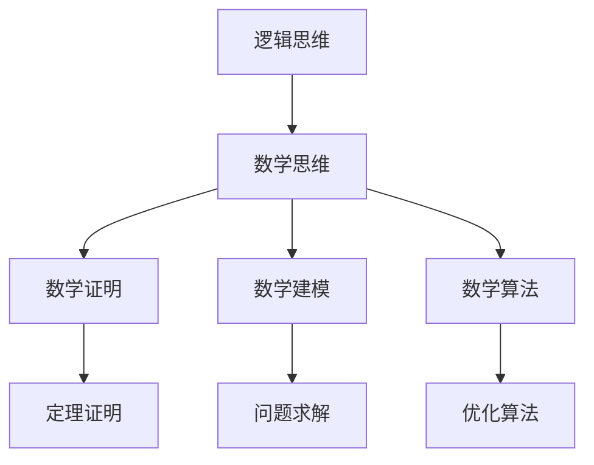

                 

### 《数学思维与心理学的关系探讨》

> **关键词：** 数学思维、心理学、认知功能、情绪调节、教育应用、工作应用
>
> **摘要：** 本文从数学思维和心理学的基础概念出发，探讨两者之间的关系及其在实际应用中的重要性。文章分析了数学思维在心理学中的地位，数学思维与情绪调节、认知功能、教育应用、工作应用等方面的联系，并提供了具体的实例和实战指南。

---

## **第一部分：数学思维概述**

### **第1章：数学思维的基本概念**

**1.1 数学思维的定义与特点**

数学思维是一种基于数学原理和方法解决问题的思维方式。它与逻辑思维密切相关，但又有其独特之处。数学思维强调抽象、推理和证明，是一种系统性、结构性和精确性的思维方式。数学思维的特点包括：

- **抽象性**：数学思维能够从具体的实例中抽象出一般性的规律和概念。
- **推理性**：数学思维依赖于逻辑推理，通过一系列的推理步骤得出结论。
- **证明性**：数学思维强调证明过程，通过严格的逻辑论证来确保结论的可靠性。

**1.2 数学思维的核心要素**

数学思维的核心要素主要包括：

- **基本概念**：如数字、集合、函数、逻辑等。
- **基本原理**：如公理、定理、公式等。
- **方法与技巧**：如数学建模、算法设计、数学证明等。

**1.3 数学思维与逻辑思维的关系**

数学思维和逻辑思维是相互关联、相互促进的。逻辑思维为数学思维提供了推理的基础，而数学思维则通过逻辑推理的过程，进一步发展和完善逻辑思维。数学思维与逻辑思维的关系可以用以下Mermaid流程图表示：

### **第2章：数学思维的心理学基础**

**2.1 心理学对数学思维的影响**

心理学对数学思维的影响体现在多个方面：

- **认知发展**：儿童的认知发展水平直接影响其数学思维的发展。
- **情绪因素**：情绪状态对数学思维的活动有显著影响，如焦虑和压力可能会阻碍数学思维的流畅性。
- **动机因素**：动机水平影响个体对数学问题的探索和解决。

**2.2 数学思维的心理机制**

数学思维的心理机制包括：

- **模式识别**：通过识别模式和规律，快速解决数学问题。
- **记忆功能**：数学思维需要大量的记忆支持，包括公式、定理和算法。
- **注意力分配**：有效的注意力分配能够提高数学思维的效率。

**2.3 心理学研究方法在数学思维研究中的应用**

心理学研究方法在数学思维研究中扮演着重要角色，包括：

- **实验法**：通过设计实验，研究不同因素对数学思维的影响。
- **观察法**：通过观察个体在数学活动中的行为，分析其数学思维过程。
- **调查法**：通过问卷调查，了解个体数学思维的特点和问题。

### **第二部分：心理学视角下的数学思维应用**

### **第3章：数学思维在教育中的应用**

**3.1 数学思维与学习效率**

数学思维能够提高学习效率，主要体现在：

- **问题解决能力**：数学思维帮助学生在面对复杂问题时，能够快速找到解决方案。
- **逻辑推理能力**：数学思维锻炼学生的逻辑推理能力，有助于他们在其他学科中取得更好的成绩。

**3.2 数学思维与教学方法**

有效的数学教学方法应充分考虑数学思维的特点，包括：

- **启发式教学**：通过启发式问题引导学生主动思考，培养他们的数学思维。
- **合作学习**：鼓励学生合作解决问题，提高他们的数学思维和团队合作能力。

**3.3 数学思维与学习策略**

学生可以通过以下学习策略培养数学思维：

- **概念理解**：深入理解数学概念，形成牢固的知识结构。
- **问题解决**：通过解决实际问题，提高数学思维的应用能力。
- **反思与总结**：在解题后进行反思和总结，巩固数学思维成果。

### **第4章：数学思维在工作中的应用**

**4.1 数学思维与创新能力**

数学思维在创新活动中发挥着关键作用，主要体现在：

- **抽象思维**：数学思维能够帮助从复杂问题中抽象出核心要素，形成创新的解决方案。
- **逻辑推理**：数学思维中的逻辑推理能力有助于在创新过程中确保解决方案的合理性。

**4.2 数学思维与问题解决**

数学思维在问题解决中的应用包括：

- **算法设计**：通过设计高效的算法，解决复杂问题。
- **模型构建**：通过建立数学模型，模拟现实问题，找到解决方案。

**4.3 数学思维与团队合作**

在团队合作中，数学思维有助于：

- **沟通协调**：通过清晰的表达和逻辑推理，提高团队沟通效率。
- **任务分配**：通过数学思维，合理分配任务，提高团队工作效率。

### **第三部分：数学思维与心理健康的联系**

### **第5章：数学思维与情绪调节**

**5.1 数学思维对情绪的影响**

数学思维对情绪有积极的影响，包括：

- **压力缓解**：通过解决数学问题，个体能够缓解压力和焦虑。
- **情绪稳定**：数学思维的训练有助于提高个体的情绪稳定性。

**5.2 情绪调节中的数学思维策略**

以下策略可以帮助通过数学思维调节情绪：

- **思维转换**：通过数学问题转移注意力，缓解负面情绪。
- **逻辑分析**：通过逻辑分析，客观看待问题，减少情绪波动。

**5.3 数学思维与心理治疗**

数学思维在心理治疗中的应用包括：

- **认知行为疗法**：通过数学思维训练，改善认知行为，缓解心理问题。
- **问题解决训练**：通过解决实际问题，提高个体的心理适应能力。

### **第6章：数学思维与认知功能**

**6.1 数学思维与记忆力**

数学思维对记忆力有积极影响，包括：

- **逻辑记忆**：通过数学思维训练，提高逻辑记忆能力。
- **工作记忆**：通过数学问题解决，增强工作记忆容量。

**6.2 数学思维与注意力**

数学思维有助于注意力的提升，包括：

- **专注力**：通过数学问题解决，提高专注力。
- **分配注意**：通过数学练习，学会在多个任务间合理分配注意力。

**6.3 数学思维与认知发展**

数学思维对认知发展有重要作用，包括：

- **逻辑推理**：通过数学思维训练，提高逻辑推理能力。
- **问题解决**：通过数学问题解决，提高问题解决能力。

### **第7章：数学思维与心理健康**

**7.1 数学思维与心理疾病的关系**

数学思维与心理疾病之间存在一定的关系，包括：

- **缓解症状**：数学思维有助于缓解某些心理疾病症状，如焦虑和抑郁。
- **预防心理疾病**：通过数学思维训练，提高个体的心理健康水平，预防心理疾病的发生。

**7.2 数学思维对心理疾病的治疗作用**

数学思维在心理疾病治疗中的应用包括：

- **认知行为疗法**：通过数学思维训练，改善认知行为，减轻心理疾病症状。
- **心理训练**：通过数学问题解决，提高个体的心理适应能力，增强心理韧性。

**7.3 心理疾病患者如何培养数学思维**

心理疾病患者可以通过以下方式培养数学思维：

- **逐步学习**：从简单的数学问题开始，逐步增加难度。
- **积极练习**：通过持续的数学练习，提高数学思维水平。
- **心理支持**：在数学学习过程中，得到心理支持和鼓励，增强学习动力。

### **附录**

**附录A：数学思维与心理学关系研究展望**

未来数学思维与心理学的研究将更加深入，包括：

- **交叉学科研究**：数学思维与心理学、教育学、认知科学等学科的交叉研究。
- **技术应用**：将数学思维与人工智能、大数据分析等技术相结合，提升数学思维的应用价值。

**附录B：数学思维与心理学常用研究方法**

常用的数学思维与心理学研究方法包括：

- **实验法**：通过设计实验，研究数学思维对心理学因素的影响。
- **观察法**：通过观察个体在数学活动中的行为，分析数学思维的过程。
- **调查法**：通过问卷调查，收集个体数学思维的特点和问题。

**附录C：数学思维与心理学相关经典文献**

以下是一些数学思维与心理学的经典文献：

- 《数学思维心理学基础》
- 《数学思维与认知发展》
- 《数学思维与情绪调节》

---

### **作者信息**

**作者：AI天才研究院/AI Genius Institute & 禅与计算机程序设计艺术 /Zen And The Art of Computer Programming**

---

**项目小结**

本文通过详细探讨数学思维与心理学的关系，展示了两者在实际应用中的重要性。数学思维不仅对教育、工作和心理健康有着积极影响，还可以作为心理治疗和认知功能提升的工具。未来，随着交叉学科研究的深入，数学思维在各个领域的应用前景将更加广阔。

### **最佳实践 Tips**

1. **培养数学思维习惯**：通过日常的数学练习，如解决数学问题、阅读数学书籍等，逐步提高数学思维能力。
2. **结合心理学原理**：在数学学习过程中，运用心理学原理，如注意力分配、情绪调节等，提高学习效果。
3. **实践与应用**：将数学思维应用于实际问题解决，通过实践检验数学思维的有效性。

### **注意事项**

1. **数学思维的培养需要持之以恒**：数学思维的培养是一个长期的过程，需要持续的努力和实践。
2. **心理支持的重要性**：在数学学习过程中，得到心理支持和鼓励，有助于提高学习动力和效果。

### **拓展阅读**

1. 《数学思维心理学基础》
2. 《数学思维与认知发展》
3. 《数学思维与情绪调节》

通过本文的阅读，我们不仅对数学思维与心理学的关系有了更深刻的理解，也看到了数学思维在各个领域的广泛应用潜力。希望读者能够通过实践和进一步学习，提升自己的数学思维水平，为个人成长和社会进步做出贡献。

