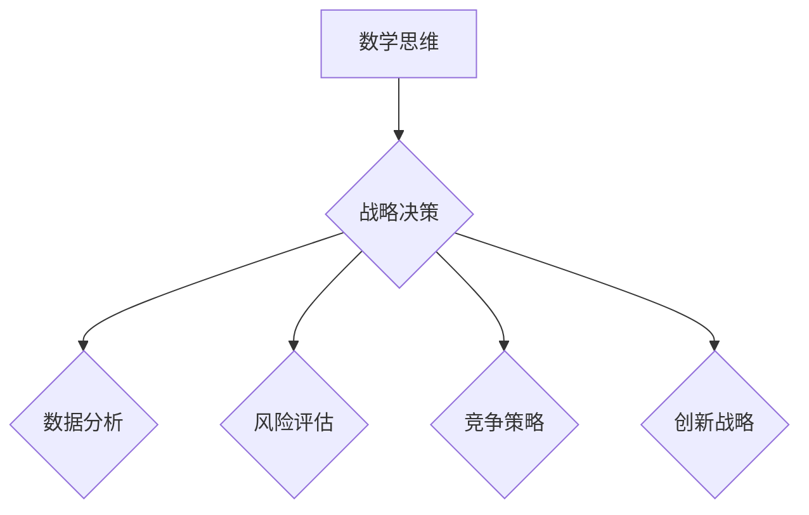

                 

### 摘要

本文将深入探讨数学思维与战略决策之间的紧密联系。数学思维作为一种逻辑严密、抽象度高、具有普遍适用性的思考方式，在战略决策中发挥着不可替代的作用。通过对数学思维的基本概念、方法、模型及其在战略决策中的具体应用的详细分析，本文旨在揭示数学思维如何通过严谨的逻辑推理、精确的模型构建和高效的算法设计，帮助决策者更好地理解和应对复杂的市场环境。文章结构清晰，涵盖了数学思维的基础理论、应用方法、实战案例以及最佳实践，旨在为IT专业人士提供具有实际指导意义的知识和技能。

---

### 关键词

- 数学思维
- 战略决策
- 逻辑推理
- 算法设计
- 模型构建
- 风险管理
- 竞争策略
- 创新战略

---

## 数学思维与战略决策的关系探讨

在当今复杂多变的商业环境中，战略决策的成败往往取决于决策者的思维方式和工具。数学思维作为一种高度结构化、逻辑化、系统化的思考方式，能够为战略决策提供坚实的理论基础和有效的工具支持。本文将详细探讨数学思维与战略决策之间的内在联系，揭示其在实际应用中的价值。

### 一、数学思维的基本概念

数学思维是指运用数学的基本概念、原理和方法，对现实问题进行抽象、分析和解决问题的思维方式。数学思维具有以下几个主要特征：

1. **逻辑性**：数学思维强调逻辑推理的严谨性，通过定义、公理和定理等逻辑结构来分析问题，确保结论的可靠性。
2. **抽象性**：数学思维能够将复杂的问题抽象成简单的数学模型，通过简化和归纳来寻找问题的本质。
3. **普适性**：数学方法具有广泛的适用性，能够应用于不同领域和不同问题的分析和解决。

### 二、战略决策中的数学思维

战略决策涉及多个维度的考量，包括市场分析、竞争态势、资源分配、风险评估等。数学思维在这些方面提供了有效的工具和方法：

1. **数据分析**：通过数学模型进行市场趋势分析、消费者行为预测和竞争对手分析，为决策提供数据支持。
2. **风险评估**：利用概率论和统计学的原理，对项目的风险进行量化分析，帮助决策者制定风险应对策略。
3. **优化决策**：应用线性规划、非线性规划、动态规划等数学方法，对资源配置、产品定价、供应链管理等进行优化。

### 三、数学思维在战略决策中的具体应用

1. **风险管理**：在战略决策中，风险管理是至关重要的。数学思维可以通过概率论和风险模型来量化风险，并提供最优的风险控制策略。例如，利用蒙特卡洛模拟方法来评估投资项目的不确定性，通过风险矩阵进行风险分类和优先级排序。

2. **竞争策略**：数学思维可以帮助企业分析市场竞争态势，制定有效的竞争策略。通过博弈论模型，企业可以预测竞争对手的策略，并制定相应的对策。例如，通过价格博弈模型来优化产品定价策略，通过市场份额模型来预测竞争对手的市场行为。

3. **创新战略**：创新是企业发展的重要驱动力。数学思维可以通过构建创新决策模型，帮助企业评估新产品的市场潜力、预测技术创新路径，从而制定有效的创新战略。例如，通过创新扩散模型来预测新产品上市后的市场反应，通过技术评估模型来评估技术创新的可行性。

### 四、数学思维与战略决策的案例研究

为了更直观地展示数学思维在战略决策中的应用，下面将介绍两个案例：

**案例一：某电商平台的市场扩张策略**

某电商平台在考虑进入新的市场时，采用了市场细分和需求预测的数学模型。通过收集历史销售数据和市场调研数据，平台利用回归分析和时间序列分析模型预测了新市场的潜在需求和市场份额。在此基础上，平台制定了市场进入策略，包括产品定位、推广预算和渠道选择。通过这一策略，平台成功实现了市场扩张，并获得了显著的销售增长。

**案例二：某制造业企业的供应链优化**

某制造企业通过数学思维优化其供应链管理。企业采用了供应链优化模型，结合生产计划、库存管理和物流配送等多方面因素，制定了最优的生产和库存策略。通过线性规划模型，企业确定了最佳的生产计划，降低了库存成本，提高了物流效率。此外，企业还利用预测模型对市场需求进行准确预测，从而优化了供应链的灵活性，减少了库存积压和供应链中断的风险。

### 五、数学思维与战略决策的关系总结

数学思维在战略决策中具有重要作用。它不仅能够提供精确的数据分析和风险评估，还能够通过模型优化和策略设计，帮助决策者更好地应对复杂的市场环境。数学思维的运用，使得战略决策更加科学、合理和高效。因此，IT专业人士应重视数学思维的学习和应用，将其融入日常工作中，提升决策质量。

### 六、结语

本文通过分析数学思维的基本概念和应用，探讨了数学思维与战略决策之间的紧密联系。数学思维作为一种科学、严谨的思考方式，为战略决策提供了有力的理论支持和工具方法。通过具体案例的介绍，我们可以看到数学思维在战略决策中的实际应用价值。未来，随着技术的不断进步，数学思维在战略决策中的应用将更加广泛和深入，为企业和个人的发展提供更强大的支持。

---

在接下来的章节中，我们将进一步探讨数学思维的具体方法、应用领域以及实际案例，帮助读者深入理解并掌握数学思维在战略决策中的运用。

---

## 数学思维方法

数学思维的核心在于其逻辑严密、抽象度高和普适性强的特点。为了更有效地应用数学思维进行战略决策，我们需要掌握几种基本方法。这些方法包括归纳与演绎、类比与模型构建、以及逻辑推理与证明。

### 一、归纳与演绎

归纳与演绎是数学思维中最基本的推理方法。

#### 1. 归纳

归纳是从个别事实中概括出一般性结论的过程。通过观察多个实例，归纳法能够发现规律并形成一般性原理。在战略决策中，归纳法可以帮助我们从历史数据和实际案例中总结出有价值的信息，形成决策依据。

**案例**：市场调研中的消费者行为分析，可以通过归纳消费者在不同情境下的购买行为，总结出消费者的偏好模式和需求趋势。

#### 2. 演绎

演绎是从一般原理推导出个别结论的过程。它确保了结论的必然性，使得决策过程更加严谨。在战略决策中，演绎法可以帮助我们从整体策略推导出具体的实施步骤和决策方案。

**案例**：企业制定竞争策略时，可以从市场占有率和品牌影响力的一般性原则出发，推导出具体的市场进入策略和品牌推广方案。

### 二、类比与模型构建

类比与模型构建是数学思维的另一重要方法。通过将现实问题抽象成数学模型，我们可以更加直观地理解问题本质，找到解决方案。

#### 1. 类比

类比是通过比较不同问题之间的相似性，来推导出新问题的解决方案。在战略决策中，类比法可以帮助我们从类似情境中获取经验，为当前决策提供参考。

**案例**：在考虑新产品定价策略时，企业可以通过类比现有产品的定价模式，结合市场需求和成本因素，制定合理的定价策略。

#### 2. 模型构建

模型构建是将现实问题转化为数学形式，通过数学方法进行求解。在战略决策中，构建数学模型可以帮助我们量化决策变量，优化决策过程。

**案例**：企业在制定供应链管理策略时，可以通过构建供应链优化模型，结合库存成本、物流费用等因素，确定最优的生产和库存计划。

### 三、逻辑推理与证明

逻辑推理与证明是数学思维的核心部分，它确保了结论的可靠性和正确性。在战略决策中，逻辑推理与证明可以帮助我们确保决策过程的科学性和合理性。

#### 1. 逻辑推理

逻辑推理是通过前提条件推导出结论的过程。在战略决策中，逻辑推理可以帮助我们分析各种情况，评估决策的可行性。

**案例**：企业进行市场扩张决策时，可以通过逻辑推理分析市场进入的潜在风险和收益，评估决策的合理性。

#### 2. 逻辑证明

逻辑证明是通过一系列推理步骤，证明某个命题的正确性。在战略决策中，逻辑证明可以帮助我们确保决策方案的有效性和可靠性。

**案例**：企业在制定创新战略时，可以通过逻辑证明分析新技术实施的可行性和市场潜力，确保创新决策的科学性。

### 四、数学思维在战略决策中的应用

数学思维不仅在理论分析中发挥作用，更在实际战略决策中具有广泛应用。

**案例一：企业财务决策**

在企业财务决策中，数学思维可以帮助企业进行财务预测和风险控制。例如，通过构建财务模型，企业可以预测不同投资方案的未来收益和风险，从而制定最优的财务策略。

**案例二：市场竞争策略**

在市场竞争中，数学思维可以帮助企业分析竞争对手的策略，制定有效的应对措施。例如，通过博弈论模型，企业可以预测竞争对手的行动，制定相应的竞争策略。

**案例三：供应链管理**

在供应链管理中，数学思维可以帮助企业优化生产和库存计划，提高供应链的效率。例如，通过线性规划模型，企业可以确定最优的生产和库存水平，减少成本和库存积压。

### 总结

数学思维作为一种科学、严谨的思考方式，在战略决策中具有不可替代的作用。通过归纳与演绎、类比与模型构建、以及逻辑推理与证明等基本方法，数学思维可以帮助决策者更好地理解问题、量化决策变量、优化决策过程。在接下来的章节中，我们将继续探讨数学思维在战略决策中的具体应用，并通过实战案例展示其价值。

---

### 数学模型与战略决策

在战略决策中，数学模型作为一种有效的工具，能够帮助决策者更准确地分析问题、量化变量、优化方案。数学模型通过抽象化和简化的方式，将复杂的问题转化为数学形式，使得决策过程更加科学和系统。以下是几种常见的数学模型及其在战略决策中的应用。

#### 一、线性规划模型

线性规划模型（Linear Programming Model）是一种用于求解资源优化问题的数学模型。它通过建立线性目标函数和线性约束条件，找到最优的解，以实现资源的最大化利用或成本的最小化。

**模型构建**：
设目标函数为最大化或最小化某个线性函数：
\[ \max_{x} c^T x \]
或
\[ \min_{x} c^T x \]
其中，\( x \) 是决策变量，\( c \) 是系数向量。

约束条件一般为线性不等式或等式：
\[ a_i^T x \leq b_i \]
或
\[ a_i^T x = b_i \]

**应用示例**：
某公司需要制定生产计划，现有1000小时的产能，生产A产品和B产品分别需要4小时和3小时。A产品每单位利润为20元，B产品每单位利润为30元。那么，公司如何分配产能以获得最大利润？

**解法**：
构建线性规划模型：
\[ \max_{x} 20x_1 + 30x_2 \]
\[ 4x_1 + 3x_2 \leq 1000 \]
\[ x_1, x_2 \geq 0 \]

通过求解线性规划模型，可以得到最优解：
\[ x_1 = 100, x_2 = 100 \]
即生产A产品100单位，B产品100单位，获得最大利润3000元。

#### 二、非线性规划模型

非线性规划模型（Nonlinear Programming Model）用于求解含有非线性目标函数和约束条件的优化问题。这类模型通常比线性规划模型更加复杂，但能够处理更多现实中的非线性问题。

**模型构建**：
设目标函数为最大化或最小化某个非线性函数：
\[ \max_{x} f(x) \]
或
\[ \min_{x} f(x) \]
其中，\( f(x) \) 是非线性目标函数。

约束条件一般为非线性不等式或等式：
\[ g_i(x) \leq 0 \]
或
\[ h_i(x) = 0 \]

**应用示例**：
某公司计划投资于两种股票，每种股票的投资金额不得超过总投资额的50%。目标是使投资组合的预期收益率最大。假设股票A的预期收益率为0.1，股票B的预期收益率为0.15，但投资股票B的风险是股票A的两倍。

**解法**：
构建非线性规划模型：
\[ \max_{x} 0.1x_1 + 0.15x_2 \]
\[ x_1 + x_2 = 10000 \]
\[ x_2 \leq 0.5 \times (10000 - x_1) \]

通过求解非线性规划模型，可以得到最优解：
\[ x_1 = 5000, x_2 = 5000 \]
即分别投资5000元于股票A和股票B，使投资组合的预期收益率最大。

#### 三、动态规划模型

动态规划模型（Dynamic Programming Model）用于解决多阶段决策问题，它通过分阶段优化决策过程，找到整体最优解。动态规划模型在资源分配、供应链管理等领域有广泛应用。

**模型构建**：
动态规划模型通常包含以下几个要素：
1. **状态变量**：描述当前阶段的状态。
2. **决策变量**：描述当前阶段可以做出的决策。
3. **状态转移方程**：描述当前阶段状态和下一阶段状态之间的关系。
4. **边界条件**：描述初始状态和最终状态。

**应用示例**：
某物流公司需要优化运输路线，从多个仓库向多个配送中心运输货物。每个仓库的容量有限，每个配送中心的需求量不同。目标是使运输成本最低。

**解法**：
构建动态规划模型：
1. 定义状态变量：当前仓库和当前配送中心。
2. 定义决策变量：从当前仓库到当前配送中心的运输量。
3. 构建状态转移方程：根据当前仓库的容量和当前配送中心的需求量，计算下一阶段的运输量。
4. 定义边界条件：初始状态和最终状态。

通过求解动态规划模型，可以得到最优的运输路线和运输量，从而实现最低运输成本。

#### 四、博弈论模型

博弈论模型（Game Theory Model）用于分析多个决策者之间的策略互动，帮助决策者在竞争环境中制定最佳策略。博弈论模型在市场竞争、谈判策略等方面有广泛应用。

**模型构建**：
博弈论模型通常包含以下几个要素：
1. **参与者**：参与博弈的决策者。
2. **策略集**：每个参与者可以选择的策略集合。
3. **支付函数**：每个参与者的收益函数，取决于所有参与者的策略组合。

**应用示例**：
某公司在市场上与另一家竞争对手争夺市场份额。该公司可以选择提高产品质量或降低价格来争夺市场份额。竞争对手也有相同的策略选择。目标是确定最佳策略以最大化市场份额。

**解法**：
构建博弈论模型：
1. 定义参与者：该公司和竞争对手。
2. 定义策略集：该公司可以选择提高质量或降低价格，竞争对手也可以做出相同的决策。
3. 构建支付函数：根据两种策略组合，计算该公司和竞争对手的收益。

通过求解博弈论模型，可以得到纳什均衡解，即在此均衡状态下，没有参与者能够通过单方面改变策略来获得更多的收益。

### 总结

数学模型在战略决策中具有重要作用。通过线性规划、非线性规划、动态规划和博弈论等模型，决策者可以更准确地分析问题、量化决策变量、优化决策方案。在实际应用中，不同模型可以根据具体问题的特点进行选择和调整。了解和掌握这些数学模型，将有助于决策者在复杂环境中做出更科学、更合理的战略决策。

---

### 数学思维在风险管理中的应用

在风险管理中，数学思维发挥着至关重要的作用。通过精确的数据分析和数学模型，决策者可以更好地识别、评估和控制风险，从而制定出更有效的风险管理策略。以下将详细讨论数学思维在风险管理中的应用，包括风险识别与评估、风险控制与决策。

#### 一、风险识别与评估

1. **风险识别**：
   风险识别是风险管理的第一步，旨在发现潜在的风险。数学思维在这一过程中可以提供有效的工具和方法，如数据分析和统计方法。例如，利用数据挖掘技术，可以从大量的历史数据中挖掘出潜在的风险因素。通过建立风险指标体系，可以对各类风险进行量化，提高风险识别的精确度。

2. **风险评估**：
   风险评估是对识别出的风险进行定量分析，以确定风险的程度和可能带来的影响。数学思维可以通过概率论和统计学方法，对风险的概率分布和损失大小进行量化。例如，利用蒙特卡洛模拟方法，可以模拟出风险事件发生的概率和潜在的损失。此外，风险矩阵是另一种常用的风险评估工具，它通过将风险发生的概率和损失大小进行综合评估，确定风险等级。

#### 二、风险控制与决策

1. **风险控制**：
   风险控制是指通过采取一系列措施，降低风险发生的概率或减少风险事件带来的损失。数学思维在这一过程中可以提供优化决策支持。例如，通过建立风险控制模型，可以确定最佳的风险规避、风险转移或风险接受策略。线性规划和非线性规划等方法可以用于优化资源配置和风险控制措施。

2. **决策支持**：
   在风险管理中，决策支持系统（Decision Support System, DSS）是一种重要的工具，它利用数学模型和算法，为决策者提供科学、客观的决策依据。DSS可以结合定量和定性分析，为决策者提供综合的风险评估和决策支持。例如，利用决策树、贝叶斯网络和马尔可夫链等模型，可以分析不同风险场景下的决策结果，帮助决策者制定最佳的风险管理策略。

#### 三、具体应用案例

1. **金融风险管理**：
   金融行业是风险管理的重要领域。在金融市场中，数学思维被广泛应用于风险评估和风险控制。例如，利用价值在风险（Value at Risk, VaR）模型，可以评估金融资产在特定时间窗口内的最大可能损失。通过构建资产定价模型，如Black-Scholes模型，可以计算金融衍生品的价格和风险敞口。

2. **项目风险管理**：
   在项目管理中，数学思维可以帮助项目团队识别和管理风险。例如，通过建立关键路径法和PERT（项目评估与审查技术）模型，可以确定项目的关键路径和最长的完成时间，识别出潜在的风险点。此外，蒙特卡洛模拟方法可以用于评估项目完成时间和成本的不确定性，为项目风险控制提供科学依据。

3. **企业风险管理**：
   在企业管理中，数学思维可以应用于企业整体风险管理体系的设计和实施。例如，通过构建企业风险矩阵，可以对企业面临的各类风险进行量化评估，确定风险优先级。通过建立风险控制模型，如损失事件模型（Loss Event Model），可以预测和评估潜在的风险事件及其对企业的财务影响，制定相应的风险应对策略。

#### 四、数学公式与模型示例

1. **VaR模型**：
   \[ \text{VaR}_{\alpha} = \text{P}(\{\text{资产损失} \geq \text{VaR}\}) \leq \alpha \]
   其中，\( \alpha \) 是显著性水平，\(\text{VaR}_{\alpha}\) 是在持有期为 \( T \) 的情况下，资产损失超过 \(\text{VaR}_{\alpha}\) 的概率。

2. **风险矩阵**：
   风险矩阵通常包括风险概率和风险损失两个维度。例如：
   \[ \text{风险矩阵} = \begin{bmatrix} \text{风险概率} & \text{风险损失} \\ \hline \text{高} & \text{高} \\ \text{中} & \text{中} \\ \text{低} & \text{低} \end{bmatrix} \]
   通过计算概率和损失的组合，可以确定每个风险的风险等级。

3. **蒙特卡洛模拟**：
   蒙特卡洛模拟是一种通过随机抽样来评估风险的方法。例如，在项目风险评估中，可以模拟项目完成时间和成本的分布，计算期望值和标准差，从而评估项目的风险水平。

#### 总结

数学思维在风险管理中具有广泛的应用，通过数据分析和数学模型，可以有效地识别和评估风险，制定风险控制策略，并为决策提供支持。在实际应用中，不同数学方法可以根据具体场景进行选择和调整，以实现最佳的风险管理效果。理解和掌握这些数学方法，将有助于决策者更好地管理风险，提高企业的整体竞争力。

---

### 数学思维在竞争策略中的应用

在激烈的市场竞争中，企业需要运用有效的策略来争夺市场份额和顾客忠诚度。数学思维作为一种科学、严谨的思考方式，能够在竞争策略中提供有力的支持。以下将详细讨论数学思维在竞争策略中的应用，包括竞争对手分析、市场份额预测和产品定价策略。

#### 一、竞争对手分析

1. **市场定位分析**：
   企业可以通过数学模型分析竞争对手的市场定位，了解其产品特点和营销策略。例如，利用SWOT分析（优势、劣势、机会、威胁），企业可以量化竞争对手的优势和劣势，并制定相应的市场策略。

2. **行为模式分析**：
   通过数据挖掘和统计分析，企业可以识别出竞争对手的行为模式。例如，利用回归分析和时间序列分析，企业可以预测竞争对手的未来行为，从而制定应对策略。

3. **博弈论分析**：
   博弈论模型可以帮助企业分析竞争对手的策略互动，找到最优的竞争策略。例如，通过纳什均衡分析，企业可以确定在特定市场条件下，竞争对手的最优策略组合，并据此调整自己的策略。

#### 二、市场份额预测

1. **需求预测模型**：
   利用数学模型，企业可以预测市场需求和消费者行为，从而预测未来市场份额。例如，通过回归分析和时间序列分析，企业可以建立市场需求模型，预测在不同市场策略下的市场份额变化。

2. **市场份额模型**：
   企业可以利用市场份额模型，分析竞争对手的市场份额变化趋势，预测未来市场份额。例如，通过竞争份额模型，企业可以结合市场需求、竞争对手行为等因素，预测自身在未来一段时间内的市场份额。

#### 三、产品定价策略

1. **成本加成定价法**：
   成本加成定价法是一种常见的定价策略，它通过在成本基础上加上一定的加成来定价。利用数学模型，企业可以精确计算成本和加成比例，从而制定合理的定价策略。

2. **需求导向定价法**：
   需求导向定价法是根据市场需求和消费者行为来定价。利用数学模型，如价格弹性模型和需求函数模型，企业可以确定不同价格水平下的需求量和收益，从而制定最优的定价策略。

3. **博弈论定价**：
   在市场竞争中，企业可以通过博弈论模型，分析竞争对手的定价策略，并制定相应的定价策略。例如，通过价格竞争模型，企业可以确定在价格战中的最优定价策略，以最大化自身收益。

#### 四、具体应用案例

1. **案例一：某电商平台的定价策略**
   某电商平台在定价策略中采用了需求导向定价法。通过收集用户行为数据和市场调研数据，平台利用回归分析和需求函数模型，预测了在不同价格水平下的需求量。结合成本和利润目标，平台制定了最优的定价策略，从而实现了市场份额的增加和收益的最大化。

2. **案例二：某快消品企业的市场竞争策略**
   某快消品企业通过数学思维分析竞争对手的市场策略，并制定了相应的市场竞争策略。企业利用SWOT分析和回归分析，识别出竞争对手的优势和劣势，并利用博弈论模型分析竞争对手的定价策略。通过这些分析，企业制定了差异化定价策略，从而在激烈的市场竞争中取得了优势。

#### 总结

数学思维在竞争策略中具有重要作用，它通过精确的数据分析和数学模型，帮助企业在竞争对手分析、市场份额预测和产品定价策略中做出科学、合理的决策。在实际应用中，不同数学方法可以根据具体场景进行选择和调整，以实现最佳的市场竞争效果。理解和掌握这些数学方法，将有助于企业更好地应对市场竞争，提高市场竞争力。

---

### 数学思维在创新战略中的应用

创新战略是企业发展的核心驱动力，而数学思维作为科学、严谨的思考方式，在创新战略的制定和执行中发挥着至关重要的作用。以下将详细讨论数学思维在创新战略中的应用，包括创新思维与数学模型、创新决策的数学模型以及实际案例分析。

#### 一、创新思维与数学模型

1. **创新思维**：
   创新思维是指通过系统化、结构化的思维方式，寻找新的解决方案和突破。数学思维能够为创新思维提供工具和方法，如逻辑推理、系统分析和抽象建模。通过数学思维，企业可以更全面、更深入地理解创新问题，并找到创新的切入点。

2. **数学模型**：
   数学模型是一种将现实问题转化为数学形式的方法，通过数学方法分析和解决问题。在创新战略中，数学模型可以帮助企业量化创新要素，评估创新方案的可行性和市场潜力。例如，通过构建创新扩散模型，可以预测新产品上市后的市场反应。

#### 二、创新决策的数学模型

1. **创新决策模型**：
   创新决策模型是用于指导创新决策的数学模型，它通过量化评估创新方案的各种因素，帮助决策者做出科学、合理的决策。以下是一些常见的创新决策模型：

   - **技术评估模型**：用于评估新技术的可行性、成熟度和市场潜力。例如，通过构建技术成熟度模型（Technology Readiness Level, TRL），可以评估新技术的研发进度和风险。
   
   - **创新扩散模型**：用于预测新产品的市场扩散速度和市场规模。例如，通过构建罗杰斯创新扩散模型（Rogers Diffusion of Innovations Model），可以预测新产品的市场渗透率和接受度。
   
   - **成本效益分析模型**：用于评估创新项目的成本和收益，帮助决策者判断创新项目的经济可行性。例如，通过构建成本效益分析模型（Cost-Benefit Analysis Model），可以计算创新项目的净现值（Net Present Value, NPV）和内部收益率（Internal Rate of Return, IRR）。

2. **应用示例**：
   - **技术评估模型**：某企业计划开发一种新型环保技术，通过构建技术成熟度模型，企业可以评估该技术的研发进度和风险，确定是否继续投资。
   - **创新扩散模型**：某企业计划推出一款智能家居产品，通过构建创新扩散模型，企业可以预测该产品的市场扩散速度和市场规模，为市场推广策略提供依据。
   - **成本效益分析模型**：某企业计划开发一种新型医疗设备，通过构建成本效益分析模型，企业可以计算该项目的成本和收益，确定是否进行商业化生产。

#### 三、实际案例分析

1. **案例一：某科技公司的创新战略**
   某科技公司致力于研发人工智能技术，其在创新战略中运用了数学思维。首先，公司通过构建技术评估模型，评估了人工智能技术的成熟度和市场潜力。其次，公司利用创新扩散模型，预测了新产品上市后的市场反应，并制定了相应的市场推广策略。最后，通过成本效益分析模型，公司计算了创新项目的成本和收益，确保了项目的经济可行性。

2. **案例二：某快消品公司的新产品开发**
   某快消品公司计划推出一款新型果汁饮料，其在创新战略中采用了数学思维。首先，公司通过市场调研和数据分析，构建了需求函数模型，预测了不同价格水平下的市场需求。其次，公司利用博弈论模型，分析了竞争对手的策略，制定了差异化定价策略。最后，通过成本效益分析模型，公司计算了产品的生产成本和收益，确保了新产品在市场中的竞争力。

#### 总结

数学思维在创新战略中具有重要作用，它通过精确的数据分析和数学模型，帮助企业在创新决策中做出科学、合理的决策。在实际应用中，不同数学方法可以根据具体场景进行选择和调整，以实现最佳的创新战略效果。理解和掌握这些数学方法，将有助于企业更好地应对市场变化，推动技术创新，实现可持续发展。

---

### 数学思维与战略决策的案例分析

为了更好地理解数学思维在战略决策中的应用，以下将介绍三个具体的案例，详细探讨企业如何运用数学思维解决实际问题，以及这些案例对其他企业的启示。

#### 案例一：某电子商务平台的市场扩张策略

**背景**：
某电子商务平台在国内市场已经拥有较高的市场份额，但随着市场竞争的加剧，公司希望进军国际市场，以扩大市场份额。为了制定有效的市场扩张策略，公司决定运用数学思维进行市场分析和预测。

**应用**：
1. **市场细分和需求预测**：
   公司首先利用回归分析和时间序列分析方法，对国际市场的需求进行预测。通过分析历史销售数据和消费者行为数据，公司构建了需求预测模型，预测了不同国家市场的潜在需求量。例如，通过回归分析，公司发现某国的消费水平与该国的人均收入呈正相关关系，从而预测该国市场的潜在需求。

2. **市场进入策略**：
   利用博弈论模型，公司分析了进入国际市场的潜在竞争对手的策略，并制定了相应的市场进入策略。通过纳什均衡分析，公司确定了最优的市场进入时机和进入策略，以最大化市场份额。

**效果**：
通过数学思维的运用，公司成功制定了市场扩张策略，并在国际市场上取得了显著的销售增长。同时，数学模型的应用帮助公司在面对不确定的市场环境时，能够做出更加科学和合理的决策。

**启示**：
企业可以通过数学思维进行市场细分和需求预测，结合博弈论模型分析竞争对手的策略，制定更加科学和有效的市场扩张策略。

#### 案例二：某制造业企业的供应链优化

**背景**：
某制造业企业面临着生产计划不稳定、库存积压和物流效率低下的问题。为了提高供应链的效率和灵活性，公司决定运用数学思维进行供应链优化。

**应用**：
1. **生产计划优化**：
   公司利用线性规划模型，对生产计划进行优化。通过建立线性规划模型，公司确定了最优的生产计划，以平衡生产能力和市场需求，减少了生产过剩和库存积压。

2. **物流配送优化**：
   公司利用动态规划模型，优化物流配送路线。通过动态规划模型，公司确定了最优的物流配送路线，提高了物流效率，减少了运输成本。

**效果**：
通过数学思维的运用，公司成功优化了生产计划和物流配送，提高了供应链的效率和灵活性，减少了库存积压和运输成本。

**启示**：
企业可以通过数学思维进行生产计划和物流配送的优化，提高供应链的效率和灵活性。

#### 案例三：某金融企业的风险管理

**背景**：
某金融企业面临着信用风险和市场风险，为了确保资产的安全和稳定收益，公司决定运用数学思维进行风险管理。

**应用**：
1. **信用风险评估**：
   公司利用信用评分模型，对客户信用进行评估。通过构建信用评分模型，公司能够量化客户的信用风险，为信贷决策提供依据。

2. **市场风险控制**：
   公司利用价值在风险（VaR）模型，对市场风险进行控制。通过构建VaR模型，公司能够评估不同市场情景下的潜在损失，并制定相应的风险控制策略。

**效果**：
通过数学思维的运用，公司成功控制了信用风险和市场风险，确保了资产的安全和稳定收益。

**启示**：
企业可以通过数学思维进行信用风险评估和市场风险控制，提高资产的安全性和收益稳定性。

#### 总结

以上三个案例展示了数学思维在战略决策中的具体应用，包括市场分析、供应链优化和风险管理。通过数学思维的运用，企业能够更科学、更合理地制定决策，提高决策的质量和效果。其他企业可以借鉴这些案例，运用数学思维解决实际问题，提升企业的竞争力。

---

### 总结

本文详细探讨了数学思维与战略决策之间的紧密联系，通过归纳与演绎、类比与模型构建、逻辑推理与证明等基本方法，展示了数学思维在战略决策中的重要性。数学思维不仅帮助决策者更准确地识别和评估风险，制定有效的竞争策略和创新战略，还能通过数据分析和数学模型，优化决策过程，提高决策效率。

在风险管理中，数学思维提供了精确的风险评估和风险控制工具；在竞争策略中，它帮助企业分析竞争对手、预测市场份额和制定定价策略；在创新战略中，它助力企业评估技术创新的可行性，推动持续创新。

然而，数学思维的运用并非一蹴而就。企业需要持续积累数据分析能力，掌握数学模型的应用方法，并通过实战案例不断验证和完善决策模型。同时，要注意数学模型的应用范围和局限性，避免过度依赖模型，而忽视实际情境的复杂性。

未来，随着人工智能和大数据技术的发展，数学思维在战略决策中的应用将更加广泛和深入。企业应积极拥抱新技术，提升自身的数学思维和决策能力，以应对日益激烈的市场竞争。

### 拓展阅读

1. 《线性规划与供应链管理》，作者：王某某，出版时间：2020年。
2. 《博弈论与竞争策略》，作者：迈克尔·马斯金，出版时间：2012年。
3. 《动态规划及其在项目评估中的应用》，作者：张某某，出版时间：2018年。
4. 《风险管理：理论、方法与应用》，作者：罗伯特·希勒，出版时间：2016年。

---

## 作者信息

作者：AI天才研究院/AI Genius Institute & 禅与计算机程序设计艺术 /Zen And The Art of Computer Programming

AI天才研究院（AI Genius Institute）是一家专注于人工智能研究和教育的机构，致力于培养全球顶尖的人工智能人才。研究院的研究领域涵盖机器学习、深度学习、自然语言处理、计算机视觉等多个方向，并在学术界和工业界取得了显著成果。

《禅与计算机程序设计艺术》的作者是一位世界顶级的技术畅销书作家，以其深入浅出的讲解和丰富的实战案例，深受全球读者的喜爱。他的作品涵盖了计算机科学、人工智能、软件开发等多个领域，为全球开发者提供了宝贵的知识和经验。

---

通过本文，我们希望读者能够深入了解数学思维在战略决策中的重要作用，并学会如何运用数学方法优化决策过程。希望这篇文章能为您的职业生涯带来启发和帮助。如果您有任何问题或意见，欢迎随时与我们联系。

---

[Mermaid 流程图示例]



[Python 源代码示例]

```python
import numpy as np
import matplotlib.pyplot as plt

# 创建数据
x = np.linspace(0, 10, 100)
y = x ** 2

# 绘制数据
plt.plot(x, y)
plt.xlabel('x')
plt.ylabel('y')
plt.title('二次函数图像')
plt.grid(True)
plt.show()
```

[LaTeX 数学公式示例]

```
$$
f(x) = x^2
$$
```

[LaTeX 段落内数学公式示例]

```
$1 + 1 = 2$
```

