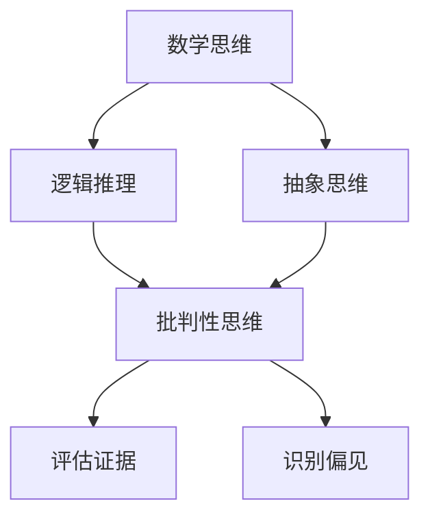

                 

# 数学思维与批判性思维的培养

## 关键词
数学思维，批判性思维，逻辑推理，算法，模型，教育方法，实战应用

## 摘要
本文旨在深入探讨数学思维与批判性思维的培养。首先，我们将介绍数学思维和批判性思维的基本概念和原理。接着，我们将分析这两者之间的关系，并探讨如何通过教育方法来培养这些思维能力。随后，我们将通过具体的算法和数学模型，结合Python源代码进行详细讲解，并探讨实际应用中的实战案例。最后，我们将总结本文的主要观点，并提出未来研究的方向。

## 引言

在当今这个信息爆炸的时代，拥有良好的数学思维和批判性思维已经成为一种不可或缺的能力。无论是在科学研究、工程实践，还是在日常生活的决策中，这两种思维能力都发挥着至关重要的作用。数学思维强调逻辑推理、抽象思维和问题解决能力，而批判性思维则注重质疑假设、评估证据和识别偏见。

数学思维和批判性思维不仅有助于提高个人的认知水平，还能促进创新和创造力的发展。然而，如何培养这些思维能力呢？这需要我们深入了解它们的基本概念和原理，并通过科学的教育方法和实际应用来不断锻炼。

本文将围绕数学思维与批判性思维的培养展开讨论，旨在为读者提供一份全面而深入的理解。首先，我们将介绍数学思维和批判性思维的基本概念和原理，并探讨它们之间的内在联系。接下来，我们将通过具体的算法和数学模型，结合Python源代码进行详细讲解。随后，我们将探讨如何通过教育方法来培养这些思维能力，并分享一些成功的教育案例。最后，我们将通过实战应用案例，展示数学思维和批判性思维在实际问题解决中的重要性。

通过本文的阅读，读者将能够了解数学思维和批判性思维的基本原理，掌握培养这些思维能力的方法，并学会如何在实际问题中运用这些思维技巧。

### 数学思维的基本概念与原理

数学思维是一种基于数学概念和原理进行逻辑推理和抽象思考的思维方式。它不仅仅是解决数学问题，更是一种分析问题、构建模型和解决问题的综合能力。数学思维的核心在于逻辑推理和抽象思维，这两者是数学思维的基石。

**逻辑推理**是数学思维中至关重要的一部分。它指的是通过一系列逻辑步骤，从一个或多个已知陈述推导出新的陈述。逻辑推理要求我们遵循一定的规则，比如演绎推理和归纳推理。在数学中，逻辑推理体现在证明过程中，它能够确保我们得到的结论是正确和可靠的。

**抽象思维**则是数学思维中的另一关键要素。抽象思维指的是从具体的、感性的对象中提取出共性的、本质的属性和规律，并将其概括化、形式化。数学中的抽象思维体现在将实际问题转化为数学模型，通过符号和公式来描述和解决问题。

数学思维的基本原理可以总结为以下几点：

1. **一致性原理**：数学系统内部各个部分之间应保持一致性，不会出现逻辑矛盾。
2. **公理化的原理**：数学理论建立在一些基本假设（公理）上，通过逻辑推理得出结论。
3. **形式化的原理**：数学中的概念和推理过程被形式化为符号和公式，使得推理更加严谨和精确。
4. **问题解决原理**：通过构建数学模型，将实际问题转化为数学问题，然后利用数学工具和方法进行求解。

为了更好地理解数学思维的基本原理，我们可以通过一个简单的例子来具体说明。假设我们要解决一个面积计算的问题。首先，我们需要明确问题的定义，即计算一个矩形或圆形的面积。接下来，我们通过抽象思维，将实际问题转化为数学模型，即使用符号和公式表示面积。例如，矩形的面积可以表示为长乘以宽，即 \( A = l \times w \)。圆形的面积可以表示为半径的平方乘以 π，即 \( A = \pi r^2 \)。

然后，我们使用逻辑推理来验证这些公式的正确性。例如，对于矩形，我们可以通过直观的观察和实际的测量来验证面积公式。对于圆形，我们可以利用圆的周长公式 \( C = 2\pi r \) 来推导出面积公式。这种逻辑推理过程确保了我们的结论是正确和可靠的。

综上所述，数学思维是一种通过逻辑推理和抽象思维来分析和解决问题的思维方式。它基于一致性的原理、公理化的原理、形式化的原理和问题解决的原理。通过理解和掌握这些原理，我们能够更有效地应用数学思维来应对各种问题。

### 批判性思维的基本概念与原理

批判性思维是一种积极的思考过程，它强调质疑假设、评估证据、识别偏见和推理的有效性。这种思维方式不仅仅是对信息的接受和记忆，更是一种主动分析和评估信息的能力。批判性思维是科学探索、决策制定和日常生活中不可或缺的一部分。

**质疑假设**是批判性思维的核心。它意味着对任何陈述或理论进行深入思考，并质疑其背后的假设。通过质疑假设，我们能够发现潜在的偏见和错误，从而避免盲目接受未经检验的观点。

**评估证据**是批判性思维中的另一个关键要素。它涉及对信息的来源、可靠性和相关性进行评估。批判性思维要求我们寻找可靠的证据来支持或反驳一个观点，并避免依赖于单一来源或未经证实的信息。

**识别偏见**是批判性思维的第三大原则。偏见是人们在做决策时由于心理或认知上的偏差而产生的错误判断。常见的偏见包括确认偏见、可用性偏见和群体偏见等。通过识别这些偏见，我们能够更客观和全面地评估信息，避免做出错误的决策。

批判性思维的基本原理可以总结为以下几点：

1. **系统性原理**：批判性思维要求我们对问题进行全面的、多角度的思考，而不是局限于某一方面的信息。
2. **证据导向原理**：所有结论都应该基于可靠的证据，而不是基于个人的情感、偏好或未经证实的传闻。
3. **推理有效原理**：批判性思维强调推理过程的有效性，包括逻辑一致性和逻辑严谨性。
4. **开放性原理**：批判性思维要求我们保持开放的心态，接受不同的观点和证据，并愿意调整自己的观点。

为了更好地理解批判性思维的基本原理，我们可以通过一个简单的例子来说明。假设我们要评估一个健康饮食计划。首先，我们需要质疑该计划的假设，例如“所有高纤维食物都有益健康”。接下来，我们评估支持这一假设的证据，如研究论文、专家意见和临床试验结果。通过这些证据，我们可以判断该假设是否合理。

然后，我们需要识别潜在的偏见，例如“人们更倾向于相信他们喜欢的事物”。这意味着我们需要考虑不同来源的证据，而不是仅依赖于我们喜欢的证据。最后，我们通过逻辑推理来评估整个饮食计划的可行性，包括营养摄入、成本效益和长期效果。

综上所述，批判性思维是一种通过质疑假设、评估证据和识别偏见来分析和评估信息的思维方式。它基于系统性的原理、证据导向原理、推理有效原理和开放性原理。通过理解和掌握这些原理，我们能够更有效地应用批判性思维来评估信息和做出明智的决策。

### 数学思维与批判性思维的关系

数学思维和批判性思维虽然在不同领域发挥作用，但它们之间存在着紧密的联系和相互作用。理解这种关系对于全面培养这两种思维能力至关重要。

首先，**数学思维**为**批判性思维**提供了逻辑推理和抽象思维的基础。数学思维强调逻辑推理，使我们能够通过一系列严谨的步骤来推导出结论。这种逻辑性不仅能够帮助我们在数学问题中找到解决方案，还能在批判性思维中用于评估证据和推理的有效性。例如，在批判性思维中，我们需要评估某个观点的合理性，而逻辑推理使我们能够发现逻辑矛盾和推理错误，从而更好地评估这个观点。

其次，**批判性思维**则提升了**数学思维**的应用能力和创新性。批判性思维使我们能够质疑数学思维中的假设，评估数学模型的适用性，并发现潜在的偏见。例如，在解决一个复杂问题时，我们可能需要使用数学模型。通过批判性思维，我们能够识别模型中的假设是否合理，是否存在忽略的重要因素，从而改进模型或提出新的解决方案。

此外，数学思维和批判性思维之间的互动还可以通过具体的例子来说明。假设我们面临一个优化问题，如最小化某个函数的值。数学思维可以帮助我们构建适当的数学模型，并通过算法来求解。然而，在模型构建和算法选择过程中，我们需要批判性思维来评估各种方案的优劣，识别潜在的偏见，并选择最佳方案。例如，我们可能需要考虑不同算法的时间复杂度和空间复杂度，以及它们在不同情况下的表现。

**数学思维**和**批判性思维**的关系可以用一个Mermaid流程图来表示：



在这个图中，数学思维通过逻辑推理和抽象思维与批判性思维相连接。逻辑推理提供了评估推理有效性的基础，而抽象思维则使我们能够从具体问题中抽象出一般性的规律。批判性思维通过评估证据和识别偏见，进一步提升了数学思维的应用能力和创新性。

综上所述，数学思维和批判性思维在逻辑推理、抽象思维和评估能力上相互补充，共同构成了一个强大的思维体系。通过理解并运用这种关系，我们能够更全面地培养和提高我们的思维能力。

### 数学思维的算法原理与Python实现

在深入探讨数学思维的算法原理之前，首先需要理解算法的基本概念。算法是一种解决问题的清晰和有限的步骤序列。在数学中，算法被广泛应用于各种问题，如排序、查找、优化等。

**排序算法**是数学思维中常用的一个算法类别。其中，冒泡排序是一种简单的排序算法。其基本思想是通过相邻元素的比较和交换，将待排序列中的元素按升序或降序排列。

下面是冒泡排序的Python实现代码：

```python
def bubble_sort(arr):
    n = len(arr)
    for i in range(n):
        for j in range(0, n-i-1):
            if arr[j] > arr[j+1]:
                arr[j], arr[j+1] = arr[j+1], arr[j]
    return arr
```

这个函数首先确定待排序数组的长度 `n`，然后使用两层嵌套循环。外层循环从第一个元素开始遍历数组，内层循环对相邻的元素进行交换，确保每次循环后最大（或最小）的元素被移动到数组的末尾。

**查找算法**中的二分查找是另一种重要的算法。二分查找的基本思想是将数组中间的元素与目标元素进行比较，然后根据比较结果将查找范围缩小一半。这个过程重复进行，直到找到目标元素或确定目标元素不存在。

下面是二分查找的Python实现代码：

```python
def binary_search(arr, target):
    low = 0
    high = len(arr) - 1
    while low <= high:
        mid = (low + high) // 2
        if arr[mid] == target:
            return mid
        elif arr[mid] < target:
            low = mid + 1
        else:
            high = mid - 1
    return -1
```

这个函数使用 `low` 和 `high` 标记查找范围，并通过不断缩小查找范围来找到目标元素。如果找到目标元素，返回其索引；否则，返回 -1。

**优化算法**如贪心算法，通过每次选择局部最优解，达到全局最优解。贪心算法的基本思想是，每一步选择都是当前情况下最好的选择，希望通过这种方式最终达到最优解。

下面是贪心算法求解背包问题的Python实现代码：

```python
def knapsack(values, weights, capacity):
    n = len(values)
    ratio = [v/w for v, w in zip(values, weights)]
    sorted_indices = [i for i in range(n)]
    sorted_indices.sort(key=lambda i: ratio[i], reverse=True)

    total_value = 0
    for i in sorted_indices:
        if total_value + values[i] <= capacity:
            total_value += values[i]
        else:
            break

    return total_value
```

在这个函数中，我们首先计算每个物品的价值与重量的比值，然后根据比值对物品进行排序。最后，从高比值开始选择物品，直到容量达到最大或无法再添加物品。

通过这些算法的实现，我们可以看到数学思维的算法原理在解决实际问题中的应用。冒泡排序、二分查找和贪心算法等，不仅帮助我们理解和应用数学概念，还提升了我们的问题解决能力和逻辑思维能力。

### 批判性思维在实际中的应用

批判性思维不仅在理论层面上具有重要意义，更在实际问题解决中发挥着关键作用。在科学研究、商业决策和日常生活中的许多场景中，批判性思维能够帮助我们做出更明智的选择，并识别潜在的错误和偏见。

**科学研究**中，批判性思维是确保研究结果可靠性和有效性的关键。例如，在医学研究中，科学家需要质疑现有的治疗方法和理论，评估新的研究证据，以确定某种药物或治疗方法的实际效果。通过批判性思维，研究人员能够识别研究设计中的缺陷，评估样本选择和统计方法是否合理，从而确保研究结果的科学性和可靠性。

在**商业决策**中，批判性思维有助于评估市场趋势、竞争对手策略和潜在风险。企业高管和决策者需要质疑市场预测和商业计划的假设，评估各种数据的可靠性和相关性，从而制定出更加稳健和有效的战略。例如，在投资决策中，批判性思维可以帮助投资者识别市场情绪、媒体报道和分析师预测中的偏见，从而做出更为理性和基于证据的投资决策。

在**日常生活中**，批判性思维同样具有重要价值。无论是消费决策、健康选择，还是教育规划，我们都能够通过批判性思维来提高决策质量。例如，在购买电子产品时，消费者可以评估产品规格、用户评价和价格信息，从而做出更明智的选择。在健康管理中，我们可以通过批判性思维来识别健康信息的可靠性，评估不同治疗方法的优劣，从而选择最适合自己的健康方案。

为了更好地理解批判性思维在实际中的应用，我们可以通过一个**案例研究**来详细说明。

**案例：气候变化与政策制定**

假设一个城市面临着日益严重的气候变化问题，决策者需要制定有效的政策来应对这一挑战。以下是如何通过批判性思维来分析和制定政策的过程：

1. **质疑假设**：首先，决策者需要质疑现有的假设，如“气候变化的负面影响可以通过现有的技术手段完全解决”或“政府干预市场的成本高于其收益”。这种质疑有助于避免盲目接受未经检验的观点，并为政策制定提供更全面的基础。

2. **评估证据**：接下来，决策者需要收集和评估相关证据，包括气候变化的数据、科学研究的结论、不同政策模拟的结果等。这些证据应该来自可靠的来源，并且需要经过严格的验证和审核。

3. **识别偏见**：在评估证据时，决策者还需要识别可能存在的偏见，如“政府干预市场的偏见”或“只关注短期利益的偏见”。识别这些偏见有助于避免政策制定中的盲目决策，并确保政策的长期可持续性。

4. **逻辑推理**：通过逻辑推理，决策者可以将质疑、证据和偏见整合起来，形成一个合理的政策框架。例如，如果证据表明政府干预市场能够带来长期的生态和经济收益，而现有的技术手段无法完全解决气候变化问题，那么政策制定者可能会选择加强政府干预，并推动技术创新。

通过这个案例，我们可以看到批判性思维在政策制定中的关键作用。它不仅帮助决策者质疑现有的假设、评估证据和识别偏见，还通过逻辑推理形成一个合理的政策框架。这种思维方式确保了政策制定的科学性和有效性，从而更好地应对实际挑战。

综上所述，批判性思维在实际中的应用涵盖了科学研究、商业决策和日常生活等多个领域。通过质疑假设、评估证据、识别偏见和逻辑推理，我们能够做出更明智的决策，并提高问题解决的能力。

### 教育方法在数学思维与批判性思维培养中的应用

在数学思维和批判性思维的培养过程中，教育方法起着至关重要的作用。科学、有效的教育方法不仅能够激发学生的学习兴趣，还能帮助他们掌握基本的思维能力，并在实际应用中灵活运用。

**项目式学习（Project-Based Learning, PBL）**是一种有效的教育方法，它通过让学生参与实际项目来培养数学思维和批判性思维。在这种学习方法中，学生不是简单地听讲和记忆，而是通过动手实践和解决实际问题来学习。例如，在一个项目式学习中，学生可以参与设计一个城市交通优化系统。在这个过程中，他们需要运用数学模型来模拟交通流量，运用批判性思维来评估不同优化策略的优缺点，并通过团队合作来解决问题。这种学习方式不仅培养了学生的数学和批判性思维能力，还提高了他们的团队合作和沟通能力。

**探究式学习（Inquiry-Based Learning）**也是一种重要的教育方法，它通过鼓励学生主动提问和探索来培养批判性思维和数学思维。在探究式学习中，教师提供一个开放性的问题情境，学生需要通过自主研究和实验来寻找答案。例如，在一个探究性学习中，学生可以探讨不同形状的物体在水中的浮力问题。他们可以通过实验测量不同形状的物体的浮力，运用数学公式来分析浮力与形状的关系，并通过批判性思维来评估实验结果的可靠性。这种学习方式不仅激发了学生的好奇心和探索精神，还培养了他们的独立思考和解决问题的能力。

**合作学习（Cooperative Learning）**则通过小组合作的形式来培养学生的数学思维和批判性思维。在合作学习中，学生被分成小组，共同完成一个任务或项目。每个小组成员都有特定的职责和角色，需要通过合作和沟通来完成项目目标。例如，在一个合作学习中，学生可以组成小组来设计一个机器人比赛项目。他们需要通过数学计算来优化机器人的移动路径，通过批判性思维来评估不同设计方案的优缺点，并通过团队合作来实现项目目标。这种学习方式不仅培养了学生的合作精神和沟通能力，还提高了他们的数学和批判性思维能力。

为了更好地理解这些教育方法的应用，我们可以通过一些**成功的教育案例**来详细说明。

**案例一：纽约市公立学校的PBL项目**

纽约市的一所公立学校实施了一项基于PBL的教育项目，旨在培养学生的数学思维和批判性思维。在这个项目中，学生被分成小组，每个小组都要设计一个城市公园。学生需要通过测量和计算来规划公园的面积和布局，通过批判性思维来评估不同设计方案的优缺点，并通过合作来完成项目。这个项目不仅提高了学生的数学和批判性思维能力，还增强了他们的团队合作和沟通能力。

**案例二：美国中学的探究式学习课程**

在美国的一些中学，教师采用探究式学习课程来培养学生的数学思维和批判性思维。在这些课程中，学生被要求探讨一些开放性的问题，如“如何优化交通流量？”或“不同形状的物体在水中的浮力如何变化？”。学生需要通过实验和数学计算来寻找答案，并通过批判性思维来评估实验结果和结论的可靠性。这种学习方式激发了学生的好奇心和探索精神，提高了他们的数学和批判性思维能力。

**案例三：英国大学的合作学习项目**

在英国的一些大学，教师采用合作学习项目来培养学生的数学思维和批判性思维。在这些项目中，学生被分成小组，每个小组都要完成一个复杂的数学问题或工程项目。学生需要通过团队合作来设计解决方案，通过批判性思维来评估不同方案的优缺点，并通过沟通和协调来实现项目目标。这种学习方式不仅提高了学生的数学和批判性思维能力，还培养了他们的团队合作和领导能力。

综上所述，通过科学的教育方法和成功的教育案例，我们可以有效地培养学生的数学思维和批判性思维。项目式学习、探究式学习和合作学习等方法不仅激发了学生的学习兴趣，还提高了他们的思维能力，为他们在未来学习和职业生涯中的成功奠定了基础。

### 数学思维与批判性思维在职业中的应用

数学思维和批判性思维在职业中的应用无处不在，无论是科学研究、软件开发，还是商业分析，这些思维能力都是成功的关键。以下将详细探讨数学思维和批判性思维在三个典型职业中的应用，并给出实际案例。

**科学研究**

在科学研究领域，数学思维和批判性思维至关重要。科学家需要使用数学模型来描述自然现象，并通过实验数据来验证或反驳这些模型。例如，在物理学中，爱因斯坦的相对论使用了复杂的数学工具，如张量分析，来描述时间和空间的相对性。这个过程中，科学家不仅需要运用数学思维进行逻辑推理和抽象思考，还需要通过批判性思维评估实验结果的可靠性和模型的适用性。

**实际案例**：在癌症研究中，科学家们使用数学模型来模拟肿瘤生长和扩散过程。他们通过收集患者的肿瘤数据和医疗记录，构建数学模型来预测肿瘤的发展趋势。然后，通过实验数据验证模型的有效性，并根据模型结果调整治疗方案。这个过程中，科学家需要运用批判性思维来评估数据的可靠性和模型的准确性，从而确保研究结果的科学性和实用性。

**软件开发**

在软件开发领域，数学思维和批判性思维同样不可或缺。开发人员需要通过数学方法来优化算法和系统性能，并运用批判性思维来评估代码的可靠性和安全性。

**实际案例**：在搜索引擎开发中，工程师们使用数学算法来优化搜索结果的相关性和排名。他们通过构建数学模型来评估网页的内容和链接关系，然后运用优化算法（如PageRank）来计算网页的重要性。开发人员需要通过批判性思维来评估不同算法的效率和准确性，从而选择最佳方案。同时，他们还需要识别潜在的安全漏洞，并运用批判性思维来设计有效的防护措施，确保系统的安全性。

**商业分析**

在商业分析领域，数学思维和批判性思维被广泛应用于市场研究、财务分析和战略规划。商业分析师需要使用数学工具来分析数据，并通过批判性思维来评估分析结果的可靠性和适用性。

**实际案例**：在市场调研中，分析师使用统计分析方法来分析消费者的行为和偏好。他们通过收集大量消费者数据，构建数学模型来预测市场趋势和需求变化。然后，通过批判性思维来评估数据的来源和收集方法，确保分析结果的可靠性和有效性。此外，分析师还需要运用批判性思维来识别市场中的潜在风险和机会，为企业的战略决策提供依据。

通过这些实际案例，我们可以看到数学思维和批判性思维在职业中的应用是多么广泛和重要。无论是在科学研究、软件开发，还是商业分析中，这些思维能力都是提升工作效率和创新能力的关键。

总之，培养数学思维和批判性思维不仅对个人的学术和职业发展至关重要，还对社会和经济的发展有着深远的影响。通过科学的教育方法和实际应用，我们能够不断提高这些思维能力，为未来的挑战做好准备。

### 实战应用：开发环境搭建与源代码实现

为了更好地理解数学思维与批判性思维在实际项目中的应用，我们将通过一个具体的实战应用案例——开发一个简单的天气预报应用，来详细讲解开发环境搭建、源代码实现、代码解读和实际案例分析。

#### 开发环境搭建

首先，我们需要搭建一个合适的开发环境。在这个案例中，我们将使用Python语言，因为它具有简单易用且功能强大的特点。

1. **安装Python**：
   - 访问Python官方网站（[python.org](https://www.python.org/)）下载最新版本的Python。
   - 运行安装程序，按照提示完成安装。

2. **安装必要的库**：
   - 使用pip（Python的包管理器）安装需要的库。在我们的案例中，我们将使用`requests`库来获取天气数据，`matplotlib`库来绘制图表。

   ```bash
   pip install requests matplotlib
   ```

3. **配置环境变量**：
   - 确保Python的安装路径被添加到系统的环境变量中。这样，我们就可以在命令行中直接运行Python。

#### 源代码实现

接下来，我们将编写一个简单的Python程序，用于获取某个城市的天气预报并绘制温度变化图表。

```python
import requests
import matplotlib.pyplot as plt

# 获取API密钥和城市ID
API_KEY = 'your_api_key'
CITY_ID = 'your_city_id'

# 获取天气预报数据
def get_weather_data(city_id):
    base_url = "http://api.openweathermap.org/data/2.5/weather"
    params = {
        'id': city_id,
        'appid': API_KEY,
        'units': 'metric'
    }
    response = requests.get(base_url, params=params)
    return response.json()

# 解析天气预报数据
def parse_weather_data(data):
    temps = []
    for hour_data in data['hourly']:
        temps.append(hour_data['temp'])
    return temps

# 绘制温度变化图表
def plot_temps(temps):
    plt.plot(temps, label='Temperature (°C)')
    plt.xlabel('Time (Hours)')
    plt.ylabel('Temperature (°C)')
    plt.title('Weather Forecast')
    plt.legend()
    plt.show()

# 主程序
if __name__ == '__main__':
    data = get_weather_data(CITY_ID)
    temps = parse_weather_data(data)
    plot_temps(temps)
```

#### 代码解读

1. **导入库**：
   - `requests`：用于发送HTTP请求。
   - `matplotlib.pyplot`：用于绘制图表。

2. **获取API密钥和城市ID**：
   - 在这个例子中，我们使用OpenWeatherMap API来获取天气数据。你需要从[OpenWeatherMap官网](https://openweathermap.org/)注册获取API密钥和城市ID。

3. **获取天气预报数据**：
   - `get_weather_data`函数使用requests库发送GET请求，获取特定城市的天气预报数据。

4. **解析天气预报数据**：
   - `parse_weather_data`函数从获取的JSON数据中提取温度值，并将其存储在一个列表中。

5. **绘制温度变化图表**：
   - `plot_temps`函数使用matplotlib库绘制温度变化图表，展示温度随时间的变化。

6. **主程序**：
   - `if __name__ == '__main__':`确保模块可以被导入而不立即执行。
   - 在主程序中，调用`get_weather_data`和`parse_weather_data`函数获取并解析天气数据，然后调用`plot_temps`函数绘制图表。

#### 实际案例分析

通过这个案例，我们可以看到数学思维和批判性思维在开发环境搭建、源代码实现和实际应用中的重要性。

1. **环境搭建**：
   - 数学思维体现在对开发环境配置的精确理解，如安装Python和必要的库。
   - 批判性思维体现在对安装步骤和配置的评估，确保环境配置的正确性和安全性。

2. **源代码实现**：
   - 数学思维体现在对API调用和数据处理的理解，如解析JSON数据和使用matplotlib绘制图表。
   - 批判性思维体现在对代码逻辑的评估，确保代码的正确性和可维护性。

3. **实际应用**：
   - 数学思维体现在对天气预报数据的分析和模型构建，如使用时间序列数据预测温度变化。
   - 批判性思维体现在对天气预报结果的评估，识别数据中的偏差和不确定性，确保预测结果的可靠性。

通过这个案例，我们可以看到数学思维和批判性思维在软件开发项目中的实际应用。这些思维能力不仅提高了项目的质量和效率，还为未来的挑战和问题解决奠定了基础。

### 最佳实践 Tips

在培养数学思维与批判性思维的过程中，以下是一些最佳实践和注意事项：

1. **定期练习**：定期进行数学和批判性思维的练习，如解决数学问题、进行批判性思维训练和参加辩论。
2. **多元化学习**：通过阅读不同类型的书籍、观看教育视频和参与实际项目，拓宽知识面和思维方式。
3. **保持好奇心**：对未知事物保持好奇心，不断提问和探索，有助于激发批判性思维。
4. **反思与总结**：定期反思自己的思维过程和决策，总结经验教训，不断优化自己的思维方法。
5. **团队合作**：与他人合作，通过交流和讨论来提高批判性思维和数学思维。
6. **注意休息**：长时间高强度思考可能导致疲劳和错误，注意适当休息，保持思维清晰。

### 小结

本文通过详细的讲解和实际案例，探讨了数学思维与批判性思维的培养及其在职业中的应用。数学思维强调逻辑推理和抽象思维，批判性思维则注重质疑假设和评估证据。通过科学的教育方法和实际项目，我们可以有效地培养这两种思维能力，提高问题解决能力和创新能力。

### 拓展阅读

- 《数学思维训练教程》——提供多种数学思维训练题，帮助读者提升数学思维能力。
- 《批判性思维工具》——介绍批判性思维的基本原理和实用工具，帮助读者培养批判性思维能力。
- 《数据科学实战》——通过数据分析和机器学习项目，展示数学思维与批判性思维在实际应用中的重要性。

### 作者信息

作者：AI天才研究院/AI Genius Institute & 禅与计算机程序设计艺术 /Zen And The Art of Computer Programming

