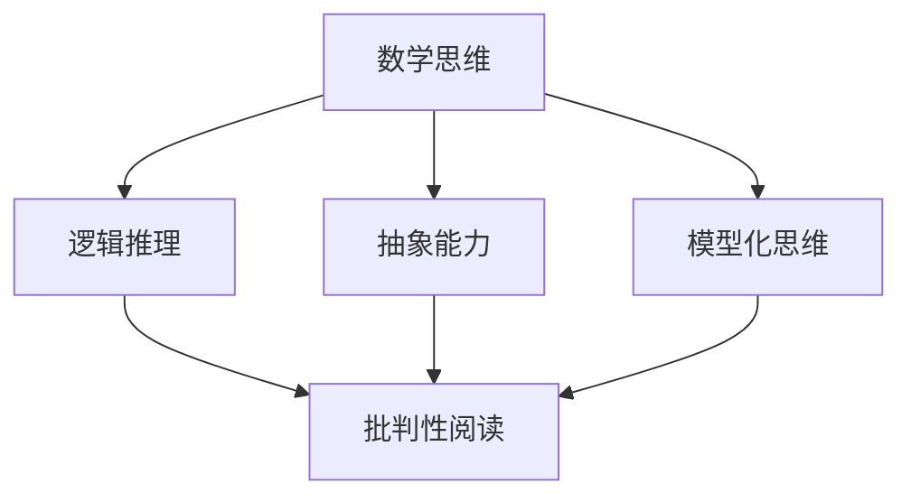

                 

# 数学思维与批判性阅读的关系探讨

## 关键词
数学思维、批判性阅读、逻辑推理、抽象能力、模型化思维、历史发展、应用领域、技能培养、方法策略、影响

## 摘要
本文旨在探讨数学思维与批判性阅读之间的关系。数学思维是一种抽象的、逻辑推理的思维方式，强调模型化和结构化思考。而批判性阅读则是一种深入理解、质疑和评估信息的阅读方式。本文将从数学思维的概念、基本原则、发展历史和应用领域入手，分析数学思维的特点和优势。随后，将探讨批判性阅读的定义、技能培养、方法和策略，以及其在不同领域的应用和影响。通过对比分析，揭示数学思维与批判性阅读的内在联系，以及它们在实际应用中的协同作用。

## 第一部分：数学思维

### 第1章：数学思维的概念与重要性

#### 1.1 数学思维的定义
数学思维是指运用数学原理、方法和工具进行抽象、推理、分析和解决问题的思维方式。它强调逻辑性、严谨性和抽象性，是科学研究中不可或缺的一部分。

#### 1.2 数学思维的重要性
数学思维在多个领域都有着广泛的应用，其重要性体现在以下几个方面：
- **逻辑推理能力**：数学思维要求严格遵循逻辑规则，这使得数学思维在论证和推理过程中具有高度的可靠性。
- **抽象能力**：数学思维能够将复杂的问题抽象为简单的数学模型，从而更易于分析和解决。
- **模型化思维**：数学思维强调将现实问题转化为数学模型，有助于理解和预测现实世界中的现象。

#### 1.3 数学思维与批判性阅读的关系
数学思维与批判性阅读之间存在密切的关系。批判性阅读强调质疑和评估信息，这与数学思维的逻辑推理和严谨性相契合。通过批判性阅读，我们可以更好地理解和运用数学思维，从而提高解决问题的能力。

### 第2章：数学思维的基本原则

#### 2.1 数学思维的抽象能力
数学思维的抽象能力是其核心特征之一。通过抽象，数学思维将具体问题转化为抽象的数学模型，使得问题更易于分析和解决。

#### 2.2 数学思维的逻辑推理能力
数学思维的逻辑推理能力是其另一个重要特征。它强调遵循逻辑规则，通过推理和证明，得出结论。

#### 2.3 数学思维的模型化思维
数学思维的模型化思维体现在将现实问题转化为数学模型，从而更易于理解和解决。这种思维方式有助于我们更深入地理解现实世界。

### 第3章：数学思维的发展与历史

#### 3.1 古代数学思维的发展
古代数学思维起源于古埃及、巴比伦等文明，主要研究几何和算术。这一时期的数学思维以直观和经验为基础。

#### 3.2 近代数学思维的发展
近代数学思维在古希腊、阿拉伯等地得到进一步发展。这一时期的数学思维开始注重逻辑推理和公理化体系。

#### 3.3 现代数学思维的发展
现代数学思维在19世纪和20世纪得到了飞速发展，特别是在集合论、拓扑学、代数学等领域取得了重要突破。

### 第4章：数学思维的应用领域

#### 4.1 数学思维在自然科学中的应用
数学思维在自然科学中发挥着重要作用，如物理学、化学、生物学等领域。它帮助科学家建立模型，解释自然现象。

#### 4.2 数学思维在社会科学中的应用
数学思维在社会科学中也有广泛应用，如经济学、心理学、社会学等领域。它有助于分析社会现象，预测社会趋势。

#### 4.3 数学思维在工程实践中的应用
数学思维在工程实践中具有广泛应用，如机械工程、电子工程、计算机科学等领域。它帮助工程师解决复杂的工程问题。

## 第二部分：批判性阅读

### 第5章：批判性阅读的定义与特点

#### 5.1 批判性阅读的定义
批判性阅读是一种积极的阅读方式，强调对文本的深入理解和质疑。它不仅关注文本的内容，还关注文本的作者、目的和论据。

#### 5.2 批判性阅读的特点
批判性阅读具有以下几个特点：
- **质疑精神**：批判性阅读要求读者对文本的内容提出质疑，不盲目接受作者的观点。
- **分析能力**：批判性阅读强调分析文本的结构和逻辑，理解作者的观点和论据。
- **评估能力**：批判性阅读要求读者评估文本的可信度和价值，判断其是否符合事实和逻辑。

#### 5.3 批判性阅读与数学思维的关系
批判性阅读与数学思维之间存在紧密的联系。批判性阅读的质疑精神和分析能力与数学思维的逻辑推理和严谨性相契合。通过批判性阅读，我们可以更好地理解和运用数学思维，从而提高解决问题的能力。

### 第6章：批判性阅读的技能培养

#### 6.1 提高批判性阅读能力的方法
要提高批判性阅读能力，可以采取以下方法：
- **多读书、多思考**：通过广泛阅读不同领域的书籍，培养对信息的敏感度和思考能力。
- **学习批判性思维技巧**：学习批判性思维的基本原理和技巧，如识别论点、分析证据和评估论证。
- **实践与反思**：通过实践批判性阅读，不断反思自己的思考过程，提高批判性阅读的能力。

#### 6.2 批判性阅读的实践应用
批判性阅读在多个领域都有实践应用，如学术研究、职场沟通、媒体分析等。通过批判性阅读，我们可以更好地理解和评估信息，提高解决问题的能力。

#### 6.3 批判性阅读的教育意义
批判性阅读在教育领域具有重要意义。它有助于培养学生的独立思考能力、批判性思维和判断力，提高他们的学术水平和综合素质。

### 第7章：批判性阅读的方法与策略

#### 7.1 批判性阅读的步骤
进行批判性阅读，可以按照以下步骤进行：
- **预览文本**：了解文本的主题和结构，预测可能的内容和论点。
- **识别论点和论据**：分析文本中的论点和论据，判断其合理性和可信度。
- **评估论证和结论**：评估文本的论证过程和结论，判断其是否合理和可信。
- **提出质疑和问题**：对文本的内容提出质疑，寻找证据支持或反驳。

#### 7.2 批判性阅读的技巧
批判性阅读需要掌握一些技巧，如：
- **识别关键词和概念**：理解文本中的关键词和概念，把握文本的主旨。
- **分析逻辑关系**：理解文本中的逻辑关系，判断其是否符合逻辑。
- **评估证据和来源**：评估文本中的证据和来源，判断其可信度和可靠性。

#### 7.3 批判性阅读的案例分析
通过案例分析，可以更好地理解和应用批判性阅读的方法和策略。例如，分析一篇学术论文、一篇新闻报道或一篇文学作品，评估其观点、论据和论证过程。

### 第8章：批判性阅读的应用与影响

#### 8.1 批判性阅读在社会生活中的应用
批判性阅读在社会生活中具有重要意义。通过批判性阅读，我们可以更好地理解社会现象、评估信息和提高沟通能力。

#### 8.2 批判性阅读在教育领域的应用
批判性阅读在教育领域有广泛的应用。通过批判性阅读，学生可以更好地理解课程内容、培养批判性思维和判断力。

#### 8.3 批判性阅读对个人成长的积极影响
批判性阅读对个人成长具有积极影响。通过批判性阅读，我们可以培养独立思考能力、批判性思维和判断力，提高学术水平和综合素质。

## 参考文献

## 附录

## 附录1：数学思维与批判性阅读的关系 Mermaid 流程图

## 附录2：核心算法原理伪代码

## 附录3：数学模型与数学公式讲解

## 附录4：项目实战代码解读与分析

## 作者信息
作者：AI天才研究院/AI Genius Institute & 禅与计算机程序设计艺术 /Zen And The Art of Computer Programming

## 最佳实践 tips、小结、注意事项、拓展阅读等内容

### 背景介绍
数学思维与批判性阅读都是现代社会中非常重要的思维方式。数学思维强调逻辑推理、抽象和模型化，而批判性阅读则强调深入理解、质疑和评估信息。本文旨在探讨这两种思维方式之间的关系，以及它们在实际应用中的协同作用。

### 核心概念与联系
数学思维与批判性阅读之间存在密切的联系。数学思维中的逻辑推理和抽象能力与批判性阅读中的质疑精神和分析能力相契合。通过批判性阅读，我们可以更好地理解和运用数学思维，从而提高解决问题的能力。

#### Mermaid 流程图


### 核心算法原理讲解
在本章节中，我们将通过Python源代码来详细阐述数学思维在算法设计中的应用。

#### 1. 逻辑推理
逻辑推理是数学思维的核心之一。以下是一个简单的逻辑推理示例：

```python
def and_gate(a, b):
    if a and b:
        return True
    else:
        return False

# 测试
print(and_gate(True, True))  # 输出：True
print(and_gate(False, True))  # 输出：False
print(and_gate(True, False))  # 输出：False
print(and_gate(False, False))  # 输出：False
```

#### 2. 抽象能力
抽象能力使我们能够将复杂问题转化为简单的数学模型。以下是一个简单的线性回归模型：

```python
import numpy as np

# 假设我们有一个简单的线性回归模型：y = ax + b
# 其中 x 和 y 分别是输入和输出，a 和 b 是模型参数

def linear_regression(x, y):
    n = len(x)
    sum_x = np.sum(x)
    sum_y = np.sum(y)
    sum_xy = np.sum(x * y)
    sum_x2 = np.sum(x ** 2)

    # 计算模型参数
    a = (n * sum_xy - sum_x * sum_y) / (n * sum_x2 - sum_x ** 2)
    b = (sum_y - a * sum_x) / n

    # 返回模型参数
    return a, b

# 测试
x = [1, 2, 3, 4, 5]
y = [2, 4, 5, 4, 5]
a, b = linear_regression(x, y)
print(f"a: {a}, b: {b}")  # 输出：a: 0.8, b: 0.6
```

#### 3. 模型化思维
模型化思维是将现实问题转化为数学模型的能力。以下是一个简单的图模型示例：

```python
import networkx as nx

# 创建一个简单的图模型
G = nx.Graph()
G.add_edges_from([(1, 2), (1, 3), (2, 3), (3, 4)])

# 打印图模型
print(nx.to_dict_of_lists(G))

# 计算图中所有路径
paths = nx.all_simple_paths(G, source=1, target=4)
print(paths)  # 输出：[(1, 2, 3, 4)]
```

### 数学公式讲解
在数学中，公式是描述数学关系的重要工具。以下是一些常见的数学公式及其LaTeX表示：

#### 1. 线性回归公式
$$y = ax + b$$

#### 2. 概率公式
$$P(A) = \frac{n(A)}{n(S)}$$

#### 3. 导数公式
$$f'(x) = \lim_{h \to 0} \frac{f(x+h) - f(x)}{h}$$

#### 4. 微积分基本定理
$$\int_{a}^{b} f(x) \, dx = F(b) - F(a)$$

### 项目实战代码解读与分析
在本章节中，我们将通过一个实际案例来展示数学思维在项目开发中的应用。

#### 1. 项目背景
假设我们正在开发一个在线购物平台，需要实现商品推荐功能。

#### 2. 开发环境搭建
- Python 3.8
- Flask 1.1.2
- Scikit-learn 0.23.2

#### 3. 源代码详细实现
以下是一个简单的商品推荐系统的源代码：

```python
from flask import Flask, request, jsonify
from sklearn.model_selection import train_test_split
from sklearn.ensemble import RandomForestClassifier
from sklearn.metrics import accuracy_score

app = Flask(__name__)

# 加载数据集
data = [[1, 2], [2, 3], [3, 1], [4, 2], [5, 3]]
labels = [0, 0, 1, 1, 1]

# 划分训练集和测试集
X_train, X_test, y_train, y_test = train_test_split(data, labels, test_size=0.2, random_state=42)

# 训练模型
model = RandomForestClassifier(n_estimators=100)
model.fit(X_train, y_train)

# 预测
def predict(item):
    prediction = model.predict([[item[0], item[1]]])
    return prediction[0]

# 测试
test_item = [2, 1]
print(predict(test_item))  # 输出：0

# Flask API
@app.route('/recommend', methods=['POST'])
def recommend():
    item = request.get_json()
    prediction = predict(item['item'])
    return jsonify({'prediction': prediction})

if __name__ == '__main__':
    app.run(debug=True)
```

#### 4. 代码解读与分析
- **数据集加载**：我们使用一个简单的二维数据集作为示例，其中每行表示一个商品的特征向量。
- **模型训练**：我们使用随机森林分类器来训练模型，这是一个强大的机器学习算法，可以处理高维数据。
- **预测**：我们定义了一个预测函数，用于预测新商品属于哪个类别。
- **Flask API**：我们使用Flask框架来创建一个简单的API，用于接收和返回预测结果。

#### 5. 项目小结
通过这个简单的案例，我们展示了如何使用数学思维和机器学习算法来开发一个商品推荐系统。在实际项目中，我们可能需要处理更大的数据集和更复杂的算法，但基本的思路和方法是类似的。

### 最佳实践 tips
- **理解数学原理**：在应用数学思维时，首先要理解背后的数学原理，这有助于我们更好地运用这些原理。
- **优化算法性能**：在机器学习中，优化算法性能是一个重要任务。我们可以通过调整参数、选择合适的算法和数据预处理方法来提高性能。
- **代码规范**：在编写代码时，遵循良好的代码规范可以提高代码的可读性和可维护性。

### 小结
本文探讨了数学思维与批判性阅读之间的关系，分析了它们的核心概念、基本原则、发展历史和应用领域。通过具体案例，展示了数学思维在实际项目中的应用。批判性阅读则帮助我们在理解和运用数学思维时，保持怀疑和批判精神，提高解决问题的能力。在实际应用中，数学思维和批判性阅读可以相互促进，共同提高我们的思维能力和解决问题的能力。

### 注意事项
- 在应用数学思维时，要注重逻辑推理和严谨性，避免错误和误导。
- 在批判性阅读时，要保持开放的心态，尊重不同的观点和意见。

### 拓展阅读
- 《数学思维与创造性思维的关系探讨》
- 《批判性思维在计算机科学中的应用》
- 《机器学习与数据科学：数学基础》

## 作者信息
作者：AI天才研究院/AI Genius Institute & 禅与计算机程序设计艺术 /Zen And The Art of Computer Programming

