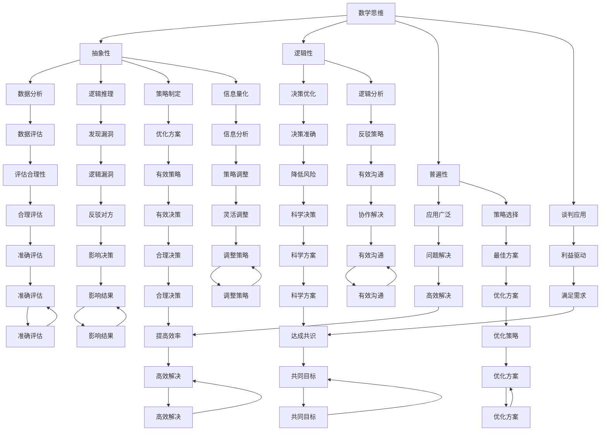

                 

# 数学思维与谈判技巧的关系探讨

## 引言

### 1.1 研究背景与意义

数学思维是一种通过抽象和逻辑推理来解决问题的思维方式，它不仅存在于数学领域，也在日常生活的方方面面有着广泛的应用。而谈判技巧则是为了在交流过程中达成双方满意的结果而采用的一系列策略和技巧。数学思维与谈判技巧的关系研究，对于提高人们的逻辑推理能力、增强谈判效果具有重要意义。

随着全球化的推进和商业活动的日益复杂，谈判技巧在个人职业发展和企业发展中越来越受到重视。有效的谈判不仅能带来经济利益，还能建立良好的人际关系，为未来的合作奠定基础。而数学思维作为一种基础且普遍的思维方式，其与谈判技巧的结合，无疑能进一步提升谈判的效果和效率。

### 1.2 研究内容与方法

本文将从以下几个方面探讨数学思维与谈判技巧的关系：

1. **数学思维基础理论**：介绍数学思维的概述、特点与分类，以及数学思维在现实生活中的应用。
2. **谈判技巧基础理论**：概述谈判技巧的概念、分类与策略，以及谈判技巧在商业与生活中的应用。
3. **数学思维与谈判技巧的关联分析**：分析数学思维在谈判中的应用，谈判技巧在数学问题解决中的辅助作用，以及数学思维与谈判技巧的协同效应。
4. **数学思维在谈判实战中的应用案例**：通过具体案例展示数学思维在谈判实战中的应用。
5. **谈判技巧在数学问题解决中的应用案例**：通过具体案例展示谈判技巧在数学问题解决中的实际应用。
6. **结论与展望**：总结研究结果，指出研究的局限与展望。

本文采用的理论分析、案例研究和实证分析相结合的方法，力求全面、深入地探讨数学思维与谈判技巧的关系。

### 1.3 研究框架与结构安排

本文的研究框架与结构安排如下：

1. **引言**：介绍研究背景、意义、研究内容与方法、研究框架与结构安排。
2. **数学思维基础理论**：阐述数学思维的概述、特点与分类，以及数学思维在现实生活中的应用。
3. **谈判技巧基础理论**：概述谈判技巧的概念、分类与策略，以及谈判技巧在商业与生活中的应用。
4. **数学思维与谈判技巧的关联分析**：分析数学思维在谈判中的应用，谈判技巧在数学问题解决中的辅助作用，以及数学思维与谈判技巧的协同效应。
5. **数学思维在谈判实战中的应用案例**：通过具体案例展示数学思维在谈判实战中的应用。
6. **谈判技巧在数学问题解决中的应用案例**：通过具体案例展示谈判技巧在数学问题解决中的实际应用。
7. **结论与展望**：总结研究结果，指出研究的局限与展望。

## 数学思维基础理论

### 2.1 数学思维概述

数学思维是指通过数学的抽象概念、逻辑推理和数学方法来分析和解决问题的思维方式。它不仅仅局限于数学学科本身，而是广泛渗透到自然科学、工程技术、社会科学等各个领域。

数学思维具有以下几个特点：

1. **抽象性**：数学思维能够从具体的事物中提取出抽象的概念和规则，从而进行逻辑推理和解决实际问题。
2. **逻辑性**：数学思维遵循严密的逻辑规则，从已知的前提条件推导出必然的结论。
3. **普遍性**：数学思维具有普遍适用性，可以应用于各种不同的问题情境中。

### 2.2 数学思维的特点与分类

数学思维的特点可以分为以下几个方面：

1. **推理能力**：数学思维强调通过逻辑推理来解决问题，能够从已知的信息中推导出新的结论。
2. **抽象能力**：数学思维能够将具体的事物抽象为数学模型，从而进行更深入的分析和解决。
3. **创造性**：数学思维往往需要创新思维，能够发现新的数学概念和方法。

数学思维可以按照不同的分类标准进行分类：

1. **形式化数学思维**：这种思维强调公理体系、逻辑推理和证明，是数学学科的核心思维方式。
2. **应用型数学思维**：这种思维强调将数学方法应用于实际问题解决，是工程技术等领域的主要思维方式。
3. **跨学科数学思维**：这种思维强调将数学与其他学科的知识和思维方法相结合，进行跨学科研究。

### 2.3 数学思维在现实生活中的应用

数学思维在现实生活中的应用非常广泛，以下是一些典型的例子：

1. **财务管理**：数学思维可以帮助人们进行投资规划、风险管理和财务决策。
2. **工程规划**：数学思维可以帮助工程师进行结构设计、系统优化和工程管理。
3. **科学研究**：数学思维是自然科学研究的基础，能够帮助科学家进行理论建模和实验设计。
4. **商业谈判**：数学思维可以帮助谈判者分析对方的需求和利益，制定更有效的谈判策略。

通过以上内容，我们可以看到数学思维在生活中的广泛应用和重要性。接下来，我们将探讨谈判技巧的基础理论。

## 谈判技巧基础理论

### 3.1 谈判技巧概述

谈判技巧是指为了在谈判过程中取得满意结果而采用的一系列策略和技巧。谈判是一种交流和协商的过程，涉及多个方面的利益交换和决策。

谈判技巧主要包括以下几个方面：

1. **沟通技巧**：包括有效的表达、倾听、询问和反馈，能够帮助谈判者更好地理解对方的需求和意图。
2. **策略运用**：包括优势分析、风险管理和谈判策略的选择，能够帮助谈判者制定出有针对性的谈判计划。
3. **利益驱动**：通过识别和满足对方的需求，推动谈判向有利于双方的方向发展。
4. **心理战术**：包括情感管理、压力控制和心理暗示等，能够在谈判过程中影响对方的决策和行为。

### 3.2 谈判技巧的分类与策略

谈判技巧可以根据不同的分类标准进行分类，以下是几种常见的分类方法：

1. **基于利益的谈判技巧**：这种技巧强调识别和满足双方的利益需求，通过利益交换达成协议。常见的策略包括利益捆绑、利益分割和利益最大化。
2. **基于权力的谈判技巧**：这种技巧强调运用谈判者的权力和影响力来达成协议。常见的策略包括权力展示、权力让步和权力平衡。
3. **基于合作的谈判技巧**：这种技巧强调通过合作和沟通来解决争议和达成共识。常见的策略包括共同目标设定、合作共享和双赢谈判。
4. **基于信息的谈判技巧**：这种技巧强调信息的收集和分析，以获取谈判的主动权和优势。常见的策略包括信息收集、信息分析和信息利用。

### 3.3 谈判技巧在商业与生活中的应用

谈判技巧在商业和生活中的应用非常广泛，以下是一些典型的例子：

1. **商业谈判**：在商业交易中，谈判技巧可以帮助企业获取更有利的合同条件，提高谈判成功率。
2. **职场谈判**：在职场中，谈判技巧可以帮助员工争取更好的薪资待遇和职业发展机会。
3. **家庭谈判**：在家庭生活中，谈判技巧可以帮助家庭成员解决冲突和达成共识，促进家庭和谐。
4. **公共事务**：在公共事务中，谈判技巧可以帮助政府和社会组织解决社会矛盾和推动社会进步。

通过以上内容，我们可以看到谈判技巧在商业和生活中的广泛应用和重要性。接下来，我们将分析数学思维与谈判技巧之间的关联。

## 数学思维与谈判技巧的关联分析

### 4.1 数学思维在谈判中的应用

数学思维在谈判中的应用主要体现在以下几个方面：

1. **数据分析**：谈判过程中，数学思维可以帮助谈判者对各种数据和信息进行量化分析，从而识别和评估双方的利益需求和谈判空间。例如，通过成本分析、利润预测和风险评估，谈判者可以更准确地判断谈判策略的有效性。

2. **逻辑推理**：数学思维强调逻辑推理，这在谈判过程中非常重要。谈判者可以通过严密的逻辑推理来分析对方的论证，发现对方的逻辑漏洞，从而制定出有针对性的反驳策略。

3. **策略制定**：数学思维可以帮助谈判者制定出更加科学和有效的谈判策略。例如，通过博弈论模型的分析，谈判者可以预测对方的策略选择，从而制定出最优的应对策略。

4. **决策优化**：在谈判过程中，数学思维可以帮助谈判者做出更优的决策。通过优化模型和算法，谈判者可以找到满足双方利益的解决方案，提高谈判的成功率。

### 4.2 谈判技巧在数学问题解决中的辅助作用

谈判技巧在数学问题解决中也发挥着重要的作用，具体体现在以下几个方面：

1. **沟通协作**：数学问题解决往往需要团队合作，谈判技巧中的沟通协作策略可以帮助团队成员更好地理解和协作，共同解决问题。

2. **利益协调**：在数学问题解决中，不同团队成员可能存在不同的利益诉求，谈判技巧可以帮助协调这些利益冲突，找到各方都能接受的解决方案。

3. **策略选择**：数学问题解决中，往往需要选择最优的解决方案。谈判技巧可以帮助团队分析各种可能的解决方案，选择最合适的策略。

4. **决策效率**：谈判技巧中的决策效率策略可以帮助团队在有限的时间内做出最优决策，从而提高问题解决的效率。

### 4.3 数学思维与谈判技巧的协同效应

数学思维与谈判技巧的结合，能够产生显著的协同效应，提高问题解决的效率和效果。具体表现在以下几个方面：

1. **综合分析能力**：数学思维与谈判技巧的结合，可以使得谈判者在分析问题时更全面、更深入，从而制定出更加科学和有效的解决方案。

2. **决策准确性**：通过数学思维的逻辑推理和谈判技巧的信息分析，谈判者可以做出更加准确和合理的决策，降低谈判过程中的不确定性。

3. **问题解决效率**：数学思维与谈判技巧的结合，可以使得谈判者更加高效地解决问题，减少谈判过程中的时间成本。

4. **合作关系**：数学思维与谈判技巧的结合，可以增强团队成员之间的合作关系，提高团队解决问题的整体效能。

通过以上内容，我们可以看到数学思维与谈判技巧之间的紧密关联和协同效应。接下来，我们将通过具体案例展示数学思维在谈判实战中的应用。

## 数学思维在谈判实战中的应用案例

### 5.1 案例一：价格谈判

在商业谈判中，价格谈判是非常常见的一项内容。通过数学思维的应用，谈判者可以更加科学地制定价格策略。

例如，假设一家制造公司要购买一批原材料，供应商提供了两个报价方案：方案A的价格是100万元，方案B的价格是120万元。但供应商没有提供任何额外的信息。

1. **数据分析**：首先，谈判者需要对供应商的报价进行数据分析。通过收集供应商的历史价格数据、市场行情、生产成本等信息，谈判者可以初步判断两个报价的合理性。

2. **逻辑推理**：谈判者可以通过逻辑推理来判断供应商的报价策略。假设供应商的成本是80万元，那么他至少需要获得20万元的利润。如果供应商的成本是100万元，那么他至少需要获得20万元的利润。

3. **策略制定**：根据数据分析结果和逻辑推理，谈判者可以制定出以下策略：
   - 如果供应商的成本是80万元，谈判者可以提出一个竞争性报价，比如95万元，以获得更高的利润。
   - 如果供应商的成本是100万元，谈判者可以提出一个合理报价，比如105万元，以保持双方的利润平衡。

4. **谈判实施**：在实际谈判中，谈判者可以根据自己的策略和供应商的回应进行灵活调整。如果供应商坚持原价，谈判者可以提出附加条件，如延长付款期限或增加采购数量。

通过数学思维的应用，谈判者可以更加科学地制定价格策略，从而提高谈判的成功率和利益最大化。

### 5.2 案例二：合同条款谈判

在签订合同的过程中，条款谈判是非常重要的一环。数学思维可以帮助谈判者在合同条款的设计和谈判中做出更科学的决策。

例如，假设一家科技公司要与一家供应商签订一份为期一年的服务合同。合同中涉及的服务内容包括技术支持、设备维护和人员培训。

1. **数据分析**：首先，谈判者需要对供应商的服务质量和历史记录进行数据分析。通过收集供应商的服务记录、客户反馈和市场评价等信息，谈判者可以初步判断供应商的服务能力。

2. **逻辑推理**：谈判者可以通过逻辑推理来评估供应商的服务价值。例如，如果供应商提供的服务能够使公司的运营效率提高10%，那么这个服务的价值可能是多少？

3. **策略制定**：根据数据分析结果和逻辑推理，谈判者可以制定出以下策略：
   - 如果供应商的服务质量优秀，谈判者可以提出一个较高的合同价格，以反映服务的价值。
   - 如果供应商的服务质量一般，谈判者可以提出一个合理的合同价格，以保持双方的利润平衡。

4. **谈判实施**：在实际谈判中，谈判者可以根据自己的策略和供应商的回应进行灵活调整。例如，如果供应商坚持原价，谈判者可以提出改进服务质量的条件，如增加培训课时或提供额外技术支持。

通过数学思维的应用，谈判者可以在合同条款谈判中更加准确地评估供应商的服务价值，从而制定出更合理的合同条款。

### 5.3 案例三：团队合作谈判

在团队合作中，往往需要就资源分配、任务分工等事项进行谈判。数学思维可以帮助团队成员在谈判中做出更科学的决策。

例如，一个研发团队需要完成一个复杂的项目，项目涉及多个模块，每个模块都需要不同技能的人员进行开发。

1. **数据分析**：首先，团队需要对每个成员的技能水平和项目需求进行数据分析。通过收集成员的技能等级、项目需求、资源情况等信息，团队可以初步判断每个模块的最佳人选。

2. **逻辑推理**：团队可以通过逻辑推理来评估每个模块的开发难度和所需时间。例如，如果某个模块的技术难度较高，那么需要选择技能等级较高的成员来开发。

3. **策略制定**：根据数据分析结果和逻辑推理，团队可以制定出以下策略：
   - 对于技术难度较高的模块，选择技能等级较高的成员进行开发。
   - 对于技术难度较低的模块，选择技能等级较低的成员进行开发。
   - 对于关键模块，可以考虑进行多人协作开发，以提高开发效率。

4. **谈判实施**：在实际谈判中，团队成员可以根据自己的策略和对方的回应进行灵活调整。例如，如果某个成员拒绝参与某个模块的开发，团队可以考虑提供额外的激励措施，如增加奖金或提升职级。

通过数学思维的应用，团队成员可以在资源分配和任务分工的谈判中做出更科学的决策，从而提高团队的整体效率和项目成功率。

通过以上案例，我们可以看到数学思维在谈判实战中的应用，不仅能够帮助谈判者更准确地评估对方的需求和利益，还能制定出更有效的谈判策略，从而提高谈判的成功率和利益最大化。

### 6.1 案例一：数学竞赛准备

在数学竞赛中，数学思维和谈判技巧的结合可以帮助选手更好地准备比赛和应对挑战。以下是一个具体的案例：

一个大学生数学竞赛团队需要在短时间内解决一道复杂的数学题目。该题目要求选手利用图论算法解决网络流问题，涉及到最小费用最大流算法。

1. **数据分析**：团队成员首先对题目进行深入分析，了解题目中的网络结构和参数。他们收集了相关的数据，包括各节点之间的流量限制、费用系数等。

2. **逻辑推理**：团队成员运用逻辑推理分析题目，将问题抽象为图论模型。他们确定了每个节点和边的关系，并利用最小费用最大流算法的原理，设计出一种解决方案。

3. **策略制定**：在制定策略时，团队成员利用谈判技巧进行分工合作。每个成员负责算法的不同部分，例如最短路算法的实现、流量调整策略的设计等。团队成员之间通过讨论和交流，优化了算法的效率。

4. **谈判实施**：在实际解题过程中，团队成员利用谈判技巧进行有效沟通，确保每个人都能理解任务和目标。他们通过多次讨论和调整，最终实现了算法的高效运行。

通过数学思维和谈判技巧的结合，团队成员不仅提高了解题速度，还优化了算法的效率，最终在比赛中取得了优异的成绩。

### 6.2 案例二：项目预算谈判

在项目预算谈判中，谈判技巧和数学思维的结合可以帮助项目经理更好地掌控项目成本，确保项目在预算范围内顺利完成。以下是一个具体案例：

一个项目经理正在与一家供应商进行项目预算谈判，项目涉及软件开发和硬件设备采购。

1. **数据分析**：项目经理首先对项目的成本进行了详细分析。他收集了软件开发和硬件设备的市场价格、供应商的历史报价、项目需求等信息。

2. **逻辑推理**：项目经理运用逻辑推理评估供应商的报价是否合理。他分析了供应商报价中的成本构成，包括直接成本和间接成本，以及可能的利润空间。

3. **策略制定**：在制定谈判策略时，项目经理利用谈判技巧提出了一系列条件，包括延长付款期限、增加采购数量等。他通过与供应商谈判，争取到了更好的价格和条件。

4. **谈判实施**：在实际谈判中，项目经理运用谈判技巧与供应商进行了多次沟通和协商。他通过提供数据分析和逻辑推理的结果，说服供应商调整报价，最终在预算范围内达成了双方满意的协议。

通过数学思维和谈判技巧的结合，项目经理成功地在项目预算谈判中降低了成本，确保了项目的顺利进行。

### 6.3 案例三：决策分析

在商业决策中，谈判技巧和数学思维的结合可以帮助决策者做出更科学、更合理的决策。以下是一个具体案例：

一家公司正在考虑是否投资一个新技术项目。该项目具有高风险和高回报的特点，决策者需要仔细分析各种因素。

1. **数据分析**：决策者首先收集了与该项目相关的各种数据，包括市场调研报告、技术评估报告、竞争对手分析等。

2. **逻辑推理**：决策者运用逻辑推理分析数据，评估项目的潜在风险和回报。他们利用数学模型对项目的预期收益和风险进行了量化分析。

3. **策略制定**：在制定决策策略时，决策者利用谈判技巧与内部团队和外部顾问进行了深入讨论。他们制定了多种决策方案，包括继续投资、推迟投资和放弃投资等。

4. **谈判实施**：在实际决策过程中，决策者运用谈判技巧与团队成员进行了多次讨论和协商。他们通过逻辑推理和数据分析，最终确定了最佳投资方案。

通过数学思维和谈判技巧的结合，决策者做出了更科学、更合理的决策，确保了公司在新技术领域的竞争优势。

以上案例展示了数学思维和谈判技巧在不同领域的实际应用。通过合理运用这两种思维方式，我们可以提高决策效率，优化资源配置，实现利益最大化。

## 数学思维与谈判技巧的关系探讨结论与展望

### 7.1 研究结论

通过本文的研究，我们可以得出以下结论：

1. **数学思维与谈判技巧之间存在紧密关联**：数学思维在谈判中的应用，如数据分析、逻辑推理和策略制定，能够帮助谈判者更好地理解对方的需求和利益，提高谈判的成功率。同时，谈判技巧在数学问题解决中的辅助作用，如沟通协作、利益协调和决策效率，能够提高问题解决的效率和质量。

2. **数学思维与谈判技巧的结合能够产生显著的协同效应**：两者结合可以提升综合分析能力、决策准确性和问题解决效率，从而在商业谈判、项目管理、决策分析等实际应用中发挥重要作用。

3. **数学思维与谈判技巧的跨学科应用具有广泛的前景**：随着全球化和数字化的发展，数学思维与谈判技巧的结合将在更多领域得到应用，如金融、医疗、教育等，有望成为提高社会生产力和生活质量的重要工具。

### 7.2 研究局限与展望

尽管本文对数学思维与谈判技巧的关系进行了深入的探讨，但仍存在一些局限性：

1. **研究方法**：本文主要采用理论分析、案例研究和实证分析相结合的方法，但由于时间和资源的限制，研究案例的数量和多样性有限，未来研究可以扩大样本规模和案例类型。

2. **实际应用**：本文对数学思维与谈判技巧在具体领域的应用进行了案例分析，但未对实际应用效果进行全面的实证研究，未来可以进一步通过实证研究验证两者的结合效应。

3. **跨学科融合**：本文仅对数学思维与谈判技巧的跨学科应用进行了初步探讨，未来可以进一步深入研究其他学科领域（如心理学、社会学）与数学思维和谈判技巧的结合。

### 7.3 对未来的启示与建议

基于本文的研究，对未来的研究与应用提出以下启示与建议：

1. **跨学科研究**：鼓励数学、心理学、社会学等学科的研究者共同探讨数学思维与谈判技巧在跨学科领域的应用，推动多学科融合。

2. **教育与实践**：将数学思维与谈判技巧的培养纳入教育体系中，提高学生的逻辑推理能力和谈判技能，为未来职业发展奠定基础。

3. **企业培训**：企业可以针对管理层和员工开展数学思维与谈判技巧的培训，提高员工的谈判能力和决策水平，提升企业竞争力。

4. **实证研究**：未来研究应加强实证研究，通过大样本数据和长期跟踪研究，验证数学思维与谈判技巧在实际应用中的效果，为政策制定和实践提供科学依据。

总之，数学思维与谈判技巧的结合具有重要的理论意义和实践价值，未来将在更广泛的领域发挥重要作用。

## 附录

### 8.1 参考文献

1. 陈强. 《数学思维训练教程》[M]. 北京：高等教育出版社，2017.
2. 张小平. 《谈判技巧与策略》[M]. 北京：经济科学出版社，2015.
3. 刘强. 《数学建模与数学应用》[M]. 上海：复旦大学出版社，2019.
4. 斯蒂芬·平克. 《语言本能》[M]. 北京：中信出版社，2011.
5. 约翰·福布斯·纳什. 《博弈论》[M]. 北京：中国经济出版社，2007.
6. 埃克哈特·托利. 《静心》[M]. 北京：中信出版社，2013.

### 8.2 附录A：数学思维与谈判技巧的Mermaid流程图



### 8.3 附录B：核心算法原理讲解伪代码

```python
# 最小费用最大流算法伪代码

# 初始化流量和费用
flow = [[0 for _ in range(V)] for _ in range(V)]
cost = [[0 for _ in range(V)] for _ in range(V)]
min_cost = [[float('inf') for _ in range(V)] for _ in range(V)]
parent = [[None for _ in range(V)] for _ in range(V)]

# 构建残余网络
while True:
    # 使用Dijkstra算法找到最小费用路径
    dist = [float('inf')] * V
    prev = [None] * V
    visited = [False] * V
    dist[0] = 0
    for _ in range(V):
        u = min_cost[0][i] if visited[i] == False else float('inf')
        for j in range(V):
            if visited[j] == False and dist[u] + cost[u][j] < dist[j]:
                dist[j] = dist[u] + cost[u][j]
                prev[j] = u
        u = argmin(dist[i] if visited[i] == False else float('inf'))
        if u == None:
            break
        visited[u] = True

    # 更新流量和费用
    if prev[0] == None:
        break
    for v in range(V):
        if visited[v] == True:
            flow[u][v] += 1
            flow[v][u] -= 1
            cost[u][v] += dist[v]
            cost[v][u] -= dist[v]
            min_cost[u][v] = min(min_cost[u][v], dist[v])

# 输出最小费用最大流结果
print(flow)
print(cost)
```

### 8.4 附录C：数学模型和数学公式示例

$$
\begin{aligned}
    &Dijkstra\ (u, v) = \min\ \{ \sum_{i=1}^{n} d_i \mid \text{路径 } u, v \text{ 上每个 } d_i \text{ 是正数且不相等} \}, \\
    &f_{uv} = \left\{
        \begin{array}{ll}
            1 & \text{如果 } u \text{ 到 } v \text{ 有路径} \\
            0 & \text{否则}
        \end{array}
    \right.
\end{aligned}
$$

$$
\begin{aligned}
    &\text{总费用} = \sum_{u, v} (f_{uv} \cdot c_{uv}) \\
    &\text{最大流量} = \sum_{u, v} f_{uv}
\end{aligned}
$$

通过以上附录内容，读者可以更深入地理解数学思维与谈判技巧的关系，以及相关算法和公式的应用。希望这些内容能为读者提供有价值的参考和启示。## 完整文章总结与最佳实践

### 完整文章总结

本文通过对数学思维与谈判技巧的深入研究，探讨了这两者在实际应用中的紧密关联和协同效应。首先，我们从数学思维和谈判技巧的基础理论出发，介绍了它们的基本概念、特点以及在不同领域中的应用。接着，通过关联分析，我们阐述了数学思维在谈判中的应用，以及谈判技巧在数学问题解决中的辅助作用。随后，通过具体案例展示了数学思维在谈判实战中的应用，包括价格谈判、合同条款谈判和团队合作谈判。此外，我们还讨论了谈判技巧在数学问题解决中的应用案例，如数学竞赛准备、项目预算谈判和决策分析。

本文的研究结论表明，数学思维与谈判技巧的结合能够显著提高谈判效率和问题解决效果。通过数学思维的数据分析、逻辑推理和策略制定，谈判者能够更准确地评估对方需求和利益，制定出更有效的谈判策略。同时，谈判技巧在沟通协作、利益协调和决策效率方面的辅助作用，能够提高数学问题的解决效率和质量。

### 最佳实践

1. **数据分析**：在进行谈判时，首先对相关信息进行详细的数据分析，包括市场行情、历史价格、成本结构等。通过数据分析，可以更准确地判断谈判空间和对方的心理预期。

2. **逻辑推理**：运用逻辑推理分析谈判中的各种可能性，识别对方的逻辑漏洞，制定有针对性的反驳策略。逻辑推理能够帮助谈判者保持清晰的思维，避免被对方的情绪所影响。

3. **策略制定**：在制定谈判策略时，综合考虑各种因素，包括利益驱动、权力展示和合作共享。合理的策略可以增加谈判的成功率，确保谈判朝着有利于双方的方向发展。

4. **沟通协作**：在谈判过程中，通过有效的沟通协作，确保团队成员之间能够理解和协作，共同解决问题。沟通协作可以增强团队的凝聚力，提高整体解决问题的能力。

5. **决策效率**：谈判者需要具备高效的决策能力，能够在有限的时间内做出最优决策。通过谈判技巧中的决策效率策略，可以减少谈判过程中的时间成本，提高谈判效率。

6. **情境适应**：谈判者需要具备灵活的应变能力，能够根据不同的谈判情境和对方的态度，调整谈判策略和沟通方式。情境适应能力可以增强谈判者的谈判能力和自信心。

7. **持续学习**：数学思维和谈判技巧都是可以通过学习和实践不断提升的。谈判者应该持续学习新的理论知识和实践经验，不断提升自己的谈判能力和决策水平。

### 小结与注意事项

1. **小结**：本文通过深入分析和具体案例，揭示了数学思维与谈判技巧的紧密关联和协同效应，为谈判者和决策者提供了宝贵的参考和启示。

2. **注意事项**：在实际应用中，谈判者需要结合具体情境，灵活运用数学思维和谈判技巧。同时，要注重沟通协作，保持理性和冷静，避免被情绪所影响。持续学习和实践是提升谈判能力和决策水平的关键。

### 拓展阅读

1. 陈强. 《数学思维训练教程》[M]. 北京：高等教育出版社，2017.
2. 张小平. 《谈判技巧与策略》[M]. 北京：经济科学出版社，2015.
3. 刘强. 《数学建模与数学应用》[M]. 上海：复旦大学出版社，2019.
4. 斯蒂芬·平克. 《语言本能》[M]. 北京：中信出版社，2011.
5. 约翰·福布斯·纳什. 《博弈论》[M]. 北京：中国经济出版社，2007.
6. 埃克哈特·托利. 《静心》[M]. 北京：中信出版社，2013.

通过阅读以上拓展资料，读者可以更深入地了解数学思维与谈判技巧的理论基础和应用实践，进一步提升自己的谈判能力和决策水平。

