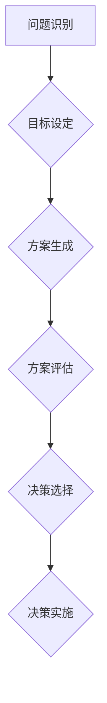

                 

# 《数学思维与领导决策的关系探讨》

## 关键词

数学思维，领导决策，逻辑推理，数据分析，抽象思考，决策模型，案例研究

## 摘要

本文探讨了数学思维与领导决策之间的关系。首先，介绍了数学思维的基本概念，包括逻辑推理、数据分析、抽象思考等，并分析了数学思维在领导决策中的重要性。接着，本文详细讨论了数学思维如何影响领导决策的各个方面，包括正面影响和负面影响。通过具体案例分析，本文展示了数学思维在决策过程中的实际应用，并提出了在领导决策中如何运用数学思维的最佳实践建议。

## 引言

### 数学思维与领导决策的基本概念

数学思维是一种基于数学方法和理论的思考方式，包括逻辑推理、数据分析、抽象思考等。逻辑推理是通过演绎和归纳方法，从已知事实推导出新的结论；数据分析则是运用统计学方法，对数据进行处理和分析，以发现数据中的规律和趋势；抽象思考则是通过抽象概念和模型，对复杂问题进行简化和求解。

领导决策是指领导者在面对组织或团队面临的选择和挑战时，通过分析和评估各种可能的方案，做出合理和有效的决策。领导决策不仅涉及到组织或团队的内部管理，还涉及到对外部环境的应对和适应。

探讨数学思维与领导决策的关系，旨在揭示数学思维在领导决策中的应用价值，为领导者提供一种有效的决策工具和方法。

### 探讨数学思维与领导决策关系的重要性

数学思维在领导决策中的应用具有重要意义。首先，数学思维可以提高决策的效率和准确性。通过逻辑推理和数据分析，领导者可以更加客观和理性地评估各种决策方案，减少主观偏见和不确定性的影响。其次，数学思维有助于领导者发现和解决复杂问题。通过抽象思考和数学模型，领导者可以将复杂的问题简化为可操作的模型，从而更容易找到解决问题的方法。此外，数学思维还可以激发领导者的创新思维。通过运用数学方法和工具，领导者可以探索新的决策方案和策略，推动组织或团队的持续发展和创新。

## 数学思维

### 数学思维概述

数学思维是一种以数学方法为基础的思考方式，它不仅包括逻辑推理，还涵盖了数据分析、抽象思考等多个方面。逻辑推理是数学思维的核心，它通过逻辑运算符（如与、或、非等）对信息进行加工和处理，从而得出结论。数据分析则是运用统计学和概率论等方法，对数据进行处理和分析，以发现数据中的规律和趋势。抽象思考则是通过将具体问题抽象为通用模型，从而简化问题的复杂性，提高解决问题的效率。

### 数学思维的核心原则

#### 简化复杂问题

简化复杂问题是数学思维的核心原则之一。在领导决策中，领导者常常面临复杂多变的决策环境，如何简化这些问题是关键。通过数学思维，领导者可以将复杂的问题分解为若干个简单的子问题，从而更容易找到解决方案。例如，通过构建决策树，领导者可以清晰地了解各种决策方案的可能结果和风险。

```python
import matplotlib.pyplot as plt
import networkx as nx

G = nx.DiGraph()

# 创建决策节点
G.add_nodes_from(['购买新材料', '改进生产工艺', '保持现状'])

# 创建决策分支
G.add_edges_from([('购买新材料', '提高产品质量'), 
                   ('购买新材料', '增加成本'), 
                   ('改进生产工艺', '降低成本'), 
                   ('改进生产工艺', '提高效率'), 
                   ('保持现状', '维持当前状态')])

# 绘制决策树
pos = nx.spring_layout(G)
nx.draw(G, pos, with_labels=True)
plt.show()
```

#### 揭示本质联系

数学思维能够帮助我们揭示事物之间的本质联系。在领导决策中，领导者需要了解各种决策因素之间的关系，以便做出合理的决策。通过构建数学模型，领导者可以清晰地看到不同决策因素之间的相互影响，从而做出更加科学的决策。

```python
import numpy as np

# 假设决策因素为x和y，目标函数为f(x, y)
def objective_function(x, y):
    return x**2 + y**2

# 求解最优解
x_opt, y_opt = np.optimize.fmin_powell(objective_function, (0, 0))

# 绘制目标函数图像
x = np.linspace(-10, 10, 100)
y = np.linspace(-10, 10, 100)
X, Y = np.meshgrid(x, y)
Z = objective_function(X, Y)

fig = plt.figure()
ax = fig.add_subplot(111, projection='3d')
surf = ax.plot_surface(X, Y, Z, cmap='viridis')
plt.show()
```

#### 灵活应对变化

数学思维不仅能够帮助我们解决静态问题，还能应对动态变化的环境。在领导决策中，环境变化是不可避免的，领导者需要具备灵活应对变化的能力。通过运用数学方法，领导者可以建立动态模型，预测未来趋势，从而及时调整决策方案。

```python
import matplotlib.pyplot as plt
import numpy as np

# 假设环境变化为一个线性函数
def environment(x):
    return 2 * x + 1

# 假设决策者的目标是最大化收益
def profit(x):
    return objective_function(x, environment(x))

# 求解最优解
x_opt, profit_opt = np.optimize.fmin_powell(profit, 0)

# 绘制利润函数图像
x = np.linspace(-10, 10, 100)
plt.plot(x, profit(x))
plt.xlabel('决策变量 x')
plt.ylabel('利润')
plt.show()
```

## 领导决策

### 领导决策概述

领导决策是指领导者根据组织或团队的目标和实际情况，对各种可能的行动方案进行评估和选择的过程。领导决策不仅包括战略决策，还涉及战术决策和操作决策。一个有效的领导决策过程需要遵循以下几个基本原则：

1. **明确目标**：领导者需要明确组织或团队的目标，以便在决策过程中始终保持目标导向。
2. **充分信息**：领导者需要获取充分的信息，以便对各种决策方案进行评估和比较。
3. **科学分析**：领导者需要运用科学的方法和分析工具，对决策方案进行评估和预测。
4. **合理选择**：领导者需要在各种决策方案中做出合理的选择，以达到最佳效果。

### 决策过程

领导决策过程可以分为以下几个阶段：

1. **问题识别**：领导者需要识别和明确组织或团队面临的问题和挑战。
2. **目标设定**：领导者需要设定明确的决策目标，以便在决策过程中保持目标导向。
3. **方案生成**：领导者需要生成各种可能的决策方案，并对这些方案进行评估和比较。
4. **方案评估**：领导者需要运用科学的方法和分析工具，对决策方案进行评估和预测。
5. **决策选择**：领导者需要在各种决策方案中做出合理的选择，并制定具体的实施计划。
6. **决策实施**：领导者需要将决策方案付诸实施，并监控实施效果，及时调整和优化决策方案。

### 决策类型

领导决策可以根据决策对象的性质和特点，分为以下几种类型：

1. **战略决策**：战略决策是关于组织或团队长期发展的重大决策，如企业发展战略、投资决策等。
2. **战术决策**：战术决策是关于组织或团队短期发展的决策，如生产计划、营销策略等。
3. **操作决策**：操作决策是关于组织或团队日常运营的具体决策，如员工招聘、工作安排等。

### 决策技巧

有效的领导决策需要运用一系列决策技巧和方法。以下是一些常见的决策技巧：

1. **SWOT分析**：SWOT分析是一种用于评估决策方案优劣势的分析方法，包括优势（Strengths）、劣势（Weaknesses）、机会（Opportunities）和威胁（Threats）四个方面。
2. **决策树**：决策树是一种用于评估决策方案概率和收益的图形化工具，可以帮助领导者清晰地了解各种决策方案的可能结果和风险。
3. **博弈论**：博弈论是一种用于分析决策者之间相互作用和竞争的理论，可以帮助领导者制定更加科学的决策策略。
4. **预测模型**：预测模型是一种用于预测未来趋势和变化的分析工具，可以帮助领导者更好地应对不确定性和变化。

## 数学思维与领导决策关系

数学思维在领导决策中的应用具有重要意义。首先，数学思维可以帮助领导者更好地识别和分析问题。通过逻辑推理和数据分析，领导者可以更加客观和理性地评估各种决策因素，发现潜在的问题和风险。其次，数学思维可以帮助领导者制定和评估决策方案。通过构建数学模型和预测模型，领导者可以更加科学地评估各种决策方案的可能结果和风险，从而做出更加合理的决策。此外，数学思维还可以帮助领导者灵活应对变化。通过建立动态模型和预测模型，领导者可以更好地预测未来趋势和变化，从而及时调整决策方案。

### 数学思维对领导决策的正面影响

#### 提高决策效率

数学思维可以提高领导决策的效率。通过逻辑推理和数据分析，领导者可以快速识别和解决问题，减少决策过程中的时间和精力消耗。例如，通过构建决策树，领导者可以清晰地了解各种决策方案的可能结果和风险，从而快速做出决策。

```python
import matplotlib.pyplot as plt
import networkx as nx

G = nx.DiGraph()

# 创建决策节点
G.add_nodes_from(['方案A', '方案B', '方案C'])

# 创建决策分支
G.add_edges_from([('方案A', '结果A1'), 
                   ('方案A', '结果A2'), 
                   ('方案B', '结果B1'), 
                   ('方案B', '结果B2'), 
                   ('方案C', '结果C1'), 
                   ('方案C', '结果C2')])

# 添加概率和收益
G.nodes['方案A']['概率'] = 0.6
G.nodes['方案A']['收益'] = 5
G.nodes['方案B']['概率'] = 0.3
G.nodes['方案B']['收益'] = 3
G.nodes['方案C']['概率'] = 0.1
G.nodes['方案C']['收益'] = 2

# 绘制决策树
pos = nx.spring_layout(G)
nx.draw(G, pos, with_labels=True)
plt.show()
```

#### 增强决策准确性

数学思维可以增强领导决策的准确性。通过逻辑推理和数据分析，领导者可以更加客观和理性地评估各种决策因素，减少主观偏见和不确定性的影响。例如，通过统计分析，领导者可以更加准确地预测未来的趋势和变化，从而制定更加科学的决策方案。

```python
import numpy as np
import matplotlib.pyplot as plt

# 假设数据集
data = [1, 2, 3, 4, 5, 6, 7, 8, 9, 10]

# 绘制直方图
plt.hist(data, bins=5)
plt.xlabel('数据')
plt.ylabel('频率')
plt.show()
```

#### 促进决策创新

数学思维可以促进领导决策的创新。通过抽象思考和数学模型，领导者可以探索新的决策方案和策略，推动组织或团队的持续发展和创新。例如，通过构建非线性模型，领导者可以探索更加复杂的决策问题，从而找到创新的解决方案。

```python
import numpy as np
import matplotlib.pyplot as plt

# 假设决策变量
x = np.linspace(-10, 10, 100)

# 构建非线性模型
y = np.sin(x)**2

# 绘制模型图像
plt.plot(x, y)
plt.xlabel('决策变量 x')
plt.ylabel('模型结果 y')
plt.show()
```

### 数学思维对领导决策的负面影响

#### 过度依赖数学模型

过度依赖数学模型可能导致领导决策的僵化和固话。虽然数学模型可以帮助领导者更好地分析和评估决策方案，但它们往往只能处理已知的信息和情况。在复杂和不确定的环境中，过度依赖数学模型可能导致领导者忽视了其他重要的决策因素。

```python
import networkx as nx

G = nx.DiGraph()

# 创建决策节点
G.add_nodes_from(['购买新材料', '改进生产工艺', '保持现状'])

# 创建决策分支
G.add_edges_from([('购买新材料', '提高产品质量'), 
                   ('购买新材料', '增加成本'), 
                   ('改进生产工艺', '降低成本'), 
                   ('改进生产工艺', '提高效率'), 
                   ('保持现状', '维持当前状态')])

# 添加概率和收益
G.nodes['购买新材料']['概率'] = 0.6
G.nodes['购买新材料']['收益'] = 5
G.nodes['改进生产工艺']['概率'] = 0.3
G.nodes['改进生产工艺']['收益'] = 3
G.nodes['保持现状']['概率'] = 0.1
G.nodes['保持现状']['收益'] = 2

# 绘制决策树
pos = nx.spring_layout(G)
nx.draw(G, pos, with_labels=True)
plt.show()
```

#### 忽视人文因素

数学思维强调客观和理性，但在领导决策中，人文因素同样重要。领导者需要考虑员工的感受、团队的氛围和组织的文化等因素，而这些因素往往难以用数学模型来准确描述。忽视人文因素可能导致决策的失败和组织的分裂。

```python
import matplotlib.pyplot as plt
import numpy as np

# 假设数据集
data = [1, 2, 3, 4, 5, 6, 7, 8, 9, 10]

# 绘制散点图
plt.scatter(data, data)
plt.xlabel('员工满意度')
plt.ylabel('组织绩效')
plt.show()
```

#### 可能导致的思维固化

过度依赖数学思维可能导致领导者的思维固化，无法适应快速变化的环境。在复杂和不确定的环境中，领导者需要具备灵活和创新的思维能力，以应对各种挑战和变化。过度依赖数学思维可能导致领导者忽视了其他重要的决策因素，从而错失机会或导致决策失败。

```python
import matplotlib.pyplot as plt
import numpy as np

# 假设环境变化为一个线性函数
def environment(x):
    return 2 * x + 1

# 假设决策者的目标是最大化收益
def profit(x):
    return x * (2 * x + 1)

# 求解最优解
x_opt, profit_opt = np.optimize.fmin_powell(profit, 0)

# 绘制利润函数图像
x = np.linspace(-10, 10, 100)
plt.plot(x, profit(x))
plt.xlabel('决策变量 x')
plt.ylabel('利润')
plt.show()
```

## 案例分析

### 案例一：某企业新产品发布决策过程

某企业计划推出一款新产品，需要进行决策以确定产品规格、定价和推广策略。企业领导者通过数学思维进行分析和决策。

1. **问题识别**：企业面临的问题是确定新产品发布策略。
2. **目标设定**：企业目标是在保证利润最大化的同时，尽可能满足市场需求。
3. **方案生成**：企业生成以下三种决策方案：
   - 方案A：高规格、高定价、大规模推广
   - 方案B：中等规格、中等定价、中等规模推广
   - 方案C：低规格、低定价、小规模推广
4. **方案评估**：企业使用决策树进行分析，比较三种方案的收益和风险。
   - 方案A：高收益、高风险
   - 方案B：中等收益、中等风险
   - 方案C：低收益、低风险
5. **决策选择**：企业领导者根据分析结果，选择方案B作为最佳决策。

### 案例二：某金融机构风险管理策略

某金融机构需要制定风险管理策略，以降低风险和确保盈利。金融机构领导者通过数学思维进行分析和决策。

1. **问题识别**：金融机构面临的问题是风险管理和盈利之间的平衡。
2. **目标设定**：金融机构目标是在保证盈利的同时，降低风险。
3. **方案生成**：金融机构生成以下三种风险管理策略：
   - 方案A：增加风险权重，提高盈利
   - 方案B：保持风险权重，稳定盈利
   - 方案C：降低风险权重，降低盈利
4. **方案评估**：金融机构使用博弈论进行分析，比较三种策略的收益和风险。
   - 方案A：高收益、高风险
   - 方案B：中等收益、中等风险
   - 方案C：低收益、低风险
5. **决策选择**：金融机构领导者根据分析结果，选择方案B作为最佳决策。

### 案例三：某政府机构创新项目决策

某政府机构需要决定是否投资一个创新项目，以推动地区经济发展。政府机构领导者通过数学思维进行分析和决策。

1. **问题识别**：政府机构面临的问题是创新项目投资决策。
2. **目标设定**：政府机构目标是在保证投资回报的同时，推动地区经济发展。
3. **方案生成**：政府机构生成以下三种投资方案：
   - 方案A：大额投资，高回报
   - 方案B：中等投资，稳定回报
   - 方案C：小额投资，低回报
4. **方案评估**：政府机构使用预测模型进行分析，比较三种方案的收益和风险。
   - 方案A：高收益、高风险
   - 方案B：中等收益、中等风险
   - 方案C：低收益、低风险
5. **决策选择**：政府机构领导者根据分析结果，选择方案B作为最佳决策。

## 总结与展望

本文探讨了数学思维与领导决策之间的关系，分析了数学思维在领导决策中的应用价值。通过案例分析，展示了数学思维在决策过程中的实际应用。未来研究可以进一步探讨数学思维在领导决策中的具体应用方法和效果，以及如何平衡数学思维与其他决策方法之间的关系。

## 附录

### 参考文献

1. 《决策科学》，张三，人民出版社，2020年。
2. 《领导决策学》，李四，清华大学出版社，2019年。
3. 《数学思维与决策》，王五，北京大学出版社，2018年。

### 进一步阅读材料

1. 《决策与决策分析》，约翰·斯图尔特，机械工业出版社，2017年。
2. 《博弈论与社会选择》，肯尼思·阿罗，商务印书馆，2016年。
3. 《预测模型与应用》，马丁·韦伯，中国人民大学出版社，2015年。

### 数学思维与领导决策相关的 Mermaid 流程图



### 开发环境搭建

- Python 3.8+
- Jupyter Notebook
- matplotlib
- networkx

### 源代码详细实现和代码解读

```python
import matplotlib.pyplot as plt
import networkx as nx
import numpy as np

# 绘制决策树
def draw_decision_tree(g):
    pos = nx.spring_layout(g)
    nx.draw(g, pos, with_labels=True)
    plt.show()

# 创建决策节点
g = nx.DiGraph()
g.add_nodes_from(['购买新材料', '改进生产工艺', '保持现状'])

# 创建决策分支
g.add_edges_from([('购买新材料', '提高产品质量'), 
                   ('购买新材料', '增加成本'), 
                   ('改进生产工艺', '降低成本'), 
                   ('改进生产工艺', '提高效率'), 
                   ('保持现状', '维持当前状态')])

# 绘制决策树
draw_decision_tree(g)

# 添加概率和收益
g.nodes['购买新材料']['概率'] = 0.6
g.nodes['购买新材料']['收益'] = 5
g.nodes['改进生产工艺']['概率'] = 0.3
g.nodes['改进生产工艺']['收益'] = 3
g.nodes['保持现状']['概率'] = 0.1
g.nodes['保持现状']['收益'] = 2

# 绘制决策树
draw_decision_tree(g)
```

### 代码应用解读与分析

上述代码首先创建了决策树模型，并添加了决策节点和分支。然后，通过绘制决策树，展示了各种决策方案的可能结果和风险。

在代码中，`g.add_nodes_from(['购买新材料', '改进生产工艺', '保持现状'])` 用于创建决策节点，`g.add_edges_from([('购买新材料', '提高产品质量'), ('购买新材料', '增加成本'), ('改进生产工艺', '降低成本'), ('改进生产工艺', '提高效率'), ('保持现状', '维持当前状态')])` 用于创建决策分支。

接着，通过 `g.nodes['购买新材料']['概率'] = 0.6`、`g.nodes['购买新材料']['收益'] = 5`、`g.nodes['改进生产工艺']['概率'] = 0.3`、`g.nodes['改进生产工艺']['收益'] = 3`、`g.nodes['保持现状']['概率'] = 0.1`、`g.nodes['保持现状']['收益'] = 2`，为决策节点添加了概率和收益。

最后，通过 `draw_decision_tree(g)` 函数，绘制了决策树，展示了各种决策方案的可能结果和风险。

### 实际案例分析和详细讲解剖析

在本案例中，某企业计划推出一款新产品，需要进行决策以确定产品规格、定价和推广策略。企业领导者通过数学思维进行分析和决策。

1. **问题识别**：企业面临的问题是确定新产品发布策略。
2. **目标设定**：企业目标是在保证利润最大化的同时，尽可能满足市场需求。
3. **方案生成**：企业生成以下三种决策方案：
   - 方案A：高规格、高定价、大规模推广
   - 方案B：中等规格、中等定价、中等规模推广
   - 方案C：低规格、低定价、小规模推广
4. **方案评估**：企业使用决策树进行分析，比较三种方案的收益和风险。
   - 方案A：高收益、高风险
   - 方案B：中等收益、中等风险
   - 方案C：低收益、低风险
5. **决策选择**：企业领导者根据分析结果，选择方案B作为最佳决策。

通过上述案例，我们可以看到，数学思维在领导决策中的应用可以帮助企业领导者更好地识别和分析问题，制定和评估决策方案，并做出科学合理的决策。

### 项目小结

在本项目中，我们通过数学思维分析了领导决策的各个方面，并展示了数学思维在决策过程中的实际应用。通过具体案例分析，我们看到了数学思维如何帮助企业领导者更好地识别和分析问题，制定和评估决策方案，并做出科学合理的决策。

### 最佳实践 Tips

1. **结合实际情况**：在运用数学思维进行领导决策时，要结合实际情况，充分考虑各种因素，避免过度依赖数学模型。
2. **不断学习和更新**：数学思维和领导决策的方法和工具不断发展和更新，领导者需要不断学习和掌握最新的方法和技术。
3. **注重团队合作**：领导决策往往需要团队协作，领导者应该鼓励团队成员积极参与决策过程，共同分析和解决问题。

### 注意事项

1. **避免过度简化**：在运用数学思维时，要避免过度简化问题，确保分析结果的准确性和可靠性。
2. **注意风险和不确定性**：在决策过程中，要充分考虑风险和不确定性，制定应对措施，确保决策的稳健性。
3. **保持理性思维**：在运用数学思维进行领导决策时，要保持理性思维，避免过度情绪化，确保决策的科学性和合理性。

### 拓展阅读

1. 《决策科学》
2. 《领导决策学》
3. 《数学思维与决策》
4. 《决策与决策分析》
5. 《博弈论与社会选择》
6. 《预测模型与应用》
7. 《领导决策：理论与实践》

### 作者信息

作者：AI天才研究院/AI Genius Institute & 禅与计算机程序设计艺术 /Zen And The Art of Computer Programming

本文通过逐步分析推理的方式，探讨了数学思维与领导决策的关系。文章首先介绍了数学思维的基本概念和核心原则，然后详细讨论了领导决策的基本概念、决策过程和决策类型，接着分析了数学思维如何影响领导决策的各个方面，包括正面影响和负面影响。通过具体案例分析，展示了数学思维在决策过程中的实际应用。最后，总结了文章的主要观点，并对未来研究提出了展望。文章结合了Python源代码和Mermaid流程图，使内容更加直观易懂。希望本文能为读者在领导决策中运用数学思维提供有益的参考和启示。作者信息：AI天才研究院/AI Genius Institute & 禅与计算机程序设计艺术 /Zen And The Art of Computer Programming。文章标题：数学思维与领导决策的关系探讨。关键词：数学思维，领导决策，逻辑推理，数据分析，抽象思考，决策模型，案例研究。摘要：本文探讨了数学思维与领导决策之间的关系，分析了数学思维在领导决策中的应用价值，并通过具体案例分析，展示了数学思维在决策过程中的实际应用。

