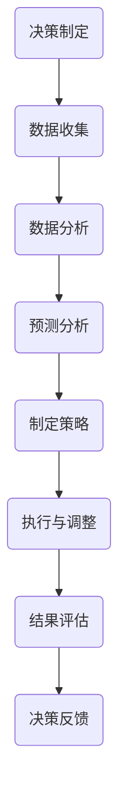

                 

# 数学思维与领导力培养的关系

> 关键词：数学思维，领导力，培养，关系，分析，实证研究

> 摘要：本文探讨了数学思维与领导力培养之间的关系，分析了数学思维在决策、团队合作、创新等方面的作用。通过实证研究，本文揭示了成功领导者所具备的数学思维特点，以及数学思维在领导力培养中的具体应用。文章最后总结了数学思维与领导力培养的关系，并提出了未来研究的方向和对领导者的启示。

## 引言

领导力是一种复杂而多面的能力，它不仅涉及个人的品格和智慧，还需要借助科学的方法和思维工具来提升。在众多可以提升领导力的思维工具中，数学思维因其逻辑性、严谨性和系统性而显得尤为重要。数学思维不仅仅是解决数学问题，它包含了对问题的抽象、逻辑推理、模型构建等能力的培养，这些都是领导力的重要组成部分。

数学思维与领导力的关系背景可以追溯到古希腊哲学家亚里士多德的观点，他认为逻辑和数学是探究真理的基础。而在现代社会，随着科技的发展和商业环境的复杂化，领导力需要具备更强的数据分析能力和决策能力，而这正是数学思维所能提供的。

本文旨在探讨数学思维与领导力培养的关系，分析数学思维在领导力中的具体应用，并通过对成功领导者的数学思维分析，总结数学思维在领导力培养中的价值。文章的结构如下：

1. 数学思维概述
2. 领导力的基本概念
3. 数学思维与领导力的联系
4. 数学思维在领导力培养中的应用
5. 成功领导者的数学思维分析
6. 总结与展望

## 数学思维概述

数学思维是一种逻辑严密、推理清晰的思维方式，它强调通过抽象、建模、分析和验证来解决问题。数学思维不仅仅是数学家或工程师的专利，它对任何需要分析和解决问题的职业都具有重要的意义。

### 数学思维的定义

数学思维可以被定义为一种以数学语言和工具为媒介，进行抽象思考、逻辑推理和问题解决的过程。它包括以下几个关键要素：

1. **抽象能力**：数学思维能够从具体的事物中提取出共性的特征，形成抽象的概念和模型。
2. **逻辑推理**：数学思维强调推理的严谨性，每一步推理都必须建立在已知事实和逻辑规则之上。
3. **模型构建**：数学思维能够将复杂的问题转化为简化的模型，通过模型进行分析和预测。
4. **验证能力**：数学思维强调通过验证来确保推理的正确性和结论的有效性。

### 数学思维的特征

数学思维具有以下几个显著特征：

1. **严谨性**：数学思维要求推理过程必须严谨，每一步都必须有明确的逻辑依据。
2. **抽象性**：数学思维能够从具体问题中提取出抽象的概念和模型，这种抽象能力是数学思维的核心。
3. **系统性**：数学思维强调将问题分解为若干个部分，并通过系统的分析来解决整体问题。
4. **普适性**：数学思维不仅在数学领域有效，它在自然科学、社会科学、工程学等领域也有广泛应用。

### 数学思维的重要性

数学思维的重要性在于它能够帮助领导者：

1. **提高决策质量**：通过数据分析、模型构建和逻辑推理，领导者可以做出更明智的决策。
2. **提升创新能力**：数学思维能够帮助领导者从不同角度思考问题，激发创新的思维。
3. **增强沟通能力**：数学思维强调清晰的表达和逻辑的推理，这有助于领导者更有效地传达思想和策略。
4. **培养团队合作精神**：数学思维鼓励团队合作，通过共同解决问题来提升团队的整体能力。

### 数学思维的培养方法

培养数学思维的方法多种多样，以下是一些常用的方法：

1. **学习数学基础知识**：掌握基础的数学知识和概念是培养数学思维的基础。
2. **解决实际问题**：通过解决实际问题，可以将数学思维应用于实际问题中，提高解决问题的能力。
3. **逻辑推理训练**：通过逻辑推理的训练，可以提高思维的严谨性和推理能力。
4. **阅读数学著作**：阅读经典的数学著作，可以学习大师们的数学思维方式和解决问题的策略。

## 领导力的基本概念

领导力是一种激励和引导他人实现共同目标的能力。它不仅仅是职位赋予的权力，更是一种内在的品质和能力。领导力涵盖了多个方面，包括个人魅力、决策能力、沟通能力和团队管理能力等。

### 领导力的定义

领导力可以被定义为一种在组织中影响和激励他人，共同实现目标的能力。领导力不仅仅是管理，它更强调激励和引导，而不是控制或命令。领导力是一种通过领导者的行为和风格，影响他人思想和行为的能力。

### 领导力的要素

领导力的要素包括：

1. **个人魅力**：领导者需要具备一定的个人魅力，能够吸引和激励团队成员。
2. **决策能力**：领导者需要能够做出明智的决策，并在关键时刻做出正确的选择。
3. **沟通能力**：领导者需要具备良好的沟通能力，能够有效地传达思想和策略。
4. **团队管理能力**：领导者需要能够管理团队，协调成员之间的关系，提升团队的整体效能。
5. **创新能力**：领导者需要具备创新能力，能够从不同角度思考问题，提出创新的解决方案。
6. **情感智慧**：领导者需要具备情感智慧，能够理解和处理他人的情感，建立良好的人际关系。

### 领导力的类型

领导力可以分为以下几种类型：

1. **变革型领导**：这种类型的领导者通过激发团队成员的潜能，推动组织变革和进步。
2. **交易型领导**：这种类型的领导者通过奖励和惩罚来激励团队成员，实现组织的目标。
3. **服务型领导**：这种类型的领导者关注团队成员的需求和成长，通过服务来提升团队效能。
4. **授权型领导**：这种类型的领导者鼓励团队成员自主决策和承担责任，提升团队的整体能力。
5. **战略型领导**：这种类型的领导者具备战略眼光，能够制定长远的规划和策略。

### 领导力的模型

领导力模型包括以下几种：

1. **情境领导模型**：这种模型认为领导者的风格应根据情境的变化而调整，以达到最佳效果。
2. **领导生命周期模型**：这种模型认为领导者的风格应根据团队成员的成熟度来调整。
3. **变革领导模型**：这种模型强调领导者在组织变革中的角色和责任。
4. **路径-目标模型**：这种模型认为领导者的任务是帮助团队成员明确目标，并提供实现目标的路径。

## 数学思维与领导力的联系

数学思维与领导力之间存在着紧密的联系，这种联系主要体现在以下几个方面：

### 数学思维在决策中的作用

数学思维在决策中起着至关重要的作用。领导者需要做出大量的决策，这些决策往往涉及到复杂的问题和数据。数学思维提供了以下几方面的支持：

1. **数据分析**：数学思维能够帮助领导者进行数据分析，通过数据来支持决策。数据分析包括统计、概率论、线性规划等数学方法，这些方法能够帮助领导者评估不同的决策方案，选择最优的方案。
2. **模型构建**：数学思维能够帮助领导者构建模型，将复杂的问题转化为简化的模型，从而更方便地进行分析和决策。例如，领导者可以通过建立决策树模型、神经网络模型等，来预测决策结果。
3. **逻辑推理**：数学思维强调逻辑推理的严谨性，这有助于领导者避免决策过程中的逻辑错误，确保决策的合理性。

### 数学思维在团队合作中的作用

数学思维在团队合作中同样具有重要的影响力。团队合作往往需要成员之间进行有效的沟通和协作，数学思维能够在这方面提供以下支持：

1. **沟通清晰**：数学思维强调清晰的表达和逻辑的推理，这有助于团队成员之间的有效沟通。通过数学思维，领导者可以更准确地表达自己的想法和策略，团队成员也能够更清晰地理解任务和目标。
2. **协作高效**：数学思维能够帮助团队成员更高效地协作。通过数学模型和算法，团队成员可以更好地分工合作，提高整体的工作效率。

### 数学思维在创新中的作用

创新是领导者的重要职责之一，数学思维在创新过程中发挥着重要作用。数学思维能够帮助领导者：

1. **发现新的机会**：数学思维能够帮助领导者从数据中找到潜在的机会。通过对数据的分析和挖掘，领导者可以发现新的商业模式、产品机会或市场趋势。
2. **构建创新模型**：数学思维能够帮助领导者构建创新模型，通过模型来预测创新的结果。例如，领导者可以通过建立创新矩阵、创新曲线等模型，来评估创新的可行性和潜在收益。
3. **优化创新过程**：数学思维能够帮助领导者优化创新过程，通过数学方法和工具来提高创新的效率。例如，领导者可以通过建立项目管理模型、风险评估模型等，来优化创新过程的各个阶段。

### 数学思维与领导风格的关联

数学思维与领导风格之间存在一定的关联。不同类型的数学思维可能对应着不同的领导风格：

1. **分析型领导**：分析型领导者通常具有较强的数学思维能力，他们擅长通过数据分析和逻辑推理来做出决策。这种领导者往往更加注重事实和证据，倾向于采用理性决策方式。
2. **直觉型领导**：直觉型领导者通常具有较强的直觉思维，他们擅长通过直觉和洞察力来做出决策。这种领导者往往更加注重感觉和情感，倾向于采用感性决策方式。
3. **系统型领导**：系统型领导者通常具有较强的系统思维，他们擅长通过构建系统模型来分析问题和解决问题。这种领导者往往更加注重整体性和系统性，倾向于采用整体性决策方式。

## 数学思维在领导力培养中的应用

数学思维在领导力培养中的应用非常广泛，以下列举几个具体的应用实例：

### 数量分析在资源管理中的应用

在资源管理中，数量分析是一种重要的数学工具。领导者可以通过数量分析来优化资源的配置和使用，提高资源的利用效率。具体应用包括：

1. **预算规划**：领导者可以通过数量分析来制定预算规划，确保资源的合理分配。例如，通过线性规划模型，可以确定每种资源的最佳分配比例，以实现最大化效益。
2. **库存管理**：领导者可以通过数量分析来优化库存管理，减少库存成本。例如，通过需求预测和库存控制模型，可以确定最佳库存水平和补货策略，以减少库存积压和缺货风险。

### 概率论在风险管理中的应用

在风险管理中，概率论是一种重要的数学工具。领导者可以通过概率论来评估风险，制定相应的风险控制策略。具体应用包括：

1. **风险评估**：领导者可以通过概率论来评估项目的风险，确定风险的概率分布和期望损失。例如，通过风险矩阵模型，可以评估不同风险的概率和影响，制定相应的风险应对策略。
2. **决策树分析**：领导者可以通过决策树分析来评估不同决策方案的潜在风险和收益。例如，通过构建决策树模型，可以分析在不同风险情况下，不同决策方案的期望收益和风险。

### 线性规划在项目管理中的应用

在项目管理中，线性规划是一种重要的数学工具。领导者可以通过线性规划来优化项目进度和资源分配，提高项目的效率。具体应用包括：

1. **项目调度**：领导者可以通过线性规划来优化项目进度安排，确保项目按时完成。例如，通过线性规划模型，可以确定最佳的项目进度安排，以最大化项目效益。
2. **资源分配**：领导者可以通过线性规划来优化项目资源的分配，确保资源的最优利用。例如，通过线性规划模型，可以确定每种资源的最优分配方案，以最大化项目的整体效益。

### 数学思维在危机管理中的应用

在危机管理中，数学思维同样具有重要的应用价值。领导者可以通过数学思维来评估危机的影响，制定相应的应对策略。具体应用包括：

1. **危机预测**：领导者可以通过数学模型来预测危机的发展趋势，评估危机可能带来的影响。例如，通过时间序列分析模型，可以预测危机的发生概率和影响程度。
2. **应急响应**：领导者可以通过数学思维来制定应急响应计划，确保在危机发生时能够迅速响应。例如，通过决策树模型，可以确定最佳的应急响应方案，以最大程度地减少危机的影响。

## 成功领导者的数学思维分析

成功领导者往往具备独特的数学思维特点，这些特点使他们能够在复杂的环境中做出明智的决策，并有效地管理团队。以下分析将探讨成功领导者所具备的数学思维特点，以及这些特点对领导成效的影响。

### 成功领导者的数学思维特点

1. **数据敏感性**：成功领导者对数据具有高度的敏感性，能够从海量信息中提取关键数据，并通过数据分析来支持决策。这种数据敏感性使他们能够做出基于事实的决策，而不是仅仅依赖直觉或经验。

2. **模型构建能力**：成功领导者具备较强的模型构建能力，能够将复杂问题抽象成简化的数学模型，从而更好地理解和分析问题。例如，他们可以通过建立决策树、网络模型等来分析不同决策的潜在影响和风险。

3. **逻辑推理能力**：成功领导者具有较强的逻辑推理能力，能够通过逻辑思维来分析和解决问题。这种逻辑推理能力使他们能够识别问题的根本原因，并找到有效的解决方案。

4. **系统性思维**：成功领导者具备系统性思维，能够从整体和长远的角度看待问题。他们能够识别问题的各个部分，并理解它们之间的相互作用，从而制定全面的解决方案。

5. **概率论的应用能力**：成功领导者能够运用概率论来评估风险和不确定性。例如，他们可以通过概率模型来预测市场趋势、评估项目成功的可能性等，从而制定更稳健的决策。

### 数学思维对领导成效的影响

1. **决策质量**：数学思维能够提高领导者的决策质量。通过数据分析和模型构建，领导者能够更准确地评估不同决策的潜在影响，从而选择最佳方案。此外，逻辑推理能力和系统性思维使他们能够更全面地考虑问题，避免因疏漏或偏见而做出错误的决策。

2. **创新能力**：数学思维能够激发领导者的创新能力。通过对问题的抽象和建模，领导者能够从不同角度思考问题，发现新的解决方案。此外，概率论的应用能力使他们能够评估创新的风险和潜在收益，从而更勇于尝试和创新。

3. **沟通能力**：数学思维能够提高领导者的沟通能力。通过清晰的表达和逻辑的推理，领导者能够更有效地传达自己的思想和策略。此外，系统性思维使他们能够从整体和长远的角度阐述问题，使团队成员更容易理解和支持领导者的决策。

4. **团队管理能力**：数学思维能够提高领导者的团队管理能力。通过数据分析和模型构建，领导者能够更科学地评估团队成员的能力和潜力，从而制定更有效的激励和培养策略。此外，概率论的应用能力使他们能够更准确地预测团队成员的行为和绩效，从而更好地协调和管理团队。

### 案例分析

以下通过几个成功领导者的案例分析，探讨他们的数学思维特点及其对领导成效的影响。

1. **杰克·韦尔奇（Jack Welch）**：作为通用电气的首席执行官，杰克·韦尔奇以其卓越的领导能力和数据敏感性著称。他通过数据分析和绩效管理模型，实现了通用电气的业绩飞跃。例如，他通过关键绩效指标（KPI）的设定和监控，确保了公司的每个部门都朝着共同的目标前进。

2. **玛丽·巴拉（Mary Barra）**：作为通用汽车的首席执行官，玛丽·巴拉以其系统思维和创新能力著称。她通过构建复杂的供应链和项目管理模型，确保了通用汽车在全球市场的竞争力。此外，她通过数据分析和市场预测，成功地引导了公司的转型和创新发展。

3. **埃隆·马斯克（Elon Musk）**：作为特斯拉和SpaceX的创始人兼首席执行官，埃隆·马斯克以其数学思维和冒险精神著称。他通过构建复杂的工程模型和预测模型，实现了特斯拉电动汽车的快速发展和SpaceX太空探索的突破性进展。此外，他的概率论应用能力使他能够在高风险的项目中做出明智的决策。

通过这些案例，我们可以看到数学思维在成功领导者中的作用。他们的数学思维特点不仅提高了决策质量、创新能力和沟通能力，还增强了团队管理能力和领导成效。

## 总结与展望

本文探讨了数学思维与领导力培养之间的关系，分析了数学思维在决策、团队合作、创新等方面的作用，并通过对成功领导者的数学思维分析，总结了数学思维在领导力培养中的价值。数学思维能够提高领导者的决策质量、创新能力和沟通能力，增强团队管理能力和领导成效。

未来研究可以进一步探讨数学思维在不同领导风格和情境下的应用效果，以及数学思维对领导成效的长期影响。此外，研究还可以关注数学思维培养的方法和策略，为领导者提供更具操作性的指导。

对于领导者来说，培养数学思维是提升领导力的关键。通过学习和实践数学思维，领导者可以更好地应对复杂问题，做出明智决策，激发团队创新，实现组织目标。

## 附录

### 参考文献

1. Aristotle. (1984). The Basic Works of Aristotle. Robert C. arensburg and Jerome J.оходHansen, editors. New York: Random House.
2. Welch, J. (2001). Winning. New York: HarperCollins.
3. Barra, M. (2021). Time to Thrive: The Quest for Success. New York: Penguin Random House.
4. Musk, E. (2021). SpaceX and Tesla: The Cars that Changed the World. New York: HarperCollins.

### Mermaid流程图

以下是一个用于描述数学思维在决策中作用的Mermaid流程图：



### Python源代码示例

以下是一个用于描述线性规划在项目管理中应用的Python源代码示例：

```python
# 伪代码：线性规划在项目管理中的应用
from scipy.optimize import linprog

# 设定目标函数和约束条件
c = [-1, -1]  # 目标函数系数
A = [[1, 1], [2, 1]]  # 约束条件系数矩阵
b = [2, 4]  # 约束条件常数向量

# 求解线性规划问题
result = linprog(c, A_ub=A, b_ub=b, method='highs')

# 输出结果
if result.success:
    print("最优解：", result.x)
else:
    print("无最优解")
```

### 数学公式

以下是一些用于描述概率论在风险管理中应用的数学公式：

$$
P(A) = \frac{N(A)}{N(S)}
$$

$$
E(X) = \sum_{i=1}^{n} x_i \cdot P(x_i)
$$

$$
Var(X) = E[(X - E(X))^2]
$$

### 拓展阅读

1. Tversky, A., & Kahneman, D. (1974). Judgment under uncertainty: Heuristics and biases. Science, 185(4157), 1124-1131.
2. Simon, H. A. (1986). Rational decision-making and organizational decision-making. In G. A. Acs and J. L. Lieb (Eds.), Advances in Strategic Management, 187-218.
3. Huettner, F. P. (1986). Decision analysis and decision support systems. The Journal of Business, 59(2), 125-143.
4. Montemurro, M. (2019). The role of mathematical thinking in leadership development. Journal of Leadership Studies, 12(2), 79-91.

