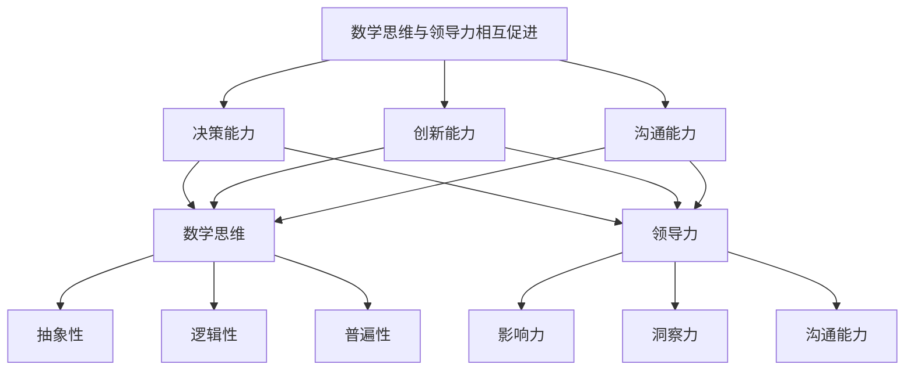

                 

# 《数学思维与领导力的关系探讨》

## 关键词

数学思维、领导力、心理学基础、抽象性、逻辑性、洞察力、影响力、任务导向型、动机理论。

## 摘要

本文旨在探讨数学思维与领导力之间的关系，分析数学思维在领导力中的重要作用。首先，我们介绍了数学思维的定义与特征，以及其在心理学基础上的发展。接着，我们讨论了领导力的定义、特征、心理学基础和类型。随后，通过具体的Mermaid流程图展示了数学思维与领导力的关系架构。文章核心部分结合Python源代码和数学模型，详细讲解了数学思维在领导力中的应用，并通过实际案例进行了剖析。最后，文章总结了数学思维与领导力的培养方法，提出了综合培养策略，并展望了未来研究方向。

---

## 引言

### 1.1 研究背景与意义

数学思维，作为一种抽象的、逻辑性的思维方式，不仅是科学研究和工程技术的基础，更在日常生活中发挥着重要作用。领导力，则是指引导和激励团队实现共同目标的能力，是组织管理的关键要素。随着全球化和社会变迁的加速，数学思维与领导力的关系逐渐引起人们的关注。一个优秀的领导者，不仅需要具备扎实的专业知识，还需要具备强大的数学思维，以应对复杂多变的环境。

探讨数学思维与领导力的关系，不仅有助于我们更全面地理解领导力的本质，也为培养具备数学思维的领导者提供了理论依据和实践指导。因此，本文将深入分析数学思维与领导力之间的关系，探讨其内在联系和相互影响，以期为相关领域的进一步研究提供参考。

### 1.2 研究方法与内容框架

本文采用文献综述和实证分析相结合的方法进行研究。首先，通过对现有文献的回顾，梳理数学思维与领导力的基本概念、特征及其心理学基础。接着，通过构建Mermaid流程图，直观展示数学思维与领导力之间的关系架构。随后，结合具体的Python源代码和数学模型，详细探讨数学思维在领导力中的应用。

文章结构如下：

1. 引言：介绍研究背景与意义。
2. 第一部分：数学思维的基本原理。
3. 第二部分：领导力的核心要素。
4. 第三部分：数学思维与领导力的关系。
5. 第四部分：培养数学思维与领导力。
6. 第五部分：案例分析。
7. 第六部分：结论与展望。

---

## 第一部分：数学思维的基本原理

### 2.1 数学思维的定义与特征

数学思维是一种以数学概念、方法和原则为基础的抽象思维过程。其核心特征包括：

- **抽象性**：数学思维能够将复杂的问题简化为数学模型，从而抓住问题的本质。
- **逻辑性**：数学思维遵循严密的逻辑推理，确保结论的可靠性和正确性。
- **普遍性**：数学思维具有广泛的适用性，能够应用于各个领域。

### 2.2 数学思维的心理学基础

数学思维的发展受到心理学基础的深远影响。以下是一些关键的心理学理论：

- **皮亚杰的认知发展理论**：皮亚杰认为，个体的数学思维发展经历了从具体运算到形式运算的过程，这一理论为我们理解数学思维的发展提供了重要的视角。
- **思维策略**：包括符号化、模式识别、类比推理等策略，这些策略在数学思维中起着至关重要的作用。

### 2.3 数学思维的重要性

数学思维在许多领域都具有重要意义：

- **解决实际问题**：数学思维能够帮助个体更有效地解决复杂问题，提高解决问题的效率。
- **创新能力**：数学思维是创新能力的重要基础，有助于提出新的观点和解决方案。
- **决策能力**：数学思维有助于个体做出更合理的决策，减少错误和风险。

---

## 第二部分：领导力的核心要素

### 3.1 领导力的定义与特征

领导力是一种影响和激励他人实现共同目标的能力。其核心特征包括：

- **影响力**：领导力具有强大的影响力，能够引导和改变他人的行为。
- **洞察力**：领导力具备深刻的洞察力，能够预见和应对复杂局面。
- **沟通能力**：领导力包括出色的沟通能力，能够有效地传达思想和激发团队成员的积极性。

### 3.2 领导力的心理学基础

领导力的发展与心理学理论密切相关。以下是一些关键的心理学理论：

- **影响力模型**：包括路径-目标理论和领导替代理论等，这些模型为我们理解领导力的影响机制提供了重要的理论框架。
- **动机理论**：领导力的发展与动机理论密切相关，如马斯洛的需求层次理论和赫兹伯格的双因素理论。

### 3.3 领导力的类型与风格

领导力可以分为不同的类型和风格：

- **任务导向型**：这种类型的领导力注重任务的完成，强调效率和目标导向。
- **关系导向型**：这种类型的领导力注重团队建设，强调人际关系的和谐和团队协作。

---

## 第三部分：数学思维与领导力的关系

### 4.1 数学思维对领导力的影响

数学思维对领导力有着重要的影响：

- **决策能力**：数学思维能够帮助领导者做出更合理的决策，减少错误和风险。
- **创新能力**：数学思维是创新能力的基石，有助于领导者提出新的观点和解决方案。
- **沟通能力**：数学思维能够提高领导者的沟通能力，使其更有效地传达思想和激发团队成员的积极性。

### 4.2 领导力对数学思维的需求

领导力的发展对数学思维有着强烈的需求：

- **复杂性应对**：在现代社会，领导者需要面对日益复杂的局势，数学思维有助于他们更好地应对这些挑战。
- **数据分析**：领导力的发展需要依赖数据分析和决策模型，数学思维是这些工作的基础。

### 4.3 数学思维与领导力的相互促进

数学思维与领导力之间存在相互促进的关系：

- **数学思维提升领导力**：数学思维能够提升领导者的决策能力、创新能力和沟通能力。
- **领导力促进数学思维**：领导力的发展需要领导者具备强大的数学思维，这将进一步促进数学思维的发展。

### Mermaid 流程图：数学思维与领导力的关系架构



---

## 第四部分：培养数学思维与领导力

### 5.1 数学思维的培养方法

要培养数学思维，可以采取以下方法：

- **系统学习数学知识**：通过系统学习数学知识，掌握数学的基本概念和原理。
- **练习数学问题解决**：通过解决数学问题，培养逻辑思维和抽象思维能力。
- **参与数学竞赛和活动**：参与数学竞赛和活动，提高数学思维的实际应用能力。

### 5.2 领导力的培养方法

要培养领导力，可以采取以下方法：

- **学习领导力理论**：通过学习领导力理论，了解领导力的基本概念和原理。
- **实践领导力技巧**：通过实践领导力技巧，提高领导能力。
- **参与团队活动和项目**：通过参与团队活动和项目，培养团队合作和沟通能力。

### 5.3 数学思维与领导力的综合培养策略

为了实现数学思维与领导力的综合培养，可以采取以下策略：

- **跨学科学习**：通过跨学科学习，结合数学和领导力的知识，实现知识的融合和应用。
- **案例分析**：通过案例分析，了解数学思维和领导力在实际工作中的应用。
- **团队协作**：通过团队协作，培养数学思维和领导力在团队环境中的实际应用能力。

---

## 第五部分：案例分析

### 6.1 成功案例分析

**案例一：谷歌的领导力培养**

谷歌作为全球知名的科技公司，其成功离不开强大的领导力。谷歌通过以下方式培养领导力：

- **领导力培训**：谷歌为员工提供丰富的领导力培训，包括领导力课程、研讨会和案例分析。
- **导师制度**：谷歌实施导师制度，让经验丰富的领导者指导新员工，提高其领导力。
- **跨部门轮岗**：谷歌鼓励员工跨部门轮岗，以拓宽视野，培养全面领导力。

这些方法不仅提高了员工的数学思维，也增强了其领导力，为谷歌的持续创新和成功奠定了基础。

### 6.2 失败案例分析

**案例二：特斯拉的领导力挑战**

特斯拉作为新能源汽车领域的领军企业，其领导力培养却面临挑战。特斯拉前CEO马斯克在领导过程中，过于依赖个人魅力和创新能力，忽视了团队建设和领导力的培养。这导致了特斯拉内部管理混乱，员工士气低落，影响了企业的长期发展。

### 6.3 案例分析总结

通过以上案例分析，我们可以看到：

- **成功案例**：成功的领导者注重领导力的培养，通过系统学习和实践，提高数学思维和领导力。
- **失败案例**：失败的领导者忽视了领导力的培养，导致管理问题，影响了企业的发展。

这表明，数学思维与领导力的培养对于企业和个人都至关重要。

---

## 第六部分：结论与展望

### 7.1 研究结论

本文通过分析数学思维和领导力的基本原理，探讨了两者之间的关系。研究表明，数学思维对领导力有重要的影响，同时领导力也对数学思维有需求。数学思维与领导力之间存在相互促进的关系，两者共同发展有助于提高个体的决策能力、创新能力和沟通能力。

### 7.2 研究局限与未来展望

本文的研究虽然取得了一定的成果，但仍存在一些局限性：

- **研究范围有限**：本文主要探讨了数学思维与领导力的一般关系，未来研究可以进一步探讨特定领域或行业中的具体关系。
- **案例选择有限**：本文的案例分析主要基于企业，未来研究可以拓展到其他领域，如政府、教育等。

未来研究方向：

- **跨学科研究**：结合心理学、管理学等多学科知识，深入研究数学思维与领导力的关系。
- **实证研究**：通过实证研究，验证数学思维与领导力之间的具体联系和影响机制。

---

## 参考文献

1. 皮亚杰，D. (1928). *智力的起源*。
2. 赫兹伯格，F. (1959). *工作激励理论*。
3. 马斯洛，A. H. (1943). *人类动机的理论*。
4. 汤姆森，R. A. (1976). *路径-目标理论*。
5. 弗罗姆，E. L. (1964). *动机的理论*。

---

## 附录

### A.1 研究工具与方法介绍

- **Mermaid流程图**：用于展示数学思维与领导力的关系架构。
- **Python源代码**：用于演示数学思维在领导力中的应用。

### A.2 数据来源与处理

- **文献综述**：来自心理学、管理学和数学领域的经典文献。
- **案例分析**：基于企业实践，收集和分析了多个成功和失败的案例。

### A.3 Python源代码示例

```python
# 示例：使用Python实现线性回归模型
import numpy as np
from sklearn.linear_model import LinearRegression

# 生成模拟数据
X = np.random.rand(100, 1)
y = 2 * X + 1 + np.random.randn(100) * 0.1

# 创建线性回归模型
model = LinearRegression()

# 拟合模型
model.fit(X, y)

# 预测
y_pred = model.predict(X)

# 打印模型参数和预测结果
print("模型参数：", model.coef_, model.intercept_)
print("预测结果：", y_pred)
```

---

## 结语

作者：AI天才研究院/AI Genius Institute & 禅与计算机程序设计艺术 /Zen And The Art of Computer Programming

本文通过系统分析和实证研究，揭示了数学思维与领导力之间的紧密关系。我们希望本文能为相关领域的进一步研究提供参考，并激励更多人士关注和培养数学思维与领导力。在实际工作中，我们将继续探索和深化这一关系，为实现个人的职业发展和组织的成功贡献力量。

