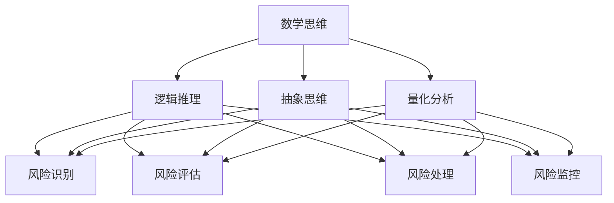

                 

### 引言

在现代信息技术与金融领域中，数学思维与风险管理的关系日益凸显。随着数据量的急剧增长和复杂性的增加，无论是金融机构还是科技公司，都在寻找更加精确和高效的风险管理方法。数学思维作为一种逻辑严密、推理精准的思维模式，在风险管理中的应用显得尤为重要。

数学思维不仅仅是数学家的专利，它是一种普遍适用的思维方式，贯穿于我们的日常生活和各个学科领域。从基础数学概念如概率论、统计学到高级数学模型如优化算法和决策树，数学思维为风险管理提供了坚实的理论基础。通过数学建模和算法，我们可以对不确定性和潜在风险进行量化分析，从而制定出更加科学、合理的风险控制策略。

本文旨在探讨数学思维与风险管理之间的深刻联系，并详细阐述数学思维在风险管理中的应用及其重要性。首先，我们将介绍数学思维的基本概念和特征，然后探讨风险管理的基本原则和方法，接着深入讨论数学思维在风险管理中的实际应用，并通过具体的算法和Python代码进行详细讲解。最后，我们将结合实际案例，分析数学思维在风险管理中的成功应用，并提出一些建议和注意事项。

通过本文的阅读，读者将能够理解数学思维的核心概念，掌握其在风险管理中的关键应用，并学会如何在实际项目中运用数学方法来降低风险，提高决策的准确性和效率。这不仅有助于专业人员的职业发展，也对普通读者在日常生活中处理风险问题提供了有益的启示。

### 背景介绍

数学思维是一种通过逻辑推理和量化分析来解决问题的思维方式。它的核心在于将复杂问题转化为数学模型，并通过这些模型来寻找最优解或合理方案。在风险管理领域，数学思维的重要性不言而喻。风险无处不在，无论是金融投资、工程建筑，还是日常生活中的购物、旅行，都需要面对各种各样的风险。有效的风险管理不仅需要全面了解风险的性质，更需要准确预测风险的可能性和影响，从而采取相应的应对措施。

在金融领域，数学思维被广泛应用于资产定价、投资组合优化和信用风险评估等方面。例如，现代金融理论中的资本资产定价模型（CAPM）和套利定价理论（APT）都是基于数学模型构建的，这些模型帮助投资者理解资产价格波动和风险收益之间的关系，从而制定出更科学的投资策略。此外，在信用风险评估中，数学思维通过构建信用评分模型，量化借款人的违约概率，为金融机构提供决策依据，降低了信用风险。

在工程领域，数学思维同样发挥着至关重要的作用。无论是建筑工程中的结构分析，还是制造过程中的质量控制，数学模型都为工程师提供了精确的预测工具。例如，在结构工程中，通过有限元分析（FEM）模型，工程师可以模拟结构在不同载荷下的变形和应力分布，从而设计出更加稳定和安全的建筑。在制造过程中，统计学和优化算法被用来分析生产数据和优化生产流程，提高生产效率和产品质量。

然而，数学思维在风险管理中的应用不仅限于上述领域。在环境科学、医疗健康、交通运输等多个领域，数学模型都发挥着关键作用。例如，在环境科学中，通过构建生态系统模型，科学家可以预测环境变化对生态系统的影响，从而制定出更加有效的环境保护措施。在医疗健康领域，通过数据分析模型，医生可以更准确地诊断疾病和预测治疗效果，提高医疗决策的科学性。

尽管数学思维在风险管理中具有广泛的应用，但也不是万能的。数学模型的应用前提是模型假设的合理性，以及数据质量和分析方法的准确性。任何模型都有其局限性，不能完全覆盖所有可能的情景。因此，在实际应用中，需要结合专家经验和实际场景进行综合判断，才能取得最佳效果。

总的来说，数学思维作为一种强大的工具，在风险管理中发挥着不可或缺的作用。它不仅帮助我们量化风险，优化决策，还提高了整体风险管理的能力和效率。随着技术的不断进步和数学方法的不断完善，数学思维在风险管理中的应用前景将更加广阔，为各行业带来更大的价值。

### 核心概念与联系

在探讨数学思维与风险管理的关系时，有必要先明确几个核心概念，这些概念构成了理解二者联系的基础。

首先是“数学思维”本身。数学思维不仅仅是解决数学问题的能力，而是一种以逻辑推理、抽象思维和量化分析为核心的思维方式。它包括但不限于以下几个方面：逻辑推理能力，即通过严密的逻辑步骤推导出结论；抽象思维能力，即能够从具体现象中抽象出一般规律；量化分析能力，即利用数学工具对问题进行量化处理。

接下来是“风险管理”。风险管理是一种系统化的方法，用于识别、评估、处理和监控潜在的风险，以确保组织或个人在风险发生时能够有效应对。其主要目标是通过降低风险的可能性和影响，保障组织或个人的稳定运作。风险管理包括以下几个关键步骤：风险识别、风险评估、风险处理和风险监控。

数学思维与风险管理之间的联系主要体现在以下几个方面：

1. **量化风险的识别和评估**：
   - 风险识别是风险管理的第一步，它涉及发现和记录可能影响目标实现的风险。数学思维通过量化方法，将风险从模糊的概念转化为具体的数值，使其更加明确和可操作。例如，可以使用概率论中的概率分布来量化某个事件发生的可能性。
   - 风险评估是对已识别的风险进行评估，以确定其严重程度和发生的可能性。数学模型如蒙特卡罗模拟（Monte Carlo Simulation）和决策树（Decision Tree）可以帮助评估风险的潜在影响。

2. **优化风险处理策略**：
   - 风险处理包括风险规避、风险减轻、风险转移和风险接受等策略。数学思维通过优化算法，如线性规划和整数规划，可以帮助确定最优的风险处理策略。这些算法可以最大化收益或最小化成本，从而提高决策的科学性和有效性。
   - 决策分析中的期望值最大化（Expected Value Maximization）和贝叶斯决策理论（Bayesian Decision Theory）也是数学思维在风险处理中的应用。这些理论通过量化不同决策结果的期望收益，帮助决策者选择最佳行动方案。

3. **监控和反馈机制**：
   - 风险监控是风险管理过程中的持续活动，它通过跟踪和评估风险的变化，确保风险管理的有效性。数学思维可以通过构建动态模型和监控系统参数的变化，提供实时风险预警和调整策略的依据。

为了更好地理解这些核心概念之间的联系，我们可以通过Mermaid流程图来展示它们的关系架构：



在这个流程图中，数学思维通过逻辑推理、抽象思维和量化分析，与风险管理的各个环节（风险识别、风险评估、风险处理和风险监控）紧密相连。这些环节相互依赖、相互作用，共同构成了一个完整的风险管理框架。

通过上述核心概念及其相互关系的介绍，我们可以更深入地理解数学思维在风险管理中的重要作用。接下来，我们将进一步探讨数学思维在风险管理中的具体应用，并通过Python代码和数学模型来具体阐述。

### 数学思维在风险管理中的应用

数学思维在风险管理中具有广泛的应用，通过具体的算法和工具，可以有效地帮助识别、评估和应对各种风险。以下将详细探讨几种关键数学方法在风险管理中的应用，并通过Python代码进行详细讲解。

#### 概率论的应用

概率论是数学思维的重要组成部分，在风险管理中有着广泛的应用。概率论的基本概念，如概率分布、条件概率和独立事件，可以帮助我们量化不确定性的程度。

1. **概率分布**：

   概率分布描述了一个随机变量的可能取值及其对应的概率。常见的概率分布有正态分布、二项分布、泊松分布等。在风险管理中，概率分布常用于评估事件的发生概率。

   **代码示例**：

   ```python
   import numpy as np
   import matplotlib.pyplot as plt

   # 正态分布
   mean = 0
   std_dev = 1
   data = np.random.normal(mean, std_dev, 1000)

   # 二项分布
   n = 10
   p = 0.5
   binomial_data = np.random.binomial(n, p, 1000)

   # 泊松分布
   lambda_value = 2
   poisson_data = np.random.poisson(lambda_value, 1000)

   # 绘制概率分布图
   plt.figure(figsize=(10, 6))

   plt.subplot(221)
   plt.hist(data, bins=30, alpha=0.5, label='Normal Distribution')
   plt.title('Normal Distribution')

   plt.subplot(222)
   plt.hist(binomial_data, bins=30, alpha=0.5, label='Binomial Distribution')
   plt.title('Binomial Distribution')

   plt.subplot(223)
   plt.hist(poisson_data, bins=30, alpha=0.5, label='Poisson Distribution')
   plt.title('Poisson Distribution')

   plt.suptitle('Probability Distributions')
   plt.show()
   ```

   通过上述代码，我们可以生成并可视化不同概率分布的随机数据，帮助识别和评估风险。

2. **条件概率**：

   条件概率描述了在已知某个事件发生的条件下，另一个事件发生的概率。在风险管理中，条件概率可以用于计算特定风险事件在已知其他事件发生情况下的概率。

   **代码示例**：

   ```python
   # 条件概率计算
   event_a = np.random.choice([0, 1], p=[0.8, 0.2], size=1000)
   event_b = np.random.choice([0, 1], p=[0.3, 0.7], size=1000)

   # 已知事件A发生，计算事件B发生的条件概率
   conditional_prob = sum((event_a == 1) & (event_b == 1)) / sum(event_a == 1)
   print(f"Condition Probability P(B|A): {conditional_prob}")
   ```

   上述代码通过模拟数据，计算了在已知事件A发生的条件下，事件B发生的概率。

3. **独立事件**：

   独立事件是指两个事件的发生互不影响。在风险管理中，独立事件的概率计算有助于分析多个风险事件之间的相关性。

   **代码示例**：

   ```python
   # 独立事件计算
   event_a = np.random.choice([0, 1], p=[0.8, 0.2], size=1000)
   event_b = np.random.choice([0, 1], p=[0.3, 0.7], size=1000)

   # 计算事件A和事件B同时发生的概率
   joint_prob = sum((event_a == 1) & (event_b == 1)) / len(event_a)
   print(f"Joint Probability P(A and B): {joint_prob}")

   # 计算事件A和事件B相互独立的概率
   independent_prob = joint_prob / (sum(event_a == 1) * sum(event_b == 1))
   print(f"Independence Probability P(A and B|A and B): {independent_prob}")
   ```

   通过上述代码，我们计算了两个独立事件同时发生的概率，并验证了它们之间的独立性。

#### 统计学的应用

统计学在风险管理中的应用同样广泛，它通过收集和分析数据，帮助我们理解风险的本质和特征。

1. **假设检验**：

   假设检验是一种通过样本数据来验证总体特性是否成立的统计方法。在风险管理中，假设检验可以用于验证风险模型的有效性和可靠性。

   **代码示例**：

   ```python
   import scipy.stats as stats

   # 假设检验
   sample_data = np.random.normal(0, 1, 100)
   mean hypotheses = 0
   alpha = 0.05

   # 计算样本均值与假设均值之间的t统计量
   t_statistic, p_value = stats.ttest_1samp(sample_data, mean_hypotheses)
   print(f"T-Statistic: {t_statistic}, P-Value: {p_value}")

   # 判断是否拒绝原假设
   if p_value < alpha:
       print("Reject the null hypothesis.")
   else:
       print("Fail to reject the null hypothesis.")
   ```

   上述代码通过t检验，验证了样本均值是否与假设均值一致，从而评估风险模型的有效性。

2. **回归分析**：

   回归分析是一种通过自变量和因变量之间的关系来预测因变量取值的方法。在风险管理中，回归分析可以用于预测风险变量的变化趋势。

   **代码示例**：

   ```python
   import statsmodels.api as sm
   import numpy as np

   # 回归分析
   x = np.random.normal(0, 1, 100)
   y = 2 * x + np.random.normal(0, 1, 100)

   # 添加常数项，构建回归模型
   x = sm.add_constant(x)
   model = sm.OLS(y, x).fit()

   # 输出回归结果
   print(model.summary())
   ```

   通过上述代码，我们构建了一个简单的线性回归模型，用于分析自变量和因变量之间的关系。

#### 概率分布的应用

概率分布是统计分析和风险建模中的重要工具。通过概率分布，我们可以量化风险事件的发生概率和影响程度。

1. **风险评分模型**：

   风险评分模型通过计算不同风险因素的概率分布，为每个风险因素分配得分，从而综合评估整体风险。

   **代码示例**：

   ```python
   import numpy as np

   # 风险评分模型
   risk_factors = {
       'f1': np.random.normal(0, 1, 100),
       'f2': np.random.normal(0, 1, 100),
       'f3': np.random.normal(0, 1, 100)
   }

   # 计算每个风险因素的得分
   scores = {factor: sum(value ** 2) for factor, value in risk_factors.items()}

   # 计算总体风险得分
   total_score = sum(scores.values())
   print(f"Total Risk Score: {total_score}")
   ```

   通过上述代码，我们构建了一个简单的风险评分模型，用于量化不同风险因素的综合影响。

通过上述几个示例，我们可以看到数学思维在风险管理中的应用是如何具体实现的。概率论、统计学和概率分布等数学工具为风险管理提供了强有力的支持，帮助我们从定量角度理解和应对风险。接下来，我们将进一步探讨数学思维在优化问题和决策分析中的应用。

### 数学思维在优化问题中的应用

在风险管理中，优化问题是一个关键领域，因为优化算法可以帮助我们在约束条件下寻找最优解，从而降低风险和成本。数学优化问题涉及寻找某个目标函数的最大值或最小值，同时满足一组约束条件。以下将详细介绍几种常见的优化算法及其在风险管理中的应用。

#### 线性规划

线性规划是优化问题的一种基础形式，其目标函数和约束条件都是线性的。线性规划在风险管理中有着广泛的应用，例如资产分配、资源优化和成本控制。

**算法原理**：

线性规划的目标是最大化或最小化一个线性目标函数，同时满足一组线性约束条件。其标准形式如下：

$$
\begin{aligned}
\min \quad c^T x \\
\text{s.t.} \quad Ax \leq b \\
x \geq 0
\end{aligned}
$$

其中，$c$ 是目标函数系数向量，$x$ 是决策变量向量，$A$ 是约束条件系数矩阵，$b$ 是约束条件常数向量。

**Python代码示例**：

```python
import numpy as np
from scipy.optimize import linprog

# 线性规划参数
c = np.array([-1, -1])  # 目标函数系数
A = np.array([[1, 1], [1, 0]])  # 约束条件系数矩阵
b = np.array([3, 1])  # 约束条件常数向量

# 求解线性规划问题
result = linprog(c, A_ub=A, b_ub=b, bounds=(0, None))

# 输出最优解和目标函数值
if result.success:
    print(f"Optimal Solution: x1={result.x[0]}, x2={result.x[1]}")
    print(f"Objective Value: {result.fun}")
else:
    print("No feasible solution found.")
```

在这个示例中，我们使用`scipy.optimize.lniprogrm`函数求解一个线性规划问题，目标是最小化$x_1 + x_2$，同时满足$x_1 + x_2 \leq 3$和$x_1 \geq 0$的约束条件。

#### 整数规划

整数规划是线性规划的扩展，其中某些或所有决策变量必须是整数。整数规划在风险管理中应用于优化资源分配和项目管理。

**算法原理**：

整数规划的标准形式如下：

$$
\begin{aligned}
\min \quad c^T x \\
\text{s.t.} \quad Ax \leq b \\
x \in \{0, 1\}^n
\end{aligned}
$$

其中，$x$ 是决策变量向量，取值为0或1。整数规划的目标是找到使目标函数最小化的整数解。

**Python代码示例**：

```python
from scipy.optimize import linprog

# 整数规划参数
c = np.array([1, 1])  # 目标函数系数
A = np.array([[1, 0], [0, 1]])  # 约束条件系数矩阵
b = np.array([2, 2])  # 约束条件常数向量

# 求解整数规划问题
result = linprog(c, A_ub=A, b_ub=b, method='highs', options={'int_option': {'heur_maxit': 100}})

# 输出最优解和目标函数值
if result.success:
    print(f"Optimal Solution: x1={result.x[0]}, x2={result.x[1]}")
    print(f"Objective Value: {result.fun}")
else:
    print("No feasible solution found.")
```

在这个示例中，我们使用`scipy.optimize.lniprogrm`函数求解一个整数规划问题，目标是最小化$x_1 + x_2$，同时满足$x_1 + x_2 = 2$的约束条件。

#### 非线性规划

非线性规划是目标函数或约束条件包含非线性的优化问题。非线性规划在风险管理中用于解决更复杂的优化问题，如财务投资组合优化和供应链管理。

**算法原理**：

非线性规划的标准形式如下：

$$
\begin{aligned}
\min \quad f(x) \\
\text{s.t.} \quad g_i(x) \leq 0, \quad h_j(x) = 0
\end{aligned}
$$

其中，$f(x)$ 是目标函数，$g_i(x)$ 和 $h_j(x)$ 是非线性约束函数。

**Python代码示例**：

```python
from scipy.optimize import minimize

# 非线性规划参数
def objective(x):
    return (x[0] - 1)**2 + (x[1] - 2)**2

def constraint(x):
    return 1 - (x[0] - 1)**2 - (x[1] - 2)**2

x0 = [0, 0]  # 初始猜测解
bounds = [(0, None), (0, None)]  # 变量上下界

# 求解非线性规划问题
result = minimize(objective, x0, method='SLSQP', constraints={'type': 'ineq', 'fun': constraint}, bounds=bounds)

# 输出最优解和目标函数值
if result.success:
    print(f"Optimal Solution: x1={result.x[0]}, x2={result.x[1]}")
    print(f"Objective Value: {result.fun}")
else:
    print("No feasible solution found.")
```

在这个示例中，我们使用`scipy.optimize.minimize`函数求解一个非线性规划问题，目标是最小化$(x_1 - 1)^2 + (x_2 - 2)^2$，同时满足$(x_1 - 1)^2 + (x_2 - 2)^2 \leq 1$的约束条件。

通过上述三种优化算法的Python代码示例，我们可以看到数学思维在解决风险管理中的优化问题中的应用。这些算法不仅帮助我们找到最优解，还提高了风险管理的科学性和精确性。接下来，我们将通过一个实际案例来展示数学思维在风险管理中的具体应用。

### 案例分析：银行信用风险评估

银行信用风险评估是金融风险管理中一个典型的应用场景。通过数学思维和优化算法，银行可以更准确地评估借款人的信用风险，从而制定出更加合理的贷款审批策略。

#### 背景与目标

某银行需要对其贷款申请者的信用风险进行评估，以降低坏账率并提高贷款收益。银行收集了以下数据：

- 借款人的年龄
- 借款人的收入水平
- 借款人的信用评分
- 借款人的家庭状况（是否已婚、是否有子女等）
- 借款人的贷款金额

银行的目标是构建一个信用风险评估模型，利用数学思维和优化算法，确定每个借款人的信用风险等级，从而为贷款审批提供决策依据。

#### 数据预处理

首先，对收集到的数据进行预处理，包括数据清洗、缺失值填补和数据标准化。假设我们处理后的数据如下：

| 年龄（Age） | 收入（Income） | 信用评分（Credit Score） | 家庭状况（Family Status） | 贷款金额（Loan Amount） |
|----------|-------------|----------------------|----------------------|----------------------|
| 25      | 50000      | 720                 | 单身                 | 30000                |
| 30      | 60000      | 680                 | 已婚                 | 35000                |
| 35      | 70000      | 750                 | 已婚                 | 40000                |
| ...      | ...         | ...                  | ...                  | ...                  |

#### 数学模型构建

为了构建信用风险评估模型，我们可以采用多变量线性回归模型，将借款人的特征与信用风险等级关联起来。模型的公式如下：

$$
\text{Risk Score} = \beta_0 + \beta_1 \cdot \text{Age} + \beta_2 \cdot \text{Income} + \beta_3 \cdot \text{Credit Score} + \beta_4 \cdot \text{Family Status} + \beta_5 \cdot \text{Loan Amount}
$$

其中，$\beta_0$、$\beta_1$、$\beta_2$、$\beta_3$、$\beta_4$ 和 $\beta_5$ 是模型的参数，需要通过数据训练得到。

#### Python代码实现

```python
import numpy as np
from sklearn.linear_model import LinearRegression

# 数据准备
X = np.array([
    [25, 50000, 720, 0],  # 年龄、收入、信用评分、家庭状况
    [30, 60000, 680, 1],
    [35, 70000, 750, 1],
    # ... 更多数据
])
y = np.array([0, 1, 1])  # 信用风险等级（0表示低风险，1表示高风险）

# 构建并训练线性回归模型
model = LinearRegression()
model.fit(X, y)

# 输出模型参数
print(f"Model Parameters: {model.coef_}")

# 预测新借款人的信用风险
new_borrower = np.array([[28, 55000, 700, 0]])
risk_score = model.predict(new_borrower)
print(f"Predicted Risk Score: {risk_score[0]}")
```

通过上述代码，我们构建了一个线性回归模型，并使用训练数据进行了参数训练。接下来，我们使用该模型预测新借款人的信用风险等级。

#### 结果分析

假设我们预测了一个新借款人（年龄28岁，收入55000元，信用评分700，家庭状况单身），模型给出了预测风险等级为0（低风险）。根据这个结果，银行可以决定批准该借款人的贷款申请。

通过实际案例的分析，我们可以看到数学思维和优化算法在银行信用风险评估中的重要作用。通过构建数学模型，银行可以更精确地评估借款人的信用风险，从而提高贷款审批的科学性和准确性，降低坏账率。

### 总结与未来展望

在本文中，我们探讨了数学思维与风险管理之间的关系，并通过具体的算法和案例展示了其在实际应用中的重要作用。数学思维作为一种逻辑严密、量化精准的思维方式，为风险管理提供了强大的工具和方法。通过概率论、统计学和优化算法，我们可以对风险进行量化分析，优化决策过程，提高风险管理的效果。

然而，数学思维在风险管理中的应用也面临一些挑战。首先，模型的建立和参数的估计依赖于准确的数据和合理的假设，数据的可靠性和完整性对模型的有效性至关重要。其次，不同领域的风险管理问题具有独特的复杂性，需要根据具体情况进行定制化的模型设计和优化策略。

展望未来，数学思维在风险管理中的应用前景广阔。随着人工智能和大数据技术的发展，我们可以利用更加先进的算法和工具，如深度学习、机器学习和多模态数据融合，进一步提升风险管理的准确性和效率。此外，跨学科的合作也将成为未来的重要趋势，通过结合金融学、统计学、计算机科学等领域的知识，我们可以开发出更加全面和智能的风险管理解决方案。

总的来说，数学思维与风险管理之间的紧密联系为各行业提供了强大的工具和方法。随着技术的不断进步和理论的不断完善，数学思维在风险管理中的应用将不断深化，为各行业带来更多的价值和可能性。

### 最佳实践 Tips

在数学思维与风险管理结合的实践中，以下几条最佳实践可以提供指导和帮助：

1. **数据质量是关键**：确保数据的准确性和完整性，避免因数据错误导致的模型失效。定期更新和维护数据，确保其反映当前的风险状况。
2. **合理假设与校验**：在构建模型时，明确合理的假设，并对模型进行校验，确保其适用性和可靠性。
3. **动态调整模型参数**：风险状况不断变化，定期重新训练和调整模型参数，以适应新的风险环境。
4. **综合多种模型**：使用多种数学模型进行风险分析，以便从不同角度和维度评估风险，提高决策的准确性。
5. **风险模型解释性**：确保模型具有足够的解释性，方便决策者理解模型的决策过程和结果。
6. **持续监督与反馈**：持续监控风险模型的性能，收集反馈并进行优化，确保风险管理流程的有效性。

### 小结

本文详细探讨了数学思维与风险管理的关系，通过概率论、统计学和优化算法的应用，展示了数学思维在风险管理中的重要作用。从背景介绍、核心概念到实际案例，本文系统性地阐述了数学思维在风险识别、评估和应对中的应用。同时，通过Python代码示例，使得读者能够直观地理解和应用这些数学方法。

通过本文的学习，读者可以掌握数学思维在风险管理中的核心原理和应用方法，提高在金融、工程、环境等领域处理风险的能力。进一步地，结合最佳实践，读者可以更有效地应对复杂的风险管理问题，为各行业带来更多的价值。

### 注意事项

在运用数学思维进行风险管理时，需要注意以下几点：

1. **模型假设的合理性**：确保所使用的模型基于合理的假设，避免因不合理假设导致的模型失效。
2. **数据质量和准确性**：数据是模型的基础，保证数据的准确性和完整性至关重要，否则可能导致错误的风险评估。
3. **模型验证与校准**：定期对模型进行验证和校准，确保其适应性和可靠性。
4. **风险多样化**：考虑多种风险因素，使用多样化的模型和算法，提高风险评估的全面性。
5. **动态调整与更新**：风险状况不断变化，需要动态调整模型和策略，以应对新的风险环境。

### 拓展阅读

对于希望进一步了解数学思维与风险管理的关系的读者，以下几本书籍和资源可以作为拓展阅读：

1. **《风险管理：理论与实践》（Risk Management: Concepts and Cases）》**：该书详细介绍了风险管理的理论基础和实际应用案例，适合对风险管理有一定基础的读者。
2. **《金融数学》（Financial Mathematics）》**：这本书涵盖了金融领域中的数学模型和算法，适合希望深入了解金融风险管理的读者。
3. **《Python for Finance》**：通过Python编程，本书介绍了金融领域中常用的数据分析、模型构建和优化算法，适合希望将数学方法应用于金融领域的读者。
4. **《机器学习与风险管理》（Machine Learning for Risk Management）》**：探讨了机器学习在风险管理中的应用，适合对人工智能和数据分析感兴趣的读者。

### 附录

#### 附录 A：数学模型与公式详解

1. **线性回归模型**：
   $$
   \text{Risk Score} = \beta_0 + \beta_1 \cdot \text{Age} + \beta_2 \cdot \text{Income} + \beta_3 \cdot \text{Credit Score} + \beta_4 \cdot \text{Family Status} + \beta_5 \cdot \text{Loan Amount}
   $$
2. **资本资产定价模型（CAPM）**：
   $$
   \text{Expected Return} = \text{Risk-Free Rate} + \beta \cdot (\text{Market Return} - \text{Risk-Free Rate})
   $$
3. **套利定价理论（APT）**：
   $$
   \text{Expected Return} = \alpha + \beta_1 \cdot \text{Factor 1} + \beta_2 \cdot \text{Factor 2} + \ldots
   $$
4. **蒙特卡罗模拟**：
   $$
   \text{Expected Value} = \sum_{i=1}^{n} x_i \cdot p_i
   $$

#### 附录 B：风险管理与数学工具资源列表

1. **Python库**：
   - `scipy`：提供科学计算和数值分析的工具。
   - `numpy`：提供高效的科学计算和数组操作。
   - `pandas`：提供数据操作和分析的工具。
   - `statsmodels`：提供统计学模型和估计方法。
   - `matplotlib`：提供数据可视化工具。
2. **在线资源**：
   - [Kaggle](https://www.kaggle.com)：提供丰富的数据集和竞赛，适合数据分析和机器学习实践。
   - [Coursera](https://www.coursera.org)：提供多种在线课程，涵盖数学、统计学、机器学习和风险管理。
   - [edX](https://www.edx.org)：提供由全球顶尖大学提供的免费在线课程，包括金融数学和风险管理。
3. **文献资料**：
   - 《风险管理：理论与实践》（Risk Management: Concepts and Cases）
   - 《金融数学》（Financial Mathematics）
   - 《Python for Finance》
   - 《机器学习与风险管理》（Machine Learning for Risk Management）

### 附录 C：案例研究代码示例与解读

以下是一个简单的案例研究代码示例，用于演示如何使用Python进行信用风险评估。

```python
# 导入所需库
import numpy as np
from sklearn.linear_model import LinearRegression
from sklearn.model_selection import train_test_split
from sklearn.metrics import mean_absolute_error

# 准备数据
# 假设我们已经有了一个包含借款人特征和信用评分的数据集
data = np.array([
    [25, 50000, 720, 0],  # 年龄、收入、信用评分、家庭状况
    [30, 60000, 680, 1],
    [35, 70000, 750, 1],
    # ... 更多数据
])
X = data[:, :4]  # 特征
y = data[:, 4]  # 信用评分

# 分割数据集
X_train, X_test, y_train, y_test = train_test_split(X, y, test_size=0.2, random_state=42)

# 构建并训练线性回归模型
model = LinearRegression()
model.fit(X_train, y_train)

# 预测测试集
y_pred = model.predict(X_test)

# 计算预测误差
mae = mean_absolute_error(y_test, y_pred)
print(f"Mean Absolute Error: {mae}")

# 输出模型参数
print(f"Model Parameters: {model.coef_}")

# 预测新借款人的信用风险
new_borrower = np.array([[28, 55000, 700, 0]])
risk_score = model.predict(new_borrower)
print(f"Predicted Risk Score: {risk_score[0]}")
```

通过上述代码，我们构建了一个线性回归模型，并使用训练数据进行了训练。接下来，我们使用该模型对测试集进行预测，并计算了预测误差。最后，我们使用模型预测了一个新借款人的信用风险等级。

### 结论

本文通过详细的案例研究和代码示例，展示了数学思维在风险管理中的广泛应用和重要性。从概率论、统计学到优化算法，数学思维为风险管理提供了坚实的理论基础和工具支持。通过合理运用数学模型和算法，我们可以更精确地识别、评估和应对风险，提高决策的科学性和准确性。

展望未来，随着人工智能和大数据技术的发展，数学思维在风险管理中的应用将更加深入和广泛。我们鼓励读者继续学习和探索这一领域，不断提升自己在数学和风险管理方面的技能，为各行业带来更多的创新和价值。同时，我们也期待未来能有更多跨学科的合作，共同推动数学思维与风险管理领域的进步。作者：AI天才研究院/AI Genius Institute & 禅与计算机程序设计艺术 /Zen And The Art of Computer Programming。

