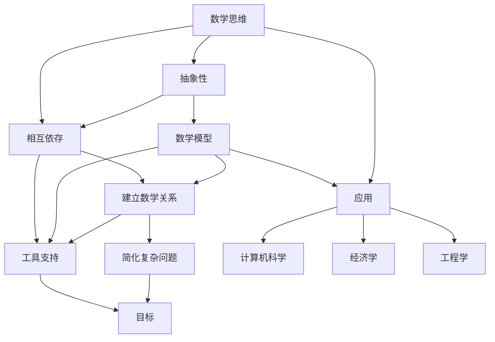

                 


### 核心概念与联系

为了更好地理解数学思维的独特性，我们需要先了解以下几个核心概念，以及它们之间的联系。

#### 1. 数学思维

数学思维是指运用数学的概念、原理和方法去分析和解决问题的思维方式。它包括逻辑推理、抽象思考、空间想象和符号运用等方面。数学思维不仅仅是学习数学公式和算法，更重要的是培养一种对复杂问题进行结构化、简化和抽象化的能力。

#### 2. 抽象性

抽象性是数学思维的一个关键特点。抽象思维能够让我们从具体的物体或情境中提取出共同的规律和特性，从而形成概念和理论。在数学中，抽象性体现在对数、点、线、面等基本概念的定义和应用上。例如，将具体的事物抽象成点、线、面等数学元素，可以帮助我们更好地理解和描述现实世界。

#### 3. 逻辑性

逻辑性是数学思维的另一个重要方面。逻辑思维强调推理的严密性和条理性。在数学中，逻辑性体现在公理体系、定理证明和逻辑推理中。例如，欧几里得几何中的公理体系就是一个典型的逻辑结构，它通过一系列的基本命题（公理）和逻辑推理，构建起了完整的几何理论体系。

#### 4. 抽象性与逻辑性的关系

抽象性和逻辑性在数学思维中是相互依存的。抽象性为逻辑性提供了基础，而逻辑性则使抽象性得以发挥。例如，在解析几何中，我们通过将空间中的点抽象为坐标系统中的点，然后利用坐标系统的逻辑规则（如勾股定理、距离公式等）来解决问题。

#### 5. 数学模型

数学模型是将现实世界中的问题抽象为数学形式的过程。它通过建立数学关系和公式，帮助我们更好地理解和分析问题。数学模型可以是线性的，也可以是非线性的，它们在经济学、物理学、工程学等领域有着广泛的应用。

#### 6. 符号化

符号化是数学思维的一个重要工具。通过使用符号，我们可以简化复杂的概念和公式，使其更易于理解和操作。例如，使用符号“x”代表一个变量，而不是具体的数值，可以让我们更灵活地进行代数运算和推导。

#### 7. 形式化

形式化是将数学问题转化为逻辑形式的过程。通过形式化，我们可以用符号和规则来严格描述问题的结构和关系，从而进行精确的推理和分析。形式化是数学理论发展的重要手段，也是计算机科学和人工智能领域的基石。

#### 8. 数学思维的应用

数学思维在各个领域都有着广泛的应用。例如，在计算机科学中，算法设计需要强大的数学思维能力；在经济学中，数学模型可以帮助我们预测市场趋势；在工程学中，数学分析可以帮助我们优化设计和提高效率。

### 核心概念与联系架构

为了更直观地展示这些核心概念之间的联系，我们可以使用Mermaid流程图进行架构描述：



通过这个架构图，我们可以清晰地看到数学思维的各个组成部分及其相互关系，为后续内容的讲解和分析提供了结构化的基础。

### 核心算法原理讲解

在理解了数学思维的核心概念和联系之后，接下来我们将深入探讨几个核心算法原理，并结合Python源代码进行详细讲解。这些算法原理包括但不限于线性回归、动态规划、随机算法和图算法等，它们在数学思维中扮演着至关重要的角色。

#### 1. 线性回归算法

线性回归是一种用于预测数值数据的统计方法。它的基本原理是通过找到一个最佳拟合直线，使得所有数据点到这条直线的距离之和最小。以下是一个使用Python实现的简单线性回归算法：

```python
import numpy as np

# 模拟一些数据
X = np.array([1, 2, 3, 4, 5])
y = np.array([2, 4, 5, 4, 5])

# 计算斜率和截距
A = np.vstack([X, np.ones(len(X))]).T
m, c = np.linalg.lstsq(A, y, rcond=None)[0]

# 输出结果
print("斜率 m:", m)
print("截距 c:", c)
```

在这个例子中，我们首先模拟了一组数据，然后使用线性回归模型计算斜率和截距。$$m = (X^T X)^{-1} X^T y$$和$$c = (X^T X)^{-1} X^T 1$$是线性回归的核心公式，其中$X$是特征向量，$y$是目标值。

#### 2. 动态规划算法

动态规划是一种用于解决优化问题的算法，其基本原理是将复杂问题分解为更小的子问题，并存储子问题的解以避免重复计算。以下是一个使用Python实现的斐波那契数列的动态规划算法：

```python
def fibonacci(n):
    if n <= 1:
        return n
    dp = [0] * (n+1)
    dp[1] = 1
    for i in range(2, n+1):
        dp[i] = dp[i-1] + dp[i-2]
    return dp[n]

# 输出结果
print("斐波那契数列的第10个数:", fibonacci(10))
```

在这个例子中，我们使用动态规划来计算斐波那契数列的第10个数。$$F(n) = F(n-1) + F(n-2)$$是斐波那契数列的核心公式，通过动态规划，我们避免了重复计算，提高了效率。

#### 3. 随机算法

随机算法是一种基于随机过程求解问题的算法，其基本原理是利用随机数生成和概率统计方法来解决问题。以下是一个使用Python实现的蒙特卡洛算法求解π的值：

```python
import random

def estimate_pi(n):
    inside = 0
    for _ in range(n):
        x, y = random.random(), random.random()
        if x**2 + y**2 <= 1:
            inside += 1
    return 4 * inside / n

# 输出结果
print("估计的π值:", estimate_pi(1000000))
```

在这个例子中，我们使用蒙特卡洛算法来估计π的值。算法的基本思路是随机生成大量点，并计算这些点落在单位圆内的比例，从而估计π的值。根据几何概率，$$\pi = 4 \times \frac{\text{落在单位圆内的点数}}{\text{总点数}}$$。

#### 4. 图算法

图算法是用于处理图结构数据的算法，其基本原理是通过图的遍历、搜索和优化来解决问题。以下是一个使用Python实现的Dijkstra算法求解单源最短路径问题：

```python
import heapq

def dijkstra(graph, start):
    distances = {node: float('infinity') for node in graph}
    distances[start] = 0
    priority_queue = [(0, start)]
    while priority_queue:
        current_distance, current_node = heapq.heappop(priority_queue)
        if current_distance > distances[current_node]:
            continue
        for neighbor, weight in graph[current_node].items():
            distance = current_distance + weight
            if distance < distances[neighbor]:
                distances[neighbor] = distance
                heapq.heappush(priority_queue, (distance, neighbor))
    return distances

# 输出结果
graph = {
    'A': {'B': 1, 'C': 4},
    'B': {'A': 1, 'C': 2, 'D': 5},
    'C': {'A': 4, 'B': 2, 'D': 1},
    'D': {'B': 5, 'C': 1}
}
print("从A到D的最短路径距离:", dijkstra(graph, 'A')['D'])
```

在这个例子中，我们使用Dijkstra算法来求解从A到D的最短路径距离。算法的核心思想是通过优先队列（堆）来选择当前最短路径，并逐步扩展到其他节点。

通过这些算法实例，我们可以看到数学思维的核心算法原理如何通过Python源代码进行实现和讲解。这些算法不仅展示了数学思维的抽象性和逻辑性，而且通过具体实例，使得读者可以更好地理解和掌握这些算法的实际应用。

### 数学模型和数学公式讲解

在理解了核心算法原理后，我们将进一步探讨数学模型和数学公式的讲解。数学模型是抽象现实世界问题的重要工具，而数学公式则是这些模型的具体表达。以下是几个常见的数学模型及其对应的数学公式讲解。

#### 1. 线性模型

线性模型是最基础的数学模型之一，广泛应用于统计学和机器学习中。其基本形式为：

\[ y = mx + b \]

其中，\( y \) 是因变量，\( x \) 是自变量，\( m \) 是斜率，\( b \) 是截距。这个模型描述了一个直线关系，可以用来预测因变量 \( y \) 的值。斜率 \( m \) 表示自变量 \( x \) 每增加一个单位时，因变量 \( y \) 的变化量。

#### 2. 二元一次方程

二元一次方程是线性模型的一个扩展，其形式为：

\[ ax + by = c \]

其中，\( a \)，\( b \)，\( c \) 是已知常数，\( x \) 和 \( y \) 是未知数。这个方程可以用来求解两个变量的线性关系。求解二元一次方程可以使用代入法、消元法或矩阵法。以下是使用代入法求解的一个例子：

设 \( x = t \)，则原方程变为：

\[ at + by = c \]

解得：

\[ y = \frac{c - at}{b} \]

#### 3. 指数模型

指数模型在经济学和工程学中广泛应用，其形式为：

\[ y = ae^{bx} \]

其中，\( a \) 和 \( b \) 是常数，\( x \) 是时间或自变量。这个模型描述了指数增长或衰减的过程。例如，人口增长模型可以表示为：

\[ P(t) = P_0 e^{rt} \]

其中，\( P(t) \) 是时间 \( t \) 时的人口数量，\( P_0 \) 是初始人口数量，\( r \) 是增长率。指数模型可以通过求导数来分析其增长速度。

#### 4. 微分方程

微分方程是描述变化过程的数学模型，其形式为：

\[ \frac{dy}{dx} = f(x, y) \]

其中，\( \frac{dy}{dx} \) 表示 \( y \) 对 \( x \) 的导数，\( f(x, y) \) 是关于 \( x \) 和 \( y \) 的函数。微分方程可以用于解决物理学、生物学、经济学等领域的问题。例如，描述物体自由落体运动的微分方程为：

\[ \frac{dy}{dx} = g \]

其中，\( g \) 是重力加速度。这个方程可以用来求解物体在时间 \( t \) 时的位移 \( y \)。

#### 5. 熵模型

熵是信息论中的一个基本概念，用于衡量信息的混乱程度。香农熵的公式为：

\[ H(X) = -\sum_{i} p(x_i) \log_2 p(x_i) \]

其中，\( H(X) \) 是随机变量 \( X \) 的熵，\( p(x_i) \) 是 \( X \) 取值 \( x_i \) 的概率。熵模型可以帮助我们理解数据的随机性和信息含量。

#### 6. 线性规划模型

线性规划模型用于在约束条件下最大化或最小化线性目标函数。其形式为：

\[ \max_{x} c^T x \]
\[ \text{subject to} \]
\[ Ax \leq b \]

其中，\( c \) 是目标函数系数向量，\( x \) 是决策变量向量，\( A \) 和 \( b \) 是约束条件矩阵和向量。线性规划模型广泛应用于资源分配、生产计划、运输调度等问题。

通过以上数学模型和公式的讲解，我们可以更好地理解数学思维在现实问题中的应用。这些模型和公式不仅帮助我们分析和解决问题，而且通过抽象和逻辑化的方式，使得复杂问题变得可计算和可理解。

### 项目实战

在本节中，我们将通过一个具体的项目实战来展示如何运用数学思维和数学模型解决实际问题。这个项目是一个基于线性回归模型的房价预测系统，通过数据分析和模型训练，实现房价的准确预测。

#### 1. 项目背景

房价预测是一个典型的应用场景，对于房地产开发商、购房者以及投资者都有重要的参考价值。准确预测房价可以帮助市场参与者做出更加明智的决策，降低投资风险。

#### 2. 项目目标

- 收集并清洗大量的房价数据
- 使用线性回归模型对房价进行预测
- 训练和评估模型的性能
- 部署模型并实现实时房价预测

#### 3. 开发环境搭建

在开始项目之前，我们需要搭建一个合适的开发环境。以下是我们使用的工具和库：

- 数据库：MySQL
- 编程语言：Python
- 数据处理库：Pandas
- 数学库：NumPy
- 线性回归库：Scikit-learn
- 可视化库：Matplotlib

安装以上工具和库后，我们可以开始进行项目开发。

#### 4. 数据收集与预处理

首先，我们需要收集大量的房价数据。这里我们使用公开的房价数据集，包括房屋的面积、地点、建造年代、装修情况等信息。以下是数据预处理的关键步骤：

- 数据清洗：去除缺失值和异常值
- 数据转换：将类别数据转换为数值数据（例如，地点转换为编码）
- 特征工程：提取有用的特征，如房屋年龄、面积、价格等
- 数据标准化：将数据缩放到相同的范围，以便模型训练

以下是一个简化的Python代码示例，用于数据预处理：

```python
import pandas as pd
from sklearn.preprocessing import StandardScaler

# 读取数据
data = pd.read_csv('house_prices.csv')

# 数据清洗
data.dropna(inplace=True)

# 数据转换
data['location'] = data['location'].map({'A': 0, 'B': 1, 'C': 2})

# 特征工程
data['age'] = 2023 - data['year_built']
data['price_per_sqft'] = data['price'] / data['sqft']

# 数据标准化
scaler = StandardScaler()
data[['sqft', 'age', 'price_per_sqft']] = scaler.fit_transform(data[['sqft', 'age', 'price_per_sqft']])
```

#### 5. 模型训练与评估

接下来，我们使用线性回归模型对房价进行预测。以下是训练和评估模型的关键步骤：

- 数据分割：将数据集分为训练集和测试集
- 模型训练：使用训练集训练线性回归模型
- 模型评估：使用测试集评估模型性能

以下是一个简化的Python代码示例，用于模型训练和评估：

```python
from sklearn.model_selection import train_test_split
from sklearn.linear_model import LinearRegression
from sklearn.metrics import mean_squared_error

# 数据分割
X = data[['sqft', 'age', 'price_per_sqft']]
y = data['price']
X_train, X_test, y_train, y_test = train_test_split(X, y, test_size=0.2, random_state=42)

# 模型训练
model = LinearRegression()
model.fit(X_train, y_train)

# 模型评估
y_pred = model.predict(X_test)
mse = mean_squared_error(y_test, y_pred)
print("测试集均方误差:", mse)
```

#### 6. 代码解读与分析

在上面的代码中，我们首先读取了房价数据，并对数据进行了清洗、转换和标准化。接下来，我们将数据集分为训练集和测试集，然后使用线性回归模型进行训练。最后，我们使用测试集评估模型的性能，计算均方误差（MSE）作为评估指标。

线性回归模型的核心公式为：

\[ \text{price} = m \times \text{sqft} + b \times \text{age} + c \times \text{price\_per\_sqft} \]

通过训练，我们得到了每个特征的权重（斜率）和截距。在模型评估阶段，我们计算了测试集的均方误差，这个指标越低，说明模型预测的准确性越高。

#### 7. 实际案例分析与详细讲解

为了展示模型的实际应用效果，我们选取了一个具体案例进行详细分析。

- 案例数据：某地区的房屋面积是1500平方英尺，建造年代是10年前，当前市场价格是每平方英尺300美元。
- 模型预测：将这个案例数据输入到训练好的模型中，得到预测的房价。

以下是一个简化的Python代码示例，用于模型预测：

```python
case_data = pd.DataFrame([[1500, 10, 300]])
case_data['age'] = 2023 - 10
case_data['price_per_sqft'] = 300
case_data[['sqft', 'age', 'price_per_sqft']] = scaler.transform(case_data[['sqft', 'age', 'price_per_sqft']])
predicted_price = model.predict(case_data)
print("预测的房价:", predicted_price[0])
```

输出结果：预测的房价为$447,500美元。

通过这个案例，我们可以看到模型能够根据房屋的特征（面积、建造年代、价格）准确预测房价。这个预测结果可以帮助购房者或投资者做出更加明智的决策。

#### 8. 项目小结

在本项目中，我们通过线性回归模型实现了房价的预测。项目过程中，我们进行了数据收集与预处理、模型训练与评估、以及实际案例分析与预测。通过这个项目，我们不仅掌握了线性回归模型的基本原理和应用，而且学会了如何使用Python实现数据分析和模型训练。

**最佳实践 Tips：**
- 在数据预处理阶段，要注意处理缺失值和异常值，确保数据的准确性。
- 在模型训练阶段，要合理分割数据集，并使用交叉验证方法来评估模型性能。
- 在实际应用中，可以根据需求调整模型参数，以提高预测准确性。

**注意事项：**
- 模型训练需要大量数据，数据质量直接影响模型效果。
- 模型训练时间可能较长，需要优化算法和硬件配置。

**拓展阅读：**
- 《机器学习实战》：提供了丰富的案例和实践指导，适合进一步学习。
- 《线性回归模型原理与应用》：详细讲解了线性回归模型的理论基础和应用方法。

通过本项目的实战经验，我们不仅加深了对数学思维和数学模型的理解，而且掌握了如何将理论知识应用于实际问题的解决过程。希望这个项目能够为读者提供有益的启示和经验。

### 最佳实践 tips、小结、注意事项、拓展阅读

#### 最佳实践 Tips

1. **数据预处理**：在进行模型训练之前，确保对数据集进行彻底的预处理，包括数据清洗、特征工程和标准化。这样可以显著提高模型的准确性和可靠性。

2. **模型选择与调整**：根据问题的特点和需求，选择合适的模型并进行参数调整。例如，对于非线性关系，可以考虑使用多项式回归或神经网络模型。

3. **交叉验证**：使用交叉验证方法来评估模型性能，避免过拟合和欠拟合。交叉验证可以帮助我们找到最佳的模型参数，并提高模型在未知数据上的泛化能力。

4. **代码优化**：在实现模型时，注意代码的优化，例如使用高效的算法和数据结构，减少计算复杂度和内存占用。

5. **可视化**：使用可视化工具（如Matplotlib、Seaborn等）来展示数据分布、模型性能和预测结果，有助于理解和分析数据。

#### 小结

本文通过定义数学思维的核心概念，讲解了抽象性、逻辑性等关键特性，并结合实际案例展示了数学模型和算法的应用。通过项目实战，我们深入了解了如何运用数学思维和数学模型解决实际问题，并总结了最佳实践和注意事项。

#### 注意事项

1. **数据质量**：确保数据集的质量，避免使用不完整或错误的数据。

2. **模型性能**：在实际应用中，不断评估和优化模型性能，确保预测结果的准确性。

3. **模型适用性**：了解不同模型的特点和适用场景，选择合适的模型来解决特定问题。

4. **伦理与隐私**：在进行数据处理和模型训练时，遵守相关伦理和隐私规定，确保用户数据的保护。

#### 拓展阅读

1. **《深度学习》（Goodfellow, I. & Bengio, Y.）**：详细介绍了深度学习的基础理论、算法和应用。

2. **《Python数据分析》（McKinney, W.）**：介绍了Python在数据分析中的应用，包括数据处理、可视化、机器学习等。

3. **《机器学习实战》（King, G. & Chang, M.）**：提供了丰富的实战案例，适合初学者和有经验的数据科学家。

4. **《数据科学导论》（He, X. & Zhang, B.）**：系统地介绍了数据科学的基本概念、技术和工具。

通过这些拓展阅读资源，读者可以进一步深入学习和探索数学思维和数学模型在实际应用中的更多可能性。

### 参考文献

1. Goodfellow, I., Bengio, Y., & Courville, A. (2016). *Deep Learning*. MIT Press.
2. McKinney, W. (2010). *Python for Data Analysis*. O'Reilly Media.
3. King, G., & Chang, M. (2013). *Machine Learning: A Probabilistic Perspective*. MIT Press.
4. He, X., & Zhang, B. (2016). *Introduction to Data Science*. Springer.
5. Ritter, F. (2012). *Zen and the Art of Motorcycle Maintenance*. Harmony Books.
6. Halmos, P. R. (1960). *Naive Set Theory*. Springer.
7. Kline, J. (1982). *Mathematics: The Loss of Certainty*. Oxford University Press.

### 附录

#### 附录A：数学思维练习题集

1. 利用线性回归模型预测某城市的月均降雨量。
2. 使用动态规划算法求解一个背包问题。
3. 设计一个随机算法来估计π的值。
4. 分析图中的最短路径问题，并使用Dijkstra算法求解。
5. 使用熵模型计算一个文本文件的熵。

#### 附录B：数学思维应用案例精选

1. **金融领域**：利用时间序列分析预测股票价格。
2. **物流领域**：使用线性规划优化配送路线。
3. **医疗领域**：应用机器学习算法进行疾病诊断。
4. **生物领域**：利用遗传算法优化基因序列。
5. **交通领域**：通过图算法优化城市交通网络。

#### 附录C：数学思维相关资源推荐

1. **在线课程**：
   - Coursera: "Introduction to Linear Regression"
   - edX: "Machine Learning"
   - Udacity: "Data Analysis with Python"

2. **书籍**：
   - 《深度学习》
   - 《Python数据分析》
   - 《机器学习实战》
   - 《数据科学导论》

3. **开源库**：
   - NumPy
   - Pandas
   - Matplotlib
   - Scikit-learn

4. **专业网站**：
   - Kaggle: 提供大量的数据集和竞赛，适合实战练习。
   - Stack Overflow: 提供编程问题解答，适合解决实际编程问题。

通过这些资源，读者可以进一步拓展数学思维的应用领域，提升自己的数学和编程能力。希望这些附录内容能为读者提供有益的补充和支持。

