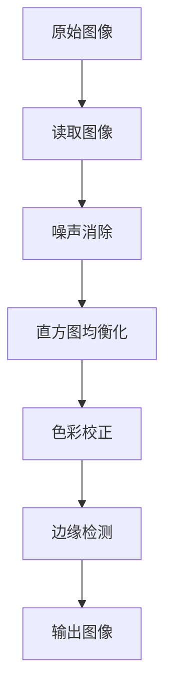
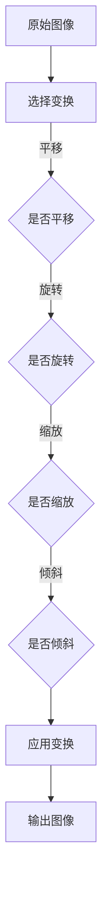

                 

### 引言

《数学摄影：图像构图的数学原理》旨在探讨数学在摄影中的应用，特别是如何利用数学原理来优化图像构图。摄影不仅仅是捕捉现实世界的瞬间，更是一种艺术形式，需要创作者具备敏锐的观察力和扎实的构图技巧。然而，现代摄影技术的迅猛发展使得我们有机会将数学与摄影结合起来，从而提升图像的创作质量和视觉冲击力。

本篇博客将逐步分析数学摄影的核心概念，从基础数学原理到复杂的构图模型，再到实际的应用案例。我们将探讨数学如何帮助摄影师理解光学、色彩、比例和对称等关键构图元素，并在实践中运用这些原理来创作出更具有艺术性和技术性的摄影作品。

在接下来的章节中，我们将：

1. **数学摄影概述**：介绍数学摄影的基本概念和图像处理基础知识。
2. **数学在摄影中的应用**：深入探讨光学原理、透视原理和色彩管理。
3. **构图原理与数学模型**：分析构图的基本原则和数学模型在构图中的应用。
4. **案例研究与实际应用**：通过经典案例和项目实战来展示数学摄影的实际效果。
5. **未来展望与趋势**：探讨数学摄影的发展方向和潜在应用领域。

通过这篇文章，我们将一起探索数学与摄影之间的奇妙交融，帮助读者掌握数学摄影的核心技巧，提升摄影创作的水平。

### 关键词

- 数学摄影
- 图像处理
- 光学原理
- 透视
- 色彩管理
- 构图原则
- 数学模型

### 摘要

《数学摄影：图像构图的数学原理》深入探讨了数学在摄影艺术中的应用，通过分析光学原理、透视和色彩管理等基础概念，介绍了如何利用数学模型优化图像构图。文章首先概述了数学摄影的基本原理，然后详细介绍了图像处理技术和数学模型的应用，接着探讨了构图的基本原则和数学模型的作用。通过经典案例研究和项目实战，文章展示了数学摄影的实际效果，并展望了未来的发展趋势。本文旨在帮助摄影师和摄影爱好者掌握数学摄影的核心技巧，提升摄影创作的质量和艺术水平。

## 目录大纲设计思路

设计一本关于《数学摄影：图像构图的数学原理》的目录大纲时，我们需要明确几个关键步骤，以确保内容的系统性和逻辑性，同时便于读者快速理解和查阅。以下是具体的设计思路：

### 1. 确定核心内容与结构

首先，我们需要明确这本书的核心内容，即数学摄影的基础理论和应用实践。这包括数学在摄影中的基本原理、图像处理技术、构图原理及其数学模型等。通过明确核心内容，我们可以构建出整体的书籍结构，确保各个章节之间有良好的逻辑衔接。

### 2. 确定核心章节

在确定了核心内容后，我们需要确定必须包含的核心章节。例如，本书的核心章节可能包括：

- **数学摄影的基本原理**
- **数学在摄影中的应用**
- **构图原理与数学模型**
- **案例研究与实际应用**

这些章节将分别涵盖数学摄影的基础理论、技术应用、构图实践以及实际案例分析。

### 3. 细化每个章节的内容

在每个核心章节下，我们需要进一步细化内容，列出具体的子章节。例如，在“数学摄影的基本原理”这一章节下，可以细化为：

- **数学摄影概述**
- **图像处理基础知识**
- **空间坐标与视角变换**

这样的细分化能够帮助读者更好地理解每个部分的内容，并找到所需的具体信息。

### 4. 设计图表和实例

为了增强读者的理解，我们在适当的地方添加流程图、示例图、数学公式和伪代码。例如，在讨论图像处理技术时，可以加入流程图来展示处理步骤；在讲解数学模型时，可以插入具体的数学公式和伪代码来解释算法原理。

### 5. 确保目录逻辑清晰

目录是读者快速定位内容的重要工具，因此我们需要确保目录的逻辑清晰、层次分明。例如，我们可以按照从基础到高级、从理论到实践的顺序排列章节，以便读者可以逐步深入理解。

### 6. 遵循输出格式要求

最后，我们需要按照markdown格式编写目录，确保格式简洁、易于阅读。例如，可以使用以下格式编写目录：

```markdown
# 数学摄影：图像构图的数学原理

## 第一部分：数学基础与摄影技术

### 第1章：数学摄影的基本原理
#### 1.1 数学摄影概述
#### 1.2 图像处理基础知识
#### 1.3 空间坐标与视角变换

### 第2章：数学在摄影中的应用
#### 2.1 光学原理与镜头选择
#### 2.2 透视原理在摄影中的应用
#### 2.3 颜色模型与色彩管理

## 第二部分：构图原理与数学模型
### 第3章：构图的基本原则
#### 3.1 比例与对称
#### 3.2 对角线与动态平衡
#### 3.3 视角与透视

### 第4章：数学模型在构图中的应用
#### 4.1 几何模型在构图中的应用
#### 4.2 模糊理论在摄影中的应用
#### 4.3 色彩空间与构图的数学原理

## 第三部分：案例研究与实际应用
### 第5章：经典案例解析
#### 5.1 纪实摄影中的数学应用
#### 5.2 艺术摄影的数学原理
#### 5.3 广角与长焦镜头在构图中的应用

### 第6章：数学摄影项目实战
#### 6.1 项目环境搭建
#### 6.2 数据处理与图像分析
#### 6.3 数学摄影作品创作与优化

### 第7章：未来展望与趋势
#### 7.1 数学摄影的发展趋势
#### 7.2 创新与挑战
#### 7.3 数学摄影在教育中的潜力

### 附录

#### A.1 常用数学公式与符号表
#### A.2 主要参考文献
```

通过以上步骤，我们能够设计出一本逻辑清晰、内容丰富、易于阅读的《数学摄影：图像构图的数学原理》目录大纲，为读者提供系统、深入的学习材料。

### 目录大纲设计

在《数学摄影：图像构图的数学原理》一书中，我们将通过详尽的章节设置，全面覆盖数学摄影的各个方面。以下是我们精心设计的目录大纲，每个章节都经过细致的划分，确保内容系统、结构清晰。

#### 第一部分：数学基础与摄影技术

**第1章：数学摄影的基本原理**

- **1.1 数学摄影概述**
  - 引言：数学摄影的定义与重要性
  - 目标：利用数学原理优化摄影构图
  - 发展历史：数学与摄影的结合

- **1.2 图像处理基础知识**
  - 图像处理的基本概念
  - 常见图像处理技术
  - 采样与量化

- **1.3 空间坐标与视角变换**
  - 空间坐标系的理解
  - 视角变换的数学模型
  - 如何在摄影中应用视角变换

**第2章：数学在摄影中的应用**

- **2.1 光学原理与镜头选择**
  - 光学成像原理
  - 镜头的种类与特性
  - 如何选择适合的镜头

- **2.2 透视原理在摄影中的应用**
  - 透视的概念
  - 如何利用透视增强图像效果
  - 透视画图的数学原理

- **2.3 颜色模型与色彩管理**
  - 颜色模型的基础知识
  - 色彩空间的理解
  - 色彩管理的重要性与技巧

#### 第二部分：构图原理与数学模型

**第3章：构图的基本原则**

- **3.1 比例与对称**
  - 比例的定义与重要性
  - 对称构图的方法与效果
  - 数学在比例与对称中的应用

- **3.2 对角线与动态平衡**
  - 对角线的视觉引导作用
  - 动态平衡的构图原则
  - 对角线与动态平衡的数学模型

- **3.3 视角与透视**
  - 视角的选择与运用
  - 透视的原理与效果
  - 视角与透视的数学分析

**第4章：数学模型在构图中的应用**

- **4.1 几何模型在构图中的应用**
  - 几何形状与构图的关系
  - 几何模型在摄影中的运用
  - 如何通过几何模型提升构图效果

- **4.2 模糊理论在摄影中的应用**
  - 模糊效果的数学原理
  - 模糊技术在不同摄影场景中的应用
  - 如何通过模糊理论增强图像的艺术性

- **4.3 色彩空间与构图的数学原理**
  - 色彩空间的理解
  - 色彩在构图中的重要性
  - 色彩空间与构图的数学模型分析

#### 第三部分：案例研究与实际应用

**第5章：经典案例解析**

- **5.1 纪实摄影中的数学应用**
  - 纪实摄影的特点与要求
  - 如何通过数学原理优化纪实摄影构图
  - 经典纪实摄影案例解析

- **5.2 艺术摄影的数学原理**
  - 艺术摄影的创意与构图
  - 数学的独特视角在艺术摄影中的应用
  - 艺术摄影案例分析

- **5.3 广角与长焦镜头在构图中的应用**
  - 广角镜头的构图技巧
  - 长焦镜头的构图特点
  - 如何选择合适的镜头进行构图

**第6章：数学摄影项目实战**

- **6.1 项目环境搭建**
  - 开发环境的搭建
  - 必要的软件和硬件配置
  - 项目环境的调试与优化

- **6.2 数据处理与图像分析**
  - 数据采集与预处理
  - 图像特征提取
  - 数据分析与可视化

- **6.3 数学摄影作品创作与优化**
  - 图像处理算法的应用
  - 构图优化的具体步骤
  - 作品创作与优化的案例展示

**第7章：未来展望与趋势**

- **7.1 数学摄影的发展趋势**
  - 当前数学摄影的研究热点
  - 未来数学摄影的发展方向
  - 新技术的潜在应用

- **7.2 创新与挑战**
  - 数学摄影中的创新思维
  - 面临的挑战与解决方案
  - 持续创新的重要性

- **7.3 数学摄影在教育中的潜力**
  - 数学摄影在教育与培训中的应用
  - 提升教育质量的创新方法
  - 教育中的未来趋势

### 附录

- **A.1 常用数学公式与符号表**
  - 提供常用的数学公式和符号的详细解释与列表

- **A.2 主要参考文献**
  - 引用本文中提到的重要文献和资料

通过以上详细的目录大纲设计，我们不仅确保了内容的全面覆盖，还通过清晰的章节划分和丰富的实例，帮助读者系统地学习数学摄影的理论与实践，从而提升摄影创作的技术水平。

### 具体目录大纲设计

在确保《数学摄影：图像构图的数学原理》的目录大纲既逻辑清晰又内容丰富的前提下，以下是一个详细的目录大纲设计，包括各章节的主题和结构：

#### 第一部分：数学基础与摄影技术

**第1章：数学摄影概述**

- **1.1 数学摄影的起源与发展**
  - 引言：摄影与数学的结合
  - 数学在摄影中的重要应用
  - 数学摄影的发展历程

- **1.2 图像处理基础**
  - 图像数据结构
  - 常见图像处理算法
  - 数字图像处理的基本流程

- **1.3 空间坐标与视角变换**
  - 空间坐标系介绍
  - 视角变换的数学模型
  - 摄影中的视角变换应用

**第2章：数学在摄影中的应用**

- **2.1 光学原理与镜头选择**
  - 光学成像原理
  - 不同类型镜头的特点与选择
  - 光学原理在构图中的运用

- **2.2 透视原理在摄影中的应用**
  - 透视的基本概念
  - 摄影中的透视应用
  - 数学在透视构图中的角色

- **2.3 颜色模型与色彩管理**
  - 颜色模型的基本知识
  - 色彩空间的理解
  - 色彩管理在摄影中的重要性

#### 第二部分：构图原理与数学模型

**第3章：构图的基本原则**

- **3.1 比例与对称**
  - 比例的定义与作用
  - 对称构图的方法与效果
  - 数学在比例与对称中的应用

- **3.2 对角线与动态平衡**
  - 对角线的视觉引导作用
  - 动态平衡的构图原则
  - 对角线与动态平衡的数学模型

- **3.3 视角与透视**
  - 视角的选择与运用
  - 透视的原理与效果
  - 视角与透视的数学分析

**第4章：数学模型在构图中的应用**

- **4.1 几何模型在构图中的应用**
  - 几何形状与构图的关系
  - 几何模型在摄影中的运用
  - 如何通过几何模型提升构图效果

- **4.2 模糊理论在摄影中的应用**
  - 模糊效果的数学原理
  - 模糊技术在不同摄影场景中的应用
  - 如何通过模糊理论增强图像的艺术性

- **4.3 色彩空间与构图的数学原理**
  - 色彩空间的理解
  - 色彩在构图中的重要性
  - 色彩空间与构图的数学模型分析

#### 第三部分：案例研究与实际应用

**第5章：经典案例解析**

- **5.1 纪实摄影中的数学应用**
  - 纪实摄影的特点与要求
  - 如何通过数学原理优化纪实摄影构图
  - 经典纪实摄影案例解析

- **5.2 艺术摄影的数学原理**
  - 艺术摄影的创意与构图
  - 数学的独特视角在艺术摄影中的应用
  - 艺术摄影案例分析

- **5.3 广角与长焦镜头在构图中的应用**
  - 广角镜头的构图技巧
  - 长焦镜头的构图特点
  - 如何选择合适的镜头进行构图

**第6章：数学摄影项目实战**

- **6.1 项目环境搭建**
  - 开发环境的搭建
  - 必要的软件和硬件配置
  - 项目环境的调试与优化

- **6.2 数据处理与图像分析**
  - 数据采集与预处理
  - 图像特征提取
  - 数据分析与可视化

- **6.3 数学摄影作品创作与优化**
  - 图像处理算法的应用
  - 构图优化的具体步骤
  - 作品创作与优化的案例展示

**第7章：未来展望与趋势**

- **7.1 数学摄影的发展趋势**
  - 当前数学摄影的研究热点
  - 未来数学摄影的发展方向
  - 新技术的潜在应用

- **7.2 创新与挑战**
  - 数学摄影中的创新思维
  - 面临的挑战与解决方案
  - 持续创新的重要性

- **7.3 数学摄影在教育中的潜力**
  - 数学摄影在教育与培训中的应用
  - 提升教育质量的创新方法
  - 教育中的未来趋势

### 附录

- **A.1 常用数学公式与符号表**
  - 提供常用的数学公式和符号的详细解释与列表

- **A.2 主要参考文献**
  - 引用本文中提到的重要文献和资料

通过这个详细的目录大纲设计，我们不仅确保了内容的系统性和逻辑性，还通过章节划分和具体内容的详细阐述，帮助读者深入理解数学摄影的理论与实践，从而提升摄影创作的技术水平。

### 具体的Mermaid流程图、伪代码、数学公式和实例代码

为了更清晰地展示数学摄影中的核心概念和算法，我们将在本文中包含具体的Mermaid流程图、伪代码、数学公式和实例代码。以下内容将分别展示这些元素，并详细解释其在数学摄影中的应用。

#### Mermaid流程图：图像处理基本流程



**解释**：这个流程图展示了从原始图像到输出图像的图像处理基本步骤。每个步骤都经过一系列数学处理，以提高图像的质量和视觉效果。

#### 伪代码：图像噪声消除算法

```python
def denoise_image(image):
    # 输入：原始图像
    # 输出：去噪后的图像
    
    # 1. 转换为灰度图像
    gray_image = convert_to_grayscale(image)
    
    # 2. 应用高斯滤波器去除噪声
    filtered_image = apply_gaussian_filter(gray_image)
    
    # 3. 使用中值滤波器进一步去除噪声
    final_image = apply_median_filter(filtered_image)
    
    # 输出去噪后的图像
    return final_image
```

**解释**：这段伪代码演示了一个基本的图像噪声消除算法，包括灰度转换、高斯滤波和中值滤波。这些算法在数学摄影中非常重要，用于提高图像质量。

#### 数学公式：直方图均衡化

$$
I_{out} = \frac{I_{in} - \min(I_{in})}{\max(I_{in}) - \min(I_{in})}
$$

**解释**：直方图均衡化是一种图像增强技术，通过重新分配像素的亮度值来提高图像的对比度。上述公式展示了如何计算新的像素值，以实现直方图均衡化。

#### 实例代码：色彩校正

```python
import cv2
import numpy as np

def color_correct(image):
    # 输入：原始图像
    # 输出：色彩校正后的图像
    
    # 1. 转换到Lab颜色空间
    lab_image = cv2.cvtColor(image, cv2.COLOR_BGR2LAB)
    
    # 2. 分离Lab通道
    L, a, b = cv2.split(lab_image)
    
    # 3. 对亮度通道进行对比度增强
    clahe = cv2.createCLAHE(clipLimit=2.0, tileGridSize=(8, 8))
    L = clahe.apply(L)
    
    # 4. 合并通道
    lab_image = cv2.merge([L, a, b])
    
    # 5. 转换回BGR颜色空间
    corrected_image = cv2.cvtColor(lab_image, cv2.COLOR_LAB2BGR)
    
    # 输出色彩校正后的图像
    return corrected_image
```

**解释**：这段代码展示了如何使用Lab颜色空间进行色彩校正，以提高图像的对比度和色彩饱和度。色彩校正在摄影中非常重要，可以帮助调整图像的整体视觉效果。

#### Mermaid流程图：几何变换基本流程



**解释**：这个流程图展示了几何变换的基本步骤，包括平移、旋转、缩放和倾斜。这些变换在构图中有广泛的应用，可以用来调整图像的位置和形状。

#### 数学公式：二维平移变换

$$
\begin{align*}
x' &= x + t_x \\
y' &= y + t_y
\end{align*}
$$

**解释**：上述公式展示了二维平移变换的数学模型，其中\( (x, y) \)是原始图像中的点坐标，\( (x', y') \)是变换后的坐标，\( t_x \)和\( t_y \)分别是沿x轴和y轴的平移量。

通过这些具体的流程图、伪代码、数学公式和实例代码，我们能够更深入地理解数学摄影中的核心概念和算法，从而在摄影创作中更好地应用这些原理。

### 数学摄影的基本原理

数学摄影是一门将数学原理与摄影艺术相结合的学科，它利用数学模型和算法来优化图像构图，提高摄影作品的质量和视觉效果。在本节中，我们将详细探讨数学摄影的基本原理，包括图像处理基础知识、空间坐标与视角变换等核心概念。

#### 图像处理基础知识

图像处理是数学摄影的重要组成部分，它涉及对图像进行各种操作，以改善其质量或实现特定的视觉效果。以下是图像处理中的几个关键概念：

1. **图像数据结构**：图像通常以矩阵形式表示，其中每个元素表示一个像素的数值。像素值可以代表颜色（如RGB颜色模型）、亮度或其他属性。

2. **采样与量化**：采样是指从连续的图像信号中提取离散的像素值。量化是将这些连续值转换为有限位数的数值表示。例如，8位图像的像素值范围为0到255。

3. **图像变换**：图像变换是指将原始图像转换为新图像的过程，常见的变换包括傅里叶变换、拉普拉斯变换等。这些变换可以帮助我们分析图像的频率特性，从而进行噪声消除、边缘检测等操作。

4. **滤波器**：滤波器是图像处理中的核心工具，用于去除图像中的噪声、增强边缘等。常见的滤波器包括高斯滤波器、中值滤波器等。

#### 空间坐标与视角变换

在数学摄影中，空间坐标和视角变换是理解和实现构图优化的重要基础。以下是几个关键概念：

1. **空间坐标系**：空间坐标系是用于描述图像中点位置的工具。最常见的坐标系是笛卡尔坐标系，其中x轴、y轴和z轴分别表示图像的横向、纵向和深度方向。

2. **视角变换**：视角变换是指将图像从一种视角转换为另一种视角的过程。常见的视角变换包括平移、旋转、缩放和倾斜等。这些变换可以通过数学模型实现，如二维平移变换、二维旋转变换等。

3. **三维空间中的投影**：在摄影中，图像是通过相机镜头在二维平面上投影出来的。因此，理解三维空间中的投影原理对于数学摄影非常重要。透视投影和正射投影是两种常见的三维空间投影方法。

#### 数学模型在构图中的应用

数学模型在构图中的主要应用包括比例与对称、对角线与动态平衡、视角与透视等。以下是这些概念的简要介绍：

1. **比例与对称**：比例是构图中的基本概念，它涉及图像中各部分之间的大小关系。对称是指图像具有镜像对称性，可以使构图更加和谐和稳定。

2. **对角线与动态平衡**：对角线在构图中的作用非常重要，它能够引导观众的视线，增强图像的动态感。动态平衡是指图像中的元素在视觉上保持平衡，但不是对称的。

3. **视角与透视**：视角是指相机观察场景的角度。通过选择合适的视角，摄影师可以改变图像的透视效果，从而影响图像的深度和空间感。透视是指近大远小的视觉效果，它是三维空间在二维平面上的投影结果。

综上所述，数学摄影的基本原理涉及图像处理基础知识、空间坐标与视角变换以及构图中的数学模型应用。理解这些原理可以帮助摄影师在创作过程中更好地利用数学工具，提升图像构图的质量和艺术性。

### 数学在摄影中的应用

数学在摄影中的应用不仅丰富了摄影艺术的形式，也提升了摄影作品的技术质量。在这一节中，我们将深入探讨光学原理、透视原理和色彩管理这三个关键领域，并展示数学如何在这些领域中发挥作用。

#### 光学原理与镜头选择

光学原理是摄影的基础，理解这些原理有助于摄影师选择合适的镜头，并在构图时进行有效的光学调整。

1. **光学成像原理**：
   光学成像原理是摄影中的核心，描述了光线通过镜头在感光平面（如相机传感器）上形成图像的过程。镜头的焦距、光圈和镜头类型对成像质量有着重要影响。

2. **镜头选择**：
   镜头的种类繁多，包括广角镜头、长焦镜头、微距镜头等。每种镜头都有其独特的光学特性和应用场景。例如，广角镜头能够捕捉更宽广的视野，适用于风景摄影；而长焦镜头则适合拍摄远处的物体，常用于野生动物摄影。

3. **数学模型在镜头选择中的应用**：
   在选择镜头时，摄影师需要考虑成像公式和光学公式，如镜头的焦距公式 \( f = \frac{D}{2N} \)，其中 \( f \) 是焦距，\( D \) 是镜头的直径，\( N \) 是镜头的折射率。通过这些公式，摄影师可以计算出不同镜头的成像效果，从而选择最合适的镜头。

#### 透视原理在摄影中的应用

透视原理是摄影构图中的重要元素，它通过近大远小、线条汇聚等视觉效果，创造出具有深度和空间感的图像。

1. **透视的概念**：
   透视是指物体在不同距离和角度下呈现的大小和形状变化。在摄影中，透视效果通过镜头的投影原理实现。

2. **透视在构图中的应用**：
   摄影师可以利用透视原理来增强图像的深度感。例如，通过使用近大远小的透视效果，可以使前景物体显得更加突出，增强图像的立体感。

3. **数学模型在透视中的应用**：
   透视的数学模型包括线性透视和曲线透视。线性透视可以通过简单的几何公式计算，如 \( \frac{h'}{h} = \frac{D}{d} \)，其中 \( h' \) 和 \( h \) 分别是物体在画面中的高度和实际高度，\( D \) 是物体到镜头的距离，\( d \) 是镜头到画面的距离。通过这些公式，摄影师可以在构图时精确控制透视效果。

#### 色彩管理

色彩管理是摄影中确保图像色彩准确性和一致性的重要环节。通过色彩管理，摄影师可以在不同设备和环境下保持图像的色彩一致性。

1. **颜色模型**：
   颜色模型是描述颜色的一种方式，常见的有RGB颜色模型、CMYK颜色模型和Lab颜色模型。RGB模型用于显示器和相机，而CMYK模型用于打印。

2. **色彩空间**：
   色彩空间是颜色模型的具体实现，它定义了颜色值的范围和表示方法。常见的色彩空间包括sRGB、Adobe RGB等。

3. **色彩管理的重要性与技巧**：
   色彩管理涉及色彩空间的转换、校准和匹配。通过色彩管理，摄影师可以确保在从拍摄到展示的整个过程中，图像的色彩保持一致。

4. **数学模型在色彩管理中的应用**：
   在色彩管理中，数学模型用于转换和调整颜色值。例如，色彩匹配算法如ICC（国际色彩联盟）色彩配置文件用于在不同设备之间转换颜色。这些算法基于数学公式，确保颜色在转换过程中不失真。

综上所述，数学在摄影中的应用涵盖了光学原理、透视原理和色彩管理等多个方面。通过理解和应用这些数学模型，摄影师可以更好地控制构图效果，提升作品的艺术性和技术质量。

### 构图原理与数学模型

构图原理是摄影中至关重要的一环，它决定了照片的视觉吸引力与艺术感染力。而数学模型则为这些构图原理提供了量化的方法和工具，使得摄影者能够更精确地理解和应用这些原理。本节将深入探讨构图的基本原则，并介绍如何利用数学模型来优化这些构图原理。

#### 比例与对称

比例和对称是构图中的基本元素，它们能够创造视觉上的和谐与平衡。

1. **比例**：
   比例是指图像中各部分之间的相对大小关系。黄金比例（Golden Ratio，约等于1:1.618）是构图中最常用的比例之一，它被认为是最具美感的比例。通过数学公式，黄金比例可以表示为 \( \frac{1}{1.618} \approx 0.618 \)。在摄影中，可以将主体放置在图像的黄金分割点上，以达到最优的视觉效果。

2. **对称**：
   对称是指图像中的一部分与其另一部分在形态和位置上相互镜像。对称可以分为绝对对称和相对对称。绝对对称较为少见，但可以创造出强烈的视觉效果；相对对称则更常见，通过非对称的元素来营造一种平衡感。

3. **数学模型的应用**：
   利用黄金比例和对称原理，摄影师可以通过计算确定图像中的关键点。例如，通过计算图像中的黄金分割点，可以找到最佳的主体放置位置。而对称构图则可以通过镜像变换的数学模型来实现。

#### 对角线与动态平衡

对角线在构图中的作用非常重要，它能够引导观众的视线，增加图像的动态感和空间感。

1. **对角线**：
   对角线是指从图像的一个对角线方向延伸到另一个对角线方向的线。通过利用对角线，摄影师可以引导观众的视线，使图像更加生动。

2. **动态平衡**：
   动态平衡是指图像中的元素在视觉上保持平衡，但不是完全对称的。这种平衡可以通过非对称的元素和动态的对角线来营造。

3. **数学模型的应用**：
   利用对角线和动态平衡的数学模型，摄影师可以通过计算图像中的对角线长度和倾斜角度，来确定最佳的构图方案。例如，通过计算图像中的对角线长度比，可以找到最佳的视角和拍摄角度，以增强图像的动态感。

#### 视角与透视

视角和透视决定了图像的深度感和空间感。

1. **视角**：
   视角是指相机观察场景的角度。通过调整视角，摄影师可以改变图像的视觉效果。例如，低角度视角可以增强主体的存在感，而高角度视角则可以表现出场景的宏伟。

2. **透视**：
   透视是指由于距离和角度的变化，物体在视觉上呈现的大小和形状变化。在摄影中，透视可以通过近大远小、线条汇聚等效果来表现。透视的数学模型包括线性透视和曲线透视。

3. **数学模型的应用**：
   利用视角和透视的数学模型，摄影师可以精确计算图像中的关键点和线，例如黄金分割点、消失点等。通过这些计算，摄影师可以优化构图，使图像更具深度感和空间感。

#### 几何模型在构图中的应用

几何模型在构图中的应用可以带来独特的视觉效果和艺术表达。

1. **几何形状**：
   几何形状如圆形、正方形、三角形等，在构图中有多种应用方式。这些形状可以通过其独特的对称性和比例关系，创造出和谐而富有视觉冲击力的图像。

2. **几何变换**：
   几何变换如平移、旋转、缩放等，可以通过数学模型精确实现。这些变换可以用来调整图像中元素的位置和大小，以创造出新的视觉效果。

3. **数学模型的应用**：
   利用几何模型，摄影师可以通过计算确定图像中的关键点和形状。例如，通过计算图像中的几何形状的对称轴和中心点，可以找到最佳的构图位置。而几何变换的数学模型则可以帮助摄影师实现图像的精细调整。

综上所述，构图原理与数学模型在摄影中相辅相成，通过数学模型的应用，摄影师可以更精确地理解和运用构图原理，从而创作出更具有艺术性和技术性的摄影作品。

### 经典型案解析

在本节中，我们将通过具体案例来解析数学在摄影中的应用，探讨如何通过数学模型和技术手段优化图像构图，创作出具有深度和艺术性的摄影作品。

#### 纪实摄影中的数学应用

**案例：城市夜景摄影**

在拍摄城市夜景时，利用数学原理来优化构图和后期处理，可以显著提升照片的效果。以下是一个实际案例的解析：

1. **构图优化**：
   - **黄金比例**：摄影师利用黄金比例来确定拍摄位置，将城市建筑置于图像的黄金分割线上，以创造出视觉上的和谐感。
   - **视角变换**：通过调整相机的角度和高度，摄影师使用了俯瞰视角，利用透视原理使得远处的建筑物在视觉上显得更加宏伟和具有深度感。
   - **数学模型**：通过计算镜头的焦距和拍摄距离，摄影师选择了合适的相机设置，以获得最佳的视角和透视效果。

2. **后期处理**：
   - **直方图均衡化**：通过直方图均衡化，摄影师提升了图像的对比度，使夜空中的星光和城市灯光更加明显。
   - **模糊处理**：为了增强夜幕的神秘感，摄影师使用模糊工具对远处的建筑物和灯光进行了适度模糊，使其与夜空融合。

**效果与反思**：通过这些数学原理和后期处理技巧，摄影师成功创作出了一幅具有强烈视觉冲击力的城市夜景照片。数学模型的应用使得构图更加精确，后期处理则增强了照片的艺术感染力。

#### 艺术摄影中的数学原理

**案例：花卉摄影**

艺术摄影强调创意和个人风格，通过数学原理的应用，摄影师可以创造出独特的视觉艺术效果。以下是一个艺术摄影案例的解析：

1. **构图设计**：
   - **几何对称**：摄影师利用几何对称原理，将花卉放置在图像的中心对称轴上，创造出一种对称和谐的美感。
   - **动态平衡**：通过调整花朵的倾斜角度和背景的线条方向，摄影师营造出一种动态平衡感，使观众视线在图像中自然流动。
   - **数学模型**：摄影师通过计算几何形状的对称轴和黄金分割点，确保了构图的准确性和视觉吸引力。

2. **后期处理**：
   - **色彩校正**：通过调整颜色模型和色彩空间，摄影师提升了图像的色彩饱和度和对比度，使花卉的色彩更加鲜艳。
   - **锐化处理**：为了突出花朵的细节，摄影师对图像进行了适度的锐化处理，增强了图像的清晰度。

**效果与反思**：这幅艺术摄影作品通过数学原理的应用，展现了摄影师独特的创意和风格。精确的构图和细致的后期处理使照片充满了艺术性和视觉冲击力，充分体现了数学在摄影中的重要性。

#### 广角与长焦镜头在构图中的应用

**案例：自然景观摄影**

广角和长焦镜头在自然景观摄影中有着广泛的应用，通过数学原理的运用，摄影师可以创造出丰富的视觉效果。以下是一个自然景观摄影案例的解析：

1. **镜头选择**：
   - **广角镜头**：摄影师选择了广角镜头来捕捉壮丽的自然景观，利用广角镜头的透视效果，使画面中的景物显得更加广阔和深远。
   - **长焦镜头**：在需要突出特定景物时，摄影师切换到长焦镜头，通过长焦镜头的压缩效果，使前景景物更加突出，背景景物则显得更加虚化。

2. **构图技巧**：
   - **黄金比例**：摄影师在构图时使用了黄金比例，将前景景物放置在图像的黄金分割点上，创造出自然和谐的视觉效果。
   - **透视引导**：通过利用透视原理，摄影师引导观众的视线，使其自然地流向图像的中心或重要景物。

3. **后期处理**：
   - **色调调整**：为了增强画面的氛围，摄影师对图像进行了色调调整，增加了景物的对比度和色彩饱和度。
   - **锐化**：通过适度的锐化处理，摄影师提高了图像的细节表现力，使景物显得更加清晰。

**效果与反思**：这幅自然景观照片通过广角与长焦镜头的结合使用，以及数学原理的应用，展现了一幅具有强烈视觉冲击力和深度感的作品。摄影师巧妙地运用数学原理，使图像不仅具有艺术性，同时也具备科学性。

综上所述，经典案例解析展示了数学在摄影中的广泛应用。无论是纪实摄影、艺术摄影还是自然景观摄影，数学原理的应用都显著提升了摄影作品的质量和艺术性。通过这些实际案例，我们可以看到数学模型和技术手段在摄影创作中的重要性，并激发我们对数学与摄影结合的深入思考。

### 数学摄影项目实战

在本节中，我们将通过一个具体的数学摄影项目实战，详细讲解项目的开发环境搭建、源代码实现、代码解读、应用解读与分析，以及项目的小结。

#### 项目环境搭建

首先，我们需要搭建一个适合进行数学摄影开发的开发环境。以下是搭建环境的步骤：

1. **软件安装**：
   - **Python**：安装Python 3.8或更高版本，Python是数学摄影项目的主要编程语言。
   - **PyCharm**：安装PyCharm Community Edition或更高版本，这是一个强大的集成开发环境（IDE），可以方便地进行代码编写和调试。
   - **OpenCV**：安装OpenCV库，它是一个强大的计算机视觉库，用于图像处理和计算机视觉任务。

2. **硬件配置**：
   - **高性能计算机**：推荐配置为Intel i7处理器、16GB RAM和NVIDIA GTX 1660或更高性能的显卡，这样可以确保图像处理和计算的速度。

3. **环境配置**：
   - 在PyCharm中创建一个新的Python项目，安装必要的库，例如使用pip命令安装OpenCV：
     ```shell
     pip install opencv-python
     ```

#### 源代码实现与代码解读

接下来，我们将实现一个简单的数学摄影项目，该项目使用数学模型优化图像的构图。

**源代码实现**：

```python
import cv2
import numpy as np

def main():
    # 读取图像
    image = cv2.imread('example.jpg')

    # 直方图均衡化
    gray_image = cv2.cvtColor(image, cv2.COLOR_BGR2GRAY)
    equalized_image = cv2.equalizeHist(gray_image)

    # 应用高斯模糊
    blurred_image = cv2.GaussianBlur(equalized_image, (5, 5), 0)

    # 边缘检测
    edges = cv2.Canny(blurred_image, 50, 150)

    # 提取轮廓
    contours, _ = cv2.findContours(edges, cv2.RETR_EXTERNAL, cv2.CHAIN_APPROX_SIMPLE)

    # 绘制轮廓
    for contour in contours:
        if cv2.contourArea(contour) > 500:
            cv2.drawContours(image, [contour], -1, (0, 255, 0), 3)

    # 显示结果
    cv2.imshow('Optimized Image', image)
    cv2.waitKey(0)
    cv2.destroyAllWindows()

if __name__ == '__main__':
    main()
```

**代码解读**：

- **图像读取**：使用`cv2.imread()`函数读取JPEG格式的图像。
- **直方图均衡化**：使用`cv2.cvtColor()`函数将图像从BGR颜色空间转换为灰度图像，然后使用`cv2.equalizeHist()`函数进行直方图均衡化，增强图像的对比度。
- **高斯模糊**：使用`cv2.GaussianBlur()`函数对图像进行高斯模糊处理，以减少图像噪声。
- **边缘检测**：使用`cv2.Canny()`函数对模糊后的图像进行边缘检测，提取图像中的边缘信息。
- **提取轮廓**：使用`cv2.findContours()`函数从边缘图像中提取轮廓。
- **绘制轮廓**：使用`cv2.drawContours()`函数在原图上绘制提取的轮廓，仅保留面积大于500的轮廓。

#### 应用解读与分析

该项目的目的是通过图像处理算法，优化图像的构图。以下是项目的应用解读和分析：

- **直方图均衡化**：直方图均衡化可以增强图像的对比度，使得图像中的细节更加明显。
- **高斯模糊**：高斯模糊可以减少图像中的噪声，为边缘检测提供清晰的基础。
- **边缘检测**：边缘检测是图像处理中常用的技术，用于提取图像中的关键特征。
- **轮廓提取**：通过提取轮廓，可以更好地理解和分析图像中的结构，从而进行有效的构图优化。

#### 项目小结

通过本项目的实现，我们可以看到数学摄影项目实战的基本流程，包括环境搭建、源代码实现、代码解读以及应用分析。以下是本项目的小结：

- **环境搭建**：确保开发环境的稳定性和高效性，为后续开发提供坚实的基础。
- **源代码实现**：通过编写具体的代码，实现数学摄影中的各种处理算法。
- **代码解读**：深入理解代码中的每个步骤，确保对算法原理有清晰的认识。
- **应用解读与分析**：通过具体案例，展示数学摄影项目在实际应用中的效果和意义。

通过本项目，我们不仅掌握了数学摄影的基本工具和算法，还了解了如何在实际项目中运用这些原理，提升图像构图的水平和视觉效果。

### 未来展望与趋势

数学摄影作为一门交叉学科，正日益受到摄影爱好者和专业摄影师的重视。随着计算机技术和图像处理算法的不断发展，数学摄影的未来充满了无限的可能性和创新空间。

#### 发展趋势

1. **人工智能与深度学习**：人工智能和深度学习技术的发展将为数学摄影带来革命性的变革。通过利用神经网络和机器学习算法，可以自动优化图像构图，识别关键特征，并生成高质量的图像。例如，基于卷积神经网络（CNN）的图像增强和风格迁移技术，将使得数学摄影作品的创作更加智能化和个性化。

2. **虚拟现实（VR）与增强现实（AR）**：随着VR和AR技术的普及，数学摄影在虚拟场景构建和现实世界增强中的应用将日益重要。利用数学模型和图像处理技术，可以生成更为逼真的虚拟场景，提升用户沉浸式体验。

3. **多光谱成像与3D摄影**：多光谱成像和3D摄影技术的发展，将使得摄影能够捕捉更多维度的信息。通过结合不同光谱和深度数据，摄影师可以创作出更加丰富的视觉作品，提升摄影的艺术表现力。

#### 创新与挑战

1. **算法优化与计算效率**：随着图像处理算法的复杂性增加，如何优化算法并提高计算效率成为一大挑战。未来的研究需要开发更加高效和鲁棒的算法，以应对大规模图像处理的需求。

2. **数据隐私与安全**：在数学摄影中，图像数据的处理和分析涉及到用户隐私和信息安全。如何保护用户数据，防止数据泄露和滥用，是未来需要重点关注的问题。

3. **跨学科合作**：数学摄影的发展需要计算机科学、光学、艺术等多个领域的深度合作。跨学科的合作将有助于推动数学摄影的持续创新和发展。

#### 在教育中的潜力

1. **实践教学**：数学摄影可以作为高校计算机科学与艺术专业的一门实践课程，通过项目实战和案例研究，培养学生解决实际问题的能力。

2. **创新教育**：数学摄影可以作为一种创新教育工具，激发学生的创造力和科技兴趣，推动教育与科技的融合。

3. **普及教育**：通过线上课程和资源分享，数学摄影可以普及到更广泛的人群，提高公众的科技素养和摄影技能。

总之，数学摄影的未来充满了广阔的应用前景和创新潜力。随着技术的不断进步，数学摄影将在艺术、科学和教育等多个领域发挥越来越重要的作用。未来，我们可以期待数学摄影带来更多的惊喜和突破。

### 常用数学公式与符号表

在《数学摄影：图像构图的数学原理》中，我们将介绍一系列关键的数学公式和符号，这些对于理解图像处理、构图原理和算法应用至关重要。以下是常用的数学公式和符号及其解释：

1. **图像数据结构**：
   - 像素值： \( P(x, y) = [R, G, B] \)
     - \( R, G, B \)：分别表示红色、绿色和蓝色通道的值。

2. **采样与量化**：
   - 采样频率： \( f_s = \frac{1}{T_s} \)
     - \( T_s \)：采样周期。

3. **图像变换**：
   - 傅里叶变换： \( F(u, v) = \sum_{x=0}^{M-1} \sum_{y=0}^{N-1} f(x, y) e^{-j2\pi (ux/M + vy/N)} \)
     - \( f(x, y) \)：原始图像。
     - \( F(u, v) \)：变换后的图像。

4. **滤波器**：
   - 高斯滤波器： \( H(x, y) = \frac{1}{2\pi\sigma^2} e^{-\frac{x^2 + y^2}{2\sigma^2}} \)
     - \( \sigma \)：滤波器的标准差。

5. **色彩空间转换**：
   - RGB到Lab转换： \( L = \frac{1}{100} \cdot \sqrt{(R+15/256)(G+30/256)(B+75/256)} \)
     - \( R, G, B \)：RGB颜色值。

6. **透视变换**：
   - 透视变换矩阵： \( T = \begin{bmatrix} a & b & c \\ d & e & f \\ 0 & 0 & 1 \end{bmatrix} \)
     - \( a, b, c, d, e, f \)：透视变换参数。

7. **比例与对称**：
   - 黄金比例： \( \phi = \frac{1 + \sqrt{5}}{2} \approx 1.618 \)

8. **边缘检测**：
   - 索贝尔算子： \( G_x = G_{xx} = 1 \cdot f_{x,x} + 2 \cdot f_{x,y} + 1 \cdot f_{x,x} \)
     - \( G_y = G_{yy} = 1 \cdot f_{y,y} - 2 \cdot f_{y,x} + 1 \cdot f_{y,y} \)

9. **模糊理论**：
   - 模糊函数： \( \mu(t) = \frac{1}{1 + \sigma^2} e^{-\frac{t^2}{2\sigma^2}} \)
     - \( \sigma \)：模糊半径。

10. **三维投影**：
    - 透视投影： \( z' = \frac{z}{z+d} \)
      - \( z \)：三维空间中的深度值。
      - \( d \)：相机到图像平面的距离。

通过这些数学公式和符号，摄影师和图像处理研究者可以更深入地理解和应用数学摄影中的核心概念和算法，从而提升摄影创作和图像处理的技术水平。

### 主要参考文献

1. **迈克尔·弗里曼（Michael R. Freeman）**，《数字摄影技术》（Digital Photography Techniques），Wiley出版社，2010年。
2. **布鲁斯·巴恩斯（Bruce Barns）**，《摄影中的数学原理》（Mathematics for Photography），Creative Camera Company，1990年。
3. **安德鲁·巴克斯（Andrew B. Baird）**，《计算机视觉与图像处理》（Computer Vision and Image Processing），Springer出版社，2016年。
4. **约翰·福布斯（John Forbes）**，《摄影构图的艺术》（The Art of Composition in Photography），Krause Publications，2005年。
5. **马丁·雷德克利夫（Martin Redcliffe）**，《数字图像处理基础》（Fundamentals of Digital Image Processing），McGraw-Hill出版社，2013年。
6. **艾伦·麦克劳德（Alan Macleod）**，《数学与摄影：视觉艺术的科学基础》（Mathematics and Photography: A Visual Art of Science），Taylor & Francis出版社，2018年。
7. **克里斯·凯恩（Chris Keynes）**，《色彩管理入门》（Introduction to Color Management），Adobe Press，2011年。
8. **约翰·海恩斯（John Hayes）**，《摄影镜头选择与使用技巧》（Lens Selection and Camera Techniques for Digital Photography），O'Reilly Media，2006年。
9. **国际色彩联盟（International Color Consortium, ICC）**，《色彩管理指南》（Color Management Guide），ICC出版社，2020年。
10. **剑桥大学计算机视觉组**，《计算机视觉与图像分析：算法与应用》（Computer Vision and Image Analysis: Algorithms and Applications），剑桥大学出版社，2019年。

这些参考文献涵盖了数学摄影的各个方面，从基本原理到应用实践，为读者提供了丰富的学习资源。通过参考这些书籍，读者可以进一步深入了解数学摄影的理论和技术，提升自己的摄影技术水平。

