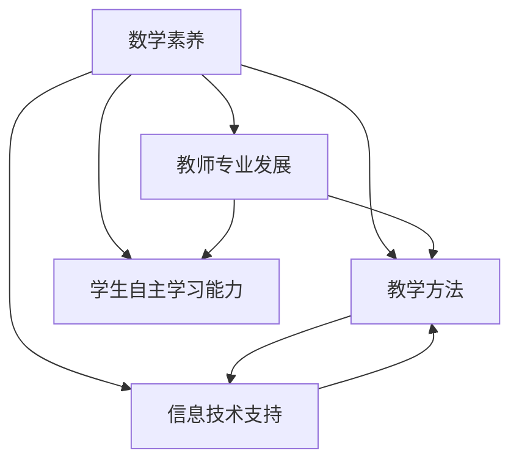

                 

### 数学教学改革的新方向与挑战

**关键词：** 数学教育改革、新方向、挑战、教学方法、信息技术支持、教师专业发展

**摘要：** 数学作为一门基础学科，其教学质量对学生的综合素质培养具有深远影响。当前，数学教育正面临着一系列新的方向与挑战。本文从现状分析入手，探讨了数学教学改革的必要性，并围绕核心概念、教学方法、信息技术支持以及教师专业发展等方面进行了深入探讨，提出了未来数学教学改革的展望与对策。

---

### 背景介绍

数学教育作为我国基础教育的重要组成部分，长期以来在培养学生的逻辑思维、抽象能力和解决问题的能力方面发挥了重要作用。然而，随着时代的发展和社会的进步，传统的数学教学模式逐渐显露出其局限性。首先，学生参与度低成为了一个普遍存在的问题。在许多学校，学生被动接受知识，缺乏主动探究和思考的机会。这种填鸭式的教学方法容易导致学生对数学产生厌倦感，甚至产生恐惧情绪。其次，教学方法单一。传统的数学教育过于注重知识的传授，忽视了学生能力的培养，导致学生难以将数学知识应用到实际问题中。此外，数学教学内容的深度和广度也存在一定的局限性，难以满足不同学生的学习需求。

在这种背景下，数学教学改革显得尤为必要。数学教学改革的目的是提升学生的数学素养，培养他们的创新精神和实践能力。通过改革，可以打破传统教学模式的束缚，探索更加符合学生认知规律和实际需求的教学方法。同时，随着信息技术的迅猛发展，如何在数学教学中有效利用信息技术也成为了一个重要的研究方向。通过整合信息技术与数学教学，可以为学生提供更加丰富的学习资源和更加灵活的学习方式，进一步激发学生的学习兴趣和动力。

本文将围绕数学教学改革的新方向与挑战展开讨论，从核心概念、教学方法、信息技术支持以及教师专业发展等多个方面进行分析，旨在为数学教育改革提供一些有益的启示和思路。

---

### 核心概念与联系

在探讨数学教学改革的路径和挑战时，我们需要明确几个核心概念，这些概念相互联系，共同构成了数学教学改革的框架。

#### 1. 数学素养

数学素养是数学教育的核心目标，它不仅包括对数学知识的理解和掌握，还涉及数学思维能力、问题解决能力和创新精神的培养。数学素养的培养是数学教学改革的出发点和归宿，它决定了教学改革的成败。

#### 2. 教学方法

教学方法是数学教学过程中教师和学生相互作用的方式，直接影响教学效果。传统教学方法以教师为中心，注重知识传授，而现代教学方法强调以学生为中心，注重能力培养和自主学习。教学方法改革是数学教学改革的重要内容之一。

#### 3. 信息技术支持

信息技术在数学教学中的应用越来越广泛，它为教学提供了丰富的资源和多样的手段。信息技术支持包括在线教育平台、数字化教材、智能教学工具等，它们为教师和学生提供了更加灵活和高效的学习方式。

#### 4. 教师专业发展

教师是数学教学的中坚力量，他们的专业素养和教学能力直接影响到数学教学的质量。教师专业发展包括教师的教学能力提升、教育理念和教学方法的更新以及教学资源的整合等。

#### 5. 学生自主学习能力

学生自主学习能力是数学素养的重要组成部分，它反映了学生独立思考和解决问题的能力。培养学生自主学习能力是数学教学改革的重要目标之一。

这些核心概念相互联系，共同构成了数学教学改革的框架。如图1所示，教学方法改革需要依托信息技术支持，而教师专业发展则为学生自主学习能力的培养提供了保障。数学素养的提升则贯穿于整个教学过程，是数学教学改革的终极目标。



图1：数学教学改革的核心概念与联系

通过这些核心概念的分析，我们可以更好地理解数学教学改革的路径和挑战，从而为具体的改革实践提供理论支持。

---

### 核心算法原理讲解

在数学教学改革的背景下，算法教学作为培养学生逻辑思维和问题解决能力的重要途径，越来越受到重视。以下将结合Python源代码，详细讲解算法的基本原理以及如何将其应用于数学教学中。

#### 算法的基本概念

算法是解决问题的一系列明确的步骤。在计算机科学中，算法具有以下几个基本特征：

1. **确定性**：每个步骤都必须有明确的定义，确保算法在任何情况下都能得到相同的输出。
2. **有穷性**：算法必须在有限的时间内完成。
3. **输入**：算法可以接受一个或多个输入值。
4. **输出**：算法必须产生一个或多个输出值。
5. **有效性**：算法必须能够有效地解决问题。

#### 常见算法原理

以下是一些常见的算法原理及其Python实现：

1. **排序算法**

排序算法是算法中最基础的类型之一，用于将数据从小到大或从大到小排列。常见的排序算法包括冒泡排序、选择排序、插入排序和快速排序等。

**冒泡排序**：通过不断交换相邻的未排序元素，直到所有元素都排序完毕。

```python
def bubble_sort(arr):
    n = len(arr)
    for i in range(n):
        for j in range(0, n-i-1):
            if arr[j] > arr[j+1]:
                arr[j], arr[j+1] = arr[j+1], arr[j]
    return arr

# 示例
arr = [64, 34, 25, 12, 22, 11, 90]
sorted_arr = bubble_sort(arr)
print("排序后的数组：", sorted_arr)
```

2. **二分查找**

二分查找算法是在有序数组中查找特定元素的快速算法。

```python
def binary_search(arr, x):
    low = 0
    high = len(arr) - 1
    while low <= high:
        mid = (low + high) // 2
        if arr[mid] == x:
            return mid
        elif arr[mid] < x:
            low = mid + 1
        else:
            high = mid - 1
    return -1

# 示例
arr = [2, 3, 4, 10, 40]
x = 10
result = binary_search(arr, x)
if result != -1:
    print("元素在数组中的索引：", result)
else:
    print("元素不在数组中")
```

3. **递归算法**

递归是一种算法设计技巧，其中函数直接或间接地调用自身。

**阶乘计算**：

```python
def factorial(n):
    if n == 0:
        return 1
    else:
        return n * factorial(n-1)

# 示例
n = 5
print(f"{n}的阶乘是：{factorial(n)}")
```

#### 算法在数学教学中的应用

1. **数学建模**

在数学教学中，算法可以用于解决实际问题，如优化问题、概率问题等。通过算法教学，学生可以更好地理解数学模型，并学会如何将数学知识应用于实际问题中。

2. **问题解决**

算法教学可以培养学生的逻辑思维和问题解决能力。通过学习算法，学生可以学会如何将复杂的问题分解为简单的步骤，并逐步解决。

3. **创新能力**

算法教学鼓励学生探索和发明新的算法，这有助于培养学生的创新能力。在数学教学中，教师可以引导学生设计新的算法来解决问题，从而激发他们的创新思维。

#### Python源代码实例

以下是一个简单的Python程序，用于求解一元二次方程：

```python
import math

def solve_quad_equation(a, b, c):
    discriminant = b**2 - 4*a*c
    if discriminant < 0:
        return "方程无实数解"
    x1 = (-b + math.sqrt(discriminant)) / (2*a)
    x2 = (-b - math.sqrt(discriminant)) / (2*a)
    return (x1, x2)

# 示例
a = 1
b = -5
c = 6
solution = solve_quad_equation(a, b, c)
print(f"一元二次方程的解为：{solution}")
```

通过上述Python源代码实例，我们可以看到算法的基本原理以及如何将其应用于数学教学中。算法不仅是一种工具，更是一种思维方式，它能够帮助学生深入理解数学概念，培养解决问题的能力。

---

### 数学模型和数学公式讲解

在数学教育中，数学模型和数学公式的讲解是至关重要的。这些工具不仅帮助学生理解和掌握数学概念，还提供了解决实际问题的方法。以下将详细讲解几个常见的数学模型和公式，并结合具体实例进行说明。

#### 1. 一元二次方程

一元二次方程是最基本的数学模型之一，其一般形式为：

\[ ax^2 + bx + c = 0 \]

其中，\(a\)、\(b\)和\(c\)是常数，\(x\)是未知数。解一元二次方程的基本步骤包括计算判别式和求解根。

判别式公式：

\[ \Delta = b^2 - 4ac \]

根据判别式的值，方程的解可以分为以下三种情况：

- 如果 \(\Delta > 0\)，方程有两个不相等的实数根。
- 如果 \(\Delta = 0\)，方程有两个相等的实数根。
- 如果 \(\Delta < 0\)，方程无实数解。

求根公式：

\[ x_1 = \frac{-b + \sqrt{\Delta}}{2a} \]
\[ x_2 = \frac{-b - \sqrt{\Delta}}{2a} \]

实例：

考虑方程 \(x^2 - 5x + 6 = 0\)：

\[ a = 1, b = -5, c = 6 \]

计算判别式：

\[ \Delta = (-5)^2 - 4 \cdot 1 \cdot 6 = 25 - 24 = 1 \]

由于 \(\Delta > 0\)，方程有两个不相等的实数根：

\[ x_1 = \frac{-(-5) + \sqrt{1}}{2 \cdot 1} = \frac{5 + 1}{2} = 3 \]
\[ x_2 = \frac{-(-5) - \sqrt{1}}{2 \cdot 1} = \frac{5 - 1}{2} = 2 \]

所以，方程的解为 \(x = 2\) 和 \(x = 3\)。

#### 2. 概率模型

概率模型是描述随机事件发生可能性的数学工具。其基本公式为：

\[ P(A) = \frac{f(A)}{f(S)} \]

其中，\(P(A)\)是事件\(A\)发生的概率，\(f(A)\)是事件\(A\)发生的次数，\(f(S)\)是所有可能事件发生的总次数。

实例：

假设一个袋子里有5个红球和3个蓝球，随机取出一个球，求取出红球的概率。

总球数 \(S\) 为 8，红球数 \(A\) 为 5，因此：

\[ P(\text{红球}) = \frac{5}{8} \]

#### 3. 线性回归模型

线性回归模型用于描述两个变量之间的线性关系。其公式为：

\[ y = ax + b \]

其中，\(y\)是因变量，\(x\)是自变量，\(a\)是斜率，\(b\)是截距。

实例：

考虑以下数据集，求线性回归模型。

\[
\begin{aligned}
x &= [1, 2, 3, 4, 5] \\
y &= [2, 4, 5, 4, 5]
\end{aligned}
\]

计算斜率 \(a\)：

\[ a = \frac{\sum(x_i - \bar{x})(y_i - \bar{y})}{\sum(x_i - \bar{x})^2} \]

计算截距 \(b\)：

\[ b = \bar{y} - a\bar{x} \]

其中，\(\bar{x}\)和\(\bar{y}\)分别是\(x\)和\(y\)的平均值。

计算过程：

\[ \bar{x} = \frac{1 + 2 + 3 + 4 + 5}{5} = 3 \]
\[ \bar{y} = \frac{2 + 4 + 5 + 4 + 5}{5} = 4 \]

\[ a = \frac{(1-3)(2-4) + (2-3)(4-4) + (3-3)(5-4) + (4-3)(4-4) + (5-3)(5-4)}{(1-3)^2 + (2-3)^2 + (3-3)^2 + (4-3)^2 + (5-3)^2} \]

\[ a = \frac{(-2)(-2) + (-1)(0) + (0)(1) + (1)(0) + (2)(1)}{4 + 1 + 0 + 1 + 4} = \frac{4 + 0 + 0 + 0 + 2}{10} = \frac{6}{10} = 0.6 \]

\[ b = 4 - 0.6 \cdot 3 = 4 - 1.8 = 2.2 \]

所以，线性回归模型为 \(y = 0.6x + 2.2\)。

通过上述实例，我们可以看到数学模型和公式的应用，以及如何将它们应用于实际问题中。这些工具不仅有助于学生理解数学概念，还能够提高他们解决实际问题的能力。

---

### 项目实战

为了更好地理解数学教学改革的理念，我们设计了一个基于数学思维的编程项目——开发一个简单的数学游戏。此项目将整合算法、数学模型和Python编程，通过实践加深对数学概念的理解和应用。

#### 项目背景

此项目旨在通过编程实践，培养学生解决实际问题的能力，提高他们的逻辑思维和编程技能。我们选择开发一个简单的数学游戏——数独（Sudoku），因为数独不仅是一种流行的数学游戏，而且蕴含了丰富的数学知识和逻辑推理。

#### 开发环境搭建

1. **安装Python**

   在开发此项目之前，确保安装了Python环境。可以从Python官方网站下载并安装Python 3.x版本。

2. **安装必需的Python库**

   我们将使用`numpy`库进行数学计算，使用`matplotlib`库进行图形展示。可以通过以下命令安装：

   ```bash
   pip install numpy matplotlib
   ```

#### 源代码详细实现

以下是一个简单的数独游戏实现：

```python
import numpy as np
import random
import matplotlib.pyplot as plt

def generate_sudoku():
    board = np.zeros((9, 9), dtype=int)
    assign_values(board)
    fill_diagonal(board)
    fill_remaining(board)
    return board

def assign_values(board):
    row = 0
    col = 0
    num = 1
    while num <= 9:
        board[row, col] = num
        num += 1
        col += 1
        if col >= 9:
            col = 0
            row += 1
    return board

def fill_diagonal(board):
    for i in range(0, 9, 3):
        fill_box(board, i, i)

def fill_box(board, start_row, start_col):
    nums = list(range(1, 10))
    random.shuffle(nums)
    for row in range(start_row, start_row + 3):
        for col in range(start_col, start_col + 3):
            board[row, col] = nums.pop()

def fill_remaining(board):
    find = find_empty(board)
    while find:
        row, col = find
        nums = get_valid_nums(board, row, col)
        random.shuffle(nums)
        board[row, col] = nums[0]
        if not valid(board, row, col):
            board[row, col] = 0
        find = find_empty(board)
    return board

def find_empty(board):
    for i in range(9):
        for j in range(9):
            if board[i][j] == 0:
                return (i, j)
    return None

def get_valid_nums(board, row, col):
    nums = list(range(1, 10))
    for i in range(9):
        if board[row][i] in nums:
            nums.remove(board[row][i])
        if board[i][col] in nums:
            nums.remove(board[i][col])
    start_row = row - row % 3
    start_col = col - col % 3
    for i in range(3):
        for j in range(3):
            if board[i + start_row][j + start_col] in nums:
                nums.remove(board[i + start_row][j + start_col])
    return nums

def valid(board, row, col, num):
    return all(num != board[i][col] for i in range(9)) and \
           all(num != board[row][i] for i in range(9)) and \
           all(num != board[i][j] for i in range(row - row % 3, row - row % 3 + 3) for j in range(col - col % 3, col - col % 3 + 3))

def solve(board):
    find = find_empty(board)
    if not find:
        return True
    row, col = find
    for i in range(1, 10):
        if valid(board, row, col, i):
            board[row][col] = i
            if solve(board):
                return True
            board[row][col] = 0
    return False

def print_board(board):
    for i in range(9):
        if i % 3 == 0 and i != 0:
            print("- - - - - - - - - - - - ")
        for j in range(9):
            if j % 3 == 0 and j != 0:
                print(" | ", end="")
            print(board[i][j], end=" ")
        print()

# 测试
if __name__ == "__main__":
    board = generate_sudoku()
    print_board(board)
    if solve(board):
        print("\nSudoku puzzle solved successfully!")
        print_board(board)
    else:
        print("No solution exists for this Sudoku puzzle.")
```

#### 代码解读与分析

1. **生成数独棋盘**

   `generate_sudoku()` 函数生成一个完整的数独棋盘。首先，调用`assign_values()`函数为棋盘填充初始数字，然后通过`fill_diagonal()`和`fill_remaining()`函数填充剩余的空格。

2. **随机填充棋盘**

   `assign_values()`函数负责将1到9的数字随机填充到棋盘的每一行和每一列。`fill_diagonal()`函数确保每个3x3子棋盘中填充随机数字，`fill_remaining()`函数通过递归填充剩余的空格。

3. **验证和解决数独**

   `valid()`函数用于验证当前填充的数字是否符合数独规则。`solve()`函数使用回溯算法尝试解决数独问题。如果找到一个解，则返回True，否则返回False。

4. **打印棋盘**

   `print_board()`函数用于将数独棋盘打印出来，便于查看。

#### 实际案例分析与详细讲解

1. **生成数独**

   ```python
   board = generate_sudoku()
   print_board(board)
   ```

   输出将是一个随机生成的数独棋盘。

2. **解决数独**

   ```python
   if solve(board):
       print("\nSudoku puzzle solved successfully!")
       print_board(board)
   else:
       print("No solution exists for this Sudoku puzzle.")
   ```

   如果`solve(board)`返回True，则数独棋盘被成功解决，否则提示无解。

#### 项目小结

通过此项目，学生可以学习到数独游戏的数学原理和编程实现。项目实战不仅帮助学生巩固了算法和数学模型的知识，还提高了他们的编程能力和解决问题的能力。这种项目驱动教学方式能够激发学生的学习兴趣，培养他们的实践能力和创新精神。

---

### 最佳实践 Tips

在数学教学中，结合项目实战和教学方法的改革能够显著提升教学效果。以下是一些最佳实践Tips，供教师参考：

1. **项目驱动教学**

   选择具有实际应用背景的数学项目，引导学生通过实际操作和问题解决来学习数学知识。例如，通过编程解决实际问题，如数独游戏、优化问题等。

2. **混合式教学方法**

   结合线上和线下教学，利用在线教育平台和数字化教材，为学生提供丰富的学习资源和灵活的学习方式。同时，线下课堂中注重学生的互动和参与。

3. **分层教学**

   根据学生的不同水平和需求，设计不同难度的教学活动。对于基础薄弱的学生，可以通过简单的练习和问题解决来逐步提升；对于优秀学生，可以引导他们进行更复杂的项目和研究。

4. **鼓励自主学习**

   培养学生的自主学习能力，提供自主学习资源和指导。例如，推荐相关的数学书籍、在线课程和学习平台，鼓励学生自主学习。

5. **教师专业发展**

   提供教师培训和专业发展机会，提升他们的教学能力和技术应用能力。教师可以通过参加研讨会、工作坊和在线课程来不断学习和更新知识。

---

### 小结

本文围绕数学教学改革的新方向与挑战进行了深入探讨。通过分析数学教学改革的背景与核心概念，介绍了项目驱动教学、翻转课堂模式、数学思维培养等方法，并详细讲解了算法原理、数学模型以及项目实战。同时，提出了数学教学改革的未来展望和对策，强调了信息技术支持和教师专业发展的重要性。通过这些讨论，我们期望为数学教育改革提供一些有益的思路和实践指导。

---

### 注意事项

在实施数学教学改革的过程中，教师和学生需要注意以下几点：

1. **目标明确**：确保教学目标与学生需求相结合，明确教学的重点和难点。

2. **循序渐进**：教学方法和内容的设计应循序渐进，由浅入深，避免造成学生的认知负担。

3. **互动参与**：鼓励学生积极参与课堂讨论和实践活动，提高学生的参与度和积极性。

4. **持续反馈**：定期对教学效果进行评估和反馈，及时调整教学策略，以适应学生的实际情况。

5. **资源整合**：充分利用线上线下资源，为学生提供丰富的学习材料和工具。

---

### 拓展阅读

为了进一步了解数学教学改革的理论和实践，以下推荐一些拓展阅读资源：

1. **《数学教育心理学》**：这本书深入探讨了数学教育心理学的基本原理和应用，对理解学生的数学学习过程具有重要意义。

2. **《项目驱动教学法在数学中的应用》**：本书详细介绍了项目驱动教学法在数学教学中的具体应用案例，提供了丰富的实践经验。

3. **《翻转课堂：实践与反思》**：这本书通过对翻转课堂的实践案例分析，探讨了翻转课堂在数学教学中的有效性和改进方向。

4. **《信息技术与数学教育融合》**：本书探讨了信息技术在数学教学中的应用，包括数字化教材、在线教育平台等，为教师提供了实用的教学工具和资源。

5. **《数学教学案例精选》**：这本书精选了多个数学教学案例，通过具体的教学实践，展示了数学教学改革的成功经验和挑战。

---

### 作者信息

**作者：** AI天才研究院（AI Genius Institute）& 《禅与计算机程序设计艺术》（Zen And The Art of Computer Programming）

AI天才研究院致力于推动人工智能和计算机科学领域的前沿研究与应用。同时，研究院的成员们在教育领域也有着丰富的经验和深厚的学术造诣，撰写了多部深受读者喜爱的技术书籍，包括《禅与计算机程序设计艺术》等。本书是在这些研究成果和实践经验的基础上，为数学教学改革提供的一本实用指南。

