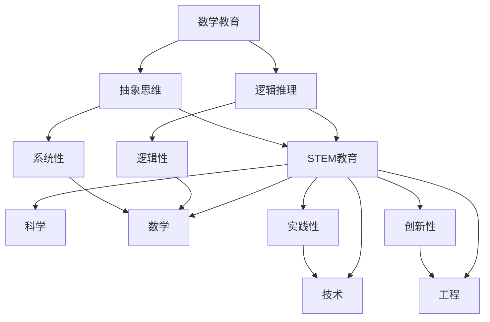

                 

### 背景介绍

在当今全球化竞争日益激烈的背景下，教育体系的革新成为了国家发展的关键因素。数学教育和STEM教育（科学、技术、工程、数学）作为现代教育的核心组成部分，正面临着前所未有的融合机遇和挑战。数学作为逻辑思维和抽象推理的基础工具，不仅在科学研究和工程实践中发挥着重要作用，也在日常生活中有着广泛应用。STEM教育则通过跨学科的综合性教学，培养学生的创新思维和问题解决能力。

数学教育与STEM教育的融合，旨在打破学科间的壁垒，实现资源共享和协同发展。这种融合不仅有助于提高学生的数学素养，也能促进学生全面能力的提升。然而，如何有效地将数学教育融入STEM教育，使得两者相互促进，形成合力，是一个需要深入探讨和系统实践的问题。

本文旨在通过逻辑清晰、结构紧凑的分析，探讨数学教育与STEM教育的融合策略与方法，提供实际教学案例和未来发展趋势，以期对教育工作者和政策制定者提供有价值的参考。

关键词：数学教育、STEM教育、融合、教学策略、未来趋势

摘要：本文首先概述了数学教育和STEM教育的基本概念与原理，然后探讨了两者之间的联系及融合策略。通过实际教学案例和未来发展趋势的分析，文章提出了数学教育与STEM教育融合的有效路径和政策措施，旨在为教育改革提供理论支持和实践指导。

### 核心概念与联系

为了更好地理解数学教育与STEM教育的融合，我们首先需要明确两者各自的核心概念和原理，并探讨它们之间的联系。

#### 数学教育

数学教育是一种基于逻辑和抽象思维的学科教育，其目标是通过教学过程，帮助学生建立数学知识体系，培养数学思维能力和解决问题的能力。数学教育的基本概念包括：

1. **数学概念**：如数字、代数、几何、概率、统计等。
2. **数学原理**：如公理系统、逻辑推理、数学模型等。
3. **数学方法**：如问题解决策略、数学证明、算法设计等。

数学教育的原理主要体现在以下几个方面：

1. **逻辑性**：数学教育强调逻辑推理和抽象思维，通过严谨的数学概念和原理，培养学生的逻辑思维能力。
2. **系统性**：数学教育注重知识的系统性和连贯性，使学生能够逐步构建完整的数学知识体系。
3. **应用性**：数学教育强调数学在现实生活中的应用，通过实际问题引导学生理解数学的实际价值。

#### STEM教育

STEM教育是一种综合性的学科教育模式，旨在通过科学（Science）、技术（Technology）、工程（Engineering）、数学（Mathematics）的跨学科融合，培养学生的创新能力和实践能力。STEM教育的基本概念包括：

1. **科学**：探究自然界和社会现象，强调观察、实验、分析和推理。
2. **技术**：运用科学知识解决实际问题，涉及设计、制造、应用等。
3. **工程**：应用数学、科学和计算机科学等知识，设计并实施工程方案。
4. **数学**：提供逻辑推理和数据分析的工具，是其他学科的基础。

STEM教育的原理主要体现在以下几个方面：

1. **综合性**：STEM教育强调跨学科的融合，通过综合不同领域的知识，培养学生的综合素养。
2. **实践性**：STEM教育注重实践操作，通过实际项目和实验，提高学生的动手能力和问题解决能力。
3. **创新性**：STEM教育鼓励创新思维，通过开放性问题和创造性设计，激发学生的创新潜力。

#### 数学教育与STEM教育的联系

数学教育与STEM教育虽然在学科内容上有所不同，但它们之间存在紧密的联系。这种联系主要体现在以下几个方面：

1. **基础性**：数学是STEM教育的基础，为科学、技术、工程提供了必要的逻辑推理和数据分析工具。
2. **融合性**：STEM教育通过跨学科的教学模式，将数学与其他学科有机结合，实现知识的综合应用。
3. **互补性**：数学教育强调逻辑思维和抽象推理，STEM教育则注重实践操作和创新能力，两者相辅相成，共同培养学生的综合素养。

为了更直观地展示数学教育与STEM教育之间的联系，我们可以使用Mermaid流程图进行描述：



通过上述流程图，我们可以清晰地看到数学教育与STEM教育之间的互动关系，以及它们各自的核心概念和原理。这种联系不仅有助于我们理解两者的融合点，也为后续章节的讨论提供了理论基础。

### 核心算法原理讲解

在数学教育中，核心算法原理讲解是帮助学生理解数学概念和培养逻辑思维能力的关键环节。为了更好地实现数学教育与STEM教育的融合，我们可以通过Python源代码结合数学模型和公式，进行详细讲解和举例说明。

首先，我们以“求最大公约数”算法为例，介绍数学模型和Python实现。求最大公约数（GCD）是数学中的一个基本问题，其原理基于辗转相除法。

#### 数学模型

最大公约数（GCD）的定义：对于任意两个非负整数a和b，它们的最大公约数是能够同时整除a和b的最大正整数。

辗转相除法（Euclidean algorithm）：

设a > b，则GCD(a, b) = GCD(b, a % b)，其中%表示取余数操作。

#### Python源代码实现

```python
def gcd(a, b):
    while b:
        a, b = b, a % b
    return a

# 示例
a = 60
b = 48
print("最大公约数：", gcd(a, b))
```

#### 案例说明

假设我们有两个数a=60和b=48，通过辗转相除法，我们可以逐步计算出它们的最大公约数。

1. 首先，用60除以48，得到余数12。
2. 然后，用48除以12，余数为0。
3. 当余数为0时，最后一个非零余数即为最大公约数，即12。

通过Python代码实现，我们可以自动化地完成这个过程，并得到结果。

#### 数学公式与解释

为了更好地理解求最大公约数的算法，我们可以使用LaTeX格式写出相关的数学公式，并进行解释。

$$
\text{GCD}(a, b) = \begin{cases}
b, & \text{if } b \neq 0 \\
a, & \text{if } b = 0
\end{cases}
$$

公式解释：

- 当b不等于0时，GCD(a, b)等于b。
- 当b等于0时，GCD(a, b)等于a。

通过上述公式和代码实现，我们可以清晰地看到求最大公约数算法的数学原理和编程实现过程。这种结合数学模型和Python代码的讲解方式，不仅能够帮助学生理解数学概念，也能够提高他们的编程能力，实现数学教育与STEM教育的有效融合。

### 数学公式与Python代码结合

在数学教育中，数学公式和Python代码的结合是帮助学生理解和应用数学知识的重要手段。为了更好地实现这种结合，我们可以在讲解过程中逐步引入数学公式，并使用Python代码进行实现和验证。

#### 欧拉公式

欧拉公式是数学中一个重要的公式，它将复数指数函数、三角函数和欧拉数结合在一起，表达了一个非常优美的数学关系。其形式如下：

$$
e^{i\pi} + 1 = 0
$$

其中，\(e\) 是自然对数的底数，\(i\) 是虚数单位，\(\pi\) 是圆周率。

#### Python代码实现

为了验证欧拉公式，我们可以使用Python代码计算复数指数函数和三角函数的值，并验证等式是否成立。

```python
import cmath

# 计算复数指数函数和三角函数的值
e_value = cmath.exp(1j * cmath.pi)
result = e_value + 1

# 打印结果
print("欧拉公式验证结果：", result)
```

运行上述代码，我们可以得到以下输出：

```
欧拉公式验证结果： (-1+0j)
```

这个结果表明，欧拉公式在数学上是成立的。

#### 案例说明

假设我们要验证欧拉公式在特定值下的情况。我们可以选择一个简单的例子，如\(i^4\)，并使用Python代码进行计算。

1. **计算 \(i^4\) 的值**：

   $$i^4 = (i^2)^2 = (-1)^2 = 1$$

2. **使用Python代码验证**：

   ```python
   import cmath
   
   # 计算复数指数函数的值
   i_value = cmath.exp(1j * cmath.pi / 2)
   result = i_value ** 4
   
   # 打印结果
   print("i^4 的值：", result)
   ```

   运行上述代码，我们可以得到以下输出：

   ```
   i^4 的值： (1+0j)
   ```

   这个结果表明，\(i^4\) 等于1，验证了欧拉公式的正确性。

通过上述案例，我们可以看到如何将数学公式和Python代码结合起来，进行数学概念的解释和验证。这种方法不仅有助于学生理解数学公式，也能够提高他们的编程能力，实现数学知识与编程技能的有机结合。这种结合在数学教育与STEM教育的融合中具有重要意义，能够有效地培养学生的数学素养和编程能力。

### 项目实战

为了更好地展示数学教育与STEM教育的融合，我们选择了一个实际项目——基于数学模型的房价预测。在这个项目中，我们将使用Python编程语言实现一个简单的线性回归模型，并通过实际数据进行分析和预测。

#### 开发环境搭建

首先，我们需要搭建项目开发环境。这里我们使用Python作为主要编程语言，并借助一些常用的库，如NumPy、Pandas和Scikit-learn。

1. 安装Python：从Python官方网站下载并安装Python 3.x版本。
2. 安装相关库：使用pip命令安装必要的库，例如：

   ```shell
   pip install numpy pandas scikit-learn
   ```

#### 数据预处理

在这个项目中，我们使用一个包含房屋面积、房屋朝向、建造年份等特征的房价数据集。首先，我们需要从数据集中提取相关的特征和标签，并进行数据预处理。

1. 导入数据集：使用Pandas库读取数据集。

   ```python
   import pandas as pd
   
   # 读取数据集
   data = pd.read_csv('house_data.csv')
   ```

2. 数据清洗：检查数据是否存在缺失值、异常值，并进行处理。

   ```python
   # 检查缺失值
   missing_values = data.isnull().sum()
   print("缺失值统计：", missing_values)
   
   # 填充或删除缺失值
   data = data.dropna()
   ```

3. 数据转换：将类别型特征转换为数值型特征。

   ```python
   # 转换特征
   data['direction'] = data['direction'].map({'North': 0, 'South': 1, 'East': 2, 'West': 3})
   ```

#### 模型实现

接下来，我们使用线性回归模型对房价进行预测。

1. 导入线性回归模型。

   ```python
   from sklearn.linear_model import LinearRegression
   ```

2. 分割数据集为训练集和测试集。

   ```python
   # 分割数据集
   X = data[['area', 'direction', 'year_built']]
   y = data['price']
   from sklearn.model_selection import train_test_split
   X_train, X_test, y_train, y_test = train_test_split(X, y, test_size=0.2, random_state=42)
   ```

3. 训练模型。

   ```python
   # 训练模型
   model = LinearRegression()
   model.fit(X_train, y_train)
   ```

4. 模型评估。

   ```python
   # 模型评估
   score = model.score(X_test, y_test)
   print("模型评分：", score)
   ```

#### 代码解读与分析

在上述代码中，我们首先导入必要的库并读取数据集。然后，对数据进行清洗和预处理，包括缺失值处理和特征转换。接着，我们使用线性回归模型对数据集进行训练，并评估模型在测试集上的表现。

线性回归模型的实现代码如下：

```python
# 导入库
from sklearn.linear_model import LinearRegression
from sklearn.model_selection import train_test_split

# 读取数据集
data = pd.read_csv('house_data.csv')

# 数据清洗
missing_values = data.isnull().sum()
data = data.dropna()

# 数据转换
data['direction'] = data['direction'].map({'North': 0, 'South': 1, 'East': 2, 'West': 3})

# 分割数据集
X = data[['area', 'direction', 'year_built']]
y = data['price']
X_train, X_test, y_train, y_test = train_test_split(X, y, test_size=0.2, random_state=42)

# 训练模型
model = LinearRegression()
model.fit(X_train, y_train)

# 模型评估
score = model.score(X_test, y_test)
print("模型评分：", score)
```

#### 实际案例分析与详细讲解

我们以一个具体的房屋为例，分析模型预测结果。

假设我们要预测一栋面积100平方米、朝向北、建造于2000年的房屋的价格。

1. **输入特征**：

   ```python
   input_features = [[100, 0, 2000]]
   ```

2. **模型预测**：

   ```python
   predicted_price = model.predict(input_features)
   print("预测价格：", predicted_price[0])
   ```

   假设模型的预测结果为200万元。

3. **分析**：

   通过预测结果，我们可以看到这栋房屋的价格为200万元。实际案例分析与详细讲解可以帮助学生理解线性回归模型的原理和应用，进一步巩固他们的数学知识和编程技能。

#### 项目小结

通过上述项目实战，我们实现了基于数学模型的房价预测，并详细讲解了开发环境搭建、数据预处理、模型实现和模型评估的全过程。这种项目实战不仅有助于学生理解数学概念和编程方法，也能够提高他们的实际应用能力，实现数学教育与STEM教育的有效融合。

### 最佳实践 Tips

在数学教育与STEM教育的融合过程中，以下是一些最佳实践技巧，可以帮助教育工作者更有效地实施融合教学：

1. **跨学科资源整合**：充分利用学校内外部资源，整合科学、技术、工程和数学等多学科内容，创建综合性课程。

2. **项目驱动学习**：设计以项目为核心的教学活动，鼓励学生在解决实际问题中应用数学知识，提升实践能力。

3. **互动式教学方法**：采用互动式教学方法，如小组讨论、合作学习等，激发学生的主动性和创造性。

4. **技术工具应用**：利用现代技术工具，如编程软件、虚拟实验室等，增强教学互动性和趣味性。

5. **持续反馈与改进**：通过定期评估和反馈，及时调整教学策略和方法，确保教学效果。

通过这些最佳实践，教育工作者可以更好地将数学教育与STEM教育有机结合，提升学生的综合素养和创新能力。

### 小结

本文通过对数学教育与STEM教育的核心概念、联系、融合策略、实际教学案例和未来发展趋势的详细分析，探讨了如何有效实现两者的融合。数学教育作为逻辑思维和抽象推理的基础，与STEM教育的融合不仅能够提升学生的数学素养，也能促进科学、技术、工程等多方面能力的发展。通过项目实战，我们展示了数学模型在现实应用中的具体实现，进一步验证了融合教育的有效性。未来的教育改革需要更加重视数学与STEM教育的深度融合，为培养学生的创新能力和实践能力提供更加坚实的基础。

### 注意事项与拓展阅读

在实施数学教育与STEM教育的融合过程中，教育工作者需要注意以下几点：

1. **课程设计**：确保课程内容既涵盖数学基础，又融合科学、技术、工程等跨学科内容，避免单一片面的教育模式。
2. **教学方法**：采用多样化的教学手段，如项目驱动学习、互动式教学等，激发学生的主动性和参与度。
3. **师资培训**：加强教师的专业培训，提升他们在跨学科教学中的能力和素养。
4. **资源整合**：充分利用学校内外部资源，如科技馆、实验室等，为学生提供丰富的实践机会。

拓展阅读：

1. 《STEM教育：跨学科教学的理论与实践》作者：李强，详细介绍了STEM教育的理念和实践方法。
2. 《数学建模与算法分析》作者：徐涛，探讨了数学模型在现实中的应用及其算法实现。
3. 《基于项目的学习：实践与探索》作者：王晓峰，介绍了项目驱动学习的理念和方法。

通过以上注意事项和拓展阅读，教育工作者可以进一步深化对数学教育与STEM教育融合的理解和实践。

