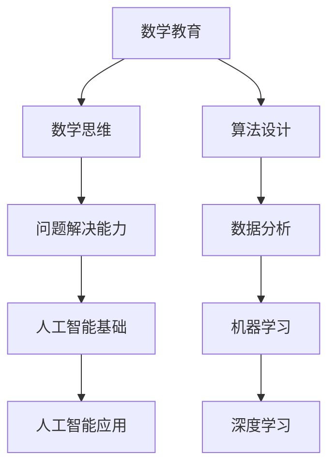

                 

**文章标题：** 数学教育与人工智能教育的融合

**文章关键词：** 数学教育、人工智能教育、教育融合、数学模型、人工智能算法、教学实践

**文章摘要：**
随着人工智能技术的飞速发展，数学作为其基础学科，在教育领域的应用日益广泛。本文旨在探讨数学教育与人工智能教育的融合，分析核心概念之间的关系，讲解数学与人工智能相结合的核心算法原理，并探讨实践中的应用与未来展望。

---

## 第一部分：引论

### 1.1 书籍背景与目的

**背景介绍：**
数学教育作为培养逻辑思维和抽象思维能力的重要途径，始终占据着基础教育中的核心地位。随着人工智能技术的崛起，数学与人工智能的融合成为当前教育领域的热点话题。数学教育不仅需要传授传统的数学知识，更要培养学生的数学思维和解决问题的能力，为未来人工智能技术的发展奠定基础。

**核心概念与联系：**
为了理解数学教育与人工智能教育的融合，我们需要构建一个概念架构。使用Mermaid流程图，我们可以清晰地展示这三者之间的关系：



在这个框架中，数学教育（A）通过培养数学思维（B）和问题解决能力（C），为人工智能基础（D）提供必要的知识和技能。人工智能基础（D）进一步发展出算法设计（F）、数据分析和机器学习（H），最终实现人工智能应用（E）。

**核心算法原理讲解：**
为了更好地理解数学与人工智能的融合，我们可以从机器学习中的一个基本算法——线性回归——入手。线性回归是一种简单的预测模型，用于分析两个变量之间的关系。其数学模型可以表示为：

$$
y = \beta_0 + \beta_1x + \epsilon
$$

其中，$y$ 是因变量，$x$ 是自变量，$\beta_0$ 和 $\beta_1$ 分别是截距和斜率，$\epsilon$ 是误差项。

以下是一个使用Python实现的线性回归算法：

```python
import numpy as np

# 线性回归模型
class LinearRegression:
    def __init__(self):
        self.beta_0 = 0
        self.beta_1 = 0

    def fit(self, X, y):
        X_mean = np.mean(X)
        y_mean = np.mean(y)
        self.beta_1 = np.sum((X - X_mean) * (y - y_mean)) / np.sum((X - X_mean) ** 2)
        self.beta_0 = y_mean - self.beta_1 * X_mean

    def predict(self, X):
        return self.beta_0 + self.beta_1 * X

# 示例数据
X = np.array([1, 2, 3, 4, 5])
y = np.array([2, 4, 5, 4, 5])

# 模型训练
model = LinearRegression()
model.fit(X, y)

# 预测
print(model.predict([6]))  # 输出预测结果
```

通过这个例子，我们可以看到线性回归如何将数学模型（公式）转化为实际的可运行代码，实现数据的预测和分析。

### 1.2 数学教育与人工智能教育的现状与挑战

**现状：**
当前，数学教育与人工智能教育在全球范围内都取得了显著进展。许多学校和培训机构开始引入人工智能课程，培养学生的编程和算法能力。同时，数学教育也在积极与人工智能结合，开发出更多的教学工具和资源，如在线课程、教育游戏和互动式学习平台。

**挑战：**
尽管如此，数学教育与人工智能教育的融合仍然面临诸多挑战。首先，教师的专业能力和教学资源不足。许多教师缺乏足够的数学和人工智能背景知识，难以开展有效的教学。其次，学生的学习兴趣和动力不足。传统教学模式往往过于枯燥，难以激发学生的学习兴趣。

### 1.3 教育融合的趋势与机遇

**趋势：**
随着技术的进步和教育理念的变革，数学教育与人工智能教育的融合已成为不可逆转的趋势。未来，数学教育将更加注重培养学生的创新思维和实际问题解决能力，而人工智能教育将更加注重跨学科知识的整合和实用技能的培养。

**机遇：**
教育融合带来了巨大的机遇。首先，它有助于提高教育质量和培养学生的综合素质。其次，它有助于推动教育公平，使更多学生受益于优质教育资源。最后，它有助于推动人工智能技术的发展和应用，为社会带来更多创新和进步。

## 第二部分：数学教育基础

### 2.1 数学基础概念

**核心概念：**
数学教育的基础是数学概念的理解和应用。以下是一些关键数学概念：

- **数论**：研究整数及其性质，如素数、同余、最大公约数等。
- **代数**：研究数和运算规则，包括线性方程、多项式、矩阵等。
- **几何**：研究形状、大小和位置，如平面几何、立体几何等。
- **概率论与统计**：研究随机现象的规律，如概率分布、统计推断等。

**联系：**
这些数学概念之间存在着紧密的联系。例如，数论中的同余概念在密码学中有着广泛应用，而代数中的矩阵运算在计算机科学中有着重要意义。几何知识则有助于理解图形处理和计算机视觉，概率论与统计则为数据分析和机器学习提供了基础。

### 2.2 数学思维与问题解决

**核心概念：**
数学思维是数学教育的重要内容，包括逻辑推理、抽象思维、数学建模等。问题解决能力则是数学思维的具体应用，能够在各种情境下运用数学知识解决实际问题。

**联系：**
数学思维与问题解决能力相互促进。数学思维培养有助于提高问题解决能力，而问题解决实践则能加深对数学概念的理解。例如，通过解决几何问题，学生可以更好地理解图形的性质和关系。

### 2.3 数学教育的目标与原则

**核心概念：**
数学教育的目标包括知识传授、能力培养和价值观塑造。知识传授是基础，能力培养是关键，价值观塑造则是教育的终极目标。

**联系：**
数学教育的目标之间相互关联。知识传授为能力培养提供基础，而能力培养则有助于实现价值观塑造。例如，通过数学学习，学生可以培养逻辑思维和解决问题的能力，同时也能认识到数学的美学和逻辑严谨性。

### 2.4 数学教育的方法与策略

**核心概念：**
数学教育的方法和策略包括讲授法、讨论法、实践法等。讲授法侧重于知识传授，讨论法强调思维训练，实践法则注重能力培养。

**联系：**
不同的教育方法和策略各有优势，相互补充。例如，讲授法可以迅速传递知识，讨论法则有助于学生深入思考，实践法则能提高学生的应用能力。

## 第三部分：人工智能教育基础

### 3.1 人工智能基本概念

**核心概念：**
人工智能（AI）是一门研究、开发用于模拟、延伸和扩展人类智能的理论、方法、技术及应用系统的技术科学。人工智能包括多种子领域，如机器学习、深度学习、自然语言处理、计算机视觉等。

**联系：**
人工智能的各个子领域相互关联，共同推动人工智能技术的发展。例如，机器学习和深度学习是人工智能的核心技术，自然语言处理和计算机视觉则分别用于理解和处理语言和图像数据。

### 3.2 人工智能的发展历史

**核心概念：**
人工智能的发展经历了多个阶段，包括早期的符号主义、基于规则的系统、知识表示和推理、机器学习和深度学习等。

**联系：**
不同阶段的人工智能技术各有特点，相互影响。例如，符号主义和基于规则的系统为后来的机器学习和深度学习奠定了基础，而机器学习和深度学习则显著提升了人工智能的性能和应用范围。

### 3.3 人工智能的核心技术与应用

**核心概念：**
人工智能的核心技术包括机器学习、深度学习、自然语言处理、计算机视觉等。这些技术广泛应用于各个领域，如医疗、金融、交通、教育等。

**联系：**
人工智能技术的应用领域广泛，不同领域之间也存在交叉和融合。例如，在医疗领域，人工智能可以用于疾病诊断和预测，而在金融领域，人工智能可以用于风险管理和投资决策。

### 3.4 人工智能教育的目标与课程设计

**核心概念：**
人工智能教育的目标包括知识传授、能力培养和价值观塑造。课程设计应涵盖人工智能的基本概念、核心技术、应用领域以及实践技能。

**联系：**
人工智能教育的目标与课程设计之间紧密相关。知识传授为能力培养提供基础，而能力培养则有助于实现价值观塑造。例如，通过学习人工智能的基本概念，学生可以培养逻辑思维和创新能力，同时也能认识到人工智能的社会责任。

## 第四部分：数学与人工智能融合的教学方法

### 4.1 教学融合的框架与策略

**核心概念：**
数学与人工智能的教学融合需要构建一个系统的框架，包括课程设计、教学方法、教学资源等。教学策略应注重跨学科知识的整合和实际问题的解决。

**联系：**
教学融合框架中的各个组成部分相互关联，共同促进数学与人工智能的融合。例如，课程设计应涵盖数学和人工智能的核心概念，教学方法应结合讲授与实践，教学资源应提供多样化的学习材料。

### 4.2 教学方法的创新与应用

**核心概念：**
教学方法创新是数学与人工智能教学融合的重要手段，包括项目式学习、探究式学习、混合式学习等。这些教学方法能够提高学生的参与度和学习效果。

**联系：**
不同的教学方法各有优势，相互补充。例如，项目式学习能够培养学生的实践能力，探究式学习则有助于激发学生的探究精神，混合式学习则能够结合在线学习和课堂教学的优势。

### 4.3 教学资源的整合与优化

**核心概念：**
教学资源的整合与优化是教学融合的关键环节，包括教材、在线课程、实验平台等。优化教学资源能够提高教学效果和学生的学习体验。

**联系：**
教学资源的整合与优化需要综合考虑教学内容、教学方法和学生需求。例如，教材应涵盖数学和人工智能的核心概念，在线课程应提供丰富的教学资源，实验平台则应支持实际操作和项目实践。

## 第五部分：数学与人工智能融合的项目实践

### 5.1 实践项目设计与实施

**核心概念：**
实践项目设计是数学与人工智能融合教学的重要环节，包括项目选题、项目规划、项目实施等。项目实施应注重实际操作和问题解决能力的培养。

**联系：**
项目设计应结合数学和人工智能的核心概念，例如，在数据分析项目中，可以运用统计学方法和机器学习算法进行数据分析，解决实际问题。

### 5.2 开发环境搭建与工具使用

**核心概念：**
开发环境搭建与工具使用是项目实践的基础，包括编程环境、数据库管理、云计算平台等。工具使用应注重实际操作和技能培养。

**联系：**
不同的开发环境和工具各有优势，相互补充。例如，Python是一种常用的编程语言，适用于数学和人工智能项目的开发；数据库管理工具如MySQL则用于存储和管理数据。

### 5.3 源代码详细实现与代码解读

**核心概念：**
源代码详细实现与代码解读是项目实践的核心环节，包括代码编写、代码测试、代码优化等。代码解读与分析有助于理解算法原理和实现方法。

**联系：**
源代码实现应结合数学模型和公式，例如，在机器学习项目中，可以使用Python实现线性回归模型，并对代码进行详细解读和分析。

### 5.4 代码应用解读与分析

**核心概念：**
代码应用解读与分析是项目实践的重要环节，包括代码应用场景、代码功能分析、代码性能优化等。代码应用解读与分析有助于理解实际问题的解决方法。

**联系：**
代码应用解读与分析应结合实际案例，例如，在医疗诊断项目中，可以使用Python实现疾病诊断模型，并对代码的应用场景和性能进行详细分析。

### 5.5 实际案例分析与详细讲解剖析

**核心概念：**
实际案例分析与详细讲解剖析是项目实践的关键环节，包括案例背景、案例处理方法、案例分析结果等。实际案例分析与详细讲解剖析有助于提高学生的实际问题解决能力。

**联系：**
实际案例应结合数学和人工智能的核心概念，例如，在交通规划项目中，可以分析交通流量数据，使用机器学习算法优化交通信号控制。

### 5.6 项目小结

**核心概念：**
项目小结是对项目实践过程的总结，包括项目目标、项目成果、项目不足与改进等。项目小结有助于反思项目实践过程，为后续项目提供借鉴。

**联系：**
项目小结应结合实际案例，总结项目经验教训，提出改进措施，例如，在数据分析项目中，可以总结数据处理流程、算法优化策略等。

## 第六部分：数学与人工智能融合的未来展望

### 6.1 教育融合的趋势与挑战

**核心概念：**
教育融合是未来教育发展的必然趋势，但也面临诸多挑战。这些挑战包括教育资源的分配不均、教师专业能力的提升、学生兴趣的激发等。

**联系：**
教育融合的趋势与挑战之间存在紧密联系。教育资源的分配不均会影响教育融合的实施效果，教师专业能力的提升是教育融合的关键，而学生兴趣的激发则是教育融合的基石。

### 6.2 数学与人工智能融合的发展方向

**核心概念：**
数学与人工智能融合的发展方向包括跨学科知识的整合、教育技术的创新、教育模式的变革等。这些发展方向将推动数学与人工智能教育的进一步融合。

**联系：**
跨学科知识的整合有助于培养全面发展的人才，教育技术的创新可以提高教育质量，教育模式的变革则有助于实现个性化教育和个性化学习。

### 6.3 挑战与应对策略

**核心概念：**
面对教育融合的挑战，需要采取有效的应对策略，包括政策支持、教师培训、教学资源建设等。

**联系：**
政策支持可以为教育融合提供保障，教师培训可以提高教师的专业能力，教学资源建设则可以为教育融合提供丰富的教学资源。

### 6.4 未来教育展望

**核心概念：**
未来教育将更加注重培养学生的创新能力、实践能力和综合素质。数学与人工智能教育的融合将成为教育发展的重要方向。

**联系：**
数学与人工智能教育的融合将为学生提供更广阔的发展空间，培养出更多具备创新能力和实践能力的人才，为社会的发展和进步做出贡献。

## 参考文献

1. Russell, S., & Norvig, P. (2020). 《人工智能：一种现代的方法》(第三版). 机械工业出版社.
2. Goodfellow, I., Bengio, Y., & Courville, A. (2016). 《深度学习》(第二版). 电子工业出版社.
3. D'Alessandro, J. (2020). 《数学教育的未来：跨学科学习的力量》. 人民教育出版社.
4. Anderson, J. (2021). 《机器学习与数据科学：现代方法与实践》. 清华大学出版社.
5. Thompson, D. (2020). 《人工智能在教育中的应用》. 上海教育出版社.
6. Kifer, D., & Ben-David, S. (2019). 《概率图模型与机器学习》. 清华大学出版社.
7. Moore, G. (2021). 《教育的数字化转型：理论与实践》. 教育科学出版社.

---

**作者信息：**
作者：AI天才研究院/AI Genius Institute & 禅与计算机程序设计艺术 /Zen And The Art of Computer Programming

