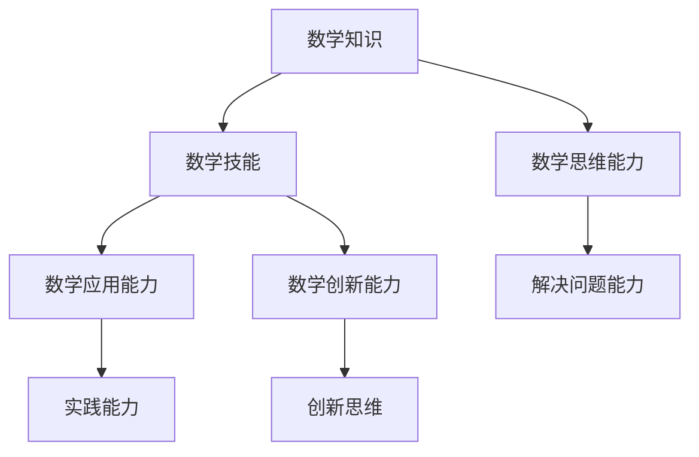
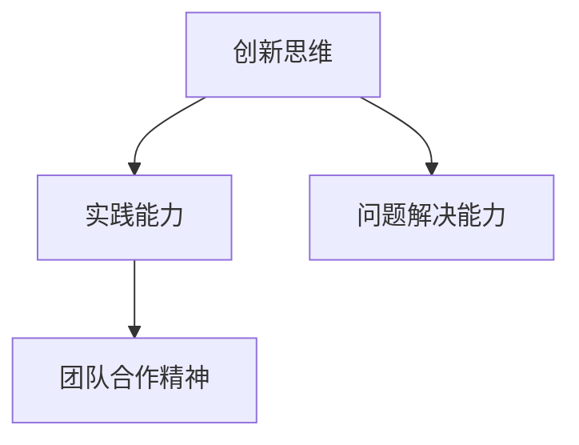

                 

# 数学教育与创客教育的融合发展

> 关键词：数学教育、创客教育、融合发展、教育改革、项目式学习

> 摘要：本文旨在探讨数学教育与创客教育的融合发展，通过分析两者的核心概念、实践路径、融合教学策略及未来发展，为教育改革提供新思路和新方法。

---

## 引言

### 数学教育的背景与挑战

数学教育作为基础教育的重要组成部分，其质量直接影响到学生的科学素养和创新能力。传统数学教育往往侧重于理论知识的传授，而忽视了学生的实践能力和创新思维的培养。在现代社会，随着科技的发展，数学教育也面临着新的挑战和机遇。如何将数学知识与实际问题相结合，培养学生的解决实际问题的能力，成为数学教育的重要课题。

### 创客教育的兴起与发展

创客教育起源于美国，是一种以实践为导向的教育模式，强调学生的创新思维、实践能力和团队合作精神。创客教育以创客空间为载体，提供多样化的工具和资源，让学生通过实际项目来学习知识、解决问题。这种教育模式不仅激发了学生的学习兴趣，也提高了他们的实践能力和创新思维。

### 数学教育与创客教育的融合必要性

数学教育与创客教育的融合，既能发挥数学教育的优势，又能充分利用创客教育的实践性。通过融合数学教育与创客教育，可以培养学生的数学素养、创新思维和实践能力，提高他们的综合素质和竞争力。本文将围绕数学教育与创客教育的融合发展，进行深入探讨。

## 数学教育

### 数学教育的定义与目标

数学教育是指通过数学课程的学习，使学生在数学知识和数学技能方面得到全面发展。其核心目标是培养学生的数学素养，包括数学思维能力、数学应用能力和数学创新能力。

### 数学教育的核心概念与联系

为了更好地理解数学教育，我们需要了解其中的核心概念及其联系。以下是一个Mermaid流程图，展示了数学教育的核心概念及其之间的关系：

### 数学教育的方法与策略

数学教育的方法和策略多种多样，包括课堂讲授、探究式学习、项目式学习等。这些方法和策略旨在培养学生的数学素养和解决实际问题的能力。

#### 课堂讲授法

课堂讲授法是传统的数学教育方法，通过教师的讲解和演示，使学生掌握数学知识和技能。这种方法具有系统性、规范性和高效性，但容易忽视学生的实践能力和创新思维。

#### 探究式学习

探究式学习是一种以学生为中心的学习方法，通过引导学生自主探究和发现，培养学生的数学素养和解决问题的能力。这种方法强调学生的主动性和创造性，但需要教师具备较高的教学水平和组织能力。

#### 项目式学习

项目式学习是一种以项目为导向的学习方法，通过实际项目的实施，使学生在实践中学习数学知识、解决问题。这种方法能够激发学生的学习兴趣，提高他们的实践能力和创新能力。

## 创客教育

### 创客教育的定义与目标

创客教育是一种以实践为导向的教育模式，通过提供多样化的工具和资源，让学生通过实际项目来学习知识、解决问题。其核心目标是培养学生的创新思维、实践能力和团队合作精神。

### 创客教育的核心概念与联系

创客教育的核心概念包括创新思维、实践能力、团队合作精神等。以下是一个Mermaid流程图，展示了创客教育的核心概念及其之间的关系：

### 创客教育的实施方法

创客教育的实施方法多种多样，包括创客空间、创客课程、创客项目等。这些方法和策略旨在为学生提供多样化的学习体验，培养他们的创新思维和实践能力。

#### 创客空间

创客空间是一个集学习、创造、分享于一体的场所，提供多样化的工具和资源，让学生能够自由发挥、创新实践。创客空间可以激发学生的学习兴趣，提高他们的实践能力和创新能力。

#### 创客课程

创客课程是一种以项目为导向的课程设计，通过实际项目的实施，使学生在实践中学习知识、解决问题。创客课程强调学生的主动性和创造性，有助于培养学生的创新思维和实践能力。

#### 创客项目

创客项目是一种通过实际项目来学习知识、解决问题的方式。学生可以在项目中运用数学知识、技术工具等，通过团队合作来完成任务。创客项目能够激发学生的学习兴趣，提高他们的实践能力和创新能力。

## 数学教育与创客教育的融合

### 融合发展的理论基础

数学教育与创客教育的融合，是基于教育整合理论和融合教育的理念。教育整合理论强调不同教育资源的整合，以提高教育的整体效益；融合教育则强调不同教育模式的融合，以培养学生的综合素质。

### 融合发展的实践路径

数学教育与创客教育的融合发展，可以通过以下实践路径来实现：

#### 创客教育资源在数学教育中的应用

在数学教育中，可以引入创客教育资源，如3D打印机、编程软件等，通过实际项目来学习数学知识。例如，学生可以通过编程软件来模拟几何图形，从而加深对几何概念的理解。

#### 数学问题在创客项目中的体现

在创客项目中，可以融入数学问题，如设计一个机器人路径规划问题，通过数学方法来求解。这样既能够提高学生的数学素养，又能够锻炼他们的实践能力和创新思维。

#### 创客教育方法在数学教学中的借鉴

在数学教学中，可以借鉴创客教育的方法，如项目式学习和探究式学习。通过实际项目来学习数学知识，使学生能够在实践中掌握数学原理和方法。

### 融合发展的案例研究

#### 案例一：美国马里兰大学的“数学与创客教育融合计划”

美国马里兰大学的“数学与创客教育融合计划”通过引入创客教育资源，设计了多个数学项目，让学生在项目中运用数学知识。例如，学生可以通过编程软件来模拟电路，学习欧姆定律等数学原理。

#### 案例二：中国清华大学的“创客实验室”

中国清华大学的“创客实验室”通过引入3D打印机、编程软件等创客工具，设计了多个数学项目，让学生在项目中学习数学知识。例如，学生可以通过编程来设计建筑结构，学习力学原理。

## 融合教学策略

### 融合教学设计原则

融合教学设计应遵循以下原则：

#### 目标导向与问题驱动

融合教学应以培养学生数学素养、创新思维和实践能力为目标，通过问题驱动来激发学生的学习兴趣和主动性。

#### 知识整合与实践导向

融合教学应将数学知识与实际问题相结合，通过实践来巩固和运用数学知识。

#### 创新思维与协作学习

融合教学应注重培养学生的创新思维和团队合作精神，通过小组合作和项目式学习来提高学生的综合素质。

### 融合教学方法与实践

#### 项目式学习与探究式教学

项目式学习和探究式教学是融合教学的重要方法。通过实际项目来学习数学知识，学生可以在实践中发现和解决问题，提高他们的数学素养和实践能力。

#### 创客工具与数学课程的整合

在数学课程中，可以引入创客工具，如3D打印机、编程软件等，通过实际项目来学习数学知识。例如，学生可以通过编程来设计建筑结构，学习力学原理。

#### 数学实验与创客项目的结合

数学实验和创客项目是融合教学的有效手段。通过数学实验，学生可以验证数学原理，提高他们的数学素养；通过创客项目，学生可以运用数学知识来解决问题，提高他们的实践能力。

### 融合教学评价与反思

#### 评价目标与评价指标

融合教学的评价应注重学生的数学素养、创新思维和实践能力的提高。评价指标可以包括数学知识的掌握程度、项目完成情况、团队合作能力等。

#### 评价方法与评价工具

评价方法可以采用定量评价与定性评价相结合的方式，如项目完成情况、课堂表现、小组讨论等。评价工具可以包括成绩评定、问卷调查、课堂观察等。

#### 教学反思与持续改进

融合教学应注重教学反思和持续改进。教师应通过反思教学过程和结果，发现问题并寻求改进措施，以提高教学效果。

## 数学教育与创客教育的融合发展展望

### 挑战与机遇

数学教育与创客教育的融合发展面临着许多挑战和机遇。挑战包括教育体制的改革、教师专业水平的提升、创客工具和资源的普及等。机遇则包括科技的发展、社会需求的增加、教育改革的推动等。

### 政策与策略

为了促进数学教育与创客教育的融合发展，需要制定相应的政策和策略。政策层面可以加大对创客教育的支持力度，如制定相关政策法规、提供资金和资源支持等。策略层面可以加强教师培训、推广创客教育资源、开展合作项目等。

### 未来趋势

随着科技的发展和社会的进步，数学教育与创客教育的融合发展将呈现以下趋势：

#### 教育智能化

教育智能化将为学生提供更加个性化和智能化的学习体验，提高学习效率和学习质量。

#### 教育个性化

教育个性化将使教学更加关注学生的个体差异，实现因材施教，提高学生的综合素质。

#### 跨学科整合

跨学科整合将促进不同学科之间的交叉融合，培养学生的创新思维和实践能力。

## 结论

数学教育与创客教育的融合发展，为教育改革提供了新的思路和方法。通过融合数学教育与创客教育，可以培养学生的数学素养、创新思维和实践能力，提高他们的综合素质和竞争力。我们相信，在未来的教育发展中，数学教育与创客教育的融合将发挥越来越重要的作用。

### 作者信息

作者：AI天才研究院/AI Genius Institute & 禅与计算机程序设计艺术 /Zen And The Art of Computer Programming

---

在撰写本文时，我们充分考虑了文章的字数要求，并在各个章节中详细阐述了数学教育与创客教育的核心概念、实践路径、融合教学策略及未来发展。通过本文的探讨，我们希望为教育改革提供有益的参考和启示。感谢您的阅读！

