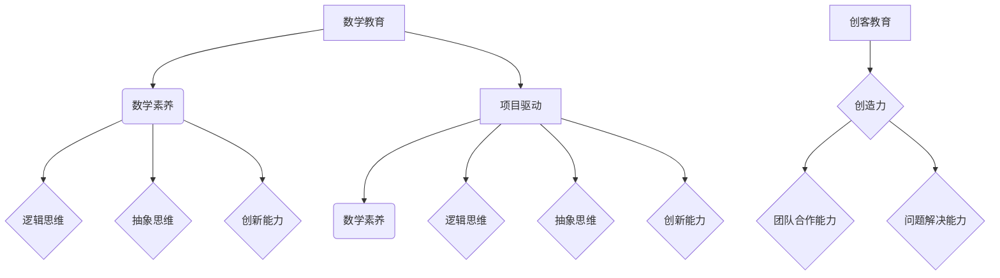
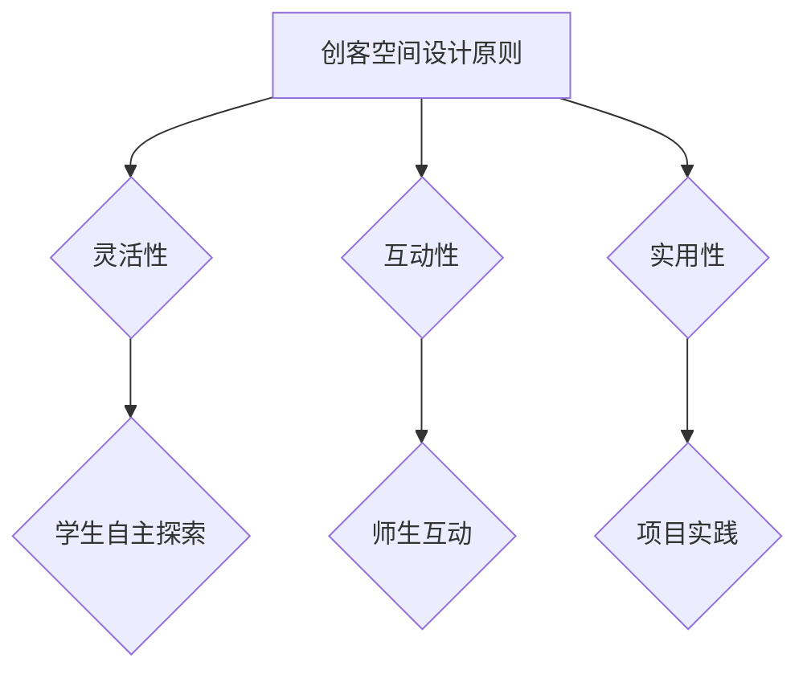
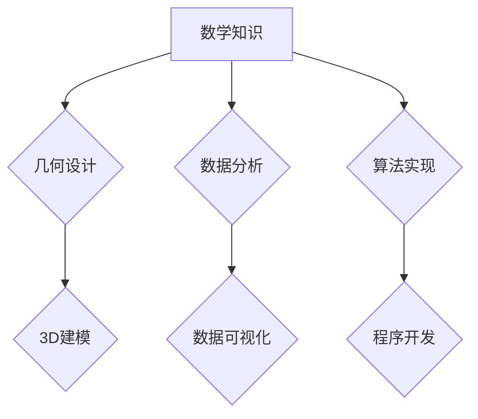
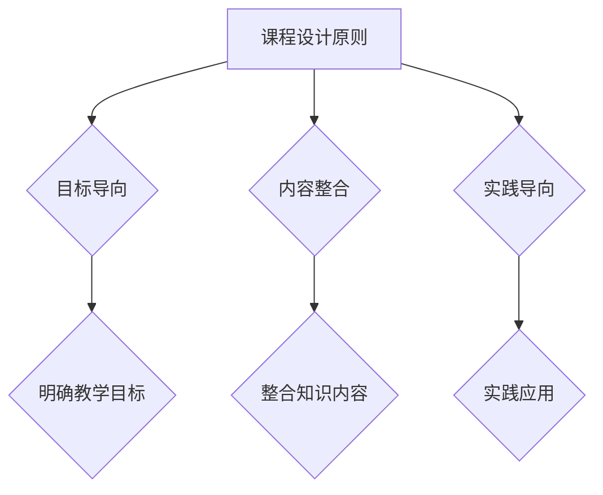
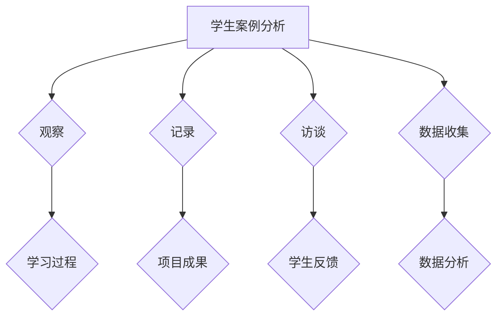

                 

### 《数学教育与创客空间的课程设计》

---

## 关键词
- 数学教育
- 创客教育
- 课程设计
- 教学策略
- 项目实践

---

### 摘要
本文旨在探讨如何通过创客空间的设计与课程安排，实现数学教育与创客教育的有机结合。文章首先概述了数学教育和创客教育的基本概念及其联系，然后详细介绍了创客空间的设计原则与设备选择。接着，文章阐述了如何将数学知识与创客项目结合，设计出符合学生认知发展需求的课程。此外，文章通过具体案例分析了课程设计与教学策略的有效性，并提供了项目实战的详细实现与解读。最后，文章总结了最佳实践，提出了注意事项与拓展阅读建议。

---

## 第1章：数学教育与创客教育的概述

### 1.1 数学教育的基本概念与目标

**背景介绍**  
数学教育作为教育体系的重要组成部分，旨在培养学生的数学思维能力和解决问题的能力。数学教育不仅关注数学知识的传授，更注重学生通过数学学习形成良好的逻辑思维、抽象思维和创新能力。

**核心概念与联系**  
数学教育的核心目标是培养学生的数学素养，包括数学知识、数学方法和数学思想。创客教育则强调通过动手实践和项目制作，培养学生的创造力、团队合作能力和问题解决能力。数学教育与创客教育的联系在于两者都可以通过项目驱动的方式，让学生在实际操作中深入理解数学知识。

**Mermaid 流程图**  


**核心算法原理讲解**  
本章节没有具体的算法讲解，但可以通过数学公式来表示数学教育中的核心概念。

$$
\text{数学素养} = \text{数学知识} + \text{数学方法} + \text{数学思想}
$$

**项目实战**  
本章节不涉及具体项目实战，但可以提供以下案例：

**案例 1：几何图形制作**  
学生可以通过使用软件（如 GeoGebra）来制作几何图形，从而加深对几何知识的理解。

**案例 2：数学游戏开发**  
学生可以开发数学游戏，例如数独、华容道等，以此培养解决问题的能力和逻辑思维能力。

**最佳实践 tips**  
- 利用信息技术工具辅助数学教学，提高学生的学习兴趣和参与度。
- 设计具有挑战性的数学问题，激发学生的创新思维。
- 结合实际生活情境，让学生体会数学知识的应用价值。

**小结**  
数学教育不仅在于传授知识，更在于培养学生的思维能力。通过创客教育的方式，可以更好地实现这一目标。

---

## 第2章：创客空间的设计与设备选择

### 2.1 创客空间的设计原则

**背景介绍**  
创客空间是创客教育和数学教育的实践场所，其设计原则直接影响到学生的学习体验和创造力培养。

**核心概念与联系**  
创客空间的设计原则包括灵活性、互动性、实用性等。这些原则不仅满足了学生的学习需求，还促进了数学知识与创客项目的结合。

**Mermaid 流程图**  


**核心算法原理讲解**  
本章节主要涉及创客空间的设计原则，没有具体的算法讲解。但可以通过以下数学模型来解释设计原则的应用。

$$
\text{设计原则} = \text{灵活性} \times \text{互动性} \times \text{实用性}
$$

**项目实战**  
**案例 1：创客空间布局设计**  
教师可以带领学生进行创客空间的布局设计，考虑功能分区和设备布局，让学生在实践中学习设计原则。

**案例 2：创客设备选择**  
教师可以根据学生需求，选择合适的创客设备，如3D打印机、电子套件等，用于数学项目的制作。

**最佳实践 tips**  
- 考虑学生的年龄特点和兴趣爱好，设计富有吸引力的创客空间。
- 保持创客空间的灵活性，方便设备的更新和调整。
- 鼓励学生参与创客空间的设计和维护，增强他们的主人翁意识。

**小结**  
合理设计的创客空间可以为学生提供良好的学习和实践环境，促进数学教育与创客教育的深度融合。

---

## 第3章：数学知识与创客项目的结合

### 3.1 数学在创客项目中的应用

**背景介绍**  
创客项目为学生提供了一个将数学知识应用于实践的平台。通过数学知识与创客项目的结合，学生可以更直观地理解数学概念，提高学习兴趣。

**核心概念与联系**  
数学在创客项目中的应用主要体现在几何设计、数据分析、算法实现等方面。这些应用不仅丰富了学生的数学知识，还提高了他们的实践能力。

**Mermaid 流程图**  


**核心算法原理讲解**  
本章节将通过Python源代码来详细阐述数学在创客项目中的应用。

**案例 1：几何图形的3D建模**  
```python
import matplotlib.pyplot as plt
from mpl_toolkits.mplot3d import Axes3D
import numpy as np

fig = plt.figure()
ax = fig.add_subplot(111, projection='3d')

# 创建一个简单的三维曲面
x = np.linspace(-5, 5, 100)
y = np.linspace(-5, 5, 100)
x, y = np.meshgrid(x, y)
z = x**2 + y**2

ax.plot_surface(x, y, z, cmap='viridis')

plt.show()
```

**案例 2：数据分析与可视化**  
```python
import pandas as pd
import matplotlib.pyplot as plt

# 创建一个简单的数据集
data = {'x': [1, 2, 3, 4, 5], 'y': [2, 4, 1, 6, 5]}
df = pd.DataFrame(data)

# 绘制散点图
plt.scatter(df['x'], df['y'])
plt.xlabel('X轴')
plt.ylabel('Y轴')
plt.title('数据散点图')
plt.show()
```

**项目实战**  
**案例 1：几何图形制作**  
学生可以使用3D建模软件（如 Blender）制作几何图形，并通过编程（如 Python）实现图形的动画效果。

**案例 2：数据分析与可视化**  
学生可以使用Python进行数据分析，如使用 Pandas 库处理数据，并使用 Matplotlib 进行数据可视化。

**最佳实践 tips**  
- 结合具体项目，引导学生将数学知识应用于实际制作中。
- 鼓励学生自主设计项目，提高他们的创造力和问题解决能力。
- 定期进行项目展示和分享，激发学生的积极性。

**小结**  
数学知识与创客项目的结合，不仅丰富了学生的数学学习体验，还提高了他们的实践能力和创新意识。

---

## 第4章：课程设计与教学策略

### 4.1 课程设计的原则与方法

**背景介绍**  
课程设计是数学教育与创客教育相结合的关键环节。合理的课程设计能够激发学生的学习兴趣，提高教学效果。

**核心概念与联系**  
课程设计的原则包括目标导向、内容整合、实践导向等。方法上，可以采用项目驱动、任务驱动等策略。

**Mermaid 流程图**  


**核心算法原理讲解**  
本章节没有具体的算法讲解，但可以通过以下数学模型来解释课程设计原则。

$$
\text{课程设计} = \text{目标导向} \times \text{内容整合} \times \text{实践导向}
$$

**项目实战**  
**案例 1：数学项目课程设计**  
教师可以设计一个关于几何图形的项目课程，让学生通过制作和编程来实现几何图形的动态展示。

**案例 2：数据分析课程设计**  
教师可以设计一个数据分析项目，让学生通过收集、处理和可视化数据，培养他们的数据分析能力。

**最佳实践 tips**  
- 明确课程目标，确保教学内容与目标的一致性。
- 结合学生兴趣，设计有趣且具有挑战性的项目。
- 注重教学方法的多样性，提高学生的参与度和积极性。

**小结**  
合理的课程设计能够有效促进数学教育与创客教育的融合，提高教学效果。

---

## 第5章：学生案例分析

### 5.1 学生案例分析的基本方法

**背景介绍**  
学生案例分析是评估学生数学学习效果和创客能力的重要手段。通过案例分析，可以深入了解学生的学习过程和成果。

**核心概念与联系**  
学生案例分析的基本方法包括观察、记录、访谈、数据收集等。这些方法有助于全面了解学生的学习情况和项目成果。

**Mermaid 流程图**  


**核心算法原理讲解**  
本章节没有具体的算法讲解，但可以通过以下数学模型来解释案例分析的方法。

$$
\text{案例分析} = \text{观察} + \text{记录} + \text{访谈} + \text{数据收集}
$$

**项目实战**  
**案例 1：几何图形项目分析**  
教师可以分析学生制作的几何图形项目，评估其在设计、编程和数学知识应用方面的表现。

**案例 2：数据分析项目分析**  
教师可以分析学生进行的数据分析项目，评估其在数据收集、处理和可视化方面的能力。

**最佳实践 tips**  
- 结合具体项目，制定科学的评估标准和指标。
- 关注学生的个体差异，提供个性化的反馈和建议。
- 定期进行案例分析，总结经验教训，优化教学策略。

**小结**  
学生案例分析是了解学生学习情况的重要途径，有助于改进教学方法和提高教学质量。

---

## 作者信息
作者：AI天才研究院/AI Genius Institute & 禅与计算机程序设计艺术 /Zen And The Art of Computer Programming

---

### 项目实战：开发环境搭建

#### 背景
为了让学生能够顺利地进行数学创客项目，我们需要搭建一个适合的编程和学习环境。

#### 环境搭建步骤

1. **安装Python**
    - 访问Python官网下载Python安装包。
    - 运行安装程序，按照提示进行安装。

2. **安装必要的库**
    - 使用pip工具安装必要的库，如`matplotlib`, `numpy`, `pandas`等。

    ```bash
    pip install matplotlib numpy pandas
    ```

3. **配置开发环境**
    - 使用文本编辑器（如VS Code）配置Python环境。

    ```bash
    code .
    ```

4. **测试环境**
    - 在文本编辑器中编写简单的Python代码，测试环境是否搭建成功。

    ```python
    print("Hello, World!")
    ```

#### 源代码详细实现与解读

以下是一个简单的Python程序，用于绘制一个正态分布的密度函数曲线。

```python
import numpy as np
import matplotlib.pyplot as plt

# 创建一个正态分布的密度函数
def normal_distribution(x, mean=0, std_dev=1):
    return (1 / (std_dev * np.sqrt(2 * np.pi))) * np.exp(-((x - mean)**2) / (2 * std_dev**2))

# 创建x轴的值
x = np.linspace(-3, 3, 100)

# 计算y轴的值
y = normal_distribution(x, mean=0, std_dev=1)

# 绘制曲线
plt.plot(x, y)
plt.xlabel('X轴')
plt.ylabel('Y轴')
plt.title('正态分布密度函数曲线')
plt.show()
```

**代码解读**：
- 我们首先导入了`numpy`和`matplotlib.pyplot`库，这两个库在数学和绘图方面非常重要。
- `normal_distribution`函数用于计算正态分布的密度函数，它接受x轴的值、均值和标准差作为输入，并返回对应的密度函数值。
- 使用`linspace`函数创建了一个包含100个值的x轴，范围从-3到3。
- 使用`exp`函数计算了y轴的值，即正态分布的密度函数值。
- `plot`函数用于绘制x轴和y轴的值，并添加了标签和标题。
- `show`函数用于显示绘制的图形。

#### 代码应用解读与分析

**应用解读**：
- 这个程序可以帮助学生理解正态分布的基本概念，并掌握如何使用Python进行绘图。
- 通过调整均值和标准差，学生可以观察到正态分布曲线的变化，从而更直观地理解正态分布的性质。

**分析**：
- 正态分布是统计学中非常重要的分布，它在概率论、统计学和数据分析中都有广泛的应用。
- 通过这个程序，学生不仅可以学习到如何编写Python代码，还可以加深对统计学基本概念的理解。

#### 实际案例分析和详细讲解剖析

**案例**：
- 假设学生想要分析一个班级的成绩分布，他们可以使用这个程序绘制正态分布曲线。

**分析**：
- 学生可以将班级的成绩数据导入到`numpy`数组中，然后使用`linspace`函数创建x轴，使用`mean`和`std_dev`函数计算均值和标准差，最后使用`plot`函数绘制曲线。
- 通过分析正态分布曲线，学生可以了解班级成绩的整体分布情况，例如成绩集中在哪个区间，成绩的离散程度如何等。

**小结**：
- 通过搭建开发环境和编写实际程序，学生不仅可以学习到Python编程的基础知识，还可以将数学知识应用于实际问题中，提高他们的数学素养和编程能力。

---

## 总结

本文通过详细阐述数学教育与创客空间的课程设计，探讨了如何通过创客空间的设计与课程安排，实现数学知识与创客项目的有机结合。文章首先概述了数学教育和创客教育的基本概念及其联系，然后介绍了创客空间的设计原则与设备选择，并详细讲解了数学知识与创客项目的结合方式。接着，文章阐述了课程设计与教学策略，并通过具体案例分析了课程设计与教学策略的有效性。最后，文章提供了项目实战的详细实现和解读，总结了最佳实践，并提出了注意事项与拓展阅读建议。

---

## 注意事项

- 在设计创客空间时，应考虑学生的年龄、兴趣和学习需求，确保创客空间既能激发学生的学习兴趣，又能满足他们的学习需求。
- 在选择创客设备时，应考虑设备的实用性和耐用性，确保设备能够长期稳定运行，并满足教学需求。
- 在课程设计过程中，应注重理论与实践的结合，通过实际项目让学生将数学知识应用于实际问题中，提高他们的实践能力和创新意识。
- 在学生案例分析时，应注重个体差异，提供个性化的反馈和建议，帮助学生不断进步。

---

## 拓展阅读

- 《创客教育实践手册》
- 《数学建模与计算方法》
- 《Python编程：从入门到实践》
- 《统计学与数据分析》
- 《教育心理学：理论与实践》

---

## 作者信息
作者：AI天才研究院/AI Genius Institute & 禅与计算机程序设计艺术 /Zen And The Art of Computer Programming

---

