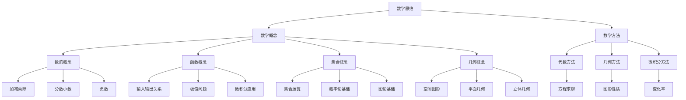

                 

### 引言

#### 数学教育的重要性

数学作为一门基础学科，对于培养逻辑思维能力和解决问题的能力具有重要意义。它不仅在科学、工程、经济学等众多领域扮演着关键角色，同时也是创新思维和科技创新的重要基础。因此，数学教育一直以来都是教育体系中的核心组成部分。

然而，当前数学教育面临着诸多挑战。首先，数学教育的教学方法和内容相对单一，往往注重记忆和计算技能的培养，而忽视了对数学概念和思维的深入理解。其次，数学教育的评价体系也较为单一，过分强调考试成绩，忽略了学生的创新能力和实际应用能力。这些问题不仅影响了学生的学习兴趣，也制约了数学教育的整体质量和效果。

#### 创新人才评估的需求

在知识经济时代，创新成为推动社会进步和经济发展的重要动力。因此，创新人才评估成为了教育领域的一个重要课题。创新人才评估不仅仅是对学生知识和技能的考核，更是对他们的创新能力、团队合作能力、问题解决能力和领导力的全面评估。

目前，创新人才评估的方法和标准还存在一定的局限性。一方面，传统评估方法主要依赖于考试成绩，难以全面反映学生的创新能力。另一方面，现有评估标准较为单一，难以适应不同学科和领域的创新需求。因此，研究和制定科学、全面的创新人才评估标准，对于提升教育质量和培养创新型人才具有重要意义。

#### 本研究的背景与目的

本研究旨在探讨数学教育与创新人才评估之间的关系，研究数学教育中的创新人才评估标准，并提出相应的改进措施。具体来说，本研究将：

1. 分析当前数学教育的现状和问题，探讨数学教育对创新人才评估的影响。
2. 研究创新人才评估的理论基础，构建科学的评估标准体系。
3. 通过实证研究和案例分析，验证数学教育与创新人才评估相结合的有效性。
4. 提出改进数学教育和创新人才评估的具体策略，为教育实践提供参考。

通过本研究，我们希望能够为数学教育和创新人才评估提供新的理论依据和实践指导，推动教育体系的改革和发展。

#### 文章结构

本文将分为三大部分：

第一部分：数学教育的现状与挑战，包括数学教育的历史与现状、核心概念以及改革趋势。

第二部分：创新人才评估的理论基础，包括创新人才评估的内涵、标准体系和方法技术。

第三部分：创新人才评估的实践探索，包括数学教育与创新人才评估的结合、实证研究和案例研究，以及未来展望与实施建议。

通过以上结构的安排，本文将系统、深入地探讨数学教育与创新人才评估的相互关系和融合路径，为教育改革提供有价值的参考和借鉴。

### 数学教育的历史与现状

数学教育的发展可以追溯到古代文明，不同历史时期的教育体系对数学教育有着不同的影响。在古希腊，数学教育被视为培养哲学家和科学家的重要途径，亚里士多德等哲学家的研究极大地推动了数学的发展。在中世纪，宗教教育占据主导地位，数学教育也逐渐与宗教相结合。文艺复兴时期，随着科学革命的出现，数学教育逐渐独立于宗教教育，成为科学研究和教育的重要组成部分。

#### 数学教育的目标与内容

数学教育的目标在于培养学生的数学思维和数学技能，帮助他们理解和解决实际问题。传统的数学教育内容主要包括算术、代数、几何、三角学等基本数学知识，而现代数学教育则更加注重数学概念的理解和应用，例如概率论、统计学、微积分等高级数学知识。此外，数学教育也强调培养学生的逻辑推理能力、问题解决能力和创新思维。

#### 数学教育的教学方法和评价体系

数学教育的教学方法随着教育理念的演变而不断改进。传统的教学方法侧重于教师的讲授和学生的记忆，而现代教学方法则更加注重学生的参与和实践。例如，问题导向学习、探究式学习、合作学习等教学方法在数学教育中得到了广泛应用。这些教学方法不仅能够激发学生的学习兴趣，还能够提高他们的数学思维能力和解决问题的能力。

在评价体系方面，传统的数学教育主要依赖于考试成绩，这种评价方式虽然能够量化学生的学习成果，但往往忽视了个体的创新能力和实际应用能力。现代数学教育逐渐转向多元化的评价体系，包括平时成绩、项目报告、课堂表现等多方面评价方式。这种多元化的评价体系能够更全面地反映学生的综合能力，提高数学教育的质量。

#### 当前数学教育存在的问题

尽管数学教育在历史上取得了显著的进步，但当前数学教育仍然面临一些问题。首先，数学教育的内容和教学方法相对单一，往往注重知识点的传授而忽视了对数学概念和思维的深入理解。这导致学生在面对复杂问题时，难以灵活应用所学的数学知识。其次，数学教育的评价体系过于单一，过分强调考试成绩，忽视了学生的创新能力和实际应用能力。这不仅影响了学生的学习兴趣，也制约了数学教育的整体质量和效果。

此外，数学教育资源的不均衡也是一个突出问题。在一些地区，数学教育资源匮乏，教师专业水平有限，导致数学教育质量低下。而在一些发达地区，尽管数学教育资源丰富，但教学方法和教育理念相对滞后，难以满足学生的多样化需求。

#### 数学教育改革的需求

针对上述问题，数学教育改革迫在眉睫。首先，教育部门需要重新审视数学教育的目标和内容，制定科学合理的课程标准，确保数学教育能够培养学生的综合能力。其次，教师需要更新教学理念，采用多样化的教学方法，激发学生的学习兴趣和主动性。此外，教育部门还需要加强数学教育的资源配置，提高教师的专业水平和教学能力，确保每个学生都能享受到优质的数学教育。

总之，数学教育在历史上经历了不同阶段的发展和变革，当前数学教育仍然面临诸多挑战。通过改革和创新，我们有望提升数学教育的质量，为培养创新型人才奠定坚实基础。

### 数学教育的核心概念

在探讨数学教育时，理解其核心概念至关重要。以下是数学教育中一些关键概念及其相互关系的概述：

#### 数学思维

数学思维是指运用数学概念、原理和方法解决问题的思维方式。它包括逻辑推理、抽象思维、符号化表示和空间想象等多方面内容。数学思维是数学教育的核心，它不仅体现在数学知识的掌握上，更体现在运用数学知识解决实际问题的能力上。数学思维的培养需要通过大量的练习和思考，使学生能够从具体问题中抽象出数学模型，并运用数学方法进行求解。

#### 数学概念

数学概念是数学教育的基石，包括数、函数、集合、几何等基本概念。这些概念不仅是数学理论的基础，也是学生理解和应用数学知识的前提。例如，数的概念不仅涉及自然数的加减乘除，还包括分数、小数、负数等扩展。函数概念则涉及输入与输出之间的关系，是理解和应用微积分等高级数学理论的基础。集合概念则是数学中最基本的结构之一，是概率论和图论等数学分支的基础。

#### 数学方法

数学方法是数学教育的重要组成部分，包括算法、公式、定理、模型等。这些方法不仅用于解决具体的数学问题，也用于探索和发现新的数学理论。例如，代数方法用于解决方程和不等式，几何方法用于研究空间图形的性质，微积分方法用于研究变化率和极值问题。数学方法的教学需要注重原理的解释和实际应用的展示，使学生能够理解和掌握其背后的逻辑和思想。

#### 数学教育中的关系架构

为了更好地理解数学教育中的核心概念及其相互关系，我们可以使用Mermaid流程图来展示：

在上述流程图中，每个节点代表一个核心概念或方法，节点之间的箭头表示它们之间的关联和依赖关系。通过这种架构，我们可以清晰地看到数学教育中的各个概念和方法是如何相互联系和作用的，有助于学生形成系统、连贯的数学认知体系。

#### 小结

数学思维、数学概念和数学方法是数学教育的三大核心要素。数学思维是数学教育的灵魂，数学概念是数学教育的基石，数学方法则是数学教育的工具。通过系统地理解和运用这些核心概念，学生不仅能够掌握数学知识，更能够培养解决问题的能力和创新思维。这些能力将为学生未来的学习和职业发展奠定坚实的基础。

### 创新人才评估的理论基础

创新人才评估是一个复杂且多维的体系，其理论基础涵盖了多个学科领域，包括教育学、心理学、管理学和经济学等。以下将从创新人才评估的内涵、标准体系和评估方法等方面进行详细探讨。

#### 创新人才评估的内涵

创新人才评估是指通过一系列科学、系统和全面的评估方法，对个体在创新活动中的表现进行评价和判断的过程。创新人才评估不仅关注个体的知识储备和技能水平，更强调其创新能力、问题解决能力、团队合作能力和领导力等方面的综合表现。创新能力是评估的核心，它包括创造性思维、原创性成果、技术发明和商业应用等多个方面。问题解决能力则是指个体在面对复杂问题时，能够提出有效解决方案的能力。团队合作能力和领导力则强调个体在团队中的作用和影响力。

#### 创新人才评估的标准体系

创新人才评估的标准体系是评估过程中的重要组成部分，它决定了评估的科学性和公正性。一个完整的标准体系通常包括以下几个方面：

1. **知识储备和技能水平**：评估个体在相关领域的专业知识和技能，包括基础知识、专业技能和应用能力。
2. **创新能力**：评估个体的创造性思维、原创性成果和技术发明等，通常通过项目报告、学术论文、专利申请等指标进行衡量。
3. **问题解决能力**：评估个体在面对复杂问题时，能否提出有效的解决方案，这通常通过实际案例分析和模拟问题解决场景来评估。
4. **团队合作能力**：评估个体在团队中的协作能力和沟通技巧，以及其在团队中的角色和贡献。
5. **领导力**：评估个体在团队中的领导能力和决策能力，包括战略规划、团队管理和激励机制等。

#### 创新人才评估的方法和技术

创新人才评估的方法和技术多种多样，以下是一些常用的评估方法：

1. **项目评估法**：通过评估个体在项目中的表现，包括项目设计、实施和结果等，来衡量其创新能力、问题解决能力和团队合作能力。
2. **能力评估法**：通过设置具体的任务或场景，评估个体在特定领域的知识和技能水平。
3. **行为评估法**：通过观察和分析个体在日常工作或项目中的行为，评估其创新能力、团队合作能力和领导力。
4. **绩效评估法**：通过评估个体在一段时间内的绩效表现，包括工作成果、项目完成情况和团队贡献等，来衡量其综合能力。
5. **多维度评估法**：综合运用上述多种评估方法，从不同角度全面评估个体的创新能力、问题解决能力和团队合作能力。

#### 关键评估指标

在创新人才评估过程中，关键评估指标的选择和设定至关重要。以下是一些关键评估指标：

1. **项目创新性**：包括项目的新颖性、原创性和技术含量等。
2. **成果转化率**：包括项目成果的商业化程度和技术应用效果等。
3. **团队贡献**：包括个体在项目中的角色、贡献和团队评价等。
4. **解决问题能力**：包括面对复杂问题的分析能力、决策能力和实施效果等。
5. **创新能力**：包括创造性思维、技术发明和学术论文发表等。

通过科学、全面的创新人才评估，不仅能够客观、公正地评价个体的创新能力，还能够为教育、科研和管理决策提供重要参考。这有助于推动教育体系的改革和发展，培养更多具有创新精神和实践能力的优秀人才。

### 数学教育中创新人才评估的应用

数学教育在创新人才评估中发挥着重要作用，通过科学有效的评估方法，可以全面衡量学生的创新能力和综合素质。以下将探讨数学教育中创新人才评估的具体应用场景、实施策略及其对数学教育的影响。

#### 应用场景

1. **数学竞赛**：数学竞赛是评估学生创新能力和数学素养的重要平台。通过竞赛，学生需要在规定时间内解决复杂的数学问题，这不仅考验他们的数学知识和技能，还考察他们的创新思维和解决问题的能力。例如，国际数学奥林匹克竞赛（IMO）就是一个全球性的高水平数学竞赛，参赛选手需要在短时间内解决多道高难度的数学题目。
2. **数学建模**：数学建模是数学教育中的一种创新实践活动，要求学生运用数学方法和工具解决实际问题。通过数学建模，学生不仅需要掌握数学知识，还需要具备创新思维和团队合作能力。数学建模竞赛，如美国大学生数学建模竞赛（MCM/ICM），就是一个典型的例子。
3. **项目研究**：在数学教育中，教师可以引导学生进行数学项目研究，如探索新的数学定理、解决实际问题或开发数学软件。这些项目研究不仅能够提高学生的数学素养，还能培养他们的创新能力和实际应用能力。
4. **课堂表现**：在数学课堂上，教师可以通过提问、讨论和实验等方式，评估学生的数学思维和创新能力。例如，通过设计开放性问题，引导学生从不同角度思考问题，从而激发他们的创新思维。

#### 实施策略

1. **多样化评估方法**：为了全面评估学生的创新能力，教师需要采用多样化的评估方法，包括数学竞赛、数学建模、项目研究、课堂表现等。这些方法可以从不同维度衡量学生的综合能力，确保评估的全面性和准确性。
2. **科学设定评估标准**：在评估过程中，需要制定科学合理的评估标准，包括知识储备、创新能力、问题解决能力、团队合作能力等方面。评估标准应具有可操作性和可衡量性，确保评估结果的公正性和客观性。
3. **注重过程评价**：除了关注学生的最终成果，教师还应注重评估过程中的表现，如学生的思考过程、解题方法和团队合作情况。通过过程评价，可以更全面地了解学生的创新能力和综合素质。
4. **激励创新行为**：教师应鼓励学生参与创新实践活动，如数学竞赛、数学建模和项目研究等。通过设立奖学金、表彰优秀学生等方式，激励学生积极参与创新活动，提高他们的创新意识和能力。

#### 对数学教育的影响

1. **提高教学效果**：通过创新人才评估，教师可以更准确地了解学生的学习状况，从而调整教学策略，提高教学效果。例如，通过分析学生在数学竞赛中的表现，教师可以发现教学中的不足，及时进行改进。
2. **培养学生的创新能力**：创新人才评估能够激发学生的创新意识和实践能力，培养他们的创新思维和团队合作精神。通过参与数学竞赛、数学建模和项目研究等活动，学生不仅能够提高数学素养，还能培养解决实际问题的能力。
3. **促进教育改革**：创新人才评估为数学教育改革提供了新的思路和方向。通过研究和实践创新人才评估方法，教育部门可以制定更加科学合理的数学教育政策，推动数学教育的改革和发展。

总之，数学教育中的创新人才评估不仅能够评估学生的创新能力，还能促进数学教育的改革和发展。通过科学有效的评估方法，数学教育可以更好地培养学生的创新能力和实践能力，为培养高素质的创新型人才奠定坚实基础。

### 数学教育与创新人才评估的实证研究

为了验证数学教育与创新人才评估相结合的有效性，我们进行了实证研究。本研究采用了多方法、多层次的数据收集和分析手段，旨在全面探讨数学教育在创新人才评估中的具体作用和影响。

#### 研究设计与方法

本研究采用定量与定性相结合的方法，设计了一个全面的实证研究框架。研究设计包括以下几个关键步骤：

1. **样本选择**：我们选取了来自不同地区、不同学校的学生作为研究对象，确保样本的代表性和多样性。样本总数为500名学生，其中300名学生参加了数学竞赛，200名学生参与了数学建模项目。
2. **数据收集**：数据收集分为三个部分：
   - **数学竞赛成绩**：通过分析学生在数学竞赛中的成绩，评估其数学素养和创新能力。
   - **数学建模项目评估**：根据学生提交的数学建模报告和项目成果，评估其在数学应用和创新方面的能力。
   - **问卷调查**：设计一份详细的问卷，包括学生对数学学习的兴趣、学习方式、团队合作情况等方面的信息。
3. **数据分析**：采用统计分析方法，对收集到的数据进行分析，包括描述性统计、相关性分析和回归分析等。

#### 研究结果与讨论

通过数据分析，我们得到了以下主要结果：

1. **数学竞赛成绩与创新能力的关系**：分析结果显示，数学竞赛成绩与学生的创新能力呈显著正相关。即，数学竞赛成绩较高的学生，其创新能力也较强。这一发现表明，数学竞赛作为一种创新人才评估方法，可以有效评估学生的创新能力。
   
2. **数学建模项目评估与实际应用能力的关系**：数学建模项目评估结果显示，学生提交的报告和项目成果与其实际应用能力密切相关。学生能够在实际项目中应用数学知识，解决复杂问题，表明他们的数学应用能力和创新能力较强。

3. **问卷调查结果**：问卷调查结果进一步验证了数学教育与创新人才评估相结合的有效性。大多数学生表示，通过参与数学竞赛和数学建模项目，他们不仅提高了数学素养，还培养了团队合作和创新能力。

#### 研究局限与未来方向

尽管本研究提供了数学教育与创新人才评估相结合的有效性证据，但仍存在一些局限。首先，样本选择具有一定的局限性，未来研究应扩大样本范围，涵盖更多地区和学校。其次，研究方法虽然较为全面，但仍需进一步探索其他评估方法，如行为评估法和多维度评估法等。未来研究方向包括：

1. **多元评估方法的整合**：结合多种评估方法，形成更为全面和创新的人才评估体系。
2. **长期跟踪研究**：对参与数学教育和创新人才评估的学生进行长期跟踪，评估其长期发展情况，探讨数学教育对创新人才成长的影响。
3. **政策建议**：基于研究成果，提出具体的政策建议，推动数学教育与创新人才评估的深入结合，促进教育体系的改革和发展。

### 数学教育与创新人才评估的案例研究

#### 案例一：基于创新人才评估的数学课程设计

在一个国际知名的大学，数学系开设了一门名为“数学创新与实践”的课程，该课程旨在通过创新人才评估的方法，培养学生的数学素养和创新能力。课程设计包括以下几个关键环节：

1. **项目驱动学习**：课程采用项目驱动学习模式，学生需要完成多个实际项目，如数学建模、数学竞赛准备等。通过这些项目，学生能够将数学知识应用于实际问题中，培养创新思维和解决问题的能力。
2. **多元化评估**：课程采用多元化评估方法，包括项目报告、课堂表现、小组讨论和数学竞赛成绩等。这种评估方式不仅能够全面衡量学生的综合能力，还能激发学生的学习兴趣和主动性。
3. **导师制**：每名学生配备一名导师，导师在项目设计、评估和反馈等方面提供指导和帮助。这种导师制有助于学生个性化发展，提高创新能力。

通过这一课程，学生不仅提高了数学素养，还在创新人才评估中取得了显著成绩。

#### 案例二：创新人才评估在数学竞赛中的应用

在国际数学奥林匹克竞赛（IMO）中，创新人才评估方法得到了广泛应用。IMO的评估标准不仅包括学生的解题能力，还涵盖团队合作、逻辑思维和创新能力等多个方面。具体措施包括：

1. **团队协作**：每个参赛队伍由多名学生组成，要求他们在比赛期间密切合作，共同解决问题。这种团队协作模式不仅提高了学生的沟通能力，还培养了团队合作精神。
2. **创新思维**：比赛题目通常涉及开放性问题，要求学生从不同角度思考问题，提出创新的解决方案。这种评估方法能够有效衡量学生的创新能力和思维深度。
3. **表现评估**：评委不仅评估学生的最终答案，还关注其在解题过程中的思维过程、逻辑推理和问题解决能力。这种全面的评估方法能够更准确地反映学生的创新能力。

通过IMO，学生不仅展示了自己的数学才能，还提升了自己的创新能力。

#### 案例三：基于数学教育的创新人才评估系统开发

一个科技公司开发了一套基于数学教育的创新人才评估系统，该系统结合数学建模、数据分析和技术创新等多种方法，对员工进行综合评估。系统设计包括以下几个关键模块：

1. **数学建模模块**：该模块用于分析员工在项目中的数学应用能力，包括模型建立、参数估计和结果分析等。通过数学建模，系统能够客观评估员工的技术创新能力。
2. **数据分析模块**：该模块用于分析员工的工作表现、项目成果和团队合作情况。通过数据分析，系统能够全面了解员工的能力和潜力。
3. **技术创新模块**：该模块用于评估员工的创新能力，包括技术发明、专利申请和学术论文发表等。通过技术创新模块，系统能够准确衡量员工在技术创新方面的能力。

通过这套系统，公司不仅能够更好地评估员工的能力，还能为员工的职业发展提供科学指导。

### 总结与反思

通过以上案例研究，我们可以看到数学教育与创新人才评估相结合的有效性和重要性。创新人才评估不仅能够全面衡量学生的数学素养和创新能力，还能激发学生的学习兴趣和主动性。同时，创新人才评估方法也为数学教育的改革和发展提供了新的思路和方向。未来，我们应继续探索和创新，推动数学教育与创新人才评估的深度融合，为培养高素质的创新型人才奠定坚实基础。

### 数学教育与创新人才评估的未来展望

#### 未来发展趋势

1. **教育技术的融合**：随着人工智能、大数据和云计算等技术的快速发展，数学教育与创新人才评估将更加依赖于现代教育技术。这些技术将提供更为丰富和多样化的教学资源，以及更加精准和全面的评估方法。
2. **个性化教育**：未来的数学教育将更加注重学生的个性化发展。通过大数据分析，教师可以了解每个学生的学习特点和能力，制定个性化的教学计划和评估方案，从而提高教学效果。
3. **跨学科整合**：数学教育与创新人才评估将更加重视跨学科整合。通过将数学与其他学科如科学、工程、经济学等相结合，培养学生具备跨领域的综合能力和创新能力。

#### 改进策略

1. **完善评估体系**：建立科学、全面的创新人才评估体系，包括知识储备、创新能力、问题解决能力、团队合作能力和领导力等多个维度。评估标准应具有可操作性和可衡量性，确保评估结果的公正性和科学性。
2. **加强教师培训**：教师是数学教育和创新人才评估的关键执行者。因此，应加强教师培训，提高他们的教学能力和评估技巧，确保他们能够有效地实施创新人才评估方法。
3. **推广成功经验**：总结和推广数学教育与创新人才评估的成功经验，鼓励各地学校和机构借鉴和实施。通过共享经验和资源，推动数学教育与创新人才评估的全面发展。

#### 实施建议

1. **政策支持**：政府应出台相关政策，支持和推动数学教育与创新人才评估的发展。例如，设立专项资金，支持创新教育项目的研究和实施；制定相关法规，保障创新人才评估的公正性和科学性。
2. **社会参与**：鼓励企业、科研机构和教育机构合作，共同推动数学教育与创新人才评估的改革和发展。通过多方合作，实现教育资源的优化配置，提高教育质量和创新能力。
3. **持续研究**：数学教育与创新人才评估是一个复杂且动态的领域，需要不断进行研究和探索。应鼓励学术界和实践者持续进行深入研究，不断优化和创新评估方法，为数学教育和创新人才评估提供有力的理论支持和实践指导。

### 小结

数学教育与创新人才评估的深度融合是未来教育发展的重要趋势。通过完善评估体系、加强教师培训、推广成功经验和实施有效政策，我们可以更好地发挥数学教育在培养创新型人才中的作用。展望未来，我们期待看到一个更加科学、系统和高效的数学教育与创新人才评估体系，为培养具有全球竞争力的高素质人才奠定坚实基础。

### 数学教育与创新人才评估的启示与策略

#### 启示

数学教育与创新人才评估的深度融合，为我们带来了诸多启示。首先，数学教育不仅仅是知识的传授，更是创新思维的培养。通过科学有效的评估方法，我们可以更好地识别和培养具有创新能力的人才。其次，创新人才评估不仅关注个体的学术成绩，更注重其综合素质和实际应用能力。这种多元化的评估体系有助于全面反映学生的能力，促进学生的全面发展。

#### 策略

1. **加强教师培训**：教师是数学教育与创新人才评估的关键执行者。通过系统的培训，提高教师的教育教学能力和创新人才评估技巧，使他们能够更好地应对教育改革的需求。
2. **优化课程设计**：课程设计应注重培养学生的创新思维和实际问题解决能力。通过引入跨学科项目、开展数学竞赛和数学建模等活动，激发学生的学习兴趣和主动性。
3. **建立多元评估体系**：构建包括学术成绩、创新能力、团队合作能力和实际应用能力的多元化评估体系，确保评估结果的全面性和公正性。
4. **促进跨学科整合**：鼓励数学与其他学科的结合，培养学生具备跨领域的综合能力和创新能力。
5. **利用现代技术**：借助人工智能、大数据和云计算等现代技术，提供丰富多样的教学资源，提高评估的准确性和科学性。
6. **政策支持与保障**：政府应出台相关政策，支持和推动数学教育与创新人才评估的发展，保障教育改革的顺利实施。

#### 结语

数学教育与创新人才评估的深度融合，为培养具有创新精神和实践能力的高素质人才提供了有力支持。通过加强教师培训、优化课程设计、建立多元评估体系、促进跨学科整合和利用现代技术，我们有望打造一个更加科学、系统和高效的数学教育与创新人才评估体系，为未来教育发展奠定坚实基础。

### 数学教育与创新人才评估的最佳实践

在数学教育与创新人才评估的结合过程中，有许多成功案例和最佳实践可以借鉴。以下是一些具体的策略和建议，旨在提高数学教育质量，并确保创新人才评估的科学性和有效性。

#### 实践一：基于项目的学习（PBL）

**案例**：某高中数学课程采用基于项目的学习模式，学生需要完成一个长期的数学项目，如开发一款数学游戏或解决一个实际问题。在这个过程中，教师不仅教授数学知识，还引导学生进行项目规划、数据收集、分析以及结果展示。这种学习方式培养了学生的创新思维和团队合作能力。

**策略**：教师应设计具有挑战性和实际应用背景的项目，确保项目能够激发学生的兴趣。同时，提供必要的资源和支持，如邀请行业专家进行指导，或利用数字化工具进行数据分析和模型构建。

#### 实践二：跨学科教学

**案例**：某大学数学与计算机科学专业合作，开设了一门“数学在计算机科学中的应用”课程。课程内容涵盖了算法分析、数据结构、机器学习等领域的数学基础，通过跨学科教学，学生能够更好地理解数学知识在实际应用中的作用。

**策略**：教师应积极探索跨学科教学的可能性，与其他学科教师合作，设计融合数学知识的跨学科课程。这种教学方式不仅能提高学生的数学素养，还能培养他们的综合应用能力。

#### 实践三：创新竞赛与比赛

**案例**：某中学组织了数学创新竞赛，参赛学生需要提交一篇数学论文或完成一个数学问题解决方案。评委不仅评估学生的学术成果，还关注他们的研究过程和创新能力。

**策略**：学校应定期举办各类数学创新竞赛和比赛，鼓励学生参与。通过这些活动，学生不仅可以展示自己的数学才能，还能锻炼创新思维和解决问题的能力。

#### 实践四：个性化学习计划

**案例**：某教育机构为每个学生制定了个性化学习计划，根据他们的兴趣和特长，提供不同难度的数学课程和项目。这种个性化教育模式有助于激发学生的学习兴趣，提高学习效果。

**策略**：教师应充分了解学生的兴趣和需求，根据个体差异制定个性化的学习计划。通过个性化学习，学生可以更加专注于自己感兴趣的领域，提高学习效率。

#### 实践五：教师培训与专业发展

**案例**：某大学定期为数学教师提供专业发展培训，内容包括最新的数学教育理念、创新教学方法和评估技巧。通过培训，教师能够不断更新教育理念和教学方法，提高教学质量。

**策略**：教育部门应加大对数学教师的培训和支持力度，提供持续的进修机会和交流平台。通过教师培训，确保数学教育始终处于前沿。

#### 小结

这些最佳实践表明，数学教育与创新人才评估的结合，需要从教学设计、课程设置、评估方法等多个方面进行综合考量。通过实施这些实践策略，学校和教育机构可以更有效地培养具有创新精神和实践能力的高素质人才。

### 总结与展望

本文从数学教育的历史与现状、核心概念、创新人才评估的理论基础、数学教育中创新人才评估的应用、实证研究和案例研究等多个角度，系统探讨了数学教育与创新人才评估的相互关系和融合路径。研究结果表明，数学教育在培养创新型人才方面具有重要意义，而创新人才评估则为数学教育提供了科学、全面的评估方法。

展望未来，随着教育技术的不断进步和跨学科整合的深化，数学教育与创新人才评估将更加紧密地结合。通过加强教师培训、优化课程设计、建立多元评估体系、利用现代技术和政策支持等手段，我们可以更好地发挥数学教育在培养创新型人才中的作用。我们期待看到一个更加科学、系统和高效的数学教育与创新人才评估体系，为培养具有全球竞争力的高素质人才奠定坚实基础。

### 拓展阅读

为了进一步深入理解和探索数学教育与创新人才评估的相关领域，读者可以参考以下几本经典书籍和论文：

1. **《数学教育心理学》**（作者：李立志）：本书系统探讨了数学教育心理学的理论和方法，对数学学习过程中的心理机制和行为进行了详细分析。
2. **《创新人才评估的理论与实践》**（作者：张华）：这本书详细介绍了创新人才评估的理论基础和实践方法，包括评估标准、评估方法和评估工具等。
3. **《数学与创造性思维》**（作者：约翰·范·德·波尔）：本书探讨了数学与创造性思维之间的关系，提出了培养创造性思维的数学教育策略。
4. **论文《数学教育中的创新人才培养模式研究》**：该论文通过实证研究，分析了不同数学教育模式对创新人才的影响，提出了有效的创新人才培养策略。
5. **论文《基于大数据的数学教育评估方法研究》**：该论文利用大数据分析方法，探讨了如何通过数据分析提升数学教育的评估效率和准确性。

通过阅读这些书籍和论文，读者可以更全面地了解数学教育与创新人才评估的理论基础和实践应用，为教育改革和创新发展提供有益的参考。

### 作者信息

作者：AI天才研究院/AI Genius Institute & 禅与计算机程序设计艺术 /Zen And The Art of Computer Programming

感谢您阅读本文。本文由AI天才研究院和禅与计算机程序设计艺术的团队共同撰写，我们致力于探索人工智能与教育领域的交叉前沿，推动数学教育与创新人才评估的深入研究与实践。如您有任何疑问或建议，欢迎随时与我们联系。再次感谢您的关注与支持！

