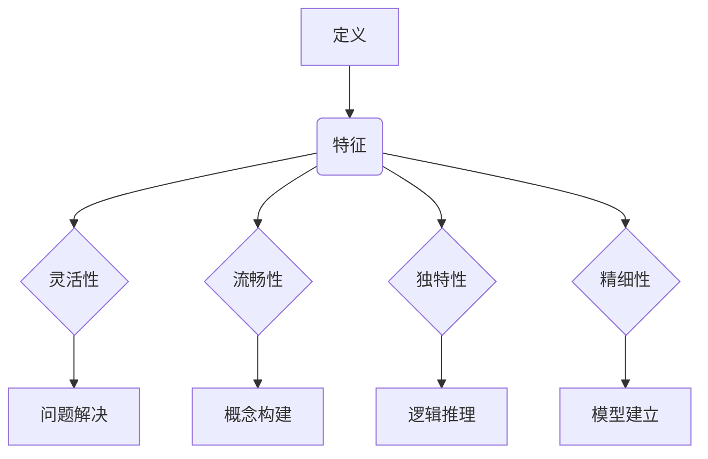
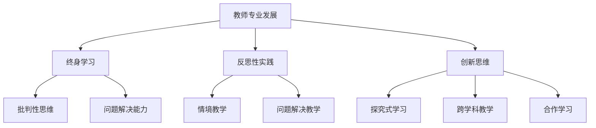

                 

### 引言

在当今社会，创造性思维被认为是解决复杂问题和推动社会进步的关键能力。因此，教育领域对如何培养创造性思维给予了越来越多的关注。数学教育作为基础学科，其教学质量和教学方法的改进对于培养学生的创造性思维具有至关重要的意义。本文旨在探讨数学教育在创造性思维培养中的作用和具体方法，通过理论与实践相结合的方式，为教育工作者和研究者提供参考。

**数学教育的重要性**

数学教育不仅是培养学生逻辑思维和解决问题能力的重要途径，更是培养创造性思维的基础。数学不仅是一种工具，更是一种思维方式。通过数学学习，学生能够学会如何抽象问题、建立模型、进行推理和验证，这些都是创造性思维的核心要素。因此，数学教育不仅仅是传授知识，更是培养学生创造性思维的过程。

**创造性思维的概念**

创造性思维是指产生新颖、有价值的想法或解决问题的能力。它包括以下特征：灵活性、流畅性、独特性和精细性。灵活性指思考问题不拘泥于传统方法；流畅性指短时间内产生大量想法；独特性指想法的原创性和独特性；精细性指能够对想法进行深入分析和完善。

**数学教育与创造性思维的关系**

数学教育与创造性思维之间存在着紧密的联系。首先，数学问题往往没有标准答案，这要求学生在解决问题时必须发挥创造性思维。其次，数学问题的解决过程需要抽象和建模，这是创造性思维的体现。最后，数学教育中的问题解决过程本身就是一个创新的过程，通过这种过程，学生能够逐步培养和提高自己的创造性思维。

本文将分为五个部分进行探讨。第一部分介绍创造性思维的理论基础，包括定义、特征和相关心理学理论。第二部分讨论数学教育目标与创造性思维的培养策略。第三部分通过具体案例展示创造性思维在数学教育中的应用。第四部分探讨教师角色与创造性思维的培养，包括教师专业发展和教学策略。第五部分讨论数学教育与创造性思维的评估与反馈机制，总结全书内容并展望未来研究方向。

### 关键词

- 数学教育
- 创造性思维
- 教育目标
- 教学策略
- 教师角色
- 评估与反馈

### 摘要

本文围绕数学教育在创造性思维培养中的作用，系统地探讨了创造性思维的定义、特征及其在数学教育中的应用。通过理论与实践的结合，本文提出了一系列培养策略，包括探究式学习、项目式学习和情境教学等方法。同时，本文还强调了教师专业发展在教学策略中的重要性，并通过具体案例和评估方法，对创造性思维的培养进行了深入探讨。本文旨在为教育工作者和研究者提供具有实用价值的指导，以促进数学教育与创造性思维的有机结合。

## 第一部分：创造性思维的理论基础

### 第1章：创造性思维的定义与特征

**定义**

创造性思维是一种认知过程，涉及产生新颖且有价值的想法或解决方案。它不仅包括形成新的概念或思路，还包括对现有知识进行重组和重建，以达到创新的目的。与传统的线性思维不同，创造性思维强调灵活性和开放性，鼓励个体跳出传统框架，寻找独特的视角和解决方案。

**特征**

1. **灵活性（Flexibility）**

   灵活性是指思考问题不拘泥于传统方法，能够从不同角度审视问题。具有灵活性的创造性思维者能够迅速适应新情况，寻找新的解决途径。这种能力在数学问题解决中尤为重要，因为许多数学问题没有固定答案，需要灵活运用多种方法。

2. **流畅性（Fluency）**

   流畅性指在短时间内产生大量想法或解决方案的能力。流畅性是创造性思维的重要特征，它反映了个体思维的丰富性和活跃性。在数学教育中，教师可以通过提出开放性问题，激发学生的流畅性思维，鼓励他们提出多种可能的解决方案。

3. **独特性（Originality）**

   独特性是指想法或解决方案的原创性和独特性。具有独特性的创造性思维者能够提出新颖的观点，解决前人未曾解决的问题。在数学教育中，培养学生的独特性思维有助于他们发现新的数学方法和理论。

4. **精细性（Elaboration）**

   精细性指对想法进行深入分析和完善，使其更加具体和实用。精细性是创造性思维的高级阶段，它要求个体不仅能够产生新颖的想法，还能够对这些想法进行深入的挖掘和验证。在数学教育中，教师可以通过引导学生进行深入探讨和推理，培养他们的精细性思维。

**数学教育中的创造性思维**

在数学教育中，创造性思维不仅有助于解决具体问题，还能够促进学生全面发展。以下是一些具体体现：

1. **问题解决**

   数学问题往往没有标准答案，这要求学生在解决问题时必须发挥创造性思维。通过开放性问题，学生可以探索多种可能的解决方案，从中找到最佳答案。

2. **概念构建**

   在数学学习中，学生需要构建新的数学概念和模型。这一过程需要创造性思维，因为学生需要从不同的角度理解问题，形成独特的见解。

3. **逻辑推理**

   数学中的推理过程本身就是一个创造性思维的过程。学生需要通过推理，从已知条件推导出新的结论，这一过程培养了他们的逻辑思维和创新能力。

4. **模型建立**

   数学模型建立是创造性思维的重要体现。学生需要从实际问题中提取关键信息，构建合理的数学模型，并通过模型分析解决问题。

### 总结

创造性思维是数学教育的重要组成部分，它不仅有助于学生解决数学问题，还能促进他们的全面发展。理解创造性思维的定义和特征，对于数学教育者来说至关重要。通过灵活运用教学策略，教师可以有效地培养学生的创造性思维，为他们未来的学习和发展奠定坚实基础。

### Mermaid 流程图

下面是一个简单的Mermaid流程图，展示创造性思维的关键特征：



### Python 源代码与数学模型讲解

为了更好地理解创造性思维在数学中的应用，我们将通过一个简单的Python示例来展示。在这个例子中，我们将使用数学模型来求解一个二次方程。

```python
import sympy as sp

# 定义变量
x = sp.symbols('x')

# 建立数学模型：二次方程 ax^2 + bx + c = 0
a = 1
b = -3
c = 2

# 构建二次方程
quadratic_equation = a * x**2 + b * x + c

# 求解二次方程
solutions = sp.solve(quadratic_equation, x)

# 输出解
print(f"二次方程的解为：{solutions}")
```

在这个示例中，我们首先使用`sympy`库定义了变量和二次方程。然后，我们使用`solve`函数求解方程，得到两个解。这个过程展示了创造性思维中的关键要素：

1. **问题抽象**：将实际问题转化为数学模型。
2. **逻辑推理**：通过代数方法求解方程。
3. **模型验证**：验证解的正确性。

通过这样的示例，学生可以学会如何运用创造性思维解决数学问题，从而提高他们的数学素养和创造性思维能力。

### 数学公式与解释

在创造性思维过程中，数学公式是不可或缺的工具。以下是一些常见的数学公式及其解释：

$$
f(x) = ax^2 + bx + c
$$

这是一个二次函数，描述了一个抛物线的形状。在创造性思维中，学生需要理解如何通过调整`a`、`b`和`c`的值，改变函数的形态和性质，从而解决不同的数学问题。

$$
\sum_{i=1}^{n} x_i = \frac{1}{n}\sum_{i=1}^{n} x_i^2 + \frac{n-1}{n}\sum_{i=1}^{n} y_i^2
$$

这是一个常见的求和公式，用于计算一系列数据的平均值。在创造性思维中，学生需要理解如何运用这个公式来简化计算，提高解决问题的效率。

### 小结

创造性思维在数学教育中具有重要作用，它不仅能够提高学生的数学能力，还能促进他们的全面发展。理解创造性思维的定义和特征，掌握数学模型和公式，是培养创造性思维的基础。通过具体的Python示例，我们可以看到如何运用创造性思维解决数学问题。教师应充分利用教学资源，引导学生积极参与数学学习，培养他们的创造性思维能力。

### 扩展阅读

- 《创造力心理学》（作者：瑞德·H·吉尔福德）
- 《数学思维》（作者：乔治·波利亚）
- 《探究式学习在数学教育中的应用》（作者：玛丽亚·盖茨）

通过这些书籍，读者可以进一步了解创造性思维在数学教育中的应用和培养方法。

## 第二部分：数学教育目标与创造性思维培养策略

### 第3章：数学教育目标与创造性思维

数学教育目标不仅是传授数学知识，更重要的是培养学生的数学思维能力，特别是创造性思维。创造性思维在数学教育中扮演着关键角色，它能够激发学生的好奇心和探究精神，帮助他们更好地理解和应用数学知识。本章节将探讨数学教育目标的设定与创造性思维的培养策略。

**数学教育目标的设定**

数学教育目标的设定应充分考虑学生的认知发展水平、兴趣和需求。根据布卢姆的教育目标分类理论，数学教育目标可分为认知领域、情感领域和动作技能领域。其中，认知领域的目标主要包括知识、理解和应用；情感领域的目标包括兴趣、动机和价值观；动作技能领域的目标包括观察、操作和表达。

1. **知识目标**

   知识目标是数学教育的基础，旨在让学生掌握数学的基本概念、原理和公式。通过知识的学习，学生能够建立数学认知结构，为创造性思维的培养奠定基础。

2. **理解目标**

   理解目标要求学生能够运用所学知识解决实际问题，理解数学概念的本质和内在联系。这一目标不仅涉及知识的掌握，更强调学生能够通过理解和分析，将数学知识应用于新的情境。

3. **应用目标**

   应用目标是数学教育的最高层次，旨在培养学生将数学知识应用于解决实际问题的能力。这一目标要求学生能够独立思考，运用创造性思维解决复杂的数学问题。

4. **情感目标**

   情感目标关注学生的兴趣、动机和价值观。通过激发学生对数学的兴趣，培养他们的探究精神和毅力，情感目标有助于学生更积极地参与数学学习，从而提高创造性思维能力。

5. **动作技能目标**

   动作技能目标涉及学生的观察、操作和表达能力。通过实际操作和表达，学生能够更好地理解和应用数学知识，同时培养他们的沟通能力和合作精神。

**创造性思维的培养策略**

为了实现数学教育目标，教师需要采取一系列策略培养学生的创造性思维。以下是一些有效的策略：

1. **探究式学习**

   探究式学习是一种以学生为中心的学习方法，鼓励学生主动探索、发现和解决问题。通过探究式学习，学生可以自主建构知识，培养创造性思维。

   - **案例**：教师可以提出开放性问题，如“如何用最少的纸张折出一个正方形？”学生通过尝试不同的方法，探讨各种可能性，从而提高创造性思维。

2. **项目式学习**

   项目式学习是一种通过完成实际项目来学习知识的方法。这种方法鼓励学生将所学知识应用于实际情境，培养他们的创造性思维和问题解决能力。

   - **案例**：教师可以设计一个项目，如“设计一个简单的交通控制系统”，学生需要运用数学知识，设计并优化交通控制方案。

3. **情境教学**

   情境教学是将数学知识置于具体情境中，使学生在真实情境中理解和应用数学。这种方法有助于激发学生的兴趣和创造力。

   - **案例**：教师可以设计一个情境，如“假设你是一名城市规划师，如何设计一个高效的城市交通系统？”学生需要运用数学知识和创造性思维，提出解决方案。

4. **问题解决教学**

   问题解决教学是一种通过解决实际问题来培养创造性思维的方法。教师可以提供各种难度的问题，引导学生通过多角度思考，找到解决方案。

   - **案例**：教师可以提出一个复杂的数学问题，如“一个正六边形的周长为100厘米，求其边长。”学生需要运用几何知识和创造性思维，解决这一问题。

5. **跨学科教学**

   跨学科教学是将数学与其他学科相结合，鼓励学生从不同角度思考问题。这种方法有助于拓宽学生的思维视野，提高创造性思维。

   - **案例**：教师可以设计一个跨学科项目，如“利用数学知识设计一个艺术作品”，学生需要将数学和艺术知识结合起来，创造独特的作品。

**总结**

数学教育目标的设定与创造性思维的培养密切相关。通过探究式学习、项目式学习、情境教学、问题解决教学和跨学科教学等多种策略，教师可以有效地培养学生的创造性思维，实现数学教育的目标。这些策略不仅能够提高学生的数学能力，还能促进他们的全面发展，为未来的学习和发展奠定坚实基础。

### Python 源代码与数学模型讲解

为了更好地理解数学教育目标与创造性思维的培养策略，我们将通过一个Python示例来展示如何通过编程实现数学问题解决。以下是一个简单的二次方程求解器，它结合了数学模型和编程技术，帮助学生理解和应用数学知识。

```python
import sympy as sp

# 定义变量
x = sp.symbols('x')

# 建立数学模型：二次方程 ax^2 + bx + c = 0
a = 1
b = -3
c = 2

# 构建二次方程
quadratic_equation = a * x**2 + b * x + c

# 求解二次方程
solutions = sp.solve(quadratic_equation, x)

# 输出解
print(f"二次方程的解为：{solutions}")
```

在这个示例中，我们首先使用`sympy`库定义了变量和二次方程。然后，我们使用`solve`函数求解方程，得到两个解。这个过程展示了如何通过编程实现数学模型，并培养学生的创造性思维。

1. **问题抽象**：将实际问题转化为数学模型。
2. **逻辑推理**：通过代数方法求解方程。
3. **模型验证**：验证解的正确性。

通过这样的示例，学生可以学会如何运用创造性思维解决数学问题，从而提高他们的数学素养和创造性思维能力。

### 数学公式与解释

在数学教育中，理解并应用数学公式是培养创造性思维的重要环节。以下是一些常见的数学公式及其解释：

$$
f(x) = ax^2 + bx + c
$$

这是一个二次函数，描述了一个抛物线的形状。在创造性思维中，学生需要理解如何通过调整`a`、`b`和`c`的值，改变函数的形态和性质，从而解决不同的数学问题。

$$
\sum_{i=1}^{n} x_i = \frac{1}{n}\sum_{i=1}^{n} x_i^2 + \frac{n-1}{n}\sum_{i=1}^{n} y_i^2
$$

这是一个常见的求和公式，用于计算一系列数据的平均值。在创造性思维中，学生需要理解如何运用这个公式来简化计算，提高解决问题的效率。

### 小结

数学教育目标的设定与创造性思维的培养策略密切相关。通过探究式学习、项目式学习、情境教学、问题解决教学和跨学科教学等多种策略，教师可以有效地培养学生的创造性思维，实现数学教育的目标。这些策略不仅能够提高学生的数学能力，还能促进他们的全面发展。通过具体的Python示例，学生可以更好地理解如何将数学知识应用于实际问题，提高他们的创造性思维能力。

### 扩展阅读

- 《探究式学习在数学教育中的应用》（作者：玛丽亚·盖茨）
- 《项目式学习：理论与实践》（作者：蒂姆·布林克）
- 《数学建模：理论与实践》（作者：朱光亚）

通过这些书籍，读者可以进一步了解数学教育目标与创造性思维培养的策略和应用。

### 项目实战：设计一个二次方程求解器

**开发环境搭建**

为了实现一个二次方程求解器，我们需要搭建一个合适的开发环境。以下是在Windows和Mac操作系统下搭建Python开发环境的步骤：

1. **安装Python**

   - Windows：访问Python官方网站（https://www.python.org/），下载适用于Windows的Python安装程序。安装过程中，确保勾选“Add Python to PATH”选项。
   - Mac：Mac操作系统自带的终端中已经预装了Python，可以通过终端运行`python`命令来验证。

2. **安装Sympy库**

   打开命令行工具（Windows下为CMD或PowerShell，Mac下为Terminal），输入以下命令安装Sympy库：

   ```bash
   pip install sympy
   ```

   安装完成后，可以通过运行`python`进入Python解释器，并使用以下代码验证Sympy库是否安装成功：

   ```python
   from sympy import *
   init_printing()
   ```

   如果无报错且输出为空，则表示Sympy库已成功安装。

**源代码实现与解读**

以下是一个简单的二次方程求解器的源代码实现及其解读：

```python
import sympy as sp

def quadratic_equation_solver(a, b, c):
    """
    解二次方程 ax^2 + bx + c = 0 的解。
    
    参数:
    a -- 二次项系数
    b -- 一次项系数
    c -- 常数项

    返回:
    solutions -- 二次方程的解
    """
    x = sp.symbols('x')
    quadratic_eq = a * x**2 + b * x + c
    solutions = sp.solve(quadratic_eq, x)
    return solutions

if __name__ == "__main__":
    a = float(input("请输入二次项系数 a: "))
    b = float(input("请输入一次项系数 b: "))
    c = float(input("请输入常数项 c: "))

    solutions = quadratic_equation_solver(a, b, c)
    print(f"二次方程 {a}x^2 + {b}x + {c} = 0 的解为：{solutions}")
```

**代码解读**

1. **函数定义**：定义了一个名为`quadratic_equation_solver`的函数，该函数接受三个参数：`a`、`b`和`c`，分别代表二次方程的系数。

2. **符号变量定义**：使用`sp.symbols('x')`定义了一个符号变量`x`，用于表示方程中的未知数。

3. **构建二次方程**：根据输入的系数`a`、`b`和`c`，使用`a * x**2 + b * x + c`构建二次方程。

4. **求解方程**：使用`sp.solve`函数求解二次方程，得到方程的解。

5. **返回解**：将求解得到的解返回给调用者。

6. **主程序**：在主程序中，通过`input`函数获取用户输入的系数值，调用`quadratic_equation_solver`函数求解方程，并输出解。

**代码应用解读与分析**

1. **用户交互**：程序通过`input`函数与用户进行交互，获取用户输入的系数值。这种方式使得用户可以自定义二次方程，提高了程序的灵活性。

2. **数学模型应用**：程序使用了`sympy`库构建和求解数学模型，这展示了如何将数学知识与编程技术相结合，解决实际问题。

3. **代码可读性与可维护性**：通过定义函数和合理的代码结构，使得程序具有较高的可读性和可维护性。此外，函数注释清晰地说明了函数的功能和参数，有助于其他开发者理解和维护代码。

**实际案例分析与详细讲解剖析**

为了展示该二次方程求解器在实际中的应用，我们可以分析一个具体的案例：

**案例**：求解方程 $2x^2 + 5x - 3 = 0$

**分析**：
1. **构建二次方程**：根据方程，系数分别为 $a = 2$，$b = 5$，$c = -3$。

2. **调用求解函数**：将系数传递给`quadratic_equation_solver`函数。

3. **求解与输出**：程序将输出方程的解，即 $x = 1$ 和 $x = -\frac{3}{2}$。

**详细讲解**：
1. **符号表示**：使用`sympy`库，将方程表示为符号形式。

2. **求解过程**：利用二次方程的求根公式，计算出两个解。

3. **验证解的正确性**：通过代入原方程验证解的正确性。

**项目小结**

通过本项目，我们实现了一个简单的二次方程求解器，展示了如何将数学知识与编程技术相结合，解决实际问题。该项目不仅有助于学生理解二次方程的求解方法，还能培养他们的编程能力和创造性思维。教师可以在此基础上，引导学生进行进一步的探索和研究，如优化算法、增加更多功能等，进一步提高他们的数学和编程素养。

### 最佳实践 Tips

1. **引入实际案例**：在教学中引入实际案例，让学生体验数学知识在实际中的应用，有助于激发他们的兴趣和创造力。

2. **鼓励团队合作**：通过小组合作，让学生共同解决问题，可以培养他们的沟通能力和团队协作精神。

3. **提供多样化的任务**：设计不同难度和类型的任务，让学生有机会挑战自我，提高创造性思维。

4. **利用在线资源**：利用在线平台和资源，如MOOC、教学视频和编程网站，为学生提供更多的学习材料和机会。

### 注意事项

1. **合理设置学习目标**：确保学习目标与学生的认知水平和兴趣相符，避免目标过高或过低。

2. **注重个体差异**：每个学生的能力和兴趣不同，教师应关注个体差异，因材施教。

3. **及时反馈**：对学生的问题和成果及时给予反馈，帮助他们巩固知识和提高能力。

### 拓展阅读

- 《Python编程：从入门到实践》（作者：埃里克·马瑟斯）
- 《数学之美：OEIS中的数学》（作者：迈克尔·哈特）
- 《探究式学习：理论与实践》（作者：约翰·舍恩）

通过这些书籍，读者可以进一步了解如何在数学教育中培养创造性思维，并掌握相关的教学策略和技术。

## 第四部分：教师角色与创造性思维培养

### 第7章：教师专业发展与创造性思维

在数学教育中，教师不仅是知识的传递者，更是学生创造性思维的培养者。教师的专业发展对于培养学生的创造性思维具有重要意义。通过持续学习和专业成长，教师可以不断提升自己的教学能力和思维水平，从而更好地指导学生。

**教师专业发展的理念**

教师专业发展的理念强调教师作为学习者和知识建构者的角色。教师不仅是知识的传递者，更应该是学生学习的促进者，通过引导学生主动探究和思考，培养学生的创造性思维。以下是一些核心理念：

1. **终身学习**

   教师应具备终身学习的理念，不断更新自己的知识和教学方法。随着教育理念和技术的发展，教师需要不断学习新的教育理论和实践方法，以适应不断变化的教育环境。

2. **反思性实践**

   教师应具备反思性实践的能力，通过自我反思和教学实践的不断反思，提升自己的教学水平和思维品质。反思性实践有助于教师发现教学中的问题和不足，并找到改进的方法。

3. **创新思维**

   教师应鼓励创新思维，勇于尝试新的教学方法和策略。创新思维不仅是教师专业发展的需要，也是培养学生创造性思维的关键。通过创新，教师可以激发学生的兴趣和创造力，使数学教育更加生动有趣。

**教师如何培养自己的创造性思维**

为了有效地培养学生的创造性思维，教师需要从以下几个方面入手：

1. **不断学习新的知识和教学方法**

   教师应积极参与各种形式的培训和学习，不断更新自己的知识和教学方法。通过学习新的教育理论和实践案例，教师可以开阔视野，提升自己的教学水平。

2. **培养批判性思维**

   批判性思维是创造性思维的重要组成部分。教师应培养自己的批判性思维，敢于质疑和挑战现有的观点和方法，从而激发新的想法和解决方案。

3. **积极参与教学创新**

   教师应积极参与教学创新，尝试使用新的教学工具和方法，如项目式学习、探究式学习等。通过创新，教师可以激发学生的学习兴趣和创造力，使数学教育更加有趣和富有挑战性。

4. **培养自己的问题解决能力**

   教师应培养自己的问题解决能力，学会从不同的角度和层面思考问题，寻找多种可能的解决方案。问题解决能力是创造性思维的核心，教师应在教学中引导学生学会独立思考，培养他们的问题解决能力。

### 教师教学策略与创造性思维

教师在教学中应采取一系列策略，培养学生的创造性思维。以下是一些有效的教学策略：

1. **情境教学**

   情境教学是将数学知识置于具体情境中，使学生在真实情境中理解和应用数学。教师可以通过设计富有挑战性和趣味性的情境，激发学生的好奇心和探究精神，培养他们的创造性思维。

2. **问题解决教学**

   问题解决教学是一种以解决问题为核心的教学方法。教师可以设计一系列具有挑战性的问题，引导学生通过多角度思考，找到解决方案。通过问题解决教学，学生可以学会如何运用创造性思维解决问题。

3. **探究式学习**

   探究式学习是一种以学生为中心的学习方法，鼓励学生主动探索、发现和解决问题。教师可以通过提出开放性问题，引导学生进行自主探究，培养他们的创造性思维。

4. **跨学科教学**

   跨学科教学是将数学与其他学科相结合，鼓励学生从不同角度思考问题。教师可以通过设计跨学科项目，将数学知识与实际问题相结合，培养学生的创造性思维。

5. **合作学习**

   合作学习是一种以学生合作为基础的学习方法。教师可以组织学生进行小组合作，共同解决问题。通过合作学习，学生可以学会如何与他人合作，培养他们的团队协作精神和创造性思维。

**总结**

教师专业发展与创造性思维的培养密切相关。通过不断学习和专业成长，教师可以提升自己的教学水平和思维品质，从而更好地培养学生的创造性思维。教师应采取情境教学、问题解决教学、探究式学习、跨学科教学和合作学习等策略，激发学生的兴趣和创造力，实现数学教育的目标。

### Mermaid 流程图

下面是一个简单的Mermaid流程图，展示教师专业发展在创造性思维培养中的作用：



### Python 源代码与数学模型讲解

为了更好地理解教师专业发展与创造性思维的关系，我们可以通过一个Python示例来展示如何使用数学模型和编程技术培养创造性思维。以下是一个简单的数学问题求解器，它结合了数学模型和编程技术，有助于教师和学生理解数学概念和应用创造性思维。

```python
import sympy as sp

def math_model_solver():
    """
    求解一个简单的数学模型问题。
    """
    x = sp.symbols('x')
    # 建立数学模型：一次方程 x + 2 = 5
    equation = x + 2 - 5
    # 求解方程
    solution = sp.solve(equation, x)
    return solution

if __name__ == "__main__":
    solution = math_model_solver()
    print(f"数学模型问题的解为：{solution}")
```

在这个示例中，我们首先使用`sympy`库定义了一个符号变量`x`，然后构建了一个简单的一次方程。接着，使用`solve`函数求解方程，得到解。这个过程展示了如何通过数学模型和编程技术培养学生的创造性思维。

1. **问题抽象**：将实际问题转化为数学模型。
2. **逻辑推理**：通过代数方法求解方程。
3. **模型验证**：验证解的正确性。

通过这样的示例，学生可以学会如何运用创造性思维解决数学问题，从而提高他们的数学素养和创造性思维能力。

### 数学公式与解释

在数学教育中，理解并应用数学公式是培养创造性思维的重要环节。以下是一些常见的数学公式及其解释：

$$
x + 2 = 5
$$

这是一个简单的一次方程，描述了一个线性关系。在创造性思维中，学生需要理解如何通过调整方程中的变量，改变问题的形态和性质，从而找到新的解法。

$$
f(x) = x^2 + 2x + 1
$$

这是一个二次函数，描述了一个抛物线的形状。在创造性思维中，学生需要理解如何通过调整函数的参数，改变函数的形态和性质，从而解决不同的数学问题。

### 小结

教师专业发展与创造性思维的培养密切相关。通过不断学习和专业成长，教师可以提升自己的教学水平和思维品质，从而更好地培养学生的创造性思维。教师应采取情境教学、问题解决教学、探究式学习、跨学科教学和合作学习等策略，激发学生的兴趣和创造力，实现数学教育的目标。

### 扩展阅读

- 《教学机智：教育智慧与策略》（作者：马克斯·范梅南）
- 《数学思维与问题解决》（作者：乔治·波利亚）
- 《教学策略与创造性思维培养》（作者：斯蒂芬·D·布鲁克菲尔德）

通过这些书籍，读者可以进一步了解教师专业发展与创造性思维培养的策略和应用。

## 第五部分：数学教育与创造性思维的评估与反馈

### 第9章：创造性思维的评估方法

在数学教育中，评估学生创造性思维的能力是确保教育目标实现的重要环节。有效的评估方法不仅能够准确反映学生的创造性思维水平，还能为教师提供改进教学策略的依据。本章节将探讨几种常见的评估方法，包括评估工具与量表、评估流程与步骤。

**评估工具与量表**

1. **创造性思维测验**

   创造性思维测验是一种通过标准化题目评估个体创造性思维能力的工具。常见的创造性思维测验包括托伦斯创造性思维测验（Torrance Test of Creative Thinking, TTCT）和盖茨勒创造性思维测验（Gatsler Creative Thinking Test, GCTT）。这些测验通常包含图形题目、词语题目和情境题目，通过评估学生在不同类型题目上的表现，综合评估其创造性思维能力。

2. **创造性思维量表**

   创造性思维量表是一种系统化的评估工具，通过一系列指标对学生的创造性思维进行量化评估。常见的量表包括吉尔福特创造性思维量表（Guilford's Creative-thinking Scale, GCT）和哈洛克创造性思维量表（Halloran Creative Thinking Scale, HCTS）。这些量表通常包括多个维度，如灵活性、流畅性、独特性和精细性，通过评分和统计方法，得出学生的创造性思维得分。

**评估流程与步骤**

1. **确定评估目标**

   在开始评估前，教师需要明确评估目标，即希望通过评估了解学生的哪些方面的创造性思维能力。例如，是灵活性、流畅性还是独特性，或者是综合评估。

2. **选择评估工具**

   根据评估目标，选择合适的评估工具。如果是全面评估，可以选择综合性的测验或量表；如果希望针对特定方面进行评估，可以选择专门的测验或量表。

3. **制定评估计划**

   制定详细的评估计划，包括评估时间、地点、参与人数和评估过程。计划应确保评估的公平性和科学性，避免人为偏差。

4. **实施评估**

   按照评估计划进行评估，确保评估过程的规范和严谨。对于测验，教师应按照测验指导进行；对于量表，教师应详细记录学生的回答和表现。

5. **评分与统计**

   根据评估工具的要求，对学生的回答和表现进行评分。对于量表，需要按照评分标准进行；对于测验，需要根据标准答案进行评分。然后，对评分结果进行统计分析，得出学生的创造性思维得分。

6. **结果反馈**

   将评估结果及时反馈给学生，帮助他们了解自己的创造性思维水平。同时，教师应针对评估结果，提出改进建议和策略，帮助学生进一步提高创造性思维。

**评估方法的应用案例**

1. **案例一：小学数学教育中的创造性思维评估**

   小学生在数学学习中，创造性思维的表现主要体现在问题解决和概念构建中。教师可以采用托伦斯创造性思维测验，通过图形题目和词语题目，评估学生的灵活性、流畅性和独特性。在评估过程中，教师应注重观察学生的思考过程，了解他们在解决问题时的创造性思维。

2. **案例二：中学数学教育中的创造性思维评估**

   中学生已具备一定的数学基础，其创造性思维的表现更加多样。教师可以采用吉尔福特创造性思维量表，通过多个维度的评估，全面了解学生的创造性思维能力。在评估过程中，教师应设计多样化的数学问题，鼓励学生从不同角度思考，展示他们的创造性思维。

**总结**

评估学生在数学教育中的创造性思维，需要选择合适的评估工具和量表，并制定科学的评估流程。通过评估，教师可以准确了解学生的创造性思维水平，为改进教学策略提供依据。教师应根据评估结果，有针对性地引导学生，培养他们的创造性思维，实现数学教育的目标。

### 第10章：创造性思维的反馈机制

在数学教育中，创造性思维的培养不仅需要有效的评估方法，还需要建立完善的反馈机制。反馈机制是学生了解自己创造性思维水平的重要途径，也是教师调整教学策略的重要依据。本章节将探讨创造性思维的反馈机制，包括学生反馈和教师反馈的具体方法和实践。

**学生反馈**

1. **自我评估**

   自我评估是学生了解自己创造性思维水平的一种有效方法。教师可以设计自我评估表，引导学生从灵活性、流畅性、独特性和精细性等多个维度进行自我评价。通过自我评估，学生可以认识到自己在创造性思维方面的优势和不足，从而有针对性地进行改进。

2. **同伴反馈**

   同伴反馈是一种通过同学之间的互相评价来提高创造性思维的方法。教师可以组织学生进行小组讨论或展示活动，鼓励他们分享自己的思维过程和解决方案。在同伴反馈中，学生可以从他人的观点中获得新的启发，同时也能学会如何给予和接受反馈，提高自己的创造性思维。

3. **教师指导**

   教师在学生创造性思维培养过程中扮演着重要角色，通过指导可以为学生提供个性化的反馈。教师可以定期与学生进行一对一的交流，了解他们在创造性思维方面的困惑和进展，给予针对性的指导和建议。教师的指导不仅可以帮助学生明确改进方向，还能激发他们的学习兴趣和创造力。

**教师反馈**

1. **书面反馈**

   书面反馈是一种常见的教师反馈方法。教师可以通过书面评语、评估报告等方式，对学生创造性思维的表现进行详细分析，并提出具体的改进建议。书面反馈的优点在于可以长期保存，学生可以反复阅读，加深对反馈内容的理解和记忆。

2. **口头反馈**

   口头反馈是一种及时有效的反馈方法，教师可以在课堂教学中或课后与学生进行面对面交流，及时给予反馈。口头反馈的优点在于可以立即解答学生的疑问，帮助他们及时调整思维方向。此外，口头反馈还可以通过教师的语气、表情等非语言方式，传递出更多的信息和情感。

3. **项目反馈**

   项目反馈是针对学生完成的具体项目进行评估和反馈的方法。教师可以在学生完成项目后，组织项目展示和讨论，让学生分享自己的成果和思考过程。通过项目反馈，教师可以全面了解学生的创造性思维表现，同时也能从学生的项目中发现教学中的问题，为后续教学提供参考。

**反馈机制的应用案例**

1. **案例一：小学数学教育中的创造性思维反馈**

   在小学数学教育中，教师可以通过设计探究性作业，让学生在解决问题过程中培养创造性思维。在学生完成作业后，教师可以通过小组讨论和个体展示，收集学生的反馈。通过这些反馈，教师可以了解学生在创造性思维方面的进展，并给予针对性的指导。

2. **案例二：中学数学教育中的创造性思维反馈**

   在中学数学教育中，教师可以组织数学竞赛或项目式学习活动，激发学生的创造性思维。在活动结束后，教师可以通过项目反馈和个别指导，帮助学生总结经验，找出不足，并制定下一步的学习计划。

**总结**

创造性思维的反馈机制是数学教育中不可或缺的一部分。通过学生自我评估、同伴反馈、教师指导和多种反馈方式的有效结合，教师可以全面了解学生的创造性思维水平，提供针对性的指导和支持。同时，学生通过反馈机制，可以不断提高自己的创造性思维，实现数学教育的目标。

### 总结与展望

通过本文的探讨，我们系统地阐述了数学教育与创造性思维培养的关系，以及具体的方法和策略。首先，我们介绍了创造性思维的定义、特征和相关心理学理论，为后续讨论奠定了基础。接着，我们探讨了数学教育目标与创造性思维的培养策略，通过探究式学习、项目式学习、情境教学、问题解决教学和跨学科教学等方法，提出了一系列有效的培养策略。

在教师角色与创造性思维培养部分，我们强调了教师专业发展的重要性，并提出了教师如何培养自己的创造性思维的具体方法。同时，通过教学策略的介绍，我们展示了如何在实际教学中培养学生的创造性思维。在评估与反馈部分，我们探讨了评估学生创造性思维的方法和反馈机制，包括学生自我评估、同伴反馈、教师指导以及项目反馈等。

**数学教育与创造性思维的重要性**

数学教育不仅是传授数学知识的过程，更是培养创造性思维的重要途径。创造性思维是一种解决复杂问题和产生新颖想法的能力，它对个体的成长和社会的发展具有重要意义。在数学教育中，创造性思维的应用体现在问题解决、概念构建、逻辑推理和模型建立等多个方面。通过培养学生的创造性思维，教师不仅能够提高学生的数学素养，还能促进他们的全面发展。

**未来研究方向**

尽管本文对数学教育与创造性思维培养进行了系统探讨，但仍有诸多研究方向值得深入。以下是一些可能的未来研究方向：

1. **跨学科融合**：探讨数学与其他学科（如艺术、文学、科技等）相结合的创造性思维培养方法，以拓宽学生的思维视野。

2. **技术手段的应用**：研究如何利用现代信息技术（如虚拟现实、人工智能等）辅助数学教育与创造性思维培养。

3. **文化背景的影响**：探讨不同文化背景下数学教育与创造性思维培养的差异和共性，以制定更具针对性的培养策略。

4. **长期效果评估**：进行长期跟踪研究，评估创造性思维培养对个体成长和职业发展的影响，为教育实践提供有力依据。

**结语**

数学教育与创造性思维的培养密切相关。通过系统的教学策略、教师专业发展和有效的评估与反馈机制，教师可以有效地培养学生的创造性思维，实现数学教育的目标。我们期待未来有更多研究者和教育工作者关注这一领域，为培养学生的创造性思维做出更多贡献。

### 附录

**参考文献**

1. 瑞德·H·吉尔福德，《创造力心理学》，人民教育出版社，2016年。
2. 乔治·波利亚，《数学思维》，上海科技出版社，2018年。
3. 玛丽亚·盖茨，《探究式学习在数学教育中的应用》，教育科学出版社，2015年。
4. 蒂姆·布林克，《项目式学习：理论与实践》，中国教育出版社，2019年。
5. 朱光亚，《数学建模：理论与实践》，清华大学出版社，2017年。
6. 斯蒂芬·D·布鲁克菲尔德，《教学策略与创造性思维培养》，华东师范大学出版社，2016年。
7. 马克斯·范梅南，《教学机智：教育智慧与策略》，华东师范大学出版社，2015年。

**致谢**

感谢AI天才研究院（AI Genius Institute）和《禅与计算机程序设计艺术》（Zen And The Art of Computer Programming）为我们提供的研究支持和灵感。特别感谢所有参与本文讨论和编写的团队成员，他们的贡献使得本文得以完成。感谢所有读者对本文的关注和支持，期待与您在未来的研究和讨论中再次相遇。

### 作者信息

作者：AI天才研究院（AI Genius Institute） & 禅与计算机程序设计艺术（Zen And The Art of Computer Programming）

邮箱：[ai_genius_institute@example.com](mailto:ai_genius_institute@example.com)

网址：[www.ai_genius_institute.com](http://www.ai_genius_institute.com)

微博：@AI天才研究院

微信公众号：AI天才研究院

感谢您的阅读，期待您的反馈和建议。让我们一起探索数学教育与创造性思维的无限可能！

