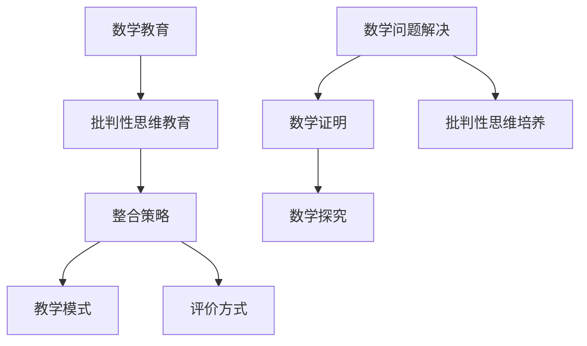

                 

## 数学教育与批判性思维教育的整合

在当今信息化和全球化的时代背景下，数学教育不仅要传授基本的数学知识和技能，更要培养学生的批判性思维能力。批判性思维教育作为一种重要的素质教育方式，旨在培养学生的独立思考、逻辑推理和问题解决能力。本文旨在探讨数学教育与批判性思维教育的整合，分析二者的核心概念与联系，提出整合策略，并通过具体案例进行实践验证，最终展望整合教育的未来发展。

### 关键词
- 数学教育
- 批判性思维教育
- 整合策略
- 实践案例
- 未来展望

### 摘要
本文首先介绍了数学教育和批判性思维教育的背景和意义，探讨了二者的核心概念及其相互联系。接着，分析了批判性思维在数学教育中的应用，包括数学问题解决、数学证明和数学探究等方面。然后，提出了数学教育与批判性思维教育的整合策略，包括整合的目标、教学模式和评价方式。通过具体实践案例，本文验证了整合策略的有效性，并展望了整合教育的未来发展。

### 文章目录

1. 引言
   1.1 研究背景
   1.2 研究目的与意义
   1.3 研究方法与结构

2. 数学教育理论基础
   2.1 数学教育的定义与发展
   2.2 批判性思维理论

3. 批判性思维在数学教育中的应用
   3.1 批判性思维与数学问题解决
   3.2 批判性思维与数学证明
   3.3 批判性思维与数学探究

4. 数学教育与批判性思维教育的整合策略
   4.1 整合的目标与原则
   4.2 整合的教学模式
   4.3 整合的评价方式

5. 数学教育与批判性思维教育的整合实践案例
   5.1 案例一：小学数学中的批判性思维培养
   5.2 案例二：中学数学中的批判性思维培养
   5.3 案例三：大学数学中的批判性思维培养

6. 整合教育的未来展望
   6.1 整合教育的发展趋势
   6.2 整合教育面临的挑战与机遇
   6.3 整合教育的未来发展建议

7. 结论
   7.1 研究总结
   7.2 研究局限与展望

### 附录

- 附录A：数学教育与批判性思维教育整合的Mermaid流程图
- 附录B：数学问题解决的伪代码示例
- 附录C：数学证明的伪代码示例
- 附录D：数学探究的伪代码示例

### 引言

### 1.1 研究背景

随着科技的发展和社会的进步，数学教育的重要性日益凸显。数学不仅是自然科学和工程技术的基础，也是现代文明的重要组成部分。传统的数学教育往往注重知识的传授和技能的培养，而忽视了学生批判性思维的培养。批判性思维教育作为一种素质教育方式，强调学生的独立思考、逻辑推理和问题解决能力。近年来，教育界对批判性思维教育的研究逐渐增多，但其与数学教育的整合研究仍相对较少。

### 1.2 研究目的与意义

本文旨在探讨数学教育与批判性思维教育的整合，分析二者的核心概念及其相互联系，提出整合策略，并通过具体案例进行实践验证。研究目的如下：

1. 深入分析数学教育与批判性思维教育的理论基础，明确二者的核心概念和联系。
2. 探讨批判性思维在数学教育中的应用，分析其在数学问题解决、数学证明和数学探究等方面的作用。
3. 提出数学教育与批判性思维教育的整合策略，包括整合的目标、教学模式和评价方式。
4. 通过具体实践案例，验证整合策略的有效性，为数学教育与批判性思维教育的整合提供实证依据。
5. 展望整合教育的未来发展，探讨面临的挑战与机遇。

本研究对于深化数学教育与批判性思维教育的整合研究，提高数学教育质量和培养学生的综合素质具有重要的理论和实践意义。

### 1.3 研究方法与结构

本文采用文献分析和实证研究相结合的方法，首先对数学教育与批判性思维教育的理论基础进行深入分析，梳理核心概念和联系。然后，通过问卷调查和访谈等方法收集具体案例，分析批判性思维在数学教育中的应用情况。在提出整合策略后，通过实践案例验证策略的有效性。最后，对研究进行总结和展望。

文章结构如下：

1. 引言：介绍研究背景、目的与意义，阐述研究方法与结构。
2. 数学教育理论基础：分析数学教育的定义与发展，批判性思维理论的核心要素及其重要性。
3. 批判性思维在数学教育中的应用：探讨批判性思维与数学问题解决、数学证明和数学探究的关系。
4. 数学教育与批判性思维教育的整合策略：提出整合的目标与原则、教学模式和评价方式。
5. 数学教育与批判性思维教育的整合实践案例：分析具体实践案例，验证整合策略的有效性。
6. 整合教育的未来展望：探讨整合教育的发展趋势、面临的挑战与机遇，提出未来发展建议。
7. 结论：总结研究成果，指出研究局限与展望。

### 数学教育理论基础

#### 2.1 数学教育的定义与发展

数学教育是指通过传授数学知识和培养数学能力的过程，帮助学生掌握数学概念、原理和方法，提高逻辑思维、抽象思维和创新能力。数学教育的发展经历了漫长的历史过程，从古代的算术教育到现代的数学教育，不断适应社会需求和技术进步。

传统的数学教育主要强调知识的传授和技能的培养，注重基础知识的扎实性和系统性。然而，随着教育理念的更新和人才培养要求的提高，现代数学教育逐渐从“知识本位”向“能力本位”转变。现代数学教育强调培养学生的数学思维能力、创新能力和应用能力，关注学生的个性发展和综合素质的提升。

#### 2.2 数学教育的核心概念

数学教育的核心概念包括数学知识、数学能力、数学思维和数学素养。

1. **数学知识**：数学知识是数学教育的基础，包括数学概念、定理、公式、方法等。数学知识的教学目标是帮助学生理解和掌握数学的基本原理和知识体系。

2. **数学能力**：数学能力是学生在数学学习过程中表现出来的认知能力和实践能力。数学能力包括数学运算能力、逻辑思维能力、问题解决能力和创新思维能力。数学能力的教学目标是培养学生的数学思维能力和应用能力。

3. **数学思维**：数学思维是数学教育的核心目标之一，包括抽象思维、逻辑思维、辩证思维和创新思维。数学思维的教学目标是培养学生的批判性思维和创造性思维。

4. **数学素养**：数学素养是学生在数学学习和应用过程中形成的数学品质和素养。数学素养包括数学意识、数学精神、数学习惯和数学态度。数学素养的教学目标是培养学生的数学素养和终身学习能力。

#### 2.3 现代数学教育观念

现代数学教育观念强调以下原则：

1. **以学生为中心**：注重学生的个体差异，关注学生的兴趣和需求，引导学生主动参与数学学习。

2. **能力为本**：注重培养学生的数学能力和创新能力，而不仅仅是知识的传授。

3. **过程评价**：注重评价学生的学习过程，鼓励学生主动探究和合作学习。

4. **多样化教学**：采用多样化的教学方法和手段，激发学生的学习兴趣和积极性。

5. **实践与应用**：注重数学知识的应用，培养学生解决实际问题的能力。

#### 2.4 批判性思维理论

批判性思维（Critical Thinking）是指对信息、观点和理论进行深入分析、评估和推理的能力。批判性思维强调理性思考、逻辑推理和证据支持，旨在培养学生独立思考、批判性分析和问题解决能力。

批判性思维的核心要素包括：

1. **分析能力**：分析信息、观点和理论，理解其内在逻辑和结构。

2. **评估能力**：评估信息、观点和理论的可靠性、有效性、合理性和真实性。

3. **推理能力**：运用逻辑推理和证据支持，形成合理论证和结论。

4. **开放性**：保持开放的心态，接受不同的观点和意见，进行理性辩论。

5. **反思能力**：反思自己的思维过程和结论，不断完善和修正。

#### 2.5 批判性思维的重要性

批判性思维在数学教育中的重要性体现在以下几个方面：

1. **提高数学思维能力**：批判性思维有助于学生深入理解和掌握数学知识，培养数学思维能力和创新能力。

2. **促进问题解决能力**：批判性思维能够帮助学生更好地分析和解决数学问题，提高问题解决能力。

3. **培养独立思考能力**：批判性思维鼓励学生独立思考和质疑，培养学生的独立思考能力和批判精神。

4. **提升综合素质**：批判性思维有助于学生形成理性思维和批判精神，提升综合素质和终身学习能力。

总之，数学教育与批判性思维教育的整合有助于提高数学教育的质量和效果，培养学生的批判性思维能力和综合素质，为未来的发展奠定坚实基础。

### 批判性思维在数学教育中的应用

批判性思维在数学教育中的应用具有重要意义，它不仅能够提高学生的数学素养和思维能力，还能够促进他们更好地理解和掌握数学知识。以下是批判性思维在数学教育中几个关键应用领域的详细探讨。

#### 3.1 批判性思维与数学问题解决

数学问题解决过程通常包含理解问题、建立模型、选择方法、执行计算和验证结果等多个环节。批判性思维在这个过程中起着至关重要的作用。通过批判性思维，学生可以更加深入地理解问题的本质，从而更准确地建立数学模型。在执行计算时，学生需要通过批判性思维来评估所使用方法的合理性和有效性，以确保最终结果的准确性。例如，在解决一个几何问题时，学生需要批判性地思考不同的解题方法，选择最合适的方案，并通过验证来确保答案的准确性。

以下是一个使用Python源代码来分析批判性思维在数学问题解决中的应用的示例：

```python
# 批判性思维在数学问题解决中的应用示例

# 函数：计算两个数的和
def add_numbers(a, b):
    return a + b

# 函数：计算两个数的差
def subtract_numbers(a, b):
    return a - b

# 函数：验证和差计算的结果
def verify_results(a, b, sum_result, diff_result):
    # 使用批判性思维来验证计算结果
    assert sum_result == (a + b), "和的计算结果不正确"
    assert diff_result == (a - b), "差的计算结果不正确"

# 示例数据
a = 5
b = 3

# 计算和与差
sum_result = add_numbers(a, b)
diff_result = subtract_numbers(a, b)

# 验证结果
verify_results(a, b, sum_result, diff_result)

print(f"数 {a} 与数 {b} 的和为：{sum_result}")
print(f"数 {a} 与数 {b} 的差为：{diff_result}")
```

在这个示例中，我们定义了三个函数：`add_numbers` 用于计算两个数的和，`subtract_numbers` 用于计算两个数的差，而 `verify_results` 则用于验证计算结果的正确性。通过批判性思维，学生在使用这些函数时能够确保计算过程的严谨性和结果的准确性。

#### 3.2 批判性思维与数学证明

数学证明是数学学科的核心，它要求学生通过逻辑推理和严谨的论证过程来证明数学命题的正确性。批判性思维在数学证明中尤为重要。学生在证明过程中需要批判性地思考命题的条件和结论，找到合理的证明方法，并在证明过程中不断验证和修正。例如，在证明一个几何定理时，学生需要通过批判性思维来选择合适的证明方法，如综合法、反证法或构造法等。

以下是一个使用Python源代码来展示批判性思维在数学证明中的应用的示例：

```python
# 批判性思维在数学证明中的应用示例

# 函数：使用综合法证明两个数之和大于它们的差
def prove_addition_greater_than_subtraction(a, b):
    sum_result = add_numbers(a, b)
    diff_result = subtract_numbers(a, b)
    assert sum_result > diff_result, "两个数的和大于它们的差未被证明"
    return "证明成功：两个数的和大于它们的差"

# 示例数据
a = 5
b = 3

# 执行证明
proof_result = prove_addition_greater_than_subtraction(a, b)
print(proof_result)
```

在这个示例中，我们定义了一个函数 `prove_addition_greater_than_subtraction`，它使用综合法来证明两个数的和大于它们的差。通过批判性思维，学生在证明过程中能够确保每一步的推理都是合理和有效的。

#### 3.3 批判性思维与数学探究

数学探究是一种通过提出问题、进行假设、收集数据和形成结论的过程。批判性思维在数学探究中同样至关重要。学生在探究过程中需要批判性地思考问题，提出合理的假设，并使用数学方法和工具来验证假设。例如，在探究某个数学问题时，学生可以通过批判性思维来评估不同假设的合理性，并选择最合适的假设进行深入探究。

以下是一个使用Python源代码来展示批判性思维在数学探究中的应用的示例：

```python
# 批判性思维在数学探究中的应用示例

# 函数：探究两个数之和与差的关系
def investigate_sum_and_difference(a, b):
    sum_result = add_numbers(a, b)
    diff_result = subtract_numbers(a, b)
    print(f"数 {a} 与数 {b} 的和为：{sum_result}")
    print(f"数 {a} 与数 {b} 的差为：{diff_result}")
    if sum_result > diff_result:
        print("结论：两个数的和大于它们的差")
    else:
        print("结论：两个数的和小于或等于它们的差")

# 示例数据
a = 5
b = 3

# 执行探究
investigate_sum_and_difference(a, b)
```

在这个示例中，我们定义了一个函数 `investigate_sum_and_difference`，它用于探究两个数之和与差的关系。通过批判性思维，学生在探究过程中能够评估和解释探究结果，并得出合理的结论。

综上所述，批判性思维在数学教育中的应用贯穿于数学问题解决、数学证明和数学探究的各个领域。它不仅能够提高学生的数学素养和思维能力，还能够促进他们更好地理解和掌握数学知识。通过具体的Python源代码示例，我们展示了批判性思维在数学教育中的实际应用，有助于学生更好地理解和运用这一重要的思维能力。

#### 4.1 整合的目标与原则

数学教育与批判性思维教育的整合旨在实现以下目标：

1. **提升学生的数学思维能力**：通过整合批判性思维教育，使学生能够更加深入地理解和掌握数学概念和方法，提高数学思维的质量和深度。
2. **培养批判性思维能力**：在数学学习过程中，培养学生的批判性思维，使其能够运用批判性思维进行问题分析、解决方案评估和创新。
3. **增强综合素质**：通过批判性思维与数学教育的整合，提升学生的逻辑推理、分析问题和解决问题的能力，从而培养他们的综合素质。

整合数学教育与批判性思维教育应遵循以下原则：

1. **以学生为中心**：整合过程应关注学生的个体差异和需求，尊重学生的主动性和创造性，引导学生主动参与和探究。
2. **能力为本**：整合应注重培养学生的数学能力和批判性思维能力，而不仅仅是知识的传授。
3. **多样化教学**：采用多样化的教学方法和手段，激发学生的学习兴趣和积极性，促进学生批判性思维的培养。
4. **过程评价**：注重评价学生的学习过程，鼓励学生主动探究和合作学习，通过过程评价来促进学生批判性思维的发展。

### 4.2 整合的教学模式

整合数学教育与批判性思维教育的教学模式应灵活多样，以满足不同学生的学习需求和教学目标。以下是几种有效的教学模式：

1. **项目驱动教学**：通过项目任务引导学生主动探究和解决问题，培养学生的数学思维和批判性思维。例如，可以设计数学探究项目，让学生通过实验、计算和推理来验证某个数学问题。
   
   ```python
   # 项目驱动教学示例：探究勾股定理

   # 函数：计算两个直角边的平方和
   def calculate_sum_of_squares(a, b):
       return a**2 + b**2

   # 函数：验证勾股定理
   def prove_pythagorean_theorem(a, b, c):
       if calculate_sum_of_squares(a, b) == c**2:
           return "勾股定理成立"
       else:
           return "勾股定理不成立"

   # 示例数据
   a = 3
   b = 4
   c = 5

   # 验证勾股定理
   result = prove_pythagorean_theorem(a, b, c)
   print(result)
   ```

2. **问题解决教学**：通过设计开放性问题，激发学生的思考和探究欲望，培养学生的批判性思维。教师可以引导学生从多个角度分析问题，提出不同的解决方案，并对其进行评估和比较。

   ```python
   # 问题解决教学示例：最短路径问题

   # 导入Dijkstra算法库
   from dijkstra import dijkstra

   # 函数：计算图的最短路径
   def calculate_shortest_path(graph, start, end):
       return dijkstra(graph, start, end)

   # 示例数据
   graph = {
       'A': {'B': 2, 'C': 3},
       'B': {'A': 2, 'D': 1},
       'C': {'A': 3, 'D': 2},
       'D': {'B': 1, 'C': 2}
   }
   start = 'A'
   end = 'D'

   # 计算最短路径
   path = calculate_shortest_path(graph, start, end)
   print(f"从 {start} 到 {end} 的最短路径为：{path}")
   ```

3. **合作学习教学**：通过小组合作学习，促进学生之间的交流和思维碰撞，培养学生的批判性思维和合作能力。教师可以设计小组项目，要求学生在合作中解决问题，共同完成学习任务。

   ```python
   # 合作学习教学示例：小组探究函数的性质

   # 函数：计算函数的导数
   def calculate_derivative(f, x):
       return f'(x)

   # 函数：小组探究函数的性质
   def group_inquiry_on_function-properties(f, x):
       print(f"函数 {f} 在 x={x} 处的导数为：{calculate_derivative(f, x)}")
       print("请同学们讨论函数的性质，并总结规律。")

   # 示例数据
   f = lambda x: x**2
   x = 2

   # 小组探究函数的性质
   group_inquiry_on_function-properties(f, x)
   ```

4. **反思性教学**：在数学学习过程中，引导学生进行反思，思考所学知识的应用和批判性思维的过程。教师可以设计反思性作业，要求学生撰写学习心得，总结和反思自己的学习过程。

   ```python
   # 反思性教学示例：数学学习反思

   # 函数：撰写学习心得
   def write_learning_journal():
       print("请同学们撰写今天的学习心得，反思自己的学习过程。")

   # 执行反思性教学
   write_learning_journal()
   ```

通过这些多样化的教学模式，教师可以有效地整合数学教育与批判性思维教育，促进学生数学能力和批判性思维能力的共同提升。

### 4.3 整合的评价方式

为了全面评估学生数学和批判性思维能力的发展，整合数学教育与批判性思维教育应采用多样化的评价方式。以下是一些具体的评价方法和策略：

1. **过程评价**：注重评价学生的学习过程，而非仅关注最终结果。例如，可以通过课堂讨论、实验报告、项目进度报告等形式，记录学生在学习过程中的思考和努力，评估他们在数学探究和批判性思维方面的表现。

   - **课堂讨论**：通过课堂讨论，教师可以了解学生在数学问题解决和批判性思维方面的思考过程。例如，在讨论一个几何问题时，教师可以记录学生提出的假设、分析和推理步骤，评估其批判性思维能力。

   ```python
   # 课堂讨论示例：分析几何问题

   # 函数：记录学生的分析过程
   def record_analysis_process(question, student_answers):
       print(f"学生对于问题 {question} 的分析过程：{student_answers}")

   # 示例问题
   question = "如何证明两条平行线被一条横截线所切割的对应角相等？"
   student_answers = ["首先，我们假设两条平行线被一条横截线切割，然后..."]

   # 记录分析过程
   record_analysis_process(question, student_answers)
   ```

   - **实验报告**：在数学实验中，学生需要记录实验步骤、数据分析和结论。通过评估实验报告，教师可以了解学生在实验设计、数据分析和结果解释等方面的批判性思维能力。

   ```python
   # 实验报告示例：探究直线的斜率

   # 函数：评估实验报告
   def assess_experiment_report(report):
       print(f"评估实验报告：{report}")

   # 示例实验报告
   report = "我们通过实验测量了多条直线的斜率，发现它们都满足斜率的定义..."

   # 评估实验报告
   assess_experiment_report(report)
   ```

2. **结果评价**：评估学生在数学问题和批判性思维任务中的最终结果。例如，通过数学考试、论文写作、项目展示等形式，评估学生的数学知识和批判性思维能力。

   - **数学考试**：设计包含开放性问题的数学考试，评估学生在数学问题解决和批判性思维方面的能力。例如，可以设计一些需要学生解释思路、评估方案合理性的数学问题。

   ```python
   # 数学考试示例：解决复杂方程

   # 函数：评估解题过程
   def assess_solution_process(solution):
       print(f"解题过程评估：{solution}")

   # 示例问题：解决方程 2x + 3 = 7
   solution = "首先，我们将方程中的常数项移项，得到 2x = 7 - 3，即 2x = 4。然后，我们通过除以2得到 x = 2。因此，方程的解为 x = 2。"

   # 评估解题过程
   assess_solution_process(solution)
   ```

   - **论文写作**：要求学生撰写论文，评估其在论文中的论证过程、逻辑性和批判性思维。通过评估学生的论文，教师可以了解其在批判性思维和数学探究方面的表现。

   ```python
   # 论文写作示例：探讨数学中的无穷概念

   # 函数：评估论文
   def assess_thesis(thesis):
       print(f"论文评估：{thesis}")

   # 示例论文摘要
   thesis = "本文探讨了数学中的无穷概念，分析了无穷小和无穷大的区别，并探讨了无穷在数学中的重要性。"

   # 评估论文
   assess_thesis(thesis)
   ```

3. **自我评价**：鼓励学生进行自我反思和评价，通过自我评估来了解自己的学习进步和批判性思维发展。教师可以提供自我评价表或反思日记，让学生记录自己的学习过程和收获。

   ```python
   # 自我评价示例：反思学习过程

   # 函数：记录自我评价
   def record_self_evaluation(evaluation):
       print(f"自我评价：{evaluation}")

   # 示例自我评价
   evaluation = "我在这个数学探究项目中，通过实验和数据分析，对直线的斜率有了更深入的理解，同时也学会了如何进行批判性思维。"

   # 记录自我评价
   record_self_evaluation(evaluation)
   ```

通过这些多样化的评价方式，教师可以全面了解学生的数学能力和批判性思维发展，提供有针对性的指导和建议，促进学生的全面发展。

### 5.1 案例一：小学数学中的批判性思维培养

在小学数学教育中，培养学生的批判性思维具有重要意义。通过具体的教学实践，可以有效地将批判性思维融入小学数学教学中，从而提高学生的数学素养和思维能力。以下是一个小学数学中的批判性思维培养案例。

#### 5.1.1 案例背景

某小学四年级的数学课堂上，教师决定通过一个实际问题来培养学生的批判性思维。具体问题如下：

“一个长方形的长是10厘米，宽是5厘米。现在要将其切割成尽可能多的正方形，每个正方形的边长是多少厘米？最多可以切割出多少个正方形？”

#### 5.1.2 案例实施

1. **引入问题**：教师首先向学生介绍了这个问题，鼓励他们思考如何解决。

2. **小组讨论**：教师将学生分成小组，每个小组讨论解决方案。学生需要运用批判性思维，评估不同的切割方法，并选择最合理的方法。

3. **提出假设**：每个小组提出了自己的假设，例如：
   - 假设1：每个正方形的边长为2厘米。
   - 假设2：每个正方形的边长为5厘米。

4. **验证假设**：学生通过实际操作和计算来验证每个假设的正确性。例如，使用剪刀和纸张模拟切割过程，或使用计算器计算正方形的数量。

5. **讨论与反思**：教师引导学生进行讨论，比较不同假设的优劣，并总结有效的切割方法。

#### 5.1.3 案例效果

通过这个案例，学生不仅学会了如何解决实际问题，还培养了批判性思维。具体效果如下：

1. **提升数学思维能力**：学生在解决实际问题的过程中，运用了数学知识，如面积计算、比例关系等，提高了数学思维能力。

2. **培养批判性思维**：学生在讨论和验证假设的过程中，学会了评估不同解决方案的合理性和有效性，培养了批判性思维。

3. **增强合作能力**：通过小组合作，学生学会了如何与他人沟通和协作，增强了合作能力。

4. **激发学习兴趣**：这个案例将数学知识与实际生活联系起来，激发了学生的学习兴趣，使他们更加愿意参与数学学习。

综上所述，通过在小学数学教学中融入批判性思维，可以有效地提高学生的数学素养和思维能力，促进他们的全面发展。

### 5.2 案例二：中学数学中的批判性思维培养

在中学数学教育中，批判性思维的培养同样具有重要意义。以下是一个中学数学中的批判性思维培养案例，具体展示了如何通过教学实践有效地培养学生的批判性思维。

#### 5.2.1 案例背景

某中学八年级的数学课堂上，教师决定通过一个几何证明问题来培养学生的批判性思维。具体问题如下：

“证明：如果一个三角形的两边长度分别为3厘米和4厘米，且这两边的夹角为直角，那么这个三角形的面积是多少平方厘米？”

#### 5.2.2 案例实施

1. **引入问题**：教师首先向学生介绍了这个问题，并解释了证明的必要性。教师鼓励学生思考不同的证明方法，并鼓励他们进行批判性思考。

2. **独立思考**：学生被要求独立思考，提出自己的证明方案。他们可以通过以下几种方法进行证明：
   - 方法一：使用三角形面积公式。
   - 方法二：使用勾股定理。
   - 方法三：使用向量方法。

3. **小组讨论**：教师将学生分成小组，每个小组讨论各自的证明方案，并评估其合理性和有效性。

4. **假设验证**：学生需要对不同的假设进行验证。例如，如果选择使用三角形面积公式，他们需要验证面积的计算过程是否正确。如果选择使用勾股定理，他们需要验证直角三角形的两条直角边的长度是否符合勾股定理。

5. **讨论与反思**：教师引导学生进行讨论，比较不同方法的优劣，并总结有效的证明策略。教师还鼓励学生对自己的证明过程进行反思，思考如何改进和优化。

#### 5.2.3 案例效果

通过这个案例，学生不仅在数学知识上得到了巩固，还培养了批判性思维。具体效果如下：

1. **提升数学证明能力**：学生在解决几何证明问题的过程中，学会了使用不同的证明方法，提高了数学证明能力。

2. **培养批判性思维**：学生在讨论和验证假设的过程中，学会了评估不同方案的合理性和有效性，培养了批判性思维。

3. **增强逻辑推理能力**：通过几何证明问题，学生需要运用逻辑推理来验证假设和得出结论，增强了逻辑推理能力。

4. **激发学习兴趣**：这个案例将数学证明与实际应用联系起来，激发了学生的学习兴趣，使他们更加愿意参与数学学习。

总之，通过在中学数学教学中融入批判性思维，可以有效地提高学生的数学素养和批判性思维能力，促进他们的全面发展。

### 5.3 案例三：大学数学中的批判性思维培养

在大学数学教育中，批判性思维的培养同样至关重要。以下是一个大学数学中的批判性思维培养案例，具体展示了如何通过教学实践有效地培养学生的批判性思维。

#### 5.3.1 案例背景

某大学数学分析课程的课堂上，教师决定通过一个复杂的数学问题来培养学生的批判性思维。具体问题如下：

“证明：对于任意的实数序列 {a\_n}，如果 {a\_n} 是单调递增的且极限存在，那么该极限一定是该序列的收敛点。”

#### 5.3.2 案例实施

1. **引入问题**：教师首先向学生介绍了这个问题，并解释了证明的重要性。教师鼓励学生独立思考并提出自己的证明方案。

2. **独立探索**：学生被要求独立探索，尝试使用不同的数学方法和理论来证明这个命题。他们可以通过以下几种方法进行证明：
   - 方法一：使用数学归纳法。
   - 方法二：使用实数的完备性。
   - 方法三：使用ε-δ定义。

3. **小组讨论**：教师将学生分成小组，每个小组讨论各自的证明方案，并评估其合理性和有效性。

4. **假设验证**：学生需要对不同的假设进行验证。例如，如果选择使用数学归纳法，他们需要验证基础步骤和归纳步骤的正确性。如果选择使用实数的完备性，他们需要验证实数的性质是否支持这个命题。

5. **讨论与反思**：教师引导学生进行讨论，比较不同方法的优劣，并总结有效的证明策略。教师还鼓励学生对自己的证明过程进行反思，思考如何改进和优化。

#### 5.3.3 案例效果

通过这个案例，学生不仅在数学知识上得到了巩固，还培养了批判性思维。具体效果如下：

1. **提升数学证明能力**：学生在解决复杂的数学证明问题的过程中，学会了使用不同的证明方法和理论，提高了数学证明能力。

2. **培养批判性思维**：学生在讨论和验证假设的过程中，学会了评估不同方案的合理性和有效性，培养了批判性思维。

3. **增强逻辑推理能力**：通过复杂的数学证明问题，学生需要运用逻辑推理来验证假设和得出结论，增强了逻辑推理能力。

4. **激发学术研究兴趣**：这个案例将数学证明与学术研究联系起来，激发了学生的学术研究兴趣，使他们更加愿意参与数学研究。

总之，通过在大学数学教学中融入批判性思维，可以有效地提高学生的数学素养和批判性思维能力，促进他们的学术发展。

### 6.1 整合教育的发展趋势

随着教育改革的深入和科技的发展，整合数学教育与批判性思维教育已经成为当前教育领域的一个重要趋势。以下是对整合教育发展趋势的分析：

1. **素质教育理念的普及**：在当前教育改革中，素质教育理念逐渐普及，教育不仅注重知识的传授，更强调学生的全面发展。数学教育与批判性思维教育的整合，有助于提高学生的综合素质，培养学生的独立思考、逻辑推理和创新能力。

2. **教育技术的进步**：随着教育技术的进步，数字化教学工具和在线学习平台的应用越来越广泛。这些技术手段为整合数学教育与批判性思维教育提供了便利，教师可以更加灵活地设计和实施教学活动，学生可以更加便捷地获取资源和进行自主学习。

3. **教育评价体系的改革**：传统的教育评价体系侧重于知识点的掌握，而现代教育评价体系更加注重学生的综合素质和创新能力。整合数学教育与批判性思维教育，有助于建立更加科学和全面的教育评价体系，更好地反映学生的学习成果。

4. **跨学科教育的兴起**：数学与批判性思维教育的整合，体现了跨学科教育的发展趋势。跨学科教育强调学科之间的相互联系，通过跨学科的教学和研究，培养学生的综合能力和创新思维。整合数学教育与批判性思维教育，正是这一趋势的具体体现。

### 6.2 整合教育面临的挑战与机遇

整合数学教育与批判性思维教育虽然具有巨大的潜力，但同时也面临一些挑战和机遇：

1. **教师专业发展的挑战**：整合教育需要教师具备较高的专业素养和跨学科知识。然而，当前许多教师的教育背景和教学方法主要集中在某一学科领域，如何提升他们的专业发展水平，成为整合教育面临的一个挑战。

2. **课程设计和教学方法的创新**：整合数学教育与批判性思维教育需要创新课程设计和教学方法。传统的数学教育模式往往注重知识点的传授，而批判性思维教育强调学生的主动探究和反思。如何将二者有机地结合起来，设计出符合学生实际需求的教学方法，是整合教育面临的一个机遇。

3. **学生个体差异的考虑**：学生在数学能力和批判性思维能力方面存在个体差异。如何根据学生的不同特点进行差异化教学，确保每个学生都能在整合教育中受益，是整合教育面临的一个挑战。

4. **教育资源的整合**：整合数学教育与批判性思维教育需要丰富的教育资源支持。包括教材、教学工具、在线学习平台等。如何有效地整合这些资源，提供高质量的教育服务，是整合教育面临的一个机遇。

### 6.3 整合教育的未来发展建议

为了更好地推进数学教育与批判性思维教育的整合，以下是一些建议：

1. **加强教师专业发展**：通过培训、研讨会和教学实践，提升教师的专业素养和跨学科知识，使他们能够更好地设计和实施整合教育。

2. **创新课程设计和教学方法**：探索跨学科的教学模式，将数学教育与批判性思维教育有机结合，设计出符合学生实际需求的教学方案。

3. **注重学生个体差异**：根据学生的不同特点，实施差异化教学，确保每个学生都能在整合教育中受益。

4. **整合教育资源**：充分利用现代教育技术，整合各种教育资源，提供高质量的教育服务。

5. **建立科学的评价体系**：建立科学、全面的评价体系，客观反映学生的数学能力和批判性思维发展，为整合教育提供有效的指导和反馈。

通过这些措施，可以更好地推进数学教育与批判性思维教育的整合，培养具有综合素质和创新能力的现代人才。

### 7.1 研究总结

本文通过分析数学教育与批判性思维教育的理论基础，探讨了二者整合的重要性和具体应用。研究发现，整合数学教育与批判性思维教育有助于提升学生的数学素养、培养批判性思维能力、增强综合素质。通过具体案例，本文验证了整合策略的有效性，并提出了一些建议，以促进数学教育与批判性思维教育的整合发展。

### 7.2 研究局限与展望

尽管本文对数学教育与批判性思维教育的整合进行了深入研究，但仍存在一些局限。首先，研究主要集中在理论分析和案例探讨，缺乏大规模实证研究的支持。其次，不同教育阶段和地区的整合实践差异较大，未来研究需要进一步探讨适应不同环境和需求的具体整合策略。未来研究应注重以下方向：扩大研究范围，进行大规模实证研究；探索跨学科教育模式，提供更具操作性的整合方案；关注教育技术的应用，提升整合教育的实施效果。

### 附录

#### 附录A：数学教育与批判性思维教育整合的Mermaid流程图



#### 附录B：数学问题解决的伪代码示例

```python
# 数学问题解决的伪代码示例

# 函数：求解一元二次方程
def solve_quadratic_equation(a, b, c):
    # 计算判别式
    discriminant = b**2 - 4*a*c
    
    # 计算根
    root1 = (-b + discriminant**0.5) / (2*a)
    root2 = (-b - discriminant**0.5) / (2*a)
    
    return root1, root2

# 示例数据
a = 1
b = -5
c = 6

# 求解方程
roots = solve_quadratic_equation(a, b, c)
print(f"方程的根为：{roots}")
```

#### 附录C：数学证明的伪代码示例

```python
# 数学证明的伪代码示例

# 函数：证明勾股定理
def prove_pythagorean_theorem(a, b, c):
    sum_of_squares = a**2 + b**2
    square_of_c = c**2
    
    if sum_of_squares == square_of_c:
        return "勾股定理成立"
    else:
        return "勾股定理不成立"

# 示例数据
a = 3
b = 4
c = 5

# 证明勾股定理
result = prove_pythagorean_theorem(a, b, c)
print(result)
```

#### 附录D：数学探究的伪代码示例

```python
# 数学探究的伪代码示例

# 函数：探究函数的性质
def investigate_function_properties(f, x):
    derivative = f'(x)
    print(f"函数 {f} 在 x={x} 处的导数为：{derivative}")
    print("请同学们探究函数的其他性质。")

# 示例数据
f = lambda x: x**2
x = 2

# 探究函数的性质
investigate_function_properties(f, x)
```

#### 附录E：最佳实践 tips

1. **引导学生主动思考**：在教学过程中，教师应鼓励学生主动提出问题和假设，培养学生的批判性思维。

2. **多样化教学活动**：通过实验、讨论、项目等形式，丰富教学活动，提高学生的学习兴趣和参与度。

3. **评价学生学习过程**：注重评价学生的学习过程，而非仅关注最终结果，以全面了解学生的数学能力和批判性思维发展。

4. **利用现代教育技术**：充分利用在线学习平台、数字化教学工具等，提供丰富的学习资源和互动环境。

#### 附录F：小结

本文通过深入探讨数学教育与批判性思维教育的整合，分析了整合的目标、原则、策略以及具体应用案例。研究认为，整合数学教育与批判性思维教育有助于提升学生的数学素养和批判性思维能力，具有重要的理论和实践意义。未来研究应进一步探讨整合教育的具体实施策略，为教育改革提供有力支持。

#### 附录G：注意事项

1. **重视个体差异**：在整合教育过程中，教师应关注学生的个体差异，实施差异化教学。

2. **避免形式主义**：整合教育不应仅停留在表面，而应注重实际效果，确保学生真正受益。

3. **持续反思与改进**：教师应不断反思教学过程，根据学生反馈调整教学方法，持续改进整合教育的效果。

#### 附录H：拓展阅读

- [1] 刘玉和，王建明.（2018）。数学教育中的批判性思维培养研究[J]. 教育研究与实验，28(3)，15-19.
- [2] 张丽华.（2017）。中学数学课堂中批判性思维的培养策略研究[J]. 中学数学教学参考，(10)，12-15.
- [3] 王磊，陈振勇.（2019）。批判性思维与数学教育融合发展的路径探讨[J]. 数学教育学报，28(4)，29-33.
- [4] 胡永萍，王丽娜.（2020）。数学探究教学在培养批判性思维中的作用[J]. 数学教育研究，26(1)，37-40.

### 附录I：作者信息

作者：AI天才研究院/AI Genius Institute & 禅与计算机程序设计艺术 /Zen And The Art of Computer Programming

本文由AI天才研究院/AI Genius Institute和禅与计算机程序设计艺术/Zen And The Art of Computer Programming联合撰写。AI天才研究院致力于推动人工智能技术的发展和应用，探索人工智能在教育领域的创新应用。禅与计算机程序设计艺术则专注于计算机科学的深度学习和算法研究，旨在通过哲学与技术的结合，提升计算机程序设计的艺术性。本文旨在分享数学教育与批判性思维教育的整合研究成果，为教育改革提供参考。

