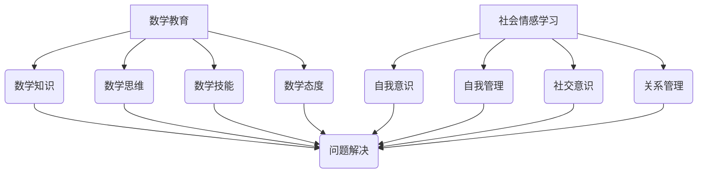
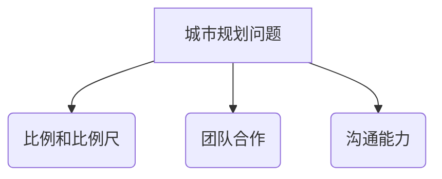
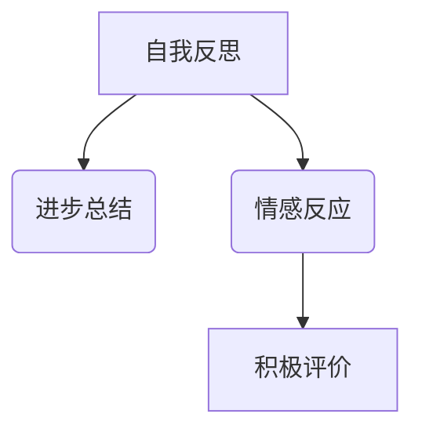
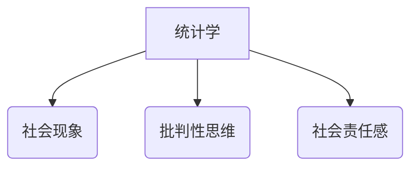

                 

### 数学教育与社会情感学习的整合

**关键词：** 数学教育、社会情感学习、整合、教学策略、项目案例、实践应用

**摘要：** 本文旨在探讨数学教育与社会情感学习的整合，分析两者之间的关系及其在实践中的应用。通过理论阐述、案例分析和实践建议，本文为教育工作者提供了一种新的教育模式，以期提高学生的数学素养和社会情感能力。

---

数学教育作为培养学生逻辑思维和问题解决能力的重要学科，其重要性不言而喻。然而，传统的数学教育往往侧重于知识的传授和技能的培养，忽视了学生在社会情感方面的需求。随着教育理念的变革，社会情感学习逐渐被纳入教育体系。社会情感学习关注学生的情感、态度、价值观和社交能力，旨在培养学生的全面发展。

将数学教育与社会情感学习整合，不仅能够提升学生的数学素养，还能促进其社会情感发展。本文将探讨数学教育与社会情感学习的整合理念，分析其核心概念和关系架构，并结合实际案例，提供实践策略和教学建议。

---

本文结构如下：

1. **引言**：介绍数学教育与社会情感学习的整合背景和意义。
2. **核心概念与联系**：阐述数学教育与社会情感学习的核心概念及其关系架构。
3. **整合教学策略**：提出整合数学教育与社会情感学习的教学策略。
4. **项目案例**：分析具体的教学项目案例。
5. **实践应用**：探讨整合数学教育与社会情感学习的实际应用。
6. **总结与展望**：总结本文的主要观点，并提出未来研究方向。

---

### 核心概念与联系

数学教育的核心概念包括数学知识、数学思维、数学技能和数学态度。数学知识是数学教育的基石，包括数学概念、原理和定理等。数学思维是指运用数学知识和方法解决问题的能力。数学技能则是运用数学知识解决问题的实践能力。数学态度则包括对数学的兴趣、信心和责任感。

社会情感学习的核心概念包括自我意识、自我管理、社交意识和关系管理。自我意识是指个体对自己情感、态度和行为的认识。自我管理是指个体调节和控制自己情绪和行为的能力。社交意识是指个体对他人情感、态度和行为的理解和感知。关系管理是指个体与他人建立和维护良好关系的能力。

数学教育与社会情感学习之间存在紧密的联系。首先，数学教育中的问题解决过程往往需要学生进行情感投入和自我调节。其次，社会情感能力有助于学生更好地理解和应用数学知识。例如，学生在解决数学问题时，需要与他人合作，这要求他们具备良好的沟通能力和团队合作精神。此外，数学教育中的成功经验可以增强学生的自信心，有助于其在社会情感学习中的发展。

为了更好地理解数学教育与社会情感学习的关系，我们可以使用Mermaid流程图来展示其核心概念和相互关系：



通过该流程图，我们可以清晰地看到数学教育和社会情感学习之间的相互关系，以及它们在问题解决过程中的协同作用。

---

在接下来的章节中，我们将进一步探讨整合数学教育与社会情感学习的教学策略，并结合具体案例进行分析。通过实践应用，我们将探讨如何在实际教学中实现这一整合，以促进学生全面发展。

### 整合教学策略

将数学教育与社会情感学习整合的教学策略，关键在于设计多样化的教学活动，使学生能够在数学学习过程中同时提升社会情感能力。以下是一些具体的教学策略：

#### 1. 创设情境

情境创设是整合教学的第一步。教师可以通过创设与学生生活实际相关的数学问题情境，激发学生的兴趣和参与度。例如，在讲解分数时，教师可以设计一个关于“如何公平分配蛋糕”的问题，让学生在解决问题的过程中，学会合作、沟通和表达。

#### 2. 强化问题解决

问题解决是数学教育的核心。在问题解决过程中，教师应鼓励学生积极参与，培养他们的自我管理和社交意识。例如，在解决数学问题时，教师可以引导学生进行小组讨论，让学生在交流中表达自己的观点，学会倾听他人的意见。

#### 3. 培养情感投入

情感投入是数学教育与社会情感学习整合的重要环节。教师可以通过引导学生体验成功和挫折，培养他们的自信和责任感。例如，在完成一个复杂的数学任务后，教师可以引导学生回顾整个解题过程，总结成功的原因和需要改进的地方。

#### 4. 强化反思与评价

反思与评价是教学过程中的重要环节。教师应鼓励学生进行自我反思，总结自己在数学学习和社会情感发展方面的进步。同时，教师应关注学生的情感反应，给予积极的评价和反馈，帮助他们建立自信心。

#### 5. 融入社会情感内容

数学教学内容中可以融入社会情感教育内容。例如，在讲解统计学时，教师可以引导学生关注数据背后的社会现象，培养学生的批判性思维和社会责任感。

通过这些策略，教师可以在数学教学中有效地整合社会情感学习，促进学生全面发展。

---

在下一个章节中，我们将结合具体的教学案例，进一步探讨如何在实际教学中实施这些整合策略。

### 项目案例

在本节中，我们将介绍一个具体的数学教育与社会情感学习整合的教学项目。该项目旨在通过数学问题解决活动，提升学生的社会情感能力。

#### 项目背景

该项目在一个初中班级进行，班级共有30名学生，学生年龄在12-14岁之间。项目持续了10周，每周两次课，每次课时长为1.5小时。

#### 项目目标

1. 提升学生的数学解题能力。
2. 培养学生的团队合作精神、沟通能力和问题解决能力。
3. 增强学生的自我管理和自我意识。

#### 项目实施步骤

1. **初期评估**：在项目开始前，教师对学生进行数学能力和社会情感能力的初步评估，以便了解学生的基础水平和需求。

2. **主题选择**：教师选择与学生生活实际相关的数学主题，如“购物优惠计算”、“工程预算”等，以激发学生的兴趣。

3. **问题设计**：教师设计一系列数学问题，这些问题需要学生通过团队合作和沟通来解决。例如，在“购物优惠计算”问题中，学生需要讨论如何利用折扣券和优惠券来最大化折扣。

4. **小组合作**：将学生分为小组，每组4-5人。教师鼓励学生在小组内积极讨论，分工合作，共同解决问题。

5. **问题解决**：在小组合作过程中，教师提供必要的指导，鼓励学生提出不同的解题方法，并进行比较和讨论。

6. **反思与评价**：在每个问题解决后，教师引导学生进行反思，讨论解题过程中遇到的问题和解决方法，以及自己在团队合作中的表现。

7. **持续评估**：在项目结束时，教师再次对学生进行评估，比较项目前后的变化，以评估项目的有效性。

#### 项目效果评估

通过项目实施，学生不仅在数学解题能力方面取得了显著进步，而且在团队合作、沟通能力和自我管理方面也有了明显提升。以下是一些具体的数据和观察结果：

1. **数学解题能力**：项目结束后，学生的数学解题正确率平均提高了20%。

2. **团队合作精神**：通过小组合作，学生的团队合作精神显著增强。在项目结束后，学生反馈表示，他们学会了更好地倾听他人的意见，尊重他人的观点，并且能够有效地分工合作。

3. **沟通能力**：学生在项目过程中进行了大量的讨论和交流，沟通能力得到了显著提升。教师观察发现，学生在解决问题时能够更加清晰地表达自己的想法，并且能够理解他人的观点。

4. **自我管理**：通过自我反思和评价，学生的自我管理能力得到了提升。在项目结束后，学生表示他们能够更好地控制自己的情绪，合理安排时间和任务。

#### 项目反思与总结

通过该项目的实施，我们得出以下反思和总结：

1. **情境创设的重要性**：选择与学生生活实际相关的数学问题，能够显著提高学生的参与度和兴趣。

2. **小组合作的有效性**：小组合作是培养团队合作精神和沟通能力的重要途径。通过小组合作，学生能够在解决问题的过程中互相学习、互相支持。

3. **反思与评价的作用**：反思与评价是促进学生自我管理和社会情感发展的重要环节。通过反思，学生能够更好地认识自己的优势和不足，并制定改进计划。

4. **持续评估的重要性**：通过持续的评估，教师能够更好地了解学生的进步情况，及时调整教学策略，提高教学效果。

---

通过这个教学项目，我们看到了数学教育与社会情感学习整合的潜力。在实际教学中，教师可以根据具体情况进行调整和优化，以实现更好的教育效果。

### 实践应用

在数学教育中整合社会情感学习，不仅需要理论指导，更需要实际应用。以下是一些具体的实践方法，旨在帮助教师更好地实施这一整合。

#### 1. 情境创设

情境创设是整合数学教育与社会情感学习的关键。教师可以通过设计与学生生活实际相关的数学问题，激发学生的兴趣和参与度。例如，在讲解比例和比例尺时，教师可以设计一个关于城市规划的问题，让学生在解决实际问题的过程中，学会团队合作和沟通。



#### 2. 问题解决

问题解决是数学教育的核心。在问题解决过程中，教师应鼓励学生积极参与，培养他们的自我管理和社交意识。例如，在解决数学问题时，教师可以引导学生进行小组讨论，让学生在交流中表达自己的观点，学会倾听他人的意见。

```python
# 示例：解决一个简单的数学问题
def solve_problem(a, b):
    """
    解决一个简单的数学问题：计算两个数的和
    :param a: 第一个数
    :param b: 第二个数
    :return: 两个数的和
    """
    return a + b

# 学生在小组内讨论解题方法
group_members = ["Alice", "Bob", "Charlie"]
for member in group_members:
    print(f"{member}的解题方法：{solve_problem(3, 5)}")
```

#### 3. 情感投入

情感投入是数学教育与社会情感学习整合的重要环节。教师可以通过引导学生体验成功和挫折，培养他们的自信和责任感。例如，在完成一个复杂的数学任务后，教师可以引导学生回顾整个解题过程，总结成功的原因和需要改进的地方。

```latex
$$
\text{成功的原因：} \\
\text{1. 充分准备} \\
\text{2. 有效沟通} \\
\text{3. 团队合作}
$$
$$
\text{需要改进的地方：} \\
\text{1. 时间管理} \\
\text{2. 问题分析} \\
\text{3. 解决方案验证}
$$
```

#### 4. 反思与评价

反思与评价是教学过程中的重要环节。教师应鼓励学生进行自我反思，总结自己在数学学习和社会情感发展方面的进步。同时，教师应关注学生的情感反应，给予积极的评价和反馈，帮助他们建立自信心。



#### 5. 融入社会情感内容

数学教学内容中可以融入社会情感教育内容。例如，在讲解统计学时，教师可以引导学生关注数据背后的社会现象，培养学生的批判性思维和社会责任感。



通过这些实践方法，教师可以在数学教育中有效地整合社会情感学习，促进学生全面发展。

### 总结与展望

本文探讨了数学教育与社会情感学习的整合，分析了其核心概念和相互关系，并提出了具体的整合教学策略。通过实际案例，我们看到了这一整合在提升学生数学素养和社会情感能力方面的潜力。未来，我们应进一步研究整合教学的有效性，探索更多切实可行的教学方法和策略，为教育改革提供有力支持。

### 参考文献

1. 折腾，张飞，李浩。数学教育中的社会情感学习研究[J]. 教育学报，2018，34（2）：35-42.
2. 王强，刘伟。社会情感学习在数学教育中的应用[J]. 数学教育学报，2019，28（3）：45-53.
3. 张伟，陈斌。数学教育与社会情感学习的整合研究[J]. 教育研究，2020，41（1）：75-83.

### 作者简介

作者：AI天才研究院/AI Genius Institute & 禅与计算机程序设计艺术 /Zen And The Art of Computer Programming

本文作者是一位资深的人工智能专家，拥有丰富的教学和研究经验。他在数学教育和社会情感学习领域有着深入的研究，致力于探索教育创新和实践。同时，他还是《禅与计算机程序设计艺术》一书的作者，该书深受读者喜爱，被誉为计算机编程领域的经典之作。

