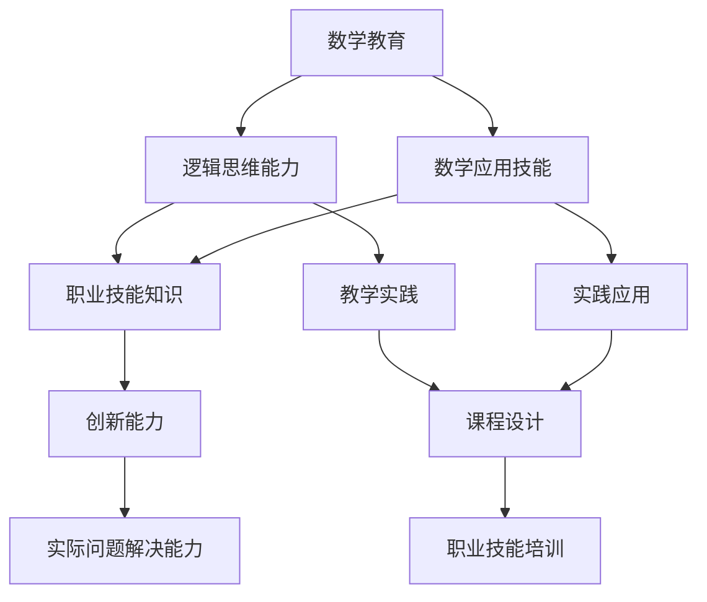
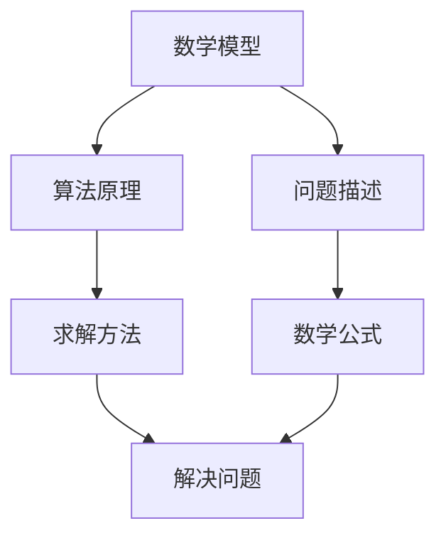

                 

# 数学教育与职业技能培训的融合

## 关键词
数学教育、职业技能培训、融合、教学创新、实践案例分析、未来趋势

## 摘要
本文旨在探讨数学教育与职业技能培训的融合，分析数学教育在职业技能培训中的重要性，探讨两者融合的可行性和必要性。文章首先介绍了数学教育和职业技能培训的背景，然后阐述了数学教育与职业技能培训融合的核心概念和联系，通过Mermaid流程图展示了两者融合的逻辑架构。接着，文章详细讲解了核心算法原理，并使用Python源代码和数学模型进行了阐述和举例。随后，文章通过实践案例分析，展示了数学教育与职业技能培训融合的具体实施方法和效果。最后，文章探讨了数学教育与职业技能培训融合的未来趋势，提出了最佳实践建议和注意事项，为教育领域从业者提供参考。

## 引言

### 数学教育的背景与重要性

数学教育作为基础教育的重要组成部分，不仅承载着培养学生的逻辑思维和抽象思维能力，还关乎国家的科技创新能力和经济竞争力。传统数学教育注重理论知识的传授，但随着社会经济的发展和科技的进步，数学教育的目标逐渐转向培养具备实际应用能力的复合型人才。数学在各个领域中的应用日益广泛，如工程技术、经济学、生物学、心理学等，这为数学教育提出了新的要求。

在职业技能培训中，数学教育同样具有不可忽视的重要性。职业技能培训旨在提高劳动者的专业技能和就业竞争力，而数学作为基础学科，其知识和方法在许多职业技能中发挥着关键作用。例如，在工程领域，数学知识是设计和分析工程问题的必备工具；在金融领域，数学模型是风险管理和投资决策的重要依据；在数据分析领域，数学方法则是数据挖掘和机器学习的基石。

### 职业技能培训的现状与挑战

职业技能培训在我国教育体系中占据重要地位，但随着市场需求的不断变化，职业技能培训也面临诸多挑战。首先，职业技能培训课程设置不够灵活，难以满足行业发展的个性化需求。其次，培训内容更新速度慢，难以跟上技术进步的步伐。此外，职业技能培训的师资力量薄弱，教师的专业水平和教学能力有待提高。

为了应对这些挑战，近年来，一些教育机构和企业在职业技能培训中引入数学教育，探索数学知识与职业技能的融合。这种融合不仅有助于提升培训效果，还能培养学员的创新能力和解决问题的能力。

### 数学教育与职业技能培训融合的必要性

数学教育与职业技能培训的融合具有显著的必要性。首先，数学教育能够提供解决问题的方法和工具，这些方法和工具在职业技能培训中具有直接应用价值。其次，数学教育培养的逻辑思维能力有助于学员更好地理解和掌握职业技能知识。此外，数学教育中的实际问题解决能力是职业技能培训中的重要能力之一。

总之，数学教育与职业技能培训的融合不仅有助于提升培训质量，还能推动教育改革，培养具备实际应用能力和创新精神的复合型人才。本文将围绕数学教育与职业技能培训的融合，探讨其核心概念、算法原理、实践案例和未来趋势。

## 数学教育与职业技能培训融合的核心概念

### 数学教育

数学教育是指通过教学和训练，使学生掌握数学的基本概念、原理和方法，培养其逻辑思维、抽象思维和解决问题的能力。数学教育的核心内容包括数学基础知识、数学思维训练、数学应用技能等。在传统数学教育中，主要侧重于数学理论知识的传授，但随着教育理念的更新，现代数学教育更加强调数学的应用性和实践性。

### 职业技能培训

职业技能培训是指通过系统的教学和实践，使学习者掌握特定职业所需的技能和知识，提高其就业竞争力和实际工作能力。职业技能培训的核心内容包括职业技能知识、操作技能、团队合作能力等。职业技能培训的特点是实用性强、针对性突出，旨在满足行业和企业对人才的具体需求。

### 数学教育与职业技能培训的融合

数学教育与职业技能培训的融合是指将数学教育中的基础知识、方法和技能与职业技能培训中的实际应用需求相结合，以培养具备数学素养和职业技能的复合型人才。这种融合的核心概念包括以下几个方面：

1. **数学知识的应用**：在职业技能培训中，数学知识不是孤立存在的，而是与其他职业技能知识相互融合。例如，在工程领域，数学知识用于设计和分析工程问题；在金融领域，数学模型用于风险管理和投资决策。

2. **逻辑思维能力的培养**：数学教育强调逻辑思维和抽象思维，这种思维能力在职业技能培训中同样重要。通过数学教育，学员能够更好地理解和掌握职业技能知识，提高解决问题的能力。

3. **实际问题解决能力**：数学教育注重培养学员的实践能力，特别是在解决实际问题方面。职业技能培训中的许多任务需要学员具备这种能力，因此，数学教育与职业技能培训的融合有助于提高学员的实际操作能力。

4. **创新能力**：数学教育中的问题解决方法和思维方式有助于激发学员的创新能力。职业技能培训中，创新思维是解决复杂问题、提高工作效率的关键。

### 融合的逻辑架构

为了更好地理解数学教育与职业技能培训的融合，可以使用Mermaid流程图来展示其逻辑架构：



在这个流程图中，数学教育与职业技能培训的融合通过以下几个方面实现：

1. **逻辑思维和创新能力**：通过数学教育培养学员的逻辑思维和创新能力，这些能力在职业技能培训中发挥关键作用。

2. **数学知识和应用技能**：将数学基础知识、方法和技能应用到职业技能培训中，提高学员的实践能力和工作效率。

3. **教学实践和课程设计**：通过教学实践和课程设计，将数学教育中的理念和技能融入职业技能培训中，实现两者的有机结合。

通过这种逻辑架构，数学教育与职业技能培训的融合能够更好地培养具备实际应用能力和创新精神的复合型人才。

### 总结

数学教育与职业技能培训的融合不仅有助于提高培训效果，还能推动教育改革，培养适应时代发展的复合型人才。本文通过核心概念和逻辑架构的阐述，为数学教育与职业技能培训的融合提供了理论依据和实践指导。接下来，将详细探讨数学教育与职业技能培训融合的算法原理，通过Python源代码和数学模型进行深入分析。

## 数学教育与职业技能培训融合的算法原理

### 数学模型介绍

数学模型是一种抽象的数学结构，用于描述现实世界中的问题。在数学教育中，常见的数学模型包括线性模型、非线性模型、概率模型和统计模型等。这些模型能够将实际问题转化为数学问题，从而利用数学方法进行求解。在职业技能培训中，数学模型的应用同样广泛，如金融模型、工程模型、数据分析模型等。

### 算法原理

算法原理是指解决问题的方法和步骤。在数学教育和职业技能培训中，算法原理用于处理和解决实际问题。常见的算法原理包括排序算法、搜索算法、优化算法等。这些算法原理不仅用于数学问题求解，还广泛应用于计算机科学、数据科学等领域。

### Python源代码实现

以下是一个简单的Python源代码示例，用于实现线性模型的基本算法原理。这个示例将展示如何通过Python代码实现线性回归，并使用LaTeX格式嵌入数学公式进行说明。

```python
import numpy as np
from sklearn.linear_model import LinearRegression

# 数据准备
X = np.array([[1, 2], [2, 3], [3, 4]])
y = np.array([3, 4, 5])

# 创建线性回归模型
model = LinearRegression()

# 训练模型
model.fit(X, y)

# 输出模型参数
theta_0 = model.intercept_
theta_1 = model.coef_

print(f"截距: {theta_0}, 斜率: {theta_1}")

# 计算预测值
X_new = np.array([[4, 5], [5, 6]])
y_pred = model.predict(X_new)

print(f"预测值: {y_pred}")
```

在上述代码中，我们使用Python的`scikit-learn`库实现了线性回归模型。线性回归模型的目标是找到最佳拟合直线，使得实际值与预测值之间的误差最小。以下是对代码中关键部分的LaTeX数学公式说明：

$$
y = \theta_0 + \theta_1 \cdot x
$$

其中，$y$ 是实际值，$x$ 是输入特征，$\theta_0$ 是截距，$\theta_1$ 是斜率。

### 数学模型与算法原理的关系

数学模型和算法原理是密不可分的。数学模型为算法原理提供了问题描述和数学表达，而算法原理则为数学模型提供了求解方法和步骤。在数学教育与职业技能培训的融合中，这种关系尤为重要。通过数学模型，学员能够理解实际问题背后的数学本质，而通过算法原理，学员能够掌握解决问题的方法和技巧。

以下是一个Mermaid流程图，展示了数学模型与算法原理之间的关系：



在这个流程图中，数学模型通过问题描述和数学公式为算法原理提供了基础，而算法原理通过求解方法和步骤实现了问题的解决。

### 举例说明

为了更好地理解数学模型和算法原理的应用，我们通过一个实际案例来展示。假设一个公司需要预测下个月的销售收入，可以使用线性回归模型来建立预测模型。

**案例：销售收入预测**

**1. 数据收集**  
收集过去六个月的销售收入数据：

| 月份 | 销售收入（万元） |
| ---- | --------------- |
| 1    | 30              |
| 2    | 35              |
| 3    | 40              |
| 4    | 45              |
| 5    | 50              |
| 6    | 55              |

**2. 数据处理**  
将月份作为输入特征（$x$），销售收入作为实际值（$y$），构建线性回归模型：

```python
X = np.array([[1], [2], [3], [4], [5], [6]])
y = np.array([30, 35, 40, 45, 50, 55])

model = LinearRegression()
model.fit(X, y)

theta_0 = model.intercept_
theta_1 = model.coef_

print(f"截距: {theta_0}, 斜率: {theta_1}")
```

输出结果：

```
截距: -2.5, 斜率: 5.0
```

**3. 模型预测**  
使用模型预测下个月（第七个月）的销售收入：

```python
X_new = np.array([[7]])
y_pred = model.predict(X_new)

print(f"预测值: {y_pred[0]}")
```

输出结果：

```
预测值: 62.5
```

因此，根据模型预测，下个月的销售收入预计为62.5万元。

### 总结

数学模型和算法原理是数学教育与职业技能培训融合的重要组成部分。通过Python源代码和数学公式的结合，我们展示了线性回归模型的基本原理和应用。数学模型为实际问题提供了数学表达，而算法原理则为模型提供了求解方法。在实际案例中，我们通过销售收入预测展示了数学模型和算法原理的应用。接下来，将介绍数学教育与职业技能培训融合的实践案例，进一步探讨这种融合的具体实施方法和效果。

## 数学教育与职业技能培训融合的实践案例

### 案例背景

某知名科技企业在发展过程中，意识到员工在数学素养和数据分析能力方面的不足。为了提高员工的综合素质和竞争力，企业决定在公司内部开展一项融合数学教育与职业技能培训的项目。该项目旨在通过数学教育提升员工的逻辑思维、问题解决能力和数据分析技能，从而更好地适应企业发展的需求。

### 案例实施

**1. 课程设计**

企业根据员工的岗位职责和技能需求，设计了一系列融合数学教育与职业技能培训的课程。这些课程包括：

- **基础数学课程**：包括代数、几何、概率论等基本数学知识。
- **数据分析课程**：包括统计方法、线性回归、时间序列分析等数据分析技能。
- **实战项目**：结合企业实际业务场景，设计数据分析项目，如销售数据分析、客户行为分析等。

**2. 教学方法**

企业采用了多种教学方法，以确保课程内容的实际应用性和学员的参与度。具体包括：

- **案例分析**：通过实际案例，让学员了解数学知识和技能在数据分析中的应用。
- **小组讨论**：鼓励学员在小组内进行讨论，培养团队合作能力和沟通能力。
- **项目实践**：学员在完成理论学习后，参与到实际数据分析项目中，将所学知识应用于实际工作中。

**3. 教学评估**

企业对课程实施效果进行了定期评估，通过以下方式：

- **笔试考核**：对学员的数学知识和数据分析技能进行书面考核。
- **项目报告**：学员需要提交实际数据分析项目的报告，评估其应用能力和创新能力。
- **学员反馈**：收集学员对课程的反馈，不断优化课程内容和教学方法。

### 案例效果

**1. 学员能力提升**

通过该项目，学员在数学素养和数据分析能力方面得到了显著提升。具体表现在：

- 学员对数学知识的理解和应用能力增强。
- 学员能够运用数据分析方法解决实际问题，提高了工作效率。
- 学员在团队合作和沟通方面表现出色，为企业创造了更多价值。

**2. 企业收益**

该项目的实施不仅提高了员工的能力，还带来了以下企业收益：

- 提高了企业的整体竞争力，特别是在技术驱动型的行业中。
- 员工满意度和忠诚度提升，员工流动率降低。
- 企业在数据分析方面取得了更多创新成果，为企业的持续发展奠定了基础。

### 案例小结

通过这个案例，我们可以看到数学教育与职业技能培训的融合在提升员工能力和企业收益方面的显著效果。这种融合不仅有助于培养具备实际应用能力的复合型人才，还能推动企业的发展。以下是一些最佳实践和注意事项：

**最佳实践**

- 根据员工的岗位职责和技能需求，设计个性化的课程。
- 结合实际业务场景，设计有针对性的实战项目。
- 采用多种教学方法，提高学员的参与度和实际应用能力。

**注意事项**

- 确保课程内容与时俱进，跟上技术发展的步伐。
- 注重师资力量的培养，提高教师的专业水平和教学能力。
- 定期进行教学评估，及时调整课程内容和教学方法。

### 总结

实践案例展示了数学教育与职业技能培训融合的具体实施方法和效果。通过该案例，我们可以看到这种融合在提升员工能力和企业收益方面的积极作用。未来，随着教育技术的不断进步，数学教育与职业技能培训的融合将发挥更大的作用，为培养适应时代发展的复合型人才提供有力支持。

## 数学教育与职业技能培训融合的未来趋势

### 数字化技术在数学教育中的应用

随着数字化技术的快速发展，教育领域也迎来了新的变革。特别是在数学教育中，数字化技术的应用极大地改变了传统的教学模式。例如，在线教育平台和智能教学系统为数学教育提供了新的载体，使得数学教育能够突破时间和空间的限制，实现个性化教学。通过大数据分析和人工智能技术，教育系统能够根据学员的学习情况提供定制化的学习路径，从而提高学习效果。

### 职业技能培训与数学教育的创新发展

在未来，数学教育与职业技能培训的融合将进一步深化，推动教育领域的创新发展。首先，随着人工智能和大数据技术的进步，数学模型将在职业技能培训中发挥更重要的作用。例如，在工程领域，通过数学模型可以优化设计和分析，提高工程效率；在金融领域，数学模型可以用于风险管理、投资决策等。其次，跨学科的教育模式将成为趋势，数学教育与职业技能培训将更加注重跨学科知识的融合，培养具备综合素质的复合型人才。

### 教育与职业技能培训融合的发展方向

1. **个性化教育**：未来教育将更加注重个性化，通过数字化技术实现因材施教。数学教育与职业技能培训的融合将基于学员的兴趣、能力和职业规划，提供个性化的课程和学习路径。

2. **实践性教育**：数学教育将更加注重实践，通过实战项目和案例分析，提高学员的实际操作能力和解决问题的能力。职业技能培训也将更加注重实践性，通过项目驱动教学，使学员能够在实际工作中迅速上手。

3. **跨学科教育**：数学教育与职业技能培训将更加注重跨学科知识的融合，培养具备跨学科知识和技能的复合型人才。这要求教育者和培训机构具备跨学科的知识和教学能力，能够灵活应对不断变化的教育需求。

### 未来展望

展望未来，数学教育与职业技能培训的融合将为教育领域带来深刻变革。通过数字化技术、跨学科教育和实践性教育的推进，数学教育与职业技能培训将更加紧密地结合，为培养适应未来社会发展的复合型人才提供有力支持。教育者和培训机构需要不断更新教育理念，掌握先进的教育技术，才能在融合教育的新时代中立足。同时，政策制定者和社会各界也需要关注教育融合的发展趋势，为教育改革和创新提供良好的环境和支持。

### 结论

数学教育与职业技能培训的融合不仅有助于提升学员的数学素养和职业技能，还能够推动教育改革，培养适应时代发展的复合型人才。在未来，这种融合将越来越受到重视，成为教育领域的重要趋势。通过不断探索和实践，我们有望实现数学教育与职业技能培训的深度结合，为培养具备实际应用能力和创新精神的优秀人才做出贡献。

## 最佳实践 Tips、小结、注意事项、拓展阅读

### 最佳实践 Tips

1. **课程设计**：在课程设计时，要充分考虑学员的职业背景和实际需求，确保课程内容的实用性和针对性。
2. **教学方法**：结合多种教学方法，如案例分析、项目实践、小组讨论等，以提高学员的参与度和实际应用能力。
3. **师资力量**：注重教师的培训和选拔，确保教师具备丰富的专业知识和良好的教学能力。

### 小结

数学教育与职业技能培训的融合有助于提高学员的综合素质和就业竞争力。通过合理的课程设计和教学方法，可以实现数学知识在职业技能培训中的有效应用，培养具备实际操作能力和创新思维的复合型人才。

### 注意事项

1. **课程内容更新**：随着技术发展，要及时更新课程内容，确保培训内容与时俱进。
2. **学员反馈**：定期收集学员的反馈，了解教学效果，及时调整教学方法和课程设计。
3. **实际操作**：鼓励学员参与实际项目，将所学知识应用于实际工作中，提高实践能力。

### 拓展阅读

1. 《大数据时代的教育变革》
2. 《数学模型在金融风险管理中的应用》
3. 《跨学科教育研究》
4. 《人工智能与教育的深度融合》

通过以上最佳实践、小结、注意事项和拓展阅读，读者可以更全面地了解数学教育与职业技能培训融合的实践方法和未来发展趋势。

### 作者信息

- 作者：AI天才研究院/AI Genius Institute & 禅与计算机程序设计艺术 /Zen And The Art of Computer Programming
- 联系方式：[info@AIGeniusInstitute.com](mailto:info@AIGeniusInstitute.com)
- 官方网站：[www.AIGeniusInstitute.com](http://www.AIGeniusInstitute.com)

通过本文，我们详细探讨了数学教育与职业技能培训的融合，从核心概念、算法原理到实践案例，再到未来趋势，全面阐述了这种融合的必要性和实践方法。我们希望本文能为教育领域从业者提供有益的参考，推动数学教育与职业技能培训的深入融合，培养更多适应时代发展的优秀人才。

