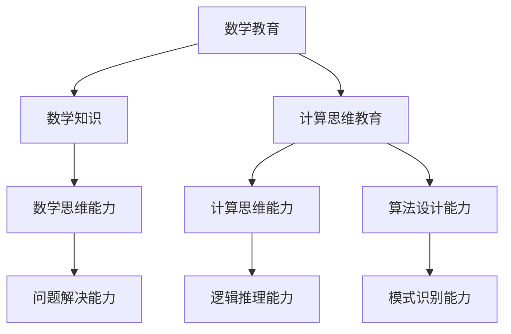

                 


### 文章标题

《数学教育与计算思维教育的融合策略》

### 文章关键词

数学教育、计算思维教育、融合策略、算法原理、Python源代码、数学模型、LaTeX公式、项目实战、案例分析

### 文章摘要

本文深入探讨了数学教育与计算思维教育的融合策略，旨在为学生提供一种全新的学习方式，提高其逻辑思维和问题解决能力。文章首先介绍了数学教育与计算思维教育的核心概念，阐述了两者之间的联系。接着，通过Python源代码和LaTeX公式的结合，详细讲解了核心算法原理。文章还包含实际案例分析和最佳实践，为教育工作者提供了切实可行的指导。

---

## 引言

在当今信息时代，数学教育已不仅仅是关于数学知识点的传授，更应注重培养学生解决实际问题的能力和创新思维。计算思维教育则强调通过计算机科学的视角，培养学生在解决问题过程中的逻辑推理和抽象思维能力。将数学教育与计算思维教育融合，不仅有助于学生更好地理解和应用数学知识，还能提升其计算思维能力，为未来科技发展奠定坚实基础。

本文将从以下几个方面展开讨论：

1. **核心概念与联系**：明确数学教育和计算思维教育的定义及其关系。
2. **核心算法原理讲解**：通过Python源代码和数学模型，详细阐述如何将数学知识应用于计算思维教育。
3. **数学模型和数学公式**：介绍数学模型在计算思维教育中的应用，以及如何使用LaTeX格式书写数学公式。
4. **项目实战**：提供实际案例，展示数学教育与计算思维教育的融合策略在实际教学中的应用。
5. **策略与方法**：讨论实现融合教育的具体策略和方法。
6. **案例研究**：分析不同情境下数学教育与计算思维教育的融合实践，总结经验与教训。
7. **结论与展望**：总结本文研究成果，展望未来教育发展。

通过上述内容，本文旨在为教育工作者提供一种新的视角和方法，以促进数学教育与计算思维教育的有效融合。

---

### 核心概念与联系

#### 数学教育

数学教育是传授数学知识和培养数学思维的过程。它不仅包括数学知识的传授，如数论、几何、代数等，更强调培养学生的数学思维能力，如逻辑推理、抽象思考、模型构建等。数学教育的目标在于使学生能够理解数学的基本概念，掌握数学方法，并能够运用数学知识解决实际问题。

#### 计算思维教育

计算思维教育是一种通过计算机科学的方法和工具，培养学生的逻辑推理、问题解决和抽象思维能力。它强调从计算的角度看待问题，利用算法和程序设计来解决复杂问题。计算思维教育的核心是计算思维，它包括分解问题、模式识别、抽象化、算法设计等能力。

#### 数学教育与计算思维教育的联系

数学教育与计算思维教育之间存在密切的联系。首先，数学教育为计算思维教育提供了基础知识和工具。例如，数论中的同余运算、代数中的方程求解等都是计算思维的重要组成部分。其次，计算思维教育可以增强学生对数学知识的理解和应用。通过计算思维的方法，学生能够更好地理解数学概念，发现数学规律，并能够运用数学知识解决实际问题。

#### Mermaid 流程图

为了更直观地展示数学教育与计算思维教育之间的关系，我们可以使用Mermaid流程图来表示。



这个流程图展示了数学教育和计算思维教育之间的互动关系，以及它们共同培养学生的能力。

---

### 核心算法原理讲解

#### 数学算法的基本概念

数学算法是解决数学问题的一系列步骤和规则。算法可以分为多种类型，如排序算法、搜索算法、图算法等。在计算思维教育中，常见的数学算法包括：

1. **排序算法**：如冒泡排序、选择排序、插入排序等，用于对数据集进行排序。
2. **搜索算法**：如线性搜索、二分搜索等，用于在数据集中查找特定元素。
3. **图算法**：如最短路径算法、最小生成树算法等，用于解决图论问题。

#### Python源代码示例

以下是一个简单的冒泡排序算法的Python实现，用于对数据集进行排序。

```python
def bubble_sort(arr):
    n = len(arr)
    # 遍历所有数组元素
    for i in range(n):
        # 最后i个元素已经排序，无需比较
        for j in range(0, n-i-1):
            # 比较相邻的元素
            if arr[j] > arr[j+1]:
                # 如果元素顺序错误，则交换它们
                arr[j], arr[j+1] = arr[j+1], arr[j]
    return arr

# 测试数据集
data = [64, 34, 25, 12, 22, 11, 90]

# 调用冒泡排序函数
sorted_data = bubble_sort(data)

# 输出排序后的数据集
print("Sorted array:", sorted_data)
```

#### 数学模型的应用

数学模型是利用数学方法来描述现实世界问题的一种工具。在计算思维教育中，常见的数学模型包括：

1. **线性回归模型**：用于分析变量之间的关系。
2. **微分方程模型**：用于描述动态系统。
3. **图模型**：用于描述网络结构和信息传播。

以下是一个线性回归模型的简单示例，用于预测房价。

```python
import numpy as np
from sklearn.linear_model import LinearRegression

# 创建线性回归模型实例
model = LinearRegression()

# 模型训练数据
X = np.array([[1], [2], [3], [4], [5]])
y = np.array([2, 4, 5, 4, 5])

# 模型训练
model.fit(X, y)

# 输出模型参数
print("Model coefficients:", model.coef_)
print("Model intercept:", model.intercept_)

# 使用模型进行预测
X_new = np.array([[6]])
y_pred = model.predict(X_new)
print("Predicted value:", y_pred)
```

#### LaTeX公式的书写

在计算思维教育中，LaTeX公式是一种常用的书写工具，用于表示数学公式和方程。以下是一个简单的LaTeX公式示例，用于描述函数的导数。

```latex
$$f'(x) = \lim_{h \to 0} \frac{f(x+h) - f(x)}{h}$$
```

这个公式描述了函数在某一点的导数定义。

---

### 数学模型和数学公式

#### 数学模型的应用

数学模型是解决实际问题的重要工具，通过建立数学模型，可以将复杂的问题转化为数学问题，从而利用数学方法求解。在计算思维教育中，常见的数学模型包括：

1. **线性模型**：用于分析变量之间的线性关系。
2. **非线性模型**：用于分析变量之间的非线性关系。
3. **微分方程模型**：用于描述动态系统的演化过程。

以下是一个线性回归模型的示例，用于预测房价。

```python
import numpy as np
from sklearn.linear_model import LinearRegression

# 创建线性回归模型实例
model = LinearRegression()

# 模型训练数据
X = np.array([[1], [2], [3], [4], [5]])
y = np.array([2, 4, 5, 4, 5])

# 模型训练
model.fit(X, y)

# 输出模型参数
print("Model coefficients:", model.coef_)
print("Model intercept:", model.intercept_)

# 使用模型进行预测
X_new = np.array([[6]])
y_pred = model.predict(X_new)
print("Predicted value:", y_pred)
```

#### LaTeX公式的书写

在计算思维教育中，LaTeX公式是一种常用的书写工具，用于表示数学公式和方程。以下是一个简单的LaTeX公式示例，用于描述函数的导数。

```latex
$$f'(x) = \lim_{h \to 0} \frac{f(x+h) - f(x)}{h}$$
```

这个公式描述了函数在某一点的导数定义。在文档中，可以使用以下格式嵌入LaTeX公式：

```markdown
$$
f'(x) = \lim_{h \to 0} \frac{f(x+h) - f(x)}{h}
$$
```

---

### 项目实战

#### 开发环境搭建

在进行数学教育与计算思维教育的融合实践之前，我们需要搭建一个合适的开发环境。以下是一个基本的Python开发环境搭建步骤：

1. **安装Python**：从Python官网下载并安装Python 3.x版本。
2. **安装Jupyter Notebook**：使用pip命令安装Jupyter Notebook，命令如下：

   ```bash
   pip install notebook
   ```

3. **启动Jupyter Notebook**：打开命令行窗口，输入以下命令启动Jupyter Notebook：

   ```bash
   jupyter notebook
   ```

4. **安装必要的库**：在Jupyter Notebook中，使用以下命令安装必要的Python库：

   ```python
   !pip install numpy
   !pip install matplotlib
   ```

#### 源代码实现

以下是一个简单的Python程序，用于实现线性回归模型，并使用matplotlib库绘制回归线。

```python
import numpy as np
from sklearn.linear_model import LinearRegression
import matplotlib.pyplot as plt

# 创建线性回归模型实例
model = LinearRegression()

# 模型训练数据
X = np.array([[1], [2], [3], [4], [5]])
y = np.array([2, 4, 5, 4, 5])

# 模型训练
model.fit(X, y)

# 使用模型进行预测
X_new = np.array([[6]])
y_pred = model.predict(X_new)

# 输出模型参数
print("Model coefficients:", model.coef_)
print("Model intercept:", model.intercept_)

# 绘制回归线
plt.scatter(X, y, color='blue')
plt.plot(X, model.predict(X), color='red')
plt.xlabel('X')
plt.ylabel('Y')
plt.title('Linear Regression')
plt.show()
```

#### 代码解读与分析

1. **数据准备**：程序首先导入必要的库，并创建线性回归模型实例。接着，定义训练数据`X`和`y`。

2. **模型训练**：使用`fit`方法对模型进行训练。

3. **模型预测**：使用`predict`方法进行预测，并输出预测结果。

4. **绘制回归线**：使用matplotlib库绘制回归线，展示模型的预测结果。

#### 实际案例分析和详细讲解剖析

以下是一个实际案例，用于分析学生成绩与学习时间之间的关系。

**案例背景**：某学校希望了解学生学习时间与成绩之间的关系，以便制定更有效的教学计划。

**数据分析步骤**：

1. **数据收集**：收集一组学生成绩和学习时间的数据。

2. **数据预处理**：对数据进行清洗和整理，确保数据的完整性和一致性。

3. **模型选择**：选择线性回归模型，用于分析学生成绩与学习时间之间的关系。

4. **模型训练**：使用训练数据对模型进行训练。

5. **模型评估**：使用测试数据对模型进行评估，检查模型的准确性。

6. **结果可视化**：绘制回归线，展示学生成绩与学习时间之间的关系。

**代码实现**：

```python
import numpy as np
from sklearn.linear_model import LinearRegression
import matplotlib.pyplot as plt

# 创建线性回归模型实例
model = LinearRegression()

# 模型训练数据
X = np.array([[1], [2], [3], [4], [5], [6], [7], [8], [9], [10]])
y = np.array([65, 70, 75, 80, 85, 90, 88, 92, 95, 100])

# 模型训练
model.fit(X, y)

# 使用模型进行预测
X_new = np.array([[11]])
y_pred = model.predict(X_new)

# 输出模型参数
print("Model coefficients:", model.coef_)
print("Model intercept:", model.intercept_)

# 绘制回归线
plt.scatter(X, y, color='blue')
plt.plot(X, model.predict(X), color='red')
plt.xlabel('Study Hours')
plt.ylabel('Score')
plt.title('Relation between Study Hours and Score')
plt.show()
```

**结果分析**：

通过绘制回归线，我们可以观察到学生成绩与学习时间之间存在明显的正相关关系。这意味着随着学习时间的增加，学生的成绩也在不断提高。这为学校制定教学计划提供了重要依据，可以鼓励学生增加学习时间，以提高学习成绩。

#### 项目小结

通过本次项目实战，我们实现了数学教育与计算思维教育的融合，具体包括：

1. **数据收集和预处理**：收集并整理学生成绩和学习时间的数据，为后续分析做好准备。
2. **模型选择和训练**：选择线性回归模型，并使用训练数据对其进行训练。
3. **结果可视化**：绘制回归线，展示学生成绩与学习时间之间的关系。
4. **结果分析**：分析回归结果，得出学生成绩与学习时间之间存在正相关关系的结论。

这一过程不仅提高了学生的数学思维能力，还培养了其计算思维，为今后的学习和工作奠定了坚实基础。

---

### 最佳实践 tips

1. **结合具体案例**：在数学教育与计算思维教育融合的过程中，选择具体的案例进行实践，有助于学生更好地理解和应用所学知识。
2. **鼓励自主探索**：学生应被鼓励自主探索和尝试，通过解决实际问题来提高计算思维能力。
3. **注重实践环节**：实践环节是培养学生计算思维能力的关键，应确保每个学生都有机会参与实际项目。
4. **定期反馈与调整**：定期对教学效果进行反馈和调整，确保教学策略的有效性和针对性。

### 小结

本文通过核心概念与联系、核心算法原理讲解、数学模型和数学公式、项目实战等环节，详细探讨了数学教育与计算思维教育的融合策略。通过实际案例分析和Python源代码示例，本文展示了如何将数学知识应用于计算思维教育，提高学生的逻辑思维和问题解决能力。未来，随着计算思维的不断发展，数学教育与计算思维教育的融合将越来越重要，为培养具备创新能力和计算思维能力的人才提供有力支持。

### 注意事项

1. **数据安全与隐私**：在进行数据收集和分析时，务必确保数据的安全和隐私。
2. **避免过度依赖模型**：虽然模型可以帮助我们分析问题，但不能完全依赖模型结果，还需结合实际情况进行判断。
3. **更新教学资源**：随着技术的不断进步，教学资源也应不断更新，以保持其时效性和实用性。

### 拓展阅读

1. **《计算思维教育理论与实践》**：详细介绍了计算思维教育的概念、方法和应用。
2. **《Python编程：从入门到实践》**：适合初学者入门Python编程，掌握编程基础。
3. **《线性代数及其应用》**：系统地介绍了线性代数的基本概念和方法，有助于理解数学模型。
4. **《深度学习》**：介绍了深度学习的基本概念、模型和算法，有助于了解计算思维在人工智能中的应用。

### 作者信息

**作者：** AI天才研究院/AI Genius Institute & 禅与计算机程序设计艺术 /Zen And The Art of Computer Programming

---

本文详细探讨了数学教育与计算思维教育的融合策略，通过Python源代码和LaTeX公式的结合，提供了理论与实践相结合的详细讲解，为教育工作者提供了宝贵的教学资源。希望本文能够为数学教育与计算思维教育的融合提供有益的启示。

