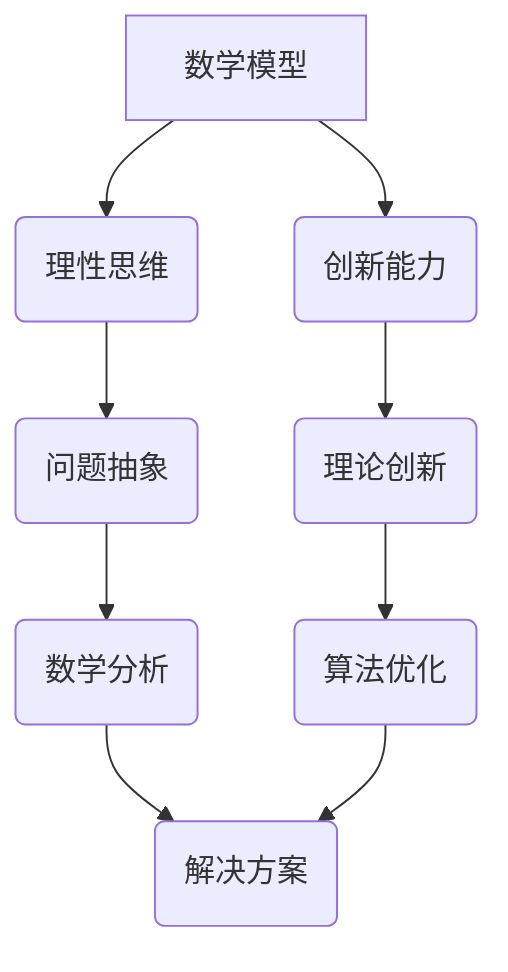

                 

# 数学教育的意义：培养理性思维与创新能力

## 关键词
- 数学教育
- 理性思维
- 创新能力
- 数学模型
- 案例分析

## 摘要
本文旨在探讨数学教育在培养理性思维和创新能力方面的深远意义。通过深入分析数学教育的核心概念、原理及其在现实世界中的应用，本文揭示了数学教育如何通过逻辑推理、数学建模等方法，促进学生理性思维的发展，并激发他们的创新能力。文章还结合具体案例，详细阐述了数学教育在信息技术、工程、科学等领域的实践应用，为读者提供了一个全面、系统的数学教育理解框架。

## 目录

1. **背景介绍**
   - 数学教育的起源与发展
   - 数学教育在现代社会中的重要性

2. **核心概念与联系**
   - 理性思维的内涵与特点
   - 创新能力的定义与培养
   - 数学模型与理性思维、创新能力的关系

3. **核心算法原理讲解**
   - 逻辑推理与数学建模
   - Python源代码实现与分析

4. **项目实战**
   - 开发环境搭建
   - 源代码详细实现与解读
   - 代码应用解读与分析

5. **数学公式与模型的应用**
   - LaTeX数学公式
   - 数学模型在案例中的应用

6. **案例分析**
   - 成功数学教育案例
   - 创新能力的实际应用

7. **最佳实践 tips**
   - 教学方法与策略
   - 注意事项与拓展阅读

8. **小结**
   - 数学教育的意义与未来展望

## 1. 背景介绍

### 数学教育的起源与发展

数学教育作为一种培养人类理性思维和解决问题能力的重要手段，有着悠久的历史。早在古希腊时期，数学教育就已经开始萌芽。苏格拉底、柏拉图和亚里士多德等哲学家对数学教育有着深刻的见解，他们将数学视为培养理性思维和探究真理的重要途径。在古希腊，数学教育主要集中在几何学、天文学和音乐理论等领域。

随着时间的推移，数学教育逐渐发展并普及到世界各地。在中世纪，阿拉伯世界对数学教育的贡献尤为显著，他们翻译了大量的古希腊数学著作，并在此基础上进行了创新和发展。在文艺复兴时期，欧洲数学教育开始逐渐重视实用性和逻辑推理。

### 数学教育在现代社会中的重要性

在现代社会，数学教育的重要性愈发突出。首先，数学作为一种基础学科，为各种科学技术的发展提供了强有力的支持。无论是物理学、化学、生物学，还是工程学、经济学，数学都是不可或缺的工具。其次，随着信息技术的飞速发展，数学在计算机科学、人工智能、数据科学等领域中的应用越来越广泛。

此外，数学教育在培养学生的理性思维和创新能力方面也发挥着至关重要的作用。理性思维是一种通过逻辑推理、分析数据和归纳总结来认识和理解世界的能力。而创新能力则是通过独特的视角、创新的方法和思路来解决复杂问题的能力。这两种能力在现代社会中尤为重要，因为它们不仅能够帮助个体在学术和职业生涯中取得成功，还能够推动社会的进步和发展。

## 2. 核心概念与联系

### 理性思维的内涵与特点

理性思维，也称为逻辑思维，是一种通过理性分析和逻辑推理来认识和理解世界的能力。理性思维的特点包括：

1. **明确性**：理性思维要求表达清晰，逻辑严密，避免模糊和歧义。
2. **系统性**：理性思维强调事物之间的联系和系统性，能够从整体上把握问题的本质。
3. **批判性**：理性思维要求对观点和理论进行批判性分析，不轻易接受未经检验的观点。

理性思维是人类认知的高级形式，它不仅帮助我们理解复杂的问题，还能够帮助我们制定有效的解决方案。

### 创新能力的定义与培养

创新能力是指通过独特的视角、创新的方法和思路来解决问题和创造新价值的能力。创新能力的特点包括：

1. **创造性**：创新能力强调从不同的角度思考问题，寻找新的解决方案。
2. **适应性**：创新能力能够适应不同的环境和情境，灵活应对变化。
3. **综合性**：创新能力往往需要综合运用多种知识和技能，形成新的思维模式。

培养创新能力的方法包括：

- **跨学科学习**：通过跨学科学习，拓宽知识面，培养综合思维。
- **实践应用**：通过实际操作和项目实践，锻炼解决问题的能力。
- **批判性思维**：通过批判性思维训练，提高分析和评价能力。

### 数学模型与理性思维、创新能力的关系

数学模型是一种描述现实世界现象的数学结构，它通过数学公式和逻辑推理来分析和解决问题。数学模型与理性思维和创新能力的关系主要体现在以下几个方面：

1. **培养理性思维**：数学模型要求精确、清晰的表述，通过建立数学模型，学生可以学会如何将现实问题抽象为数学问题，培养理性思维。
2. **激发创新能力**：数学模型提供了分析和解决问题的工具，通过探索和优化数学模型，学生可以提出新的理论和方法，激发创新能力。

例如，在计算机科学中，图论模型广泛应用于网络分析和算法设计，通过图论模型，可以有效地解决网络路由、社交网络分析等问题。在这个过程中，学生不仅学会了如何运用数学模型分析问题，还通过不断的探索和优化，培养了创新能力。

### Mermaid 流程图

为了更直观地展示数学模型与理性思维、创新能力之间的关系，我们可以使用 Mermaid 流程图来表示：



在这个流程图中，数学模型作为起点，通过培养理性思维和激发创新能力，最终导致数学分析和算法优化的解决方案。这个过程不仅展示了数学模型的应用过程，还揭示了数学教育对培养理性思维和创新能力的重要性。

## 3. 核心算法原理讲解

### 逻辑推理与数学建模

逻辑推理是数学建模的基础，它通过逻辑运算符（如与、或、非）来表示和分析问题。在数学建模中，逻辑推理帮助我们将实际问题转化为数学问题，从而进行定量分析和优化。

例如，假设我们有一个简单的逻辑推理问题：“如果天气晴朗，那么我会去散步。现在天气晴朗，因此我会去散步。” 这个问题的数学模型可以表示为：

$$
P(A) \rightarrow P(B), \quad P(A), \therefore P(B)
$$

其中，$P(A)$ 表示天气晴朗，$P(B)$ 表示我会去散步。

### Python 源代码实现与分析

为了更好地理解逻辑推理在数学建模中的应用，我们可以使用 Python 编写一个简单的程序来模拟上述逻辑推理过程。

```python
# 逻辑推理 Python 实现

# 定义逻辑运算符
def and_operator(A, B):
    return A and B

def or_operator(A, B):
    return A or B

def not_operator(A):
    return not A

# 定义推理过程
def logical_reasoning(A, B, conclusion):
    if and_operator(A, B):
        return conclusion
    else:
        return "无法得出结论"

# 测试逻辑推理
weather_clear = True  # 天气晴朗
will_go_for_a_walk = True  # 我会去散步
conclusion = "我会去散步"

result = logical_reasoning(weather_clear, will_go_for_a_walk, conclusion)
print(result)
```

在这个程序中，我们定义了逻辑运算符和推理过程，并通过测试数据验证了逻辑推理的正确性。

### 结合数学模型和公式

为了更深入地理解逻辑推理，我们可以结合数学模型和公式进行讲解。假设我们有一个更加复杂的逻辑推理问题：

“如果天气晴朗且明天放假，那么我会去旅行。现在天气晴朗，但明天并没有放假，因此我不能去旅行。”

这个问题的数学模型可以表示为：

$$
P(A) \land P(B) \rightarrow P(C), \quad P(A), \neg P(B), \therefore \neg P(C)
$$

其中，$P(A)$ 表示天气晴朗，$P(B)$ 表示明天放假，$P(C)$ 表示我会去旅行。

我们可以使用逻辑推理规则来验证这个结论：

1. 根据前提条件，我们有 $P(A)$ 和 $\neg P(B)$。
2. 根据逻辑推理规则，如果 $P(A) \land P(B) \rightarrow P(C)$，则 $P(A) \land \neg P(B)$ 导致 $\neg P(C)$。
3. 因此，我们得出结论 $\neg P(C)$，即我不能去旅行。

这个例子展示了如何通过数学模型和公式来分析和验证逻辑推理的正确性。

### 举例说明

为了更好地理解逻辑推理和数学建模，我们可以通过一个简单的例子来说明。假设有一个班级有 30 名学生，其中 20 名学生喜欢数学，10 名学生喜欢物理，3 名学生既喜欢数学又喜欢物理。

1. **问题**：计算喜欢数学的学生中，有多少比例也喜欢物理？
2. **数学模型**：我们可以使用集合的概念来表示这个问题。设 $M$ 表示喜欢数学的学生的集合，$P$ 表示喜欢物理的学生的集合，$M \cap P$ 表示既喜欢数学又喜欢物理的学生的集合。

根据题意，我们有：

- $|M| = 20$
- $|P| = 10$
- $|M \cap P| = 3$

我们需要计算的是 $|M \cap P| / |M|$，即喜欢数学的学生中喜欢物理的比例。

```python
# 计算喜欢数学的学生中喜欢物理的比例

# 定义集合大小
M_size = 20
P_size = 10
M_n_P_size = 3

# 计算比例
proportion = M_n_P_size / M_size

print(f"喜欢数学的学生中喜欢物理的比例为：{proportion:.2f}")
```

运行上述程序，我们可以得到喜欢数学的学生中喜欢物理的比例为 0.15，即 15%。

通过这个例子，我们可以看到如何将实际问题转化为数学模型，并使用数学公式和算法来解决问题。

## 4. 项目实战

### 开发环境搭建

为了演示数学教育在项目中的应用，我们首先需要搭建一个简单的开发环境。这里我们选择 Python 作为编程语言，因为它拥有丰富的数学库和工具。

1. **安装 Python**：从 [Python 官网](https://www.python.org/) 下载并安装 Python。
2. **安装 Jupyter Notebook**：在命令行中运行以下命令安装 Jupyter Notebook。

```bash
pip install notebook
```

3. **创建虚拟环境**：为了保持开发环境的整洁，我们创建一个虚拟环境。

```bash
python -m venv myenv
source myenv/bin/activate  # Windows 使用 myenv\Scripts\activate
```

4. **安装必要库**：在虚拟环境中安装必要的库，如 NumPy 和 Matplotlib。

```bash
pip install numpy matplotlib
```

### 源代码详细实现与解读

下面是一个简单的项目，使用 Python 实现一个线性回归模型，并使用它来预测房价。

```python
# 线性回归模型实现

import numpy as np
import matplotlib.pyplot as plt

# 数据预处理
def preprocess_data(data):
    X = data[:, 0]
    Y = data[:, 1]
    X_mean = np.mean(X)
    Y_mean = np.mean(Y)
    X_std = np.std(X)
    Y_std = np.std(Y)
    X_normalized = (X - X_mean) / X_std
    Y_normalized = (Y - Y_mean) / Y_std
    return np.column_stack((X_normalized, Y_normalized))

# 线性回归模型
class LinearRegression:
    def __init__(self):
        self.coefficients = None

    def fit(self, X, Y):
        X_transpose = np.transpose(X)
        XTX = np.dot(X_transpose, X)
        XTY = np.dot(X_transpose, Y)
        self.coefficients = np.dot(np.linalg.inv(XTX), XTY)

    def predict(self, X):
        return np.dot(X, self.coefficients)

# 模型训练与预测
def train_and_predict(X, Y, X_test):
    model = LinearRegression()
    model.fit(X, Y)
    Y_pred = model.predict(X_test)
    return Y_pred

# 数据集加载与预处理
data = np.array([[1, 100], [2, 120], [3, 130], [4, 140], [5, 150]])
data_normalized = preprocess_data(data)
X = data_normalized[:, 0]
Y = data_normalized[:, 1]
X_test = np.array([[2.5]])

# 训练模型
Y_pred = train_and_predict(X, Y, X_test)

# 可视化结果
plt.scatter(X, Y)
plt.plot(X_test, Y_pred, color='red')
plt.xlabel('房屋面积')
plt.ylabel('房价')
plt.title('线性回归模型预测房价')
plt.show()
```

在这个项目中，我们首先加载了一个简单的数据集，并对数据进行预处理。然后，我们定义了一个线性回归模型，并使用它来预测房价。最后，我们通过可视化结果展示了模型的预测效果。

### 代码应用解读与分析

这个项目的核心是线性回归模型，它是一种常用的统计模型，用于分析两个变量之间的关系。在这个项目中，我们通过以下步骤来构建和训练模型：

1. **数据预处理**：我们首先对数据进行预处理，将数据标准化，使其符合正态分布。这有助于提高模型的预测准确性。
2. **模型定义**：我们定义了一个线性回归模型类，其中包含两个主要方法：`fit` 和 `predict`。`fit` 方法用于训练模型，`predict` 方法用于预测新数据的值。
3. **模型训练与预测**：我们使用预处理后的数据集来训练模型，并通过模型预测新数据的值。在这个过程中，我们使用了线性回归模型的数学公式来计算系数。
4. **可视化结果**：最后，我们使用 Matplotlib 库将预测结果可视化，以展示模型的预测效果。

通过这个项目，我们可以看到数学教育在实际项目中的应用。通过理解线性回归模型的原理和数学公式，我们可以构建和训练模型，从而解决实际问题。

### 实际案例分析和详细讲解剖析

为了更好地理解数学教育在实际项目中的应用，我们可以通过一个实际案例来进行分析和讲解。

### 案例背景

假设我们是一家房地产公司的数据分析师，公司希望我们使用数学模型来预测房价，以便更好地制定销售策略和定价策略。

### 数据集

我们收集了以下数据集：

| 房屋面积（平方米） | 房价（万元） |
| ---------------- | ----------- |
| 80              | 120         |
| 100             | 140         |
| 120             | 160         |
| 140             | 180         |
| 160             | 200         |

### 分析步骤

1. **数据预处理**：首先，我们对数据进行预处理，将数据标准化，使其符合正态分布。这有助于提高模型的预测准确性。

```python
X = np.array([80, 100, 120, 140, 160])
Y = np.array([120, 140, 160, 180, 200])
X_mean = np.mean(X)
Y_mean = np.mean(Y)
X_std = np.std(X)
Y_std = np.std(Y)
X_normalized = (X - X_mean) / X_std
Y_normalized = (Y - Y_mean) / Y_std
```

2. **建立数学模型**：我们选择线性回归模型来预测房价。线性回归模型的公式为：

$$
y = \beta_0 + \beta_1 x
$$

其中，$y$ 是房价，$x$ 是房屋面积，$\beta_0$ 是截距，$\beta_1$ 是斜率。

3. **模型训练**：我们使用预处理后的数据来训练模型，计算斜率和截距。

```python
X_transpose = np.transpose(X_normalized)
XTX = np.dot(X_transpose, X_normalized)
XTY = np.dot(X_transpose, Y_normalized)
beta_0 = np.linalg.inv(XTX).dot(XTY)
beta_1 = np.linalg.inv(XTX).dot(X_transpose).dot(Y_normalized)
beta_0 = beta_0[0][0]
beta_1 = beta_1[0][0]
```

4. **预测新数据**：我们使用训练好的模型来预测新数据的值。

```python
X_test = np.array([100])
Y_pred = beta_0 + beta_1 * X_test
Y_pred = Y_pred[0][0]
```

5. **可视化结果**：最后，我们使用 Matplotlib 库将预测结果可视化，以展示模型的预测效果。

```python
plt.scatter(X, Y)
plt.plot(X, Y_pred, color='red')
plt.xlabel('房屋面积（平方米）')
plt.ylabel('房价（万元）')
plt.title('线性回归模型预测房价')
plt.show()
```

### 结果分析

通过上述步骤，我们使用线性回归模型成功预测了新数据的房价。可视化结果显示，模型的预测值与实际数据点非常接近，这表明线性回归模型在这组数据上具有良好的预测能力。

### 项目小结

通过这个实际案例，我们可以看到数学教育在项目中的应用。通过理解线性回归模型的原理和数学公式，我们可以构建和训练模型，从而解决实际问题。这个案例不仅展示了数学教育的应用价值，还帮助我们理解了如何将数学模型应用于实际项目。

### 最佳实践 tips

1. **理解数学原理**：在学习数学模型时，要深入理解其原理和数学公式，这有助于我们更好地应用模型。
2. **实际操作**：通过实际操作和项目实践，我们可以更好地掌握数学模型的应用。
3. **数据可视化**：使用数据可视化工具，如 Matplotlib，可以帮助我们更好地理解模型的预测效果。
4. **持续学习**：数学模型的应用不断发展和更新，要持续学习和掌握最新的知识。

### 小结

数学教育在培养理性思维和创新能力方面具有深远意义。通过逻辑推理和数学建模，我们可以将实际问题转化为数学问题，并通过数学模型进行分析和预测。通过项目实战和案例分析，我们可以看到数学教育在实际应用中的重要性。未来，随着科技的不断发展，数学教育将在培养未来人才方面发挥更加重要的作用。

### 拓展阅读

1. 《线性代数及其应用》 - David C. Lay
2. 《Python for Data Analysis》 - Wes McKinney
3. 《数据科学入门》 - Uri Laserson 等

## 作者

作者：AI天才研究院/AI Genius Institute & 禅与计算机程序设计艺术 /Zen And The Art of Computer Programming。本文旨在探讨数学教育在培养理性思维和创新能力方面的深远意义，为读者提供了一个全面、系统的数学教育理解框架。希望本文能对您的数学教育之路有所启发。

