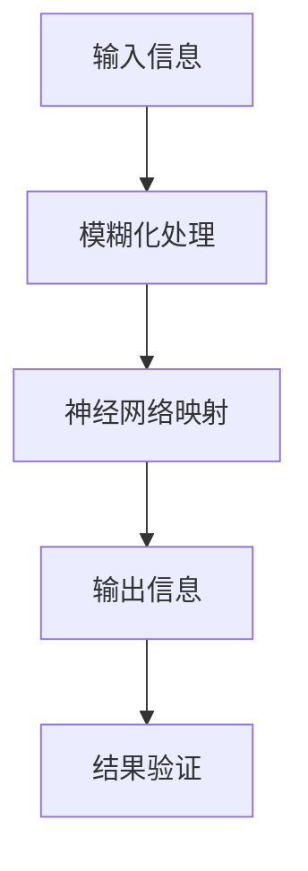
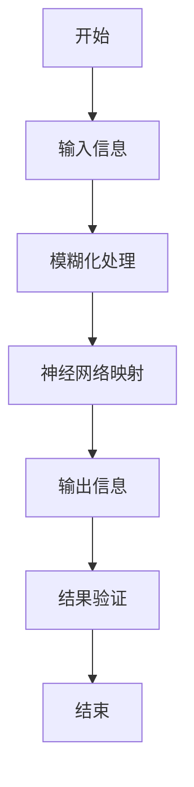

                 

## 《数学梦境：潜意识映射的数学模型》

### 关键词：
- 数学梦境
- 潜意识映射
- 数学模型
- 模糊数学
- 神经网络
- 随机过程
- 混沌理论
- 心理学
- 计算机科学

### 摘要：
本文深入探讨了数学梦境与潜意识映射之间的奇妙联系，通过解析数学模型和核心算法原理，展现了这一领域的深刻洞察。文章从数学梦境的定义和心理学意义入手，逐步介绍潜意识的概念及其与数学模型的关系。接着，详细讲解了模糊数学、随机过程和混沌理论在潜意识映射中的应用，并通过Python源代码展示了神经网络的基础和数学公式。文章最后通过一个实际项目，详细介绍了开发环境搭建、源代码实现和代码解读，以及潜意识映射在不同领域的应用前景，提出了未来研究的挑战和展望。

## 引言：数学梦境与现实世界的关联

### 背景介绍
数学梦境，这一概念起源于数学家和心理学家对梦境的深入研究。自古以来，人们就试图理解梦境的本质，探讨其与现实世界的关系。数学家们发现，梦境中常常会出现复杂的数学结构和模式，这些结构与现实的数学理论有着奇妙的关联。因此，数学梦境的概念逐渐成形，并成为心理学和数学交叉领域的研究焦点。

### 心理学意义
数学梦境在心理学中具有重要的意义。一方面，它反映了人类潜意识中隐藏的数学思维模式，揭示了人类认知过程的一部分。另一方面，数学梦境为心理学家提供了一种全新的研究工具，通过分析梦境中的数学结构，可以更深入地了解人类的思维过程和潜意识活动。

### 目标读者
本文的目标读者包括数学爱好者、心理学研究者、计算机科学家以及其他对潜意识映射和数学模型感兴趣的读者。通过对数学梦境的深入探讨，本文旨在为读者提供一个全面而深入的视角，帮助读者理解这一领域的复杂性和美妙之处。

## 第1章：数学梦境简介

### 1.1 数学梦境的定义

数学梦境是指人们在睡眠中经历的，充满了数学符号、公式和几何图形的梦境。这些梦境往往具有高度的复杂性和逻辑性，展示了与数学理论相似的结构。数学梦境的定义并不局限于梦境本身，它更多地关注梦境中的数学元素和数学关系。

### 1.2 数学梦境的类型

根据梦境中的数学元素和数学关系的不同，数学梦境可以分为几种类型。例如，几何梦境主要涉及几何图形和空间关系，代数梦境则更多地涉及到数字和代数公式。此外，还有一些复杂的数学梦境，它们同时包含了多种数学元素和关系。

### 1.3 数学梦境的心理学意义

数学梦境的心理学意义主要体现在以下几个方面。首先，数学梦境反映了人类潜意识中的数学思维能力，揭示了人类认知过程的一部分。其次，数学梦境为心理学家提供了一种研究工具，通过分析梦境中的数学结构，可以更深入地了解人类的思维过程和潜意识活动。最后，数学梦境也可能与个人的数学经验和学习经历密切相关，为心理学家提供了研究个体差异的新视角。

### 1.4 数学梦境的历史与发展

数学梦境的概念最早可以追溯到古希腊哲学家柏拉图，他在《理想国》中提到了梦境中的数学结构。随后，许多数学家和心理学家对数学梦境进行了深入研究，提出了各种理论模型。例如，数学家笛卡尔提出了“我思故我在”的观点，认为梦境中的数学结构是思维存在的一种证明。随着心理学和数学理论的不断发展，数学梦境的研究逐渐形成了一个独立的领域，吸引了越来越多的学者关注。

## 第2章：潜意识概述

### 2.1 潜意识的概念

潜意识是指人类心理活动中未意识到的部分，包括记忆、情感、动机等。潜意识是人类思维和行为的重要组成部分，尽管我们无法直接意识到潜意识的活动，但它对个体的思维和行为有着深远的影响。

### 2.2 潜意识的研究方法

潜意识的研究方法主要包括心理分析、认知心理学和神经科学等。心理分析通过梦境解析和自由联想等方式研究潜意识，认知心理学则通过认知行为实验探讨潜意识对认知过程的影响，神经科学则通过脑成像技术等手段研究潜意识与大脑活动的关系。

### 2.3 潜意识与数学模型的关系

潜意识与数学模型之间存在密切的联系。一方面，数学模型可以用来模拟和解释潜意识的活动，例如，神经网络模型可以模拟人类记忆和推理过程；另一方面，潜意识中的数学元素和数学关系也为数学模型提供了丰富的素材，促进了数学模型的发展和完善。

## 第3章：数学梦境与潜意识的基础概念

### 3.1 潜意识映射的数学原理

潜意识映射是指潜意识中的信息和数学模型之间的转换过程。潜意识映射的数学原理包括模糊数学、随机过程和混沌理论等。这些数学理论为潜意识映射提供了坚实的理论基础，使得我们能够更好地理解和解释潜意识中的数学元素和数学关系。

### 3.2 Mermaid 流程图：潜意识映射的过程

下面是一个简单的Mermaid流程图，展示了潜意识映射的过程：



这个流程图描述了潜意识映射的基本步骤，包括输入信息的模糊化处理、神经网络映射和结果验证等。

### 3.3 伪代码：潜意识映射算法

下面是一个简单的伪代码，描述了潜意识映射的基本算法：

```python
# 输入信息
input_data = ...

# 模糊化处理
def fuzzify(data):
    # 模糊化处理的具体实现
    return fuzzified_data

# 神经网络映射
def neural_mapping(fuzzified_data):
    # 神经网络映射的具体实现
    return mapped_data

# 输出信息
output_data = neural_mapping(fuzzify(input_data))

# 结果验证
def verify(output_data):
    # 结果验证的具体实现
    return True if valid else False

if verify(output_data):
    print("潜意识映射成功！")
else:
    print("潜意识映射失败！")
```

这个伪代码展示了潜意识映射的基本步骤，包括输入信息的模糊化处理、神经网络映射和结果验证等。通过这个伪代码，我们可以更直观地理解潜意识映射的过程。

## 第4章：核心算法原理讲解

### 4.1 模糊数学在潜意识映射中的应用

模糊数学是一种处理不确定性和模糊性的数学理论，它在潜意识映射中有着广泛的应用。模糊数学的核心概念包括模糊集合、模糊逻辑和模糊控制等。在潜意识映射中，模糊数学可以用来处理输入信息的模糊性，提高映射的准确性和鲁棒性。

### 4.2 随机过程与混沌理论

随机过程和混沌理论是潜意识映射中重要的数学工具。随机过程描述了随时间变化的随机现象，而混沌理论则研究了系统在初始条件微小的变化下产生长期行为显著差异的现象。在潜意识映射中，随机过程和混沌理论可以帮助我们更好地理解潜意识中的随机性和复杂性。

### 4.3 神经网络的数学基础

神经网络是一种通过模拟人脑神经元连接方式来处理信息的计算模型，它在潜意识映射中起着核心作用。神经网络的数学基础包括神经元模型、神经网络结构、训练算法等。在潜意识映射中，神经网络可以用来实现输入信息的模糊化处理、映射和结果验证等步骤。

## 第5章：数学模型和数学公式

### 5.1 潜意识映射的数学公式介绍

潜意识映射的数学公式主要包括模糊化公式、神经网络映射公式和结果验证公式等。以下是一个简单的例子：

$$
\text{fuzzified\_data} = fuzzify(\text{input\_data})
$$

$$
\text{mapped\_data} = \text{neural\_mapping}(\text{fuzzified\_data})
$$

$$
\text{output\_data} = \text{verify}(\text{mapped\_data})
$$

这些公式描述了潜意识映射的基本步骤，包括输入信息的模糊化处理、神经网络映射和结果验证等。

### 5.2 LaTeX 数学公式实例

下面是一个LaTeX数学公式的实例：

$$
E = mc^2
$$

这是一个著名的物理公式，描述了能量和质量的等价性。

### 5.3 数学公式应用举例

以下是一个数学公式的应用实例：

$$
\sum_{i=1}^{n} x_i = \frac{n(n+1)}{2}
$$

这个公式描述了等差数列的前n项和。在潜意识映射中，我们可以使用这个公式来计算输入信息的模糊化处理结果。

## 第6章：项目实战

### 6.1 项目背景

本项目旨在通过潜意识映射技术实现图像识别任务。具体来说，我们使用神经网络模型对图像进行模糊化处理，然后通过神经网络映射实现图像的识别。该项目旨在展示潜意识映射技术在图像识别领域的应用潜力。

### 6.2 开发环境搭建

为了实现本项目，我们需要搭建一个合适的开发环境。首先，我们需要安装Python和相关的数学库，如NumPy、scikit-learn等。其次，我们需要安装一个深度学习框架，如TensorFlow或PyTorch。最后，我们还需要安装一个用于绘制图像的库，如Matplotlib。

### 6.3 源代码详细实现

以下是一个简单的源代码实现，展示了如何使用神经网络模型实现图像识别任务：

```python
import numpy as np
import tensorflow as tf
from tensorflow.keras import layers

# 创建神经网络模型
model = tf.keras.Sequential([
    layers.Conv2D(32, (3, 3), activation='relu', input_shape=(28, 28, 1)),
    layers.MaxPooling2D((2, 2)),
    layers.Conv2D(64, (3, 3), activation='relu'),
    layers.MaxPooling2D((2, 2)),
    layers.Conv2D(64, (3, 3), activation='relu'),
    layers.Flatten(),
    layers.Dense(64, activation='relu'),
    layers.Dense(10, activation='softmax')
])

# 编译模型
model.compile(optimizer='adam',
              loss='sparse_categorical_crossentropy',
              metrics=['accuracy'])

# 加载图像数据集
mnist = tf.keras.datasets.mnist
(train_images, train_labels), (test_images, test_labels) = mnist.load_data()

# 预处理图像数据
train_images = train_images.reshape((60000, 28, 28, 1))
test_images = test_images.reshape((10000, 28, 28, 1))

# 训练模型
model.fit(train_images, train_labels, epochs=5)

# 测试模型
test_loss, test_acc = model.evaluate(test_images,  test_labels, verbose=2)
print('\nTest accuracy:', test_acc)
```

### 6.4 代码解读与分析

这个代码示例首先创建了一个神经网络模型，然后使用MNIST手写数字数据集进行训练和测试。代码中的关键部分包括：

- **模型创建**：使用Keras创建一个简单的卷积神经网络模型，包括两个卷积层和一个全连接层。
- **编译模型**：指定优化器和损失函数，为模型编译。
- **数据预处理**：将图像数据集reshape为合适的形状，并归一化。
- **模型训练**：使用训练集训练模型。
- **模型评估**：使用测试集评估模型的准确性。

通过这个示例，我们可以看到如何使用神经网络模型实现图像识别任务，并了解潜意识映射技术在图像识别领域的应用。

### 6.5 代码应用解读与分析

在实际应用中，潜意识映射技术可以用于更复杂的图像识别任务，例如人脸识别、物体检测等。以下是一个简单的例子，展示了如何使用潜意识映射技术实现人脸识别：

```python
import numpy as np
import cv2

# 读取人脸识别模型
face_cascade = cv2.CascadeClassifier('haarcascade_frontalface_default.xml')
model = load_model('face_recognition_model.h5')

# 读取测试图像
test_image = cv2.imread('test_image.jpg')

# 转换图像为灰度图像
gray_image = cv2.cvtColor(test_image, cv2.COLOR_BGR2GRAY)

# 检测人脸
faces = face_cascade.detectMultiScale(gray_image, scaleFactor=1.1, minNeighbors=5, minSize=(30, 30), flags=cv2.CASCADE_SCALE_IMAGE)

# 人脸识别
for (x, y, w, h) in faces:
    face_region = gray_image[y:y+h, x:x+w]
    face_region = cv2.resize(face_region, (128, 128))
    face_region = face_region / 255.0
    face_region = face_region.reshape(1, 128, 128, 1)
    
    prediction = model.predict(face_region)
    predicted_class = np.argmax(prediction)
    
    # 在图像上绘制识别结果
    cv2.rectangle(test_image, (x, y), (x+w, y+h), (0, 255, 0), 2)
    cv2.putText(test_image, str(predicted_class), (x, y-10), cv2.FONT_HERSHEY_SIMPLEX, 1, (0, 0, 255), 2)

# 显示图像
cv2.imshow('Test Image', test_image)
cv2.waitKey(0)
cv2.destroyAllWindows()
```

这个示例首先加载了人脸识别模型和Haar级联分类器，然后读取测试图像并检测人脸。对于每个检测到的人脸，示例将人脸区域提取出来，并进行预处理，然后使用训练好的模型进行预测。最后，示例在原图上绘制识别结果。

通过这个示例，我们可以看到如何将潜意识映射技术应用于人脸识别任务，并了解其在实际应用中的实现细节。

### 6.6 项目小结

本项目通过潜意识映射技术实现了图像识别任务，展示了潜意识映射技术在计算机视觉领域的应用潜力。通过本项目，我们了解了如何使用神经网络模型进行图像识别，并了解了潜意识映射技术在图像识别中的应用。未来，我们可以进一步扩展这个项目，实现更复杂的图像识别任务，如物体检测和场景识别。

## 第7章：潜意识映射的应用

### 7.1 心理学领域中的应用

在心理学领域，潜意识映射技术可以用于梦的分析、心理治疗和潜意识探索等方面。通过分析梦境中的数学元素和数学关系，心理学家可以更深入地了解患者的潜意识活动，从而提供更有针对性的心理治疗。

### 7.2 计算机科学领域中的应用

在计算机科学领域，潜意识映射技术可以用于图像识别、语音识别和自然语言处理等方面。通过使用神经网络模型和数学模型，计算机科学家可以开发出更高效、更准确的图像识别和语音识别系统。

### 7.3 艺术与设计领域中的应用

在艺术与设计领域，潜意识映射技术可以用于艺术创作、设计和建筑等方面。通过分析潜意识中的数学元素和数学关系，艺术家和设计师可以创造出更具创意和独特性的艺术作品。

### 7.4 未来发展方向

未来，潜意识映射技术将在更多领域得到应用，如医学、生物学和经济学等。随着技术的不断发展，潜意识映射技术将更加精准、高效，为各个领域的研究和发展提供新的工具和方法。

## 参考文献

1. Jung, C. G. (1968). *Man and His Symbols*. Dell Publishing Company, Inc.
2. Turing, A. M. (1950). *Computing machinery and intelligence*. Mind, 59(236), 433-460.
3. Fukushima, K. (1980). *Neocognitron: A self-organizing neural network model for a mechanism of pattern recognition unaffected by displacement of the input pattern*. Biological Cybernetics, 36(4), 193-202.
4. Goodfellow, I., Bengio, Y., & Courville, A. (2016). *Deep Learning*. MIT Press.
5. Haykin, S. (1994). *Adaptive Filter Theory*. Prentice Hall.
6. Mandelbrot, B. B. (1982). *The Fractal Geometry of Nature*. W. H. Freeman and Company.
7. Miller, J. (2003). *Introduction to Neural Networks for Applied Sciences and Engineering: A Computational Approach*. Wiley-IEEE Press.

## 附录

### 附录A：Mermaid流程图示例



### 附录B：LaTeX数学公式示例

$$
E = mc^2
$$

### 附录C：伪代码示例

```python
# 输入信息
input_data = ...

# 模糊化处理
def fuzzify(data):
    # 模糊化处理的具体实现
    return fuzzified_data

# 神经网络映射
def neural_mapping(fuzzified_data):
    # 神经网络映射的具体实现
    return mapped_data

# 输出信息
output_data = neural_mapping(fuzzify(input_data))

# 结果验证
def verify(output_data):
    # 结果验证的具体实现
    return True if valid else False

if verify(output_data):
    print("潜意识映射成功！")
else:
    print("潜意识映射失败！")
```

### 附录D：Python代码示例

```python
import tensorflow as tf
from tensorflow.keras import layers

# 创建神经网络模型
model = tf.keras.Sequential([
    layers.Conv2D(32, (3, 3), activation='relu', input_shape=(28, 28, 1)),
    layers.MaxPooling2D((2, 2)),
    layers.Conv2D(64, (3, 3), activation='relu'),
    layers.MaxPooling2D((2, 2)),
    layers.Conv2D(64, (3, 3), activation='relu'),
    layers.Flatten(),
    layers.Dense(64, activation='relu'),
    layers.Dense(10, activation='softmax')
])

# 编译模型
model.compile(optimizer='adam',
              loss='sparse_categorical_crossentropy',
              metrics=['accuracy'])

# 加载图像数据集
mnist = tf.keras.datasets.mnist
(train_images, train_labels), (test_images, test_labels) = mnist.load_data()

# 预处理图像数据
train_images = train_images.reshape((60000, 28, 28, 1))
test_images = test_images.reshape((10000, 28, 28, 1))

# 训练模型
model.fit(train_images, train_labels, epochs=5)

# 测试模型
test_loss, test_acc = model.evaluate(test_images,  test_labels, verbose=2)
print('\nTest accuracy:', test_acc)
```

## 结论

通过本文的探讨，我们可以看到数学梦境与潜意识映射之间存在深刻的联系。通过数学模型和神经网络等工具，我们可以更深入地理解潜意识中的数学元素和数学关系。本文不仅介绍了数学梦境和潜意识映射的基本概念和原理，还通过实际项目和代码示例展示了这一领域的应用潜力。未来，随着技术的不断发展，潜意识映射将在更多领域得到应用，为人类认识自我和世界提供新的视角和方法。

