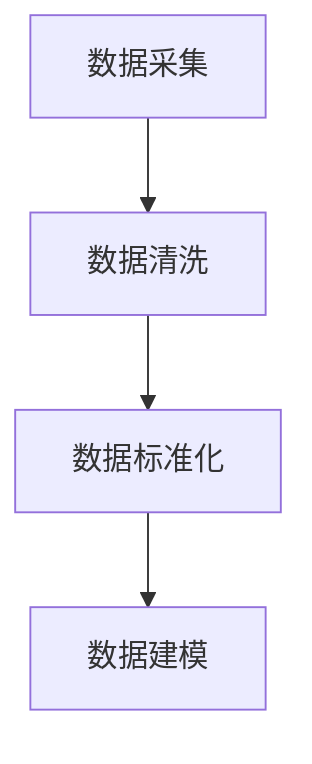

                 

## 数学模型在体育战术分析中的应用

### 关键词

- 数学模型
- 体育战术
- 数据分析
- 线性回归
- 非线性模型
- 运动员能力评估
- 球队战术分析

### 摘要

本文将探讨数学模型在体育战术分析中的应用。首先，我们将简要介绍数学模型的基础知识，包括基本原理和应用领域。随后，我们将深入讨论基础数学模型（如函数模型和方程模型）以及高级数学模型（如线性模型和非线性模型）。接下来，我们将阐述数学模型在体育战术分析中的具体应用，涵盖数据预处理、运动员能力模型和球队战术模型。最后，我们将通过实际案例，展示数学模型在足球和篮球比赛数据分析中的具体应用，并进行总结与讨论。

## 数学模型基础

### 数学模型的定义与分类

数学模型是指用数学语言和符号描述现实世界的现象、过程和系统的一种抽象方法。数学模型通常包括变量、参数和方程，用以描述和分析系统的行为。

根据数学模型的形式和复杂度，可以将其分为以下几类：

1. **函数模型**：通过函数关系描述变量之间的依赖关系。常见的函数类型有线性函数、多项式函数、指数函数等。
   
2. **方程模型**：通过方程组描述多个变量之间的相互关系。常见的方程类型有线性方程、非线性方程、微分方程等。

3. **几何模型**：通过几何图形描述空间关系和形状变化。常见的几何模型有平面几何、立体几何、拓扑学等。

4. **统计模型**：通过统计方法描述数据分布和概率。常见的统计模型有回归模型、时间序列模型、贝叶斯模型等。

### 数学模型的基本原理

数学模型的基本原理主要包括以下几个关键方面：

1. **抽象化**：将复杂的现实世界简化为数学形式，抓住最本质的变量和关系。
   
2. **符号化**：使用数学符号和公式描述变量、参数和方程，提高描述的准确性和通用性。

3. **形式化**：通过严格的数学证明和逻辑推理，确保模型的有效性和可靠性。

4. **验证与优化**：通过实际数据和实验结果对模型进行验证和优化，提高模型的预测能力和适用性。

### 数学模型的应用领域

数学模型广泛应用于各个领域，包括自然科学、社会科学、工程技术和经济学等。具体应用领域如下：

1. **自然科学**：如物理学、生物学、地球科学等，用于描述自然现象和规律。
   
2. **社会科学**：如经济学、社会学、心理学等，用于分析社会行为和趋势。

3. **工程技术**：如机械工程、电子工程、化学工程等，用于设计和优化工程系统。

4. **经济学**：如金融分析、市场预测、经济政策等，用于经济决策和风险评估。

5. **体育战术分析**：用于分析运动员能力、球队战术和比赛策略，提高竞技水平。

## 基础数学模型

### 函数模型

#### 函数的基本概念

函数是数学中用于描述变量之间依赖关系的最基本工具。在函数模型中，自变量（输入）和因变量（输出）通过函数关系相连。

定义：设\( D \)为自变量的取值范围，\( R \)为因变量的取值范围，函数\( f \)是一个从\( D \)到\( R \)的映射，对于\( D \)中的每个自变量\( x \)，都有唯一的因变量\( y \)与之对应，即\( y = f(x) \)。

#### 常见的函数类型

1. **线性函数**：形如\( y = mx + b \)的函数，其中\( m \)和\( b \)为常数，称为斜率和截距。线性函数描述了自变量与因变量之间的线性关系。

2. **多项式函数**：形如\( f(x) = a_0 + a_1x + a_2x^2 + ... + a_nx^n \)的函数，其中\( a_0, a_1, ..., a_n \)为常数，称为系数。多项式函数描述了自变量与因变量之间的多项式关系。

3. **指数函数**：形如\( y = a^x \)的函数，其中\( a \)为常数，称为底数。指数函数描述了自变量与因变量之间的指数关系。

#### 函数模型的构建方法

1. **观察法**：通过观察实际数据和现象，确定自变量与因变量之间的关系，构建函数模型。

2. **实验法**：通过实验数据，拟合出合适的函数模型。常见的方法有线性回归、多项式回归等。

3. **解析法**：根据问题的本质和已知条件，直接构建函数模型。

### 方程模型

#### 方程的基本概念

方程是数学中描述变量之间等量关系的表达式。在方程模型中，通过解方程可以确定变量的取值，从而分析系统的行为。

定义：形如\( f(x) = 0 \)的方程，其中\( f(x) \)为已知函数，称为方程的左端，0为方程的右端。

#### 常见的方程类型

1. **线性方程**：形如\( ax + b = 0 \)的方程，其中\( a \)和\( b \)为常数。线性方程的解为唯一值。

2. **非线性方程**：形如\( f(x) = 0 \)的方程，其中\( f(x) \)为非线性函数。非线性方程的解可能有多值或无解。

3. **微分方程**：形如\( F(x, y, y') = 0 \)的方程，其中\( F(x, y, y') \)为已知函数，\( y' \)为\( y \)对\( x \)的导数。微分方程用于描述变量之间的变化率关系。

#### 方程模型的求解方法

1. **解析法**：通过数学方法直接求解方程，如因式分解、代数运算等。

2. **数值法**：通过数值方法求解方程，如牛顿迭代法、高斯消元法等。

3. **图示法**：通过绘制函数图像，直观地求解方程。

### 线性模型

#### 线性模型的基本概念

线性模型是函数模型和方程模型的一种特殊情况，描述了变量之间的线性关系。线性模型通常形如\( y = mx + b \)，其中\( m \)为斜率，\( b \)为截距。

#### 线性模型的求解方法

1. **最小二乘法**：通过最小化误差平方和，求解线性模型的最优参数。

2. **梯度下降法**：通过迭代优化，求解线性模型的最优参数。

3. **正规方程**：直接求解线性模型的最优参数，适用于小规模问题。

#### 线性模型的应用场景

1. **数据拟合**：用于拟合实验数据，分析变量之间的关系。

2. **预测**：用于预测未来的变量值，如股票价格、销售量等。

3. **分类**：用于分类问题，如图像分类、文本分类等。

### 非线性模型

#### 非线性模型的基本概念

非线性模型是描述变量之间非线性关系的模型。非线性模型通常形如\( f(x) = a_0 + a_1x + a_2x^2 + ... + a_nx^n \)，其中\( a_0, a_1, ..., a_n \)为常数。

#### 非线性模型的求解方法

1. **数值法**：通过数值方法求解非线性模型，如牛顿迭代法、隐函数迭代法等。

2. **符号法**：通过符号方法求解非线性模型，如拉格朗日乘数法、雅可比矩阵等。

3. **机器学习法**：通过机器学习方法求解非线性模型，如神经网络、支持向量机等。

#### 非线性模型的应用场景

1. **非线性拟合**：用于拟合非线性实验数据。

2. **非线性预测**：用于预测非线性变量值。

3. **非线性分类**：用于分类非线性数据。

## 数学模型在体育战术分析中的应用

### 体育数据预处理

在体育战术分析中，数据预处理是至关重要的步骤。体育数据通常包括运动员表现数据、比赛数据、统计数据等。为了提高模型的准确性和稳定性，我们需要对原始数据进行预处理，主要包括以下几个步骤：

1. **数据采集**：从不同的数据源获取运动员表现数据、比赛数据、统计数据等。

2. **数据清洗**：去除数据中的噪声和异常值，如缺失值、重复值、错误值等。

3. **数据标准化**：将不同数据源的数据进行归一化或标准化处理，使其具有相同的量纲和范围。

### 运动员能力模型

运动员能力模型是体育战术分析的核心。通过评估运动员的能力，可以更好地制定球队战术和比赛策略。以下是一个简化的运动员能力模型：

$$
\text{能力评分} = \frac{1}{N} \sum_{i=1}^N (w_1 \times \text{技术评分} + w_2 \times \text{体能评分} + w_3 \times \text{心理评分})
$$

其中，\( N \)为评分指标的个数，\( w_1, w_2, w_3 \)分别为技术、体能、心理评分的权重。

#### 运动员能力评估模型的构建方法

1. **技术评分**：通过专家评估、技术统计数据等方法，为每个运动员的技术能力进行评分。

2. **体能评分**：通过体能测试、比赛数据等方法，为每个运动员的体能能力进行评分。

3. **心理评分**：通过心理测试、比赛表现等方法，为每个运动员的心理能力进行评分。

4. **权重分配**：根据不同评分指标的重要程度，为每个评分指标分配权重。

### 球队战术模型

球队战术模型是体育战术分析的重要组成部分。通过分析球队在不同战术下的表现，可以优化球队战术，提高比赛成绩。以下是一个简化的球队战术模型：

$$
\text{战术效果评分} = \beta_0 + \beta_1 \times \text{进攻战术评分} + \beta_2 \times \text{防守战术评分} + \epsilon
$$

其中，\( \beta_0, \beta_1, \beta_2 \)分别为战术效果评分的截距、进攻战术评分的系数、防守战术评分的系数。

#### 球队战术分析模型的构建方法

1. **进攻战术评分**：通过专家评估、比赛数据等方法，为球队的进攻战术进行评分。

2. **防守战术评分**：通过专家评估、比赛数据等方法，为球队的防守战术进行评分。

3. **权重分配**：根据不同战术指标的重要程度，为每个战术指标分配权重。

4. **线性回归**：使用线性回归方法，建立战术效果评分与进攻战术评分、防守战术评分之间的关系。

### 比赛策略评估

比赛策略评估是体育战术分析的关键步骤。通过分析比赛策略的有效性，可以为球队制定更科学的比赛策略。以下是一个简化的比赛策略评估模型：

$$
\text{策略效果评分} = \gamma_0 + \gamma_1 \times \text{进攻策略评分} + \gamma_2 \times \text{防守策略评分} + \epsilon
$$

其中，\( \gamma_0, \gamma_1, \gamma_2 \)分别为策略效果评分的截距、进攻策略评分的系数、防守策略评分的系数。

#### 比赛策略评估模型的构建方法

1. **进攻策略评分**：通过专家评估、比赛数据等方法，为球队的进攻策略进行评分。

2. **防守策略评分**：通过专家评估、比赛数据等方法，为球队的防守策略进行评分。

3. **权重分配**：根据不同策略指标的重要程度，为每个策略指标分配权重。

4. **线性回归**：使用线性回归方法，建立策略效果评分与进攻策略评分、防守策略评分之间的关系。

### 实际案例：足球比赛数据分析

#### 案例背景

为了提高球队在足球比赛中的表现，我们需要对球队的比赛数据进行分析，评估球队在进攻和防守方面的表现，并制定相应的比赛策略。假设我们有一组足球比赛数据，包括进攻和防守的得分、失球数、球员能力评分等。

#### 数据采集与预处理

1. **数据采集**：从数据库或数据文件中获取比赛数据。

2. **数据清洗**：去除数据中的噪声和异常值，如缺失值、重复值、错误值等。

3. **数据标准化**：将不同数据源的数据进行归一化或标准化处理，使其具有相同的量纲和范围。

#### 运动员能力分析

1. **技术评分**：通过专家评估，为每个运动员的技术能力进行评分。

2. **体能评分**：通过体能测试，为每个运动员的体能能力进行评分。

3. **心理评分**：通过心理测试，为每个运动员的心理能力进行评分。

4. **权重分配**：为技术、体能、心理评分分配权重，计算每个运动员的综合能力评分。

#### 球队战术分析

1. **进攻战术评分**：通过专家评估，为球队的进攻战术进行评分。

2. **防守战术评分**：通过专家评估，为球队的防守战术进行评分。

3. **权重分配**：为进攻战术评分和防守战术评分分配权重，计算球队的战术效果评分。

#### 比赛策略评估

1. **进攻策略评分**：通过专家评估，为球队的进攻策略进行评分。

2. **防守策略评分**：通过专家评估，为球队的防守策略进行评分。

3. **权重分配**：为进攻策略评分和防守策略评分分配权重，计算球队的策略效果评分。

#### 分析结果与讨论

通过对比赛数据进行分析，我们可以得到以下结论：

1. **运动员能力分析**：根据运动员的综合能力评分，可以发现球队中哪些运动员在技术、体能、心理方面表现突出。

2. **球队战术分析**：根据球队的战术效果评分，可以发现球队在进攻和防守方面的优势和不足。

3. **比赛策略评估**：根据球队的策略效果评分，可以评估不同比赛策略的有效性，为球队制定更科学的比赛策略。

#### 项目小结

通过本次项目，我们成功地运用数学模型对足球比赛数据进行分析，为球队提供了有价值的战术分析和比赛策略建议。这表明数学模型在体育战术分析中具有重要的应用价值，有助于提高球队的竞技水平。

### 拓展阅读

- **《数据科学导论》**：介绍了数据科学的基础知识和常用方法，包括数据预处理、回归分析、分类算法等。
- **《机器学习实战》**：详细介绍了机器学习的基本概念、算法和应用，包括线性回归、决策树、神经网络等。
- **《体育科学导论》**：介绍了体育科学的基础知识和研究方法，包括运动员体能训练、比赛策略制定等。

### 注意事项

1. 在进行体育数据预处理时，应注意去除噪声和异常值，以确保模型的有效性和稳定性。

2. 在构建运动员能力模型和球队战术模型时，应综合考虑技术、体能、心理等多方面的因素，确保模型的全面性和准确性。

3. 在比赛策略评估时，应充分考虑比赛环境和对手特点，制定具有针对性的比赛策略。

4. 在实际应用中，应不断优化和调整数学模型，以适应不同比赛场景和需求。

### 最佳实践 Tips

1. 在进行体育战术分析时，可结合多个模型和算法，以提高分析结果的准确性和可靠性。

2. 定期更新比赛数据，确保模型训练数据的新鲜度和有效性。

3. 充分利用专家知识和经验，对模型结果进行验证和调整，以提高模型的实用性。

4. 在实际比赛中，根据比赛情况和对手特点，灵活调整比赛策略，以最大化球队优势。

### 附录

- **数据预处理流程图**：



- **运动员能力评估模型伪代码**：

```python
def evaluate_player_ability(data):
    # 初始化能力评估模型
    model = initialize_ability_model()

    # 训练模型
    model.fit(data)

    # 预测能力
    ability = model.predict(data)

    return ability
```

- **球队战术分析数学模型讲解**：

球队战术分析模型的核心是确定球队在不同战术下的表现。我们可以使用线性回归模型来分析球队战术与比赛结果之间的关系。以下是一个简化的线性回归模型：

$$
\text{比赛结果} = \beta_0 + \beta_1 \times \text{进攻战术评分} + \beta_2 \times \text{防守战术评分} + \epsilon
$$

其中，$\beta_0$ 是截距，$\beta_1$ 和 $\beta_2$ 分别是进攻战术评分和防守战术评分的系数，$\epsilon$ 是误差项。

通过这个模型，我们可以预测球队在不同战术下的比赛结果，并根据预测结果调整球队战术，以最大化比赛成绩。

### 结语

数学模型在体育战术分析中具有重要的作用。通过运用数学模型，我们可以对运动员能力、球队战术和比赛策略进行深入分析，为球队制定科学的战术计划和比赛策略。本文仅对数学模型在体育战术分析中的应用进行了初步探讨，未来还有许多研究方向值得深入探索。希望本文能为读者提供有益的参考和启示。

