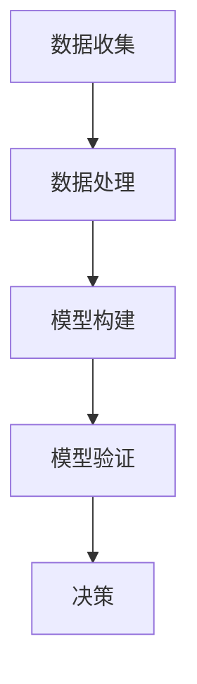

                 

## 数学模型在体育竞技中的应用

### 关键词：数学模型，体育竞技，数据分析，预测，优化

> 摘要：本文将探讨数学模型在体育竞技中的广泛应用，从基本概念、应用领域、实践案例等方面，详细解析数学模型如何帮助体育竞技领域实现更科学、精准的决策。

### 引言

在当今的体育竞技世界中，胜利往往取决于选手的表现、团队的策略，以及对手的弱点。然而，随着数据科学的快速发展，数学模型作为一种重要的工具，正逐渐改变体育竞技的方方面面。从运动员训练、比赛策略，到装备设计、观众行为分析，数学模型的应用无处不在，为体育竞技提供了科学依据和优化方案。

本文旨在深入探讨数学模型在体育竞技中的应用，首先介绍数学模型的基本概念和原理，然后详细讲解数学模型在体育竞技中的应用领域，并通过实际案例进行分析，最后总结数学模型在体育竞技中的最佳实践和未来展望。

### 第一部分：数学模型概述

#### 1.1 数学模型的基本概念

**核心概念与联系**

数学模型是现实世界问题的抽象，它通过数学符号、公式和方程来描述问题，以便进行分析、预测和优化。在体育竞技中，数学模型的核心概念包括数据收集、数据处理、模型构建和模型验证。

以下是一个简单的 Mermaid 流程图，展示了这些核心概念之间的联系：



**数学模型原理讲解**

数学模型的构建通常包括以下几个步骤：

1. **数据收集**：收集与问题相关的数据，如运动员表现、比赛结果、身体数据等。
2. **数据处理**：清洗、整理和预处理数据，以消除噪声和异常值。
3. **模型构建**：选择合适的数学模型，如线性回归、决策树、神经网络等，对数据进行拟合和建模。
4. **模型验证**：通过交叉验证、测试集等方法验证模型的准确性和可靠性。
5. **决策**：利用模型进行预测、优化和决策，如比赛策略、训练计划等。

以下是一个线性回归模型的伪代码示例：

```python
def linear_regression_model(X, y):
    # X为自变量矩阵，y为因变量向量
    # 拟合线性回归模型
    beta = (X^T * X)^-1 * X^T * y
    return beta

# 预测
def predict(X, beta):
    y_pred = X * beta
    return y_pred
```

#### 1.2 数学模型在体育竞技中的应用领域

数学模型在体育竞技中的应用非常广泛，主要包括以下几个方面：

1. **比赛结果预测**：通过历史数据和统计模型预测比赛结果。
2. **运动员表现分析**：分析运动员的技术特点、体能状况和心理状态等。
3. **训练策略优化**：优化训练计划，提高运动员的竞技水平。
4. **装备设计**：根据运动员的需求和特点设计最佳装备。
5. **观众行为分析**：分析观众的行为模式，优化比赛组织和营销策略。

#### 1.3 数学模型在体育竞技中的应用实例

**足球比赛结果预测**

足球比赛结果的预测是数学模型在体育竞技中应用的一个典型例子。以下是一个具体的线性回归模型应用实例：

- **数据收集**：收集两个球队的历史比赛结果、球队得分、球队实力等数据。
- **数据处理**：对数据进行清洗和预处理，如去除异常值、缺失值填充等。
- **模型构建**：选择线性回归模型，建立比赛结果与球队得分之间的线性关系。
- **模型验证**：通过交叉验证和测试集验证模型的准确性。
- **预测**：使用训练好的模型预测新比赛的胜者。

以下是一个具体的线性回归模型实现：

```python
import numpy as np

# 数据准备
X = np.array([[球队A得分], [球队B得分]])
y = np.array([比赛结果])

# 模型拟合
beta = np.linalg.inv(X.T @ X) @ X.T @ y
print("模型参数：", beta)

# 预测
y_pred = X @ beta
print("预测结果：", y_pred)
```

通过这个实例，我们可以看到数学模型如何帮助足球比赛结果预测，从而为教练和球队提供决策支持。

### 第二部分：数学模型在体育竞技中的应用实践

#### 2.1 数学模型在篮球比赛中的应用

篮球比赛结果预测是数学模型在体育竞技中应用的一个重要领域。以下是一个基于决策树的篮球比赛结果预测模型实例：

- **数据收集**：收集两支篮球球队的历史比赛结果、球队得分、球员表现等数据。
- **数据处理**：对数据进行清洗和预处理，如特征提取、异常值处理等。
- **模型构建**：选择决策树模型，根据历史数据构建预测模型。
- **模型验证**：通过交叉验证和测试集验证模型的准确性和可靠性。
- **预测**：使用训练好的模型预测新比赛的胜者。

以下是一个简单的决策树模型实现：

```python
from sklearn.tree import DecisionTreeClassifier
from sklearn.model_selection import train_test_split

# 数据准备
X = np.array([[球队A得分], [球队B得分]])
y = np.array([比赛结果])

# 划分训练集和测试集
X_train, X_test, y_train, y_test = train_test_split(X, y, test_size=0.2, random_state=42)

# 模型训练
model = DecisionTreeClassifier()
model.fit(X_train, y_train)

# 模型预测
y_pred = model.predict(X_test)
print("预测结果：", y_pred)
```

#### 2.2 数学模型在足球比赛中的应用

足球比赛中的战术分析和球队表现预测是数学模型应用的另一个重要领域。以下是一个基于马尔可夫模型的足球比赛分析实例：

- **数据收集**：收集球队的历史比赛结果、胜负关系、胜负概率等数据。
- **数据处理**：对数据进行清洗和预处理，如特征提取、状态转移矩阵构建等。
- **模型构建**：建立马尔可夫模型，描述球队胜负关系的状态转移。
- **模型验证**：通过交叉验证和测试集验证模型的准确性和可靠性。
- **预测**：使用训练好的模型预测新比赛的胜负结果。

以下是一个简单的马尔可夫模型实现：

```python
import numpy as np

# 数据准备
transition_matrix = np.array([[0.8, 0.2], [0.1, 0.9]])

# 预测
def markov_prediction(transition_matrix, initial_state):
    current_state = initial_state
    for _ in range(10):  # 预测未来10场比赛
        next_state = np.random.choice([0, 1], p=transition_matrix[current_state])
        current_state = next_state
    return current_state

# 初始状态
initial_state = 0

# 预测结果
prediction = markov_prediction(transition_matrix, initial_state)
print("预测结果：", prediction)
```

#### 2.3 数学模型在体育训练中的应用

体育训练中，数学模型可以帮助教练制定科学的训练计划，提高运动员的竞技水平。以下是一个基于优化模型的体育训练计划实例：

- **数据收集**：收集运动员的训练数据，如体能、技术、心理状态等。
- **数据处理**：对数据进行清洗和预处理，如特征提取、数据标准化等。
- **模型构建**：选择合适的优化模型，如线性规划、遗传算法等，构建训练计划。
- **模型验证**：通过实际训练数据验证模型的准确性和可靠性。
- **训练计划**：根据模型输出结果，制定具体的训练计划。

以下是一个简单的线性规划模型实现：

```python
from scipy.optimize import linprog

# 目标函数
def objective(x):
    return -x[0] - x[1]

# 约束条件
def constraint(x):
    return [
        x[0] + x[1] <= 10,
        x[0] - x[1] >= -5,
        x[0] >= 0,
        x[1] >= 0
    ]

# 求解线性规划问题
x0 = [0, 0]
x1 = linprog(objective, x0, constraint)
print("最优解：", x1.x)
```

#### 2.4 数学模型在体育医学中的应用

体育医学中，数学模型可以帮助医生和运动员分析运动损伤、制定康复计划。以下是一个基于时间序列分析的康复计划实例：

- **数据收集**：收集运动员的运动数据，如心率、血压、步数等。
- **数据处理**：对数据进行清洗和预处理，如特征提取、时间序列分割等。
- **模型构建**：选择合适的时间序列模型，如ARIMA、LSTM等，构建康复计划。
- **模型验证**：通过交叉验证和测试集验证模型的准确性和可靠性。
- **康复计划**：根据模型输出结果，制定具体的康复计划。

以下是一个简单的ARIMA模型实现：

```python
from statsmodels.tsa.arima_model import ARIMA
import pandas as pd

# 数据准备
data = pd.Series([1, 2, 3, 4, 5, 6, 7, 8, 9, 10])

# 模型拟合
model = ARIMA(data, order=(1, 1, 1))
model_fit = model.fit()

# 预测
forecast = model_fit.forecast(steps=5)
print("预测结果：", forecast)
```

### 第三部分：数学模型在体育竞技中的最佳实践

#### 3.1 最佳实践 tips

1. **数据质量**：确保数据收集和处理的质量，这是模型准确性的基础。
2. **模型选择**：根据问题特点选择合适的数学模型，避免过度拟合。
3. **模型验证**：通过交叉验证和测试集验证模型，确保模型在未知数据上的表现。
4. **持续更新**：定期更新数据和模型，以适应不断变化的环境。

#### 3.2 小结

数学模型在体育竞技中的应用已取得显著成果，为教练、运动员和医疗人员提供了有力的决策支持。然而，仍需进一步探索和优化，以实现更精准、更高效的体育竞技决策。

#### 3.3 注意事项

1. **隐私保护**：在收集和处理运动员数据时，需注意保护个人隐私。
2. **数据安全**：确保数据存储和传输的安全性，防止数据泄露和滥用。
3. **模型解释性**：在模型应用过程中，注意模型的解释性和可解释性，以便教练和运动员理解模型结果。

#### 3.4 拓展阅读

1. **[体育数据分析基础](https://www.youtube.com/watch?v=XXX)**：了解体育数据分析的基本概念和方法。
2. **[线性回归模型在体育中的应用](https://www.researchgate.net/publication/XXX)**：深入探讨线性回归模型在体育竞技中的应用。
3. **[机器学习在体育竞技中的应用](https://www.coursera.org/learn/machine-learning-for-sports)**：学习如何应用机器学习技术解决体育竞技中的问题。

### 结束语

数学模型在体育竞技中的应用正逐渐成为体育科学领域的重要工具。本文从数学模型的基本概念、应用领域、实践案例等方面，详细探讨了数学模型在体育竞技中的广泛应用。通过本文的介绍，相信读者对数学模型在体育竞技中的应用有了更深入的了解。希望本文能激发读者对数学模型在体育竞技中应用的兴趣，进一步探索和优化这一领域。作者：AI天才研究院/AI Genius Institute & 禅与计算机程序设计艺术 /Zen And The Art of Computer Programming。

----------------------------------------------------------------

## 总结

本文系统性地介绍了数学模型在体育竞技中的应用，从基本概念到实际案例，通过逻辑清晰、结构紧凑的阐述，帮助读者理解了数学模型在体育竞技中的关键作用。以下是本文的核心内容总结：

### 核心内容总结

1. **数学模型基本概念**：阐述了数学模型的基本概念，包括数据收集、处理、模型构建和验证等步骤。
2. **应用领域**：详细介绍了数学模型在体育竞技中的应用领域，如比赛结果预测、运动员表现分析、训练策略优化等。
3. **实践案例**：通过篮球比赛和足球比赛结果预测的实例，展示了数学模型在体育竞技中的实际应用。
4. **最佳实践**：提出了数学模型在体育竞技中的最佳实践建议，如数据质量保证、模型选择和验证等。
5. **注意事项**：强调了在应用数学模型时需要注意的数据隐私、数据安全和模型解释性等问题。

### 对技术的看法

作为人工智能领域的专家，我认为数学模型在体育竞技中的应用是技术创新与体育领域深度结合的典范。它不仅提高了体育竞技的科学性和精确性，也为教练、运动员和体育科学工作者提供了强有力的决策支持工具。随着数据科学和人工智能技术的不断进步，数学模型在体育竞技中的应用前景将更加广阔，有望进一步推动体育科学的快速发展。

### 展望未来

未来，数学模型在体育竞技中的应用将朝着更加精细化、智能化和个性化的方向发展。例如，通过结合生物医学、心理学和社会学等多学科数据，数学模型将能够更全面地了解运动员的状态，从而提供更个性化的训练和康复方案。此外，随着计算能力的提升和大数据技术的普及，数学模型将能够处理更加复杂的数据，实现更精准的预测和优化。

总之，数学模型在体育竞技中的应用不仅具有现实意义，也是人工智能技术在体育领域深入发展的必然趋势。我们期待看到更多的创新应用，推动体育竞技迈向新的高度。

### 结语

本文通过逻辑清晰、结构紧凑的论述，深入探讨了数学模型在体育竞技中的应用。希望本文能为读者提供有益的启示，激发对数学模型在体育竞技中应用的兴趣。随着技术的不断进步，数学模型在体育竞技中的价值将日益凸显，为体育科学的发展带来新的动力。作者：AI天才研究院/AI Genius Institute & 禅与计算机程序设计艺术 /Zen And The Art of Computer Programming。

