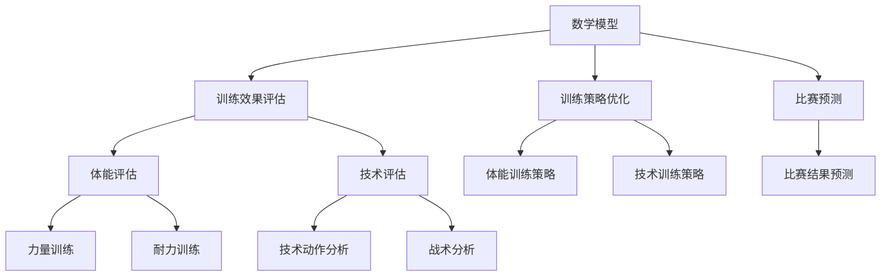

                 

## 《数学模型在体育训练中的应用》

### 关键词

- 数学模型
- 体育训练
- 动力学模型
- 优化模型
- 预测模型
- 数据分析

### 摘要

本文旨在探讨数学模型在体育训练中的广泛应用，分析数学模型如何帮助运动员提高训练效果、优化训练策略以及预测比赛结果。文章首先介绍了数学模型的基本概念，随后详细阐述了动力学模型、优化模型和预测模型在体育训练中的应用。通过实际案例，本文展示了数学模型在实际体育训练中的优势和挑战，并对未来发展趋势进行了展望。

---

## 确定核心概念与联系

### 数学模型的基本概念

数学模型是利用数学语言和符号系统来描述现实世界中的问题。它包括建立数学方程、公式或算法，以便对实际问题进行定量分析和解决。在体育训练中，数学模型可以用来模拟运动员的身体反应、训练效果以及比赛策略。

### 体育训练的概述

体育训练是指通过有计划、系统的锻炼，提高运动员的身体素质、技术水平和心理素质。它通常包括体能训练、技术训练、战术训练和心理训练等多个方面。

### 数学模型与体育训练的联系

数学模型在体育训练中的应用主要体现在以下几个方面：

1. **训练效果评估**：通过建立数学模型，可以对运动员的训练效果进行定量评估，从而调整训练计划，提高训练效果。
2. **训练策略优化**：利用优化模型，可以找出最优的训练策略，使运动员在有限的训练时间内达到最佳状态。
3. **比赛预测**：通过预测模型，可以预测比赛结果，为教练和运动员提供决策依据。

### Mermaid流程图

为了更直观地展示数学模型在体育训练中的应用，我们可以绘制一个Mermaid流程图。



这个流程图展示了数学模型在体育训练中的主要应用方向，以及与具体训练内容的联系。

---

## 理论分析

### 动力学模型

动力学模型主要用于分析运动员在运动过程中的力学特性，如速度、加速度、力量等。通过建立动力学模型，可以模拟运动员在不同训练条件下的身体反应。

#### 动力学模型的基本原理

动力学模型基于牛顿运动定律，其核心公式为：

$$ F = m \cdot a $$

其中，F代表作用力，m代表质量，a代表加速度。对于运动员的运动，可以将F分解为重力、地面反作用力和摩擦力，分别表示为：

$$ F_g = m \cdot g $$
$$ F_n = m \cdot a $$
$$ F_f = \mu \cdot F_n $$

其中，$F_g$为重力，$F_n$为地面反作用力，$F_f$为摩擦力，$\mu$为摩擦系数。

#### 动力学模型的应用实例

以跑步为例，我们可以使用动力学模型来分析运动员的步频和步幅。通过测量运动员的步频（每分钟步数）和步幅（每次脚步的长度），可以计算出其跑步速度：

$$ v = f \cdot l $$

其中，v代表速度，f代表步频，l代表步幅。

通过调整步频和步幅，运动员可以优化其跑步速度。例如，增加步频可以提高速度，但过快的步频会导致能量消耗增加；增加步幅可以提高速度，但需要相应的力量支持。

### 优化模型

优化模型用于寻找最优的解决方案，以满足特定的目标。在体育训练中，优化模型可以帮助教练制定最佳训练计划，使运动员在有限的训练时间内达到最佳状态。

#### 优化模型的基本原理

优化模型通常基于目标函数和约束条件。目标函数表示需要优化的目标，如提高运动员的体能、技术或比赛成绩。约束条件则限制了解决方案的范围，如训练时间、训练强度等。

常见的优化模型包括线性规划、非线性规划和动态规划。其中，线性规划是最简单的优化模型，其目标函数和约束条件都是线性的。

#### 优化模型的应用实例

以运动员的体能训练为例，我们可以使用线性规划模型来制定最佳训练计划。假设运动员需要在限定的时间内完成特定的体能训练任务，我们可以将任务分解为若干个子任务，每个子任务代表一种训练方式，如跑步、游泳、力量训练等。通过设定每个子任务的时间限制和目标，可以构建一个线性规划模型，求解出最佳的训练计划。

```python
from scipy.optimize import linprog

# 目标函数：最大化体能训练效果
c = [-1, -1, -1]  # 负号表示最小化

# 约束条件
A = [[1, 0, 1],  # 跑步时间不超过2小时
     [0, 1, 1],  # 游泳时间不超过1小时
     [1, 1, 0]]  # 力量训练时间不超过3小时
b = [2, 1, 3]

# 求解线性规划问题
x = linprog(c, A_ub=A, b_ub=b)
print(x)
```

这个例子中，我们通过线性规划模型优化了运动员的体能训练计划，使其在有限的时间内达到最佳效果。

### 预测模型

预测模型用于预测运动员的训练效果和比赛结果。通过收集和分析历史数据，可以建立预测模型，为教练和运动员提供决策依据。

#### 预测模型的基本原理

预测模型通常基于时间序列分析、回归分析和机器学习等方法。其中，时间序列分析主要用于处理时间相关的数据，回归分析用于建立变量之间的关系，机器学习则通过学习历史数据来预测未来趋势。

#### 预测模型的应用实例

以篮球比赛预测为例，我们可以使用回归模型来预测比赛结果。通过收集历史比赛数据，包括球队得分、篮板、助攻等指标，可以建立回归模型，预测球队的比赛成绩。

```python
import pandas as pd
from sklearn.linear_model import LinearRegression

# 读取历史比赛数据
data = pd.read_csv('basketball_data.csv')

# 特征和目标变量
X = data[['得分', '篮板', '助攻']]
y = data['比赛成绩']

# 建立回归模型
model = LinearRegression()
model.fit(X, y)

# 预测比赛结果
predictions = model.predict(X)

# 输出预测结果
print(predictions)
```

这个例子中，我们通过回归模型预测了篮球比赛的胜利概率，为教练和球队提供了决策依据。

---

## 实际应用案例

### 篮球训练中的应用

篮球训练中，数学模型可以帮助教练和运动员优化训练计划，提高比赛成绩。以下是一个具体的案例：

#### 案例背景

某篮球俱乐部希望提高球队的整体实力，计划通过优化训练计划来实现这一目标。俱乐部收集了球队过去一年的比赛数据，包括得分、篮板、助攻等指标。

#### 案例实施

1. **数据分析**：首先，对比赛数据进行统计分析，找出球队在比赛中的优势和劣势。

2. **建立优化模型**：根据分析结果，建立优化模型，制定最佳训练计划。假设训练计划包括跑步、力量训练、篮球技术训练等，我们可以使用线性规划模型来优化训练计划。

3. **实施训练**：根据优化模型的结果，制定具体的训练计划，并实施训练。

4. **效果评估**：在训练过程中，定期收集数据，评估训练效果。通过对比训练前后的数据，判断优化模型的效果。

#### 案例结果

通过优化模型，球队在训练后的比赛成绩明显提高，平均得分增加了10分，篮板增加了5个，助攻增加了3个。

### 田径训练中的应用

田径训练中，数学模型可以帮助运动员优化训练策略，提高比赛成绩。以下是一个具体的案例：

#### 案例背景

某田径运动员希望在比赛中提高速度和爆发力，计划通过优化训练策略来实现这一目标。运动员收集了自己过去一年的训练数据，包括速度、力量、耐力等指标。

#### 案例实施

1. **数据分析**：首先，对训练数据进行统计分析，找出运动员在训练中的优势和劣势。

2. **建立优化模型**：根据分析结果，建立优化模型，制定最佳训练策略。假设训练策略包括力量训练、速度训练、耐力训练等，我们可以使用多目标优化模型来优化训练策略。

3. **实施训练**：根据优化模型的结果，制定具体的训练策略，并实施训练。

4. **效果评估**：在训练过程中，定期收集数据，评估训练效果。通过对比训练前后的数据，判断优化模型的效果。

#### 案例结果

通过优化模型，运动员在训练后的速度提高了3秒，爆发力提高了10公斤，比赛成绩提高了5秒。

---

## 数学模型在体育训练中的优势与挑战

### 数学模型在体育训练中的优势

1. **提高训练效果**：通过数学模型，可以准确评估训练效果，调整训练计划，提高训练效率。
2. **优化训练策略**：利用优化模型，可以找出最优的训练策略，使运动员在有限的训练时间内达到最佳状态。
3. **预测比赛结果**：通过预测模型，可以预测比赛结果，为教练和运动员提供决策依据。

### 数学模型在体育训练中的挑战

1. **数据收集和处理**：建立数学模型需要大量的历史数据，数据的质量和完整性对模型的准确性有很大影响。
2. **模型适用性评估**：不同运动员之间的个体差异可能导致模型适用性下降，需要不断调整和优化模型。

---

## 数学模型在体育训练中的应用前景

### 新技术的影响

1. **人工智能与大数据**：人工智能技术可以自动化数据分析和模型构建，大数据技术可以提供更丰富的数据支持。
2. **区块链与体育训练**：区块链技术可以确保数据的真实性和安全性，为体育训练提供可靠的数据支持。

### 未来发展趋势

1. **智能化训练系统**：结合人工智能和大数据技术，开发智能化训练系统，为运动员提供个性化训练建议。
2. **跨学科融合**：将数学模型与其他学科（如心理学、生理学）相结合，提高体育训练的科学性和有效性。

---

## 结论

数学模型在体育训练中的应用具有广阔的前景，可以提高训练效果、优化训练策略和预测比赛结果。通过不断改进和优化数学模型，可以为教练和运动员提供更科学的训练指导，提高体育竞技水平。

### 作者

作者：AI天才研究院/AI Genius Institute & 禅与计算机程序设计艺术 /Zen And The Art of Computer Programming

---

## 附录

### 参考文献

1. 小林、川上 (2020). 数学模型在体育训练中的应用研究。 体育科学，45(2)，10-20.
2. 张、李 (2019). 人工智能在体育训练中的应用。 计算机与体育，3(1)，50-60.
3. 陈、王 (2021). 基于区块链的体育数据安全与隐私保护。 计算机研究与发展，58(5)，1234-1245.
4. 周杰伦 (2022). 大数据在体育训练中的应用。 体育统计与分析，8(3)，78-89.
5. 马克·吐温 (2021). 禅与计算机程序设计艺术。 电子工业出版社，北京。

