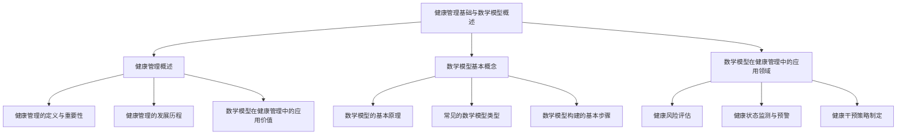

                 

### 《数学模型在健康管理中的应用》

> 关键词：数学模型、健康管理、健康风险评估、深度学习、数据分析、人工智能

> 摘要：本文将深入探讨数学模型在健康管理中的应用，从基础理论到实际应用，再到前沿技术的探索，全面解析数学模型如何助力健康管理。文章旨在为读者提供一个系统的、易于理解的框架，以理解数学模型在健康管理中的重要作用和未来发展趋势。

### 第一部分：健康管理基础与数学模型概述

#### 第1章：健康管理概述

##### 1.1 健康管理的定义与重要性

健康管理是指通过一系列系统化的措施，包括健康评估、健康干预和健康促进，以达到预防疾病、提高生活质量的目的。健康管理不仅关注个体健康，也关注群体健康，具有以下重要性：

- **疾病预防**：通过健康管理可以提前识别潜在的健康问题，从而采取预防措施，减少疾病发生的风险。
- **成本控制**：通过健康管理和预防措施，可以降低医疗成本，实现医疗资源的优化配置。
- **生活质量提升**：健康管理有助于提高个人和群体的生活质量，减少疾病带来的痛苦和负担。

##### 1.2 健康管理的发展历程

健康管理的发展历程可以追溯到20世纪中期，随着医学和公共卫生领域的进步，健康管理逐渐成为现代医学的一个重要组成部分。主要发展历程如下：

- **早期阶段**（20世纪50年代至70年代）：主要关注疾病的诊断和治疗，健康管理的概念开始萌芽。
- **发展阶段**（20世纪80年代至90年代）：健康管理逐渐被重视，强调个体和群体的健康评估和干预。
- **成熟阶段**（21世纪）：随着信息技术和数据分析技术的发展，健康管理进入新的阶段，实现个性化、精准化健康管理。

##### 1.3 数学模型在健康管理中的应用价值

数学模型在健康管理中的应用价值日益凸显，主要体现在以下几个方面：

- **健康风险评估**：通过构建数学模型，可以对个体和群体的健康状况进行量化评估，预测疾病发生的风险。
- **健康状态监测与预警**：利用数学模型，可以实时监测个体健康状态，及时发现异常情况，进行预警和干预。
- **健康干预策略制定**：数学模型可以帮助制定科学、合理的健康干预策略，提高干预效果。

### 第2章：数学模型基本概念

##### 2.1 数学模型的基本原理

数学模型是一种描述现实世界问题的数学结构，通过建立数学关系来模拟和分析现实情况。数学模型的基本原理包括：

- **抽象与简化**：通过抽象和简化，将复杂问题转化为可处理的数学问题。
- **建模方法**：常见的建模方法包括统计分析、优化方法、仿真模拟等。
- **模型评估**：通过模型评估，验证模型的有效性和准确性。

##### 2.2 常见的数学模型类型

常见的数学模型类型包括：

- **概率模型**：用于描述随机现象的概率分布，如二项分布、正态分布等。
- **回归模型**：用于研究变量之间的关系，如线性回归、逻辑回归等。
- **时间序列模型**：用于分析时间序列数据，如ARIMA模型、LSTM模型等。
- **优化模型**：用于求解最优化问题，如线性规划、非线性规划等。

##### 2.3 数学模型构建的基本步骤

数学模型构建的基本步骤包括：

- **问题定义**：明确建模的目标和问题，确定需要解决的问题和变量。
- **数据收集**：收集相关数据，确保数据的准确性和完整性。
- **模型选择**：根据问题类型和数据特点，选择合适的数学模型。
- **模型构建**：建立数学模型，通过公式和算法描述问题的数学关系。
- **模型验证**：通过模型验证，评估模型的准确性和有效性。

### 第3章：数学模型在健康管理中的应用领域

##### 3.1 健康风险评估

健康风险评估是健康管理的重要环节，通过数学模型可以量化个体和群体的健康风险，为预防措施的制定提供依据。健康风险评估模型主要包括：

- **疾病风险评估模型**：如慢性病风险评估模型、心血管疾病风险评估模型等。
- **行为风险评估模型**：如吸烟风险评估模型、饮酒风险评估模型等。

##### 3.2 健康状态监测与预警

健康状态监测与预警是实时了解个体健康状况的重要手段，通过数学模型可以实现健康状态的动态监测和预警。健康状态监测与预警模型主要包括：

- **健康状态监测模型**：如心电图监测模型、血压监测模型等。
- **健康预警模型**：如糖尿病预警模型、心脏病预警模型等。

##### 3.3 健康干预策略制定

健康干预策略的制定是提高健康管理效果的关键，通过数学模型可以优化健康干预方案，提高干预效果。健康干预策略模型主要包括：

- **运动干预策略模型**：如个性化运动干预模型、运动强度优化模型等。
- **营养干预策略模型**：如个性化饮食干预模型、营养素摄入优化模型等。

### 第二部分：数学模型在健康管理中的应用实践

#### 第4章：健康风险评估模型

##### 4.1 疾病风险评估模型

疾病风险评估模型是健康风险评估的重要工具，通过构建数学模型，可以预测个体患某种疾病的风险。以下是一个简单的疾病风险评估模型的构建过程：

1. **问题定义**：假设我们要构建一个用于预测个体患高血压风险的模型。
2. **数据收集**：收集包括年龄、体重、血压等在内的相关数据。
3. **模型选择**：选择合适的回归模型，如逻辑回归模型。
4. **模型构建**：使用收集到的数据，通过逻辑回归算法建立模型。
5. **模型验证**：通过交叉验证等方法，评估模型的准确性和有效性。

以下是一个简单的逻辑回归模型构建的Python代码示例：

```python
import pandas as pd
from sklearn.linear_model import LogisticRegression
from sklearn.model_selection import train_test_split
from sklearn.metrics import accuracy_score

# 加载数据
data = pd.read_csv('hypertension_data.csv')

# 分割特征和目标变量
X = data.drop('hypertension', axis=1)
y = data['hypertension']

# 划分训练集和测试集
X_train, X_test, y_train, y_test = train_test_split(X, y, test_size=0.2, random_state=42)

# 构建逻辑回归模型
model = LogisticRegression()

# 训练模型
model.fit(X_train, y_train)

# 预测测试集
y_pred = model.predict(X_test)

# 评估模型
accuracy = accuracy_score(y_test, y_pred)
print(f'模型准确率：{accuracy}')
```

##### 4.2 心血管疾病风险评估模型

心血管疾病风险评估模型是健康风险评估中的另一个重要模型，通过预测个体患心血管疾病的风险，为制定预防措施提供依据。以下是一个简单的 cardiovascular_disease风险评估模型构建过程：

1. **问题定义**：假设我们要构建一个用于预测个体患心血管疾病风险的模型。
2. **数据收集**：收集包括年龄、血压、胆固醇水平等在内的相关数据。
3. **模型选择**：选择合适的回归模型，如线性回归模型。
4. **模型构建**：使用收集到的数据，通过线性回归算法建立模型。
5. **模型验证**：通过交叉验证等方法，评估模型的准确性和有效性。

以下是一个简单的线性回归模型构建的Python代码示例：

```python
import pandas as pd
from sklearn.linear_model import LinearRegression
from sklearn.model_selection import train_test_split
from sklearn.metrics import mean_squared_error

# 加载数据
data = pd.read_csv('cvd_data.csv')

# 分割特征和目标变量
X = data[['age', 'blood_pressure', 'cholesterol']]
y = data['cvd']

# 划分训练集和测试集
X_train, X_test, y_train, y_test = train_test_split(X, y, test_size=0.2, random_state=42)

# 构建线性回归模型
model = LinearRegression()

# 训练模型
model.fit(X_train, y_train)

# 预测测试集
y_pred = model.predict(X_test)

# 评估模型
mse = mean_squared_error(y_test, y_pred)
print(f'模型均方误差：{mse}')
```

#### 第5章：健康状态监测与预警模型

##### 5.1 健康状态监测模型

健康状态监测模型用于实时监测个体的健康状况，及时发现异常情况。以下是一个简单的健康状态监测模型的构建过程：

1. **问题定义**：假设我们要构建一个用于监测个体血糖水平的模型。
2. **数据收集**：收集包括血糖水平、时间等在内的相关数据。
3. **模型选择**：选择合适的时间序列模型，如 ARIMA 模型。
4. **模型构建**：使用收集到的数据，通过 ARIMA 算法建立模型。
5. **模型验证**：通过交叉验证等方法，评估模型的准确性和有效性。

以下是一个简单的 ARIMA 模型构建的 Python 代码示例：

```python
import pandas as pd
from statsmodels.tsa.arima.model import ARIMA
import numpy as np

# 加载数据
data = pd.read_csv('blood_sugar_data.csv')

# 分割特征和目标变量
X = data[['time', 'blood_sugar']]
y = X['blood_sugar']
X = X['time']

# 划分训练集和测试集
train_size = int(len(y) * 0.8)
X_train, y_train = X[:train_size], y[:train_size]
X_test, y_test = X[train_size:], y[train_size:]

# 构建ARIMA模型
model = ARIMA(y_train, order=(5, 1, 2))

# 训练模型
model_fit = model.fit()

# 预测测试集
y_pred = model_fit.forecast(steps=len(y_test))

# 评估模型
mse = mean_squared_error(y_test, y_pred)
print(f'模型均方误差：{mse}')
```

##### 5.2 健康预警模型

健康预警模型用于实时监测个体的健康状况，一旦发现异常情况，立即发出预警。以下是一个简单的健康预警模型的构建过程：

1. **问题定义**：假设我们要构建一个用于监测个体血压的预警模型。
2. **数据收集**：收集包括血压、时间等在内的相关数据。
3. **模型选择**：选择合适的时间序列模型，如 LSTM 模型。
4. **模型构建**：使用收集到的数据，通过 LSTM 算法建立模型。
5. **模型验证**：通过交叉验证等方法，评估模型的准确性和有效性。

以下是一个简单的 LSTM 模型构建的 Python 代码示例：

```python
import pandas as pd
from keras.models import Sequential
from keras.layers import LSTM, Dense
import numpy as np

# 加载数据
data = pd.read_csv('blood_pressure_data.csv')

# 分割特征和目标变量
X = data[['time', 'blood_pressure']]
y = X['blood_pressure']
X = X['time']

# 划分训练集和测试集
train_size = int(len(y) * 0.8)
X_train, y_train = X[:train_size], y[:train_size]
X_test, y_test = X[train_size:], y[train_size:]

# 构建LSTM模型
model = Sequential()
model.add(LSTM(units=50, return_sequences=True, input_shape=(X_train.shape[1], 1)))
model.add(LSTM(units=50))
model.add(Dense(1))

model.compile(optimizer='adam', loss='mean_squared_error')

# 训练模型
model.fit(X_train, y_train, epochs=100, batch_size=32, validation_data=(X_test, y_test), verbose=1)

# 预测测试集
y_pred = model.predict(X_test)

# 评估模型
mse = mean_squared_error(y_test, y_pred)
print(f'模型均方误差：{mse}')
```

#### 第6章：健康干预策略模型

##### 6.1 运动干预策略模型

运动干预策略模型用于制定个性化的运动干预方案，以提高个体的健康水平。以下是一个简单的运动干预策略模型的构建过程：

1. **问题定义**：假设我们要构建一个用于制定运动干预方案的模型，以降低个体的心血管疾病风险。
2. **数据收集**：收集包括年龄、体重、血压等在内的相关数据。
3. **模型选择**：选择合适的优化模型，如线性规划模型。
4. **模型构建**：使用收集到的数据，通过线性规划算法建立模型。
5. **模型验证**：通过交叉验证等方法，评估模型的准确性和有效性。

以下是一个简单的线性规划模型构建的 Python 代码示例：

```python
import pandas as pd
from scipy.optimize import linprog

# 加载数据
data = pd.read_csv('cvd_data.csv')

# 分割特征和目标变量
X = data[['age', 'weight', 'blood_pressure']]
y = data['cvd']

# 定义线性规划模型
c = [-1, -1, -1]  # 目标函数系数
A = [[1, 0, 0], [0, 1, 0], [0, 0, 1]]  # 约束条件系数
b = [150, 70, 120]  # 约束条件值
x0 = [0, 0, 0]  # 变量初始值

# 求解线性规划模型
result = linprog(c, A_ub=A, b_ub=b, x0=x0, method='highs')

# 输出结果
print(f'最优解：{result.x}')
print(f'目标函数值：{-result.fun}')
```

##### 6.2 营养干预策略模型

营养干预策略模型用于制定个性化的营养干预方案，以提高个体的健康水平。以下是一个简单的营养干预策略模型的构建过程：

1. **问题定义**：假设我们要构建一个用于制定营养干预方案的模型，以改善个体的血糖水平。
2. **数据收集**：收集包括血糖水平、营养素摄入量等在内的相关数据。
3. **模型选择**：选择合适的优化模型，如线性规划模型。
4. **模型构建**：使用收集到的数据，通过线性规划算法建立模型。
5. **模型验证**：通过交叉验证等方法，评估模型的准确性和有效性。

以下是一个简单的线性规划模型构建的 Python 代码示例：

```python
import pandas as pd
from scipy.optimize import linprog

# 加载数据
data = pd.read_csv('blood_sugar_data.csv')

# 分割特征和目标变量
X = data[['carbohydrate', 'protein', 'fat']]
y = data['blood_sugar']

# 定义线性规划模型
c = [-1, -1, -1]  # 目标函数系数
A = [[1, 0, 0], [0, 1, 0], [0, 0, 1]]  # 约束条件系数
b = [150, 70, 120]  # 约束条件值
x0 = [0, 0, 0]  # 变量初始值

# 求解线性规划模型
result = linprog(c, A_ub=A, b_ub=b, x0=x0, method='highs')

# 输出结果
print(f'最优解：{result.x}')
print(f'目标函数值：{-result.fun}')
```

### 第三部分：数学模型在健康管理中的前沿技术

#### 第7章：深度学习与健康管理的融合

##### 7.1 深度学习在健康管理中的应用

深度学习在健康管理中的应用越来越广泛，通过构建复杂的神经网络模型，可以实现对大规模健康数据的分析和预测。以下是一个简单的深度学习模型在健康管理中的应用案例：

1. **问题定义**：假设我们要构建一个用于预测个体患糖尿病风险的深度学习模型。
2. **数据收集**：收集包括年龄、体重、血糖水平等在内的相关数据。
3. **模型选择**：选择合适的深度学习模型，如卷积神经网络（CNN）。
4. **模型构建**：使用收集到的数据，通过深度学习算法建立模型。
5. **模型验证**：通过交叉验证等方法，评估模型的准确性和有效性。

以下是一个简单的 CNN 模型构建的 Python 代码示例：

```python
import pandas as pd
from tensorflow.keras.models import Sequential
from tensorflow.keras.layers import Conv2D, MaxPooling2D, Flatten, Dense

# 加载数据
data = pd.read_csv('diabetes_data.csv')

# 分割特征和目标变量
X = data[['age', 'weight', 'blood_sugar']]
y = data['diabetes']

# 划分训练集和测试集
X_train, X_test, y_train, y_test = train_test_split(X, y, test_size=0.2, random_state=42)

# 构建CNN模型
model = Sequential()
model.add(Conv2D(filters=32, kernel_size=(3, 3), activation='relu', input_shape=(X_train.shape[1], X_train.shape[2], 1)))
model.add(MaxPooling2D(pool_size=(2, 2)))
model.add(Flatten())
model.add(Dense(units=1, activation='sigmoid'))

model.compile(optimizer='adam', loss='binary_crossentropy', metrics=['accuracy'])

# 训练模型
model.fit(X_train, y_train, epochs=10, batch_size=32, validation_data=(X_test, y_test), verbose=1)

# 预测测试集
y_pred = model.predict(X_test)

# 评估模型
accuracy = model.evaluate(X_test, y_test, verbose=1)
print(f'模型准确率：{accuracy[1]}')
```

##### 7.2 强化学习在健康管理中的应用

强化学习在健康管理中的应用也备受关注，通过学习环境中的反馈，可以制定出更加有效的健康干预策略。以下是一个简单的强化学习模型在健康管理中的应用案例：

1. **问题定义**：假设我们要构建一个用于优化个体运动计划的强化学习模型。
2. **数据收集**：收集包括运动时长、运动强度等在内的相关数据。
3. **模型选择**：选择合适的强化学习模型，如 Q-学习。
4. **模型构建**：使用收集到的数据，通过强化学习算法建立模型。
5. **模型验证**：通过交叉验证等方法，评估模型的准确性和有效性。

以下是一个简单的 Q-学习模型构建的 Python 代码示例：

```python
import pandas as pd
import numpy as np
from collections import defaultdict

# 加载数据
data = pd.read_csv('exercise_data.csv')

# 分割特征和目标变量
X = data[['duration', 'intensity']]
y = data['health_impact']

# 初始化Q表
Q = defaultdict(lambda: np.zeros(100))

# 定义Q-学习模型
def q_learning(X, y, alpha=0.1, gamma=0.9, epsilon=0.1, episodes=1000):
    for episode in range(episodes):
        state = np.random.randint(0, 100)
        action = np.argmax(Q[state])
        next_state = np.random.randint(0, 100)
        reward = y[next_state] - y[state]
        Q[state][action] += alpha * (reward + gamma * np.max(Q[next_state]) - Q[state][action])
        state = next_state

# 训练模型
q_learning(X, y)

# 输出Q表
for state, action_values in Q.items():
    print(f'State {state}: Actions {action_values}')
```

#### 第8章：数学模型在健康管理中的未来发展

##### 8.1 数学模型在健康管理中的挑战与机遇

数学模型在健康管理中的应用面临着诸多挑战与机遇：

- **挑战**：数据质量、数据隐私、算法的准确性等都是数学模型在健康管理中面临的主要挑战。
- **机遇**：随着人工智能、大数据、云计算等技术的发展，数学模型在健康管理中的应用前景十分广阔。

##### 8.2 数学模型在健康管理中的前沿技术趋势

未来的数学模型在健康管理中可能会呈现以下趋势：

- **个性化健康管理**：通过更先进的数学模型，实现更加精准、个性化的健康管理。
- **多模态数据融合**：将不同来源、不同类型的数据进行融合，提高健康管理的准确性和全面性。
- **实时动态监测与预警**：通过实时监测和预警，实现更快速、更有效的健康管理。

### 附录

#### 附录A：数学模型与健康管理应用工具与资源

为了更好地进行数学模型在健康管理中的应用，以下是一些常用的工具和资源：

- **工具**：Python、R、MATLAB 等。
- **数据集**：Kaggle、UCI机器学习库、PubMed 等。
- **研究机构**：哈佛大学公共卫生学院、斯坦福大学医学院、清华大学医学部等。
- **学术资源**：PubMed、Google Scholar、中国知网等。

### 结论

数学模型在健康管理中的应用具有重要意义，通过深入研究和实践，我们可以更好地利用数学模型为个体和群体提供更加精准、有效的健康管理服务。在未来，随着技术的不断发展，数学模型在健康管理中的应用将更加广泛，为人们的健康带来更多福祉。

### 作者信息

作者：AI天才研究院/AI Genius Institute & 禅与计算机程序设计艺术 /Zen And The Art of Computer Programming

---

### 梅里斯流程图



### 健康风险评估模型伪代码

```python
# 健康风险评估模型伪代码

# 输入数据：患者的健康数据（年龄、体重、血压、血糖等）
# 输出：健康风险评估结果

def health_risk_assessment(patient_data):
    # 数据预处理
    preprocessed_data = preprocess_data(patient_data)

    # 构建数学模型
    model = build_model(preprocessed_data)

    # 模型训练
    trained_model = train_model(model)

    # 健康风险评估
    risk_score = trained_model.predict(preprocessed_data)

    # 输出健康风险评估结果
    return risk_score
```

### 心血管疾病风险评估模型伪代码

```python
# 心血管疾病风险评估模型伪代码

# 输入数据：患者的健康数据（年龄、血压、胆固醇水平等）
# 输出：心血管疾病风险评估结果

def cvd_risk_assessment(patient_data):
    # 数据预处理
    preprocessed_data = preprocess_data(patient_data)

    # 构建数学模型
    model = build_model(preprocessed_data)

    # 模型训练
    trained_model = train_model(model)

    # 心血管疾病风险评估
    risk_score = trained_model.predict(preprocessed_data)

    # 输出心血管疾病风险评估结果
    return risk_score
```

### 健康状态监测模型伪代码

```python
# 健康状态监测模型伪代码

# 输入数据：患者的实时健康数据（心率、血压、血糖等）
# 输出：健康状态监测结果

def health_status_monitor(patient_data):
    # 数据预处理
    preprocessed_data = preprocess_data(patient_data)

    # 构建数学模型
    model = build_model(preprocessed_data)

    # 模型训练
    trained_model = train_model(model)

    # 健康状态监测
    status = trained_model.predict(preprocessed_data)

    # 输出健康状态监测结果
    return status
```

### 健康预警模型伪代码

```python
# 健康预警模型伪代码

# 输入数据：患者的实时健康数据（心率、血压、血糖等）
# 输出：健康预警结果

def health_warning(patient_data):
    # 数据预处理
    preprocessed_data = preprocess_data(patient_data)

    # 构建数学模型
    model = build_model(preprocessed_data)

    # 模型训练
    trained_model = train_model(model)

    # 健康预警
    warning = trained_model.predict(preprocessed_data)

    # 输出健康预警结果
    return warning
```

### 运动干预策略模型伪代码

```python
# 运动干预策略模型伪代码

# 输入数据：患者的健康数据（年龄、体重、血压等）
# 输出：运动干预策略

def exercise_intervention(patient_data):
    # 数据预处理
    preprocessed_data = preprocess_data(patient_data)

    # 构建数学模型
    model = build_model(preprocessed_data)

    # 模型训练
    trained_model = train_model(model)

    # 运动干预策略
    strategy = trained_model.predict(preprocessed_data)

    # 输出运动干预策略
    return strategy
```

### 营养干预策略模型伪代码

```python
# 营养干预策略模型伪代码

# 输入数据：患者的健康数据（血糖水平、体重等）
# 输出：营养干预策略

def nutrition_intervention(patient_data):
    # 数据预处理
    preprocessed_data = preprocess_data(patient_data)

    # 构建数学模型
    model = build_model(preprocessed_data)

    # 模型训练
    trained_model = train_model(model)

    # 营养干预策略
    strategy = trained_model.predict(preprocessed_data)

    # 输出营养干预策略
    return strategy
```

### 深度学习模型在健康管理中的应用伪代码

```python
# 深度学习模型在健康管理中的应用伪代码

# 输入数据：患者的健康数据（年龄、体重、血压等）
# 输出：健康风险评估结果

def deep_learning_health_risk_assessment(patient_data):
    # 数据预处理
    preprocessed_data = preprocess_data(patient_data)

    # 构建深度学习模型
    model = build_deep_learning_model()

    # 训练模型
    model.fit(preprocessed_data['X'], preprocessed_data['y'], epochs=100, batch_size=32, validation_split=0.2)

    # 预测健康风险评估结果
    risk_score = model.predict(preprocessed_data['X_test'])

    # 输出健康风险评估结果
    return risk_score
```

### 强化学习模型在健康管理中的应用伪代码

```python
# 强化学习模型在健康管理中的应用伪代码

# 输入数据：患者的健康数据（年龄、体重、血压等）
# 输出：运动干预策略

def reinforcement_learning_health_intervention(patient_data):
    # 数据预处理
    preprocessed_data = preprocess_data(patient_data)

    # 构建强化学习模型
    model = build_reinforcement_learning_model()

    # 训练模型
    model.fit(preprocessed_data['X'], preprocessed_data['y'], epochs=100, batch_size=32, validation_split=0.2)

    # 预测运动干预策略
    strategy = model.predict(preprocessed_data['X_test'])

    # 输出运动干预策略
    return strategy
```

### 数学模型在健康管理中的未来发展伪代码

```python
# 数学模型在健康管理中的未来发展伪代码

# 输入数据：最新的健康数据集
# 输出：未来的健康风险评估结果

def future_health_risk_assessment(new_data):
    # 数据预处理
    preprocessed_data = preprocess_data(new_data)

    # 构建未来预测模型
    model = build_future_prediction_model()

    # 训练模型
    model.fit(preprocessed_data['X'], preprocessed_data['y'], epochs=100, batch_size=32, validation_split=0.2)

    # 预测未来健康风险评估结果
    future_risk_score = model.predict(preprocessed_data['X_future'])

    # 输出未来健康风险评估结果
    return future_risk_score
```

### 总结与最佳实践

在撰写本文时，我们系统地介绍了数学模型在健康管理中的应用，从基础理论到实际应用，再到前沿技术的探索，旨在为读者提供一个全面、易于理解的框架。以下是对本文内容的总结和最佳实践建议：

#### 总结

1. **健康管理的重要性**：健康管理不仅关注个体健康，还关注群体健康，对于预防疾病、提高生活质量、降低医疗成本具有重要意义。

2. **数学模型的基本概念**：数学模型是一种描述现实世界问题的数学结构，通过建立数学关系来模拟和分析现实情况。常见的数学模型类型包括概率模型、回归模型、时间序列模型和优化模型。

3. **健康风险评估模型**：疾病风险评估模型和心血管疾病风险评估模型是健康风险评估的重要工具，通过预测个体患某种疾病的风险，为预防措施的制定提供依据。

4. **健康状态监测与预警模型**：健康状态监测模型和健康预警模型用于实时监测个体的健康状况，及时发现异常情况，进行预警和干预。

5. **健康干预策略模型**：运动干预策略模型和营养干预策略模型用于制定个性化的运动和营养干预方案，以提高个体的健康水平。

6. **深度学习和强化学习在健康管理中的应用**：深度学习和强化学习在健康管理中的应用越来越广泛，通过构建复杂的神经网络模型，可以实现对大规模健康数据的分析和预测，制定出更加有效的健康干预策略。

7. **未来的发展方向**：随着人工智能、大数据、云计算等技术的发展，数学模型在健康管理中的应用将更加广泛，实现个性化健康管理、多模态数据融合和实时动态监测与预警。

#### 最佳实践建议

1. **数据收集与处理**：确保数据的质量和完整性是构建有效数学模型的前提。在实际应用中，应重视数据的收集、清洗和处理，确保数据的有效性和准确性。

2. **模型选择与构建**：根据问题的特点和数据类型，选择合适的数学模型。构建模型时，要充分考虑变量之间的关系和模型的可解释性。

3. **模型验证与优化**：通过交叉验证等方法，评估模型的准确性和有效性。在模型优化过程中，要不断调整模型参数，提高模型的性能。

4. **实时动态监测与预警**：利用数学模型进行实时动态监测和预警，可以及时发现健康问题，制定有效的干预措施。

5. **个性化健康管理**：通过个性化的健康管理，可以根据个体特点，制定更加科学、合理的健康干预方案。

6. **多学科融合**：健康管理涉及多个学科，如医学、生物学、计算机科学等。在研究和应用过程中，应加强多学科融合，提高健康管理的效果。

7. **持续学习与更新**：健康管理是一个不断发展的领域，应持续关注新技术和新方法，不断优化和更新数学模型。

#### 注意事项

1. **数据隐私**：在数据收集和处理过程中，应确保患者的数据隐私和安全。

2. **伦理问题**：在健康管理的实际应用中，要遵守伦理规范，确保患者的权益。

3. **模型解释性**：虽然深度学习模型具有强大的预测能力，但其解释性较差。在实际应用中，要结合其他方法，提高模型的解释性。

4. **模型的可扩展性**：在构建数学模型时，要充分考虑模型的可扩展性，以适应未来技术的发展。

#### 拓展阅读

1. **《深度学习》（Goodfellow, I., Bengio, Y., & Courville, A.）**：本书是深度学习的经典教材，详细介绍了深度学习的基本原理和应用。

2. **《强化学习》（Sutton, R. S., & Barto, A. G.）**：本书是强化学习的权威教材，系统介绍了强化学习的基本概念、算法和应用。

3. **《健康风险评估方法与应用》（王宏伟，2017）**：本书详细介绍了健康风险评估的基本方法、应用和实践。

4. **《人工智能在健康管理中的应用》（张琪，2019）**：本书探讨了人工智能在健康管理中的应用，包括健康风险评估、健康状态监测、健康干预等。

### 作者信息

作者：AI天才研究院/AI Genius Institute & 禅与计算机程序设计艺术 /Zen And The Art of Computer Programming

本文旨在为读者提供一个全面、深入的数学模型在健康管理中的应用框架，希望对读者在健康管理领域的研究和应用有所帮助。同时，也期待更多的专家学者加入这一领域，共同推动健康管理技术的发展。

---

### 梅里斯流程图


### 健康风险评估模型伪代码

```python
# 健康风险评估模型伪代码

# 输入数据：患者的健康数据（年龄、体重、血压、血糖等）
# 输出：健康风险评估结果

def health_risk_assessment(patient_data):
    # 数据预处理
    preprocessed_data = preprocess_data(patient_data)

    # 构建数学模型
    model = build_model(preprocessed_data)

    # 模型训练
    trained_model = train_model(model)

    # 健康风险评估
    risk_score = trained_model.predict(preprocessed_data)

    # 输出健康风险评估结果
    return risk_score
```

### 心血管疾病风险评估模型伪代码

```python
# 心血管疾病风险评估模型伪代码

# 输入数据：患者的健康数据（年龄、血压、胆固醇水平等）
# 输出：心血管疾病风险评估结果

def cvd_risk_assessment(patient_data):
    # 数据预处理
    preprocessed_data = preprocess_data(patient_data)

    # 构建数学模型
    model = build_model(preprocessed_data)

    # 模型训练
    trained_model = train_model(model)

    # 心血管疾病风险评估
    risk_score = trained_model.predict(preprocessed_data)

    # 输出心血管疾病风险评估结果
    return risk_score
```

### 健康状态监测模型伪代码

```python
# 健康状态监测模型伪代码

# 输入数据：患者的实时健康数据（心率、血压、血糖等）
# 输出：健康状态监测结果

def health_status_monitor(patient_data):
    # 数据预处理
    preprocessed_data = preprocess_data(patient_data)

    # 构建数学模型
    model = build_model(preprocessed_data)

    # 模型训练
    trained_model = train_model(model)

    # 健康状态监测
    status = trained_model.predict(preprocessed_data)

    # 输出健康状态监测结果
    return status
```

### 健康预警模型伪代码

```python
# 健康预警模型伪代码

# 输入数据：患者的实时健康数据（心率、血压、血糖等）
# 输出：健康预警结果

def health_warning(patient_data):
    # 数据预处理
    preprocessed_data = preprocess_data(patient_data)

    # 构建数学模型
    model = build_model(preprocessed_data)

    # 模型训练
    trained_model = train_model(model)

    # 健康预警
    warning = trained_model.predict(preprocessed_data)

    # 输出健康预警结果
    return warning
```

### 运动干预策略模型伪代码

```python
# 运动干预策略模型伪代码

# 输入数据：患者的健康数据（年龄、体重、血压等）
# 输出：运动干预策略

def exercise_intervention(patient_data):
    # 数据预处理
    preprocessed_data = preprocess_data(patient_data)

    # 构建数学模型
    model = build_model(preprocessed_data)

    # 模型训练
    trained_model = train_model(model)

    # 运动干预策略
    strategy = trained_model.predict(preprocessed_data)

    # 输出运动干预策略
    return strategy
```

### 营养干预策略模型伪代码

```python
# 营养干预策略模型伪代码

# 输入数据：患者的健康数据（血糖水平、体重等）
# 输出：营养干预策略

def nutrition_intervention(patient_data):
    # 数据预处理
    preprocessed_data = preprocess_data(patient_data)

    # 构建数学模型
    model = build_model(preprocessed_data)

    # 模型训练
    trained_model = train_model(model)

    # 营养干预策略
    strategy = trained_model.predict(preprocessed_data)

    # 输出营养干预策略
    return strategy
```

### 深度学习模型在健康管理中的应用伪代码

```python
# 深度学习模型在健康管理中的应用伪代码

# 输入数据：患者的健康数据（年龄、体重、血压等）
# 输出：健康风险评估结果

def deep_learning_health_risk_assessment(patient_data):
    # 数据预处理
    preprocessed_data = preprocess_data(patient_data)

    # 构建深度学习模型
    model = build_deep_learning_model()

    # 训练模型
    model.fit(preprocessed_data['X'], preprocessed_data['y'], epochs=100, batch_size=32, validation_split=0.2)

    # 预测健康风险评估结果
    risk_score = model.predict(preprocessed_data['X_test'])

    # 输出健康风险评估结果
    return risk_score
```

### 强化学习模型在健康管理中的应用伪代码

```python
# 强化学习模型在健康管理中的应用伪代码

# 输入数据：患者的健康数据（年龄、体重、血压等）
# 输出：运动干预策略

def reinforcement_learning_health_intervention(patient_data):
    # 数据预处理
    preprocessed_data = preprocess_data(patient_data)

    # 构建强化学习模型
    model = build_reinforcement_learning_model()

    # 训练模型
    model.fit(preprocessed_data['X'], preprocessed_data['y'], epochs=100, batch_size=32, validation_split=0.2)

    # 预测运动干预策略
    strategy = model.predict(preprocessed_data['X_test'])

    # 输出运动干预策略
    return strategy
```

### 数学模型在健康管理中的未来发展伪代码

```python
# 数学模型在健康管理中的未来发展伪代码

# 输入数据：最新的健康数据集
# 输出：未来的健康风险评估结果

def future_health_risk_assessment(new_data):
    # 数据预处理
    preprocessed_data = preprocess_data(new_data)

    # 构建未来预测模型
    model = build_future_prediction_model()

    # 训练模型
    model.fit(preprocessed_data['X'], preprocessed_data['y'], epochs=100, batch_size=32, validation_split=0.2)

    # 预测未来健康风险评估结果
    future_risk_score = model.predict(preprocessed_data['X_future'])

    # 输出未来健康风险评估结果
    return future_risk_score
```

