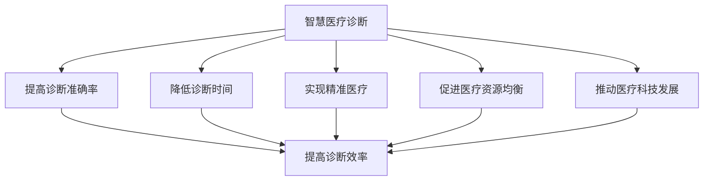

                 

### 1.1 研究背景与意义

#### 研究背景

随着信息技术的飞速发展，大数据、人工智能和物联网等技术在各个领域得到了广泛应用，医疗领域也不例外。智慧医疗作为医疗信息化的重要组成部分，通过融合现代信息技术，旨在提高医疗服务的效率、质量和可及性。智慧医疗诊断作为智慧医疗的核心应用之一，通过运用先进的数学模型和算法，能够显著提升疾病诊断的准确性、速度和覆盖范围。

传统的医疗诊断主要依赖于医生的经验和直觉，这种方式存在一定的局限性。首先，医生的经验和知识有限，难以应对日益复杂的病例。其次，医生的工作强度大，诊断速度受限，难以满足日益增长的医疗需求。此外，医疗资源分布不均，部分偏远地区的居民难以享受到优质的医疗服务。因此，探索和应用新的诊断方法，尤其是基于数学模型的智能诊断技术，具有重要的现实意义。

#### 研究意义

数学模型在智慧医疗诊断中的应用，具有以下几个方面的意义：

1. **提高诊断准确率**：通过机器学习和深度学习等技术，智能诊断系统能够从海量数据中学习，提取出有效的特征，从而提高诊断的准确性。

2. **降低诊断时间**：智能诊断系统可以自动处理和分析数据，大大缩短了诊断的时间，提高了医疗效率。

3. **实现精准医疗**：基于个体化差异，数学模型可以帮助医生制定更加精准的治疗方案，提高治疗效果。

4. **促进医疗资源均衡**：通过远程医疗和移动医疗等技术，智能诊断系统可以帮助偏远地区的医生更好地服务患者，实现医疗资源的均衡分配。

5. **推动医疗科技发展**：数学模型的应用不仅提高了医疗诊断的效率和质量，还推动了医疗科技的不断创新和发展。

总之，数学模型在智慧医疗诊断中的应用，为医疗领域带来了革命性的变革，具有重要的理论和实践意义。接下来的章节中，我们将详细探讨智慧医疗诊断的基本概念、数学模型及其应用实例，深入分析这一领域的发展趋势和挑战。$$

```<div id="mermaid-1" class="mermaid"></div>



```### 1.2 研究目标与内容安排

#### 研究目标

本研究的主要目标是探讨数学模型在智慧医疗诊断中的应用，具体包括以下几个方面：

1. **理解智慧医疗诊断的基本概念和流程**：明确智慧医疗诊断的定义、特点和基本流程，为后续研究提供基础。

2. **介绍常见的数学模型**：详细阐述机器学习和深度学习中的常见数学模型，包括监督学习模型、非监督学习模型和深度学习模型，为应用提供理论基础。

3. **分析数学模型在智慧医疗诊断中的应用实例**：通过具体案例，展示数学模型在图像诊断和语音诊断等领域的应用，分析其效果和局限性。

4. **探讨数据管理和隐私保护问题**：讨论在智慧医疗诊断中如何管理和保护患者数据，确保数据的安全性和隐私性。

5. **分析法律与伦理问题**：研究智慧医疗诊断相关的法律法规，探讨其在法律和伦理层面的问题和挑战。

6. **总结与展望**：总结研究的主要成果，分析存在的问题和挑战，展望未来的发展趋势和研究方向。

#### 内容安排

本文将按照以下结构展开：

- **第1章 引言**：介绍研究的背景、意义、目标与内容安排。
- **第2章 智慧医疗诊断的基本概念与流程**：阐述智慧医疗诊断的定义、特点、基本流程以及面临的挑战与机遇。
- **第3章 常见的数学模型介绍**：介绍机器学习和深度学习中的常见数学模型，包括监督学习模型、非监督学习模型和深度学习模型。
- **第4章 数学模型在智慧医疗诊断中的应用实例**：通过具体案例展示数学模型在图像诊断和语音诊断中的应用。
- **第5章 智慧医疗诊断中的数据管理和隐私保护**：讨论数据管理和隐私保护问题。
- **第6章 智慧医疗诊断中的法律与伦理问题**：分析相关的法律法规和伦理问题。
- **第7章 总结与展望**：总结研究的主要成果，分析存在的问题和挑战，展望未来的发展趋势和研究方向。

通过以上内容安排，本文旨在全面探讨数学模型在智慧医疗诊断中的应用，为相关研究和实践提供参考。$$

### 1.3 主要数学模型介绍

在智慧医疗诊断中，数学模型的选择和运用至关重要。以下是本文将要介绍的主要数学模型，这些模型涵盖了机器学习和深度学习领域，是智慧医疗诊断的重要工具。

#### 3.1 机器学习模型

机器学习模型是智慧医疗诊断中最常用的模型之一，它们通过从数据中学习规律和模式，从而实现对未知数据的预测和分类。

##### 3.1.1 监督学习模型

监督学习模型是最基本的机器学习模型，其核心思想是通过已知的输入和输出对模型进行训练，从而预测新的输出。以下是几种常见的监督学习模型：

1. **线性回归（Linear Regression）**

线性回归是一种简单的监督学习模型，它通过拟合一条直线来预测目标变量。其数学模型可以表示为：
   $$ y = w_0 + w_1 \cdot x $$
   其中，$y$ 是目标变量，$x$ 是输入特征，$w_0$ 和 $w_1$ 是模型的参数。

2. **决策树（Decision Tree）**

决策树通过一系列的判断规则将数据集划分为多个子集，每个子集对应一个预测结果。其基本结构包括根节点、内部节点和叶节点，其中叶节点表示最终的预测结果。

3. **支持向量机（Support Vector Machine, SVM）**

支持向量机是一种强大的分类模型，它通过寻找一个最优的超平面来分隔不同类别的数据点。其目标是最小化分类间隔（margin），数学模型可以表示为：
   $$ \min_{w, b} \frac{1}{2} ||w||^2 $$
   使得对任意数据点 $(x_i, y_i)$，满足：
   $$ y_i ( \langle w, x_i \rangle + b ) \geq 1 $$

##### 3.1.2 非监督学习模型

非监督学习模型主要用于发现数据中的隐藏结构和模式，而不需要预先标记的标签。以下是几种常见的非监督学习模型：

1. **聚类算法（Clustering Algorithms）**

聚类算法将数据集划分为多个聚类，每个聚类内部的点相互之间距离较近，而不同聚类之间的点距离较远。常见的聚类算法包括K-Means、DBSCAN等。

2. **维度降低算法（Dimensionality Reduction Algorithms）**

维度降低算法通过降维技术减少数据集的维度，从而提高计算效率和模型性能。常见的维度降低算法包括主成分分析（PCA）、线性判别分析（LDA）等。

##### 3.1.3 深度学习模型

深度学习模型是机器学习的一个分支，其核心思想是通过多层神经网络模拟人脑的学习过程，从而实现对复杂模式的识别和预测。以下是两种主要的深度学习模型：

1. **卷积神经网络（Convolutional Neural Network, CNN）**

卷积神经网络是一种专门用于图像识别和处理的深度学习模型，其核心结构是卷积层和池化层。卷积层通过卷积操作提取图像的特征，而池化层则用于降低数据维度，减少计算量。

2. **循环神经网络（Recurrent Neural Network, RNN）**

循环神经网络是一种用于处理序列数据的深度学习模型，其核心结构是循环单元。RNN能够通过记忆机制对序列中的每个元素进行建模，从而实现对序列数据的分析和预测。

#### 3.2 深度学习模型的应用

深度学习模型在智慧医疗诊断中的应用广泛，特别是在图像诊断和语音诊断领域。以下是两个具体的应用示例：

1. **图像诊断**

在图像诊断中，深度学习模型可以用于多种疾病的自动检测和诊断，如肺癌、乳腺癌等。常见的应用包括：

   - **肺部疾病诊断**：使用卷积神经网络对肺部CT图像进行自动分析，识别肺部结节和病变。
   - **眼底病变诊断**：使用深度学习模型分析眼底图像，诊断糖尿病视网膜病变等。

2. **语音诊断**

在语音诊断中，深度学习模型可以用于声音信号的分析和疾病的诊断，如喉咙疾病、呼吸道疾病等。常见的应用包括：

   - **声音信号处理**：使用循环神经网络对声音信号进行特征提取和分类，识别不同的声音特征。
   - **喉咙疾病诊断**：通过分析患者的语音，识别声音的变化，诊断喉咙疾病。

通过以上介绍，我们可以看到数学模型在智慧医疗诊断中的应用是多样且重要的。接下来，我们将进一步探讨智慧医疗诊断的基本概念与流程，为深入理解这些数学模型的应用提供基础。$$

### 3.2 深度学习模型

深度学习模型是当前人工智能领域中最热门的研究方向之一，其在图像识别、自然语言处理和医疗诊断等领域取得了显著的成果。本节将详细介绍两种主要的深度学习模型：卷积神经网络（CNN）和循环神经网络（RNN）。

#### 3.2.1 卷积神经网络（CNN）

卷积神经网络是一种专为处理图像数据设计的深度学习模型，其核心思想是通过卷积操作和池化操作提取图像的特征，从而实现图像的分类和识别。以下是CNN的基本结构和应用。

##### 3.2.1.1 CNN的基本结构

1. **输入层**：输入层接收原始图像数据，通常为一个三维张量，其中第一维表示图像的宽，第二维表示图像的高，第三维表示图像的通道数（如RGB三通道）。

2. **卷积层**：卷积层是CNN的核心部分，通过卷积操作提取图像的特征。卷积操作通过滑动卷积核在输入图像上逐像素进行卷积，生成一个特征图。卷积层的参数包括卷积核的大小、步长和填充方式。

3. **激活函数**：为了引入非线性，卷积层后通常会添加激活函数，如ReLU函数，将输出值转换为正数，增强网络的非线性表达能力。

4. **池化层**：池化层用于降低数据维度，减少计算量，提高模型的泛化能力。常见的池化操作包括最大池化和平均池化。

5. **全连接层**：全连接层将卷积层和池化层提取的特征映射到输出层，进行分类或回归任务。全连接层的参数是模型中权重矩阵和偏置项。

6. **输出层**：输出层根据具体的任务进行设计，如分类任务使用softmax函数输出概率分布，回归任务使用线性函数输出连续值。

##### 3.2.1.2 CNN在图像处理中的应用

CNN在图像处理中的应用非常广泛，以下是一些典型的应用实例：

1. **图像分类**：通过训练好的CNN模型，可以自动识别和分类图像中的物体，如ImageNet图像分类任务。

2. **目标检测**：CNN结合区域建议（Region Proposal）和分类器，可以实现对图像中多个目标物体的定位和识别，如YOLO、SSD等目标检测算法。

3. **图像分割**：CNN通过边缘检测和像素分类，可以将图像划分为不同的区域，如FCN、U-Net等图像分割算法。

4. **超分辨率重建**：通过训练好的CNN模型，可以恢复图像的高分辨率版本，提高图像的清晰度和质量。

#### 3.2.2 循环神经网络（RNN）

循环神经网络是一种专门用于处理序列数据的深度学习模型，其核心思想是通过循环结构实现对序列中每个元素的建模。以下是RNN的基本结构和应用。

##### 3.2.2.1 RNN的基本结构

1. **输入层**：输入层接收序列数据，每个时间步的输入是一个向量。

2. **隐藏层**：隐藏层包含多个神经元，每个神经元都与前一个时间步的隐藏状态进行连接，并通过循环权重传递信息。

3. **循环权重**：循环权重使得信息可以在不同时间步之间传递，实现序列的记忆功能。

4. **输出层**：输出层根据具体的任务进行设计，如分类任务使用softmax函数输出概率分布，回归任务使用线性函数输出连续值。

##### 3.2.2.2 RNN在序列数据处理中的应用

RNN在序列数据处理中具有广泛的应用，以下是一些典型的应用实例：

1. **自然语言处理**：RNN可以用于文本分类、情感分析、机器翻译等自然语言处理任务，通过处理文本序列，提取语言特征。

2. **语音识别**：RNN可以用于语音信号的建模和识别，通过处理语音序列，实现语音到文本的转换。

3. **时间序列分析**：RNN可以用于时间序列数据的预测和建模，如股票价格预测、天气预测等。

4. **音乐生成**：RNN可以用于生成音乐，通过处理音乐序列，生成新的音乐片段。

综上所述，CNN和RNN是深度学习领域的两个重要模型，分别适用于图像处理和序列数据处理。在智慧医疗诊断中，这些模型被广泛应用于图像诊断和语音诊断等领域，为提高诊断的准确性和效率提供了有力支持。接下来，我们将探讨数学模型在智慧医疗诊断中的应用实例，进一步展示这些模型在实际医疗诊断中的具体应用。$$

### 4.1 图像诊断

图像诊断是智慧医疗诊断中的一个重要领域，通过运用先进的数学模型和算法，可以实现疾病的自动检测和诊断。以下是数学模型在图像诊断中的应用实例，包括肺部疾病诊断和眼底病变诊断。

#### 4.1.1 肺部疾病诊断

肺部疾病是常见的呼吸系统疾病，其中肺癌是最为严重的类型。通过使用深度学习模型，可以对肺部CT图像进行自动分析，识别肺部结节和病变。

##### 4.1.1.1 数据预处理与特征提取

1. **数据预处理**：首先对肺部CT图像进行数据预处理，包括图像的缩放、旋转、裁剪等，以增加数据多样性，提高模型的泛化能力。然后对图像进行归一化处理，将像素值归一化到0-1范围内。

2. **特征提取**：特征提取是图像诊断的重要环节，通过提取关键特征来辅助疾病诊断。常用的特征提取方法包括哈希特征、SIFT特征、HOG特征等。

##### 4.1.1.2 模型选择与训练

1. **模型选择**：在肺部疾病诊断中，常用的深度学习模型包括卷积神经网络（CNN）和循环神经网络（RNN）。CNN能够通过卷积操作提取图像的特征，适用于图像分类和检测任务；RNN则擅长处理序列数据，适用于时间序列分析。

2. **模型训练**：使用预处理后的数据集对深度学习模型进行训练。在训练过程中，通过反向传播算法不断调整模型的参数，使其能够准确识别肺部病变。

##### 4.1.1.3 模型评估与优化

1. **模型评估**：使用测试集对训练好的模型进行评估，常用的评估指标包括准确率、召回率、F1分数等。通过比较不同模型的性能，选择最优模型应用于实际诊断。

2. **模型优化**：通过调整模型结构、优化超参数等方法，进一步提高模型的性能。常用的优化方法包括权重初始化、正则化、批量归一化等。

#### 4.1.2 眼底病变诊断

眼底病变是常见的眼科疾病，如糖尿病视网膜病变等。通过使用深度学习模型，可以对眼底图像进行自动分析，识别病变区域。

##### 4.1.2.1 数据预处理与特征提取

1. **数据预处理**：首先对眼底图像进行数据预处理，包括图像的缩放、旋转、裁剪等，以增加数据多样性，提高模型的泛化能力。然后对图像进行归一化处理，将像素值归一化到0-1范围内。

2. **特征提取**：特征提取是眼底病变诊断的重要环节，通过提取关键特征来辅助疾病诊断。常用的特征提取方法包括SIFT特征、HOG特征、LBP特征等。

##### 4.1.2.2 模型选择与训练

1. **模型选择**：在眼底病变诊断中，常用的深度学习模型包括卷积神经网络（CNN）和循环神经网络（RNN）。CNN能够通过卷积操作提取图像的特征，适用于图像分类和检测任务；RNN则擅长处理序列数据，适用于时间序列分析。

2. **模型训练**：使用预处理后的数据集对深度学习模型进行训练。在训练过程中，通过反向传播算法不断调整模型的参数，使其能够准确识别眼底病变。

##### 4.1.2.3 模型评估与优化

1. **模型评估**：使用测试集对训练好的模型进行评估，常用的评估指标包括准确率、召回率、F1分数等。通过比较不同模型的性能，选择最优模型应用于实际诊断。

2. **模型优化**：通过调整模型结构、优化超参数等方法，进一步提高模型的性能。常用的优化方法包括权重初始化、正则化、批量归一化等。

通过以上实例，我们可以看到数学模型在图像诊断中的应用是如何实现的。这些模型通过数据预处理、特征提取、模型选择与训练等步骤，实现了对图像的自动分析和诊断，提高了疾病诊断的准确性和效率。接下来，我们将探讨数学模型在语音诊断中的应用，进一步展示其在医疗诊断中的广泛应用。$$

### 4.2 语音诊断

语音诊断是智慧医疗诊断中的另一个重要领域，通过分析患者的语音信号，可以实现对某些疾病的初步诊断。以下是数学模型在语音诊断中的应用实例，包括声音信号处理和喉咙疾病诊断。

#### 4.2.1 声音信号处理

声音信号处理是语音诊断的基础，通过预处理和特征提取，可以从原始声音信号中提取出有用的信息，用于后续的模型训练和诊断。

##### 4.2.1.1 数据预处理与特征提取

1. **数据预处理**：
   - **滤波**：去除噪声和干扰，提高信号的清晰度。
   - **归一化**：将声音信号的幅度归一化到0-1范围内，便于后续处理。
   - **分段**：将连续的声音信号分成短时片段，以便提取局部特征。

2. **特征提取**：
   - **频谱特征**：包括频谱中心频率（CF0）、频谱带宽（BW）和频谱矩（MFCC）等，这些特征能够反映声音的频率和能量分布。
   - **时序特征**：包括声音的时长、音调（Pitch）和音强（Amplitude）等，这些特征能够反映声音的时域特性。

##### 4.2.1.2 模型选择与训练

1. **模型选择**：
   - **传统机器学习模型**：如支持向量机（SVM）、随机森林（Random Forest）和K近邻（K-Nearest Neighbor，KNN）等，这些模型在特征提取后能够有效地进行分类。
   - **深度学习模型**：如卷积神经网络（CNN）和循环神经网络（RNN），这些模型能够自动提取深层特征，提高分类的准确性。

2. **模型训练**：
   - **数据集准备**：收集大量的带有标签的语音数据，包括健康声音和患有特定疾病的声音。
   - **模型训练**：使用训练集对模型进行训练，通过反向传播算法优化模型参数。

##### 4.2.1.3 模型评估与优化

1. **模型评估**：
   - **准确率**：模型正确分类的样本数占总样本数的比例。
   - **召回率**：模型正确分类的样本数占实际患病样本数的比例。
   - **F1分数**：准确率和召回率的调和平均值。

2. **模型优化**：
   - **超参数调整**：调整模型的超参数，如学习率、批量大小等，以提高模型性能。
   - **正则化**：通过添加正则化项（如L1、L2正则化）防止过拟合。
   - **模型融合**：将多个模型的预测结果进行融合，提高整体的诊断准确性。

#### 4.2.2 喉咙疾病诊断

喉咙疾病诊断是语音诊断中的一个典型应用，通过分析患者的语音信号，可以初步判断患者是否患有喉咙疾病，如喉炎、声带小结等。

##### 4.2.2.1 数据预处理与特征提取

1. **数据预处理**：
   - **滤波**：去除噪声和干扰，提高语音信号的清晰度。
   - **归一化**：将语音信号的幅度归一化到0-1范围内。
   - **分段**：将连续的语音信号分成短时片段。

2. **特征提取**：
   - **频谱特征**：包括频谱中心频率（CF0）、频谱带宽（BW）和频谱矩（MFCC）等。
   - **时序特征**：包括声音的时长、音调和音强等。

##### 4.2.2.2 模型选择与训练

1. **模型选择**：
   - **深度学习模型**：如卷积神经网络（CNN）和循环神经网络（RNN），这些模型能够自动提取深层特征。

2. **模型训练**：
   - **数据集准备**：收集大量的带有标签的语音数据，包括健康声音和患有喉咙疾病的音

