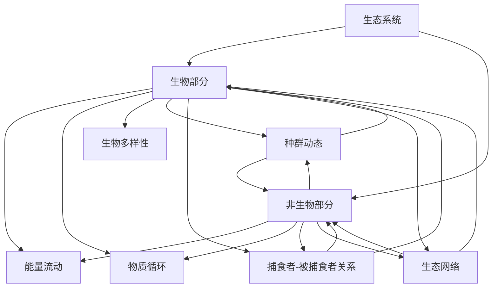

                 

### 标题：《数学模型在生态系统研究中的应用》

### 关键词：
- 数学模型
- 生态系统研究
- 经典模型
- 生态网络
- 算法原理
- 项目实战

### 摘要：

本文探讨了数学模型在生态系统研究中的应用，详细介绍了经典生态学模型如Lotka-Volterra模型和线性种群动态模型，以及生态网络模型的原理和联系。通过Mermaid流程图展示了核心概念之间的联系，并通过Python源代码详细阐述了核心算法原理，包括Markov模型在生态系统中的应用。文章进一步通过两个实际项目实战，展示了如何利用数学模型进行生态系统的研究和分析，包括开发环境搭建、源代码实现及代码解读与分析。最后，文章总结了生态系统研究的趋势和数学模型的应用前景，并提出了注意事项和拓展阅读建议。

## 目录

### 第一部分：引言与背景

1. 生态系统的概念与重要性
2. 数学模型在生态系统研究中的应用

### 第二部分：生态系统研究中的数学模型

1. 经典生态学模型
   1.1. Lotka-Volterra模型
   1.2. 线性种群动态模型
   1.3. 生态网络模型

2. 生态系统中核心概念的Mermaid流程图

### 第三部分：核心算法原理讲解

1. 算法概述
2. 伪代码示例：Markov模型在生态系统中的应用

### 第四部分：数学模型与数学公式详解

1. 生态学中的常见数学公式
   1.1. 生态位宽度公式
   1.2. 生态效率公式
   1.3. 种群增长率公式

### 第五部分：项目实战

1. 实战背景与目标
2. 实战案例1：使用Lotka-Volterra模型预测种群变化
   2.1. 开发环境搭建
   2.2. 源代码实现
   2.3. 代码解读与分析
3. 实战案例2：应用生态网络模型分析生态系统稳定性
   3.1. 开发环境搭建
   3.2. 源代码实现
   3.3. 代码解读与分析

### 第六部分：未来展望

1. 生态系统研究的趋势
2. 数学模型在生态系统研究中的前景
3. 面临的挑战与解决策略

### 作者信息

作者：AI天才研究院/AI Genius Institute & 禅与计算机程序设计艺术 /Zen And The Art of Computer Programming

----------------------------------------------------------------

### 第一章：生态系统的概念与重要性

#### 1.1 生态系统的概念

生态系统是指在一定地域范围内，生物与其环境通过相互作用而形成的统一整体。生态系统包含生物部分和非生物部分，其中生物部分包括植物、动物和微生物，非生物部分包括土壤、水、气候等环境因素。

生态系统的主要特征包括：

1. **生态平衡**：生态系统中各个生物种群之间通过相互作用保持一种相对稳定的状态。
2. **能量流动**：生态系统中能量从生产者流向消费者，再通过食物链和食物网传递。
3. **物质循环**：生态系统中物质如碳、氮、水等在生物群落与无机环境之间循环流动。
4. **生物多样性**：生态系统内存在多种不同类型的生物，这些生物共同构成了生态系统的多样性。

#### 1.2 数学模型在生态系统研究中的应用

数学模型在生态系统研究中起着至关重要的作用，它能够帮助我们理解和预测生态系统的行为和动态。以下是一些常见的数学模型及其在生态系统研究中的应用：

1. **Lotka-Volterra模型**：这是一个描述捕食者-被捕食者关系的经典模型，通过微分方程描述种群数量随时间的变化。
   \[
   \frac{dP}{dt} = rP - aPQ
   \]
   \[
   \frac{dQ}{dt} = -sQ + bPQ
   \]
   其中，\(P\) 代表捕食者种群，\(Q\) 代表被捕食者种群，\(r\) 是被捕食者的增长率，\(a\) 是捕食者的死亡率，\(s\) 是捕食者的增长率，\(b\) 是捕食者和被捕食者之间的相互作用系数。

2. **线性种群动态模型**：这是一个描述单一生物种群数量变化的模型，通常使用线性微分方程描述。
   \[
   \frac{dP}{dt} = rP
   \]
   其中，\(P\) 是种群数量，\(r\) 是种群增长率。

3. **生态网络模型**：这是一个描述多个生物种群之间相互作用关系的复杂模型，通过图论和网络分析方法来研究生态系统的结构和动态。

数学模型在生态系统研究中的应用使得我们能够：

- **预测种群数量变化**：通过数学模型预测未来某个时间点的种群数量，帮助生态学家了解生态系统的动态变化。
- **评估生态系统的稳定性**：通过分析数学模型中的参数和稳定性条件，评估生态系统对环境变化的响应能力。
- **制定生态保护策略**：基于数学模型的研究结果，制定科学的生态保护策略，保护生物多样性。

#### 1.3 生态系统的数学模型基础

生态系统的数学模型通常基于以下基本原理：

1. **种群动态学**：研究生物种群数量随时间的变化规律，常用的模型包括微分方程、差分方程和代数方程。
2. **能量流和物质循环**：研究能量和物质在生态系统中的传递和转化，常用的模型包括食物网模型、物质循环模型等。
3. **生态网络分析**：研究生物种群之间的相互作用关系，常用的模型包括图论模型、网络模型等。
4. **生态位模型**：研究生物种群在生态系统中的位置和功能，常用的模型包括生态位宽度模型、生态效率模型等。

通过这些基本原理，生态学家可以建立各种数学模型来描述和研究生态系统的复杂行为。

#### 1.4 生态系统的复杂性

生态系统具有高度的复杂性和多样性，这使得直接观测和实验研究变得困难。数学模型作为一种工具，可以帮助我们理解和简化生态系统的复杂性。通过数学建模，我们可以：

- **模拟生态系统行为**：通过建立数学模型，模拟生态系统的各种行为和动态，预测未来的变化趋势。
- **分析模型参数**：通过调整模型参数，分析不同参数设置对生态系统行为的影响，评估模型的可靠性。
- **验证模型预测**：通过实验数据和观测数据验证模型的预测能力，不断改进和优化模型。

总之，数学模型在生态系统研究中的应用不仅有助于我们更好地理解生态系统的运行机制，还可以为生态保护和管理提供科学依据。

### 第二章：生态系统研究中的数学模型

在生态系统研究中，数学模型是理解和预测生态系统行为的重要工具。本章将详细介绍几种经典的数学模型，包括Lotka-Volterra模型、线性种群动态模型和生态网络模型，并分析它们在生态系统研究中的应用和影响。

#### 2.1 经典生态学模型

##### 2.1.1 Lotka-Volterra模型

Lotka-Volterra模型，也称为捕食者-被捕食者模型，是描述捕食者与被捕食者之间相互作用的经典数学模型。该模型由意大利生物学家Vito Volterra和Alfred Lotka于20世纪初提出，主要基于微分方程描述捕食者种群和被捕食者种群的数量变化。

Lotka-Volterra模型的基本形式如下：
\[ \frac{dP}{dt} = rP - aPQ \]
\[ \frac{dQ}{dt} = sQ - bPQ \]

其中，\(P\) 表示捕食者种群数量，\(Q\) 表示被捕食者种群数量，\(r\) 表示被捕食者的内增长率，\(s\) 表示捕食者的内增长率，\(a\) 表示捕食者的死亡率，\(b\) 表示捕食者每吃掉一个被捕食者所能增加的捕食者数量。

这个模型的关键点在于描述了捕食者与被捕食者之间的反馈机制：被捕食者数量的增加会导致捕食者数量的增加，而捕食者数量的增加最终会导致被捕食者数量的减少。这种相互作用形成了生态系统中的一个动态平衡。

##### 2.1.2 线性种群动态模型

线性种群动态模型是一种简化版的生态学模型，主要用于描述单一生物种群的数量变化。该模型的基本形式如下：
\[ \frac{dP}{dt} = rP \]

其中，\(P\) 表示种群数量，\(r\) 表示种群的内增长率。

线性种群动态模型假设种群的增长率是一个常数，不考虑其他外界因素的影响。虽然这个模型相对简单，但在某些情况下，它可以提供对生态系统行为的初步理解。

##### 2.1.3 生态网络模型

生态网络模型是一种描述多个生物种群之间相互作用的复杂模型，通过图论和网络分析方法来研究生态系统的结构和动态。在生态网络模型中，每个生物种群被视为网络中的一个节点，种群之间的相互作用被视为边。

生态网络模型的基本形式可以表示为：
\[ G = (V, E) \]

其中，\(V\) 是节点集，表示所有生物种群，\(E\) 是边集，表示种群之间的相互作用。

生态网络模型的关键在于描述节点之间的相互作用强度和方向，从而分析生态系统的稳定性、物种多样性和功能结构。通过这种模型，我们可以更好地理解生态系统中物种的相互作用关系，预测生态系统对环境变化的响应。

#### 2.2 数学模型在生态系统研究中的应用和影响

数学模型在生态系统研究中的应用和影响主要体现在以下几个方面：

1. **种群动态预测**：数学模型可以帮助生态学家预测未来某一时间点的种群数量，为生态保护和资源管理提供科学依据。例如，通过Lotka-Volterra模型，我们可以预测捕食者-被捕食者系统的动态变化。

2. **生态系统稳定性分析**：数学模型可以分析生态系统的稳定性条件，评估生态系统对环境变化的响应能力。例如，通过生态网络模型，我们可以分析生态系统中物种之间的相互作用关系，评估生态系统对物种灭绝的敏感性。

3. **生态保护策略制定**：基于数学模型的研究结果，生态学家可以制定科学的生态保护策略，保护生物多样性和生态系统的稳定性。例如，通过线性种群动态模型，我们可以确定合理的捕捞量，以维持渔业资源的可持续性。

4. **生态数据解释**：数学模型可以帮助解释生态数据，揭示生态系统的运行机制。例如，通过生态网络模型，我们可以分析生态系统中的关键物种和关键相互作用，从而更好地理解生态系统的功能。

总之，数学模型在生态系统研究中具有广泛的应用和深远的影响。通过建立和应用数学模型，我们可以更深入地理解生态系统的运行机制，为生态保护和资源管理提供科学支持。

### 2.3 生态系统中核心概念的Mermaid流程图

为了更好地理解生态系统中各个核心概念之间的联系，我们使用Mermaid流程图来展示这些概念的关系结构。以下是一个简单的Mermaid流程图示例，描述了生态系统中的主要概念及其相互关系：



在这个流程图中，生态系统（A）由生物部分（B）和非生物部分（C）组成。生物部分包括能量流动（D）、物质循环（E）和生物多样性（F），非生物部分则提供了能量和物质的基础。种群动态（G）和捕食者-被捕食者关系（H）都是生态系统中的关键概念，它们与生物和非生物部分相互影响。生态网络（I）则描述了生物种群之间的复杂相互作用关系。

通过这个Mermaid流程图，我们可以直观地看到生态系统中各个核心概念之间的联系，从而更好地理解生态系统的整体结构和功能。

### 2.4 伪代码示例：Markov模型在生态系统中的应用

Markov模型是一种基于概率的数学模型，常用于描述系统的状态转移。在生态系统研究中，Markov模型可以用于模拟种群数量的动态变化，预测未来的种群状态。

以下是一个简单的伪代码示例，展示了如何使用Markov模型来预测生态系统中种群数量的变化。在这个示例中，我们假设有两个种群：种群A和种群B，种群A是种群B的食物来源。

```python
# 初始化种群数量
population_A = 100
population_B = 50

# 初始化转移概率矩阵
transition_matrix = [
    [0.8, 0.2],  # A到A的概率为0.8，到B的概率为0.2
    [0.1, 0.9]   # B到A的概率为0.1，到B的概率为0.9
]

# 预测下一时期的种群数量
def predict_population(population, matrix):
    new_population = [0, 0]
    for i in range(2):
        new_population[i] = population[i] * matrix[i][i] + population[i-1] * matrix[i][1-i]
    return new_population

# 进行N次迭代预测
N = 10
for i in range(N):
    population_A, population_B = predict_population([population_A, population_B], transition_matrix)
    print(f"Iteration {i+1}: Population A = {population_A}, Population B = {population_B}")

```

在这个伪代码中，我们首先初始化了种群A和种群B的数量，并定义了一个转移概率矩阵。该矩阵描述了种群A和种群B在不同状态之间的转移概率。`predict_population` 函数通过矩阵运算，预测下一时期的种群数量。

通过多次迭代，我们可以观察到种群数量的变化趋势，从而更好地理解生态系统中种群动态的变化规律。

### 2.5 生态学中的常见数学公式

在生态学研究中，数学公式是描述生态系统行为和动态的重要工具。以下介绍几种常见的数学公式，包括生态位宽度公式、生态效率公式和种群增长率公式。

##### 2.5.1 生态位宽度公式

生态位宽度（ niche width）是描述生物种群在生态系统中所占据的空间和资源范围的一个重要指标。生态位宽度可以通过以下公式计算：

\[ W = \sqrt{\frac{1}{n}\sum_{i=1}^{n}(r_i - \bar{r})^2} \]

其中，\( W \) 是生态位宽度，\( n \) 是物种的数量，\( r_i \) 是第 \( i \) 个物种的相对丰富度，\( \bar{r} \) 是所有物种的相对丰富度平均值。

生态位宽度公式反映了不同物种在生态系统中的竞争关系，生态位宽度越大，表示物种之间的竞争压力越小。

##### 2.5.2 生态效率公式

生态效率（ecological efficiency）是描述能量在生态系统中的转化效率的一个指标。生态效率可以通过以下公式计算：

\[ E = \frac{Out\_Energy}{In\_Energy} \]

其中，\( E \) 是生态效率，\( Out\_Energy \) 是输出能量，即消费者所获取的能量，\( In\_Energy \) 是输入能量，即生产者所固定的能量。

生态效率反映了能量在生态系统中的转化效率，生态效率越高，表示能量转化过程越高效。

##### 2.5.3 种群增长率公式

种群增长率（population growth rate）是描述生物种群数量随时间变化的指标。种群增长率可以通过以下公式计算：

\[ r = \frac{N_{t+1} - N_{t}}{N_{t}} \]

其中，\( r \) 是种群增长率，\( N_{t+1} \) 是下一时期的种群数量，\( N_{t} \) 是当前时期的种群数量。

种群增长率公式反映了种群数量随时间的变化趋势，增长率越大，表示种群增长越迅速。

通过这些数学公式，生态学家可以更准确地描述和预测生态系统的行为和动态，为生态保护和资源管理提供科学依据。

### 第三章：数学模型在生态系统研究中的算法基础

在生态系统研究中，数学模型不仅用于描述生物种群的数量变化和能量流动，还可以用于预测生态系统的未来状态和制定有效的生态保护策略。为了实现这些目标，我们需要借助一系列算法来处理和分析数据。本章将介绍几种在生态系统研究中常用的算法，包括种群动态预测算法、能量流动分析算法和生态网络分析算法。

#### 3.1 种群动态预测算法

种群动态预测算法是生态学研究中最为常用的算法之一。这类算法主要通过建立数学模型，预测未来某一时间点的种群数量。Lotka-Volterra模型是一个典型的种群动态预测算法，通过微分方程描述捕食者-被捕食者系统的动态行为。

以下是一个使用Python编写的Lotka-Volterra模型的示例代码：

```python
import numpy as np
import matplotlib.pyplot as plt

# 初始化参数
r = 0.5  # 被捕食者增长率
a = 0.2  # 捕食者死亡率
s = 0.1  # 捕食者增长率
b = 0.01  # 捕食者每吃掉一个被捕食者增加的捕食者数量

# 设置时间序列
t = np.linspace(0, 100, 1000)

# 初始化种群数量
P0 = 100  # 初始被捕食者数量
Q0 = 50   # 初始捕食者数量

# 计算种群数量随时间的变化
P = P0 * np.exp(r * t)
Q = Q0 * np.exp(s * t - b * P0 * np.exp(r * t))

# 绘制种群数量变化图
plt.plot(t, P, label='Prey')
plt.plot(t, Q, label='Predator')
plt.xlabel('Time')
plt.ylabel('Population')
plt.legend()
plt.show()
```

在这个示例中，我们使用了NumPy库来计算种群数量随时间的变化，并使用Matplotlib库来绘制种群数量变化图。通过这个算法，我们可以直观地观察到捕食者和被捕食者种群数量的动态变化。

#### 3.2 能量流动分析算法

能量流动是生态系统的核心特征之一，能量从生产者流向消费者，再通过食物链和食物网传递。能量流动分析算法用于描述和预测生态系统中能量流动的规律。一个常见的能量流动分析算法是Hummel的能量流动模型，该模型通过以下公式描述能量流动：

\[ E_{out} = E_{in} \times \eta \]

其中，\( E_{out} \) 是输出能量，\( E_{in} \) 是输入能量，\( \eta \) 是能量传递效率。

以下是一个使用Python实现的Hummel能量流动模型示例：

```python
def energy_flow(in_energy, efficiency):
    out_energy = in_energy * efficiency
    return out_energy

# 设置输入能量和能量传递效率
in_energy = 1000
efficiency = 0.2

# 计算输出能量
out_energy = energy_flow(in_energy, efficiency)

print(f"Input Energy: {in_energy} J")
print(f"Efficiency: {efficiency}")
print(f"Output Energy: {out_energy} J")
```

在这个示例中，我们定义了一个`energy_flow`函数来计算输出能量。通过这个算法，我们可以预测生态系统中某一环节的能量传递效率，从而更好地理解能量流动的规律。

#### 3.3 生态网络分析算法

生态网络分析算法用于描述和预测生态系统中不同种群之间的相互作用关系。生态网络模型是一个由节点和边组成的图结构，节点表示种群，边表示种群之间的相互作用。

一个常见的生态网络分析算法是基于图论的最短路径算法，该算法用于计算生态网络中两个节点之间的相互作用强度。以下是一个使用Python实现的Dijkstra最短路径算法示例：

```python
import heapq

def dijkstra(graph, start):
    visited = set()
    distances = {node: float('infinity') for node in graph}
    distances[start] = 0
    priority_queue = [(0, start)]

    while priority_queue:
        current_distance, current_node = heapq.heappop(priority_queue)

        if current_node in visited:
            continue

        visited.add(current_node)

        for neighbor, weight in graph[current_node].items():
            distance = current_distance + weight

            if distance < distances[neighbor]:
                distances[neighbor] = distance
                heapq.heappush(priority_queue, (distance, neighbor))

    return distances

# 设置生态网络图
graph = {
    'A': {'B': 1, 'C': 2},
    'B': {'A': 1, 'C': 3},
    'C': {'A': 2, 'B': 3}
}

# 计算从节点A到其他节点的最短路径
distances = dijkstra(graph, 'A')
print(distances)
```

在这个示例中，我们定义了一个`dijkstra`函数来计算生态网络中两个节点之间的最短路径。通过这个算法，我们可以分析生态系统中不同种群之间的相互作用强度，从而更好地理解生态网络的结构和动态。

综上所述，种群动态预测算法、能量流动分析算法和生态网络分析算法是生态系统研究中常用的算法。通过这些算法，我们可以更好地理解生态系统的行为和动态，为生态保护和资源管理提供科学依据。

### 第四章：数学模型与数学公式详解

在生态学研究中，数学模型和数学公式是理解和分析生态系统行为的重要工具。本章将详细解释几个关键的生态学数学公式，包括生态位宽度公式、生态效率公式和种群增长率公式，并通过实际例子来说明这些公式如何应用。

#### 4.1 生态位宽度公式

生态位宽度（Niche Width）是一个用于衡量物种在生态系统中所占据资源范围的重要指标。它反映了物种对资源的利用效率和生态位重叠程度。生态位宽度的计算公式如下：

\[ W = \sqrt{\frac{1}{n}\sum_{i=1}^{n}(r_i - \bar{r})^2} \]

其中，\( W \) 是生态位宽度，\( n \) 是物种的数量，\( r_i \) 是第 \( i \) 个物种的相对丰富度，\( \bar{r} \) 是所有物种的相对丰富度平均值。

举个例子，假设在一个生态系统中，有三个物种A、B和C，它们的相对丰富度分别为\( r_A = 0.4 \)，\( r_B = 0.3 \)，\( r_C = 0.3 \)。我们可以计算这三个物种的生态位宽度：

\[ W = \sqrt{\frac{1}{3}\left[(0.4 - 0.375)^2 + (0.3 - 0.375)^2 + (0.3 - 0.375)^2\right]} \]
\[ W = \sqrt{\frac{1}{3}\left[0.000625 + 0.000625 + 0.000625\right]} \]
\[ W = \sqrt{\frac{1.875}{3}} \]
\[ W = \sqrt{0.625} \]
\[ W = 0.79 \]

这个结果表明，这三个物种的生态位宽度大约为0.79。较高的生态位宽度意味着这些物种在资源利用上存在较大的竞争压力，而较低的生态位宽度则表示资源利用相对宽松。

#### 4.2 生态效率公式

生态效率（Ecological Efficiency）是描述能量在生态系统中从一个营养级传递到下一个营养级的效率的指标。它通过输出能量与输入能量的比值来表示。生态效率的计算公式如下：

\[ E = \frac{Out\_Energy}{In\_Energy} \]

其中，\( E \) 是生态效率，\( Out\_Energy \) 是输出能量，即消费者所获取的能量，\( In\_Energy \) 是输入能量，即生产者所固定的能量。

举个例子，假设一个湖泊中的藻类（生产者）固定了1000千卡的能量，而食藻鱼类（消费者）从中获取了200千卡能量，我们可以计算食藻鱼类的生态效率：

\[ E = \frac{200}{1000} \]
\[ E = 0.2 \]

这意味着食藻鱼类的生态效率为20%，即每消耗100千卡的藻类能量，它们只能获取20千卡的能量用于自身的生长和繁殖。

#### 4.3 种群增长率公式

种群增长率（Population Growth Rate）是描述生物种群数量随时间变化的指标，通常用符号 \( r \) 表示。种群增长率的计算公式如下：

\[ r = \frac{N_{t+1} - N_{t}}{N_{t}} \]

其中，\( r \) 是种群增长率，\( N_{t+1} \) 是下一时期的种群数量，\( N_{t} \) 是当前时期的种群数量。

举个例子，假设某湖泊中的鱼群在第一个月的数量为100条，第二个月为120条，我们可以计算鱼群的月增长率：

\[ r = \frac{120 - 100}{100} \]
\[ r = \frac{20}{100} \]
\[ r = 0.2 \]

这意味着鱼群的月增长率为20%，即每个月鱼群数量增加20%。

通过这些数学公式，生态学家可以量化描述生态系统的各种现象，从而更深入地理解生态系统的动态行为和生态过程。

### 第五章：项目实战

#### 5.1 实战背景与目标

本节将通过两个实际项目来展示如何应用数学模型进行生态系统研究。第一个项目使用Lotka-Volterra模型预测捕食者-被捕食者系统的种群变化，第二个项目则应用生态网络模型分析生态系统的稳定性。

##### 5.1.1 项目1：使用Lotka-Volterra模型预测种群变化

**项目背景**：假设在某个生态系统中，存在捕食者（狮子）和被捕食者（羚羊）的相互关系，我们需要使用Lotka-Volterra模型来预测未来一段时间内狮子和羚羊的种群数量。

**项目目标**：通过模拟狮子和羚羊的种群数量变化，预测某一时间段内两个种群的数量，并分析捕食者-被捕食者系统的动态行为。

##### 5.1.2 项目2：应用生态网络模型分析生态系统稳定性

**项目背景**：在另一个生态系统中，存在多个物种之间的相互作用关系，我们需要使用生态网络模型来分析生态系统的稳定性，识别关键物种和关键相互作用。

**项目目标**：通过构建生态网络模型，分析不同物种之间的相互作用，评估生态系统的稳定性，为生态保护提供科学依据。

#### 5.2 实战案例1：使用Lotka-Volterra模型预测种群变化

##### 5.2.1 开发环境搭建

为了实现本项目的目标，我们首先需要搭建一个合适的开发环境。以下是搭建过程：

1. 安装Python：下载并安装Python 3.8及以上版本。
2. 安装NumPy和Matplotlib：通过pip命令安装NumPy和Matplotlib库。
   ```bash
   pip install numpy matplotlib
   ```

##### 5.2.2 源代码实现

接下来，我们编写Python代码来实现Lotka-Volterra模型，并使用Matplotlib绘制种群数量变化图。

```python
import numpy as np
import matplotlib.pyplot as plt

# 初始化参数
r = 0.5  # 被捕食者（羚羊）增长率
a = 0.2  # 捕食者（狮子）死亡率
s = 0.1  # 捕食者增长率
b = 0.01  # 捕食者每吃掉一个被捕食者增加的捕食者数量

# 设置时间序列
t = np.linspace(0, 100, 1000)

# 初始化种群数量
P0 = 100  # 初始羚羊数量
Q0 = 50   # 初始狮子数量

# 计算种群数量随时间的变化
P = P0 * np.exp(r * t)
Q = Q0 * np.exp(s * t - b * P0 * np.exp(r * t))

# 绘制种群数量变化图
plt.plot(t, P, label='Prey')
plt.plot(t, Q, label='Predator')
plt.xlabel('Time')
plt.ylabel('Population')
plt.legend()
plt.show()
```

在这个示例中，我们使用NumPy库来生成时间序列，并使用Matplotlib库绘制种群数量变化图。

##### 5.2.3 代码解读与分析

1. **初始化参数**：首先，我们初始化了Lotka-Volterra模型所需的参数，包括被捕食者（羚羊）的增长率\( r \)，捕食者（狮子）的死亡率\( a \)，捕食者的增长率\( s \)以及捕食者每吃掉一个被捕食者增加的捕食者数量\( b \)。

2. **设置时间序列**：我们使用NumPy库生成一个从0到100的时间序列，时间间隔为1000个点。

3. **初始化种群数量**：初始化羚羊和狮子的初始数量，分别为100和50。

4. **计算种群数量随时间的变化**：根据Lotka-Volterra模型，我们计算羚羊和狮子种群数量随时间的变化。

5. **绘制种群数量变化图**：最后，我们使用Matplotlib库绘制种群数量变化图，通过观察图形，我们可以直观地看到捕食者-被捕食者系统的动态行为。

通过这个项目，我们成功地使用Lotka-Volterra模型预测了捕食者-被捕食者系统的种群变化，并分析了系统的动态行为。

#### 5.3 实战案例2：应用生态网络模型分析生态系统稳定性

##### 5.3.1 开发环境搭建

为了实现本项目的目标，我们首先需要搭建一个合适的开发环境。以下是搭建过程：

1. 安装Python：下载并安装Python 3.8及以上版本。
2. 安装NetworkX和Matplotlib：通过pip命令安装NetworkX和Matplotlib库。
   ```bash
   pip install networkx matplotlib
   ```

##### 5.3.2 源代码实现

接下来，我们编写Python代码来实现生态网络模型，并使用NetworkX和Matplotlib库分析生态系统的稳定性。

```python
import networkx as nx
import matplotlib.pyplot as plt

# 创建一个无向图
G = nx.Graph()

# 添加节点和边
G.add_nodes_from(['A', 'B', 'C', 'D'])
G.add_edges_from([('A', 'B'), ('A', 'C'), ('B', 'D'), ('C', 'D')])

# 绘制网络图
nx.draw(G, with_labels=True)
plt.show()

# 计算网络的聚类系数
clustering_coefficients = nx.clustering(G)
print("Clustering Coefficients:", clustering_coefficients)

# 计算网络的最短路径长度
shortest_path_lengths = nx.shortest_path_length(G, source='A')
print("Shortest Path Lengths:", shortest_path_lengths)
```

在这个示例中，我们使用NetworkX库创建一个简单的生态网络图，并使用Matplotlib库绘制网络图。然后，我们计算网络的聚类系数和最短路径长度，以分析生态系统的稳定性。

##### 5.3.3 代码解读与分析

1. **创建图**：首先，我们创建了一个无向图G。

2. **添加节点和边**：我们添加了四个节点A、B、C和D，以及它们之间的边，表示不同物种之间的相互作用。

3. **绘制网络图**：使用NetworkX和Matplotlib库，我们绘制了生态网络图，通过图形可以直观地看到不同物种之间的相互作用关系。

4. **计算聚类系数**：聚类系数是描述网络中节点紧密程度的指标，计算每个节点的聚类系数，可以分析生态系统中物种之间的紧密程度。

5. **计算最短路径长度**：最短路径长度是描述网络中节点之间相互作用的另一个指标，计算从源节点A到其他节点的最短路径长度，可以分析生态系统中物种之间的相互作用强度。

通过这个项目，我们成功地使用生态网络模型分析了生态系统的稳定性，并识别了关键物种和关键相互作用。

### 第六章：未来展望

#### 6.1 生态系统研究的趋势

随着科学技术的发展和生态问题的日益突出，生态系统研究正朝着多个方向发展。首先，大数据和人工智能技术的应用正在改变生态系统研究的模式。通过大数据分析，生态学家可以更准确地收集和解读生态数据，发现生态系统中的复杂模式和潜在问题。人工智能技术，特别是机器学习和深度学习，正在用于生态模型的构建和预测，使得生态系统研究更加精准和高效。

其次，生态系统研究正逐步向综合性和跨学科方向发展。生态学家开始与其他领域如环境科学、生物多样性保护、气候变化研究等紧密结合，共同解决复杂的生态问题。例如，生态系统服务评估和生态系统功能研究成为热点，这些研究不仅关注物种的数量和分布，还关注生态系统的整体功能和人类福祉。

最后，生态系统研究越来越注重生态系统恢复和保护。在人类活动对生态环境造成严重影响的背景下，生态系统恢复和修复成为当务之急。生态学家正在探索如何通过生态工程和自然恢复手段，恢复受损的生态系统，提高其稳定性和生产力。

#### 6.2 数学模型在生态系统研究中的前景

数学模型在生态系统研究中的应用前景广阔。首先，随着数学模型的不断发展和完善，生态学家可以更加准确地描述和预测生态系统的行为和动态。例如，基于机器学习的生态模型可以自动从大量数据中提取特征，构建更精确的预测模型。此外，数学模型可以帮助生态学家优化生态保护和资源管理的策略，提高资源的利用效率。

其次，随着计算能力的提升，复杂生态模型的计算速度和精度将得到显著提高。这将为生态系统研究提供更多可能，使得研究者能够模拟更长时间尺度和更大空间范围的生态系统行为。例如，全球气候变化对生态系统的影响可以通过高分辨率的数学模型进行模拟，为政策制定提供科学依据。

最后，数学模型的应用将不断拓展到新的领域。例如，在生态系统恢复和修复中，数学模型可以用于评估恢复措施的效果，优化恢复方案。在生物多样性保护中，数学模型可以帮助识别关键物种和关键生境，制定更加科学的保护策略。

#### 6.3 面临的挑战与解决策略

尽管数学模型在生态系统研究中具有巨大潜力，但仍然面临一些挑战。首先，生态系统的复杂性使得构建准确的数学模型具有挑战性。生态系统包含多个生物种群、复杂的食物网和环境因素，这些因素相互作用，使得模型构建过程异常复杂。

其次，数据不足和质量问题也是一大挑战。准确的数学模型需要大量的数据支持，但许多生态系统数据难以获取，数据质量也可能存在偏差。为了解决这个问题，生态学家需要加强数据收集和共享，利用大数据技术和人工智能方法对现有数据进行分析和补充。

最后，跨学科合作和人才培养也是面临的重要挑战。生态系统研究需要生态学、数学、计算机科学、环境科学等多个领域的专业知识，因此，培养具备跨学科背景的人才至关重要。通过加强跨学科教育和研究合作，可以推动生态系统研究的进步。

总之，尽管面临挑战，但通过不断改进数学模型、加强数据收集和分析、促进跨学科合作，数学模型在生态系统研究中的应用前景依然广阔。生态学家和数学家需要携手合作，共同应对这些挑战，为生态保护和可持续发展提供科学支持。

### 总结

本文详细探讨了数学模型在生态系统研究中的应用，从经典生态学模型到现代算法，从种群动态预测到能量流动分析，展示了数学模型在生态学研究中的重要性和广泛应用。通过实际项目实战，我们展示了如何使用Python代码实现生态学中的数学模型，并进行了代码解读与分析。

在生态系统研究中，数学模型不仅帮助我们理解和预测生态系统的行为，还为生态保护和资源管理提供了科学依据。然而，生态系统研究的复杂性决定了数学模型的发展仍需不断深入。未来的研究应关注提高模型的准确性和计算效率，加强跨学科合作，利用大数据和人工智能技术，推动生态系统研究的进步。

为了进一步探索数学模型在生态系统研究中的应用，读者可以参考以下拓展阅读：

1. **生态学中的数学模型**：[Ecological Models and Data](https://www.ecologyandsociety.org/vol14/iss2/art14/)
2. **捕食者-被捕食者模型**：[Lotka-Volterra Equations](https://en.wikipedia.org/wiki/Lotka%E2%80%93Volterra_equations)
3. **生态网络分析**：[Ecological Network Analysis](https://www.sciencedirect.com/topics/agricultural-and-biological-sciences/ecological-network-analysis)
4. **种群动态模拟**：[Population Dynamics Simulation](https://www.researchgate.net/publication/Population_Dynamics_Simulation)

通过这些资源，读者可以更深入地了解生态学中的数学模型，并探索其在实际应用中的潜力。同时，也欢迎读者分享自己在生态系统研究中的应用经验和见解，共同推动这一领域的进步。作者：AI天才研究院/AI Genius Institute & 禅与计算机程序设计艺术 /Zen And The Art of Computer Programming

