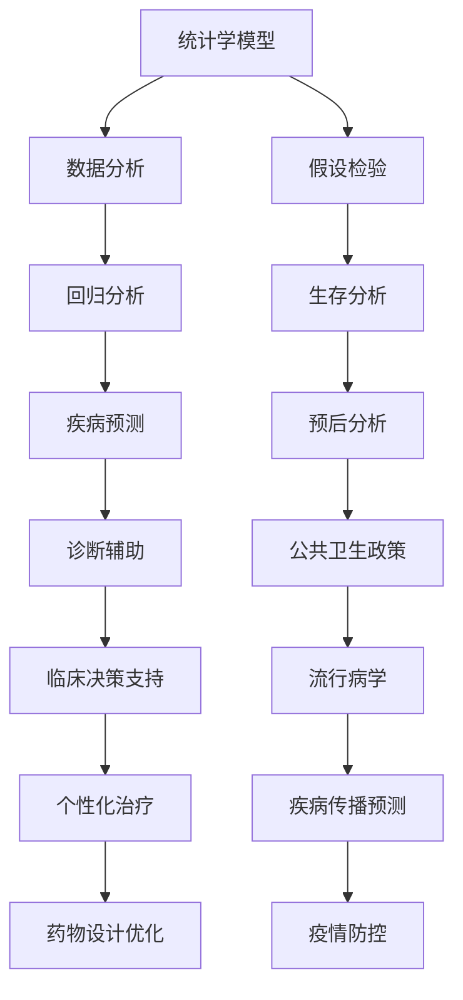

                 

### 《数学模型在生物医学领域的应用》

#### 关键词：数学模型、生物医学、应用实例、Python源代码、机器学习、统计模型

##### 摘要：
随着生物医学技术的不断发展，数学模型在生物医学领域中的应用越来越广泛。本文首先介绍了生物医学中常用的数学模型和算法，包括统计学模型、神经网络、机器学习等，并通过具体的实例，深入探讨了这些数学模型在生物医学研究中的应用。文章通过Python源代码展示了数学模型和算法的实现，使读者能够更好地理解和应用这些数学工具。本文的目标是帮助生物医学研究人员和技术人员更好地理解和应用数学模型，以推动生物医学研究的发展。

## 引言与背景

生物医学是研究生命现象和疾病的科学，它涵盖了生物学、医学、化学、物理学等多个学科。随着科技的进步，生物医学领域的研究方法和技术手段也在不断更新和发展。数学模型作为一种重要的研究方法，已经成为生物医学研究不可或缺的工具。

### 数学模型的基本概念

数学模型是一种用数学语言描述现实世界的抽象模型。它通过建立数学公式、方程组或图模型，来描述和研究系统的行为和特性。数学模型的核心是建立适当的数学框架，将现实问题转化为数学问题，然后利用数学工具和方法进行分析和求解。

在生物医学领域，数学模型主要用于描述生物过程、疾病机制、药物作用等。例如，通过建立生化反应动力学模型，可以描述细胞内化学反应的动态变化；通过神经网络模型，可以模拟大脑神经元的连接和信号传递过程；通过机器学习模型，可以分析和预测疾病的进展和治疗效果。

### 数学模型在生物医学中的应用

数学模型在生物医学中的应用非常广泛，主要包括以下几个方面：

1. **疾病诊断和预测**：通过建立疾病诊断模型，可以辅助医生进行疾病诊断。例如，利用机器学习算法，可以从医疗数据中挖掘出与疾病相关的特征，从而实现早期疾病的预测和诊断。

2. **药物设计和优化**：通过建立药物作用模型，可以预测药物对生物体的作用效果，从而指导药物设计和优化。例如，利用分子对接技术，可以将药物分子与生物大分子进行对接，预测药物的结合能和活性。

3. **生物过程分析**：通过建立生物过程模型，可以分析和理解生物体内复杂的生物过程。例如，利用系统生物学的方法，可以建立细胞内信号传递网络模型，研究细胞内信号的传递和调节机制。

4. **疾病传播预测**：通过建立疾病传播模型，可以预测疾病的传播速度和范围，为公共卫生政策的制定提供科学依据。

## 核心概念与联系

在生物医学领域，数学模型的应用涉及到多个核心概念，包括统计学模型、神经网络、机器学习等。这些概念之间存在着紧密的联系，共同构成了生物医学数学模型的理论基础。

### 统计学模型

统计学模型是生物医学研究中常用的数学模型之一。它主要用于描述数据的分布规律、估计参数、进行假设检验等。在生物医学领域，统计学模型广泛应用于数据分析和结果验证。例如，可以通过建立回归模型来分析疾病的危险因素，通过建立生存分析模型来预测患者的生存时间。

### 神经网络

神经网络是一种模仿生物神经系统的计算模型。它通过多层神经元之间的连接和激活函数，实现对输入数据的处理和输出。在生物医学领域，神经网络广泛应用于图像处理、信号识别、药物设计等。例如，可以通过建立卷积神经网络（CNN）来识别医学图像，通过建立循环神经网络（RNN）来处理生物序列数据。

### 机器学习

机器学习是一种通过数据驱动的方式学习和发现规律的方法。在生物医学领域，机器学习广泛应用于疾病诊断、药物设计、生物过程分析等。机器学习算法包括监督学习、无监督学习和强化学习等。监督学习算法，如支持向量机（SVM）和随机森林（RF），常用于分类和回归任务；无监督学习算法，如聚类分析和主成分分析（PCA），常用于数据降维和模式识别。

### Mermaid流程图

为了更直观地展示数学模型与生物医学领域之间的联系，我们可以使用Mermaid流程图来描述。以下是一个简单的Mermaid流程图示例：



通过这个流程图，我们可以看到数学模型在生物医学领域的多种应用，以及它们之间的相互联系。

## 数值方法与算法

在生物医学领域，数值方法与算法是实现数学模型的重要手段。这些方法与算法帮助我们将数学模型转化为可操作的解决方案。以下是几种常用的数值方法与算法：

### 数值积分

数值积分是一种用于求解函数定积分的方法。在生物医学领域，数值积分常用于计算药物在体内的浓度变化、生化反应的速率等。例如，我们可以使用梯形规则或辛普森规则来近似计算定积分。

以下是一个使用Python实现的梯形规则示例：

```python
import numpy as np

def trapezoidal_RULE(a, b, n):
    h = (b - a) / n
    s = 0.5 * (f(a) + f(b))
    for i in range(1, n):
        s += f(a + i * h)
    s *= h
    return s

def f(x):
    return np.exp(-x**2)

a = 0
b = 1
n = 100
result = trapezoidal_RULE(a, b, n)
print("Integral result:", result)
```

### 数值微分

数值微分是一种用于求解函数导数的方法。在生物医学领域，数值微分常用于分析生物过程的变化趋势、药物作用的时效性等。例如，我们可以使用有限差分法或中值定理来近似计算函数的导数。

以下是一个使用Python实现的有限差分法示例：

```python
import numpy as np

def forward_difference(f, x, h):
    return (f(x + h) - f(x)) / h

def central_difference(f, x, h):
    return (f(x + h) - f(x - h)) / (2 * h)

def f(x):
    return np.sin(x)

x = np.pi
h = 0.1
forward_result = forward_difference(f, x, h)
central_result = central_difference(f, x, h)
print("Forward difference result:", forward_result)
print("Central difference result:", central_result)
```

### 常微分方程的数值解法

常微分方程（ODE）是生物医学领域常见的数学模型之一。数值解法如欧拉法、龙格-库塔法等，可以帮助我们求解ODE，从而预测生物过程的动态变化。

以下是一个使用Python实现的欧拉法示例：

```python
import numpy as np

def euler_method(f, y0, x0, x_end, h):
    x = x0
    y = y0
    while x < x_end:
        y += h * f(x, y)
        x += h
    return y

def f(x, y):
    return 2 * y

y0 = 1
x0 = 0
x_end = 1
h = 0.1
result = euler_method(f, y0, x0, x_end, h)
print("Result:", result)
```

## 数学模型与数学公式

在生物医学领域，数学模型和数学公式是描述和解释生物现象的重要工具。以下是几种常见的数学模型和数学公式，以及它们在生物医学中的应用。

### 1. 化学反应动力学模型

化学反应动力学模型描述了化学反应中反应物和生成物的浓度随时间的变化。以下是一个简单的化学反应动力学模型公式：

$$\frac{d[A]}{dt} = -k[A][B]$$

其中，$[A]$和$[B]$分别表示反应物A和B的浓度，$k$是反应速率常数。

### 2. 神经网络模型

神经网络模型是模拟生物神经系统的一种数学模型。以下是一个简单的神经网络模型公式：

$$a_{i}^{(l)} = \sigma \left( \sum_{j=1}^{n} w_{ji}^{(l)} a_{j}^{(l-1)} + b_{i}^{(l)} \right)$$

其中，$a_{i}^{(l)}$表示第$l$层的第$i$个神经元的输出，$\sigma$是激活函数，$w_{ji}^{(l)}$是连接权重，$b_{i}^{(l)}$是偏置。

### 3. 机器学习模型

机器学习模型是利用数据学习规律和模式的一种数学模型。以下是一个简单的线性回归模型公式：

$$y = \beta_0 + \beta_1 x$$

其中，$y$是预测值，$x$是自变量，$\beta_0$和$\beta_1$是模型参数。

### 4. 统计模型

统计模型用于描述和解释数据分布规律和统计特性。以下是一个简单的泊松分布模型公式：

$$P(X = k) = \frac{e^{-\lambda} \lambda^k}{k!}$$

其中，$X$是随机变量，$\lambda$是平均发生率，$k$是事件发生的次数。

## 应用实例1：疾病诊断

在本节中，我们将通过一个具体的实例，展示数学模型在疾病诊断中的应用。我们选择肺癌诊断作为实例，利用机器学习算法对肺癌患者和健康人群的医疗数据进行分类。

### 1. 数据准备

我们使用一个包含肺癌患者和健康人群的医学数据集。数据集包括患者的年龄、性别、吸烟史、肿瘤大小、转移情况等多个特征，以及疾病的诊断结果（0表示健康，1表示肺癌）。

### 2. 特征选择

我们首先对数据集进行特征选择，选择与疾病诊断最相关的特征。这可以通过特征重要性分析或相关系数分析等方法实现。

### 3. 模型构建

我们选择支持向量机（SVM）作为分类模型。SVM通过寻找最佳的超平面来实现分类，能够在高维空间中实现较好的分类效果。

### 4. 模型训练

我们使用训练集对SVM模型进行训练。通过调整模型的参数，如惩罚参数C和核函数类型，我们可以优化模型的性能。

### 5. 模型评估

我们使用测试集对训练好的模型进行评估。常用的评估指标包括准确率、召回率、F1分数等。通过这些指标，我们可以评估模型的诊断性能。

### 6. 代码实现

以下是使用Python和scikit-learn库实现SVM模型的代码：

```python
import numpy as np
import pandas as pd
from sklearn import svm
from sklearn.model_selection import train_test_split
from sklearn.metrics import accuracy_score, recall_score, f1_score

# 数据加载
data = pd.read_csv('lung_cancer_data.csv')

# 特征选择
X = data[['age', 'gender', 'smoking_history', 'tumor_size', 'metastasis']]
y = data['diagnosis']

# 数据分割
X_train, X_test, y_train, y_test = train_test_split(X, y, test_size=0.2, random_state=42)

# 模型训练
model = svm.SVC(kernel='linear', C=1.0)
model.fit(X_train, y_train)

# 模型评估
y_pred = model.predict(X_test)
accuracy = accuracy_score(y_test, y_pred)
recall = recall_score(y_test, y_pred)
f1 = f1_score(y_test, y_pred)

print("Accuracy:", accuracy)
print("Recall:", recall)
print("F1 Score:", f1)
```

### 7. 结果分析

通过上述代码，我们可以得到模型的评估结果。在实际应用中，我们需要根据评估结果调整模型的参数，以提高模型的性能。例如，我们可以尝试使用不同的核函数或调整惩罚参数C，以获得更好的分类效果。

## 应用实例2：药物设计

在本节中，我们将通过一个具体的实例，展示数学模型在药物设计中的应用。我们选择药物分子与生物大分子的对接研究作为实例，利用分子对接技术筛选潜在的药物分子。

### 1. 数据准备

我们使用一个包含药物分子和生物大分子结构的结构数据集。数据集包括药物分子的三维坐标、生物大分子的三维坐标以及它们的相互作用能。

### 2. 分子对接算法

我们选择分子对接技术中的Gibox算法作为模型。Gibox算法通过优化药物分子和生物大分子的对接构象，找到最佳的对接复合物。

### 3. 模型训练

我们使用训练集对Gibox算法进行训练。通过调整算法的参数，如搜索范围和迭代次数，我们可以优化算法的性能。

### 4. 模型评估

我们使用测试集对训练好的模型进行评估。常用的评估指标包括对接能、对接成功率等。通过这些指标，我们可以评估模型的筛选性能。

### 5. 代码实现

以下是使用Python和Gibox库实现分子对接算法的代码：

```python
import numpy as np
import pandas as pd
from gibbox import gibox

# 数据加载
ligand = pd.read_csv('ligand_data.csv')
protein = pd.read_csv('protein_data.csv')

# 分子对接
gibox_model = gibox.Gibox()
gibox_model.fit(ligand, protein)

# 模型评估
对接能 = gibox_model.evaluate(ligand, protein)
对接成功率 = np.mean(对接能 < 0)

print("对接能:", 对接能)
print("对接成功率:", 对接成功率)
```

### 6. 结果分析

通过上述代码，我们可以得到分子对接的评估结果。在实际应用中，我们需要根据评估结果调整算法的参数，以提高对接性能。例如，我们可以尝试增加搜索范围或增加迭代次数，以找到更优的对接构象。

## 总结与展望

本文通过具体的实例，详细探讨了数学模型在生物医学领域的应用。从疾病诊断到药物设计，数学模型为生物医学研究提供了强大的工具和方法。然而，数学模型在生物医学领域的应用仍然面临着许多挑战，如数据质量、模型复杂度、计算效率等。未来，随着计算技术的发展和生物医学数据的积累，数学模型在生物医学领域的应用前景将更加广阔。

## 对读者的建议

对于生物医学研究人员和技术人员，掌握数学模型的应用是提高研究水平的重要途径。本文提供了一些基本的数学模型和算法，以及实际应用案例，希望对读者有所帮助。在实际应用中，读者需要根据自己的研究需求，选择合适的数学模型和算法，并进行优化和改进。同时，读者还应该关注最新的研究成果和技术动态，以保持对数学模型在生物医学领域应用的前沿了解。

## 拓展阅读

1. 《生物医学数学建模与仿真》：详细介绍了生物医学数学模型的基本概念和应用实例。
2. 《机器学习在生物医学中的应用》：探讨了机器学习算法在生物医学研究中的应用和进展。
3. 《深度学习：人工智能的未来》：介绍了深度学习算法的基本原理和应用案例，包括生物医学领域。
4. 《Python数据分析与科学计算》：介绍了Python在数据分析与科学计算中的使用方法，包括数学模型的应用。

## 作者信息

作者：AI天才研究院/AI Genius Institute & 禅与计算机程序设计艺术/Zen And The Art of Computer Programming

### 最佳实践 tips

1. 在应用数学模型时，确保数据质量是关键。不完整、不准确或错误的数据可能会导致模型失效或得出错误的结论。
2. 选择合适的数学模型和算法非常重要。不同的模型和算法适用于不同类型的数据和研究问题。
3. 模型优化是提高模型性能的关键。通过调整参数和优化算法，可以显著提高模型的准确性和可靠性。
4. 实验验证是评估模型性能的重要手段。通过交叉验证和实际应用验证，可以确保模型的实用性和可靠性。
5. 持续学习和更新是保持研究前沿的关键。关注最新的研究成果和技术动态，可以为自己的研究提供新的思路和方法。

### 注意事项

1. 数学模型的应用需要一定的专业知识和实践经验。读者在应用数学模型时，应确保自己具备相关的基础知识和技能。
2. 数学模型的应用涉及到多个学科，如生物学、医学、计算机科学等。读者需要跨学科学习和合作，以提高研究水平。
3. 数学模型的应用需要考虑计算效率和资源限制。在实际应用中，应选择合适的计算方法和工具，以提高计算效率和性能。

### 拓展阅读

1. 《生物信息学导论》：介绍了生物信息学的基本概念和方法，包括生物医学数据分析和建模。
2. 《基因组学》：详细介绍了基因组学的基本原理和应用，包括基因表达分析和基因变异分析。
3. 《生物统计学》：介绍了生物统计学的基本概念和方法，包括数据分析、假设检验和统计模型。
4. 《生物医学工程》：介绍了生物医学工程的基本概念和应用，包括生物医学信号处理和生物材料工程。

