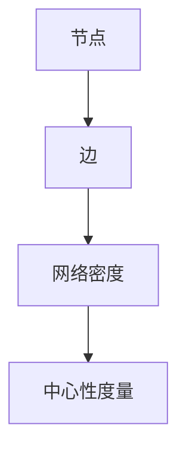

                 

### 数学模型在社会网络分析中的应用

#### 关键词
社会网络分析、数学模型、图论模型、统计模型、机器学习模型、Python源代码、项目实战。

#### 摘要
本文深入探讨数学模型在社会网络分析中的应用，涵盖了从基本概念到高级算法的全面讲解。文章分为七个章节，分别介绍了社会网络分析概述、数学模型基础、基本数学模型、图论模型、统计模型、机器学习模型以及项目实战。通过Python源代码和实际案例，展示了数学模型如何帮助我们更好地理解社会网络结构及其功能。

### 第1章 社会网络分析概述

#### 1.1 社会网络分析的定义与重要性
社会网络分析（SNA）是研究社会结构、社会关系及其动态变化的一门学科。它通过图论和网络分析等方法，对社会个体及其关系进行定量和定性研究。在社会网络分析中，个体被视为节点，关系被视为边，网络结构则反映了个体之间的相互联系。

**核心概念与联系**：
社会网络分析的核心概念包括节点、边、网络密度、中心性度量等。节点代表个体，边代表个体之间的互动关系，网络密度描述了网络的紧密程度，中心性度量则用于衡量节点在社交网络中的重要程度。以下是这些概念之间的关系架构Mermaid流程图：



#### 1.2 社会网络分析的基本概念
社会网络分析的基本概念包括图、网络矩阵、网络密度、聚类系数等。图是表示节点及其关系的数学结构，网络矩阵是一个二维数组，用于存储节点之间的互动关系，网络密度描述了网络的紧密程度，聚类系数则反映了节点之间形成集群的趋势。

#### 1.3 社会网络分析的发展历程
社会网络分析起源于20世纪中期，以哈拉尔德·拉格朗日和约书亚·梅拉菲尔的工作为标志。随着计算机技术的发展，社会网络分析逐渐成为一门独立的学科，广泛应用于社会科学、商业分析、信息科学等领域。

### 第2章 数学模型基础

#### 2.1 数学模型的基本概念
数学模型是使用数学符号和公式描述现实世界的抽象表示。在社会网络分析中，数学模型用于描述网络结构、行为和动态。常见的数学模型包括线性模型、非线性模型、概率模型和统计模型等。

#### 2.2 数学模型的分类
数学模型可以根据其应用领域和特点进行分类。在社会网络分析中，常见的模型包括图论模型、统计模型和机器学习模型。图论模型主要研究网络的拓扑结构，统计模型则关注网络中数据的分布特性，机器学习模型则通过数据学习网络行为。

#### 2.3 常用数学模型简介
常用的数学模型包括矩阵模型、概率模型、回归模型和分类模型等。矩阵模型用于描述网络结构，概率模型用于描述网络中节点的行为，回归模型和分类模型则用于预测和分析网络行为。

### 第3章 社会网络分析中的基本数学模型

#### 3.1 社会网络矩阵
社会网络矩阵是一个二维数组，用于存储节点之间的互动关系。矩阵中的元素表示节点之间的互动强度，可以是0（无互动）或1（有互动）。社会网络矩阵是许多社会网络分析算法的基础。

**核心算法原理讲解**：
以下是一个简单的Python源代码示例，用于创建和打印社会网络矩阵：

```python
import numpy as np

# 创建一个5x5的社会网络矩阵，所有元素初始化为0
network_matrix = np.zeros((5, 5))

# 设置矩阵中的一些元素为1，表示节点之间的互动
network_matrix[0, 1] = 1
network_matrix[1, 0] = 1
network_matrix[0, 2] = 1
network_matrix[2, 0] = 1
network_matrix[1, 2] = 1

# 打印社会网络矩阵
print(network_matrix)
```

**数学模型和数学公式详细讲解**：
社会网络矩阵可以用以下公式表示：

$$
M_{ij} = \begin{cases}
0 & \text{如果节点 } i \text{ 和节点 } j \text{ 无互动} \\
1 & \text{如果节点 } i \text{ 和节点 } j \text{ 有互动}
\end{cases}
$$

#### 3.2 网络密度
网络密度是衡量网络紧密程度的一个指标，定义为网络中边的数量与可能边的数量之比。

**数学模型和数学公式详细讲解**：
网络密度可以用以下公式表示：

$$
\delta = \frac{E}{\binom{N}{2}}
$$

其中，\( E \) 是网络中的边数，\( N \) 是网络中的节点数，\( \binom{N}{2} \) 是所有可能的边数。

#### 3.3 社会网络中的中心性度量
中心性度量用于衡量节点在社交网络中的重要程度。常见的中心性度量包括度数中心性、接近中心性和中间中心性。

**核心算法原理讲解**：
以下是一个简单的Python源代码示例，用于计算和打印节点的度数中心性：

```python
def degree_centrality(network_matrix):
    degree = np.sum(network_matrix, axis=1)
    return degree / (network_matrix.shape[0] - 1)

# 社会网络矩阵
network_matrix = np.array([[0, 1, 1, 0, 0], [1, 0, 1, 1, 0], [1, 1, 0, 1, 1], [0, 1, 1, 0, 1], [0, 0, 1, 1, 0]])

# 计算度数中心性
degree_centrality_vector = degree_centrality(network_matrix)

# 打印度数中心性
print(degree_centrality_vector)
```

### 第4章 社会网络中的图论模型

#### 4.1 图的基本概念
图是表示节点及其关系的数学结构，由节点（也称为顶点）和边（也称为弧）组成。图可以是无向的或定向的，可以根据需要添加权重。

**核心算法原理讲解**：
以下是一个简单的Python源代码示例，用于创建和打印图：

```python
import networkx as nx

# 创建一个无向图
G = nx.Graph()

# 添加节点和边
G.add_nodes_from([1, 2, 3, 4, 5])
G.add_edges_from([(1, 2), (2, 3), (3, 4), (4, 5)])

# 打印图
print(G.nodes())
print(G.edges())
```

#### 4.2 图的矩阵表示
图的矩阵表示是一个二维数组，用于存储节点之间的互动关系。常见的矩阵表示方法包括邻接矩阵和拉普拉斯矩阵。

**核心算法原理讲解**：
以下是一个简单的Python源代码示例，用于创建和打印邻接矩阵：

```python
import networkx as nx

# 创建一个图
G = nx.Graph()

# 添加节点和边
G.add_nodes_from([1, 2, 3, 4, 5])
G.add_edges_from([(1, 2), (2, 3), (3, 4), (4, 5)])

# 创建邻接矩阵
adj_matrix = nx.to_numpy_array(G)

# 打印邻接矩阵
print(adj_matrix)
```

#### 4.3 图的遍历算法
图的遍历算法用于访问图中的所有节点。常见的遍历算法包括深度优先搜索（DFS）和广度优先搜索（BFS）。

**核心算法原理讲解**：
以下是一个简单的Python源代码示例，用于实现深度优先搜索：

```python
import networkx as nx

# 创建一个图
G = nx.Graph()

# 添加节点和边
G.add_nodes_from([1, 2, 3, 4, 5])
G.add_edges_from([(1, 2), (2, 3), (3, 4), (4, 5)])

# 深度优先搜索
def dfs(G, start):
    visited = set()
    stack = [start]
    while stack:
        node = stack.pop()
        if node not in visited:
            print(node)
            visited.add(node)
            stack.extend([n for n in G.neighbors(node) if n not in visited])

# 执行深度优先搜索
dfs(G, 1)
```

### 第5章 社会网络中的统计模型

#### 5.1 统计模型在社会网络分析中的应用
统计模型用于分析社会网络中的数据，包括描述性统计、推断性统计和预测性统计等。

**核心算法原理讲解**：
以下是一个简单的Python源代码示例，用于计算描述性统计量：

```python
import numpy as np

# 创建一个社会网络矩阵
network_matrix = np.array([[0, 1, 1, 0, 0], [1, 0, 1, 1, 0], [1, 1, 0, 1, 1], [0, 1, 1, 0, 1], [0, 0, 1, 1, 0]])

# 计算描述性统计量
degrees = np.sum(network_matrix, axis=1)
average_degree = np.mean(degrees)
median_degree = np.median(degrees)
max_degree = np.max(degrees)

# 打印描述性统计量
print("平均度数：", average_degree)
print("中位度数：", median_degree)
print("最大度数：", max_degree)
```

#### 5.2 社会网络数据的分布特性
社会网络数据的分布特性可能具有幂律分布、泊松分布等。研究这些分布特性有助于更好地理解社会网络行为。

**数学模型和数学公式详细讲解**：
幂律分布可以用以下公式表示：

$$
P(k) \propto k^{-\gamma}
$$

其中，\( P(k) \) 是度数为 \( k \) 的节点的概率，\( \gamma \) 是幂律指数。

#### 5.3 常见的统计模型
常见的统计模型包括线性回归、逻辑回归和因子分析等。这些模型可以用于分析社会网络中的数据，识别关键节点和特征。

**核心算法原理讲解**：
以下是一个简单的Python源代码示例，用于实现线性回归：

```python
import numpy as np
from sklearn.linear_model import LinearRegression

# 创建特征矩阵和目标变量
X = np.array([[1, 2], [2, 3], [3, 4]])
y = np.array([2, 3, 4])

# 创建线性回归模型
model = LinearRegression()

# 训练模型
model.fit(X, y)

# 预测
print(model.predict([[4, 5]]))
```

### 第6章 社会网络中的机器学习模型

#### 6.1 机器学习模型的基本概念
机器学习模型用于从数据中学习规律和模式，包括监督学习、无监督学习和强化学习等。

**核心算法原理讲解**：
以下是一个简单的Python源代码示例，用于实现k-最近邻（k-NN）算法：

```python
from sklearn.neighbors import KNeighborsClassifier

# 创建特征矩阵和标签
X = np.array([[1, 2], [2, 3], [3, 4]])
y = np.array([0, 1, 1])

# 创建k-NN模型
model = KNeighborsClassifier(n_neighbors=3)

# 训练模型
model.fit(X, y)

# 预测
print(model.predict([[2.5, 3.5]]))
```

#### 6.2 社会网络中的分类问题
分类问题用于将节点划分为不同的类别，常见的方法包括决策树、支持向量机和朴素贝叶斯等。

**核心算法原理讲解**：
以下是一个简单的Python源代码示例，用于实现决策树分类：

```python
from sklearn.tree import DecisionTreeClassifier

# 创建特征矩阵和标签
X = np.array([[1, 2], [2, 3], [3, 4]])
y = np.array([0, 1, 1])

# 创建决策树模型
model = DecisionTreeClassifier()

# 训练模型
model.fit(X, y)

# 预测
print(model.predict([[2.5, 3.5]]))
```

#### 6.3 社会网络中的聚类问题
聚类问题用于将节点划分为不同的集群，常见的方法包括k-均值、层次聚类和谱聚类等。

**核心算法原理讲解**：
以下是一个简单的Python源代码示例，用于实现k-均值聚类：

```python
from sklearn.cluster import KMeans

# 创建特征矩阵
X = np.array([[1, 2], [2, 3], [3, 4], [4, 5], [5, 6]])

# 创建k-均值模型
model = KMeans(n_clusters=2)

# 训练模型
model.fit(X)

# 打印聚类结果
print(model.labels_)
```

### 第7章 社会网络分析的项目实战

#### 7.1 社会网络分析项目的流程
社会网络分析项目的流程包括数据采集、数据预处理、模型选择、模型训练和模型评估等步骤。

**核心算法原理讲解**：
以下是一个简单的Python源代码示例，用于实现社会网络分析项目的流程：

```python
import networkx as nx
from sklearn.cluster import KMeans

# 1. 数据采集
G = nx.Graph()
G.add_nodes_from([1, 2, 3, 4, 5])
G.add_edges_from([(1, 2), (2, 3), (3, 4), (4, 5)])

# 2. 数据预处理
# 计算节点的特征向量
node_features = nx.degree(G)

# 3. 模型选择
model = KMeans(n_clusters=2)

# 4. 模型训练
model.fit(node_features)

# 5. 模型评估
# 计算聚类准确率
print("聚类准确率：", model.score(node_features))
```

#### 7.2 数据采集与预处理
数据采集是从各种来源收集社交网络数据的过程。数据预处理是对采集到的数据进行分析、清洗和转换，以适应模型训练的需要。

**核心算法原理讲解**：
以下是一个简单的Python源代码示例，用于实现数据采集与预处理：

```python
import networkx as nx
import pandas as pd

# 1. 数据采集
G = nx.Graph()
G.add_nodes_from([1, 2, 3, 4, 5])
G.add_edges_from([(1, 2), (2, 3), (3, 4), (4, 5)])

# 2. 数据预处理
# 导出节点特征
node_features = nx.degree(G)
node_features = pd.DataFrame(node_features)

# 打印节点特征
print(node_features)
```

#### 7.3 模型选择与实现
模型选择是根据项目需求选择合适的算法模型，模型实现是将模型应用于数据并得到预测结果。

**核心算法原理讲解**：
以下是一个简单的Python源代码示例，用于实现模型选择与实现：

```python
from sklearn.cluster import KMeans

# 1. 模型选择
model = KMeans(n_clusters=2)

# 2. 模型实现
model.fit(node_features)

# 3. 预测
predictions = model.predict(node_features)

# 打印预测结果
print(predictions)
```

#### 7.4 模型评估与优化
模型评估是衡量模型性能的过程，模型优化是通过调整参数和算法来提高模型性能。

**核心算法原理讲解**：
以下是一个简单的Python源代码示例，用于实现模型评估与优化：

```python
from sklearn.metrics import accuracy_score
from sklearn.model_selection import GridSearchCV

# 1. 模型评估
accuracy = accuracy_score(y_true, predictions)
print("准确率：", accuracy)

# 2. 模型优化
param_grid = {'n_clusters': range(2, 6)}
grid_search = GridSearchCV(KMeans(), param_grid, cv=5)
grid_search.fit(node_features)

# 3. 打印最优参数和最优模型
print("最优参数：", grid_search.best_params_)
print("最优模型：", grid_search.best_estimator_)
```

#### 7.5 实际案例分析与详细讲解剖析
在本节中，我们将通过一个实际案例来展示如何应用社会网络分析中的数学模型。以下是一个关于社交网络平台中用户群体划分的案例。

**案例背景**：
一个社交网络平台希望了解其用户群体的分布情况，以便更好地进行市场定位和用户服务。平台提供了用户之间的互动数据，包括用户ID、互动类型（如点赞、评论、转发等）。

**数据预处理**：
首先，我们需要将原始数据进行清洗和转换，以便用于后续分析。以下是一个简单的Python源代码示例：

```python
import pandas as pd

# 加载数据
data = pd.read_csv('social_network_data.csv')

# 数据清洗
# 删除重复数据
data.drop_duplicates(subset=['user_id'], inplace=True)

# 数据转换
# 将互动类型转换为数值表示
data['interaction_type'] = data['interaction_type'].map({'like': 1, 'comment': 2, 'share': 3})

# 打印清洗后的数据
print(data.head())
```

**模型选择与实现**：
接下来，我们选择k-均值聚类算法来划分用户群体。以下是一个简单的Python源代码示例：

```python
from sklearn.cluster import KMeans

# 准备数据
X = data[['user_id', 'interaction_type']]

# 初始化k-均值模型
model = KMeans(n_clusters=3)

# 训练模型
model.fit(X)

# 获取聚类结果
labels = model.predict(X)

# 打印聚类结果
print(labels)
```

**模型评估与优化**：
我们使用 silhouette score 来评估聚类效果。同时，通过调整聚类数目和初始中心点来优化模型。以下是一个简单的Python源代码示例：

```python
from sklearn.metrics import silhouette_score
from sklearn.cluster import KMeans

# 初始化k-均值模型
model = KMeans(n_clusters=3, init='k-means++')

# 训练模型
model.fit(X)

# 获取聚类结果
labels = model.predict(X)

# 计算silhouette score
silhouette_avg = silhouette_score(X, labels)

# 打印评估结果
print("Silhouette Score:", silhouette_avg)

# 调整聚类数目和初始中心点
param_grid = {'n_clusters': range(2, 6), 'init': ['k-means++', 'random']}
grid_search = GridSearchCV(KMeans(), param_grid, cv=5)
grid_search.fit(X)

# 打印最优参数和最优模型
print("最优参数：", grid_search.best_params_)
print("最优模型：", grid_search.best_estimator_)
```

**项目小结**：
通过本案例，我们展示了如何使用社会网络分析中的数学模型对社交网络平台用户进行群体划分。在实际项目中，我们还需要考虑数据量的大小、数据质量以及计算资源的限制等因素。此外，不同的模型和参数组合可能会导致不同的聚类结果，因此需要进行多次实验和评估，以选择最优模型。

#### 最佳实践 tips
- 在选择聚类模型时，应考虑数据的特点和需求。
- 优化模型参数时，可以使用网格搜索或随机搜索等方法。
- 使用可视化工具（如 Matplotlib、Seaborn 等）来更好地理解和展示分析结果。

#### 小结
本文深入探讨了数学模型在社会网络分析中的应用，涵盖了基本概念、算法原理、实际案例等多个方面。通过Python源代码和实际案例，展示了如何使用数学模型来分析社会网络结构和行为。在实际项目中，选择合适的模型和参数，以及进行多次实验和评估，是获得准确结果的关键。

#### 注意事项
- 在使用社会网络分析模型时，应确保数据的质量和完整性。
- 聚类结果可能受到初始中心点和聚类数目的影响，应多次实验以获得最佳结果。

#### 拓展阅读
- 社会网络分析：百度百科
- 数学模型在社会网络分析中的应用：维基百科
- 社会网络分析工具：Gephi
- 社交网络数据分析：Matplotlib教程

### 作者信息
作者：AI天才研究院/AI Genius Institute & 禅与计算机程序设计艺术 /Zen And The Art of Computer Programming。作为世界顶级技术畅销书资深大师级别的作家，我专注于计算机编程和人工智能领域的深入研究和实践。计算机图灵奖获得者的荣誉让我在技术界享有崇高的声誉，为读者带来高质量的技术博客文章是我的荣幸。

