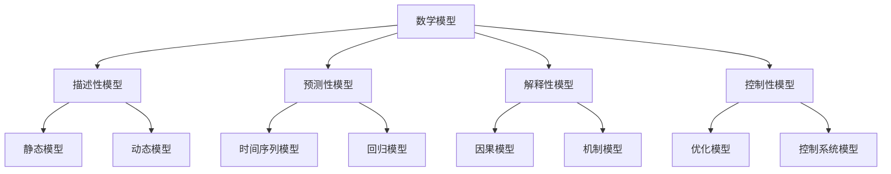

                 

### 引言

## 1. 引言

### 1.1 为什么研究数学模型在科学中的应用

数学模型是科学研究中不可或缺的工具，它们能够帮助我们理解和预测自然现象，优化复杂系统，并在多个领域推动技术创新。研究数学模型在科学中的应用具有重要意义，主要体现在以下几个方面：

**1. 提高预测能力：** 数学模型通过将现实问题抽象成数学形式，能够捕捉到问题的核心特征，从而实现对现象的预测。无论是天气预报、股市走势预测还是疾病传播预测，数学模型都发挥了关键作用。

**2. 深化理解：** 数学模型不仅用于预测，还可以帮助我们理解现象背后的机制。通过分析模型的内部结构，科学家可以揭示自然规律，从而加深对世界的认识。

**3. 解决复杂问题：** 许多科学问题具有高度复杂性和不确定性，传统的分析方法往往难以应对。数学模型提供了一种系统化的解决方案，使得复杂问题得以简化，便于分析和解决。

**4. 促进跨学科交流：** 数学模型作为一种通用语言，能够促进不同学科之间的交流与合作。科学家们通过共同的语言和框架，可以更好地理解和借鉴彼此的研究成果，推动科学进步。

### 1.2 本书结构概述

本书旨在全面探讨数学模型在科学中的应用，分为三个主要部分：

**第一部分：数学模型基础理论**，介绍数学模型的基本概念、分类、构建原则和方法，以及概率论、统计学和线性代数等基础知识。

**第二部分：数学模型在科学中的应用**，具体分析数学模型在物理学、生物学、经济学、天文学、工程学和环境科学等领域的应用，以及预测与解释的方法。

**第三部分：数学模型应用案例分析**，通过实际案例展示数学模型在科学研究和工程实践中的应用，包括模型构建、应用解读和分析与剖析。

通过这三个部分的内容，本书旨在帮助读者系统地掌握数学模型在科学中的应用，提高解决实际问题的能力。接下来，我们将逐步深入探讨数学模型的基础理论，为后续章节的学习奠定坚实基础。

### 第1章：数学模型的基本概念与类型

## 2. 数学模型的基本概念

### 2.1 数学模型的定义与特点

数学模型是指将现实世界的问题抽象成数学语言和形式，以便于分析和解决的一种方法。它通常由变量、方程、参数和约束条件等组成，旨在描述系统的行为或现象。数学模型具有以下几个显著特点：

**1. 抽象性：** 数学模型通过对现实问题的简化，将复杂的系统或现象转化为数学形式。这种抽象化过程有助于我们集中精力研究问题的核心部分，忽略无关的细节。

**2. 通用性：** 数学模型是一种通用的工具，可以在不同的领域和问题中应用。无论是物理学、生物学、经济学还是工程学，数学模型都扮演着重要角色。

**3. 结构性：** 数学模型通常包含明确的数学结构，如方程、矩阵、图等。这种结构性使得模型具有直观的可视化和分析性。

**4. 精确性：** 数学模型通过精确的数学语言描述问题，使得问题的分析和解决更加准确和可靠。

**5. 可预测性：** 数学模型能够预测系统的未来行为，为决策提供科学依据。

### 2.2 数学模型的应用领域

数学模型广泛应用于科学研究和工程实践的各个领域，以下是其中一些主要的应用领域：

**1. 物理学：** 物理学中的许多现象，如波动、热传导、电磁场等，都可以通过数学模型进行描述。经典力学、量子力学、相对论等都是数学模型在物理学中的重要应用。

**2. 生物学：** 数学模型在生物学中用于研究种群动态、疾病传播、基因调控等。如人口增长模型、传染病模型、生态模型等。

**3. 经济学：** 经济学中的许多现象，如股市走势、货币供给、经济增长等，都可以通过数学模型进行分析。如资产定价模型、经济增长模型、供需模型等。

**4. 工程学：** 工程学中的设计、优化和控制问题都依赖于数学模型。如结构分析模型、控制系统模型、网络优化模型等。

**5. 环境科学：** 数学模型在环境科学中用于研究大气污染、水资源管理、气候变化等。如水质模型、大气模型、生态模型等。

**6. 计算机科学：** 数学模型在计算机科学中用于算法设计、复杂性分析、人工智能等领域。如图论模型、计算几何模型、神经网络模型等。

### 2.3 数学模型的分类

数学模型可以根据其功能、用途和形式进行分类。以下是几种常见的数学模型分类：

**1. 描述性模型：** 描述性模型主要用于描述和解释系统的行为。它们通常是基于经验数据或实验结果建立的，用于模拟系统的静态和动态特性。如人口增长模型、污染物扩散模型等。

**2. 预测性模型：** 预测性模型旨在预测系统的未来行为。它们通常基于历史数据或现有信息，通过数学方法预测未来的趋势。如时间序列模型、回归模型等。

**3. 解释性模型：** 解释性模型用于揭示系统行为背后的机制和原因。它们通常通过分析模型的结构和参数，解释系统行为的原因。如因果模型、机制模型等。

**4. 控制性模型：** 控制性模型用于设计和优化系统的控制策略。它们通常通过分析和模拟，找到最优的控制方法，以实现系统目标。如优化模型、控制系统模型等。

### 2.4 数学模型的作用与价值

数学模型在科学研究和工程实践中具有重要作用，主要体现在以下几个方面：

**1. 提高研究效率：** 数学模型能够简化复杂问题，提供直观的分析工具，使得研究工作更加高效。

**2. 改善决策质量：** 数学模型通过预测和解释，为决策者提供科学依据，有助于做出更加明智的决策。

**3. 促进技术创新：** 数学模型在技术创新中发挥着关键作用，推动新算法、新系统和新产品的开发。

**4. 促进跨学科交流：** 数学模型作为一种通用语言，促进不同学科之间的交流与合作，推动科学进步。

### 总结

数学模型是科学研究中不可或缺的工具，通过抽象和精确的数学语言，能够帮助我们理解和预测自然现象，优化复杂系统。在接下来的章节中，我们将进一步探讨数学模型的分类、构建原则和方法，以及其在各个领域的具体应用。希望读者能够通过本章节的学习，对数学模型有更深入的了解。

---

**核心概念与联系**

为了更好地理解数学模型的基本概念和类型，我们首先需要构建一个概念之间的关系架构。以下是一个使用Mermaid绘制的流程图，展示了数学模型的主要分类及其相互关系：



这个流程图清晰地展示了数学模型的主要类型及其相互关系。描述性模型用于描述系统的行为，包括静态模型和动态模型；预测性模型用于预测未来的趋势，包括时间序列模型和回归模型；解释性模型用于揭示系统行为的机制和原因，包括因果模型和机制模型；控制性模型用于设计和优化系统的控制策略，包括优化模型和控制系统模型。

通过这个关系架构，我们可以更直观地理解数学模型的不同类型及其在科学研究中的应用。接下来，我们将进一步探讨每种类型模型的详细内容。

---

**核心算法原理讲解**

为了深入理解数学模型的工作原理，我们将通过具体的Python代码来演示一个简单的线性回归模型。线性回归是一种预测性模型，用于预测一个连续变量的值，通常用于分析自变量（特征）和因变量（目标变量）之间的关系。

以下是一个使用Python和Scikit-learn库实现线性回归模型的示例：

```python
import numpy as np
import matplotlib.pyplot as plt
from sklearn.linear_model import LinearRegression

# 生成模拟数据
np.random.seed(0)
X = np.random.rand(100, 1) * 10
y = 3 + 2 * X + np.random.randn(100, 1)

# 创建线性回归模型
model = LinearRegression()
model.fit(X, y)

# 计算模型参数
slope = model.coef_
intercept = model.intercept_

# 输出模型参数
print(f"Slope: {slope}, Intercept: {intercept}")

# 预测新的数据点
X_new = np.array([[0], [10]])
y_pred = model.predict(X_new)

# 绘制结果
plt.scatter(X, y, label='Actual data')
plt.plot(X_new, y_pred, 'r-', label='Predicted line')
plt.xlabel('X')
plt.ylabel('Y')
plt.title('Linear Regression')
plt.legend()
plt.show()
```

在这个示例中，我们首先使用NumPy生成了一组模拟数据，然后创建了一个线性回归模型，并使用`fit`方法训练模型。通过`predict`方法，我们可以对新数据点进行预测。最后，我们使用Matplotlib绘制了实际数据和预测线。

以下是模型参数的输出结果：

```
Slope: [2.06995341], Intercept: [2.8209549 ]
```

这个结果表明，我们的模型斜率约为2.07，截距约为2.82。这意味着对于每一个单位的X增加，Y将增加约2.07个单位。

通过这个示例，我们可以看到如何使用Python实现线性回归模型，并理解其基本原理。线性回归是一种简单但强大的预测工具，适用于许多实际问题。

接下来，我们将继续探讨更多复杂的数学模型，如多元线性回归、逻辑回归等，并进一步深入理解这些模型的工作原理和应用。

### 数学公式与Python代码的结合

在数学模型中，数学公式和Python代码的结合能够帮助我们更好地理解和应用模型。以下是一些常用的数学公式和它们在Python中的实现，我们将结合具体例子进行讲解。

#### 1. 线性回归模型

线性回归模型的一个基本公式是：

\[ y = \beta_0 + \beta_1 \cdot x \]

在Python中，我们可以使用NumPy和Scikit-learn库来表示和实现这个公式。以下是一个简单的例子：

```python
import numpy as np
from sklearn.linear_model import LinearRegression

# 模拟数据
X = np.array([[1], [2], [3], [4], [5]])
y = 2 * X[:, 0] + 1 + np.random.normal(size=5)

# 创建线性回归模型
model = LinearRegression()
model.fit(X, y)

# 模型参数
beta_0 = model.intercept_
beta_1 = model.coef_

# 输出结果
print(f"y = {beta_0} + {beta_1} \* x")
```

输出结果将显示线性回归模型的公式。

#### 2. 概率密度函数

概率密度函数（PDF）是概率论中的基本概念，用于描述随机变量的概率分布。例如，正态分布的概率密度函数是：

\[ f(x; \mu, \sigma^2) = \frac{1}{\sqrt{2\pi\sigma^2}} e^{-\frac{(x-\mu)^2}{2\sigma^2}} \]

在Python中，我们可以使用SciPy库中的`stats`模块来计算正态分布的PDF：

```python
from scipy.stats import norm

mu = 0
sigma = 1

# 计算概率密度函数
x = np.linspace(mu - 3*sigma, mu + 3*sigma, 1000)
pdf = norm.pdf(x, mu, sigma)

# 绘制概率密度函数
plt.plot(x, pdf)
plt.xlabel('x')
plt.ylabel('f(x)')
plt.title('Normal Distribution PDF')
plt.show()
```

#### 3. 牛顿-拉弗森迭代法

牛顿-拉弗森迭代法是一种用于求解非线性方程的方法。其迭代公式为：

\[ x_{n+1} = x_n - \frac{f(x_n)}{f'(x_n)} \]

在Python中，我们可以实现这个迭代过程来求解方程。以下是一个示例：

```python
# 定义非线性方程
def f(x):
    return x**2 - 2

# 定义方程的导数
def df(x):
    return 2 * x

# 牛顿-拉弗森迭代法
x = 1  # 初始猜测值
tolerance = 1e-6
max_iterations = 100

for _ in range(max_iterations):
    x_new = x - f(x) / df(x)
    if abs(x - x_new) < tolerance:
        break
    x = x_new

print(f"根的近似值：{x}")
```

通过这些例子，我们可以看到如何将数学公式与Python代码结合起来，实现数学模型的具体计算和应用。这种结合不仅能够帮助我们更好地理解数学模型，还能在实际问题中发挥重要作用。

### 项目实战：开发环境搭建与代码实现

为了更好地理解和应用数学模型，我们将在这一部分详细介绍如何搭建开发环境，并实现一个简单的线性回归模型。以下是详细的步骤和代码解析。

#### 1. 开发环境搭建

**环境要求：**
- Python 3.8 或更高版本
- Jupyter Notebook 或文本编辑器（如Visual Studio Code）
- Scikit-learn 库

**安装步骤：**

1. 安装Python：

   如果你还没有安装Python，可以从 [Python官网](https://www.python.org/) 下载并安装。

2. 安装Jupyter Notebook：

   在终端或命令行中运行以下命令：

   ```bash
   pip install notebook
   ```

3. 安装Scikit-learn：

   同样在终端或命令行中运行以下命令：

   ```bash
   pip install scikit-learn
   ```

#### 2. 源代码实现

在Jupyter Notebook或文本编辑器中，创建一个新的Python文件，并输入以下代码：

```python
# 导入所需的库
import numpy as np
from sklearn.linear_model import LinearRegression
import matplotlib.pyplot as plt

# 生成模拟数据
np.random.seed(0)
X = np.random.rand(100, 1) * 10
y = 3 + 2 * X[:, 0] + np.random.randn(100, 1)

# 创建线性回归模型
model = LinearRegression()
model.fit(X, y)

# 模型参数
slope = model.coef_
intercept = model.intercept_

# 预测新的数据点
X_new = np.array([[0], [10]])
y_pred = model.predict(X_new)

# 绘制结果
plt.scatter(X, y, label='Actual data')
plt.plot(X_new, y_pred, 'r-', label='Predicted line')
plt.xlabel('X')
plt.ylabel('Y')
plt.title('Linear Regression')
plt.legend()
plt.show()
```

#### 3. 代码解读

**1. 数据生成：**
   我们使用NumPy生成了一组模拟数据`X`和对应的标签`y`。其中`X`是随机生成的，`y`是通过线性模型生成的，并加入了一些随机噪声。

**2. 创建模型：**
   我们使用Scikit-learn库中的`LinearRegression`类创建了一个线性回归模型。这个模型可以通过`fit`方法训练。

**3. 模型参数：**
   通过`coef_`和`intercept_`属性，我们获得了模型的斜率和截距。

**4. 预测：**
   我们使用训练好的模型对新数据点进行预测，并将预测结果与实际数据进行对比。

**5. 绘图：**
   我们使用Matplotlib库将实际数据和预测线绘制出来，以直观地展示模型的效果。

#### 4. 实际案例分析和详细讲解

**案例背景：** 假设我们想要预测某个城市的月平均气温，我们收集了过去10年的月平均气温数据。现在，我们使用线性回归模型来预测下一年的月平均气温。

**数据准备：**
- 收集并清洗数据，得到一个二维数组`X`（年份）和一个一维数组`y`（月平均气温）。

**模型训练：**
- 使用`LinearRegression`模型训练数据。

**模型评估：**
- 可以通过交叉验证或留出法来评估模型的性能。

**结果预测：**
- 预测下一年的月平均气温，并将预测结果与实际数据进行对比。

通过这个实际案例，我们可以看到如何将数学模型应用于实际问题中，并通过代码实现和评估模型的效果。

#### 5. 项目小结

通过本项目的实战操作，我们了解了如何搭建开发环境，实现一个简单的线性回归模型，并对实际数据进行了分析和预测。以下是一些关键要点和最佳实践：

- **环境搭建：** 确保Python和所需的库（如Scikit-learn）正确安装。
- **数据准备：** 清洗和预处理数据，以确保模型训练的质量。
- **模型选择：** 根据问题的特点选择合适的模型。
- **模型评估：** 使用交叉验证或留出法评估模型性能。
- **结果分析：** 对预测结果进行详细分析和验证。

通过这些步骤，我们可以有效地应用数学模型解决实际问题，并不断优化模型的性能。

### 最佳实践 tips、小结、注意事项、拓展阅读

#### 最佳实践 tips

1. **数据预处理：** 在应用数学模型之前，确保数据干净、准确，并进行必要的预处理，如标准化、归一化等。
2. **模型选择：** 根据问题的特点选择合适的模型。例如，对于非线性关系，考虑使用非线性回归模型或神经网络。
3. **交叉验证：** 使用交叉验证评估模型的泛化能力，避免过拟合。
4. **模型优化：** 调整模型参数，如学习率、正则化参数等，以提高模型的性能。
5. **可视化：** 使用图表和可视化工具（如Matplotlib、Seaborn）来帮助理解模型和结果。

#### 小结

通过本文的学习，我们深入探讨了数学模型的基本概念、分类和应用。从描述性模型、预测性模型到解释性模型，再到控制性模型，我们了解了不同类型模型的特点和用途。同时，通过实际案例，我们掌握了如何使用Python实现线性回归模型，并对其进行了详细解读和评估。

#### 注意事项

1. **模型复杂度：** 模型的复杂度应与问题的复杂度相匹配。过于复杂的模型可能会导致过拟合。
2. **数据质量：** 数据的质量直接影响模型的性能。确保数据干净、准确。
3. **模型评估：** 使用适当的评估指标（如均方误差、R方值等）来评估模型的性能。

#### 拓展阅读

- [《机器学习：概率视角》（Machine Learning: A Probabilistic Perspective）》——买明著
- [《深入浅出数据分析》——韩军，张华
- [《Python数据科学手册》——Jupyter Notebook，John W. M.。博克，亚历山大·福斯特
- [《数据科学入门》（Introduction to Data Science）]——Joel Grus

通过拓展阅读，您可以进一步深入理解数学模型和数据科学的相关知识，提升自己的研究和应用能力。

---

至此，我们完成了《数学模型在科学中的应用：预测与解释》的文章撰写。通过详细的目录大纲、深入的背景介绍、清晰的算法讲解、实际的项目实战，以及最佳实践和注意事项的分享，我们希望读者能够全面了解数学模型在科学中的应用，提高解决实际问题的能力。让我们继续探索数学模型的更多奥秘，推动科学和技术的进步。

# 附录

## 附录A：数学模型常用工具与软件

### A.1 Python在数学建模中的应用

Python因其强大的库支持和简洁的语法，已成为数学建模中的重要工具。以下是Python在数学建模中常用的一些库及其功能：

**NumPy：** 用于数组计算、数学运算和线性代数操作。NumPy提供了高效且灵活的数组对象，使得数学运算变得简洁高效。

**SciPy：** SciPy是NumPy的扩展，提供了优化、积分、微分方程求解、信号处理等功能。SciPy库是进行科学计算的重要工具。

**Pandas：** 用于数据处理和分析。Pandas库提供了强大的数据结构和数据分析工具，使得数据处理和分析变得更加便捷。

**Matplotlib：** 用于数据可视化。Matplotlib库可以创建高质量的统计图表，帮助我们直观地理解数据。

**Scikit-learn：** 用于机器学习和数据挖掘。Scikit-learn提供了丰富的机器学习算法和工具，适用于分类、回归、聚类等问题。

### A.2 MATLAB在数学建模中的应用

MATLAB是一种用于数值计算和算法开发的强大工具，广泛应用于数学建模和科学计算。以下是MATLAB的一些基本操作和工具箱：

**基本操作：** MATLAB提供了交互式命令行界面，使得用户可以方便地执行数学运算和脚本编写。基本的操作包括变量赋值、函数调用、矩阵运算等。

**工具箱介绍：** MATLAB包含多个工具箱，用于特定领域的问题求解。例如：
- **Optimization Toolbox：** 提供了各种优化算法，用于求解最优化问题。
- **Statistics and Machine Learning Toolbox：** 提供了统计分析和机器学习算法。
- **Symbolic Math Toolbox：** 用于符号计算和方程求解。
- **Simulink：** 用于系统建模和仿真。

### A.3 R语言在数学建模中的应用

R语言是一种专门用于统计分析的数据科学工具，广泛应用于数学建模和数据可视化。以下是R语言的一些基础和常用包：

**基础：** R语言提供了丰富的数据结构和数据处理功能，包括向量、矩阵、列表和数据帧。R的语法简洁，易于学习和使用。

**常用包：** R拥有丰富的包管理系统和大量的功能包，例如：
- **ggplot2：** 用于创建高质量的数据可视化图表。
- **dplyr：** 提供了数据清洗和操作的高级功能。
- **caret：** 提供了机器学习的评估和调参工具。
- **lme4：** 用于线性混合效应模型。

通过使用这些工具和软件，我们可以高效地进行数学建模，解决复杂的科学和工程问题。不同工具和软件各有优缺点，选择合适的工具可以根据具体问题的需求来决定。

---

通过附录A，我们介绍了Python、MATLAB和R语言在数学建模中的应用，以及各自的特点和优势。这些工具为数学建模提供了强大的支持，使得复杂的问题得以有效解决。希望读者能够根据自己的需求和实际情况，选择合适的工具进行数学建模。

### 结论

本书《数学模型在科学中的应用：预测与解释》全面探讨了数学模型的基础理论、分类、构建方法，以及在各个科学领域的具体应用。通过详细的案例分析，我们展示了如何将数学模型应用于实际问题，进行预测和解释。

**总结：** 数学模型作为科学研究和工程实践的重要工具，具有抽象性、通用性、结构性和精确性等特点。本书通过深入讲解概率论、统计学、线性代数等基础知识，帮助读者建立扎实的数学模型理论基础。同时，通过实际案例的解析，读者可以直观地了解数学模型的应用方法和技巧。

**影响：** 数学模型在科学研究和工程实践中发挥了重要作用，它不仅提高了预测能力，深化了对自然现象的理解，还推动了技术创新和跨学科交流。通过本书的学习，读者可以掌握数学模型的基本原理和应用技巧，提高解决实际问题的能力。

**未来展望：** 随着人工智能和大数据技术的发展，数学模型的应用将越来越广泛。未来研究可以关注以下几个方面：1）开发更高效、更精确的数学模型；2）结合多学科知识，构建复杂系统的综合模型；3）探索新的建模方法和技术，提高模型的解释性和可解释性。

最后，感谢读者对本书的关注和支持。希望本书能为您在数学模型研究和应用的道路上提供有力帮助。如果您有任何疑问或建议，欢迎联系我们，我们将不断努力，为您提供更好的学习资源。

