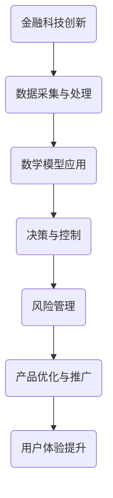

                 

### 《数学模型在金融科技创新中的应用》

**关键词**：金融科技，数学模型，科技创新，风险管理，投资策略，智能投顾

**摘要**：本文深入探讨了数学模型在金融科技创新中的应用，涵盖了从基础数学模型到高级金融科技产品开发的各个方面。文章通过详细的分析和案例，阐述了数学模型如何提升金融科技产品的效率和准确性，并提出了未来发展的方向和面临的挑战。

### 第一部分：金融科技创新与数学模型概述

#### 第1章：金融科技创新概述

**1.1.1 金融科技创新的背景与趋势**

随着信息技术的飞速发展，金融科技（Fintech）正逐渐改变传统金融的运作模式。从移动支付到区块链，从人工智能到大数据分析，金融科技的创新正在推动整个行业的变革。根据PwC的《金融科技报告》，金融科技市场在2020年的规模已经超过4.7万亿美元，并且预计未来将继续保持高速增长。

金融科技创新的背景主要包括以下几个方面：

1. **消费者需求的变化**：现代消费者越来越追求便捷、高效、个性化的金融服务。
2. **技术的进步**：云计算、人工智能、区块链等新兴技术的应用，为金融科技的发展提供了强大的技术支持。
3. **监管的改革**：各国监管机构不断推出新的法规和指引，以适应金融科技的快速发展。

**1.1.2 数学模型在金融科技创新中的重要性**

数学模型是金融科技的核心组成部分，其在金融科技创新中的重要性体现在以下几个方面：

1. **数据驱动的决策**：金融科技产品依赖于大量的数据进行分析，而数学模型可以帮助金融机构从海量数据中提取有价值的信息，做出更加精准的决策。
2. **风险管理和控制**：通过数学模型，金融机构可以更准确地评估风险，设计出更有效的风险管理策略。
3. **提高效率和降低成本**：数学模型可以帮助金融机构自动化许多传统的手工操作，从而提高工作效率，降低运营成本。

**1.1.3 金融科技创新与数学模型的关系Mermaid流程图**



通过上述流程图，我们可以看出数学模型在金融科技创新中扮演着关键角色，从数据采集、处理、应用到决策、风险管理、产品优化和用户体验提升，每一个环节都离不开数学模型的支持。

### 第2章：数学模型基础

**2.1.1 数学模型的基本概念**

数学模型是指用数学语言来描述现实世界中的某个系统、现象或过程。它通常包括变量、方程、约束条件和目标函数等组成部分。在金融科技领域，数学模型广泛应用于风险管理、投资策略和金融市场预测等方面。

**2.1.2 数学模型在金融领域中的应用**

数学模型在金融领域的应用非常广泛，以下是一些常见的应用场景：

1. **风险管理**：通过建立数学模型，可以对金融机构面临的各种风险进行量化分析，包括信用风险、市场风险、操作风险等。
2. **投资策略**：数学模型可以帮助投资者制定有效的投资策略，例如资产配置模型、量化交易策略等。
3. **金融市场预测**：利用时间序列分析、回归分析等数学模型，可以对金融市场进行预测，帮助投资者做出更明智的决策。

**2.1.3 伪代码：线性回归模型工作原理**

```python
# 线性回归模型伪代码
def linear_regression(X, y):
    # 初始化权重和偏置
    weights = initialize_weights(X.shape[1])
    bias = initialize_bias()
    
    # 训练模型
    for epoch in range(num_epochs):
        # 计算预测值
        predictions = X * weights + bias
        
        # 计算损失函数
        loss = compute_loss(y, predictions)
        
        # 更新权重和偏置
        weights = weights - learning_rate * gradient(loss, weights)
        bias = bias - learning_rate * gradient(loss, bias)
        
    return weights, bias
```

在这个伪代码中，`X` 代表输入特征矩阵，`y` 代表标签向量，`weights` 和 `bias` 分别表示权重和偏置。`initialize_weights` 和 `initialize_bias` 函数用于初始化权重和偏置，`compute_loss` 函数用于计算损失函数，`gradient` 函数用于计算损失函数的梯度。

**2.1.4 latex格式：线性回归损失函数公式**

$$
L(\theta) = \frac{1}{2m} \sum_{i=1}^{m} (h_\theta(x^{(i)}) - y^{(i)})^2
$$

在这个公式中，`L` 代表损失函数，`m` 代表样本数量，`h_\theta(x^{(i)})` 代表预测值，`y^{(i)}` 代表真实值。

### 第二部分：金融科技创新中的数学模型应用

#### 第3章：风险管理模型

**3.1.1 信用评分模型**

信用评分模型是一种基于历史数据和统计方法的数学模型，用于评估个人或企业的信用风险。它可以帮助金融机构决定是否批准贷款或信用卡申请，以及确定贷款利率和信用额度。

**3.1.2 市场风险模型**

市场风险模型用于评估金融市场波动对金融机构的潜在影响。常见的市场风险模型包括VaR（Value at Risk）模型和CVaR（Conditional Value at Risk）模型。

**3.1.3 风险管理模型的项目实战**

在本节中，我们将通过一个实际案例来展示如何使用数学模型进行风险管理。假设我们有一家金融机构需要评估其投资组合的市场风险，我们可以使用VaR模型来计算其潜在的市场风险。

```python
# VaR模型计算示例
import numpy as np

# 假设投资组合的价值为1000万元，每天的价格波动为2%
daily_variance = 0.02
confidence_level = 0.95

# 计算VaR值
VaR = -np.percentile(np.random.normal(0, daily_variance, 252), (1 - confidence_level) * 100)

print("VaR值为：", VaR)
```

在这个示例中，我们使用正态分布来模拟投资组合的价值波动，通过计算一定置信水平下的百分位数来得到VaR值。

#### 第4章：投资策略模型

**4.1.1 资产配置模型**

资产配置模型是一种基于投资者的风险偏好和投资目标，将资金分配到不同资产类别（如股票、债券、现金等）的数学模型。它可以帮助投资者实现资产的最优化配置。

**4.1.2 量化交易策略**

量化交易策略是一种基于数学模型和统计方法的交易策略，它利用算法自动执行交易决策。常见的量化交易策略包括均值回归策略、趋势跟踪策略等。

**4.1.3 投资策略模型的项目实战**

在本节中，我们将通过一个实际案例来展示如何使用量化交易策略进行投资。假设我们使用均值回归策略进行交易，我们可以通过以下步骤来实现：

1. 计算资产的历史价格波动。
2. 确定均值回归的目标价格。
3. 根据目标价格和当前价格的关系，决定买入或卖出。

```python
# 均值回归策略计算示例
import numpy as np

# 假设资产的历史价格为[100, 105, 102, 108, 104]
prices = np.array([100, 105, 102, 108, 104])

# 计算均值
mean_price = np.mean(prices)

# 确定买入或卖出的阈值
buy_threshold = mean_price - 0.5 * np.std(prices)
sell_threshold = mean_price + 0.5 * np.std(prices)

# 根据当前价格进行交易决策
current_price = 103
if current_price < buy_threshold:
    action = "买入"
elif current_price > sell_threshold:
    action = "卖出"
else:
    action = "持有"

print("当前价格为", current_price, "，建议", action)
```

在这个示例中，我们通过计算均值和标准差来确定买入和卖出的阈值，并根据当前价格进行交易决策。

#### 第5章：金融市场预测模型

**5.1.1 时间序列预测模型**

时间序列预测模型是一种基于历史时间序列数据的数学模型，用于预测未来某个时间点的数值。常见的模型包括ARIMA（自回归积分滑动平均模型）和LSTM（长短期记忆网络）。

**5.1.2 股票市场预测**

股票市场预测是金融科技领域的一个重要应用。通过建立数学模型，可以对股票价格进行预测，帮助投资者做出更明智的决策。

**5.1.3 金融市场预测模型的项目实战**

在本节中，我们将通过一个实际案例来展示如何使用时间序列预测模型进行股票市场预测。假设我们使用LSTM模型来预测股票价格，我们可以通过以下步骤来实现：

1. 数据预处理：将股票价格数据转换为适合LSTM模型输入的格式。
2. 模型训练：使用历史数据训练LSTM模型。
3. 预测：使用训练好的模型预测未来股票价格。

```python
# LSTM模型股票价格预测示例
import numpy as np
import tensorflow as tf
from tensorflow.keras.models import Sequential
from tensorflow.keras.layers import LSTM, Dense

# 假设股票价格数据为[100, 102, 105, 108, 110]
prices = np.array([100, 102, 105, 108, 110]).reshape(-1, 1)

# 数据预处理
window_size = 5
X = []
y = []
for i in range(len(prices) - window_size):
    X.append(prices[i:i+window_size])
    y.append(prices[i+window_size])

X = np.array(X)
y = np.array(y)

# 模型训练
model = Sequential()
model.add(LSTM(units=50, return_sequences=True, input_shape=(window_size, 1)))
model.add(LSTM(units=50))
model.add(Dense(units=1))

model.compile(optimizer='adam', loss='mean_squared_error')
model.fit(X, y, epochs=100, batch_size=32)

# 预测
future_prices = model.predict(X[-window_size:])
print("未来股票价格为：", future_prices.flatten())
```

在这个示例中，我们首先将股票价格数据分为窗口序列，然后使用LSTM模型进行训练和预测。

#### 第6章：智能投顾模型

**6.1.1 智能投顾的概念**

智能投顾（Robo-Advisor）是一种基于人工智能和数学模型的在线投资顾问服务。它通过分析投资者的风险偏好和财务目标，自动制定和调整投资组合。

**6.1.2 智能投顾的工作流程**

智能投顾的工作流程通常包括以下几个步骤：

1. 数据收集：收集投资者的个人信息、财务状况和投资目标。
2. 风险评估：使用数学模型评估投资者的风险承受能力。
3. 投资组合制定：根据风险评估结果，制定个性化的投资组合。
4. 投资组合调整：定期根据市场变化和投资者需求调整投资组合。

**6.1.3 智能投顾模型的项目实战**

在本节中，我们将通过一个实际案例来展示如何使用智能投顾模型。假设我们有一家智能投顾公司，需要为投资者制定个性化的投资组合。我们可以通过以下步骤来实现：

1. 数据收集：从投资者那里收集个人信息和财务状况。
2. 风险评估：使用数学模型评估投资者的风险承受能力。
3. 投资组合制定：根据风险评估结果，制定个性化的投资组合。
4. 投资组合调整：定期根据市场变化和投资者需求调整投资组合。

```python
# 智能投顾模型投资组合制定示例
import numpy as np

# 假设投资者数据为{'年龄': 30, '收入': 50000, '投资目标': '退休规划'}
investor_data = {'年龄': 30, '收入': 50000, '投资目标': '退休规划'}

# 风险评估
def assess_risk(investor_data):
    # 基于年龄和收入评估风险承受能力
    age = investor_data['年龄']
    income = investor_data['收入']
    risk_level = '中等风险' if age > 25 and income > 30000 else '低风险'
    return risk_level

# 投资组合制定
def create_portfolio(risk_level):
    # 根据风险承受能力制定投资组合
    if risk_level == '高风险':
        return {'股票': 70, '债券': 30}
    elif risk_level == '中等风险':
        return {'股票': 50, '债券': 50}
    else:
        return {'股票': 20, '债券': 80}

# 投资组合调整
def adjust_portfolio(portfolio, market_index):
    # 根据市场指数调整投资组合
    if market_index > 100:
        return {'股票': portfolio['股票'] * 1.1, '债券': portfolio['债券'] * 0.9}
    else:
        return {'股票': portfolio['股票'] * 0.9, '债券': portfolio['债券'] * 1.1}

# 实际应用
risk_level = assess_risk(investor_data)
print("风险承受能力为：", risk_level)

portfolio = create_portfolio(risk_level)
print("初始投资组合为：", portfolio)

market_index = 105
adjusted_portfolio = adjust_portfolio(portfolio, market_index)
print("调整后投资组合为：", adjusted_portfolio)
```

在这个示例中，我们首先评估投资者的风险承受能力，然后根据评估结果制定个性化的投资组合，并根据市场指数进行定期调整。

#### 第7章：金融科技产品开发

**7.1.1 金融科技产品的设计原则**

金融科技产品的设计原则主要包括以下几个方面：

1. **用户体验至上**：以用户需求为导向，提供简单、便捷、个性化的金融服务。
2. **技术创新驱动**：不断探索和应用最新的科技，提高产品的竞争力和用户体验。
3. **数据驱动**：充分利用数据，通过数据分析优化产品功能和用户体验。
4. **安全合规**：确保产品的安全性和合规性，保护用户信息和资产安全。

**7.1.2 金融科技产品的开发流程**

金融科技产品的开发流程通常包括以下几个阶段：

1. **需求分析**：明确产品功能和目标用户。
2. **设计阶段**：包括UI/UX设计、架构设计和详细设计。
3. **开发阶段**：包括前端开发、后端开发和测试。
4. **部署与运维**：将产品部署到生产环境，并进行持续运维和优化。

**7.1.3 金融科技产品的案例分析**

在本节中，我们将通过一个实际案例来展示如何开发一款金融科技产品。假设我们开发一款智能投顾APP，我们可以通过以下步骤来实现：

1. **需求分析**：明确APP的功能和目标用户，如提供投资组合推荐、资产配置建议、定期报告等。
2. **设计阶段**：设计APP的UI/UX界面，确定系统的架构和模块。
3. **开发阶段**：编写代码，实现APP的功能。
4. **部署与运维**：将APP部署到应用商店，并进行持续监控和优化。

```python
# 智能投顾APP开发示例
# 假设我们已经完成了需求分析和设计阶段，现在开始编写代码实现APP功能。

# UI/UX设计
# - 主页：显示用户的投资组合、资产配置、收益情况等。
# - 报告：定期生成投资报告，包括市场分析、投资策略调整建议等。
# - 设置：允许用户修改个人信息、调整风险偏好等。

# 后端开发
# - 数据处理模块：负责收集、处理和分析用户数据。
# - 投资策略模块：根据用户数据和风险评估结果，制定投资组合。
# - 报告生成模块：生成投资报告，包括文字和图表等形式。

# 前端开发
# - 主页界面：显示用户的投资组合、资产配置、收益情况等。
# - 报告界面：展示投资报告，包括文字和图表等形式。
# - 设置界面：允许用户修改个人信息、调整风险偏好等。

# 测试与部署
# - 单元测试：测试各个模块的功能和性能。
# - 集成测试：测试整个系统的功能和性能。
# - 部署：将APP部署到应用商店，并进行持续监控和优化。

# 代码示例
# 在这里，我们仅提供一个简单的代码示例，展示如何根据用户数据生成投资报告。

def generate_report(user_data):
    # 根据用户数据生成投资报告
    report = {
        '投资组合': user_data['portfolio'],
        '资产配置': user_data['allocation'],
        '收益情况': user_data['performance']
    }
    return report

# 假设用户数据为
user_data = {
    'portfolio': {'股票': 50, '债券': 30, '现金': 20},
    'allocation': {'股票': 0.5, '债券': 0.3, '现金': 0.2},
    'performance': {'总收益': 10, '年化收益': 5}
}

# 生成投资报告
report = generate_report(user_data)
print("投资报告：", report)
```

在这个示例中，我们仅提供了一个简单的代码示例，展示了如何根据用户数据生成投资报告。实际开发中，需要实现更多的功能和模块，并进行详细的测试和优化。

### 第三部分：未来展望与挑战

#### 第8章：数学模型在金融科技创新中的未来发展

**8.1.1 新型数学模型的发展趋势**

随着科技的不断进步，新型数学模型在金融科技创新中的应用前景广阔。例如，深度学习模型在金融市场预测和风险控制中的应用，分布式计算在处理海量金融数据方面的优势等。

**8.1.2 金融科技创新的前沿方向**

未来，金融科技创新的前沿方向包括：

1. **区块链技术**：在支付、清算、信用评估等领域的广泛应用。
2. **人工智能**：在投资决策、风险管理、用户体验提升等方面的深入应用。
3. **大数据分析**：通过对海量金融数据的深入分析，提升金融服务的智能化水平。

**8.1.3 未来数学模型在金融科技中的角色**

未来，数学模型在金融科技中将扮演更加重要的角色，不仅应用于传统的风险管理、投资策略等领域，还将深入到金融服务的各个环节，提升金融服务的质量和效率。

#### 第9章：数学模型在金融科技创新中的挑战与应对策略

**9.1.1 数据隐私与安全性挑战**

随着数据量的增加，数据隐私和安全性成为金融科技创新面临的重要挑战。应对策略包括：

1. **数据加密**：对敏感数据进行加密处理，确保数据传输和存储的安全。
2. **隐私保护技术**：利用差分隐私、同态加密等隐私保护技术，保护用户隐私。

**9.1.2 法规与监管挑战**

金融科技创新的快速发展对现有的法律法规和监管框架提出了新的挑战。应对策略包括：

1. **合规性审查**：在产品开发和运营过程中，确保遵循相关法律法规。
2. **监管合作**：与监管机构建立沟通和合作机制，共同推动金融科技创新的发展。

**9.1.3 技术伦理与社会责任**

金融科技创新在带来便利和效率的同时，也引发了一系列伦理和社会责任问题。应对策略包括：

1. **伦理审查**：在产品设计和开发过程中，进行伦理审查，确保技术的应用符合伦理规范。
2. **社会责任**：关注社会影响，推动金融科技为社会发展做出积极贡献。

### 结语

数学模型在金融科技创新中具有不可替代的重要性。通过本文的探讨，我们看到了数学模型在金融科技各个领域的广泛应用，以及其如何提升金融服务的质量和效率。未来，随着科技的不断进步，数学模型在金融科技创新中的作用将更加重要，同时也将面临更多的挑战。作为金融科技领域的研究者和从业者，我们需要不断探索和创新，为金融科技的未来发展贡献力量。

**作者：AI天才研究院/AI Genius Institute & 禅与计算机程序设计艺术 /Zen And The Art of Computer Programming**

