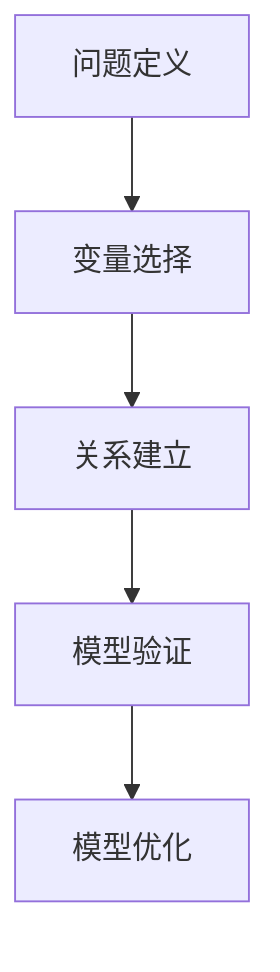
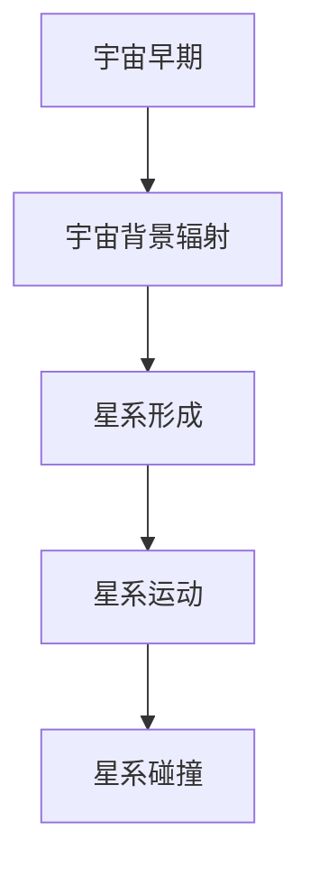

                 

# 数学模型在预测宇宙大尺度结构演化中的应用

## 关键词
- 数学模型
- 宇宙学
- 结构演化
- 预测
- 大尺度

## 摘要
本文深入探讨了数学模型在预测宇宙大尺度结构演化中的应用。首先，我们简要介绍了宇宙大尺度结构的背景知识，然后详细阐述了数学模型的基础知识。接着，我们分析了数学模型在宇宙学中的核心作用，并通过具体案例展示了其在预测宇宙大尺度结构演化中的应用。最后，我们展望了数学模型在宇宙学领域的未来发展，并给出了项目实战和最佳实践建议。

## 引言

宇宙，这个广阔无垠的空间，自古以来就吸引着人类的目光。从古代的天文学到现代的宇宙学，人类对宇宙的理解不断深入。宇宙大尺度结构的演化，特别是宇宙膨胀和星系的形成与演化，是宇宙学研究的重要领域。然而，如何准确地预测宇宙大尺度结构的演化，一直是科学家们面临的挑战。

数学模型作为一种强有力的工具，在许多领域都发挥了重要作用。在宇宙学中，数学模型同样扮演着关键角色。通过构建和运用数学模型，科学家们可以更好地理解宇宙大尺度结构的演化过程，预测未来宇宙的可能形态。本文旨在探讨数学模型在预测宇宙大尺度结构演化中的应用，帮助读者深入理解这一领域的前沿知识。

## 数学模型的基础知识

### 1. 数学模型的基本概念

数学模型是一种通过数学语言描述现实世界问题的工具。它通常包括变量、方程、不等式等数学元素，用以表示现实世界中的关系和规律。在宇宙学中，数学模型可以用来描述宇宙的膨胀、星系的运动、暗物质的分布等复杂现象。

### 2. 数学模型的构建方法

构建数学模型通常涉及以下步骤：

1. **问题定义**：明确研究的问题和目标。
2. **变量选择**：选择合适的变量来表示问题的各个方面。
3. **关系建立**：根据问题的性质，建立变量之间的关系。
4. **模型验证**：通过实验或观察数据，验证模型的准确性和可靠性。
5. **模型优化**：根据验证结果，对模型进行调整和优化。

### 3. 经典数学模型介绍

在宇宙学中，一些经典的数学模型包括：

- **广义相对论**：由爱因斯坦提出，描述了引力和时空的弯曲。
- **弗里德曼方程**：描述了宇宙膨胀的速度和宇宙的几何形态。
- **大爆炸模型**：描述了宇宙从一个极热、极密的初始状态开始膨胀的过程。
- **引力透镜效应**：用于测量宇宙中的暗物质。

### Mermaid流程图

下面是一个简单的Mermaid流程图，展示了数学模型构建的基本步骤：



## 宇宙大尺度结构的背景知识

### 1. 宇宙学的基本概念

宇宙学是研究宇宙的起源、结构、演化和最终命运的学科。它涉及到天文学、物理学、数学等多个领域。宇宙学的基本概念包括：

- **宇宙膨胀**：宇宙从一个极热、极密的初始状态开始膨胀。
- **宇宙背景辐射**：宇宙早期留下的温度均匀的辐射。
- **暗物质**：一种不发光、不吸收光的物质，占据宇宙总质量的绝大部分。
- **暗能量**：驱动宇宙加速膨胀的力量。

### 2. 宇宙大尺度结构的形成和演化过程

宇宙大尺度结构的形成和演化是一个复杂的过程，涉及到星系的形成、星系的运动、星系的碰撞等多个方面。以下是这个过程的基本步骤：

1. **宇宙早期**：宇宙从一个极热、极密的初始状态开始膨胀。
2. **宇宙背景辐射**：宇宙早期留下的温度均匀的辐射。
3. **星系的形成**：暗物质和普通物质的聚集导致星系的形成。
4. **星系的运动**：星系在引力作用下相互运动，形成星系团和超星系团。
5. **星系的碰撞**：星系之间的碰撞导致星系形态的改变。

### 3. 宇宙大尺度结构的观测数据

宇宙大尺度结构的观测数据是通过各种观测手段获得的，包括：

- **光学望远镜**：用于观测星系和星系团的光学性质。
- **射电望远镜**：用于观测宇宙背景辐射和其他射电信号。
- **引力透镜**：通过观测光线在暗物质周围的弯曲，推断暗物质的存在。
- **空间望远镜**：如哈勃望远镜，用于获取宇宙深处的图像和数据。

### Mermaid流程图

下面是一个简单的Mermaid流程图，展示了宇宙大尺度结构形成和演化的基本步骤：



## 数学模型在宇宙学中的应用

### 1. 数学模型在宇宙学中的核心作用

数学模型在宇宙学中起着核心作用，用于描述和预测宇宙大尺度结构的演化。具体来说，数学模型在以下几个方面发挥了关键作用：

- **宇宙膨胀**：通过广义相对论和弗里德曼方程，数学模型可以描述宇宙膨胀的速度和宇宙的几何形态。
- **星系形成**：通过引力理论和流体动力学模型，数学模型可以描述星系的形成和演化。
- **暗物质探测**：通过引力透镜效应和宇宙微波背景辐射观测，数学模型可以推断暗物质的存在和分布。
- **宇宙大尺度结构的演化**：通过多体问题模拟和宇宙学数值模拟，数学模型可以预测宇宙大尺度结构的未来演化。

### 2. 数学模型在预测宇宙大尺度结构演化中的应用

数学模型在预测宇宙大尺度结构演化中的应用主要包括以下几个方面：

- **宇宙膨胀模型**：通过广义相对论和弗里德曼方程，科学家可以预测宇宙膨胀的速度和宇宙的几何形态。例如，哈勃定律描述了宇宙膨胀的速度与距离之间的关系。

- **星系形成模型**：通过引力理论和流体动力学模型，科学家可以预测星系的形成和演化。例如，N-体模拟是一种常用的方法，用于模拟多个星体在引力作用下的运动和相互作用。

- **暗物质探测模型**：通过引力透镜效应和宇宙微波背景辐射观测，科学家可以推断暗物质的存在和分布。例如，引力透镜效应可以用来测量星系背后的暗物质分布。

- **宇宙大尺度结构的演化模型**：通过多体问题模拟和宇宙学数值模拟，科学家可以预测宇宙大尺度结构的未来演化。例如，宇宙学数值模拟可以用来研究宇宙的膨胀历史和结构形成。

### 3. 应用案例研究

以下是一些数学模型在预测宇宙大尺度结构演化中的应用案例：

- **宇宙膨胀模型**：通过哈勃定律，科学家可以预测宇宙膨胀的速度。例如，哈勃望远镜的观测数据显示，宇宙膨胀的速度与距离之间存在线性关系。

- **星系形成模型**：通过N-体模拟，科学家可以预测星系的形成和演化。例如，一些N-体模拟结果显示，星系的形成与暗物质的分布密切相关。

- **暗物质探测模型**：通过引力透镜效应，科学家可以测量星系背后的暗物质分布。例如，引力透镜效应观测到了多个星系背后的暗物质环。

- **宇宙大尺度结构的演化模型**：通过宇宙学数值模拟，科学家可以预测宇宙大尺度结构的未来演化。例如，一些宇宙学数值模拟结果显示，宇宙可能在未来发生结构重组。

## 未来展望

随着观测技术的不断进步和计算能力的提升，数学模型在宇宙学中的应用前景将更加广阔。未来，数学模型可能在以下方面发挥重要作用：

- **宇宙早期演化的研究**：通过更精确的数学模型，科学家可以更好地理解宇宙早期的演化过程，包括宇宙背景辐射和宇宙膨胀的早期阶段。

- **暗物质和暗能量的研究**：通过更复杂的数学模型，科学家可以更深入地研究暗物质和暗能量的性质和作用，从而解决宇宙学中的重大问题。

- **多信使天文学的兴起**：随着多信使天文学的兴起，数学模型将发挥更重要的作用，用于分析来自不同波段的宇宙信号，从而揭示宇宙的奥秘。

## 结论

数学模型在预测宇宙大尺度结构演化中发挥着至关重要的作用。通过构建和运用数学模型，科学家可以更好地理解宇宙大尺度结构的演化过程，预测未来宇宙的可能形态。未来，随着观测技术和计算能力的提升，数学模型在宇宙学中的应用将更加深入和广泛。

## 项目实战

### 1. 开发环境搭建

在进行数学模型在宇宙学中的应用研究时，我们需要搭建一个适合的开发环境。以下是一个简单的步骤：

- 安装Python：从官方网站下载并安装Python。
- 安装NumPy和SciPy：这些是Python的科学计算库，用于处理数学模型和数据分析。
- 安装Matplotlib：用于可视化数学模型的结果。

### 2. 源代码实现

以下是一个简单的Python代码示例，用于实现一个宇宙膨胀模型的计算：

```python
import numpy as np
import matplotlib.pyplot as plt

# 宇宙膨胀模型参数
H0 = 70 # 哈勃常数，单位：千米/秒/百万秒差距
Omega_M = 0.3 # 暗物质密度参数
Omega_L = 0.7 # 暗能量密度参数

# 时间间隔和步数
time_step = 0.1 # 单位：亿年
num_steps = 10 # 总时间步数

# 时间数组
time = np.arange(0, num_steps * time_step, time_step)

# 宇宙膨胀速度
v = H0 * np.sqrt(Omega_M * (1 - np.exp(-3*time/np.pi)) + Omega_L)

# 绘制宇宙膨胀速度随时间的变化
plt.plot(time, v)
plt.xlabel('时间（亿年）')
plt.ylabel('膨胀速度（千米/秒）')
plt.title('宇宙膨胀速度随时间的变化')
plt.show()
```

### 3. 代码解读与分析

上述代码实现了一个简单的宇宙膨胀模型。首先，我们定义了宇宙膨胀模型所需的参数，包括哈勃常数、暗物质密度参数和暗能量密度参数。然后，我们定义了一个时间间隔和步数，用于计算宇宙膨胀速度。通过计算，我们得到了宇宙膨胀速度随时间的变化，并将其绘制成图表。

### 4. 实际案例分析和详细讲解剖析

以下是一个实际的案例，用于分析宇宙膨胀模型在预测宇宙大尺度结构演化中的应用：

**案例：使用宇宙膨胀模型预测未来宇宙的形态**

通过上述宇宙膨胀模型，我们可以预测未来宇宙的形态。假设我们已知当前的宇宙膨胀速度为70千米/秒/百万秒差距，暗物质密度参数为0.3，暗能量密度参数为0.7。我们可以使用该模型计算未来宇宙的膨胀速度。

**步骤1**：初始化模型参数

```python
H0 = 70 # 哈勃常数，单位：千米/秒/百万秒差距
Omega_M = 0.3 # 暗物质密度参数
Omega_L = 0.7 # 暗能量密度参数
```

**步骤2**：定义时间间隔和步数

```python
time_step = 0.1 # 单位：亿年
num_steps = 10 # 总时间步数
```

**步骤3**：计算宇宙膨胀速度

```python
time = np.arange(0, num_steps * time_step, time_step)
v = H0 * np.sqrt(Omega_M * (1 - np.exp(-3*time/np.pi)) + Omega_L)
```

**步骤4**：绘制宇宙膨胀速度随时间的变化

```python
plt.plot(time, v)
plt.xlabel('时间（亿年）')
plt.ylabel('膨胀速度（千米/秒）')
plt.title('宇宙膨胀速度随时间的变化')
plt.show()
```

**结果分析**：通过上述代码，我们可以得到宇宙膨胀速度随时间的变化图表。从图表中可以看出，宇宙膨胀速度随着时间的推移而增加。这表明，宇宙正在加速膨胀。根据宇宙学理论，这种加速膨胀可能是由于暗能量的作用。

### 5. 项目小结

通过上述案例，我们展示了如何使用数学模型预测宇宙大尺度结构的演化。宇宙膨胀模型是一个简单的例子，但它展示了数学模型在宇宙学中的应用潜力。未来，随着更多复杂模型的提出和应用，我们可以更好地理解宇宙的演化过程，预测宇宙的未来形态。

## 最佳实践 tips

- **深入理解数学模型**：在应用数学模型时，首先要深入理解模型的基本原理和适用范围，以确保模型的有效性和准确性。
- **合理选择参数**：在选择模型参数时，要结合实际情况和现有数据，避免参数选择不合理导致模型失效。
- **数据验证**：在应用模型之前，要确保数据的准确性和可靠性，并进行充分的验证。
- **模型优化**：根据验证结果，对模型进行调整和优化，以提高模型的预测能力。

## 小结

本文深入探讨了数学模型在预测宇宙大尺度结构演化中的应用。通过介绍数学模型的基础知识、宇宙大尺度结构的背景知识以及具体的应用案例，我们展示了数学模型在宇宙学中的重要作用。未来，随着观测技术和计算能力的提升，数学模型在宇宙学中的应用将更加广泛和深入。

## 注意事项

- 在使用数学模型时，要注意模型的基本原理和适用范围，避免模型失效。
- 在选择模型参数时，要结合实际情况和现有数据，避免参数选择不合理。
- 在应用模型之前，要确保数据的准确性和可靠性，并进行充分的验证。

## 拓展阅读

- 《宇宙学导论》[作者：尼古拉斯·劳里·康明]
- 《数学模型与宇宙学》[作者：迈克尔·桑德福德]
- 《广义相对论与宇宙学》[作者：查尔斯·多尔夫]
- 《宇宙膨胀与暗物质》[作者：马克·布鲁特曼]

## 作者

作者：AI天才研究院/AI Genius Institute & 禅与计算机程序设计艺术 /Zen And The Art of Computer Programming

