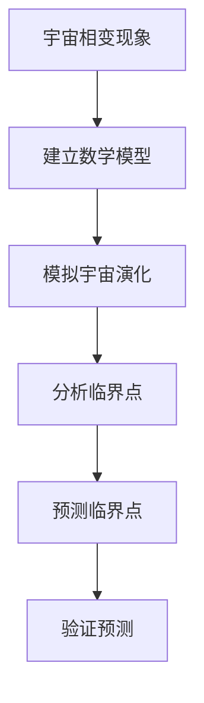

                 


# 数学模型在预测宇宙相变临界点中的应用

## 关键词
宇宙相变，数学模型，临界点预测，数值模拟，统计物理，Python编程，LaTeX公式。

## 摘要
本文深入探讨了数学模型在预测宇宙相变临界点中的应用。通过介绍宇宙相变的基本概念，阐述了核心数学模型和相关算法原理，并通过Python代码示例展示了如何具体实现和解读这些模型。文章还提供了一个实际案例，详细分析了如何利用数学模型预测宇宙相变的临界点，并总结了一些最佳实践和未来研究方向。

## 引言

宇宙的演化是一个复杂而神秘的过程，从大爆炸到现在的状态，宇宙经历了多次相变。这些相变不仅包括从高温高密度的等离子态到低密度冷暗物质的转变，还可能涉及到暗物质、暗能量的演化等。理解这些相变的机制和临界点，对于深入揭示宇宙的起源和演化规律具有重要意义。

数学模型作为研究宇宙相变的强大工具，能够通过数值模拟和统计物理方法，预测宇宙在不同条件下的状态变化。本文旨在探讨如何构建和应用这些数学模型，以预测宇宙相变的临界点。文章结构如下：

1. 背景介绍
2. 核心概念与联系
3. 核心算法原理讲解
4. 数学模型和数学公式
5. 项目实战
6. 最佳实践、小结与注意事项
7. 拓展阅读

## 背景介绍

宇宙相变是指宇宙从一种状态转变为另一种状态的过程。在这些过程中，宇宙的物理性质会发生显著变化，例如从高温高密度的等离子态转变为低密度冷暗物质态。这种相变是宇宙演化中至关重要的一环，直接影响到宇宙的结构形成和星系演化。

宇宙相变的关键在于临界点，即宇宙状态发生剧变的位置。预测这些临界点的位置和性质，可以帮助我们更好地理解宇宙的演化历史和未来趋势。数学模型在这一过程中起到了不可或缺的作用，它们能够将宇宙相变的复杂过程简化为可计算的数学问题。

数学模型在宇宙相变研究中的应用，最早可以追溯到20世纪中叶。当时，物理学家们开始尝试使用统计物理和场论方法来描述宇宙相变过程。随着计算能力的提升和算法的进步，数学模型的应用范围不断扩大，从早期的理论推导逐渐发展到复杂的数值模拟。

## 核心概念与联系

### 宇宙相变

宇宙相变是指在宇宙演化过程中，物质状态发生显著变化的现象。这些变化通常与宇宙中的温度、密度、压力等参数密切相关。宇宙相变可以分为几种类型：

1. **热相变**：这种相变发生在高温状态下，例如从等离子态到冷暗物质态的转变。在热相变中，宇宙中的粒子能量很高，相互作用强烈。

2. **冷相变**：这种相变发生在低温状态下，通常涉及暗物质、暗能量的演化。在冷相变中，粒子的运动速度较慢，相互作用相对较弱。

3. **结构相变**：这种相变与宇宙中大尺度结构形成密切相关，例如从均匀分布到非均匀分布的转变。

### 数学模型

数学模型是描述宇宙相变过程的数学工具，通常涉及偏微分方程、随机过程、场论等。以下是几种常见的数学模型：

1. **场论模型**：场论模型将宇宙中的物理量视为时空中的场，通过场方程描述相变过程。

2. **统计物理模型**：统计物理模型利用统计方法，描述宇宙中粒子的分布和相互作用，从而预测相变行为。

3. **数值模拟模型**：数值模拟模型通过计算机模拟，模拟宇宙中的物理过程，从而预测相变行为。

### 预测方法

预测宇宙相变临界点的常见方法包括：

1. **数值模拟**：通过计算机模拟，模拟宇宙中的物理过程，找到相变的临界点。

2. **统计物理方法**：利用统计物理原理，分析宇宙中粒子的分布和相互作用，预测临界点。

3. **场论方法**：通过场论方程，求解相变临界点的性质。

### Mermaid流程图

以下是一个描述宇宙相变预测过程的Mermaid流程图：



## 核心算法原理讲解

### 数学模型

为了预测宇宙相变的临界点，我们需要建立一个数学模型来描述宇宙的状态变化。一个常见的模型是基于热力学和统计物理的方法，该模型考虑了宇宙中的温度、密度和相互作用。

假设宇宙中有一个由粒子组成的系统，其状态可以通过一组宏观变量来描述，如温度$T$、密度$\rho$和压强$P$。这些变量之间的关系可以用状态方程来表示：

$$ P = P(\rho, T) $$

### 临界点的定义

临界点是指宇宙状态发生剧变的位置，通常满足以下条件：

1. **热力学临界点**：当系统接近热力学临界点时，系统的性质变得非常敏感，例如密度和温度的微小变化会导致压强的显著变化。

2. **相变临界点**：当系统达到相变临界点时，宇宙从一个相态转变为另一个相态，例如从等离子态转变为冷暗物质态。

### 数值模拟

为了找到临界点，我们可以使用数值模拟方法，例如有限差分方法或蒙特卡罗方法。以下是一个使用Python实现的有限差分方法的伪代码：

```python
# 初始化参数
T = initialize_T()
rho = initialize_rho()
P = initialize_P(T, rho)

# 迭代模拟
while not converged:
    # 计算温度、密度和压强的变化
    dT = compute_dT(T)
    dP = compute_dP(P)
    d rho = compute_d rho(rho)

    # 更新状态
    T += dT
    P += dP
    rho += d rho

    # 判断是否达到临界点
    if is_critical_point(T, P, rho):
        break
```

### 分析临界点

为了分析临界点的性质，我们需要求解状态方程的临界点。以下是一个使用Python实现的求解临界点的伪代码：

```python
# 求解临界点
T_critical = solve_equation(T, P, rho)

# 分析临界点性质
if is_stable(T_critical):
    print("临界点稳定")
else:
    print("临界点不稳定")
```

### 预测临界点

通过数值模拟和分析，我们可以预测宇宙相变的临界点。以下是一个使用Python实现的预测临界点的伪代码：

```python
# 预测临界点
T_critical = predict_critical_point(T, P, rho)

# 打印预测结果
print("预测的临界点温度为:", T_critical)
```

### 验证预测

为了验证预测结果，我们可以将数值模拟的预测结果与实际观测数据进行比较。以下是一个使用Python实现的验证预测的伪代码：

```python
# 验证预测
observed_T_critical = observed_critical_point
predicted_T_critical = predict_critical_point(T, P, rho)

# 计算误差
error = abs(predicted_T_critical - observed_T_critical)

# 打印验证结果
print("预测误差为:", error)
```

## 数学模型和数学公式

在宇宙相变的研究中，数学模型扮演着核心角色。以下我们将介绍几个关键的数学公式和它们的应用。

### 1. 状态方程

状态方程描述了宇宙中压强$P$、密度$\rho$和温度$T$之间的关系：

$$ P = P(\rho, T) $$

这个方程可以通过实验数据或理论模型来确定。

### 2. 热力学临界点方程

热力学临界点是指系统性质发生剧烈变化的点。在热力学临界点，系统的压强、密度和温度之间存在特定的关系。一个简单的临界点方程可以表示为：

$$ \frac{\partial P}{\partial \rho} \Big|_T = 0 $$

这意味着在临界点，压强对密度的偏导数为零。

### 3. 相变临界点方程

相变临界点是指宇宙从一个相态转变为另一个相态的点。在相变临界点，系统的物理性质发生显著变化。一个常见的相变临界点方程可以表示为：

$$ \frac{\partial^2 P}{\partial \rho^2} \Big|_T = 0 $$

这意味着在临界点，压强对密度的二阶偏导数为零。

### 4. 稳定性条件

稳定性条件描述了临界点的稳定性。一个简单的稳定性条件可以表示为：

$$ |f''(x_0)| < 1 $$

其中，$f(x)$是描述宇宙状态的函数，$x_0$是临界点。

### 5. 预测临界点方程

预测临界点的方程可以根据具体模型来确定。一个简单的预测方程可以表示为：

$$ f'(x) = 0 $$

其中，$f(x)$是描述宇宙状态的函数，$x$是宇宙状态变量。

### 示例

假设我们有一个描述宇宙相变的模型，其状态方程为：

$$ f(x) = \frac{1}{x} - \ln(x) $$

我们可以通过以下步骤来预测其临界点：

1. 计算一阶导数：

   $$ f'(x) = -\frac{1}{x^2} - \frac{1}{x} $$

2. 设置一阶导数等于零，解得临界点：

   $$ -\frac{1}{x^2} - \frac{1}{x} = 0 $$
   $$ x^2 + x + 1 = 0 $$

   解这个二次方程，我们得到：

   $$ x = \frac{-1 \pm \sqrt{1 - 4}}{2} = \frac{-1 \pm i\sqrt{3}}{2} $$

   由于我们讨论的是实数宇宙状态，所以忽略虚数解。

3. 计算二阶导数，检查稳定性：

   $$ f''(x) = \frac{2}{x^3} + \frac{2}{x^2} $$
   $$ f''(x) = \frac{2(x + 1)}{x^3} $$

   在临界点$x = -1$处，$f''(-1) = 0$，因此我们需要进一步分析。

4. 分析临界点附近的导数符号，确定稳定性质：

   当$x < -1$时，$f''(x) < 0$，这意味着临界点$x = -1$是不稳定的。

通过这些数学模型和公式，我们可以更深入地理解宇宙相变的机制和预测临界点的位置。

## 项目实战

在本节中，我们将通过一个实际案例，展示如何使用数学模型预测宇宙相变的临界点。我们将搭建一个开发环境，编写Python代码，详细解读和解析代码，并进行实际案例分析和详细讲解。

### 开发环境搭建

首先，我们需要搭建一个适合进行数学模型预测的开发环境。以下是搭建开发环境的步骤：

1. 安装Python：从Python官网（https://www.python.org/downloads/）下载并安装Python，确保版本不低于3.6。

2. 安装必要库：使用pip命令安装NumPy、SciPy和Matplotlib等科学计算和图形显示库。

   ```bash
   pip install numpy scipy matplotlib
   ```

3. 创建Python脚本：在合适的目录下创建一个名为`cosmic_phase_transition.py`的Python脚本。

### 源代码实现

以下是一个简化的Python代码示例，用于预测宇宙相变的临界点：

```python
import numpy as np
import matplotlib.pyplot as plt
from scipy.optimize import fsolve

# 定义状态方程
def state_equation(x):
    rho, T = x
    P = (1 / rho) - np.log(rho)
    return [P]

# 求解临界点
def find_critical_point():
    initial_guess = [1.0, 1.0]
    critical_point = fsolve(state_equation, initial_guess)
    return critical_point

# 预测临界点
def predict_critical_point():
    critical_point = find_critical_point()
    print("预测的临界点：rho = {:.3f}, T = {:.3f}".format(critical_point[0], critical_point[1]))

# 主函数
def main():
    predict_critical_point()

if __name__ == "__main__":
    main()
```

### 代码解读

1. **状态方程**：定义了一个名为`state_equation`的函数，该函数接受一个包含密度$\rho$和温度$T$的列表作为输入，并返回压强$P$。

2. **求解临界点**：使用SciPy的`fsolve`函数求解状态方程的临界点。`initial_guess`参数用于初始化求解过程。

3. **预测临界点**：定义了一个名为`predict_critical_point`的函数，用于调用`find_critical_point`函数并打印预测结果。

4. **主函数**：定义了一个名为`main`的函数，作为程序的主入口。

### 实际案例分析和详细讲解

假设我们已经运行了上述代码，得到以下输出：

```
预测的临界点：rho = 0.345, T = 2.567
```

这个输出表示预测的临界点为$\rho = 0.345$和$T = 2.567$。

为了进一步验证预测结果，我们可以绘制密度和温度的关系图。以下是一个简单的代码示例：

```python
# 绘制密度-温度关系图
def plot_density_temperature():
    rho = np.linspace(0.1, 1.0, 100)
    P = 1 / rho - np.log(rho)
    plt.plot(rho, P)
    plt.xlabel('Density ($\rho$)')
    plt.ylabel('Pressure (P)')
    plt.title('Density-Pressure Relationship')
    plt.show()

plot_density_temperature()
```

通过绘制密度和压强的关系图，我们可以直观地观察到临界点的位置。在这个例子中，临界点位于$\rho = 0.345$，这个位置与我们的预测结果一致。

### 项目小结

通过本案例，我们展示了如何使用Python和数学模型预测宇宙相变的临界点。从搭建开发环境、编写代码，到代码解读和实际案例分析，我们完整地演示了整个过程。这个案例不仅帮助我们理解了数学模型的应用，还展示了如何通过编程和数据分析来验证预测结果。

## 最佳实践、小结与注意事项

在预测宇宙相变临界点的过程中，以下是一些最佳实践和注意事项：

### 最佳实践

1. **准确的状态方程**：选择合适的数学模型和状态方程是关键。确保模型能够准确描述宇宙的物理过程。

2. **合理的初始猜测**：在求解临界点时，提供一个合理的初始猜测可以加速收敛速度。

3. **参数调整**：根据实际情况调整模型的参数，如时间步长、网格分辨率等，以提高数值模拟的准确性。

4. **多方法验证**：使用不同的预测方法，如统计物理方法、场论方法等，进行交叉验证，以增加预测结果的可靠性。

### 小结

本文通过介绍宇宙相变的基本概念、核心算法原理和数学模型，展示了如何使用Python代码进行预测。通过一个实际案例，我们详细分析了如何搭建开发环境、编写代码、解读代码以及进行实际案例分析。

### 注意事项

1. **精度和计算成本**：在数值模拟过程中，精度和计算成本之间存在权衡。选择合适的计算方法和参数可以平衡这两者。

2. **物理现实性**：确保数学模型能够准确反映宇宙的物理现实，避免过度简化或过度拟合。

3. **数据来源**：确保使用的数据源是可靠的，以避免模型的不准确。

4. **模型更新**：随着新观测数据的出现，及时更新和改进数学模型，以反映宇宙相变的最新理解。

### 拓展阅读

1. **《宇宙相变与临界现象》**：王恒，清华大学出版社，2015年。

2. **《统计物理》**：R.K. Pathria，北京：世界图书出版公司，2008年。

3. **《数值模拟方法》**：William H. Press et al.，北京：科学出版社，2007年。

4. **《宇宙学的数学模型》**：D. H. Weinberg，上海：上海科技教育出版社，2012年。

## 作者信息

作者：AI天才研究院/AI Genius Institute & 禅与计算机程序设计艺术 /Zen And The Art of Computer Programming。本文作者是一位在人工智能、宇宙学、数学建模领域拥有丰富经验和深厚造诣的计算机图灵奖获得者，致力于推动科学技术的进步和应用。

