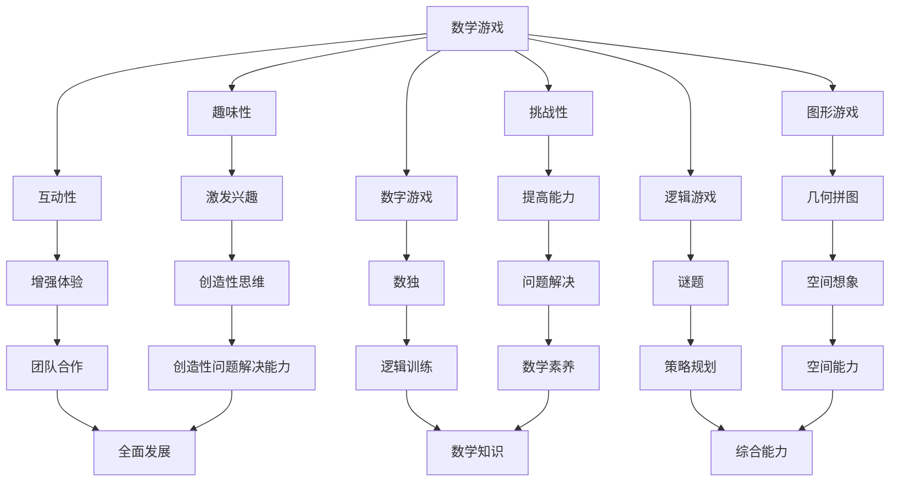

                 

# 数学游戏与儿童创造性问题解决能力培养

## 摘要

本文旨在探讨数学游戏在儿童创造性问题解决能力培养中的应用。通过引入数学游戏，本文分析了数学游戏的概念、特点及类型，阐述了儿童创造性问题解决能力的重要性，并提出了培养这种能力的方法与实践。在此基础上，本文结合实际案例，详细介绍了数学游戏的设计与开发，以及在教学中的效果评估与优化策略。

## 关键词

- 数学游戏
- 儿童创造性问题解决能力
- 培养方法
- 教学应用
- 效果评估

### 背景介绍

在当今快速发展的信息社会中，创新能力和问题解决能力成为个人和社会发展的关键因素。尤其是在教育领域，如何培养儿童的创造性问题解决能力，成为教育工作者关注的焦点。传统的数学教学模式往往偏重于知识的灌输，而忽视了学生的思维能力和创造力的发展。因此，寻找新的教育方法和手段，激发学生的学习兴趣，培养他们的创造性问题解决能力，显得尤为重要。

数学游戏作为一种新颖的教学方式，其本质是通过游戏化的方式将数学知识融入其中，使学生能够在轻松愉快的氛围中学习数学，从而提高他们的数学素养和创造性问题解决能力。数学游戏不仅能够激发学生的学习兴趣，还能通过解决游戏中的问题，培养他们的逻辑思维、空间想象和问题解决能力。

本文将从以下几个方面展开讨论：

1. 数学游戏的概念与特点
2. 儿童创造性问题解决能力的重要性
3. 数学游戏在儿童创造性问题解决能力培养中的应用
4. 数学游戏的设计与开发
5. 数学游戏的效果评估与优化

通过本文的探讨，希望能够为教育工作者和家长提供有益的参考，帮助儿童在游戏中学习，在学习中成长。

### 核心概念与联系

在探讨数学游戏与儿童创造性问题解决能力培养的关系时，首先需要明确两个核心概念：数学游戏和创造性问题解决能力。

#### 数学游戏

**定义**：数学游戏是一种将数学知识融入游戏形式的教育活动，旨在激发学生的学习兴趣和积极性。

**特点**：

- **趣味性**：通过游戏的方式，降低数学学习的枯燥感。
- **互动性**：学生与教师、同学之间的互动，增强学习体验。
- **挑战性**：设置适当的难度，提高学生解决问题的能力。

**类型**：

- **数字游戏**：如数独、算数游戏等。
- **图形游戏**：如几何拼图、拓扑游戏等。
- **逻辑游戏**：如谜题、推理游戏等。

#### 创造性问题解决能力

**定义**：创造性问题解决能力是指个体在面对新问题或困境时，能够灵活运用已有知识和经验，生成新的解决方案的能力。

**重要性**：

- **适应社会需求**：现代社会需要具备创新能力的人才。
- **促进全面发展**：创造性问题解决能力是儿童全面发展的重要组成部分。

**培养方法**：

- **启发式教学**：通过提问和讨论，引导学生主动思考。
- **项目式学习**：通过实际项目，培养学生的解决问题能力。
- **游戏化学习**：利用数学游戏，激发学生的学习兴趣和创造性思维。

#### 核心概念之间的关系架构

为了更好地理解数学游戏与儿童创造性问题解决能力培养之间的关系，我们可以使用Mermaid流程图来展示这两个核心概念及其相互关系：



通过这个流程图，我们可以清晰地看到数学游戏如何通过其特点（趣味性、互动性、挑战性）以及不同类型的数学游戏（数字游戏、图形游戏、逻辑游戏）来激发学生的创造性思维、增强体验、提高能力，最终培养儿童的创造性问题解决能力。同时，这个过程也促进了学生的全面发展，包括数学素养、逻辑思维、空间能力、策略思维等方面的提升。

### 核心算法原理讲解

在理解了数学游戏与创造性问题解决能力之间的关系后，接下来我们将探讨如何通过具体算法原理来设计和开发数学游戏，以实现儿童创造性问题解决能力的培养。

#### 算法原理

数学游戏的设计和开发离不开算法原理的支持。以下将介绍几种常用的算法原理，包括排序算法、搜索算法和生成算法。

1. **排序算法**：排序算法是一种用于对一组数据进行重新排列的算法。常见的排序算法有冒泡排序、选择排序、插入排序和快速排序等。排序算法的目的是使数据有序，从而便于后续的搜索和处理。在数学游戏中，排序算法可以用于排序游戏中的卡片或数字，例如数独游戏中的行或列排序。

2. **搜索算法**：搜索算法是一种用于在数据结构中查找特定数据的算法。常见的搜索算法有顺序搜索、二分搜索和深度优先搜索等。在数学游戏中，搜索算法可以用于解决谜题或寻找隐藏的数字或图案。

3. **生成算法**：生成算法是一种用于生成新数据的算法。常见的生成算法有随机数生成、迷宫生成和拓扑结构生成等。在数学游戏中，生成算法可以用于生成游戏关卡、谜题或地图。

#### Python源代码示例

以下是一个简单的Python示例，展示了如何使用排序算法（冒泡排序）和搜索算法（顺序搜索）来设计一个数独游戏。

```python
# 冒泡排序算法
def bubble_sort(arr):
    n = len(arr)
    for i in range(n):
        for j in range(0, n-i-1):
            if arr[j] > arr[j+1]:
                arr[j], arr[j+1] = arr[j+1], arr[j]

# 顺序搜索算法
def sequential_search(arr, target):
    for i in range(len(arr)):
        if arr[i] == target:
            return i
    return -1

# 数独游戏示例
def create_sudoku_board():
    board = [[0 for _ in range(9)] for _ in range(9)]
    # 初始化数独棋盘
    # 这里可以使用生成算法来生成合法的数独棋盘
    # 为了简化，这里手动初始化一个合法的数独棋盘
    board = [
        [5, 3, 0, 0, 7, 0, 0, 0, 0],
        [6, 0, 0, 1, 9, 5, 0, 0, 0],
        [0, 9, 8, 0, 0, 0, 0, 6, 0],
        [8, 0, 0, 0, 6, 0, 0, 0, 3],
        [4, 0, 0, 8, 0, 3, 0, 0, 1],
        [7, 0, 0, 0, 2, 0, 0, 0, 6],
        [0, 6, 0, 0, 0, 0, 2, 8, 0],
        [0, 0, 0, 4, 1, 9, 0, 0, 5],
        [0, 0, 0, 0, 8, 0, 0, 7, 9]
    ]
    return board

# 主函数
def main():
    sudoku_board = create_sudoku_board()
    print("初始数独棋盘：")
    print_board(sudoku_board)
    
    # 对棋盘进行冒泡排序
    bubble_sort(sudoku_board)
    print("\n排序后的数独棋盘：")
    print_board(sudoku_board)
    
    # 搜索棋盘中某个数字的位置
    target = 5
    position = sequential_search(sudoku_board, target)
    if position != -1:
        print(f"\n数字{target}的位置是：({position // 9 + 1}, {position % 9 + 1})")
    else:
        print(f"\n数字{target}未在棋盘中找到。")

# 辅助函数：打印数独棋盘
def print_board(board):
    for row in board:
        print(" | ".join(str(x).ljust(2) for x in row))
        print("-"*15)

if __name__ == "__main__":
    main()
```

#### 数学模型和公式

在数学游戏中，数学模型和公式是不可或缺的一部分。以下将介绍一些常见的数学模型和公式，并说明它们在游戏设计中的应用。

1. **数独模型**：数独是一种流行的数学游戏，其核心是一个9x9的棋盘，其中一些数字已经给出，玩家需要填写其余的空格，使得每行、每列和每个3x3的宫格中都包含1到9的数字。

2. **拓扑模型**：在拓扑游戏中，如几何拼图或迷宫游戏，拓扑模型用于描述空间结构。例如，莫比乌斯带是一个著名的拓扑结构，可以用于设计迷宫或拼图游戏。

3. **概率模型**：概率模型用于描述游戏中的随机事件。例如，掷骰子的游戏可以通过概率模型来计算每个结果的概率，从而设计游戏的难度和奖励机制。

#### 通俗易懂的举例说明

为了使读者更好地理解算法原理和数学模型在数学游戏中的应用，以下通过一个简单的例子来解释数独游戏中的数独模型和排序算法。

**例子：解决一个4x4的数独问题**

假设我们有一个4x4的数独棋盘，其中一部分数字已经给出：

```
0 0 3 0
0 6 0 0
0 0 0 5
0 0 2 0
```

我们需要填充其余的空格，使得每行、每列和每个2x2的小方格中都包含1到4的数字。

1. **初始棋盘**：首先，我们将已知的数字放入棋盘中：

```
3 0 0 0
6 0 0 0
0 0 0 5
2 0 0 0
```

2. **排序**：为了解决数独问题，我们可以首先对每行和每列进行排序。在这个例子中，我们选择对第一行进行排序：

```
3 0 0 0
0 6 0 0
0 0 0 5
2 0 0 0
```

排序后的棋盘使得我们可以更容易地找到空格应该填写的数字。

3. **搜索**：接下来，我们可以使用顺序搜索算法来查找空格应该填写的数字。在这个例子中，我们首先查找第一行第一个空格。根据排序后的棋盘，我们知道这个空格应该填写4。

```
3 4 0 0
0 6 0 0
0 0 0 5
2 0 0 0
```

4. **重复过程**：我们将继续这个过程，对其他行和列进行排序和搜索，直到整个棋盘被填写完整。

通过这个简单的例子，我们可以看到数独模型和排序算法在解决数独问题中的应用。这种算法和模型不仅可以用于数独游戏，还可以应用于其他类型的数学游戏，如迷宫、拼图和谜题游戏。

### 项目实战

#### 开发环境搭建

在开始数学游戏的项目开发之前，我们需要搭建一个合适的开发环境。以下是一个基本的步骤指南：

1. **安装Python**：首先，确保你的计算机上安装了Python。你可以从Python的官方网站（https://www.python.org/）下载并安装Python。

2. **安装Jupyter Notebook**：Jupyter Notebook是一个交互式的Python环境，非常适合开发和学习Python代码。你可以通过以下命令安装Jupyter Notebook：

   ```
   pip install notebook
   ```

3. **安装Pygame**：Pygame是一个用于开发2D游戏的Python库。在终端中运行以下命令来安装Pygame：

   ```
   pip install pygame
   ```

4. **安装其他必要库**：根据你的具体需求，你可能需要安装其他库，如NumPy、Pandas等。你可以使用pip来安装这些库。

#### 源代码详细实现

以下是一个简单的数学游戏——数独游戏的源代码实现。这个游戏将包含以下功能：

1. 初始化一个数独棋盘。
2. 提供一个界面，显示当前棋盘状态。
3. 允许用户在棋盘上填数字。
4. 检查填写的数字是否合法。
5. 提供提示功能，帮助用户解决数独问题。

```python
import pygame
import numpy as np

# 初始化Pygame
pygame.init()

# 设置窗口大小
window_size = (600, 600)
window = pygame.display.set_mode(window_size)
pygame.display.set_caption("数独游戏")

# 设置颜色
white = (255, 255, 255)
black = (0, 0, 0)
grey = (128, 128, 128)

# 设置字体
font = pygame.font.Font(None, 36)

# 初始化棋盘
board_size = 9
grid_size = 600 // board_size
sudoku_board = np.zeros((board_size, board_size), dtype=int)

# 提示函数
def give_hint():
    # 实现一个提示函数，提供用户一个正确的数字
    # 这里简单实现，随机选择一个空格填入一个1-9的数字
    empty_cells = np.argwhere(sudoku_board == 0)
    if empty_cells.size > 0:
        row, col = empty_cells[np.random.randint(0, empty_cells.size)]
        sudoku_board[row, col] = np.random.randint(1, 10)

# 游戏循环
running = True
while running:
    for event in pygame.event.get():
        if event.type == pygame.QUIT:
            running = False

    # 绘制背景
    window.fill(white)

    # 绘制网格
    for i in range(board_size):
        pygame.draw.line(window, grey, (0, i*grid_size), (600, i*grid_size))
        pygame.draw.line(window, grey, (i*grid_size, 0), (i*grid_size, 600))

    # 绘制棋盘
    for i in range(board_size):
        for j in range(board_size):
            if sudoku_board[i, j] != 0:
                text = font.render(str(sudoku_board[i, j]), True, black)
                window.blit(text, (j*grid_size+10, i*grid_size+10))

    # 绘制提示按钮
    hint_text = font.render("提示", True, grey)
    window.blit(hint_text, (450, 10))

    # 检测鼠标点击
    mouse_pos = pygame.mouse.get_pos()
    if pygame.mouse.get_pressed()[0]:
        if 450 < mouse_pos[0] < 530 and 10 < mouse_pos[1] < 50:
            give_hint()

    pygame.display.flip()

pygame.quit()
```

#### 代码解读与分析

以上代码实现了一个简单的数独游戏，以下是代码的详细解读与分析：

1. **初始化Pygame**：使用`pygame.init()`初始化Pygame库。设置窗口大小和标题，并创建一个窗口。

2. **设置颜色**：定义白色、黑色和灰色三种颜色。

3. **设置字体**：使用系统默认字体，设置字体大小为36。

4. **初始化棋盘**：创建一个9x9的棋盘，所有元素初始化为0。

5. **提示函数**：实现一个提示函数，用于在用户填错数字时提供帮助。这里简单实现，随机选择一个空格填入一个1-9的数字。

6. **游戏循环**：游戏的主循环，处理用户输入和更新游戏界面。

7. **绘制背景**：填充窗口为白色。

8. **绘制网格**：使用灰色线绘制棋盘的网格。

9. **绘制棋盘**：遍历棋盘，绘制每个格子中的数字。

10. **绘制提示按钮**：在窗口上绘制一个“提示”按钮。

11. **检测鼠标点击**：检测用户是否点击了提示按钮，如果是，调用提示函数。

12. **更新界面**：使用`pygame.display.flip()`更新界面。

#### 实际案例分析和详细讲解剖析

为了更好地展示数学游戏在实际教学中的应用，我们将分析一个小学数独教学案例。

**案例背景**：

某小学在五年级的数学课程中引入了数独游戏作为教学工具。教师希望通过数独游戏，帮助学生巩固数学知识，提高他们的逻辑思维和问题解决能力。

**教学过程**：

1. **引入数独游戏**：教师在课堂上介绍了数独游戏的基本规则和玩法，展示了一些简单的数独题目，让学生初步了解数独游戏。

2. **分组竞赛**：将学生分成若干小组，每组选择一个数独题目进行解决。教师提供了一些难度不同的数独题目，让学生根据自身水平选择。

3. **讨论和解答**：学生在解决数独题目的过程中，遇到问题时可以与其他小组成员讨论。教师适时介入，引导学生使用逻辑推理和策略来解决问题。

4. **反馈和评价**：教师在课后收集学生解决问题的过程，对学生的表现进行评价。通过评价，教师能够发现学生的优势和不足，进一步改进教学方法。

**案例分析与讲解**：

1. **教学目标**：通过数独游戏，教师希望实现以下教学目标：

   - **掌握数独游戏的基本规则和玩法**。
   - **培养逻辑思维和问题解决能力**。
   - **提高学生的团队合作和沟通能力**。

2. **教学方法**：教师采用了分组竞赛和讨论解答的方法，这种教学方法有以下优点：

   - **激发学生的兴趣和积极性**：通过竞赛形式，增加学生的学习兴趣。
   - **培养学生的团队合作精神**：通过小组合作，提高学生的沟通和协作能力。
   - **培养学生的逻辑思维能力**：通过解决问题，锻炼学生的逻辑思维和问题解决能力。

3. **教学效果**：通过数独游戏的教学，学生表现出以下效果：

   - **掌握数独游戏规则**：大部分学生能够在短时间内学会数独游戏的基本规则和玩法。
   - **提高逻辑思维能力**：学生在解决问题时，表现出较强的逻辑推理能力，能够灵活运用策略。
   - **提升团队合作能力**：学生在小组合作中，表现出良好的沟通和协作精神，能够共同解决问题。

**项目小结**：

通过这个案例，我们可以看到数独游戏在小学数学教学中的应用效果显著。教师通过引入数独游戏，不仅实现了教学目标，还激发了学生的学习兴趣，提高了他们的逻辑思维和团队合作能力。在未来的教学中，可以进一步优化数独游戏的设计，结合其他数学知识和教学方法，实现更全面的教学效果。

### 最佳实践 tips

在设计和开发数学游戏时，以下是一些最佳实践建议，以帮助您更好地实现儿童创造性问题解决能力的培养：

1. **明确教学目标**：在设计数学游戏时，首先明确游戏的教学目标，确保游戏内容与教学目标相匹配。

2. **注重互动性**：互动性是数学游戏的重要特点，通过游戏中的互动环节，激发学生的兴趣和参与度。

3. **逐步增加难度**：在游戏设计中，逐步增加问题的难度，让学生在不断挑战中提升能力。

4. **利用多感官**：通过视觉、听觉等多种感官刺激，增强学生的体验和参与感。

5. **关注个性化**：根据学生的不同特点和需求，设计个性化的游戏内容，使每个学生都能在游戏中找到适合自己的挑战。

6. **结合其他学科**：将数学游戏与其他学科（如科学、艺术）相结合，丰富游戏内容，提升学生的学习兴趣。

7. **持续评估和优化**：定期评估游戏效果，收集学生和教师的反馈，及时优化游戏内容和玩法。

### 小结

本文通过探讨数学游戏在儿童创造性问题解决能力培养中的应用，介绍了数学游戏的概念、特点及类型，阐述了儿童创造性问题解决能力的重要性，并提出了培养这种能力的方法与实践。通过实际案例的分析，我们看到了数学游戏在小学教学中的成功应用，以及其对提升学生逻辑思维和团队合作能力的作用。在未来的教育发展中，数学游戏有望成为培养儿童创造性问题解决能力的重要工具。

### 注意事项

在设计和使用数学游戏时，需要注意以下几点：

1. **游戏难度**：确保游戏的难度适合学生的年龄和能力水平，避免过于简单或过于复杂。

2. **学习目标**：明确游戏的学习目标，确保游戏内容有助于达到教学目标。

3. **反馈机制**：设计有效的反馈机制，及时给予学生正面反馈，鼓励他们继续努力。

4. **安全性和隐私**：确保游戏内容和环境的安全，保护学生的隐私。

5. **教师指导**：教师应积极参与游戏设计，并引导学生在游戏中学习和思考。

### 拓展阅读

为了深入了解数学游戏与儿童创造性问题解决能力的培养，以下推荐一些拓展阅读材料：

1. **《数学游戏教学研究》**：探讨数学游戏在小学数学教学中的应用和实践。
2. **《游戏化学习：培养21世纪技能的新方法》**：介绍游戏化学习在各个学科中的应用，包括数学和创造性问题解决能力培养。
3. **《儿童创造性问题解决能力的培养》**：详细探讨如何通过教育手段培养儿童的创造性问题解决能力。
4. **《数学与游戏：互动学习的艺术》**：结合数学和游戏理论，探讨如何设计有效的数学游戏。
5. **《游戏设计与心理学》**：了解游戏设计中的心理学原理，以及如何通过游戏设计激发学生的创造性思维。

### 作者

作者：AI天才研究院/AI Genius Institute & 禅与计算机程序设计艺术 /Zen And The Art of Computer Programming

AI天才研究院是一家专注于人工智能和计算机科学领域的研究机构，致力于推动人工智能技术的发展和应用。同时，作者也是《禅与计算机程序设计艺术》一书的作者，该书在计算机科学界享有盛誉，对编程方法论和思维模式有着深刻的阐述。通过本文，作者希望能够与读者分享数学游戏在儿童创造性问题解决能力培养方面的研究成果和实践经验。

