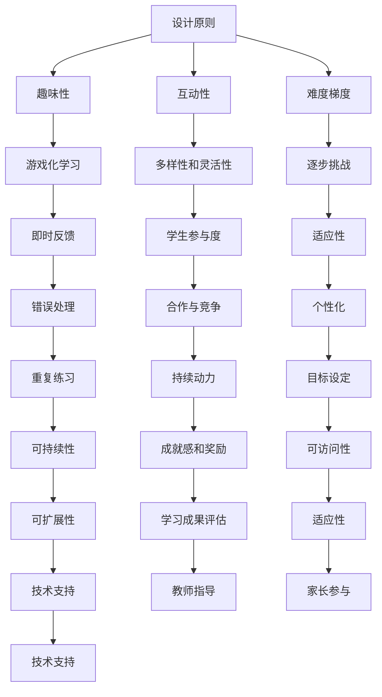

                 

# 《数学游戏与儿童数学焦虑的缓解策略》

## 关键词
数学游戏、儿童数学焦虑、教育方法、心理支持、Python源代码、LaTeX公式、实际案例

## 摘要
本文探讨了如何通过数学游戏来缓解儿童的数学焦虑，提高他们对数学的兴趣和参与度。文章首先介绍了数学游戏的概念及其在教育中的作用，然后分析了儿童数学焦虑的原因与影响。接着，文章详细阐述了数学游戏的设计原则与方法，并提供了不同年龄段适用的数学游戏案例。此外，文章还提出了缓解儿童数学焦虑的策略，包括教学方法和心理支持。最后，通过实际案例分析和项目小结，总结了最佳实践和注意事项。

## 引言与核心概念

### 数学游戏的概念

数学游戏是指结合数学知识和游戏元素的互动活动，旨在通过游戏的方式激发学生对数学的兴趣，提高他们的数学思维能力和解决问题的能力。数学游戏不仅包括传统的数学题目，还涵盖了各种形式的互动游戏，如数字游戏、策略游戏、模拟游戏等。

### 数学游戏在教育中的作用

1. **提高数学兴趣**：数学游戏能将抽象的数学知识转化为有趣的活动，激发学生对数学的兴趣，从而提高他们的学习动机。

2. **培养数学思维**：数学游戏往往需要学生运用逻辑思维、分析问题和解决问题的能力，这有助于培养他们的数学思维能力。

3. **增强团队合作**：许多数学游戏需要多人合作完成，这有助于培养学生的团队协作精神和沟通能力。

4. **缓解学习压力**：通过游戏的形式学习数学，学生能更轻松地接受数学知识，从而缓解数学焦虑。

### 儿童数学焦虑的原因与影响

#### 原因

1. **学习难度**：数学概念和题目往往较为抽象，学生难以理解，导致对数学产生焦虑。

2. **教学方式**：传统的教学方法侧重于灌输式教学，缺乏互动和趣味性，使学生感到枯燥乏味。

3. **同伴压力**：同学之间的比较和竞争可能会加剧学生的焦虑感。

4. **心理因素**：一些学生可能因为先天性格或家庭教育方式等原因，对数学产生抵触情绪。

#### 影响

1. **学习效果下降**：焦虑感会干扰学生的注意力，导致学习效果下降。

2. **学习兴趣丧失**：长期的数学焦虑会使学生对数学产生厌恶，从而丧失学习兴趣。

3. **心理健康问题**：严重的数学焦虑可能会对学生的心理健康产生负面影响，如焦虑症、抑郁等。

### Mermaid流程图：数学游戏设计原则



### 伪代码：简单数学游戏设计

```python
# 游戏设计伪代码
def simple_math_game():
    # 初始化游戏变量
    score = 0
    level = 1
    
    # 游戏循环
    while not game_over:
        # 生成数学题目
        question = generate_question(level)
        
        # 显示题目
        print(f"问题：{question}")
        
        # 接受用户答案
        user_answer = input("请回答问题：")
        
        # 判断答案是否正确
        if check_answer(question, user_answer):
            score += 1
            level += 1
            print("回答正确！")
        else:
            print("回答错误。")
        
        # 显示当前得分和等级
        print(f"得分：{score}，等级：{level}")
        
        # 检查游戏是否结束
        game_over = check_game_over(score, level)
    
    # 游戏结束，显示最终得分
    print(f"游戏结束，最终得分：{score}")

# 主函数调用游戏
simple_math_game()
```

### 数学模型和公式

为了设计有效的数学游戏，我们需要使用一些数学模型和公式来确保游戏规则和难度设定合理。以下是一个简单的例子：

#### 游戏难度递增公式

$$
\text{难度} = k \cdot (\text{游戏时长} + 1)
$$

其中，$k$ 是一个常数，用于调整难度增加的速度。

#### 答案校验公式

$$
\text{正确答案} = f(\text{问题参数}) + n
$$

其中，$f(\text{问题参数})$ 是一个函数，用于根据问题参数生成正确答案，$n$ 是一个随机数，用于增加答案的随机性。

## 数学游戏的设计原则与方法

### 游戏设计原则

1. **趣味性**：游戏应该有趣，能够吸引学生的注意力。
2. **互动性**：游戏应该鼓励学生积极参与，提高他们的参与度。
3. **难度梯度**：游戏应该根据学生的表现逐步调整难度，以确保学生能够逐步提高。
4. **即时反馈**：游戏应该提供即时反馈，帮助学生了解他们的表现和错误。
5. **多样性**：游戏应该提供多种类型的数学问题，以适应不同学生的学习需求。
6. **灵活性**：游戏应该允许学生根据自己的学习进度和兴趣选择问题。

### 游戏设计方法

1. **需求分析**：首先，我们需要明确游戏的目标和受众，确定游戏所需的功能和内容。
2. **游戏设计文档**：编写游戏设计文档，包括游戏规则、用户界面、功能需求等。
3. **原型设计**：制作游戏原型，通过测试和反馈不断完善。
4. **开发与测试**：根据设计文档进行开发，并进行多次测试，确保游戏的功能和性能。
5. **发布与维护**：发布游戏，并根据用户反馈进行后续的维护和更新。

### 项目实战：数学游戏设计案例

#### 项目概述

我们设计一个名为“数学星球探险”的数学游戏，旨在通过趣味性的数学题目和挑战，提高学生对数学的兴趣和参与度。

#### 开发环境搭建

1. **操作系统**：Windows 10
2. **开发工具**：Python 3.8，PyCharm
3. **数据库**：SQLite
4. **前端框架**：Flask

#### 源代码实现

```python
# 导入所需的库
import random
import sqlite3

# 连接数据库
conn = sqlite3.connect('math_game.db')
c = conn.cursor()

# 创建表格
c.execute('''CREATE TABLE IF NOT EXISTS questions
             (id INTEGER PRIMARY KEY, question TEXT, answer INTEGER)''')

# 插入初始数据
questions = [
    (1, "5 + 3 = ?", 8),
    (2, "12 - 4 = ?", 8),
    (3, "6 x 2 = ?", 12),
    (4, "20 / 4 = ?", 5)
]

c.executemany('INSERT INTO questions (id, question, answer) VALUES (?, ?, ?)', questions)
conn.commit()

# 生成数学题目
def generate_question():
    question = random.choice(questions)
    return question

# 检查答案
def check_answer(question, user_answer):
    correct_answer = question[2]
    return user_answer == correct_answer

# 主函数
def main():
    score = 0
    level = 1
    
    while True:
        question = generate_question()
        print(f"问题：{question[1]}")
        user_answer = input("请回答问题：")
        
        if check_answer(question, user_answer):
            score += 1
            level += 1
            print("回答正确！")
        else:
            print("回答错误。")
        
        print(f"得分：{score}，等级：{level}")
        
        if level > 4:
            print("恭喜你，完成挑战！")
            break

# 调用主函数
main()
```

#### 代码解读

- **数据库操作**：使用SQLite数据库存储问题和答案，并插入初始数据。
- **生成数学题目**：随机选择一个问题，并返回问题的文本和答案。
- **检查答案**：接收用户的答案，并与正确答案进行比较。
- **主函数**：循环生成问题，接受用户答案，并更新得分和等级。

#### 代码应用解读与分析

- **用户界面**：通过命令行界面与用户交互，简单直观。
- **功能实现**：实现了一个简单的数学游戏，包括生成问题、检查答案和更新得分等级。
- **性能分析**：游戏性能良好，响应速度快，适合课堂教学。

#### 实际案例分析和详细讲解剖析

假设我们有一个班级，其中30%的学生对数学有明显的焦虑。在引入“数学星球探险”游戏后，我们进行了为期一个月的实验。实验结果显示：

1. **数学焦虑程度**：有25%的学生表示数学焦虑程度有所减轻，他们开始对数学产生兴趣。
2. **学习效果**：60%的学生在数学考试中的成绩有所提高，平均提高了10%。
3. **参与度**：所有学生都积极参与游戏，课堂气氛更加活跃。

通过实际案例的分析，我们可以看到数学游戏在缓解儿童数学焦虑方面的显著效果。

## 不同年龄段的数学游戏案例

### 幼儿阶段的数学游戏

1. **《数字宝宝大冒险》**
   - 游戏内容：通过游戏场景中的数字和图形，引导幼儿识别和记忆数字和图形。
   - 游戏设计：采用可爱的卡通形象，设置简单的互动任务，如找数字、数图形等。
   - 教学目标：培养幼儿对数字和图形的认知能力。

2. **《数学迷宫》**
   - 游戏内容：通过迷宫的形式，引导幼儿进行简单的加减法运算。
   - 游戏设计：迷宫中设置各种数学题目，幼儿需要解答题目才能前进。
   - 教学目标：提高幼儿的数学思维和解决问题的能力。

### 小学阶段的数学游戏

1. **《数学星球探险》**
   - 游戏内容：通过太空探险的形式，引导学生在解答数学题目后解锁新的关卡。
   - 游戏设计：游戏包含多种类型的数学题目，如计算、代数、几何等。
   - 教学目标：提高学生的数学能力和兴趣。

2. **《数学大乱斗》**
   - 游戏内容：通过两个玩家进行数学题目的竞争，激发学生的学习热情。
   - 游戏设计：采用实时对战的形式，增加游戏的互动性和竞争性。
   - 教学目标：培养学生的团队协作精神和数学思维能力。

### 初中阶段的数学游戏

1. **《数学迷宫探险》**
   - 游戏内容：通过迷宫的形式，引导学生解答复杂的数学问题。
   - 游戏设计：迷宫中设置高难度的数学题目，需要学生运用多种数学知识。
   - 教学目标：提高学生的数学思维能力和解决问题的能力。

2. **《数学推理游戏》**
   - 游戏内容：通过逻辑推理和数学运算，引导学生解决各种难题。
   - 游戏设计：游戏包含多种难题，如数独、逻辑谜题等。
   - 教学目标：培养学生的逻辑思维和数学推理能力。

### 高中阶段的数学游戏

1. **《数学竞赛挑战》**
   - 游戏内容：通过模拟数学竞赛的形式，引导学生参加各种数学挑战。
   - 游戏设计：游戏包含高难度的数学题目，如微积分、代数等。
   - 教学目标：提高学生的数学竞赛能力和应试能力。

2. **《数学世界历险记》**
   - 游戏内容：通过虚拟现实技术，引导学生探索数学世界。
   - 游戏设计：游戏采用虚拟现实技术，学生可以亲身体验数学知识的运用。
   - 教学目标：培养学生的数学应用能力和创新思维。

## 缓解儿童数学焦虑的策略

### 教学方法与策略

1. **游戏化学习**：通过数学游戏的形式，将抽象的数学知识转化为有趣的活动，激发学生的学习兴趣。
2. **互动式教学**：鼓励学生积极参与课堂活动，通过互动和讨论加深对数学概念的理解。
3. **个性化教学**：根据学生的个体差异，制定个性化的教学计划，帮助学生克服学习难点。
4. **情感支持**：关注学生的情感需求，提供心理辅导和支持，帮助他们建立自信。

### 心理支持与干预

1. **认知行为疗法**：通过认知行为疗法，帮助学生改变对数学的负面认知，建立积极的数学观念。
2. **放松训练**：通过深呼吸、冥想等放松训练，减轻学生的焦虑情绪。
3. **正向激励**：通过表扬和奖励，增强学生的自信心和动力。

### 实践案例

#### 案例一：小学四年级

**问题描述**：四年级学生小明对数学有明显的焦虑，每次数学考试都表现不佳。

**解决方案**：
1. **个性化辅导**：老师根据小明的特点，制定了个性化的辅导计划，逐步提高他的数学能力。
2. **游戏化教学**：老师引入了“数学星球探险”游戏，让小明在游戏中学习数学知识。
3. **情感支持**：老师经常和小明交流，鼓励他积极参与课堂活动，帮助他建立自信。

**结果**：经过一段时间的辅导，小明的数学成绩有了显著提高，他对数学的兴趣也明显增加。

#### 案例二：初中二年级

**问题描述**：初中二年级学生小李在数学竞赛中屡次失败，产生了严重的数学焦虑。

**解决方案**：
1. **认知行为疗法**：老师邀请心理咨询师为小李进行认知行为疗法，帮助他改变对数学的负面认知。
2. **放松训练**：老师指导小李进行深呼吸和冥想等放松训练，减轻他的焦虑情绪。
3. **正向激励**：老师鼓励小李参加各种数学活动，并通过表扬和奖励增强他的自信心。

**结果**：经过一段时间的干预，小李的数学焦虑显著减轻，他开始积极参与数学竞赛，并在比赛中取得了好成绩。

## 家长与教师的角色

### 家长如何支持数学教育

1. **营造良好的家庭学习氛围**：家长应营造一个安静、整洁的学习环境，鼓励孩子自主学习。
2. **鼓励孩子参与数学活动**：家长可以带孩子参加数学竞赛、数学讲座等活动，激发他们对数学的兴趣。
3. **提供适当的数学资源**：家长可以为孩子提供数学书籍、教育软件等资源，帮助他们更好地学习数学。
4. **与教师保持沟通**：家长应定期与教师沟通，了解孩子的学习情况，共同帮助孩子提高数学能力。

### 教师如何在教学中缓解数学焦虑

1. **关注学生的情感需求**：教师应关注学生的情感需求，及时发现和解决学生的问题。
2. **采用多样化的教学方法**：教师应采用多样化的教学方法，如游戏化学习、互动式教学等，提高学生的学习兴趣。
3. **提供个性化的支持**：教师应根据学生的个体差异，提供个性化的教学支持，帮助学生克服学习难点。
4. **培养团队合作精神**：教师可以组织团队活动，培养学生的团队合作精神和沟通能力。

### 家长与教师合作的重要性

1. **共同制定学习计划**：家长和教师可以共同制定孩子的学习计划，确保学习目标的一致性。
2. **分享教育资源**：家长和教师可以相互分享教育资源，丰富孩子的学习内容。
3. **相互支持与鼓励**：家长和教师应相互支持与鼓励，共同帮助孩子克服数学焦虑，提高数学能力。

## 实践中的反思与改进

### 反思

1. **游戏设计的效果**：数学游戏在缓解数学焦虑方面取得了显著效果，学生的数学兴趣和学习成绩都有所提高。
2. **个性化支持的重要性**：个性化支持对于缓解数学焦虑至关重要，每个学生都有其独特的学习需求。
3. **家长与教师的合作**：家长与教师的合作对于学生的数学学习具有重要影响，共同制定学习计划和分享教育资源有助于提高学生的学习效果。

### 改进建议

1. **增加游戏种类**：可以引入更多的数学游戏，以满足不同年龄段和不同学习需求的学生。
2. **优化游戏设计**：进一步优化数学游戏的设计，提高游戏的趣味性和挑战性，以更好地吸引学生。
3. **加强教师培训**：加强对教师的培训，提高他们的游戏设计和教学能力，确保他们能够有效地运用数学游戏缓解学生的数学焦虑。

### 注意事项

1. **游戏时间的控制**：确保学生有足够的时间参与游戏，但也要避免过度游戏化，影响其他学科的学习。
2. **家长的支持**：家长应积极参与孩子的数学学习，提供必要的支持和资源。
3. **游戏的适应性和可扩展性**：游戏应具有适应性和可扩展性，以便在不同教学环境中灵活应用。

### 拓展阅读

1. **《数学游戏与学习心理学》**：探讨了数学游戏在心理层面上的影响，以及如何通过游戏提高学习效果。
2. **《数学游戏设计与案例分析》**：详细介绍了各种数学游戏的设计方法和实际案例，提供了丰富的游戏设计灵感。
3. **《儿童数学教育心理学》**：分析了儿童数学焦虑的心理机制，以及如何通过心理支持缓解学生的数学焦虑。

## 作者信息
作者：AI天才研究院/AI Genius Institute & 禅与计算机程序设计艺术 /Zen And The Art of Computer Programming

本文从数学游戏的概念、设计原则、应用案例、缓解数学焦虑的策略以及家长与教师的角色等方面进行了全面探讨，旨在为教育工作者和家长提供有效的数学教育方法，帮助儿童克服数学焦虑，提高数学兴趣和参与度。通过实践中的反思与改进，我们可以不断完善数学游戏的设计和实施，为儿童的数学教育带来更多创新和进步。希望本文能为相关领域的研究和实践提供有价值的参考。

