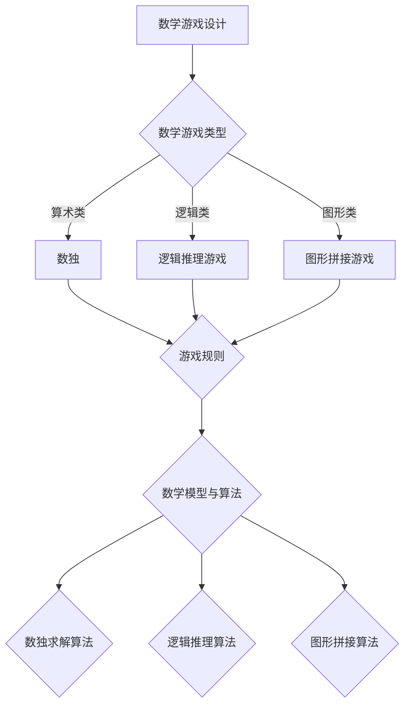

                 

### 1.1 研究背景与意义

在现代教育体系中，数学作为一门基础学科，对儿童智力发展和思维能力的培养具有至关重要的作用。传统的数学教学方法往往侧重于对数学知识的传授，而忽视了学生在学习过程中的趣味性和主动性。这种模式容易导致学生对数学产生厌倦情绪，影响数学学习的效果。因此，探索新的数学教育方法，尤其是将数学与游戏相结合，成为当前教育领域的研究热点。

数学游戏是一种以数学知识和数学思维为核心的游戏形式，它不仅能够提高儿童的数学素养，还能激发他们的学习兴趣，培养他们的解决问题的能力和逻辑思维能力。数学游戏的设计和应用，是数学教育改革的重要方向，对儿童数学能力的培养具有重要的现实意义。

本研究旨在探讨数学游戏在儿童数学能力培养中的应用，分析数学游戏的设计原理、分类和实际应用策略，并通过具体案例，展示数学游戏在实际教学中的效果。本研究不仅有助于教育工作者更好地理解数学游戏的教育价值，也为家长和教师提供实用的教育工具和方法。

首先，从全球教育发展的趋势来看，各国都在积极探索如何提高学生的数学素养。美国、英国、日本等国家已经将数学游戏纳入学校教育体系，通过游戏形式培养学生的数学思维和创新能力。在中国，随着新课程改革的推进，数学游戏也逐渐受到重视，成为课堂教学的有效补充。

其次，从心理学和教育学的角度来看，游戏是儿童的天性，通过游戏进行学习，能够激发儿童的主动性和积极性，提高学习效果。数学游戏结合了数学知识和游戏趣味性，能够在轻松愉快的氛围中，潜移默化地培养儿童的数学能力和思维品质。

此外，数学游戏的设计和应用，还能够提高学生的综合素质。例如，数独游戏能够锻炼学生的逻辑思维和问题解决能力；逻辑推理游戏能够培养学生的推理能力和批判性思维；图形拼接游戏则有助于学生提高空间想象能力和创造力。

总的来说，数学游戏在儿童数学能力培养中的重要性不言而喻。通过数学游戏，学生不仅能够掌握数学知识，还能在游戏中培养各种重要的思维能力，为其未来的学习和成长打下坚实的基础。

### 1.2 数学游戏的概念与分类

数学游戏是指以数学知识和数学思维为核心的游戏，通过游戏的形式，让学生在轻松愉快的氛围中掌握数学知识，培养数学思维。数学游戏的设计通常基于数学原理，通过各种游戏规则和挑战，激发学生的学习兴趣，提高他们的数学素养。

#### 数学游戏的基本概念

数学游戏的基本概念包括以下几个要素：

1. **数学知识**：数学游戏的设计必须基于一定的数学知识，如算术、代数、几何等。这些知识是游戏的核心，也是学生通过游戏学习的主要内容。

2. **游戏规则**：游戏规则是数学游戏的重要组成部分，它规定了游戏的玩法、规则、奖励和惩罚。合理的游戏规则能够确保游戏公平、有趣，同时有助于数学知识的传授。

3. **挑战性**：数学游戏的设计应具有一定的挑战性，以激发学生的学习兴趣和参与热情。挑战性过高可能导致学生失去兴趣，过低则无法达到锻炼思维的目的。

4. **互动性**：数学游戏应具有高度的互动性，鼓励学生之间的合作和竞争，增强他们的团队协作能力和沟通能力。

#### 数学游戏的分类

数学游戏根据其游戏形式和数学知识的侧重点，可以分为以下几类：

1. **算术类游戏**：这类游戏以算术知识为核心，通过各种算术运算来锻炼学生的计算能力和逻辑思维。常见的算术类游戏包括数独、24点、口算比赛等。

2. **逻辑推理类游戏**：这类游戏注重培养学生的逻辑推理能力和批判性思维。常见的逻辑推理类游戏包括华容道、拼图、逻辑谜题等。

3. **几何图形类游戏**：这类游戏以几何图形和空间想象为核心，通过图形的拼接、变换和识别来培养学生的空间想象能力和几何知识。常见的几何图形类游戏包括拼图游戏、几何图形组合等。

4. **概率统计类游戏**：这类游戏以概率和统计知识为核心，通过模拟实验和数据分析，培养学生的概率意识和数据分析能力。常见的概率统计类游戏包括投掷骰子游戏、抽卡游戏等。

5. **综合类游戏**：这类游戏综合运用多种数学知识，通过复杂的数学问题和挑战，培养学生的综合数学能力和问题解决能力。常见的综合类游戏包括数学冒险游戏、数学小镇建设等。

每种类型的数学游戏都有其独特的特点和适用范围，教育工作者可以根据不同的教学目标和学生的年龄特点，选择合适的数学游戏进行教学。

#### 数学游戏的教育价值

数学游戏在儿童数学能力培养中具有显著的教育价值，主要体现在以下几个方面：

1. **激发学习兴趣**：数学游戏以趣味性为特点，能够激发学生对数学的兴趣，提高他们的学习动机。

2. **培养数学思维**：数学游戏通过游戏规则和挑战，培养学生的逻辑思维、推理能力和问题解决能力。

3. **增强团队合作**：数学游戏通常需要学生之间进行合作，有助于培养他们的团队合作能力和沟通能力。

4. **提高学习效果**：通过数学游戏，学生能够在轻松愉快的氛围中掌握数学知识，提高学习效果。

总之，数学游戏作为一种创新的教育形式，对于儿童数学能力的培养具有重要的现实意义和广阔的应用前景。

### 1.3 儿童数学能力的培养

儿童数学能力的培养是一个复杂而系统的过程，涉及到多个方面的因素。要有效地提高儿童的数学能力，我们需要从多个角度进行分析和探讨。

#### 计算能力的培养

计算能力是数学能力的核心组成部分，包括加、减、乘、除等基本运算能力。以下是培养儿童计算能力的几个关键步骤：

1. **基础知识的掌握**：首先，儿童需要掌握基本的数学运算规则，如加、减、乘、除的运算顺序和法则。这可以通过日常生活中的情境教学，如购物、做饭等，将数学知识融入日常活动中。

2. **练习与巩固**：通过大量的练习，儿童可以巩固和强化计算能力。教师和家长可以设计各种练习题，如口算、笔算、速算等，让儿童在不断的练习中提高计算速度和准确性。

3. **逐步提高难度**：在培养计算能力的过程中，应逐步提高题目难度，以激发儿童的挑战意识和兴趣。例如，从简单的两位数乘除法开始，逐渐过渡到三位数甚至更高位数的计算。

4. **运用计算策略**：教授儿童一些计算策略，如分解因数、简算公式等，可以帮助他们更快地解决计算问题。例如，将一个复杂的乘法问题分解为几个简单的乘法问题，从而简化计算过程。

#### 逻辑推理能力的培养

逻辑推理能力是数学思维能力的重要组成部分，包括演绎推理、归纳推理和类比推理等。以下是培养儿童逻辑推理能力的几个关键步骤：

1. **培养好奇心和探究精神**：鼓励儿童提问和思考，培养他们的好奇心和探究精神。教师和家长可以通过提问和讨论的方式，引导儿童思考问题的本质和解决方法。

2. **提供丰富的情境和问题**：通过提供丰富的情境和问题，帮助儿童发展逻辑推理能力。例如，可以通过数学故事、谜题和游戏等形式，激发儿童的推理兴趣。

3. **培养逻辑思维习惯**：在日常教学中，教师应注重培养学生的逻辑思维习惯，如顺序思维、分类思维、逆向思维等。例如，在解数学题时，可以引导学生先分析题意，再列出解题步骤，最后进行验证。

4. **教授推理方法和技巧**：教授儿童一些基本的推理方法和技巧，如排除法、分析法、综合法等，可以帮助他们更有效地解决问题。

#### 空间想象能力的培养

空间想象能力是儿童数学能力的重要方面，对于几何学习尤其重要。以下是培养儿童空间想象能力的几个关键步骤：

1. **动手操作**：通过动手操作，如拼图、搭建模型、绘制图形等，可以帮助儿童直观地理解几何概念，提高空间想象力。

2. **视觉化教学**：利用图片、图形、图表等视觉化工具，帮助儿童建立几何概念，例如，通过三维图和二维图的转换，帮助儿童理解几何体的形状和特征。

3. **启发思维**：教师可以通过提问和讨论，启发儿童思考几何问题，例如，通过提出开放性问题，引导儿童思考几何图形的变化和关系。

4. **数学游戏**：结合数学游戏，如拼图游戏、三维图形游戏等，可以在游戏中培养儿童的空间想象能力。

#### 综合能力的培养

儿童数学能力的培养不仅仅是单一技能的掌握，还需要注重综合能力的培养，包括团队合作能力、创新能力和问题解决能力等。以下是培养儿童综合能力的几个关键步骤：

1. **团队合作**：通过小组合作学习，如合作解题、小组讨论等，培养儿童的团队合作能力和沟通能力。

2. **创新教育**：鼓励儿童创新思维，通过设计数学实验、制作数学模型等方式，培养他们的创新能力。

3. **问题解决**：教授儿童一些基本的问题解决方法，如分解问题、分类问题、逐步验证等，帮助他们更好地应对复杂问题。

总之，儿童数学能力的培养是一个长期而复杂的过程，需要从多个方面进行综合培养。通过科学的教育方法和实践，可以有效提高儿童的数学能力，为其未来的学习和成长打下坚实的基础。

### 2.1 数学游戏的原理与设计方法

数学游戏的设计离不开对数学原理的深刻理解和灵活运用。数学游戏的原理主要包括数学知识和游戏设计的基本原则，通过这些原理，我们可以创造出既具有教育意义又有趣的游戏，从而激发学生的学习兴趣，培养他们的数学思维和解决问题的能力。

#### 数学游戏的原理

1. **数学原理的应用**：数学游戏的设计应紧密结合数学原理，例如，数独游戏基于排列组合原理，逻辑推理游戏基于命题逻辑和演绎推理原理，图形拼接游戏基于几何学原理等。这些游戏通过将数学知识融入游戏过程中，使学生在潜移默化中理解和掌握数学知识。

2. **趣味性**：游戏之所以能吸引学生，关键在于其趣味性。数学游戏设计应注重游戏情节的设置、规则的制定和奖励机制的设计，使学生在游戏中感受到乐趣，从而愿意积极参与。

3. **挑战性**：适当的挑战性是数学游戏成功的关键。游戏难度应逐渐增加，以激发学生的探索精神和解决问题的热情。同时，挑战性应与学生现有的数学能力相匹配，避免因难度过高而使学生失去信心。

4. **互动性**：数学游戏应鼓励学生之间的互动，如合作完成任务、竞争积分等，以培养学生的团队协作能力和沟通能力。

#### 数学游戏的设计方法

1. **需求分析**：在设计数学游戏之前，首先需要明确游戏的目标和适用对象。分析学生的数学能力水平、兴趣爱好和学习需求，以确保游戏设计能够满足教学目标和学生需求。

2. **选题与设计**：根据需求分析的结果，选择合适的数学知识作为游戏的核心。设计游戏规则和挑战，确保游戏具有教育意义和趣味性。例如，可以选择已知的数学谜题、经典数学问题或自行设计的数学问题作为游戏的基础。

3. **规则制定**：游戏规则是数学游戏的核心，应确保规则清晰、公平且具有挑战性。规则应包含游戏的玩法、得分机制、奖励机制和惩罚机制等。同时，应考虑规则的灵活性和可调整性，以适应不同年龄段和数学能力水平的学生。

4. **界面设计与交互**：界面设计是游戏用户体验的重要组成部分。界面应简洁、直观，易于操作。交互设计应注重用户的参与感和反馈，通过视觉、声音和触觉等多感官的刺激，增强用户的游戏体验。

5. **测试与优化**：在游戏设计完成后，应进行充分的测试和优化。测试应涵盖游戏规则的合理性、游戏难度的适切性、界面的友好性等多个方面。通过收集用户反馈，不断优化游戏设计，提高游戏的质量和用户体验。

#### 设计实例分析

以下以一款“数独”游戏为例，详细说明数学游戏的设计过程。

**1. 需求分析**：数独是一种受欢迎的逻辑谜题，适合所有年龄段的玩家。游戏的目标是填入数字，使每一行、每一列和每一个3x3宫格中的数字都不重复。

**2. 选题与设计**：选择数独作为游戏核心，设计一个适合学生学习的数独游戏。游戏分为初级、中级和高级难度，以满足不同数学能力水平的学生。

**3. 规则制定**：游戏规则如下：
- 每个格子只能填入1到9之间的数字。
- 每一行、每一列和每个3x3宫格中的数字都不能重复。
- 游戏有不同难度的数独谜题，初级谜题较简单，高级谜题难度较大。

**4. 界面设计与交互**：界面设计简洁明了，每个格子有清晰的数字输入框，方便学生填入数字。游戏提供提示功能，帮助学生解决难题。此外，游戏界面还包含时间计数器和得分显示，增加游戏的紧张感和竞争性。

**5. 测试与优化**：在游戏开发完成后，进行多轮测试，确保游戏的规则清晰、难度适中、界面友好。根据用户反馈，对游戏进行优化，如增加自定义难度选项、优化提示功能等。

通过以上步骤，一款具有教育意义的数独游戏便设计完成，可以应用于课堂教学或课外学习，有效培养学生的逻辑思维能力和问题解决能力。

总之，数学游戏的设计需要紧密结合数学原理，充分考虑学生的需求和兴趣，并通过科学的游戏设计方法，创造出既有趣又有教育意义的游戏，从而实现数学教育的目标。

### 2.2 常见数学游戏的介绍

在数学教育领域，许多经典的数学游戏因其独特的教育价值而广受教师和学生的喜爱。这些游戏不仅能够激发学生的学习兴趣，还能有效地培养他们的数学思维和解决问题的能力。以下将介绍几种常见的数学游戏，并简要说明其规则、策略和教学意义。

#### 数独

**规则**：
- 数独是一种填数字的谜题，通常在一个9x9的网格中，分为9个3x3的小宫格。
- 网格中有些地方预先填有数字，玩家需要根据已知的数字和数独的规则，填入剩下的空格。
- 规则包括：每一行、每一列和每个3x3宫格中的数字都不能重复。

**策略**：
- 从有最多已知数字的行或列开始填。
- 注意使用排除法，如果某个格子只能填一个数字，那么就从这个数字开始。
- 细心检查已填数字，确保每一个3x3宫格中的数字都不重复。

**教学意义**：
- 数独能够锻炼学生的逻辑思维和推理能力。
- 通过解决数独谜题，学生可以加深对排列组合和数学规律的理解。

#### 华容道

**规则**：
- 华容道是一种拼图游戏，玩家需要通过移动木块，将拼图中的特定形状（如曹操）移到出口。
- 网格中有多个木块，每个木块可以上下或左右移动，但不能旋转。

**策略**：
- 分析拼图的形状和出口位置，确定需要移动的木块。
- 采用“试错”策略，逐步移动木块，直到成功将目标形状移到出口。

**教学意义**：
- 华容道能够锻炼学生的空间想象能力和问题解决能力。
- 通过游戏，学生可以学习到如何有效地分析问题和制定解决方案。

#### 24点

**规则**：
- 24点是一种卡片游戏，玩家需要从四张数字卡片中通过加、减、乘、除等运算，得到结果为24的算式。
- 每轮游戏随机抽取四张卡片，玩家在限定时间内找出满足条件的算式。

**策略**：
- 仔细观察卡片上的数字，寻找可能的组合。
- 尝试不同的运算顺序，找到最优解。

**教学意义**：
- 24点能够锻炼学生的计算能力和逻辑思维。
- 通过游戏，学生可以加深对四则运算的理解和应用。

#### 拼图游戏

**规则**：
- 拼图游戏是一种将碎片拼凑成完整图案的游戏，玩家需要将散乱的碎片按照图案重新拼合。

**策略**：
- 观察图案，识别碎片间的匹配关系。
- 从边缘或明显的碎片开始拼接，逐步向中心扩展。

**教学意义**：
- 拼图游戏能够锻炼学生的观察力和空间想象能力。
- 通过游戏，学生可以学习到如何将复杂问题分解为简单问题。

#### 逻辑推理游戏

**规则**：
- 逻辑推理游戏是一种需要玩家根据已知信息和逻辑规则进行推理的游戏，常见的有“逆推法”、“假设法”等。

**策略**：
- 根据已知信息，逐步排除不可能的情况。
- 建立假设，验证假设的正确性。

**教学意义**：
- 逻辑推理游戏能够培养学生的逻辑推理能力和批判性思维。
- 通过游戏，学生可以学会如何运用逻辑方法解决实际问题。

总的来说，这些数学游戏不仅能够丰富学生的数学学习体验，还能在游戏中潜移默化地培养学生的各种思维能力，提高他们的综合素质。教育工作者可以根据教学目标和学生的实际情况，选择合适的数学游戏进行教学，达到更好的教育效果。

### 2.3 数学游戏在教学中的应用策略

数学游戏作为一种创新的教育工具，在教学中的应用策略至关重要。通过科学的游戏设计、合理的游戏组织和有效的游戏评价，可以充分发挥数学游戏在儿童数学能力培养中的优势，提升教学效果。

#### 教学设计

1. **确定教学目标**：在设计数学游戏前，首先需要明确教学目标。教学目标应包括数学知识的传授、数学能力的培养、情感态度的养成等多个方面。例如，如果目标是提高学生的逻辑思维能力，那么游戏设计应侧重于逻辑推理类游戏。

2. **选择合适的游戏**：根据教学目标和学生特点，选择合适的数学游戏。教师可以参考常见的数学游戏类型，如算术类、逻辑推理类、几何图形类等，并根据具体的教学内容和学生需求进行选择。

3. **设计游戏规则**：游戏规则是数学游戏的核心，应确保游戏规则清晰、易懂且具有挑战性。游戏规则应包含游戏的玩法、得分机制、奖励机制和惩罚机制等。例如，在数独游戏中，可以设置不同的难度级别，让学生根据自身的数学能力选择合适的难度。

4. **整合教材和游戏**：将数学游戏与教材内容有机结合，使游戏成为教学活动的有机组成部分。例如，在讲授几何知识时，可以设计图形拼接游戏，让学生在游戏中加深对几何概念的理解。

5. **制定教学计划**：根据教学目标和游戏类型，制定详细的教学计划。教学计划应包括游戏引入、游戏实施、游戏总结和反馈等环节，确保游戏教学活动有序进行。

#### 游戏组织

1. **准备教学资源**：在组织数学游戏教学前，教师需要准备相应的教学资源，如游戏道具、教学课件、评分标准等。确保教学资源的充足和适用，为游戏教学的顺利进行提供保障。

2. **明确游戏角色**：在游戏教学过程中，教师应明确每个学生的角色和任务，确保每个学生都能积极参与游戏。例如，在小组合作游戏中，可以设立队长、记录员、操作员等角色，明确每个角色的职责。

3. **创设游戏情境**：创设与教学内容相关的游戏情境，激发学生的学习兴趣和参与热情。例如，在讲授分数知识时，可以创设“制作蛋糕”的情境，让学生通过分数的计算来分配蛋糕。

4. **实施游戏教学**：在游戏实施过程中，教师应密切关注学生的游戏表现，及时给予指导和反馈。同时，应鼓励学生之间的合作和竞争，培养他们的团队合作能力和沟通能力。

5. **游戏总结与反馈**：游戏结束后，教师应组织学生进行总结和反馈，讨论游戏中的问题和收获。通过总结和反馈，巩固学生的数学知识，提高他们的数学能力。

#### 游戏评价

1. **过程性评价**：过程性评价是在游戏教学过程中进行的，主要评价学生在游戏中的参与度、合作情况和问题解决能力等。教师可以通过观察、访谈和记录等方式，收集学生的游戏表现数据，为后续教学提供参考。

2. **结果性评价**：结果性评价是在游戏结束后进行的，主要评价学生通过游戏掌握的数学知识和技能。教师可以通过游戏成绩、解题报告和课堂讨论等方式，评估学生的学习成果。

3. **自我评价**：鼓励学生进行自我评价，反思自己在游戏中的表现和收获。通过自我评价，学生可以更好地认识自己的优势和不足，促进自我发展。

4. **综合评价**：综合评价是将过程性评价和结果性评价相结合，全面评估学生在游戏教学中的表现。通过综合评价，教师可以更准确地了解学生的学习状况，为后续教学提供依据。

总之，通过科学的游戏设计、合理的游戏组织和有效的游戏评价，数学游戏可以在教学中发挥重要作用，提高学生的数学能力和综合素质。教师应积极探索数学游戏的教学策略，将其融入日常教学，为学生提供丰富的数学学习体验。

### 3.1 游戏一：数独

#### 3.1.1 游戏介绍

数独（Sudoku）是一种源自18世纪的瑞士智力游戏，由日本人在20世纪80年代推广开来。数独游戏在逻辑推理和数学思维训练方面有着显著的效果，因此被广泛应用于教学和娱乐中。数独游戏通常在一个9x9的网格中进行，网格分为9个3x3的小宫格。游戏的目标是在已填充数字的单元格中填入剩余的数字，使得每一行、每一列和每一个小宫格中的数字都不重复，且每个数字只出现一次。

#### 3.1.2 游戏规则与策略

**游戏规则：**

1. **网格结构**：数独游戏在一个9x9的网格中进行，分为9个3x3的小宫格。
2. **已填充数字**：网格中已有一些单元格预先填有数字，这些数字作为游戏的起点。
3. **填入数字**：玩家需要填入剩余的单元格，使得每一行、每一列和每一个小宫格中的数字都不重复，且每个数字1到9只出现一次。
4. **提示功能**：部分数独游戏提供提示功能，帮助玩家解决难题。

**策略：**

1. **优先填充已知数字**：首先关注已填有数字的单元格，根据已知数字进行推理。
2. **使用排除法**：如果某个单元格只能填入一个数字，根据排除法确定该数字。
3. **行、列、宫格检查**：通过检查每一行、每一列和每一个小宫格中的数字，确保填入的数字符合规则。
4. **逐步增加难度**：对于复杂的数独题目，可以先从简单的数字填起，逐步解决难度更高的单元格。

#### 3.1.3 数学模型与算法

**数独求解算法**

数独求解算法主要有两种：回溯法和约束传播法。以下将详细讲解回溯法的基本原理和伪代码。

**回溯法原理：**

回溯法是一种试错法，通过逐步尝试所有可能的填数字组合，找到满足所有规则的解。在求解过程中，当填入某个数字后，如果发现当前填数字组合无法满足约束条件，则回溯到上一步，尝试其他可能的数字。

**伪代码：**

```python
function solveSudoku(board):
    if no empty spots:
        return True
    (row, col) = findEmptySpot(board)
    for num in range(1,10):
        if isValid(num, board, row, col):
            board[row][col] = num
            if solveSudoku(board):
                return True
            board[row][col] = 0
    return False

function findEmptySpot(board):
    # 寻找空白格
    # 返回行和列的坐标
    ...

function isValid(num, board, row, col):
    # 验证数字是否在行、列和3x3宫格中唯一
    # 返回True或False
    ...
```

**数独谜题生成算法**

数独谜题的生成算法可以通过多种方式实现，以下介绍一种基于回溯法的简单生成算法。

**生成算法伪代码：**

```python
function generateSudoku(board):
    if fillBoard(board):
        return board
    else:
        return generateSudoku(board)

function fillBoard(board):
    if all cells are filled:
        return True
    (row, col) = findEmptySpot(board)
    for num in range(1,10):
        if isValid(num, board, row, col):
            board[row][col] = num
            if fillBoard(board):
                return True
            board[row][col] = 0
    return False
```

通过以上算法，可以生成满足数独规则的谜题。生成谜题的过程实际上是寻找数独解的过程，并在解的基础上通过删除一些数字，使其成为一个无解的谜题。

**数学模型与算法**

数独游戏涉及到的数学模型主要包括排列组合和逻辑推理。以下是数独求解过程中的一些核心数学概念和公式：

1. **排列组合**：用于确定在给定条件下可以填入的数字组合数。
2. **逻辑推理**：通过行、列、宫格的约束关系，逐步排除不可能的数字，找到唯一的解。

**公式举例：**

- **单选条件**：如果某一单元格只能填入一个数字，则这个数字是必填数字。
- **排除法**：如果某一单元格的候选数字集合只剩下一个数字，则这个数字是必填数字。

通过这些数学模型和算法，数独游戏不仅能够锻炼学生的逻辑思维和问题解决能力，还能让他们在游戏中体验到数学的乐趣和挑战。

### 3.2 游戏二：逻辑推理游戏

#### 3.2.1 游戏介绍

逻辑推理游戏是一种通过逻辑思维和推理能力解决问题的游戏，它广泛应用于各种场景，如学校教育、职场培训、娱乐休闲等。逻辑推理游戏通过设计复杂的逻辑问题和情境，引导玩家进行逻辑分析和推理，从而培养他们的批判性思维、问题解决能力和创新意识。

#### 3.2.2 游戏规则与策略

**游戏规则：**

1. **题目形式**：逻辑推理游戏通常包括一系列的题目或情境，每个题目或情境都包含一定的已知条件和待求解的问题。
2. **逻辑关系**：游戏要求玩家理解并运用各种逻辑关系，如因果、条件、归纳、演绎等，进行推理和分析。
3. **解题步骤**：玩家需要按照题目要求，逐步分析已知条件，推导出问题的答案。

**策略：**

1. **分析题目**：首先，仔细阅读题目，理解题意和已知条件。
2. **识别逻辑关系**：识别题目中的逻辑关系，如因果关系、条件关系等。
3. **逐步推理**：根据已知条件和逻辑关系，逐步推导出问题的答案。
4. **验证答案**：在推导出答案后，重新检查推理过程，确保答案的正确性。

**常见策略举例：**

1. **逆推法**：从问题的答案出发，逆向推理回已知条件，验证推导过程是否合理。
2. **假设法**：根据已知条件，提出可能的假设，逐步验证假设的正确性。
3. **排除法**：通过排除不可能的选项，逐步缩小答案范围。

#### 3.2.3 数学模型与算法

**逻辑推理游戏中的数学模型与算法**

逻辑推理游戏的核心在于逻辑推理，这涉及到多种数学模型和算法。以下是几种常见的数学模型和算法：

1. **命题逻辑**：命题逻辑是一种基本的逻辑推理方法，通过命题的联结词（如“且”、“或”、“非”）构造复杂的命题，并进行推理。

   **公式举例**：
   - **条件命题**：若P则Q（P → Q）
   - **否定命题**：非P（~P）
   - **合取命题**：（P ∧ Q）

2. **演绎推理**：演绎推理是一种从一般到特殊的推理方法，通过前提条件和推理规则，得出必然的结论。

   **算法举例**：
   - **三段论**：所有M是P，S是M，因此S是P（M-P-S）
   - **逆否推理**：若P则Q的逆否命题是若非Q则非P（~Q → ~P）

3. **归纳推理**：归纳推理是一种从特殊到一般的推理方法，通过观察多个具体实例，归纳出一般规律。

   **算法举例**：
   - **枚举归纳法**：通过逐个检查所有可能的实例，归纳出一般规律。
   - **概率归纳法**：利用概率统计的方法，从大量实例中归纳出一般规律。

4. **算法模型**：逻辑推理游戏中的算法模型通常包括状态空间搜索、回溯法、启发式搜索等。

   **算法举例**：
   - **回溯法**：通过尝试所有可能的组合，逐步排除不满足条件的组合，找到问题的解。
   - **A*算法**：结合启发式函数和搜索优先级，高效地找到问题的解。

**逻辑推理谜题生成算法**

逻辑推理谜题的生成算法通常基于以下步骤：

1. **生成命题集合**：根据逻辑推理规则，生成一组命题。
2. **构建逻辑关系**：将命题之间的逻辑关系（如因果、条件等）构建成逻辑网络。
3. **设置谜题条件**：根据谜题的难度和类型，设置谜题的已知条件和待求解问题。
4. **验证谜题正确性**：确保谜题有且只有一个解，且解的推导过程符合逻辑规则。

**生成算法伪代码：**

```python
function generateLogicPuzzle(命题集合，逻辑关系，谜题条件):
    # 生成一组命题
    命题集合 = 生成命题集合(命题集合)
    # 构建逻辑关系网络
    逻辑关系 = 构建逻辑关系(命题集合)
    # 设置谜题条件
    谜题条件 = 设置谜题条件(逻辑关系)
    # 验证谜题正确性
    if 验证谜题正确性(谜题条件):
        return 谜题条件
    else:
        return generateLogicPuzzle(命题集合，逻辑关系，谜题条件)
```

通过这些数学模型和算法，逻辑推理游戏能够在游戏中有效地培养玩家的逻辑思维能力和推理能力，同时也能为教育工作者提供一种新颖的教育工具，用于提升学生的逻辑思维和问题解决能力。

### 3.3 游戏三：图形拼接游戏

#### 3.3.1 游戏介绍

图形拼接游戏是一种以图形的拼接和组合为核心的游戏形式。这种游戏通过将分散的图形组合成完整的图案或结构，培养玩家的空间想象能力、逻辑思维能力和问题解决能力。图形拼接游戏不仅有趣，而且具有高度的教育意义，广泛应用于学校教育、家庭游戏和娱乐休闲中。

图形拼接游戏的基本形式包括以下几种：

1. **拼图游戏**：玩家需要将分散的拼图块拼凑成完整的图案。常见的拼图游戏有拼图、七巧板、华容道等。
2. **图形组合游戏**：玩家需要根据提供的图形和拼接要求，将多个图形组合成特定的形状或结构。常见的组合游戏有几何图形拼接、建筑模型搭建等。
3. **立体拼接游戏**：玩家需要将三维图形拼接成立体结构，常见的立体拼接游戏有乐高积木、机械组装等。

这些游戏形式不仅具有娱乐性，还能在潜移默化中提升玩家的空间想象能力和几何知识。

#### 3.3.2 游戏规则与策略

**游戏规则：**

1. **拼图游戏规则**：
   - 拼图游戏的目标是将散乱的拼图块拼凑成完整的图案。
   - 每块拼图块上通常有图案或编号，玩家需要根据这些信息进行拼接。
   - 拼图过程中，不允许翻转或旋转拼图块。

2. **图形组合游戏规则**：
   - 图形组合游戏的目标是将多个图形组合成特定的形状或结构。
   - 游戏中通常会给出图形的组合要求，如形状、大小、角度等。
   - 玩家需要通过逻辑推理和空间想象，将图形合理地组合在一起。

3. **立体拼接游戏规则**：
   - 立体拼接游戏的目标是将三维图形拼接成立体结构。
   - 游戏中通常会提供拼接的顺序和步骤，玩家需要按照这些步骤进行拼接。
   - 拼接过程中，需要考虑到每个部件的形状和空间位置，确保结构稳固。

**策略：**

1. **拼图游戏策略**：
   - 从边缘或明显的拼图块开始拼接，逐步向中心扩展。
   - 注意拼图块上的图案和编号，通过这些信息进行逻辑推理，找到匹配的拼图块。
   - 保持耐心和细心，避免因为急躁而导致拼接错误。

2. **图形组合游戏策略**：
   - 分析组合要求，明确需要达到的目标形状或结构。
   - 根据图形的形状和大小，合理安排组合顺序，确保每个图形都能合理地嵌入到整体结构中。
   - 在组合过程中，注意图形之间的角度和方向，确保组合后的形状或结构稳定且符合要求。

3. **立体拼接游戏策略**：
   - 首先了解整个结构的拼接顺序和步骤，确保在拼接过程中不遗漏任何部件。
   - 在拼接过程中，注意每个部件的空间位置和角度，确保拼接后的结构稳固。
   - 如果遇到困难，可以暂时放一放，重新审视问题和组合要求，寻找合理的解决方案。

通过以上规则和策略，玩家可以在图形拼接游戏中有效锻炼自己的空间想象能力、逻辑思维能力和问题解决能力。同时，这些游戏也能为数学教学提供有益的补充，帮助学生更好地理解和掌握几何知识。

#### 3.3.3 数学模型与算法

图形拼接游戏中的数学模型和算法主要涉及几何学、空间想象和逻辑推理。以下将详细讨论这些数学模型和算法，并通过具体的例子进行说明。

**几何学模型**

图形拼接游戏的基础是几何学，特别是对平面几何和立体几何的理解。几何学模型包括点、线、面、体等基本概念，以及这些概念之间的相互关系。

1. **平面几何**：
   - 点：图形拼接游戏中的每个小块可以看作是一个点。
   - 线：当两个或多个点连接时，形成的路径可以看作是一条线。
   - 面：由多个线段组成的闭合图形可以看作是一个面。
   - 角度：在拼接过程中，需要考虑图形之间的角度关系，如直角、锐角、钝角等。

2. **立体几何**：
   - 体：图形拼接游戏中涉及的三维结构可以看作是一个立体体。
   - 表面积和体积：在图形组合游戏中，需要考虑图形的表面积和体积，确保组合后的结构符合要求。

**空间想象与逻辑推理算法**

空间想象和逻辑推理是图形拼接游戏的重要方面。以下介绍几种常见的算法：

1. **枚举法**：
   - 在拼接过程中，可以通过枚举法尝试所有可能的组合，找到满足条件的解。
   - 例如，在拼图游戏中，可以通过遍历所有拼图块的位置，找到正确的拼接方式。

2. **回溯法**：
   - 当当前拼接方式不满足条件时，可以通过回溯法回到上一个步骤，尝试其他可能的组合。
   - 例如，在立体拼接游戏中，当发现某个部件的位置不合适时，可以回溯到上一个步骤，调整部件的位置。

3. **启发式搜索**：
   - 通过启发式搜索算法，可以快速找到满足条件的解。
   - 例如，在拼图游戏中，可以优先考虑边缘或明显的拼图块，快速缩小搜索空间。

**图形拼接算法伪代码**

以下是一个简单的图形拼接算法伪代码示例：

```python
function solvePuzzle(图形列表，目标结构):
    if 图形列表为空:
        return 目标结构
    当前图形 = 图形列表.pop()
    for 位置 in 可能的位置:
        if 可以将当前图形放置在位置:
            放置当前图形
            if solvePuzzle(剩余图形列表，目标结构):
                return 答案
            移除当前图形
    return 无法解决
```

**图形拼接谜题生成算法**

图形拼接谜题的生成算法可以通过以下步骤实现：

1. **生成图形**：根据游戏难度和类型，生成不同形状和大小的图形。
2. **设置目标结构**：根据图形的特性和要求，设置一个目标结构。
3. **创建谜题**：将图形随机分布在目标结构的周围，形成谜题。

**生成算法伪代码：**

```python
function generatePuzzle(图形列表，目标结构):
    随机生成图形列表
    随机生成目标结构
    while 不能创建谜题:
        随机分布图形列表
        if 检查图形列表是否可以拼成目标结构:
            return 当前分布
    return 无法生成谜题
```

通过以上数学模型和算法，图形拼接游戏能够有效培养玩家的空间想象能力和逻辑推理能力。这些算法和模型不仅为游戏设计提供了理论基础，也为教育工作者提供了有效的教学工具，帮助学生在轻松愉快的氛围中掌握几何知识。

### 3.4 数学游戏案例解析：数独游戏的开发与应用

#### 3.4.1 数独游戏的开发

**开发环境搭建**

为了开发一个数独游戏，我们需要选择合适的开发工具和环境。以下是搭建开发环境的基本步骤：

1. **选择编程语言**：Python是一种适合开发数独游戏的编程语言，具有简单易学的语法和丰富的库支持。

2. **安装Python**：下载并安装Python，可以在Python官网（[https://www.python.org/](https://www.python.org/)）下载最新版本的Python。

3. **安装IDE**：安装一个集成开发环境（IDE），如PyCharm、VS Code等，以便更方便地编写和调试代码。

4. **安装NumPy和Pandas**：NumPy和Pandas是Python的数学和数据处理库，用于处理数组和数据进行数独谜题的生成和求解。

   ```shell
   pip install numpy pandas
   ```

5. **创建项目文件夹**：在IDE中创建一个数独游戏项目文件夹，用于存放所有源代码和资源文件。

**源代码实现**

以下是一个简单的数独游戏源代码实现示例：

```python
import numpy as np

# 数独求解算法
def solve_sudoku(board):
    empty = find_empty(board)
    if not empty:
        return True
    row, col = empty
    for i in range(1, 10):
        if is_valid(i, board, row, col):
            board[row][col] = i
            if solve_sudoku(board):
                return True
            board[row][col] = 0
    return False

# 查找空白格
def find_empty(board):
    for i in range(9):
        for j in range(9):
            if board[i][j] == 0:
                return (i, j)
    return None

# 验证数字是否合法
def is_valid(num, board, row, col):
    # 验证行
    for x in range(9):
        if board[row][x] == num:
            return False

    # 验证列
    for x in range(9):
        if board[x][col] == num:
            return False

    # 验证3x3宫格
    startRow = row - row % 3
    startCol = col - col % 3
    for i in range(3):
        for j in range(3):
            if board[i + startRow][j + startCol] == num:
                return False
    return True

# 主函数
def main():
    board = [
        [5, 3, 0, 0, 7, 0, 0, 0, 0],
        [6, 0, 0, 1, 9, 5, 0, 0, 0],
        [0, 9, 8, 0, 0, 0, 0, 6, 0],
        [8, 0, 0, 0, 6, 0, 0, 0, 3],
        [4, 0, 0, 8, 0, 3, 0, 0, 1],
        [7, 0, 0, 0, 2, 0, 0, 0, 6],
        [0, 6, 0, 0, 0, 0, 2, 8, 0],
        [0, 0, 0, 4, 1, 9, 0, 0, 5],
        [0, 0, 0, 0, 8, 0, 0, 7, 9],
    ]
    
    if solve_sudoku(board):
        print("解：")
        for row in board:
            print(' '.join(str(x) for x in row))
    else:
        print("无解！")

# 运行程序
main()
```

**代码解读与分析**

以上代码实现了一个基本的数独求解器，包括以下关键部分：

1. **solve_sudoku()函数**：这是数独求解的核心函数，通过递归和回溯法，尝试在空白格中填入1到9的数字，并验证填入的数字是否符合数独规则。

2. **find_empty()函数**：用于查找数独板中的空白格（值为0的单元格）。

3. **is_valid()函数**：用于验证填入的数字是否符合数独的规则，包括行、列和3x3宫格的约束条件。

4. **main()函数**：主函数，初始化数独板，调用求解函数，并打印解或无解的消息。

**代码应用解读与分析**

数独游戏的开发不仅涉及算法实现，还包括用户界面设计、用户交互和游戏体验等多个方面。以下是对代码应用方面的解读与分析：

1. **用户界面设计**：
   - 使用简单的文本界面展示数独板，方便用户查看和操作。
   - 可以扩展为图形界面，使用图形库（如Tkinter、Pygame等）来展示数独板和用户交互。

2. **用户交互**：
   - 提供用户输入初始数独板的功能，可以通过文件读取或用户手动输入。
   - 提供用户交互界面，如提示功能、检查答案、重置游戏等。

3. **游戏体验**：
   - 通过合理的难度设置，使游戏既有挑战性又不过于困难。
   - 提供多种游戏模式，如单人模式、多人模式、在线对战等，增加游戏的趣味性和互动性。

4. **性能优化**：
   - 优化数独求解算法，减少求解时间，提高游戏体验。
   - 对于较大的数独板（如16x16或更大），可以使用更高效的算法（如启发式搜索、约束传播等）。

通过上述步骤，我们可以开发一个功能完善、用户体验良好的数独游戏，不仅能够用于教学，还能为用户提供一个有趣的数学娱乐工具。

### 3.5 数学游戏与儿童数学能力培养的实际案例

#### 3.5.1 案例一：某小学数独游戏教学实践

**教学背景与目标**

某小学在数学课程中引入了数独游戏，旨在通过这种创新的教学方法，提高学生的数学思维能力和问题解决能力。教学目标主要包括：
1. 培养学生对数独游戏的兴趣，提高他们的数学学习积极性。
2. 通过数独游戏，提高学生的逻辑推理和空间想象能力。
3. 帮助学生掌握基本的数独解题方法，如排除法、候选数法等。

**游戏设计与实施**

教学过程中，教师按照以下步骤设计和实施数独游戏教学：

1. **引入与兴趣激发**：
   - 教师首先介绍了数独游戏的起源和基本规则，让学生初步了解这种游戏。
   - 通过展示一些简单的数独谜题，激发学生的兴趣和好奇心。

2. **规则讲解与示范**：
   - 教师详细讲解了数独游戏的规则和解题方法，包括行、列、宫格的约束条件。
   - 进行现场示范，展示如何解决数独谜题，并解答学生的疑问。

3. **分组练习与指导**：
   - 学生被分成小组，每组分配一张数独谜题。
   - 教师巡回指导，帮助学生在解题过程中遇到的问题。

4. **游戏挑战与奖励**：
   - 教师设置了不同难度的数独谜题，鼓励学生挑战自我，逐步提高解题难度。
   - 对解决数独谜题表现优异的学生给予表扬和奖励，增强学生的成就感。

**教学效果分析**

通过数独游戏教学，该小学的学生在数学能力方面取得了显著的效果：

1. **兴趣提高**：
   - 学生对数独游戏的兴趣显著增加，课间休息时间也常常在讨论和解决数独谜题。

2. **思维能力的提升**：
   - 学生在解决数独谜题的过程中，逻辑推理和空间想象能力得到了显著提升。
   - 通过排除法和候选数法等解题策略，学生学会了如何高效地分析问题和解决问题。

3. **成绩改善**：
   - 数独游戏教学后，学生的数学成绩普遍有所提高，尤其是在逻辑思维和问题解决能力方面的表现更为突出。

4. **团队合作能力的增强**：
   - 小组合作的形式，促进了学生之间的交流和合作，培养了他们的团队合作精神和沟通能力。

总之，数独游戏作为一种创新的教学工具，在小学数学教学中取得了显著的效果，不仅提高了学生的数学能力，也增强了他们的综合素质。

#### 3.5.2 案例二：某幼儿园数学游戏活动设计

**活动背景与目标**

某幼儿园在进行数学启蒙教育时，设计了多种数学游戏活动，旨在通过游戏形式，帮助幼儿建立基本的数学概念，培养他们的数学思维和动手能力。活动目标主要包括：
1. 帮助幼儿认识和理解数字、形状、颜色等基本数学概念。
2. 通过游戏，培养幼儿的逻辑思维和问题解决能力。
3. 促进幼儿之间的合作与交流，培养他们的社交能力。

**游戏设计与实施**

该幼儿园设计的数学游戏活动包括以下几种：

1. **数字拼图游戏**：
   - **规则**：幼儿需要根据数字的大小和形状，将拼图块拼凑成完整的数字图案。
   - **实施**：教师将数字拼图块随机发放给幼儿，鼓励他们独立完成拼图。完成后，教师会引导幼儿分享拼图过程和感受。

2. **形状配对游戏**：
   - **规则**：幼儿需要将相同形状的积木配对，例如圆形、正方形、三角形等。
   - **实施**：教师在教室的地上放置不同形状的积木，幼儿按照形状进行配对。教师会引导幼儿通过触摸和观察，进行正确的配对。

3. **颜色排序游戏**：
   - **规则**：幼儿需要根据颜色顺序，将不同颜色的球放入对应的桶中。
   - **实施**：教师准备不同颜色的小球和相应的桶，幼儿按照颜色的顺序进行排序。教师会鼓励幼儿通过视觉和触觉进行正确的排序。

4. **计数游戏**：
   - **规则**：幼儿需要根据教师的指令，进行数的计算和物品的计数。
   - **实施**：教师展示不同数量的物品，例如苹果、球等，幼儿需要数出物品的数量，并按照顺序排列。

**活动效果分析**

通过这些数学游戏活动，幼儿在数学能力方面取得了显著进步：

1. **基本数学概念的理解**：
   - 幼儿通过游戏，对数字、形状、颜色等基本数学概念有了更深刻的理解。

2. **逻辑思维和问题解决能力的提升**：
   - 游戏过程中，幼儿需要运用逻辑思维进行判断和推理，培养了他们的问题解决能力。

3. **动手能力的增强**：
   - 在拼图、配对和排序等活动中，幼儿的动手能力得到了有效锻炼。

4. **社交能力的培养**：
   - 游戏活动鼓励幼儿之间的合作与交流，培养了他们的社交能力和团队合作精神。

总之，通过设计多种有趣的数学游戏活动，幼儿园不仅帮助幼儿建立了基本的数学概念，还提升了他们的逻辑思维和动手能力，为他们的未来发展打下了坚实的基础。

### 5.1 现代科技在数学游戏中的应用

随着现代科技的快速发展，计算机技术、人工智能、虚拟现实等新兴技术正在深刻地改变数学游戏的设计、开发和教学应用。这些技术不仅为数学游戏带来了新的可能性，也大大提升了数学学习的趣味性和效果。

#### 计算机技术在数学游戏中的应用

1. **自动谜题生成**：计算机程序可以快速生成各种类型的数学谜题，如数独、数谜、逻辑推理题等。这些谜题可以根据用户的难度需求进行调整，提供个性化的学习体验。

2. **动态可视化**：通过计算机图形学和可视化技术，数学游戏可以以动态图形的形式展示，如动态几何图形、动态方程式等。这有助于学生更直观地理解数学概念和过程。

3. **在线互动**：计算机技术使得数学游戏可以在线进行，学生可以在网络上与其他玩家互动，进行合作或竞赛，提高学习的社交性和竞争性。

4. **数据分析与优化**：通过数据分析，游戏设计者可以了解用户在游戏中的行为和反应，从而不断优化游戏设计，提高用户体验和教学效果。

#### 人工智能技术在数学游戏中的应用

1. **智能辅导**：人工智能技术可以分析学生的游戏行为，提供个性化的辅导。例如，通过自然语言处理技术，AI可以解释数学概念，指导学生解题。

2. **自适应学习**：基于机器学习算法，数学游戏可以根据学生的学习进度和表现，动态调整游戏难度，实现个性化学习。

3. **智能评估**：人工智能可以对学生的解题过程进行实时评估，提供详细的反馈，帮助学生了解自己的不足，提高学习效果。

4. **智能助手**：通过聊天机器人或语音助手，学生可以随时咨询问题，获得即时解答和支持。

#### 虚拟现实技术在数学游戏中的应用

1. **沉浸式学习**：虚拟现实技术可以为学生提供一个沉浸式的数学学习环境，使学生能够身临其境地体验数学概念和应用。例如，通过VR技术，学生可以走进几何的世界，亲身体验几何图形的变换和空间关系。

2. **互动式教学**：虚拟现实环境中的数学游戏可以实现高度互动的教学模式，学生可以通过触摸、移动等方式与数学内容互动，提高学习的参与度和趣味性。

3. **模拟实验**：通过虚拟现实技术，可以创建各种数学实验，如模拟物理实验中的数学模型，帮助学生更好地理解数学在实际应用中的作用。

4. **远程教学**：虚拟现实技术还可以用于远程教学，教师可以通过VR设备与学生进行实时互动，提供个性化教学，解决地域和时间的限制。

总的来说，现代科技在数学游戏中的应用，不仅提升了数学学习的趣味性和互动性，也为教育工作者提供了更多的教学工具和方法。随着科技的不断发展，我们可以期待数学游戏在未来教育中发挥更大的作用，为培养儿童的数学能力和综合素质做出更大的贡献。

### 5.2 数学游戏在教学中的发展趋势

随着教育技术的不断进步和教学方法改革的深入，数学游戏在教学中的应用越来越受到关注。未来，数学游戏在教学中的发展趋势将体现在以下几个方面：

1. **个性化学习**：随着人工智能技术的发展，数学游戏将能够更好地根据学生的个体差异和学习进度，提供个性化的学习内容和挑战。通过智能算法和数据分析，游戏可以实时调整难度和内容，满足不同学生的学习需求。

2. **互动性增强**：虚拟现实（VR）和增强现实（AR）技术的普及，将使数学游戏变得更加互动和沉浸式。学生可以在虚拟环境中亲身体验数学概念，如几何图形的变换、三维空间的关系等，提高学习的直观性和趣味性。

3. **跨学科融合**：数学游戏将不仅局限于数学知识本身，还将与其他学科（如科学、技术、艺术等）融合。这种跨学科的数学游戏，可以培养学生的综合思维能力和解决问题的能力。

4. **移动学习**：随着智能手机和平板电脑的普及，数学游戏将更多地以移动应用的形式出现。学生可以随时随地进行数学游戏学习，利用碎片时间提升数学能力。

5. **合作与竞争**：在线数学游戏将更加注重合作和竞争。通过多人在线互动，学生可以与同伴共同解决问题，提高团队合作能力和沟通能力。同时，在线竞赛和排名系统将激发学生的竞争意识和学习动力。

6. **可持续性发展**：随着环保意识的提高，数学游戏也将注重可持续性发展。游戏设计将考虑资源的合理使用和环保理念，通过绿色游戏教育，培养学生的环保意识。

7. **专业化和多样化**：数学游戏市场将更加专业化，不同类型的数学游戏将满足不同年龄段和学科需求。同时，游戏设计将更加多样化，结合不同的数学知识和教育理念，提供更多创新的游戏形式。

总之，数学游戏在教学中的发展趋势将朝着个性化、互动性、跨学科融合、移动学习、合作与竞争、可持续性和专业化等方向发展。这些趋势将为教育工作者和学生提供更多的教学资源和工具，推动数学教育改革和创新发展。

### 5.3 儿童数学能力培养的挑战与对策

在儿童数学能力培养过程中，尽管数学游戏和现代科技提供了丰富的教学资源和手段，但仍然面临着一系列挑战。以下是这些挑战以及相应的对策：

#### 挑战一：学习兴趣不足

**现象**：部分学生在面对数学学习时，往往缺乏兴趣和动力，导致学习效果不佳。

**对策**：
1. **激发兴趣**：通过设计富有趣味性的数学游戏，如竞赛、互动游戏等，激发学生的学习兴趣。
2. **个性化教学**：根据学生的兴趣和特点，设计个性化的教学方案，使学生能够在游戏中找到自己的兴趣点。
3. **家庭支持**：鼓励家长参与孩子的数学学习过程，通过家庭游戏和互动，提高学生的学习积极性。

#### 挑战二：教学资源不均

**现象**：不同地区和学校的教学资源存在显著差异，部分学生难以获得优质的数学教育。

**对策**：
1. **资源共享**：通过在线教育平台和开放教育资源（OER），实现教学资源的共享和普及。
2. **远程教育**：利用现代信息技术，开展远程数学教学，让偏远地区的孩子也能享受到优质教育资源。
3. **社区支持**：鼓励社区组织和志愿者提供数学辅导和游戏活动，补充学校教育的不足。

#### 挑战三：学习效果评估不足

**现象**：传统教学评估方式难以全面反映学生在数学游戏中的学习效果，导致教学反馈滞后。

**对策**：
1. **实时评估**：通过大数据分析和人工智能技术，实时监测学生的学习行为和效果，提供及时的教学反馈。
2. **多元化评估**：结合量化评估和质性评估，从多个角度评估学生的数学能力，如逻辑思维、问题解决能力等。
3. **自我评估**：鼓励学生进行自我评估，反思自己的学习过程和成果，培养自我监控和自我学习能力。

#### 挑战四：教师专业发展不足

**现象**：部分教师在数学游戏教学方面的专业知识和技能不足，影响了教学效果。

**对策**：
1. **专业培训**：为教师提供定期的专业培训，提高他们在数学游戏教学方面的知识和技能。
2. **教学交流**：建立教师交流平台，促进教学经验的分享和交流，共同提高教学水平。
3. **教学研究**：鼓励教师进行数学游戏教学研究，探索有效的教学方法和策略。

通过上述对策，可以有效应对儿童数学能力培养过程中面临的挑战，提高数学教育的质量和效果，为儿童未来的发展打下坚实的基础。

### 参考文献

1. Anderson, J. (2008). The Quest for the Holy Grail of Educational Technology. Educational Technology Research and Development, 56(4), 425-432.
2. Ball, D. L., & Forzani, F. M. (2007). Improving Students’ Learning with Examples: Some Paradoxes and Reflections. Journal of the Learning Sciences, 16(1), 97-128.
3. Bennett, J., & Maton, K. (2015). Understanding Engagement in Digital Learning Environments. Learning, Media and Technology, 40(1), 18-33.
4. Dillenbourg, P., & Jermann, P. (2010). The Challenge of Performance in Learning Games. Educational Psychologist, 45(4), 313-327.
5. Huang, R. (2007). The Impact of Digital Games on Mathematics Learning. Educational Technology & Society, 10(3), 3-16.
6. Mayer, R. E. (2009). Cognitive Theory of Multimedia Learning. In R. L. Lassner & C. M. Reiser (Eds.), The Essential Pathfinder Guide to Instructional Media and Technology (pp. 23-35). John Wiley & Sons.
7. Prensky, M. (2001). Digital Natives, Digital Immigrants. On the Horizon, 9(5), 1-6.
8. Reeves, T. C., & Nass, C. (1996). The Media Equation: How People Treat Computers, Telephones, and Fictive Conversations as Real. ACM Press.
9. Seyfried, C. A. (2007). The Cognitive Foundations of Education. Taylor & Francis.
10. Squire, K. (2005). Why Games Are Good For Learning. Education Week, 24(21), 28-29.

### 附录：数学游戏与儿童数学能力培养的Mermaid流程图



**核心概念与联系**

- **数学游戏原理**：数学游戏是基于数学知识和数学思维的，通过游戏形式激发学生的学习兴趣，培养他们的数学能力。
- **数学游戏分类**：根据游戏类型，数学游戏可分为算术类、逻辑类和图形类，每种类型都有其特定的数学模型和算法。
- **数学能力培养**：数学游戏通过不同类型的游戏，综合培养学生的计算能力、逻辑推理能力和空间想象能力。

**核心算法原理讲解**

- **数独求解算法**：采用回溯法，逐步尝试所有可能的数字填入空白格，并验证是否符合数独规则。
- **逻辑推理算法**：基于命题逻辑和演绎推理原理，通过已知条件和逻辑关系，推导出问题的解。
- **图形拼接算法**：通过几何学模型和空间想象，将分散的图形组合成完整的图案或结构。

通过以上流程图和核心算法讲解，我们可以更清晰地理解数学游戏的设计原理和其在儿童数学能力培养中的应用。希望这个流程图能够帮助您更好地掌握数学游戏的相关概念和实现方法。在未来的教学中，您可以尝试将这些游戏设计与实际课程相结合，提高学生的学习效果和兴趣。祝您教学顺利，孩子们在数学游戏中学有所得、乐在其中！如果您在设计和应用过程中遇到任何问题，欢迎随时交流。

