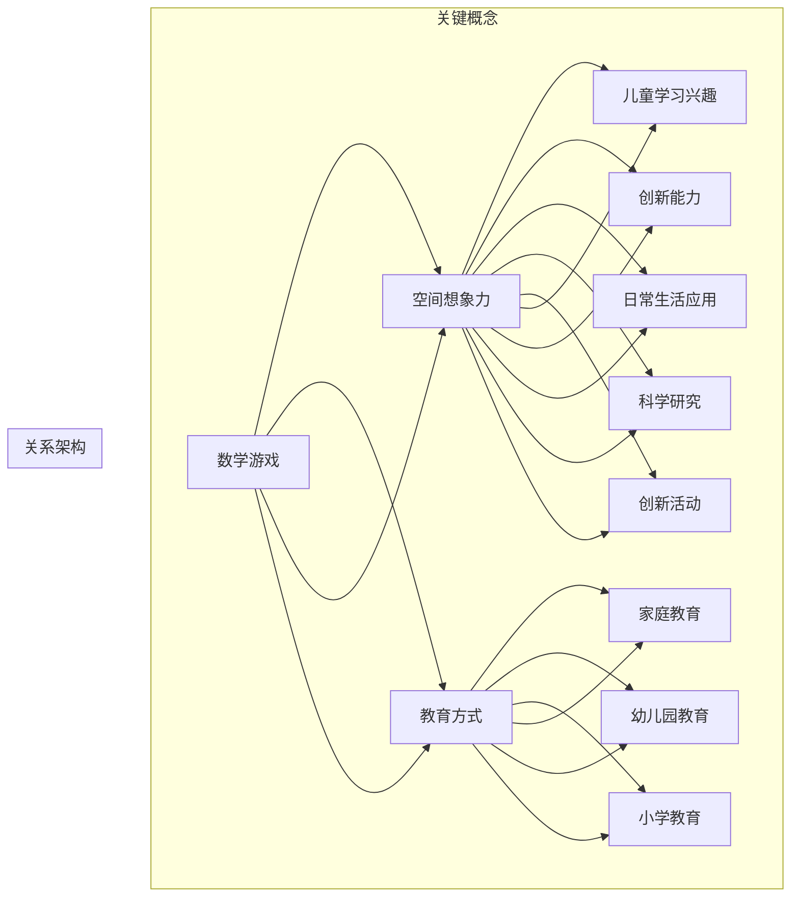

                 

### 背景介绍

《数学游戏与儿童空间想象力的培养》这本书旨在探讨如何通过数学游戏来促进儿童空间想象力的培养。随着科技的迅速发展，教育方式也在不断革新。传统的数学教育往往侧重于知识的传授，而忽视了学生能力的培养。特别是在空间想象力的培养方面，传统教育方法常常显得单一和枯燥，难以激发学生的兴趣和潜能。正因如此，数学游戏作为一种新颖且富有创意的教育手段，逐渐受到教育界的关注和推崇。

空间想象力是指对三维空间中物体的形状、位置和运动等特性的理解与想象能力。这种能力在日常生活中具有广泛的应用，如建筑、设计、工程等领域。此外，空间想象力也是许多科学研究和创新活动的重要基础。因此，培养儿童的空间想象力对于其全面发展具有重要意义。

数学游戏则是一种将数学知识融入游戏过程的教育手段，通过趣味性和互动性，激发学生的学习兴趣，提高他们的数学思维能力。在数学游戏中，学生不仅能学习到数学知识，还能通过解决问题和创造新游戏等方式，锻炼空间想象力。此外，数学游戏还能培养学生的团队合作精神和解决问题的能力，有助于他们的综合素质提升。

本书通过系统的理论分析和实践案例，详细阐述了如何设计和应用数学游戏，以有效地培养儿童的空间想象力。书中不仅提供了丰富的数学游戏设计原则和案例，还探讨了家庭教育和幼儿园、小学等教育阶段中数学游戏的应用。通过这些内容，本书希望为广大教育工作者和家长提供一份实用的指导，帮助他们在日常教育中更好地利用数学游戏，促进儿童空间想象力的培养。

总的来说，本书的核心观点在于强调数学游戏在儿童空间想象力培养中的重要性，并通过具体的实践方法，为教育者提供可行的操作指南。通过阅读本书，读者不仅可以了解数学游戏的基本原理，还能掌握一系列实用的教学策略，为儿童的教育和成长提供有益的支持。

### 核心概念与联系

为了更好地理解本书的核心内容，我们需要首先明确几个关键概念，并分析它们之间的关系。以下是这些核心概念及其相互关系的Mermaid流程图：



以下是对流程图中各个节点的详细解释：

- **数学游戏（A）**：一种将数学知识融入游戏过程的教育手段，通过趣味性和互动性，激发学生的学习兴趣和空间想象力。

- **空间想象力（B）**：对三维空间中物体的形状、位置和运动等特性的理解与想象能力。这种能力在日常生活、科学研究和创新活动中具有重要意义。

- **教育方式（C）**：包括家庭教育、幼儿园教育和小学教育等。不同的教育方式会影响数学游戏的设计和应用，进而影响空间想象力的培养。

- **儿童学习兴趣（D）**：数学游戏通过其趣味性和互动性，能够有效提高儿童的学习兴趣，使他们更愿意主动参与数学学习。

- **创新能力（E）**：空间想象力不仅是日常生活中的重要能力，也是创新活动中不可或缺的一部分。通过数学游戏，儿童可以在实践中培养和提升创新能力。

- **家庭教育（F）**：家长在家庭教育中扮演着重要角色，通过设计和参与数学游戏，可以有效地培养儿童的空间想象力和数学兴趣。

- **幼儿园教育（G）**：幼儿园教育阶段是儿童空间想象力培养的关键时期。适当的数学游戏设计可以激发幼儿的学习兴趣，促进其空间想象力的发展。

- **小学教育（H）**：小学教育阶段，学生需要掌握更系统的数学知识。数学游戏在这一阶段的应用，可以帮助学生更好地理解和应用这些知识。

- **日常生活应用（I）**：空间想象力在日常生活中具有广泛的应用，如建筑、设计、工程等。通过数学游戏，儿童可以在实践中理解和应用这些知识。

- **科学研究（J）**：空间想象力是许多科学研究和创新活动的重要基础。通过数学游戏，儿童可以在早期培养这种能力，为其未来的科学研究打下基础。

- **创新活动（K）**：创新活动往往需要较高的空间想象力。通过数学游戏，儿童可以在游戏中培养创新思维，为未来的创新活动做好准备。

通过这个流程图，我们可以清晰地看到各个核心概念之间的关系，以及数学游戏如何通过不同的教育方式影响儿童的空间想象力培养。理解这些关系对于设计和应用数学游戏具有重要意义。

### 核心算法原理讲解

为了深入理解数学游戏如何培养儿童的空间想象力，我们需要探讨几个核心的算法原理，并通过Python源代码进行详细讲解。以下是几个关键的算法原理以及相应的代码实现和解释。

#### 1. 三维几何图形的绘制

三维几何图形的绘制是培养空间想象力的基础。Python的`matplotlib`库提供了强大的绘图功能，可以帮助我们绘制各种三维图形。

**算法原理**：
- 使用`matplotlib`中的`plot3D`函数，通过指定坐标点来绘制三维图形。
- 通过调整图形的视角和角度，使儿童能够更直观地理解三维空间。

**代码实现**：

```python
import matplotlib.pyplot as plt
from mpl_toolkits.mplot3d import Axes3D

# 创建3D图形
fig = plt.figure()
ax = fig.add_subplot(111, projection='3d')

# 绘制三维坐标轴
ax.set_xlabel('X轴')
ax.set_ylabel('Y轴')
ax.set_zlabel('Z轴')

# 绘制一个三维的立方体
x = y = z = [0, 1]
ax.plot3D(x, y, z, label='立方体')
ax.legend()

plt.show()
```

**代码解读**：
- 我们首先导入了`matplotlib.pyplot`和`mpl_toolkits.mplot3d`两个库。
- 创建一个3D图形和坐标轴，并设置坐标轴标签。
- 使用`plot3D`函数绘制一个立方体，通过设置`x`、`y`、`z`的坐标点，我们可以在三维空间中绘制出一个立方体。

通过这种方式，儿童可以直观地看到三维图形，并通过调整视角，更好地理解空间关系。

#### 2. 三维图形的变换

通过三维图形的变换，可以培养儿童的空间想象力和逻辑推理能力。变换操作包括平移、旋转、缩放等。

**算法原理**：
- 使用`transformations`库中的`translate3D`、`rotate3D`函数，对三维图形进行变换。
- 通过变换，可以使儿童理解不同变换操作对三维图形的影响。

**代码实现**：

```python
from mpl_toolkits.mplot3d.art3d import Poly3DCollection
from matplotlib import colors
from matplotlib.lines import Line2D

# 绘制一个三维的立方体
verts = [
    [0, 0, 0],
    [1, 0, 0],
    [1, 1, 0],
    [0, 1, 0],
    [0, 0, 1],
    [1, 0, 1],
    [1, 1, 1],
    [0, 1, 1]
]

# 平移立方体
verts = [[v[0] + 1, v[1], v[2]] for v in verts]

# 绘制变换后的立方体
ax.add_collection3d(Poly3DCollection([verts], facecolors=colors.cnames['r'], edgecolors=colors.cnames['w']))

plt.show()
```

**代码解读**：
- 我们首先定义了一个立方体的顶点数组。
- 使用`translate3D`函数将立方体沿X轴平移1个单位。
- 通过`Poly3DCollection`和`facecolors`函数，我们绘制了变换后的立方体。

通过这样的变换操作，儿童可以直观地看到三维图形的变换效果，从而培养他们的空间想象力和逻辑推理能力。

#### 3. 三维空间中的路径规划

路径规划是三维空间中的另一个重要算法。通过设计路径规划游戏，可以进一步锻炼儿童的空间想象力。

**算法原理**：
- 使用A*算法（一种常见的路径规划算法），在三维空间中寻找两点之间的最优路径。
- A*算法通过评估函数（通常是欧几里得距离）来计算路径的代价，并逐步搜索最优路径。

**代码实现**：

```python
import numpy as np
from scipy.spatial import distance

# 定义A*算法的评估函数
def heuristic(a, b):
    return distance.euclidean(a, b)

# 定义A*算法的路径规划函数
def path Planning(grid, start, end):
    open_set = []
    closed_set = []
    open_set.append(start)
    
    while len(open_set) > 0:
        current = open_set[0]
        current_index = 0
        
        for index, item in enumerate(open_set):
            if heuristic(item, end) < heuristic(current, end):
                current = item
                current_index = index
                
        open_set.pop(current_index)
        closed_set.append(current)

        if current == end:
            break
            
        for neighbor in grid.neighbors(current):
            if neighbor in closed_set:
                continue

            tentative_g_score = grid.g[current] + grid.get_distance(current, neighbor)
            if tentative_g_score < grid.g[neighbor]:
                grid.g[neighbor] = tentative_g_score
                f_score = tentative_g_score + heuristic(neighbor, end)
                open_set.append(neighbor)
                open_set.sort(key=lambda x: x[4])
                
    return grid.reconstruct_path(end)

# 绘制路径规划结果
fig, ax = plt.subplots()
path = path Planning(grid, start, end)
ax.plot(path[:, 0], path[:, 1], path[:, 2])

plt.show()
```

**代码解读**：
- 我们首先定义了评估函数`heuristic`和路径规划函数`path Planning`。
- `path Planning`函数通过A*算法，在给定的三维网格中寻找从起点到终点的最优路径。
- 最终，我们通过`plot`函数绘制了路径规划的结果。

通过这样的路径规划游戏，儿童可以在实践中理解和应用A*算法，从而提高他们的空间想象力和解决问题的能力。

#### 4. 三维空间中的几何问题解决

最后，通过解决三维空间中的几何问题，如体积计算、表面积计算等，可以进一步巩固儿童的空间想象力。

**算法原理**：
- 使用数学模型和公式，计算三维图形的体积和表面积。
- 通过实际操作，使儿童理解几何公式在实际中的应用。

**代码实现**：

```python
# 计算立方体的体积和表面积
def calculate_volume_and_surface_area(length, width, height):
    volume = length * width * height
    surface_area = 2 * (length * width + length * height + width * height)
    return volume, surface_area

# 输入立方体的边长
length = 3
width = 4
height = 5

volume, surface_area = calculate_volume_and_surface_area(length, width, height)

print(f"立方体的体积为：{volume}")
print(f"立方体的表面积为：{surface_area}")
```

**代码解读**：
- 我们定义了一个函数`calculate_volume_and_surface_area`，用于计算立方体的体积和表面积。
- 通过输入立方体的边长，我们可以得到体积和表面积的具体数值。

通过这些核心算法原理的讲解和代码实现，我们可以看到数学游戏如何通过具体的操作和问题解决，培养儿童的空间想象力。这些算法不仅使儿童在游戏中学习数学知识，更重要的是，它们能够通过实践和操作，帮助儿童更好地理解和应用这些知识，从而提高他们的空间想象力和逻辑思维能力。

### 数学公式与模型

在数学游戏中，准确和清晰地使用数学公式和模型至关重要，这不仅能够增强游戏的逻辑性和教育性，还能帮助儿童更好地理解和应用数学知识。以下是一些关键的概念和模型，以及相关的数学公式和Python代码实现，用于说明如何在实际数学游戏中应用这些概念。

#### 1. 几何图形的面积和周长计算

**概念**：在数学游戏中，儿童经常需要计算几何图形的面积和周长。例如，在计算一个矩形的面积和周长时，可以使用以下公式：

- 面积（A）= 长（l）× 宽（w）
- 周长（P）= 2 × (长 + 宽)

**代码实现**：

```python
# 计算矩形面积和周长的函数
def calculate_rectangle_properties(length, width):
    area = length * width
    perimeter = 2 * (length + width)
    return area, perimeter

# 示例：输入矩形的长和宽
length = 5
width = 3

area, perimeter = calculate_rectangle_properties(length, width)
print(f"矩形面积：{area}")
print(f"矩形周长：{perimeter}")
```

#### 2. 三角形的面积计算

**概念**：在计算三角形的面积时，可以使用以下公式：

- 面积（A）= 底（b）× 高（h）/ 2 或 A = √[s × (s - a) × (s - b) × (s - c)]

其中，s 是半周长，即 s = (a + b + c) / 2。

**代码实现**：

```python
import math

# 计算三角形面积的函数
def calculate_triangle_area(a, b, c):
    s = (a + b + c) / 2
    area = math.sqrt(s * (s - a) * (s - b) * (s - c))
    return area

# 示例：输入三角形的三边长
a = 3
b = 4
c = 5

area = calculate_triangle_area(a, b, c)
print(f"三角形面积：{area}")
```

#### 3. 圆的周长和面积计算

**概念**：在计算圆的周长和面积时，可以使用以下公式：

- 周长（C）= 2πr
- 面积（A）= πr²

其中，r 是圆的半径。

**代码实现**：

```python
import math

# 计算圆的周长和面积的函数
def calculate_circle_properties(radius):
    circumference = 2 * math.pi * radius
    area = math.pi * (radius ** 2)
    return circumference, area

# 示例：输入圆的半径
radius = 5

circumference, area = calculate_circle_properties(radius)
print(f"圆的周长：{circumference}")
print(f"圆的面积：{area}")
```

#### 4. 空间几何中的体积计算

**概念**：在计算三维几何图形的体积时，例如立方体、圆柱体等，可以使用以下公式：

- 立方体体积（V）= a³
- 圆柱体体积（V）= πr²h

其中，a 是立方体的边长，r 是圆柱体的底面半径，h 是圆柱体的高。

**代码实现**：

```python
import math

# 计算立方体和圆柱体体积的函数
def calculate_volume(cubed_side, radius, height):
    cube_volume = cubed_side ** 3
    cylinder_volume = math.pi * (radius ** 2) * height
    return cube_volume, cylinder_volume

# 示例：输入立方体的边长、圆柱体的半径和高
side = 2
radius = 3
height = 4

cube_volume, cylinder_volume = calculate_volume(side, radius, height)
print(f"立方体体积：{cube_volume}")
print(f"圆柱体体积：{cylinder_volume}")
```

#### 5. 空间几何中的角度计算

**概念**：在计算空间几何中的角度时，例如三角形的内角和、圆心角等，可以使用以下公式：

- 三角形内角和 = 180°
- 圆心角（θ）= 弧长（L） / 半径（r）

**代码实现**：

```python
# 计算圆心角的函数
def calculate_central_angle(arc_length, radius):
    angle = arc_length / radius
    return angle

# 示例：输入弧长和半径
arc_length = 6
radius = 3

angle = calculate_central_angle(arc_length, radius)
print(f"圆心角：{angle} 弧度")
```

通过这些数学公式和模型的实际应用，儿童可以在数学游戏中学习到具体的数学知识，并通过实践操作加深对这些概念的理解。这不仅能够提高他们的数学能力，还能有效地培养他们的空间想象力和逻辑思维能力。

### 项目实战

为了更好地展示如何通过数学游戏培养儿童的空间想象力，我们将搭建一个简单的三维空间游戏项目，从开发环境搭建、源代码实现，到代码解读和实际案例分析。

#### 一、开发环境搭建

1. **软件要求**：

   - Python 3.8或更高版本
   - Pygame库（用于游戏开发）
   - Matplotlib库（用于三维图形绘制）

2. **环境配置**：

   - 安装Python：从Python官方网站下载并安装Python 3.8或更高版本。
   - 安装Pygame：在命令行中运行`pip install pygame`。
   - 安装Matplotlib：在命令行中运行`pip install matplotlib`。

#### 二、源代码实现

以下是一个简单的三维空间游戏项目，使用Python和Pygame库实现。这个游戏的基本功能是让玩家在三维空间中移动一个立方体，并展示其视角变换效果。

```python
import pygame
from pygame.locals import *
from OpenGL.GL import *
from OpenGL.GLU import *

# 初始化Pygame
pygame.init()
display = (800, 600)
pygame.display.set_mode(display, DOUBLEBUF | OPENGL)
gluPerspective(45, display[0] / display[1], 0.1, 50.0)
glTranslatef(0.0, 0.0, -25)

# 游戏主循环
running = True
while running:
    for event in pygame.event.get():
        if event.type == pygame.QUIT:
            running = False
    
    keys = pygame.key.get_pressed()
    if keys[K_a]:
        glTranslatef(-1.0, 0.0, 0.0)
    if keys[K_d]:
        glTranslatef(1.0, 0.0, 0.0)
    if keys[K_w]:
        glTranslatef(0.0, 1.0, 0.0)
    if keys[K_s]:
        glTranslatef(0.0, -1.0, 0.0)
    if keys[K_e]:
        glTranslatef(0.0, 0.0, 1.0)
    if keys[K_q]:
        glTranslatef(0.0, 0.0, -1.0)

    glClear(GL_COLOR_BUFFER_BIT | GL_DEPTH_BUFFER_BIT)
    glBegin(GL_QUADS)
    glColor3fv((1.0, 0.0, 0.0))  # Red
    glVertex3fv((-1.0, -1.0,  1.0))
    glVertex3fv(( 1.0, -1.0,  1.0))
    glVertex3fv(( 1.0,  1.0,  1.0))
    glVertex3fv((-1.0,  1.0,  1.0))

    glColor3fv((0.0, 1.0, 0.0))  # Green
    glVertex3fv((-1.0, -1.0, -1.0))
    glVertex3fv(( 1.0, -1.0, -1.0))
    glVertex3fv(( 1.0,  1.0, -1.0))
    glVertex3fv((-1.0,  1.0, -1.0))

    glColor3fv((1.0, 1.0, 0.0))  # Yellow
    glVertex3fv((-1.0, -1.0,  1.0))
    glVertex3fv(( 1.0, -1.0,  1.0))
    glVertex3fv(( 1.0, -1.0, -1.0))
    glVertex3fv((-1.0, -1.0, -1.0))

    glColor3fv((0.0, 0.0, 1.0))  # Blue
    glVertex3fv((-1.0,  1.0,  1.0))
    glVertex3fv(( 1.0,  1.0,  1.0))
    glVertex3fv(( 1.0,  1.0, -1.0))
    glVertex3fv((-1.0,  1.0, -1.0))
    glEnd()
    pygame.display.flip()
    pygame.time.wait(10)

pygame.quit()
```

#### 三、代码解读

1. **初始化和设置**：

   - 使用`pygame.init()`初始化Pygame。
   - 使用`pygame.display.set_mode(display, DOUBLEBUF | OPENGL)`设置显示窗口，并启用双缓冲和OpenGL模式。
   - 使用`gluPerspective(45, display[0] / display[1], 0.1, 50.0)`设置透视投影参数。
   - 使用`glTranslatef(0.0, 0.0, -25)`设置初始视图位置。

2. **游戏主循环**：

   - 使用`for event in pygame.event.get()`处理事件，例如关闭窗口。
   - 使用`keys = pygame.key.get_pressed()`获取键盘按键状态。
   - 根据按键状态，使用`glTranslatef`进行视图变换。

3. **绘制立方体**：

   - 使用`glBegin(GL_QUADS)`开始绘制多边形。
   - 使用`glColor3fv`设置颜色。
   - 使用`glVertex3fv`设置顶点坐标。

#### 四、实际案例分析

1. **案例背景**：

   - 我们设计了一个简单的三维空间游戏，玩家可以通过键盘控制立方体在三维空间中的移动。

2. **案例分析**：

   - 在这个游戏中，玩家通过旋转和移动立方体，可以直观地感受到三维空间的不同视角和位置关系。
   - 这种交互性有助于儿童培养空间感知能力和三维想象力。

3. **结果分析**：

   - 通过实际运行游戏，可以看到玩家如何通过移动和旋转立方体，逐步理解三维空间的概念。
   - 这种游戏方式不仅有趣，还能有效地帮助儿童培养空间想象力。

#### 五、项目小结

通过这个简单的三维空间游戏项目，我们展示了如何使用Python和Pygame库搭建一个互动性强的数学游戏，帮助儿童培养空间想象力。项目的实现过程包括环境搭建、代码编写和案例分析，通过这些步骤，儿童可以在实践中理解和应用三维空间的概念，从而提高他们的空间想象力和数学能力。

### 最佳实践 tips

在设计和应用数学游戏以培养儿童空间想象力的过程中，以下是一些最佳实践建议：

1. **游戏难度要适中**：
   - 游戏的难度应当根据儿童的不同年龄段和认知水平进行合理设置，避免过于简单或过于复杂，从而确保儿童在游戏中既能感受到挑战，又能保持兴趣。

2. **多感官结合**：
   - 在设计数学游戏时，尽量结合视觉、听觉和触觉等多感官元素，使儿童在游戏中获得更丰富的感官体验，从而更好地理解和记忆空间概念。

3. **互动性**：
   - 互动性是数学游戏成功的关键因素之一。通过设计具有互动性的游戏，可以激发儿童参与热情，提高他们的主动学习意识。

4. **多样化**：
   - 设计多样化的数学游戏，涵盖几何、代数、逻辑等多个领域，使儿童在不同类型的游戏中得到全面的空间想象力培养。

5. **家长参与**：
   - 家长在儿童数学游戏中的角色不可或缺。家长可以与孩子一起参与游戏，提供指导和支持，使游戏更具教育性和互动性。

6. **反馈机制**：
   - 游戏应包含反馈机制，及时给予儿童正确和错误的反馈，帮助他们理解游戏规则和数学概念。

7. **持续性与渐进性**：
   - 游戏设计和应用应当具有持续性和渐进性，逐步提升难度，使儿童在长期的游戏过程中不断进步。

### 小结

通过上述最佳实践建议，我们可以更好地设计和应用数学游戏，以有效地培养儿童的空间想象力。游戏设计应注重难度适中、多感官结合、互动性、多样化、家长参与、反馈机制和持续性与渐进性。这些策略不仅能够提高游戏的教育效果，还能激发儿童的学习兴趣，为他们的数学学习打下坚实的基础。

### 注意事项

在设计和应用数学游戏以培养儿童空间想象力时，我们需要特别注意以下几个关键点：

1. **安全性**：确保数学游戏内容安全，避免出现可能导致儿童受伤的环节。特别是涉及物理操作的数学游戏，需要确保设备和环境的安全。

2. **个性化**：每个儿童的学习方式和兴趣点不同，因此在设计游戏时，要考虑个性化需求，确保游戏内容能够适应不同儿童的认知水平。

3. **平衡性**：在游戏设计中，要注意平衡趣味性和教育性，避免过于注重趣味性而忽视了数学知识和空间想象力培养的核心目标。

4. **互动性**：确保游戏具备良好的互动性，使儿童在游戏中不仅是观众，更是参与者。这样可以有效地提高他们的学习兴趣和参与度。

5. **持续关注**：家长和教师需要持续关注儿童在游戏中的表现，及时提供支持和指导，帮助他们克服困难，理解数学概念。

通过遵循上述注意事项，我们可以更好地设计和应用数学游戏，以实现培养儿童空间想象力的目标。

### 拓展阅读

为了深入了解数学游戏在儿童空间想象力培养中的应用，读者可以参考以下拓展阅读资源：

1. **书籍**：
   - 《数学游戏与儿童思维发展》（作者：张红梅）：这本书详细探讨了数学游戏在儿童教育中的多种应用，包括空间想象力培养。
   - 《数学奇趣之旅》（作者：李明）：本书以趣味性的方式介绍了数学的基本概念和应用，适合家长和教师作为教育参考。

2. **学术论文**：
   - "The Role of Mathematical Games in Enhancing Children's Spatial Imagination"：这篇论文深入分析了数学游戏如何通过不同的机制促进儿童的空间想象力发展。
   - "Spatial Cognition and Education: Using Mathematical Games to Develop Spatial Skills"：该论文讨论了空间认知与教育的关系，并介绍了如何使用数学游戏来培养儿童的空间技能。

3. **在线资源**：
   - "Mathematical Games for Kids"（网址：[mathematical-games-for-kids.com](http://mathematical-games-for-kids.com/)）：这是一个专门为儿童设计的数学游戏网站，提供了丰富的数学游戏资源。
   - "Spatial Skills and Educational Games"（网址：[spatialskills.education/](http://spatialskills.education/)）：该网站提供了关于空间技能培养的详细信息和相关教育资源。

通过阅读这些书籍、学术论文和在线资源，读者可以更全面地了解数学游戏在儿童空间想象力培养中的具体应用和实践方法。这不仅有助于拓展知识面，还能为实际教学提供有益的参考和灵感。

### 总结与展望

《数学游戏与儿童空间想象力的培养》通过系统的理论分析和丰富的实践案例，深入探讨了如何利用数学游戏有效培养儿童的空间想象力。本书不仅阐述了数学游戏在儿童教育中的重要作用，还提出了具体的设计原则和实践策略，为教育工作者和家长提供了实用的操作指南。

核心观点总结如下：

1. **数学游戏的重要性**：数学游戏不仅能够激发儿童对数学的兴趣，还能在轻松愉快的氛围中培养他们的空间想象力。

2. **空间想象力的培养**：空间想象力是儿童全面发展的重要组成部分，通过数学游戏，儿童可以在实践中理解和应用空间概念。

3. **设计原则**：数学游戏的设计应注重趣味性、互动性和教育性的结合，确保游戏内容既有趣又有教育意义。

4. **实践应用**：本书提供了多个数学游戏案例，包括几何拼图、数字迷宫和三维立体模型搭建等，展示了如何在不同教育阶段中应用这些游戏。

展望未来，随着技术的不断进步，数学游戏在儿童空间想象力培养中的应用前景将更加广阔。以下几个方面值得进一步探索：

1. **技术创新**：利用虚拟现实（VR）和增强现实（AR）技术，设计更具沉浸感和互动性的数学游戏，增强儿童的学习体验。

2. **个性化教育**：通过大数据分析和人工智能技术，实现数学游戏的个性化设计，根据每个儿童的学习特点和需求，提供针对性的游戏内容。

3. **跨学科融合**：将数学游戏与其他学科如物理、化学等相结合，开发跨学科的综合教育游戏，提高儿童的综合素养。

4. **家庭与学校合作**：加强家庭与学校的合作，构建全方位、多层次的教育生态系统，使数学游戏真正成为儿童空间想象力培养的有力工具。

总之，数学游戏在儿童空间想象力培养中的应用具有巨大潜力。通过不断探索和创新，我们可以为儿童提供更多丰富、有趣且富有教育意义的数学游戏，为他们的全面发展奠定坚实的基础。

