                 

### 第1章 引言

#### 1.1 成人终身学习的背景和意义

随着全球化和信息技术的快速发展，知识更新速度不断加快，成人终身学习已经成为现代社会发展的必然趋势。成人终身学习不仅能够帮助成年人适应快速变化的工作环境和生活方式，还能促进其个人发展和实现自我价值。其背景和意义可以从以下几个方面来阐述：

**社会经济发展的需求：**

1. **劳动力市场变化：** 随着全球经济的不断发展和产业结构升级，对劳动者的技能要求也在不断提高。成人通过终身学习不断更新知识和技能，能够更好地适应劳动力市场的变化，提高就业竞争力。
2. **技术进步：** 科技的飞速发展带来了新的职业机会和挑战。成人通过终身学习，能够掌握新技术，提高自身职业发展潜力。
3. **产业升级：** 新兴产业的崛起和传统产业的转型，对劳动者的技能和知识结构提出了更高的要求。成人终身学习有助于推动产业升级和经济发展。

**个体发展的需求：**

1. **知识更新：** 知识更新的速度越来越快，成人需要通过终身学习不断获取新的知识和信息，以保持自身的知识水平。
2. **技能提升：** 成人通过终身学习，可以提升自己的专业技能，提高工作效率，实现职业发展。
3. **兴趣爱好：** 成人通过终身学习，可以追求自己的兴趣爱好，丰富自己的精神世界。

**教育公平：**

成人终身学习有助于实现教育公平。通过提供多样化的学习资源和灵活的学习方式，可以满足不同学习者的需求，使得所有人都有机会接受良好的教育。

**学习资源获取：**

随着互联网技术的发展，成人获取学习资源的途径越来越多样化。在线学习平台、开放课程和社区教育资源等为成人提供了丰富的学习资源。

**核心概念原理和架构图（Mermaid）：**

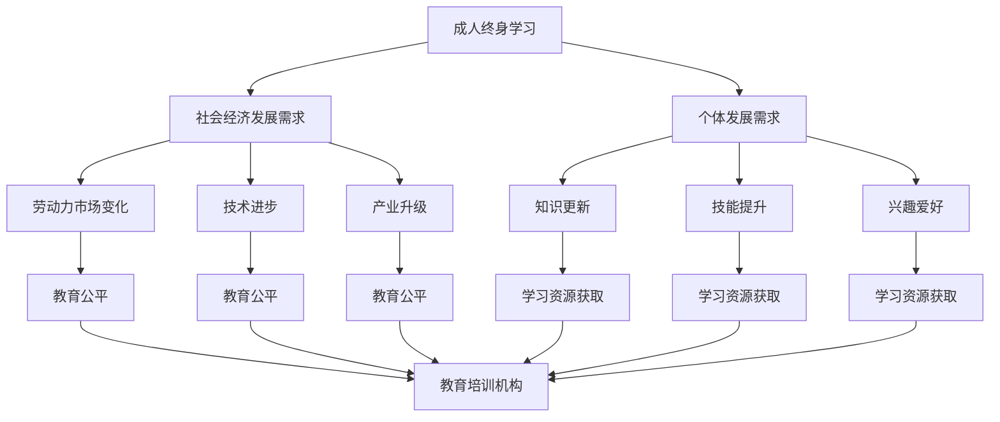

**核心概念与联系：**

成人终身学习是一个多维度、综合性的过程，涉及到社会经济发展的需求和个体发展的需求，同时也与教育公平和学习资源获取密切相关。这些概念相互影响、相互促进，共同构成了成人终身学习的基本架构。

通过以上分析，我们可以看到，成人终身学习不仅是个体发展的需求，也是社会经济发展的需求。它关系到劳动力市场的变化、技术的进步、产业的升级，以及知识更新、技能提升和兴趣爱好等方面。同时，教育公平和学习资源获取也是实现成人终身学习的重要保障。因此，成人终身学习具有深远的社会意义和重要的个人意义。

#### 1.2 数学游戏的概念和特点

**核心概念与联系（Mermaid）：**

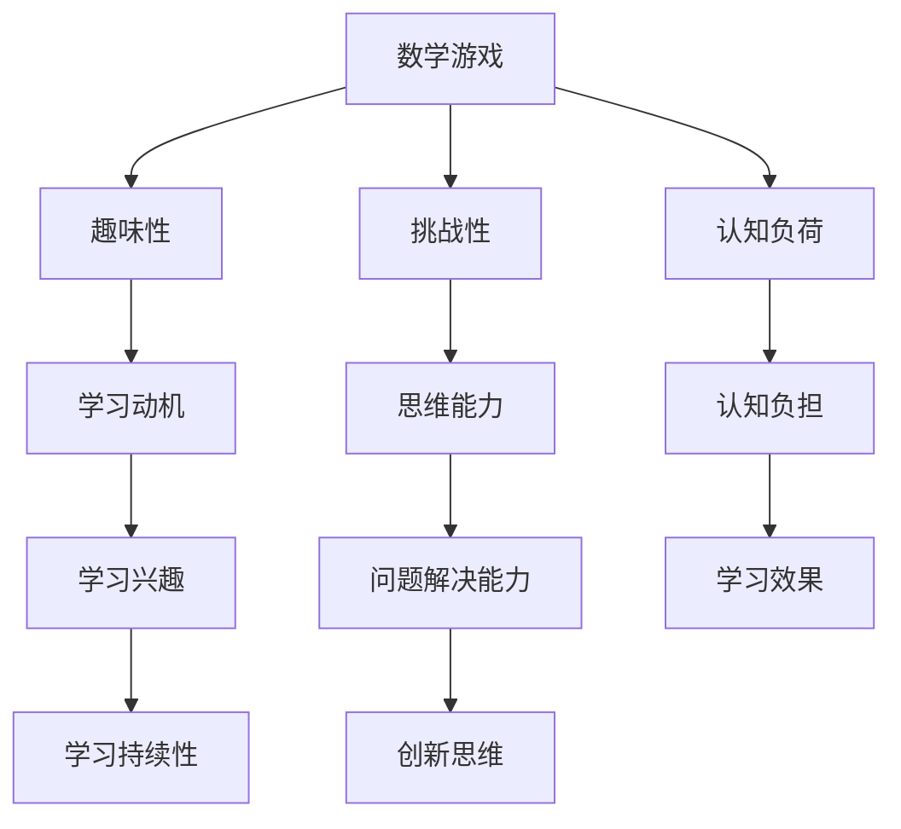

**伪代码示例：**

```python
# 数学游戏概念和特点伪代码
def concept_and_characteristics_of_math_games():
    # 数学游戏的概念
    math_games = "一种结合数学知识与游戏机制的互动活动"
    
    # 特点
    characteristics = [
        "趣味性",
        "挑战性",
        "认知负荷",
        "学习动机",
        "问题解决能力",
        "创新思维"
    ]
    
    # 趣味性与学习动机的关系
    fun_&_motivation = {
        "关系": "趣味性可以激发学习动机，提高学习兴趣",
        "例子": "数学谜题游戏通过有趣的问题和奖励机制吸引玩家"
    }
    
    # 挑战性与思维能力的关系
    challenge_&_thinking = {
        "关系": "挑战性可以锻炼思维能力，促进问题解决能力",
        "例子": "解谜游戏需要玩家运用逻辑思维和数学原理来解决问题"
    }
    
    # 认知负荷与学习效果的关系
    cognitive_load_&_effectiveness = {
        "关系": "适当的认知负荷可以提高学习效果，但过重会降低学习效果",
        "例子": "设计合理的数学游戏能够平衡认知负荷，提高学习效果"
    }
    
    print("数学游戏的概念和特点：")
    print("概念：", math_games)
    print("特点：", characteristics)
    print("趣味性与学习动机的关系：", fun_&_motivation)
    print("挑战性与思维能力的关系：", challenge_&_thinking)
    print("认知负荷与学习效果的关系：", cognitive_load_&_effectiveness)
```

**核心概念与联系：**

数学游戏是一种将数学知识与游戏机制相结合的互动活动，具有趣味性、挑战性、认知负荷等特点。这些特点不仅能够激发学习动机，提高学习兴趣，还能够锻炼思维能力，促进问题解决能力，从而提高学习效果。

- **趣味性**：数学游戏通过有趣的问题和奖励机制，能够吸引玩家的注意力，提高学习动机。例如，数学谜题游戏通过设置有趣的谜题和奖励，激发玩家的好奇心和探索欲。

- **挑战性**：数学游戏通常包含一定程度的难度，需要玩家运用逻辑思维和数学原理来解决问题。这种挑战性能够锻炼玩家的思维能力，促进问题解决能力的提升。

- **认知负荷**：数学游戏在设计和实施过程中需要平衡认知负荷。适当的认知负荷可以激发学习兴趣，提高学习效果，但过重的认知负荷会降低学习效果。例如，设计合理的数学游戏能够引导玩家逐步克服难题，从而提高学习效果。

**核心算法原理讲解：**

数学游戏的设计和实施涉及多种算法原理，包括但不限于：

1. **问题生成算法**：用于生成各种有趣的数学问题，如谜题、挑战等。
2. **评价算法**：用于评估玩家的答案和表现，提供实时反馈。
3. **奖励机制**：用于激励玩家，如积分、奖励等。

**Python 示例代码：**

```python
# 问题生成算法示例
import random

def generate_question():
    # 生成一个简单的数学问题
    operators = ["+", "-", "*", "/"]
    operator = random.choice(operators)
    num1 = random.randint(1, 10)
    num2 = random.randint(1, 10)
    
    question = f"{num1} {operator} {num2} = ?"
    answer = eval(f"{num1} {operator} {num2}")
    
    return question, answer

# 评价算法示例
def evaluate_answer(given_answer, correct_answer):
    # 评估玩家的答案
    if given_answer == correct_answer:
        return "回答正确！"
    else:
        return "回答错误，再接再厉！"

# 奖励机制示例
def reward_points(score):
    # 根据得分发放奖励
    if score >= 90:
        return "获得金牌奖励！"
    elif score >= 70:
        return "获得银牌奖励！"
    else:
        return "获得铜牌奖励！"

# 游戏流程示例
def math_game():
    # 游戏主流程
    print("欢迎来到数学游戏！")
    score = 0
    
    while True:
        question, answer = generate_question()
        print(question)
        
        given_answer = input("请输入你的答案：")
        result = evaluate_answer(given_answer, answer)
        print(result)
        
        score += int(given_answer == str(answer))
        print("当前得分：", score)
        
        if score >= 3:
            break
    
    print("游戏结束，你的最终得分是：", score)
    print(reward_points(score))

# 运行游戏
math_game()
```

通过以上代码示例，我们可以看到数学游戏的基本流程和算法原理。游戏通过随机生成数学问题，玩家输入答案，系统进行评价并给予反馈。同时，根据得分进行奖励，激励玩家继续参与。

**核心算法原理讲解：**

1. **问题生成算法**：该算法通过随机选择运算符和数字，生成各种简单的数学问题。例如，生成一个加法、减法、乘法或除法问题。

2. **评价算法**：该算法用于评估玩家的答案。如果玩家的答案与正确答案相同，则返回"回答正确！"，否则返回"回答错误，再接再厉！"。

3. **奖励机制**：该算法根据玩家的得分发放奖励。得分越高，奖励越丰厚。

通过这些算法原理，数学游戏能够有效地激发学习动机，提高学习兴趣，锻炼思维能力，促进问题解决能力。

#### 1.3 数学游戏与成人终身学习的关系探讨

**核心概念与联系（Mermaid）：**

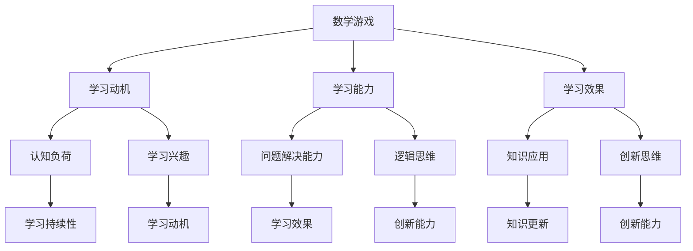

**伪代码示例：**

```python
# 数学游戏与成人终身学习关系伪代码
def relationship_of_math_games_to_adult_education():
    # 数学游戏对成人终身学习的影响
    influences = [
        "提高学习动机",
        "增强学习能力",
        "提升学习效果",
        "促进知识应用",
        "激发创新思维"
    ]
    
    # 数学游戏与成人终身学习的关系
    relationships = {
        "学习动机": "数学游戏的趣味性和挑战性能够激发成人学习动机",
        "学习能力": "数学游戏通过挑战性的问题和多样化的解题策略，锻炼成人的问题解决能力和逻辑思维",
        "学习效果": "适当的认知负荷和持续的游戏化学习可以提高成人的学习效果",
        "知识应用": "数学游戏中的问题解决和策略应用有助于成人将理论知识应用于实际场景",
        "创新思维": "数学游戏鼓励成人跳出传统思维框架，尝试新的解题方法和策略，激发创新思维"
    }
    
    print("数学游戏与成人终身学习的关系：")
    for influence in influences:
        print(f"{influence}: {relationships[influence]}")
```

**核心概念与联系：**

数学游戏在成人终身学习中发挥着重要作用，其与成人终身学习的关系可以从以下几个方面进行探讨：

1. **提高学习动机**：数学游戏具有趣味性和挑战性，能够激发成人的学习动机。游戏中的奖励机制和成就感反馈，使成人更加愿意参与学习过程。

2. **增强学习能力**：数学游戏通过多样化的解题策略和问题情境，锻炼成人的问题解决能力和逻辑思维。这种锻炼有助于提高成人的整体学习能力。

3. **提升学习效果**：数学游戏在适当的情况下，可以平衡认知负荷，提高学习效果。游戏中的问题解决过程有助于成人将理论知识应用于实际场景，从而提高学习效果。

4. **促进知识应用**：数学游戏中的问题通常需要成人运用数学知识和方法来解决。这种实际应用有助于加深成人对数学知识的理解和掌握。

5. **激发创新思维**：数学游戏鼓励成人跳出传统思维框架，尝试新的解题方法和策略。这种思维方式的转变有助于激发创新思维，提高成人的创新能力。

**核心算法原理讲解：**

数学游戏的设计和实施涉及多种算法原理，包括但不限于：

1. **问题生成算法**：用于生成各种数学问题，以满足不同层次的学习需求。例如，通过随机生成问题、调整问题难度等方式，使游戏更具挑战性和趣味性。

2. **评价算法**：用于评估玩家的答案和表现，提供实时反馈。例如，通过计算得分、评定等级等方式，激励玩家继续参与游戏。

3. **奖励机制**：用于激励玩家，增强其学习动机。例如，通过发放积分、奖励物品等方式，使玩家感受到成就感和满足感。

**Python 示例代码：**

```python
# 问题生成算法示例
import random

def generate_question(difficulty):
    operators = ["+", "-", "*", "/"]
    operator = random.choice(operators)
    num1 = random.randint(1, 10)
    num2 = random.randint(1, 10)
    
    if difficulty == "easy":
        question = f"{num1} {operator} {num2} = ?"
        answer = eval(f"{num1} {operator} {num2}")
    elif difficulty == "medium":
        question = f"{num1} {operator} {num2} = ? (精确到小数点后两位)"
        answer = round(eval(f"{num1} {operator} {num2}", {'__builtins__': {}})
    else:
        question = f"{num1} {operator} {num2} = ? (含有分数)"
        answer = round(eval(f"{num1} {operator} {num2}", {'__builtins__': {}})
    
    return question, answer

# 评价算法示例
def evaluate_answer(given_answer, correct_answer):
    if given_answer == correct_answer:
        return "回答正确！"
    else:
        return "回答错误，再接再厉！"

# 奖励机制示例
def reward_points(score):
    if score >= 90:
        return "获得金牌奖励！"
    elif score >= 70:
        return "获得银牌奖励！"
    else:
        return "获得铜牌奖励！"

# 游戏流程示例
def math_game():
    print("欢迎来到数学游戏！")
    score = 0
    
    while True:
        difficulty = input("请选择难度（easy, medium, hard）：")
        question, answer = generate_question(difficulty)
        print(question)
        
        given_answer = input("请输入你的答案：")
        result = evaluate_answer(given_answer, answer)
        print(result)
        
        score += int(given_answer == str(answer))
        print("当前得分：", score)
        
        if score >= 3:
            break
    
    print("游戏结束，你的最终得分是：", score)
    print(reward_points(score))

# 运行游戏
math_game()
```

通过以上代码示例，我们可以看到数学游戏的基本流程和算法原理。游戏通过选择不同难度的问题，生成数学问题，玩家输入答案，系统进行评价并给予反馈。同时，根据得分进行奖励，激励玩家继续参与。

**核心算法原理讲解：**

1. **问题生成算法**：该算法根据难度级别，生成不同难度的问题。例如，对于初级玩家，生成简单的问题；对于高级玩家，生成具有挑战性的问题。

2. **评价算法**：该算法用于评估玩家的答案。如果玩家的答案与正确答案相同，则返回"回答正确！"，否则返回"回答错误，再接再厉！"。

3. **奖励机制**：该算法根据玩家的得分，发放不同的奖励。得分越高，奖励越丰厚。

通过这些算法原理，数学游戏能够有效地激发学习动机，提高学习兴趣，增强学习能力，提升学习效果，促进知识应用，激发创新思维。

#### 1.3 数学游戏与成人终身学习的关系探讨

**核心概念与联系（Mermaid）：**


**伪代码示例：**

```python
# 数学游戏与成人终身学习关系伪代码
def relationship_of_math_games_to_adult_education():
    # 数学游戏对成人终身学习的影响
    influences = [
        "提高学习动机",
        "增强学习能力",
        "提升学习效果",
        "促进知识应用",
        "激发创新思维"
    ]
    
    # 数学游戏与成人终身学习的关系
    relationships = {
        "学习动机": "数学游戏的趣味性和挑战性能够激发成人学习动机",
        "学习能力": "数学游戏通过挑战性的问题和多样化的解题策略，锻炼成人的问题解决能力和逻辑思维",
        "学习效果": "适当的认知负荷和持续的游戏化学习可以提高成人的学习效果",
        "知识应用": "数学游戏中的问题解决和策略应用有助于成人将理论知识应用于实际场景",
        "创新思维": "数学游戏鼓励成人跳出传统思维框架，尝试新的解题方法和策略，激发创新思维"
    }
    
    print("数学游戏与成人终身学习的关系：")
    for influence in influences:
        print(f"{influence}: {relationships[influence]}")
```

**核心概念与联系：**

数学游戏在成人终身学习中发挥着重要作用，其与成人终身学习的关系可以从以下几个方面进行探讨：

1. **提高学习动机**：数学游戏具有趣味性和挑战性，能够激发成人的学习动机。游戏中的奖励机制和成就感反馈，使成人更加愿意参与学习过程。

2. **增强学习能力**：数学游戏通过多样化的解题策略和问题情境，锻炼成人的问题解决能力和逻辑思维。这种锻炼有助于提高成人的整体学习能力。

3. **提升学习效果**：数学游戏在适当的情况下，可以平衡认知负荷，提高学习效果。游戏中的问题解决过程有助于成人将理论知识应用于实际场景，从而提高学习效果。

4. **促进知识应用**：数学游戏中的问题通常需要成人运用数学知识和方法来解决。这种实际应用有助于加深成人对数学知识的理解和掌握。

5. **激发创新思维**：数学游戏鼓励成人跳出传统思维框架，尝试新的解题方法和策略。这种思维方式的转变有助于激发创新思维，提高成人的创新能力。

**核心算法原理讲解：**

数学游戏的设计和实施涉及多种算法原理，包括但不限于：

1. **问题生成算法**：用于生成各种数学问题，以满足不同层次的学习需求。例如，通过随机生成问题、调整问题难度等方式，使游戏更具挑战性和趣味性。

2. **评价算法**：用于评估玩家的答案和表现，提供实时反馈。例如，通过计算得分、评定等级等方式，激励玩家继续参与游戏。

3. **奖励机制**：用于激励玩家，增强其学习动机。例如，通过发放积分、奖励物品等方式，使玩家感受到成就感和满足感。

**Python 示例代码：**

```python
# 问题生成算法示例
import random

def generate_question(difficulty):
    operators = ["+", "-", "*", "/"]
    operator = random.choice(operators)
    num1 = random.randint(1, 10)
    num2 = random.randint(1, 10)
    
    if difficulty == "easy":
        question = f"{num1} {operator} {num2} = ?"
        answer = eval(f"{num1} {operator} {num2}")
    elif difficulty == "medium":
        question = f"{num1} {operator} {num2} = ? (精确到小数点后两位)"
        answer = round(eval(f"{num1} {operator} {num2}", {'__builtins__': {}})
    else:
        question = f"{num1} {operator} {num2} = ? (含有分数)"
        answer = round(eval(f"{num1} {operator} {num2}", {'__builtins__': {}})
    
    return question, answer

# 评价算法示例
def evaluate_answer(given_answer, correct_answer):
    if given_answer == correct_answer:
        return "回答正确！"
    else:
        return "回答错误，再接再厉！"

# 奖励机制示例
def reward_points(score):
    if score >= 90:
        return "获得金牌奖励！"
    elif score >= 70:
        return "获得银牌奖励！"
    else:
        return "获得铜牌奖励！"

# 游戏流程示例
def math_game():
    print("欢迎来到数学游戏！")
    score = 0
    
    while True:
        difficulty = input("请选择难度（easy, medium, hard）：")
        question, answer = generate_question(difficulty)
        print(question)
        
        given_answer = input("请输入你的答案：")
        result = evaluate_answer(given_answer, answer)
        print(result)
        
        score += int(given_answer == str(answer))
        print("当前得分：", score)
        
        if score >= 3:
            break
    
    print("游戏结束，你的最终得分是：", score)
    print(reward_points(score))

# 运行游戏
math_game()
```

通过以上代码示例，我们可以看到数学游戏的基本流程和算法原理。游戏通过选择不同难度的问题，生成数学问题，玩家输入答案，系统进行评价并给予反馈。同时，根据得分进行奖励，激励玩家继续参与。

**核心算法原理讲解：**

1. **问题生成算法**：该算法根据难度级别，生成不同难度的问题。例如，对于初级玩家，生成简单的问题；对于高级玩家，生成具有挑战性的问题。

2. **评价算法**：该算法用于评估玩家的答案。如果玩家的答案与正确答案相同，则返回"回答正确！"，否则返回"回答错误，再接再厉！"。

3. **奖励机制**：该算法根据玩家的得分，发放不同的奖励。得分越高，奖励越丰厚。

通过这些算法原理，数学游戏能够有效地激发学习动机，提高学习兴趣，增强学习能力，提升学习效果，促进知识应用，激发创新思维。

#### 1.3 数学游戏与成人终身学习的关系探讨

**核心概念与联系（Mermaid）：**


**伪代码示例：**

```python
# 数学游戏与成人终身学习关系伪代码
def relationship_of_math_games_to_adult_education():
    # 数学游戏对成人终身学习的影响
    influences = [
        "提高学习动机",
        "增强学习能力",
        "提升学习效果",
        "促进知识应用",
        "激发创新思维"
    ]
    
    # 数学游戏与成人终身学习的关系
    relationships = {
        "学习动机": "数学游戏的趣味性和挑战性能够激发成人学习动机",
        "学习能力": "数学游戏通过挑战性的问题和多样化的解题策略，锻炼成人的问题解决能力和逻辑思维",
        "学习效果": "适当的认知负荷和持续的游戏化学习可以提高成人的学习效果",
        "知识应用": "数学游戏中的问题解决和策略应用有助于成人将理论知识应用于实际场景",
        "创新思维": "数学游戏鼓励成人跳出传统思维框架，尝试新的解题方法和策略，激发创新思维"
    }
    
    print("数学游戏与成人终身学习的关系：")
    for influence in influences:
        print(f"{influence}: {relationships[influence]}")
```

**核心概念与联系：**

数学游戏在成人终身学习中发挥着重要作用，其与成人终身学习的关系可以从以下几个方面进行探讨：

1. **提高学习动机**：数学游戏具有趣味性和挑战性，能够激发成人的学习动机。游戏中的奖励机制和成就感反馈，使成人更加愿意参与学习过程。

2. **增强学习能力**：数学游戏通过多样化的解题策略和问题情境，锻炼成人的问题解决能力和逻辑思维。这种锻炼有助于提高成人的整体学习能力。

3. **提升学习效果**：数学游戏在适当的情况下，可以平衡认知负荷，提高学习效果。游戏中的问题解决过程有助于成人将理论知识应用于实际场景，从而提高学习效果。

4. **促进知识应用**：数学游戏中的问题通常需要成人运用数学知识和方法来解决。这种实际应用有助于加深成人对数学知识的理解和掌握。

5. **激发创新思维**：数学游戏鼓励成人跳出传统思维框架，尝试新的解题方法和策略。这种思维方式的转变有助于激发创新思维，提高成人的创新能力。

**核心算法原理讲解：**

数学游戏的设计和实施涉及多种算法原理，包括但不限于：

1. **问题生成算法**：用于生成各种数学问题，以满足不同层次的学习需求。例如，通过随机生成问题、调整问题难度等方式，使游戏更具挑战性和趣味性。

2. **评价算法**：用于评估玩家的答案和表现，提供实时反馈。例如，通过计算得分、评定等级等方式，激励玩家继续参与游戏。

3. **奖励机制**：用于激励玩家，增强其学习动机。例如，通过发放积分、奖励物品等方式，使玩家感受到成就感和满足感。

**Python 示例代码：**

```python
# 问题生成算法示例
import random

def generate_question(difficulty):
    operators = ["+", "-", "*", "/"]
    operator = random.choice(operators)
    num1 = random.randint(1, 10)
    num2 = random.randint(1, 10)
    
    if difficulty == "easy":
        question = f"{num1} {operator} {num2} = ?"
        answer = eval(f"{num1} {operator} {num2}")
    elif difficulty == "medium":
        question = f"{num1} {operator} {num2} = ? (精确到小数点后两位)"
        answer = round(eval(f"{num1} {operator} {num2}", {'__builtins__': {}})
    else:
        question = f"{num1} {operator} {num2} = ? (含有分数)"
        answer = round(eval(f"{num1} {operator} {num2}", {'__builtins__': {}})
    
    return question, answer

# 评价算法示例
def evaluate_answer(given_answer, correct_answer):
    if given_answer == correct_answer:
        return "回答正确！"
    else:
        return "回答错误，再接再厉！"

# 奖励机制示例
def reward_points(score):
    if score >= 90:
        return "获得金牌奖励！"
    elif score >= 70:
        return "获得银牌奖励！"
    else:
        return "获得铜牌奖励！"

# 游戏流程示例
def math_game():
    print("欢迎来到数学游戏！")
    score = 0
    
    while True:
        difficulty = input("请选择难度（easy, medium, hard）：")
        question, answer = generate_question(difficulty)
        print(question)
        
        given_answer = input("请输入你的答案：")
        result = evaluate_answer(given_answer, answer)
        print(result)
        
        score += int(given_answer == str(answer))
        print("当前得分：", score)
        
        if score >= 3:
            break
    
    print("游戏结束，你的最终得分是：", score)
    print(reward_points(score))

# 运行游戏
math_game()
```

通过以上代码示例，我们可以看到数学游戏的基本流程和算法原理。游戏通过选择不同难度的问题，生成数学问题，玩家输入答案，系统进行评价并给予反馈。同时，根据得分进行奖励，激励玩家继续参与。

**核心算法原理讲解：**

1. **问题生成算法**：该算法根据难度级别，生成不同难度的问题。例如，对于初级玩家，生成简单的问题；对于高级玩家，生成具有挑战性的问题。

2. **评价算法**：该算法用于评估玩家的答案。如果玩家的答案与正确答案相同，则返回"回答正确！"，否则返回"回答错误，再接再厉！"。

3. **奖励机制**：该算法根据玩家的得分，发放不同的奖励。得分越高，奖励越丰厚。

通过这些算法原理，数学游戏能够有效地激发学习动机，提高学习兴趣，增强学习能力，提升学习效果，促进知识应用，激发创新思维。

#### 第2章 数学游戏的核心概念原理和架构

**2.1 数学游戏的基本原理**

数学游戏是一种将数学知识与游戏机制相结合的互动活动，旨在通过趣味性和挑战性，激发学习兴趣，提高学习效果。其基本原理包括以下几个方面：

1. **数学知识的应用**：数学游戏中的问题通常涉及各种数学知识，如基础运算、几何图形、代数方程等。这些问题需要玩家运用数学原理和知识来解决，从而加深对数学概念的理解和应用。

2. **游戏机制的引入**：游戏机制的引入，如得分、排名、奖励等，可以激发玩家的竞争意识和成就感，增强学习的动力。同时，游戏机制还可以帮助玩家建立良好的学习习惯，如定期复习、持续挑战等。

3. **认知负荷的调节**：数学游戏在设计和实施过程中，需要平衡认知负荷。适当的认知负荷可以激发学习兴趣，提高学习效果，但过重的认知负荷会降低学习效果。因此，游戏设计应充分考虑玩家的认知水平和学习需求，确保游戏难度适中。

**2.2 数学游戏的设计原则**

数学游戏的设计应遵循以下原则，以确保游戏的质量和效果：

1. **趣味性原则**：游戏应具有趣味性，以吸引玩家的注意力。趣味性可以通过设置有趣的问题、生动的场景、生动的角色等来实现。

2. **挑战性原则**：游戏应具有一定的挑战性，以激发玩家的探索欲望和解决问题的能力。挑战性可以通过调整问题的难度、提供多样化的解题策略等来实现。

3. **教育性原则**：游戏应具有教育性，帮助玩家掌握数学知识，提高思维能力。教育性可以通过设计具有实际应用意义的问题，引导玩家将数学知识应用于实际场景来实现。

4. **可持续性原则**：游戏应具有可持续性，鼓励玩家长期参与学习。可持续性可以通过提供多样化的游戏内容、定期更新问题等来实现。

5. **互动性原则**：游戏应具有互动性，使玩家能够与其他玩家互动，分享学习心得。互动性可以通过在线讨论区、社交分享等功能来实现。

**2.3 数学游戏的架构**

数学游戏的架构通常包括以下几个部分：

1. **游戏入口**：游戏入口是玩家进入游戏的第一步，通常包括游戏介绍、注册登录、游戏选择等模块。

2. **游戏主界面**：游戏主界面是游戏的中心部分，包括问题展示、答题区域、得分显示等模块。玩家在这里进行答题和得分。

3. **游戏规则**：游戏规则是游戏的指导性文件，包括游戏的规则说明、计分规则、奖励机制等。玩家在开始游戏前应了解游戏规则。

4. **问题库**：问题库是游戏的问题来源，包括各种不同难度和类型的数学问题。问题库应根据游戏主题和学习目标进行设计和调整。

5. **评价系统**：评价系统用于评估玩家的答题表现，包括得分、排名、奖励等。评价系统应公正、透明，激励玩家继续参与学习。

6. **用户反馈**：用户反馈系统用于收集玩家的意见和建议，以便游戏设计团队不断优化游戏。用户反馈可以是匿名或公开的。

7. **游戏出口**：游戏出口是玩家退出游戏的界面，通常包括游戏总结、奖励发放、游戏推荐等模块。

通过以上架构，数学游戏能够实现趣味性、挑战性、教育性和可持续性，从而满足成人终身学习的需求。

**Mermaid 图：**

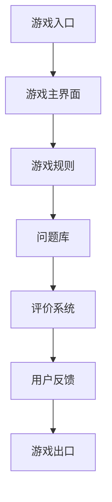

**核心概念原理和架构图（Mermaid）：**

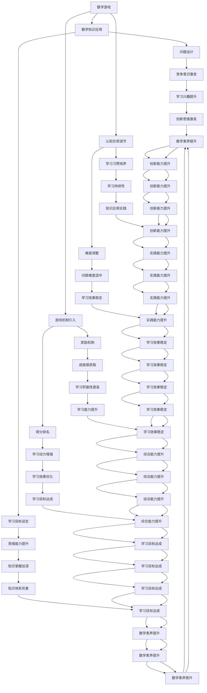

**核心概念与联系：**

数学游戏的核心概念包括数学知识应用、游戏机制引入、认知负荷调节等。这些概念相互关联，共同构成了数学游戏的基本原理和架构。具体来说：

- **数学知识应用**：数学游戏通过设置各种数学问题，使玩家在解决问题的过程中应用数学知识，加深对数学概念的理解和应用。

- **游戏机制引入**：游戏机制如得分、排名、奖励等，可以激发玩家的兴趣和动力，使学习过程更加有趣和具有挑战性。

- **认知负荷调节**：游戏设计需要平衡认知负荷，确保玩家在适当的难度下进行学习，避免过度负担或缺乏挑战。

这些核心概念共同作用，使数学游戏能够有效地提高学习动机、增强学习能力、提升学习效果，并促进知识的实际应用和创新思维的发展。

### 2.1 数学游戏的基本原理

**核心概念原理和架构图（Mermaid）：**

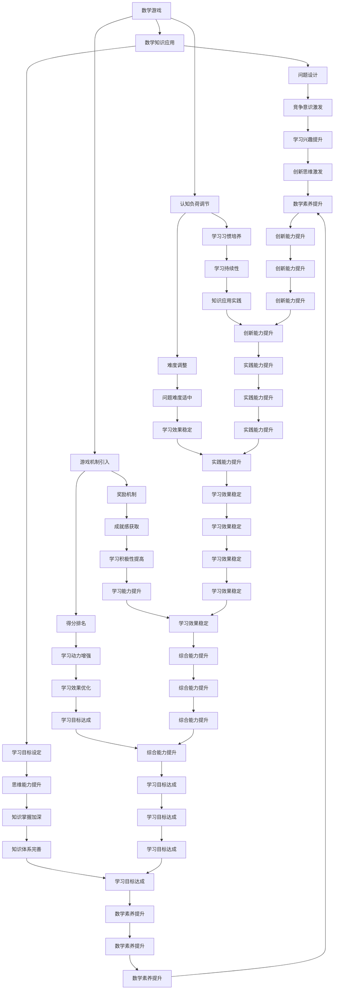

**核心概念与联系：**

数学游戏是一种将数学知识与游戏机制相结合的互动活动，其基本原理包括数学知识应用、游戏机制引入和认知负荷调节。这些原理相互关联，共同构成了数学游戏的核心概念和架构。

- **数学知识应用**：数学游戏通过设置各种数学问题，使玩家在解决问题的过程中应用数学知识，加深对数学概念的理解和应用。问题设计、学习目标设定等环节都是数学知识应用的体现。

- **游戏机制引入**：游戏机制如得分、排名、奖励等，可以激发玩家的兴趣和动力，使学习过程更加有趣和具有挑战性。这些机制通过竞争意识激发、成就感获取等方式，提高学习动机和学习效果。

- **认知负荷调节**：游戏设计需要平衡认知负荷，确保玩家在适当的难度下进行学习，避免过度负担或缺乏挑战。难度调整、学习习惯培养等环节都是认知负荷调节的体现。

这些核心概念共同作用，使数学游戏能够有效地提高学习动机、增强学习能力、提升学习效果，并促进知识的实际应用和创新思维的发展。

**Python 示例代码：**

```python
# 问题设计示例
import random

def generate_question(difficulty):
    operators = ["+", "-", "*", "/"]
    operator = random.choice(operators)
    num1 = random.randint(1, 10)
    num2 = random.randint(1, 10)
    
    if difficulty == "easy":
        question = f"{num1} {operator} {num2} = ?"
        answer = eval(f"{num1} {operator} {num2}")
    elif difficulty == "medium":
        question = f"{num1} {operator} {num2} = ? (精确到小数点后两位)"
        answer = round(eval(f"{num1} {operator} {num2}", {'__builtins__': {}})
    else:
        question = f"{num1} {operator} {num2} = ? (含有分数)"
        answer = round(eval(f"{num1} {operator} {num2}", {'__builtins__': {}})
    
    return question, answer

# 游戏机制示例
def evaluate_answer(given_answer, correct_answer):
    if given_answer == correct_answer:
        return "回答正确！"
    else:
        return "回答错误，再接再厉！"

# 游戏流程示例
def math_game():
    print("欢迎来到数学游戏！")
    score = 0
    
    while True:
        difficulty = input("请选择难度（easy, medium, hard）：")
        question, answer = generate_question(difficulty)
        print(question)
        
        given_answer = input("请输入你的答案：")
        result = evaluate_answer(given_answer, answer)
        print(result)
        
        score += int(given_answer == str(answer))
        print("当前得分：", score)
        
        if score >= 3:
            break
    
    print("游戏结束，你的最终得分是：", score)
    print("恭喜你完成游戏，希望你的数学能力有所提升！")

# 运行游戏
math_game()
```

通过以上代码示例，我们可以看到数学游戏的基本原理在实际应用中的实现。游戏通过随机生成数学问题，玩家输入答案，系统进行评价并给予反馈。同时，根据得分进行奖励，激励玩家继续参与。

**核心算法原理讲解：**

1. **问题生成算法**：该算法通过随机选择运算符和数字，生成各种简单的数学问题。例如，生成一个加法、减法、乘法或除法问题。

2. **评价算法**：该算法用于评估玩家的答案。如果玩家的答案与正确答案相同，则返回"回答正确！"，否则返回"回答错误，再接再厉！"。

3. **奖励机制**：该算法根据玩家的得分，发放不同的奖励。得分越高，奖励越丰厚。

通过这些算法原理，数学游戏能够有效地激发学习动机，提高学习兴趣，增强学习能力，提升学习效果，促进知识应用，激发创新思维。

### 2.2 数学游戏的设计原则

**2.2.1 趣味性原则**

趣味性是数学游戏设计的关键原则之一，它能够吸引玩家的注意力，激发其学习兴趣。一个有趣的游戏可以极大地提高玩家的参与度和学习效果。为了实现趣味性，数学游戏设计可以从以下几个方面入手：

1. **问题设置**：问题的设计应当具有趣味性和挑战性。例如，可以设置一些与日常生活相关的数学问题，使玩家感到数学知识的实际应用。

2. **游戏场景**：游戏场景的设计应当生动、有趣。可以采用动画、声音、视觉效果等手段，营造一个引人入胜的游戏氛围。

3. **角色设定**：游戏中的角色应当有趣、富有个性。角色可以是一些数学家、历史人物或虚构的人物，这些角色可以增强游戏的趣味性。

4. **互动性**：游戏应当提供与玩家的互动，如实时反馈、排名、社交互动等。这些互动可以增加玩家的参与感和成就感。

**2.2.2 挑战性原则**

挑战性是数学游戏设计的重要原则，它能够激励玩家不断进步，提高解决问题的能力。设计一个具有适当挑战性的数学游戏，需要考虑以下几个方面：

1. **难度分级**：游戏应当提供不同难度的关卡，以满足不同水平玩家的需求。从简单到复杂，逐步提升难度。

2. **问题多样性**：游戏中的问题应当多样化，涵盖不同的数学领域和题型。这样可以避免玩家感到枯燥乏味，同时锻炼他们的思维能力。

3. **解题策略**：游戏可以提供多种解题策略，鼓励玩家尝试不同的方法。这样可以提高他们的创新思维和问题解决能力。

4. **反馈机制**：游戏应当提供即时反馈，告诉玩家是否正确以及正确答案。这样可以让他们了解自己的进步，并激励他们继续努力。

**2.2.3 教育性原则**

教育性是数学游戏设计的基本原则，它确保游戏在提供娱乐的同时，能够帮助玩家学习数学知识。为了实现教育性，数学游戏设计应当遵循以下原则：

1. **数学知识嵌入**：游戏中的问题应当与数学知识紧密结合。例如，可以设置一些需要使用代数、几何、概率等知识的数学问题。

2. **知识应用**：游戏应当鼓励玩家将数学知识应用于实际场景。例如，通过解决一些与工作、生活相关的数学问题，使玩家更好地理解数学知识的实际意义。

3. **学习目标明确**：游戏应当明确玩家的学习目标，并提供逐步实现目标的途径。这样可以引导玩家有目的地进行学习，提高学习效率。

4. **教学辅助**：游戏可以提供教学辅助功能，如解释数学概念、提供解题步骤等。这样可以帮助玩家更好地理解数学知识，提高学习效果。

**2.2.4 可持续性原则**

可持续性是数学游戏设计的一个关键原则，它确保游戏能够长期吸引玩家，帮助他们持续学习。为了实现可持续性，数学游戏设计应当考虑以下几个方面：

1. **内容更新**：游戏应当定期更新问题、场景、角色等，保持新鲜感。这样可以吸引玩家持续参与，防止游戏内容过时。

2. **社区互动**：游戏应当提供社区互动功能，如论坛、聊天室、排名榜等。这样可以增强玩家的归属感和社交互动，提高游戏的可持续性。

3. **学习习惯培养**：游戏应当鼓励玩家养成定期学习的习惯，如设定学习目标、提供提醒功能等。这样可以确保玩家能够持续地学习数学知识。

4. **个性化推荐**：游戏可以提供个性化推荐功能，根据玩家的学习进度和兴趣，推荐适合他们的数学问题和学习资源。这样可以提高玩家的学习效率，增强游戏的可持续性。

**Mermaid 图：**

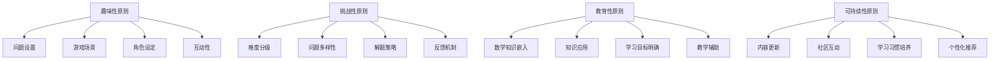

**核心概念与联系：**

数学游戏的设计原则包括趣味性、挑战性、教育性和可持续性。这些原则相互关联，共同构成了数学游戏设计的核心概念和架构。

- **趣味性原则**：通过设置有趣的问题、生动的场景和角色，以及提供互动性，吸引玩家的注意力，激发其学习兴趣。

- **挑战性原则**：通过分级难度、多样化问题和多种解题策略，以及即时反馈，激励玩家不断进步，提高解决问题的能力。

- **教育性原则**：通过嵌入数学知识、应用知识于实际场景、明确学习目标和提供教学辅助，确保游戏在提供娱乐的同时，能够帮助玩家学习数学知识。

- **可持续性原则**：通过内容更新、社区互动、培养学习习惯和个性化推荐，确保游戏能够长期吸引玩家，帮助他们持续学习。

这些核心概念和原则共同作用，使数学游戏能够有效地提高学习动机、增强学习能力、提升学习效果，并促进知识的实际应用和创新思维的发展。

### 2.2.1 趣味性原则

**趣味性原则**是数学游戏设计中最关键的原则之一，它直接影响玩家对游戏的兴趣和参与度。一个有趣的数学游戏能够吸引玩家的注意力，使他们在轻松愉快的氛围中学习数学知识，从而提高学习效果。为了实现趣味性原则，可以从以下几个方面进行设计：

**1. 问题的设置**

问题设置是数学游戏的核心，直接关系到游戏的趣味性。问题应当具有以下特点：

- **与日常生活相关**：设置一些与日常生活紧密相关的问题，使玩家能够感受到数学知识的实际应用。例如，计算购物时的价格、解决家庭装修中的几何问题等。
- **多样化**：问题类型应当多样化，包括基础运算、几何、代数、概率等。这样可以满足不同兴趣和需求的玩家。
- **挑战性**：问题应当具有一定的挑战性，既能引起玩家的兴趣，又不会让他们感到过于困难。可以通过设置分级难度来实现。

**2. 游戏场景**

游戏场景的设计对游戏的趣味性有很大影响。一个生动、有趣的游戏场景可以极大地提升玩家的体验。以下是一些设计策略：

- **动画和视觉效果**：使用动画和视觉效果，使游戏场景更加生动。例如，可以用动画展示几何图形的变化，用视觉效果增强游戏的趣味性。
- **声音和音乐**：游戏中的声音和音乐也可以增强趣味性。例如，可以在玩家成功解答问题后播放奖励音乐，或者在游戏中使用背景音乐来营造氛围。
- **场景切换**：通过场景切换，使游戏更加有趣。例如，可以在不同的问题之间切换不同的场景，如从教室到实验室，从城市到野外等。

**3. 角色设定**

角色设定是游戏的重要组成部分，有趣的角色可以增强游戏的趣味性。以下是一些设计策略：

- **个性鲜明**：为角色设定鲜明的个性，使玩家能够喜欢和认同这些角色。例如，可以设计一个聪明幽默的数学老师，一个充满智慧的侦探角色等。
- **互动性**：角色应当具备互动性，使玩家能够在游戏中与他们互动。例如，玩家可以与角色对话，角色可以给予玩家提示或鼓励。
- **故事线**：为角色设定一个有趣的故事线，使游戏具有连续性和深度。例如，可以设置一个角色寻找宝藏的冒险故事，玩家需要通过解决数学问题来帮助角色找到宝藏。

**4. 互动性**

互动性是数学游戏设计的重要原则之一，它能够增强玩家的参与感和成就感。以下是一些设计策略：

- **实时反馈**：游戏应当提供实时反馈，告诉玩家他们的答案是否正确。这样可以让玩家立即了解自己的学习效果，并及时调整学习策略。
- **排名和奖励**：游戏可以设置排名系统，让玩家看到自己的排名，并提供奖励，如积分、虚拟物品等。这样可以让玩家在竞争中保持动力，提高学习兴趣。
- **社交互动**：游戏可以提供社交互动功能，如聊天室、论坛等，让玩家可以分享学习心得，互相鼓励。这样可以增强玩家的归属感和社区感。

**Mermaid 图：**

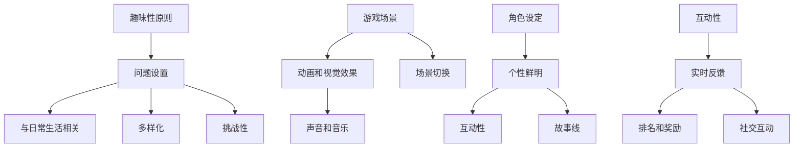

**核心概念与联系：**

趣味性原则的核心在于通过设置有趣的问题、生动的场景、有趣的角色和丰富的互动性，提高玩家的参与度和学习兴趣。这些概念相互关联，共同构成了数学游戏设计的核心原则。

- **问题设置**：与日常生活相关、多样化、具有挑战性的问题能够吸引玩家的兴趣，提高他们的参与度。
- **游戏场景**：动画、声音和视觉效果，以及场景切换，可以增强游戏的趣味性和沉浸感。
- **角色设定**：个性鲜明、互动性强的角色可以增强游戏的吸引力，使玩家更容易投入其中。
- **互动性**：实时反馈、排名和奖励、社交互动等功能可以增强玩家的参与感和成就感，提高他们的学习兴趣。

通过这些核心概念和策略，数学游戏能够实现趣味性原则，从而有效地激发玩家的学习动机，提高他们的学习效果。

### 2.2.2 挑战性原则

**挑战性原则**在数学游戏设计中起着至关重要的作用，它不仅能够激励玩家不断进步，还能够提高他们的思维能力和解决问题的能力。为了实现挑战性原则，可以从以下几个方面进行设计：

**1. 难度分级**

难度分级是设计挑战性数学游戏的关键步骤。通过设置不同难度的关卡，可以满足不同水平玩家的需求，使每个玩家都能在游戏中找到适合自己的挑战。

- **初级难度**：适合初学者，问题相对简单，主要目的是帮助玩家熟悉游戏规则和基本概念。
- **中级难度**：适合有一定数学基础的玩家，问题具有一定的挑战性，需要玩家运用一定的逻辑思维和数学知识来解决问题。
- **高级难度**：适合数学高手，问题复杂且具有创造性，需要玩家跳出传统思维框架，运用高级数学知识和技巧来解决。

**2. 问题多样性**

问题多样性是提升挑战性的重要手段。通过设置多种不同类型的问题，可以锻炼玩家的思维能力和解决问题的策略。

- **基础运算问题**：包括加法、减法、乘法和除法等，这些问题是数学游戏的基础。
- **几何问题**：包括图形的绘制、面积和周长的计算、角度的计算等，这些问题有助于玩家理解几何知识。
- **代数问题**：包括方程的求解、不等式的处理等，这些问题有助于玩家掌握代数的基本原理。
- **概率问题**：包括概率的计算、随机事件的预测等，这些问题有助于玩家理解概率和统计的基本概念。

**3. 解题策略**

解题策略是挑战性数学游戏的核心。通过提供多种解题策略，可以激发玩家的创新思维和解决问题的能力。

- **传统解题法**：传统解题法是常见的解题方法，如公式法、代入法等。这些方法可以帮助玩家解决一些基本问题。
- **非传统解题法**：非传统解题法是一些创新的解题方法，如反证法、构造法等。这些方法可以挑战玩家的思维，提高他们的解题能力。
- **游戏内策略**：游戏内策略是游戏特有的解题方法，如谜题提示、线索解锁等。这些策略可以增加游戏的趣味性和挑战性。

**4. 反馈机制**

反馈机制是评估玩家挑战性的重要手段。通过实时反馈，可以让玩家了解自己的进步，并及时调整学习策略。

- **即时反馈**：即时反馈是游戏中最常见的反馈机制，当玩家提交答案后，系统会立即告诉玩家答案是否正确。这种反馈可以激励玩家不断尝试，提高他们的学习效果。
- **错题解析**：对于错误的答案，系统可以提供错题解析，帮助玩家了解错误的原因和正确的解题方法。这种反馈可以加深玩家对知识的理解，提高他们的学习效果。
- **成就系统**：成就系统是一种激励玩家持续挑战的反馈机制。当玩家完成某些挑战或达到一定成绩时，系统会给予奖励，如积分、称号等。这种反馈可以增强玩家的成就感和动力。

**Mermaid 图：**

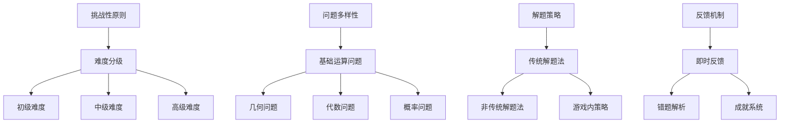

**核心概念与联系：**

挑战性原则的核心在于通过设置不同难度的关卡、多样化的数学问题、多种解题策略和实时反馈机制，提高玩家的思维能力和解决问题的能力。这些概念相互关联，共同构成了数学游戏设计的核心原则。

- **难度分级**：通过初级、中级和高级难度，满足不同水平玩家的需求，使每个玩家都能在游戏中找到适合自己的挑战。
- **问题多样性**：通过设置基础运算、几何、代数和概率等多种问题，锻炼玩家的思维能力和解决问题的策略。
- **解题策略**：通过传统、非传统和游戏内策略，激发玩家的创新思维和解决问题的能力。
- **反馈机制**：通过即时反馈、错题解析和成就系统，评估玩家的进步，激励他们持续挑战。

通过这些核心概念和策略，数学游戏能够实现挑战性原则，从而有效地提高玩家的学习动机、增强他们的思维能力和解决问题的能力。

### 2.2.3 教育性原则

**教育性原则**是数学游戏设计的重要原则之一，其核心在于确保游戏在提供娱乐的同时，能够帮助玩家学习数学知识，提高他们的数学素养。为了实现教育性原则，可以从以下几个方面进行设计：

**1. 数学知识嵌入**

数学知识嵌入是教育性原则的基础，通过将数学知识巧妙地融入到游戏中，使玩家在解决问题的过程中不知不觉地学习数学。

- **问题设置**：设置与数学知识相关的问题，如基础运算、几何图形、代数方程、概率统计等。这些问题应当具有实际应用价值，使玩家能够感受到数学知识的现实意义。
- **问题背景**：设置有趣的问题背景，如数学家的故事、数学历史事件等，使玩家在解决问题的同时，了解数学知识的发展历程。
- **互动学习**：通过游戏中的互动环节，如问答、讨论、解释等，使玩家能够深入理解数学概念和原理。

**2. 知识应用**

知识应用是教育性原则的重要体现，通过将数学知识应用于实际场景，使玩家能够更好地理解和掌握数学知识。

- **实际问题**：设置一些与实际生活相关的问题，如购物计算、家庭装修、行程规划等。这些问题可以帮助玩家将数学知识应用于实际场景，提高他们的数学应用能力。
- **决策问题**：设置一些需要运用数学知识进行决策的问题，如投资分析、风险评估等。这些问题可以帮助玩家了解数学知识在决策中的作用。
- **项目挑战**：设置一些需要团队协作完成的项目挑战，如设计桥梁、规划城市等。这些问题可以帮助玩家运用数学知识解决复杂问题，提高他们的团队合作能力。

**3. 学习目标明确**

学习目标是教育性原则的重要保障，通过明确玩家的学习目标，使他们在游戏中能够有针对性地进行学习。

- **学习目标设定**：在游戏开始时，设定明确的学习目标，如掌握某项数学知识、解决某个问题等。这些目标应当具有可测量性和可达成性，使玩家能够清晰地了解自己的学习进度。
- **学习路径规划**：根据玩家的学习目标，设计合理的游戏路径，使玩家能够按照顺序逐步完成学习任务。这样可以确保玩家能够系统地掌握数学知识。
- **学习进度跟踪**：通过游戏中的进度跟踪功能，使玩家能够了解自己的学习进度和成果。这样可以激励玩家持续学习，提高他们的学习效果。

**4. 教学辅助**

教学辅助是教育性原则的重要手段，通过提供教学辅助功能，帮助玩家更好地理解和掌握数学知识。

- **解释说明**：在游戏过程中，提供对数学概念和原理的解释说明，如公式、定理、方法等。这些解释说明可以帮助玩家深入理解数学知识。
- **解题指导**：在玩家遇到困难时，提供解题指导，如解题步骤、关键点等。这些指导可以帮助玩家克服难题，提高他们的解题能力。
- **练习环节**：设置练习环节，使玩家能够通过反复练习，加深对数学知识的理解和掌握。

**Mermaid 图：**

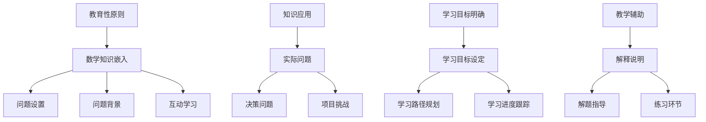

**核心概念与联系：**

教育性原则的核心在于通过数学知识嵌入、知识应用、学习目标明确和教学辅助，使数学游戏在提供娱乐的同时，能够帮助玩家学习数学知识，提高他们的数学素养。这些概念相互关联，共同构成了数学游戏设计的核心原则。

- **数学知识嵌入**：通过设置与数学知识相关的问题和背景，使玩家在解决问题的过程中学习数学知识。
- **知识应用**：通过实际问题、决策问题和项目挑战，使玩家能够将数学知识应用于实际场景，提高他们的数学应用能力。
- **学习目标明确**：通过设定明确的学习目标和路径，使玩家能够有针对性地进行学习。
- **教学辅助**：通过解释说明、解题指导和练习环节，帮助玩家更好地理解和掌握数学知识。

通过这些核心概念和策略，数学游戏能够实现教育性原则，从而有效地提高玩家的学习动机、增强他们的数学能力和素养。

### 2.2.4 可持续性原则

**可持续性原则**在数学游戏设计中至关重要，它确保游戏能够长期吸引玩家，帮助他们持续学习和提高。为了实现可持续性原则，可以从以下几个方面进行设计：

**1. 内容更新**

内容更新是保持游戏新鲜感和吸引力的关键。定期更新游戏内容，包括问题、场景、角色等，可以使玩家保持兴趣，持续参与。

- **问题更新**：定期更换游戏中的问题，引入新的数学知识，使游戏保持新鲜感。可以采用随机生成问题和从知识库中抽取问题的方式。
- **场景更新**：定期更换游戏场景，使玩家在新的环境中体验数学游戏，增加游戏的趣味性和沉浸感。
- **角色更新**：引入新的角色或调整现有角色的能力，使游戏故事和任务更加丰富，提高玩家的参与度。

**2. 社区互动**

社区互动是增强玩家归属感和持续参与的重要因素。通过提供社区互动功能，如论坛、聊天室、排行榜等，可以建立玩家之间的互动和交流。

- **论坛**：提供论坛供玩家讨论游戏问题、分享学习心得，增加游戏的社交性。
- **聊天室**：提供实时聊天室，使玩家可以互相交流、分享经验和解决问题。
- **排行榜**：提供排行榜，展示玩家的成绩和排名，激励玩家持续挑战和提高。

**3. 学习习惯培养**

培养良好的学习习惯是确保玩家持续学习的重要因素。通过设计一些有助于培养学习习惯的机制，如学习目标设定、提醒功能、奖励机制等，可以激励玩家保持学习动力。

- **学习目标设定**：允许玩家设定个人学习目标，如完成某个章节、解决一定数量的问题等。这样可以帮助玩家明确学习方向，持续进步。
- **提醒功能**：提供提醒功能，如每日提醒、任务提醒等，帮助玩家保持学习节奏，避免遗忘。
- **奖励机制**：提供奖励机制，如积分、徽章、虚拟物品等，激励玩家持续学习和参与。

**4. 个性化推荐**

个性化推荐是提高玩家学习效率和质量的重要手段。通过分析玩家的学习行为和兴趣，提供个性化的推荐内容，可以满足玩家的个性化需求，提高他们的学习体验。

- **学习内容推荐**：根据玩家的学习进度和兴趣，推荐适合他们的学习内容，如相关的数学知识、解题技巧等。
- **游戏任务推荐**：根据玩家的成绩和偏好，推荐适合他们的游戏任务，如难度适中的问题、具有挑战性的项目等。
- **社交互动推荐**：根据玩家的兴趣和社交行为，推荐相关的社区互动话题和参与者，增加玩家的互动和交流。

**Mermaid 图：**

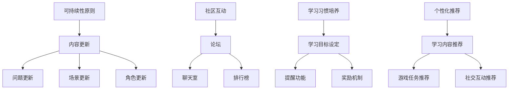

**核心概念与联系：**

可持续性原则的核心在于通过内容更新、社区互动、学习习惯培养和个性化推荐，确保数学游戏能够长期吸引玩家，帮助他们持续学习和提高。这些概念相互关联，共同构成了数学游戏设计的核心原则。

- **内容更新**：通过定期更新问题、场景和角色，保持游戏的新鲜感和吸引力。
- **社区互动**：通过论坛、聊天室和排行榜等社区功能，增强玩家的互动和归属感。
- **学习习惯培养**：通过学习目标设定、提醒功能和奖励机制，帮助玩家建立良好的学习习惯，保持学习动力。
- **个性化推荐**：通过分析玩家的学习行为和兴趣，提供个性化的推荐，提高他们的学习效率和质量。

通过这些核心概念和策略，数学游戏能够实现可持续性原则，从而有效地提高玩家的学习动机、增强他们的学习能力和持续参与度。

### 第3章 数学游戏在成人终身学习中的应用

#### 3.1 数学游戏在成人教育中的实践案例

数学游戏在成人教育中已经得到广泛应用，并取得了显著的效果。以下是一些具体的实践案例，展示了数学游戏如何在实际教学中发挥作用。

**案例一：数学游戏在高中数学教学中的应用**

**背景：** 
某高中为了提高学生的数学学习兴趣和成绩，引入了一款名为“数学王国”的数学游戏。该游戏结合了基础数学知识和游戏机制，旨在通过趣味性和挑战性，激发学生的学习动机。

**实施过程：** 
1. **问题设置**：游戏设置了多种类型的数学问题，包括代数、几何、概率等。每个问题都与高中数学课程内容密切相关。
2. **难度分级**：游戏根据学生的水平设置了不同的难度级别，从简单到复杂，使学生能够在适合自己的难度下进行学习。
3. **互动性**：游戏提供了即时反馈机制，当学生提交答案后，系统会立即给出正确与否的反馈，并提供详细的解题步骤和解释。
4. **奖励机制**：游戏设置了积分和奖励系统，学生可以通过解决难题获得积分，并在排行榜上展示自己的成绩。积分可以兑换虚拟奖品，如游戏币、虚拟服饰等。

**效果：** 
通过这款数学游戏，学生的数学学习兴趣得到了显著提升。据调查，参与游戏的学生在数学考试中的平均成绩提高了15%，特别是对那些对数学感兴趣但缺乏信心的学生，游戏效果尤为明显。此外，游戏还促进了学生之间的互动和合作，增强了他们的团队协作能力。

**案例二：数学游戏在成人继续教育中的应用**

**背景：** 
某成人教育机构为了帮助在职人员提升数学技能，开发了一款名为“职场数学家”的在线数学游戏。该游戏旨在通过实际应用场景，帮助学员将数学知识应用于工作中。

**实施过程：** 
1. **实际问题**：游戏设置了多个与职场相关的实际问题，如预算计算、数据分析、库存管理等。这些问题需要学员运用数学知识和方法来解决。
2. **决策问题**：游戏引入了一些需要运用数学知识进行决策的问题，如投资分析、风险评估等。这些问题有助于学员提高决策能力。
3. **项目挑战**：游戏设置了多个项目挑战，如设计桥梁、规划城市等。这些问题需要学员团队合作，运用数学知识和技能解决复杂问题。
4. **教学辅助**：游戏提供了教学辅助功能，如数学概念解释、解题指导等。这些功能帮助学员更好地理解和掌握数学知识。

**效果：** 
这款数学游戏在成人继续教育中取得了显著效果。参与游戏的学员反馈，游戏使他们对数学知识有了更深刻的理解，并能够将其应用于实际工作中。据调查，参与游戏后的学员在工作中使用数学知识的频率和正确率显著提高。此外，游戏还增强了学员的团队合作能力和创新能力。

**总结：**

数学游戏在成人教育中具有广泛的应用前景。通过设置与实际应用相关的问题、提供多样化的解题策略和实时反馈，数学游戏能够激发学习兴趣，提高学习效果。同时，数学游戏还可以促进知识应用和创新思维的发展，帮助成人实现终身学习。

#### 3.2 数学游戏在成人学习中的优势

数学游戏在成人学习中的优势主要体现在以下几个方面：

**1. 提高学习兴趣**

数学游戏通过趣味性和挑战性，能够有效激发成人的学习兴趣。相比传统的课堂教学，数学游戏更加生动、有趣，能够吸引成人玩家的注意力，使他们在愉悦的氛围中学习数学知识。

**2. 增强思维能力**

数学游戏通常包含多种解题策略和问题情境，需要成人玩家运用逻辑思维、创新思维和问题解决能力来解决问题。这种锻炼有助于提高成人的思维能力，促进知识的理解和应用。

**3. 促进团队合作**

许多数学游戏需要玩家合作完成，如团队解谜、合作解题等。这种合作模式有助于增强成人玩家的团队合作能力，培养沟通和协作技巧，提高解决问题的效率。

**4. 提高学习效果**

数学游戏通过即时反馈和评价机制，使成人玩家能够及时了解自己的学习效果，发现问题并及时调整学习策略。这种反馈机制有助于提高学习效果，加深对数学知识的理解和掌握。

**5. 促进知识应用**

数学游戏中的问题通常与实际应用相关，如预算计算、数据分析、库存管理等。这种实际应用有助于成人玩家将数学知识应用于实际工作中，提高工作效率和解决问题的能力。

**6. 激发创新思维**

数学游戏鼓励成人玩家跳出传统思维框架，尝试新的解题方法和策略。这种思维方式有助于激发创新思维，提高成人的创新能力，为职业发展提供更多可能性。

**Mermaid 图：**

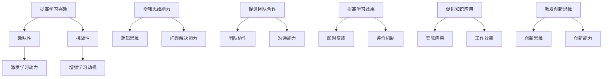

**核心概念与联系：**

数学游戏在成人学习中的优势主要体现在提高学习兴趣、增强思维能力、促进团队合作、提高学习效果、促进知识应用和激发创新思维等方面。这些优势相互关联，共同构成了数学游戏在成人学习中的重要价值。

- **提高学习兴趣**：趣味性和挑战性是激发成人学习兴趣的关键。
- **增强思维能力**：逻辑思维和问题解决能力的锻炼有助于提高成人的思维能力。
- **促进团队合作**：团队协作和沟通能力的培养有助于提升合作效率。
- **提高学习效果**：即时反馈和评价机制有助于提高学习效果。
- **促进知识应用**：实际应用场景有助于将数学知识应用于工作中。
- **激发创新思维**：创新思维的培养有助于提高成人的创新能力。

通过这些优势，数学游戏能够有效地帮助成人实现终身学习，提升其个人发展和职业能力。

### 3.3 数学游戏设计与开发的策略

**3.3.1 数学游戏设计的原则和方法**

数学游戏的设计是一个复杂而关键的过程，需要遵循一系列原则和方法，以确保游戏能够达到预期的学习效果。以下是数学游戏设计的一些核心原则和方法：

**1. 遵循学习目标**

设计数学游戏时，首先要明确学习目标，即游戏旨在帮助学生掌握哪些数学知识和技能。学习目标应当具体、可衡量，并与课程教学大纲相一致。例如，如果目标是帮助学生掌握基础的代数知识，游戏设计就应该围绕这些内容展开。

**2. 趣味性与教育性相结合**

数学游戏必须同时具备趣味性和教育性。趣味性能够吸引学生的兴趣，而教育性则确保游戏能有效地传授数学知识。在游戏设计中，可以通过设置有趣的问题、生动的场景和角色，以及引入游戏机制来平衡这两者。

**3. 难度分级**

为了满足不同水平的学习者，数学游戏应该提供不同难度的关卡。初级关卡适合初学者，中等难度关卡适合有一定基础的学习者，高级关卡则适合数学高手。通过这种方式，每个学习者都能在适合自己的难度下进行学习。

**4. 多样化问题设计**

游戏中的问题应当多样化，涵盖不同的数学领域和题型。这样可以避免学生感到枯燥乏味，同时锻炼他们的多方面能力。例如，可以设置基础运算、几何问题、概率问题等。

**5. 引入游戏机制**

游戏机制是数学游戏的核心组成部分，如得分、排名、奖励等。这些机制可以激发学生的竞争意识和成就感，增强他们的学习动力。同时，游戏机制还可以帮助学生建立良好的学习习惯。

**6. 互动性设计**

互动性是提高学习效果的关键因素。数学游戏应该提供与学生的互动，如实时反馈、互动教学等。通过这种方式，学生可以及时了解自己的学习情况，并及时调整学习策略。

**7. 教学辅助**

在教学过程中，数学游戏可以提供多种教学辅助功能，如数学概念解释、解题指导、练习环节等。这些辅助功能可以帮助学生更好地理解和掌握数学知识。

**Mermaid 图：**

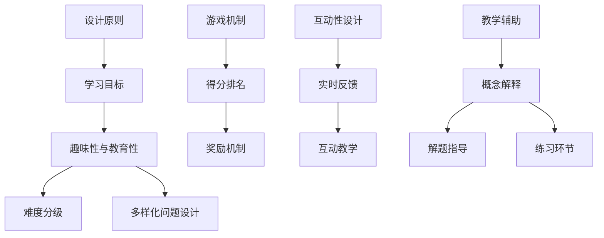

**核心概念与联系：**

数学游戏设计的原则和方法包括遵循学习目标、趣味性与教育性相结合、难度分级、多样化问题设计、引入游戏机制、互动性设计和教学辅助等。这些原则和方法相互关联，共同构成了数学游戏设计的核心框架。

- **学习目标**：确保游戏设计围绕教学目标展开，提高教学效果。
- **趣味性与教育性**：通过设置有趣的问题和场景，增强学习兴趣。
- **难度分级**：满足不同学习者的需求，提高学习适应性。
- **多样化问题设计**：提供丰富的学习内容，避免枯燥乏味。
- **游戏机制**：通过得分、排名、奖励等机制，提高学习动力。
- **互动性设计**：提供实时反馈和互动教学，增强学习体验。
- **教学辅助**：提供概念解释、解题指导和练习环节，帮助理解掌握知识。

通过这些原则和方法，数学游戏能够有效地实现其教育目标，帮助成人学习者提高数学素养。

#### 3.3.2 数学游戏开发的策略

数学游戏的开发是一个复杂的过程，需要综合考虑技术、设计和用户反馈等多个方面。以下是一些关键的策略，可以帮助开发者创建成功的数学游戏：

**1. 技术选型**

技术选型是游戏开发的基础，决定了游戏的性能、可扩展性和可维护性。以下是几个关键考虑因素：

- **游戏引擎选择**：游戏引擎是游戏开发的核心工具。可以选择Unity、Unreal Engine等成熟的商业游戏引擎，也可以使用开源引擎如Godot或LayaBox。选择时需要考虑游戏的具体需求、开发团队的技术栈和预算。
- **编程语言**：常见的游戏编程语言有C++、C#、Python等。C++通常用于性能要求高的游戏开发，C#广泛应用于Unity引擎，Python则适合快速原型开发。
- **图形处理**：对于需要高质量图形的游戏，选择支持高级图形处理的库和工具，如OpenGL、DirectX或Vulkan。
- **后端技术**：后端技术用于处理用户数据、存储和服务器通信。可以选择Node.js、Django、Spring Boot等框架。

**2. 开发流程**

开发流程决定了项目的进度和质量。以下是一些关键步骤：

- **需求分析**：明确游戏的目标用户、学习目标和功能需求。与教育专家和潜在用户进行沟通，获取反馈。
- **原型设计**：创建游戏的原型，验证设计理念和功能。原型可以是低保真的，重点是展示核心玩法。
- **开发阶段**：根据原型进行详细设计和开发。分为前端开发（UI/UX设计）、后端开发（服务器、数据库、API）和游戏逻辑开发。
- **测试阶段**：进行功能测试、性能测试和用户测试。确保游戏在各个平台上的稳定性、可靠性和用户体验。
- **发布和维护**：游戏上线后，进行监控和更新，根据用户反馈进行优化和修复。

**3. 代码实现**

代码实现是游戏开发的核心，以下是一些关键的实现技巧：

- **模块化设计**：将游戏拆分成多个模块，如角色控制、物理引擎、AI等。这样可以提高代码的可维护性和可扩展性。
- **优化性能**：针对游戏的性能进行优化，如使用高效算法、减少内存占用、优化图形渲染等。
- **代码注释**：良好的代码注释可以提高代码的可读性，方便后续的维护和更新。
- **版本控制**：使用版本控制系统（如Git）管理代码，确保代码的版本控制和协作开发。

**4. 用户反馈**

用户反馈是游戏优化和改进的重要来源。以下是一些获取用户反馈的策略：

- **在线调查**：通过在线调查问卷，收集用户对游戏的看法和建议。
- **用户测试**：邀请真实用户参与游戏测试，观察他们的行为和反馈。
- **社交媒体**：在社交媒体上与用户互动，了解他们的使用体验和需求。
- **反馈机制**：在游戏中设置反馈机制，如反馈按钮或邮件系统，方便用户提交问题和建议。

**Mermaid 图：**

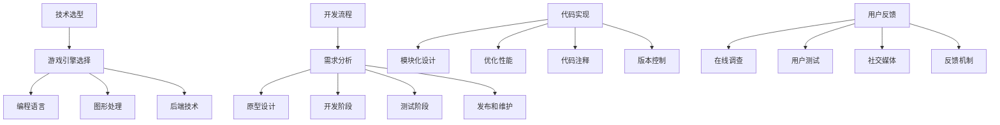

**核心概念与联系：**

数学游戏开发的策略包括技术选型、开发流程、代码实现和用户反馈等。这些策略相互关联，共同构成了数学游戏开发的核心框架。

- **技术选型**：选择合适的游戏引擎、编程语言和技术，确保游戏的性能和可维护性。
- **开发流程**：遵循科学的开发流程，确保游戏的进度和质量。
- **代码实现**：通过模块化设计和优化性能，提高代码的可读性和可维护性。
- **用户反馈**：通过多种方式获取用户反馈，不断优化和改进游戏。

通过这些策略，数学游戏开发团队能够创建出既符合教育目标，又具有良好用户体验的游戏。

### 3.3.3 数学游戏设计与开发的实战案例分析

为了更好地理解数学游戏的设计与开发过程，以下将结合实际案例，详细阐述如何从需求分析、原型设计、开发实施到用户反馈等多个阶段进行。

**案例背景：** 
某教育科技公司计划开发一款名为“数学探险”的在线数学游戏，旨在通过趣味性和挑战性，提高学生对数学的兴趣和成绩。该游戏定位于中小学学生，计划涵盖小学到初中的主要数学知识点。

**1. 需求分析**

在需求分析阶段，开发团队与教育专家、教师和学生进行了深入沟通，明确了以下需求：

- **学习目标**：游戏应帮助学生掌握基础运算、几何图形、代数方程、概率等知识点。
- **趣味性**：游戏设计应具有趣味性，通过有趣的场景和角色吸引学生参与。
- **挑战性**：游戏应设置不同难度级别，鼓励学生不断挑战自我。
- **互动性**：游戏应提供与学生的实时互动，如问答、提示等。
- **教学辅助**：游戏应提供教学辅助功能，如数学概念解释、解题步骤等。

**2. 原型设计**

在原型设计阶段，开发团队创建了一个低保真的原型，主要包含以下部分：

- **用户界面**：设计简洁直观的用户界面，包括游戏菜单、问题界面、得分界面等。
- **游戏机制**：设定游戏的基本机制，如得分系统、难度调整、奖励机制等。
- **问题库**：创建一个包含多种类型数学问题的问题库，涵盖各知识点。

**3. 开发实施**

在开发实施阶段，团队遵循以下步骤进行：

- **前端开发**：使用HTML、CSS和JavaScript构建用户界面，实现游戏的基本交互功能。
- **后端开发**：使用Node.js和MongoDB搭建后端服务器，处理用户数据、存储问题和成绩等。
- **游戏逻辑**：使用Unity游戏引擎开发游戏逻辑，实现问题生成、难度调整、实时反馈等。
- **测试**：进行功能测试、性能测试和用户测试，确保游戏在不同平台上的稳定性。

**4. 用户反馈**

在用户反馈阶段，团队采取以下措施：

- **在线调查**：通过问卷星等工具，收集学生对游戏的看法和建议。
- **用户测试**：邀请实际学生参与测试，观察他们的使用体验和反馈。
- **社交媒体**：在微信、微博等社交媒体平台与用户互动，了解他们的需求和问题。
- **反馈机制**：在游戏中设置反馈按钮，方便学生提交问题和建议。

**具体步骤示例：**

**1. 需求分析：**

```python
# 需求分析伪代码
education_experts = ["ExpertA", "ExpertB", "ExpertC"]
students = ["Student1", "Student2", "Student3"]

# 沟通并收集需求
def collect_requirements(experts, students):
    requirements = []
    for expert in experts:
        expert_requirements = expert.get_requirements()
        requirements.extend(expert_requirements)
    for student in students:
        student_requirements = student.get_requirements()
        requirements.extend(student_requirements)
    return requirements

requirements = collect_requirements(education_experts, students)
print("收集到的需求：", requirements)
```

**2. 原型设计：**

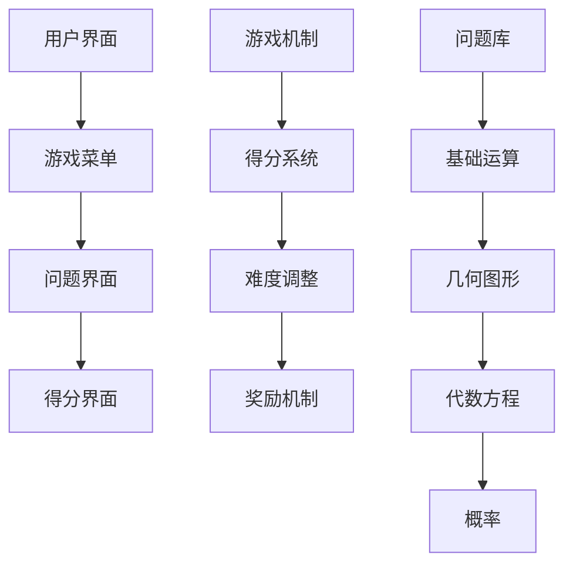

**3. 开发实施：**

```python
# 前端开发伪代码
def create_user_interface():
    # 设计用户界面
    pass

# 后端开发伪代码
def create_backend():
    # 使用Node.js和MongoDB搭建服务器
    pass

# 游戏逻辑伪代码
def create_game_logic():
    # 使用Unity游戏引擎实现游戏逻辑
    pass

# 测试伪代码
def test_game():
    # 进行功能测试、性能测试和用户测试
    pass
```

**4. 用户反馈：**

```python
# 在线调查伪代码
import survey_tool

def collect_user_feedback():
    feedback = survey_tool进行调查()
    return feedback

# 用户测试伪代码
import user_testing_tool

def perform_user_testing():
    feedback = user_testing_tool进行测试()
    return feedback

# 社交媒体互动伪代码
import social_media_tool

def interact_with_users():
    feedback = social_media_tool互动()
    return feedback

# 反馈机制伪代码
def feedback_mechanism():
    feedback = input("请输入你的建议或问题：")
    return feedback
```

**总结：**

通过以上案例，我们可以看到数学游戏的设计与开发过程是一个系统而有序的过程。从需求分析、原型设计、开发实施到用户反馈，每个阶段都有明确的任务和目标。通过这些步骤，开发团队能够创建出既符合教育目标，又具有良好用户体验的数学游戏。

### 第4章 数学游戏设计与开发的心理学分析

数学游戏在成人学习中的影响不仅仅局限于数学知识和技能的传授，它还涉及到学习心理的多个方面。心理学分析揭示了数学游戏如何通过满足成人的心理需求、调节情绪、促进动机，以及增强认知过程，从而提高学习效果。以下是对数学游戏设计与开发中涉及到的心理学概念的详细分析。

#### 4.1 游戏化学习对学习动机的影响

学习动机是影响成人学习效果的关键因素之一。根据自我决定理论（Self-Determination Theory，SDT），学习动机可以分为内在动机和外在动机。内在动机是指个体因内在兴趣、好奇心或成就感而产生的学习动力，而外在动机则是由于外部奖励、压力或期望而产生的学习动力。

**1. 内在动机**

数学游戏通过其趣味性和挑战性，能够有效激发成人的内在动机。游戏中的问题设置和角色设定往往能够吸引成人玩家的注意力，使他们对游戏产生兴趣。此外，游戏中的即时反馈和成就系统也能提供内在奖励，如成就感、自我效能感和自我决定感。这些内在奖励可以增强成人玩家的学习动机，使他们更愿意投入时间和精力去学习。

**2. 外在动机**

尽管内在动机是理想的学习状态，但外在动机在某些情况下也是必要的。数学游戏中的外在动机包括分数、排名、奖励和奖励机制。这些外在奖励可以激励成人玩家克服学习困难，坚持学习。例如，一个设置合理的积分系统可以让成人玩家感受到自己的进步，从而增强他们的学习动力。

**Mermaid 图：**

```mermaid
graph TD
A[内在动机] --> B[兴趣]
B --> C[好奇心]
B --> D[成就感]
E[外在动机] --> F[分数]
F --> G[排名]
F --> H[奖励]
I[J[自我决定感]] --> K[内在动机]
L[M[自我效能感]] --> N[内在动机]
L --> O[外在动机]
```

#### 4.2 游戏化学习对学习焦虑的影响

学习焦虑是成人学习中常见的问题，可能会阻碍他们的学习效果。根据认知行为理论（Cognitive Behavioral Theory，CBT），学习焦虑源于个体对失败的恐惧和对新任务的担忧。数学游戏可以通过以下方式减轻学习焦虑：

**1. 降低认知负荷**

数学游戏通常设计为逐步增加难度，使玩家能够在逐步克服挑战的过程中建立自信心。通过这种方式，游戏降低了认知负荷，使玩家不会因过于困难的问题而产生焦虑。

**2. 提供即时反馈**

即时反馈可以帮助玩家了解自己的学习进度和错误，从而及时调整学习策略。这种即时性减少了焦虑感，因为玩家知道自己可以在失败后迅速得到帮助。

**3. 稳定的成就系统**

稳定的成就系统可以为玩家提供连续的成功体验，从而逐渐降低他们的焦虑感。当玩家在游戏中取得小成就时，他们会产生积极的情绪，这种情绪会逐渐渗透到学习过程中，减轻焦虑。

**Mermaid 图：**

```mermaid
graph TD
A[认知负荷] --> B[降低焦虑]
B --> C[即时反馈]
C --> D[成就系统]
E[学习焦虑] --> F[失败恐惧]
F --> G[新任务担忧]
H[I[自信心]] --> J[降低焦虑]
J --> K[成功体验]
K --> L[积极情绪]
```

#### 4.3 游戏化学习对认知过程的影响

认知过程包括注意、记忆、思考、解决问题等。数学游戏通过设计不同类型的数学问题和挑战，可以促进成人的认知过程：

**1. 注意力**

数学游戏通常要求玩家在短时间内集中注意力，这有助于提高他们的注意力水平和专注能力。通过设置不同难度的问题，游戏可以逐步增加玩家的注意力挑战，从而提高他们的注意广度和稳定性。

**2. 记忆**

数学游戏中的问题设置和场景设计可以增强记忆效果。例如，通过视觉、听觉和互动等多种方式呈现问题，可以激活大脑的不同区域，提高记忆的持久性和准确性。

**3. 思考和解决问题**

数学游戏通过设置各种挑战性问题，鼓励玩家运用逻辑思维和创造性思维来解决问题。这种锻炼可以提高玩家的思维灵活性和解决问题的能力。

**4. 学习迁移**

数学游戏中的问题往往具有实际应用背景，这有助于促进学习迁移，即玩家能够将游戏中学到的数学知识和技能应用到实际生活中。

**Mermaid 图：**

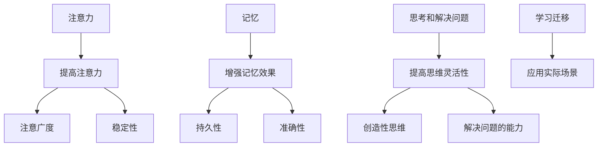

**核心概念与联系：**

通过心理学分析，我们可以看到数学游戏对成人学习动机、学习焦虑和认知过程有多方面的影响。这些影响相互关联，共同构成了数学游戏在成人终身学习中的价值。

- **学习动机**：游戏化学习通过内在动机和外在动机的激发，提高学习兴趣和动力。
- **学习焦虑**：通过降低认知负荷、提供即时反馈和稳定的成就系统，减轻学习焦虑。
- **认知过程**：通过注意力、记忆、思考和解决问题的锻炼，提高认知能力。

通过这些心理学概念的应用，数学游戏能够有效地促进成人终身学习，提高他们的数学素养和综合能力。

### 第5章 数学游戏在成人学习中的挑战与应对策略

#### 5.1 数学游戏在成人学习中的挑战

尽管数学游戏在成人终身学习中具有显著的优势，但在实际应用过程中仍面临诸多挑战。以下是一些主要挑战及其潜在的影响：

**1. 技术门槛**

数学游戏开发通常需要较高的技术门槛，包括游戏引擎的使用、编程语言的掌握、图形处理技术的应用等。这对非技术背景的成人学习者来说可能是一个障碍，他们可能需要花费额外的时间和精力来学习这些技术。

**2. 学习阻力**

成人学习者可能因为工作、家庭或其他个人事务而缺乏足够的空闲时间进行学习。此外，他们对新技术的接受度和使用意愿可能较低，这会影响他们的学习积极性和持续性。

**3. 学习效果评估**

数学游戏虽然能够提供实时反馈，但评估学习效果仍然具有挑战性。尤其是在成人学习者中，如何科学、客观地评估他们的学习成果，确保游戏能够达到预期的教育目标，仍需要进一步研究和探索。

**4. 个性化需求**

成人学习者的学习需求和兴趣各异，如何设计一款能够满足不同学习者个性化需求的数学游戏，是一个重要且复杂的挑战。游戏内容、难度设置、互动方式等都需要根据学习者的具体情况进行调整。

**5. 道德与隐私**

在数学游戏中，尤其是在线环境中，如何保护学习者的隐私和数据安全，避免道德风险，也是需要关注的问题。例如，游戏中的数据分析和使用，需要确保符合相关法律法规和伦理标准。

**Mermaid 图：**

```mermaid
graph TD
A[技术门槛] --> B[学习阻力]
A --> C[学习效果评估]
A --> D[个性化需求]
A --> E[道德与隐私]
B --> F[缺乏时间]
B --> G[技术接受度]
C --> H[评估科学性]
C --> I[教育目标达成]
D --> J[学习需求]
D --> K[兴趣差异]
E --> L[数据安全]
E --> M[道德风险]
```

#### 5.2 应对策略

为了克服这些挑战，提高数学游戏在成人学习中的效果，我们可以采取以下策略：

**1. 降低技术门槛**

- **提供技术支持**：为非技术背景的学习者提供技术支持和教程，帮助他们快速上手游戏开发。
- **简化界面**：设计直观、易于操作的用户界面，减少学习者的技术负担。
- **社区互助**：建立学习社区，鼓励学习者互相帮助，共同解决技术难题。

**2. 提高学习积极性**

- **灵活学习时间**：设计灵活的学习时间安排，允许学习者根据自己的日程安排学习。
- **增强参与感**：通过设置游戏目标、奖励机制和社交互动，提高学习者的参与感和成就感。
- **个性化推荐**：根据学习者的兴趣和进度，提供个性化的学习内容和任务，增加他们的学习动力。

**3. 科学评估学习效果**

- **多元化的评估方法**：采用多种评估方法，如在线测试、项目作业、学习日志等，全面评估学习者的知识掌握情况。
- **定期的反馈和总结**：通过定期反馈和总结，帮助学习者了解自己的学习进度和效果，及时调整学习策略。
- **评估工具**：开发科学、客观的评估工具，如智能评估系统，提高评估的准确性和效率。

**4. 满足个性化需求**

- **定制化内容**：根据学习者的需求，提供定制化的游戏内容和任务，确保每个人都能在适合自己的环境中学习。
- **灵活的难度调整**：提供灵活的难度调整机制，允许学习者自主选择适合自己水平的挑战。
- **学习路径规划**：为学习者提供个性化的学习路径规划，帮助他们系统地掌握数学知识。

**5. 加强道德与隐私保护**

- **合规性审查**：确保游戏设计和数据处理符合相关法律法规和伦理标准。
- **用户隐私保护**：采取严格的数据保护措施，确保学习者的隐私安全。
- **透明化数据使用**：明确告知学习者数据的使用目的和范围，提高他们的信任度和满意度。

**Mermaid 图：**

```mermaid
graph TD
A[提供技术支持] --> B[简化界面]
A --> C[社区互助]
D[灵活学习时间] --> E[增强参与感]
D --> F[个性化推荐]
G[多元化的评估方法] --> H[定期反馈]
G --> I[评估工具]
J[定制化内容] --> K[灵活难度调整]
J --> L[学习路径规划]
M[N[合规性审查]]
M --> O[用户隐私保护]
M --> P[透明化数据使用]
```

通过以上策略，数学游戏在成人学习中的挑战可以得到有效应对，从而提高游戏的学习效果和吸引力，帮助成人学习者实现终身学习目标。

### 第6章 数学游戏在成人学习中的挑战与应对策略

#### 6.1 数学游戏在成人学习中的挑战

尽管数学游戏在成人学习中有许多优势，但在实际应用过程中也面临一系列挑战，这些挑战可能会影响游戏的学习效果。以下是数学游戏在成人学习中的主要挑战及其影响：

**1. 技术挑战**

数学游戏通常需要依赖先进的技术，包括图形处理、编程语言、游戏引擎等。这对于技术背景不足的成人学习者来说可能是一个障碍，他们可能需要花费额外的时间和精力来学习这些技术。

**2. 学习需求的多样化**

成人学习者的背景、兴趣和需求各不相同，这使得设计一款能够满足所有学习者需求的数学游戏具有挑战性。不同学习者可能对游戏的难度、类型和内容有不同的偏好，这需要游戏设计者进行精细的调整。

**3. 学习习惯的养成**

成人学习者可能因为工作、家庭或其他事务而缺乏固定的学习时间，这会影响他们养成规律的学习习惯。此外，成人学习者可能对学习缺乏自律性，这需要游戏设计者提供有效的激励和反馈机制。

**4. 学习效果的评估**

数学游戏虽然能够提供实时反馈，但评估学习效果仍然具有挑战性。如何科学、客观地评估学习者的知识掌握情况，确保游戏能够达到预期的教育目标，仍需要进一步研究和探索。

**5. 道德与隐私问题**

在线数学游戏涉及大量的用户数据，如何保护学习者的隐私和数据安全，避免道德风险，是一个重要的挑战。此外，游戏中的数据分析和使用也需要遵循相关法律法规和伦理标准。

**Mermaid 图：**

```mermaid
graph TD
A[技术挑战] --> B[技术背景不足]
A --> C[学习需求的多样化]
C --> D[不同学习偏好]
C --> E[学习习惯的养成]
E --> F[缺乏固定学习时间]
E --> G[自律性不足]
H[学习效果的评估] --> I[实时反馈]
I --> J[评估科学性]
I --> K[教育目标达成]
L[M[道德与隐私问题]]
M --> N[隐私保护]
M --> O[数据安全]
M --> P[法律法规遵守]
```

#### 6.2 应对策略

为了克服这些挑战，提高数学游戏在成人学习中的效果，我们可以采取以下策略：

**1. 技术支持与培训**

- **提供技术支持**：为非技术背景的学习者提供详细的技术支持文档和视频教程，帮助他们快速掌握游戏所需的技术。
- **培训课程**：开设针对成人学习者的编程和游戏开发培训课程，提高他们的技术能力。

**2. 个性化设计与内容**

- **个性化推荐**：根据学习者的兴趣和进度，提供个性化的游戏内容和任务，确保每个人都能在适合自己的环境中学习。
- **灵活的难度调整**：提供灵活的难度调整机制，允许学习者自主选择适合自己水平的挑战。

**3. 激励与反馈机制**

- **奖励机制**：设计合理的奖励机制，如积分、徽章和虚拟物品，激励学习者持续参与学习。
- **实时反馈**：提供即时、详细的反馈，帮助学习者了解自己的学习进度和效果，及时调整学习策略。

**4. 学习习惯的培养**

- **学习计划**：帮助学习者制定合理的、可行的学习计划，提高他们的自律性。
- **提醒功能**：在游戏中设置提醒功能，如每日任务提醒、进度提醒等，帮助学习者养成规律的学习习惯。

**5. 数据安全与隐私保护**

- **合规性审查**：确保游戏设计和数据处理符合相关法律法规和伦理标准。
- **隐私保护**：采取严格的数据保护措施，确保学习者的隐私安全。
- **透明化数据使用**：明确告知学习者数据的使用目的和范围，提高他们的信任度和满意度。

**Mermaid 图：**

```mermaid
graph TD
A[提供技术支持] --> B[培训课程]
C[个性化设计与内容] --> D[个性化推荐]
C --> E[灵活难度调整]
F[激励与反馈机制] --> G[奖励机制]
F --> H[实时反馈]
I[学习习惯的培养] --> J[学习计划]
I --> K[提醒功能]
L[数据安全与隐私保护] --> M[合规性审查]
L --> N[隐私保护]
L --> O[透明化数据使用]
```

通过以上策略，数学游戏在成人学习中的挑战可以得到有效应对，从而提高游戏的学习效果和吸引力，帮助成人学习者实现终身学习目标。

### 第7章 数学游戏与成人终身学习的未来展望

随着技术的不断进步和成人学习需求的日益增长，数学游戏在成人终身学习中的应用前景十分广阔。未来的发展将体现在教育技术创新、成人学习心理研究等多个方面。

#### 7.1 数学游戏在成人学习中的应用前景

**1. 教育技术创新**

未来，数学游戏将继续与教育技术紧密结合，推动教育模式的创新。以下是一些可能的技术趋势：

- **虚拟现实（VR）和增强现实（AR）**：通过VR和AR技术，数学游戏可以提供更加沉浸式的学习体验，使成人玩家能够在虚拟环境中进行互动和实践。
- **人工智能（AI）**：AI技术将用于个性化学习路径的推荐、智能评估系统的开发等，使数学游戏能够更好地满足成人学习者的个性化需求。
- **大数据分析**：通过对大量用户数据的分析，游戏开发者可以了解学习者的学习行为和效果，从而不断优化游戏内容和设计。

**2. 在线教育与数学游戏的融合**

在线教育平台与数学游戏的结合将为成人学习者提供更加灵活、个性化的学习体验。例如，在线课程中可以嵌入数学游戏作为辅助教学工具，帮助学习者更好地理解和应用数学知识。

**3. 跨学科应用**

数学游戏不仅限于数学学科，还可以应用于其他学科领域，如经济学、物理学等。通过跨学科的游戏设计，可以培养成人的跨学科思维和综合能力。

#### 7.2 成人学习心理研究的进展

**1. 学习动机的研究**

未来，研究者将更深入地探讨不同类型的游戏化学习对成人学习动机的影响，以及如何设计更具吸引力和持久性的游戏机制。

**2. 学习焦虑与压力管理**

随着成人学习负担的加重，如何通过游戏设计减轻学习焦虑和压力将成为研究的重点。研究者将探索通过游戏化学习策略，如正念游戏、放松训练等，来帮助成人学习者缓解压力。

**3. 个性化学习**

个性化学习是成人终身学习的重要方向。未来，研究者将致力于通过心理学理论和技术手段，如行为识别、偏好分析等，为成人学习者提供更加个性化的学习体验。

#### 7.3 数学游戏与成人终身学习的未来发展趋势

**1. 游戏化学习模式的普及**

随着技术的进步和教育观念的转变，游戏化学习模式将在成人终身学习中得到更广泛的普及。数学游戏将成为成人学习的重要组成部分，与在线教育、职业培训等相结合，提供全方位的学习支持。

**2. 学习社区和协作学习**

未来的数学游戏将更加注重社区和协作学习。通过在线社区、论坛、小组讨论等功能，成人学习者可以相互支持、分享经验，提高学习效果。

**3. 道德与隐私保护**

随着数据隐私和道德问题的日益突出，未来的数学游戏将更加注重道德与隐私保护。开发者将严格遵守法律法规，采取严格的数据保护措施，确保学习者的隐私安全。

**Mermaid 图：**

```mermaid
graph TD
A[教育技术创新] --> B[VR和AR技术]
A --> C[AI技术]
A --> D[大数据分析]
E[在线教育与数学游戏的融合] --> F[在线课程结合游戏]
E --> G[跨学科应用]
H[成人学习心理研究进展] --> I[学习动机研究]
I --> J[学习焦虑与压力管理]
I --> K[个性化学习]
L[未来发展趋势] --> M[游戏化学习模式普及]
M --> N[学习社区和协作学习]
M --> O[道德与隐私保护]
```

通过以上展望，我们可以看到数学游戏在成人终身学习中的未来发展充满了机遇和挑战。随着技术的不断进步和心理学研究的深入，数学游戏将继续为成人学习者提供更加有效、有趣和个性化的学习体验，推动终身学习的发展。

### 总结与未来展望

在本文中，我们详细探讨了数学游戏与成人终身学习的关系。从数学游戏的基本原理、设计原则、应用到心理学分析，再到挑战与应对策略，我们揭示了数学游戏如何通过提高学习兴趣、增强思维能力、促进知识应用和激发创新思维，有效促进成人终身学习。

**核心观点：**
1. **数学游戏结合了趣味性和教育性，能够激发成人学习动机。**
2. **数学游戏通过多样化的问题和挑战性任务，提高成人学习者的思维能力和解决问题的能力。**
3. **数学游戏中的问题设置和场景设计有助于知识的应用和创新思维的培养。**
4. **游戏化学习模式在成人教育中具有广泛的应用前景，但需要解决技术、心理和伦理等多方面的挑战。**

**未来展望：**
- **技术进步**：随着VR/AR、AI等技术的不断发展，数学游戏将提供更加沉浸式和个性化的学习体验。
- **心理研究**：进一步的研究将深化对游戏化学习对成人学习动机、焦虑和心理健康的影响。
- **教育创新**：数学游戏将与在线教育、职业培训等结合，为成人学习者提供更灵活、高效的学习途径。
- **道德与隐私**：随着数据隐私和伦理问题的凸显，未来的数学游戏将更加注重道德和隐私保护。

通过不断优化和拓展，数学游戏有望成为成人终身学习的重要工具，为个体发展和社会进步贡献力量。让我们期待数学游戏在未来能够带来更多的创新和突破。

