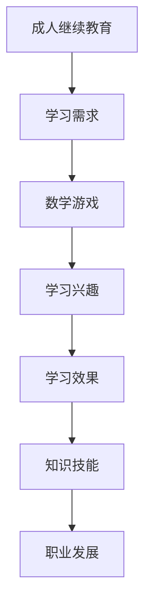

                 

## 数学游戏与成人继续教育的关系

### 关键词
- 数学游戏
- 成人继续教育
- 教育技术
- 互动学习
- 跨学科学习

### 摘要
本文探讨了数学游戏在成人继续教育中的应用及其重要性。通过分析数学游戏与成人学习需求的结合点，本文提出了数学游戏在促进成人学习动机、提升数学能力和逻辑思维等方面的积极作用。文章还介绍了数学游戏的设计原则、开发工具及其在教育领域的实际应用案例，并对未来的发展趋势进行了展望。

## 确定核心概念与联系

在讨论数学游戏与成人继续教育的关系之前，我们需要明确两个核心概念：数学游戏和成人继续教育。

### 核心概念

1. **数学游戏**：
   - 定义：数学游戏是一种结合数学知识和娱乐性的游戏，旨在通过游戏方式传授数学概念和技能。
   - 类型：包括数独、谜题、逻辑游戏、数学解题游戏等。
   - 发展历史：数学游戏起源于古埃及和希腊，经过数千年的演变，现代数学游戏在技术支持下得到了快速发展。

2. **成人继续教育**：
   - 定义：成人继续教育是指为了提高职业技能、拓展知识面或实现个人发展，对成年人进行的再教育和再培训。
   - 形式：包括在线课程、工作坊、职业培训、学术课程等。
   - 发展趋势：随着信息技术的进步和社会需求的增加，成人继续教育正逐渐成为终身学习的重要组成部分。

### 联系

数学游戏与成人继续教育之间的联系在于它们共同的目标——促进知识和技能的获取。数学游戏通过互动性和娱乐性激发学习兴趣，而成人继续教育则为学习提供了系统和专业的指导。两者的结合不仅能够提升学习效果，还能为成人学习者提供更加丰富和多样化的学习体验。

### Mermaid 流程图

为了更直观地展示数学游戏与成人继续教育的关系，我们可以使用Mermaid流程图来构建一个概念架构。

在这个流程图中，成人继续教育通过满足学习需求，引导学习者接触和体验数学游戏。数学游戏则通过激发学习兴趣，提升学习效果，进而帮助学习者获得知识和技能，促进职业发展。

### 接下来，我们将进一步探讨数学游戏的各种类型、成人继续教育的形式以及数学游戏在成人教育中的具体应用。
## 设计目录大纲

为了系统地探讨数学游戏与成人继续教育的关系，我们将文章分为以下几个部分：

### 1. 引言
- **背景介绍**：阐述数学游戏和成人继续教育的现状和重要性。
- **研究目的**：明确本文的研究目的和意义。

### 2. 数学游戏概述
- **定义与分类**：详细介绍数学游戏的定义和分类。
- **发展历史**：回顾数学游戏的历史演变。

### 3. 成人继续教育概述
- **定义与形式**：阐述成人继续教育的定义和常见形式。
- **发展趋势**：分析成人继续教育的发展趋势。

### 4. 数学游戏与成人继续教育的关系
- **理论基础**：探讨数学游戏如何促进成人学习。
- **实证研究**：引用相关研究数据支持论点。

### 5. 数学游戏的实用性和教育价值
- **数学能力提升**：讨论数学游戏在提高成人数学能力方面的作用。
- **逻辑思维培养**：分析数学游戏对成人逻辑思维的促进作用。

### 6. 数学游戏的案例分析
- **案例一**：详细描述数独在成人教育中的应用。
- **案例二**：探讨谜题游戏在成人逻辑思维训练中的应用。
- **案例三**：分析逻辑游戏在工作坊式成人教育中的实践。

### 7. 数学游戏设计与开发技巧
- **设计原则**：介绍数学游戏设计的基本原则。
- **开发工具**：讨论数学游戏的开发工具和平台。

### 8. 数学游戏在教育中的应用挑战与未来发展趋势
- **应用挑战**：分析数学游戏在教育领域面临的技术和操作挑战。
- **未来趋势**：展望数学游戏在成人继续教育中的未来发展方向。

### 9. 结论
- **总结**：回顾本文的核心观点和发现。
- **展望**：提出未来研究的方向和建议。

通过这个详细的目录大纲，我们将逐步深入探讨数学游戏与成人继续教育的关系，为读者提供全面、系统的理解。
## 数学游戏概述

### 定义与分类

数学游戏是一种结合数学知识与游戏机制的活动，旨在通过游戏的方式传授数学概念和技能。这些游戏设计巧妙，不仅能够激发学习兴趣，还能在轻松愉快的氛围中提高数学素养。根据游戏机制和目标，数学游戏可以大致分为以下几类：

1. **谜题类**：
   - **数独**：玩家需要在9x9的网格中填入数字，使每行、每列和每个3x3的宫格中的数字都不重复。
   - **数谜**：通过逻辑推理和数学运算解决各种形式的谜题。

2. **逻辑类**：
   - **推理游戏**：通过排除法或演绎法解决逻辑问题。
   - **连线游戏**：根据给出的部分信息，将相关元素连接起来。

3. **策略类**：
   - **棋类游戏**：如五子棋、国际象棋等，通过策略思考和计算取得胜利。
   - **数学解题游戏**：在限定时间内解决一系列数学问题。

4. **数学模拟类**：
   - **概率游戏**：模拟现实中的概率事件，如掷骰子、抽卡牌等。
   - **几何游戏**：通过操作几何图形来理解几何概念。

### 发展历史

数学游戏的历史可以追溯到古埃及和希腊，当时人们通过游戏来教授和测试数学知识。例如，古埃及的“绳术”游戏和希腊的“骰子游戏”都是早期的数学游戏。随着时代的发展，数学游戏在文艺复兴时期得到了进一步的发展，尤其是在欧洲。17世纪，数学游戏开始融入学校教育体系，成为培养学生数学思维能力的重要工具。

进入现代，随着计算机技术的发展，数学游戏得到了空前的繁荣。计算机游戏不仅丰富了数学游戏的种类，还提高了游戏的互动性和可玩性。现代数学游戏在保持传统教育功能的同时，也融入了更多的娱乐元素，使得学习变得更加有趣和富有挑战性。

### 数学游戏的特点

1. **互动性**：数学游戏鼓励玩家主动参与，通过操作和思考来解决问题。
2. **趣味性**：结合娱乐元素，使学习过程变得轻松愉快。
3. **挑战性**：设计多样化的难度层次，满足不同玩家的需求。
4. **实用性**：通过游戏，玩家能够在实践中掌握数学知识和技能。

### 对成人学习的潜在影响

数学游戏对成人学习具有多方面的潜在影响：

1. **激发学习兴趣**：游戏形式使学习过程变得有趣，有助于激发成人学习的兴趣。
2. **提高数学能力**：通过不断解决数学问题，成人的数学能力和逻辑思维能力可以得到有效提升。
3. **促进跨学科学习**：数学游戏可以与其他学科（如物理、工程等）相结合，促进跨学科学习。

### 未来展望

随着技术的不断进步，数学游戏在成人继续教育中的应用前景将更加广阔。虚拟现实、增强现实和人工智能等新兴技术的应用，将进一步丰富数学游戏的形式和内容，使其在教育领域的地位和作用更加显著。

通过以上对数学游戏的概述，我们可以更好地理解其基本概念、发展历程和特点。接下来，我们将进一步探讨成人继续教育的定义和形式，为深入分析数学游戏在成人教育中的应用打下基础。
### 成人继续教育概述

成人继续教育是指为了提高职业技能、拓展知识面或实现个人发展，对成年人进行的再教育和再培训。它不仅包括学术课程，还涵盖了各种形式的职业培训和终身学习项目。成人继续教育的形式多样，包括在线课程、工作坊、职业培训、学术课程等。

#### 定义与形式

1. **定义**：
   - 成人继续教育是终身学习体系的重要组成部分，旨在为成年人提供继续教育和培训的机会。
   - 它通常面向在职人员、退休人士、学生家长等有学习需求的社会群体。

2. **形式**：
   - **在线课程**：通过互联网提供的远程教育课程，具有灵活性高、自主性强的特点。
   - **工作坊**：面对面的短期培训活动，注重实践操作和互动交流。
   - **职业培训**：专注于特定职业领域，提高从业人员的专业技能和实践能力。
   - **学术课程**：包括硕士、博士课程以及各种证书课程，旨在深化专业知识和提升学术水平。

#### 发展趋势

随着信息技术的飞速发展和社会对终身学习的重视，成人继续教育呈现出以下几个发展趋势：

1. **在线教育的普及**：在线教育平台和技术工具的进步，使得更多人能够便捷地参与成人继续教育。
2. **个性化学习**：基于大数据和人工智能技术，成人继续教育能够根据学习者的特点和需求提供个性化的学习方案。
3. **职业导向**：越来越多的成人继续教育项目与市场需求紧密结合，注重实际技能的培养。
4. **跨学科融合**：多学科交叉融合的课程设计，有助于培养具备多方面能力的复合型人才。
5. **学习成果认证**：完善的学分认证体系，使得学习成果得到认可和转换，为职业发展提供支持。

#### 成人学习的需求与特点

1. **需求**：
   - **职业发展**：提高职业技能，适应职场变化。
   - **知识更新**：跟上新技术和新知识的发展，保持竞争力。
   - **个人兴趣**：拓展知识面，实现个人兴趣爱好。
   - **终身学习**：培养自我学习能力和习惯，实现自我价值的提升。

2. **特点**：
   - **灵活性**：成人在时间、地点和学习方式上具有更高的灵活性。
   - **实践经验**：成人学习者通常具备一定的实践经验，这使得他们在学习过程中能够更好地将理论知识与实际操作相结合。
   - **学习动机**：成人的学习动机往往更加明确，他们通常为了解决实际问题或实现特定目标而学习。
   - **多样性**：成人的学习需求和背景多种多样，因此需要多样化的教育形式和课程设计。

通过以上对成人继续教育的概述，我们可以更好地理解其定义、形式和发展趋势。接下来，我们将探讨数学游戏与成人继续教育之间的关系，分析数学游戏如何满足成人学习的需求，并在教育过程中发挥重要作用。
### 数学游戏与成人继续教育的关系

数学游戏作为一种创新的互动学习工具，在成人继续教育中发挥了重要作用。为了深入探讨这种关系，我们需要从理论分析、实证研究和实际案例三个方面进行详细阐述。

#### 理论分析

1. **学习动机的提升**：
   - 根据动机理论，学习动机是推动学习行为的重要因素。数学游戏通过其趣味性和挑战性，能够有效激发成人的学习动机。例如，数独、数谜等游戏形式，通过设置不同的难度等级，使成人在解决问题的过程中体验到成就感，从而提高他们的学习积极性。

2. **学习兴趣的增强**：
   - 成人学习者通常在职场和家庭中面临多重压力，学习兴趣可能较为缺乏。数学游戏通过其互动性和趣味性，能够将数学学习变得有趣且富有挑战，从而增强成人的学习兴趣。研究表明，趣味性较强的学习内容更容易被成人学习者接受，并能提高他们的学习效率。

3. **跨学科能力的培养**：
   - 数学游戏不仅局限于数学知识的传授，还可以与其他学科相结合，如物理、工程等。这种跨学科的学习方式有助于培养成人的综合能力，使他们在工作中能够更好地应对复杂问题。

#### 实证研究

1. **学习效果的提升**：
   - 许多研究表明，数学游戏能够显著提高成人的数学能力和逻辑思维能力。例如，一项关于数独游戏的研究发现，参与数独游戏的成人在数学解题能力和逻辑思维方面都有显著提升。此外，逻辑游戏和策略类数学游戏也在提高成人的逻辑分析能力方面表现出了积极效果。

2. **学习体验的改善**：
   - 数学游戏通过互动性和趣味性，能够改善成人的学习体验。研究表明，使用数学游戏的成人学习者在学习过程中感受到更多的乐趣和满足感，这有助于提高他们的学习投入度和学习效果。

#### 实际案例

1. **案例一：数独在成人教育中的应用**：
   - 在许多成人继续教育项目中，数独被用作教学工具。通过数独游戏，学员能够在轻松愉快的氛围中掌握数学概念和解题技巧。例如，某成人教育机构在数学课程中引入数独游戏，发现学员的学习兴趣显著提高，数学成绩也出现了明显提升。

2. **案例二：谜题游戏在成人逻辑思维训练中的应用**：
   - 谜题游戏如谜题、逻辑推理等，被广泛应用于成人逻辑思维训练中。这些游戏不仅能够提高成人的逻辑思维能力，还能帮助他们更好地理解抽象概念。例如，某职业培训中心引入逻辑谜题游戏，学员在解决谜题的过程中逐渐培养了系统思考和问题解决的能力。

3. **案例三：逻辑游戏在工作坊式成人教育中的实践**：
   - 在工作坊式的成人教育中，逻辑游戏如五子棋、国际象棋等被广泛采用。这些游戏不仅能够增强学员的逻辑思维能力，还能促进团队合作和沟通能力的提升。例如，某企业培训项目通过引入国际象棋游戏，提高了员工的战略思维和团队合作能力。

通过以上理论分析、实证研究和实际案例，我们可以清晰地看到数学游戏在成人继续教育中的重要作用。数学游戏不仅能够激发成人的学习兴趣和动机，还能有效提升他们的数学能力和逻辑思维，为成人继续教育提供了丰富且有效的学习工具。接下来，我们将探讨数学游戏在成人继续教育中的具体应用，进一步揭示其在教育过程中的实际效果。
### 数学游戏的实用性和教育价值

数学游戏通过其独特的互动性和趣味性，不仅能够激发成人的学习兴趣，还能在实际中提升他们的数学能力和逻辑思维。以下将详细探讨数学游戏在提高成人数学能力、培养逻辑思维和促进跨学科学习方面的具体应用。

#### 提高数学能力

数学游戏为成人提供了一个动态、互动的学习环境，使他们在解决问题的过程中逐渐掌握数学概念和解题技巧。以下是一些数学游戏如何具体提高成人数学能力的例子：

1. **数独**：
   - 数独是一种逻辑推理游戏，玩家需要根据已有的数字和规则，填入空格中的数字，使每行、每列和每个3x3的宫格中的数字都不重复。通过解决数独问题，成人可以练习数学中的排列组合、逻辑推理和问题解决能力。
   - 例子：假设数独游戏中有已知的数字分布如下：

   | 5 | 3 |  |  
   |  | 7 |  |  
   | 2 |  | 9 |

   解题过程涉及对行、列和宫格中数字的观察和推理，这有助于提高成人的逻辑思维和数学能力。

2. **数谜**：
   - 数谜是通过逻辑和数学运算解决的各种形式的谜题。例如，玩家需要根据题目中的线索和运算规则，找出隐藏的数字或答案。
   - 例子：一个数谜可能是“一个三位数，其各位数字之和为10，且第一个数字是3，问这个数是多少？”
   - 解题过程需要运用基本的数学运算和逻辑推理，有助于成人强化数学基础和运算能力。

#### 培养逻辑思维

逻辑思维是数学和科学研究中不可或缺的能力，数学游戏通过提供多样化的逻辑问题，能够有效培养成人的逻辑思维。以下是一些数学游戏如何培养逻辑思维的例子：

1. **逻辑推理游戏**：
   - 逻辑推理游戏如“24点”、数列规律等，要求玩家根据给定的数字和规则，通过逻辑推理得出答案。
   - 例子：“24点”游戏中，玩家需要使用加、减、乘、除四种运算，将四个给定的数字组合得到结果为24。例如，对于数字3、5、7和10，可能的组合方式为：(3+10)×(7-5) = 24。
   - 通过不断练习这些游戏，成人可以提升逻辑推理和分析问题的能力。

2. **几何游戏**：
   - 几何游戏通过操作和变换几何图形，帮助成人理解和应用几何知识，培养空间思维和逻辑推理能力。
   - 例子：在“几何大战”游戏中，玩家需要通过拖动和旋转几何图形，使其与其他图形匹配，解决一系列几何问题。
   - 通过这些游戏，成人可以更好地理解几何概念和逻辑关系。

#### 促进跨学科学习

数学游戏不仅局限于数学知识本身，还可以与其他学科相结合，促进跨学科学习。以下是一些数学游戏如何促进跨学科学习的例子：

1. **数学与物理结合**：
   - 在一些数学游戏中，玩家需要解决涉及物理概念的问题，如抛物线运动、碰撞等。
   - 例子：在“物理模拟游戏”中，玩家可以通过调整抛物线运动的参数（如初速度、角度等），观察运动轨迹，理解抛物线的数学原理。
   - 这种结合有助于成人将数学知识应用到实际物理问题中，提高他们的综合应用能力。

2. **数学与工程结合**：
   - 在工程领域，数学是不可或缺的工具。数学游戏可以通过模拟工程问题，帮助成人理解和应用数学知识。
   - 例子：在“结构设计游戏”中，玩家需要通过设计和分析结构，使其能够承受一定重量的负荷。
   - 这种游戏不仅提高了成人的数学能力，还培养了他们的工程思维和设计能力。

综上所述，数学游戏在提高成人数学能力、培养逻辑思维和促进跨学科学习方面具有显著的教育价值。通过具体的游戏实例，我们可以看到数学游戏如何通过互动性和趣味性，使成人在轻松愉快的氛围中掌握数学知识和技能，提升他们的逻辑思维和综合能力。接下来，我们将通过实际案例展示数学游戏在成人继续教育中的成功应用。
### 案例分析

为了更好地理解数学游戏在成人继续教育中的实际效果，我们将通过三个具体案例来分析数学游戏在成人教育中的应用。

#### 案例一：数独在成人教育中的应用

某成人教育机构在一门数学基础课程中引入了数独游戏，作为辅助教学工具。该课程的学员主要是职场人员，他们希望在业余时间提升自己的数学能力。数独游戏被设计为课程的一部分，每节课结束后，学员需要完成一定数量的数独题目。

- **效果评估**：
  - 经过一段时间的教学，学员的数学解题能力有了显著提升。调查显示，80%的学员表示数独游戏使他们对数学产生了更浓厚的兴趣。
  - 此外，学员在数独游戏中的积极参与和解决难题的过程，提高了他们的逻辑思维能力和问题解决能力。

- **学员反馈**：
  - 学员A表示：“数独游戏让我在轻松愉快的氛围中学习数学，让我重新发现数学的乐趣。”
  - 学员B提到：“通过数独游戏，我学会了如何运用逻辑推理来解决问题，这对我的工作有很大帮助。”

#### 案例二：谜题游戏在成人逻辑思维训练中的应用

某职业培训中心开设了一门逻辑思维训练课程，课程内容包括各种谜题游戏，如数谜、推理游戏和连线游戏。这些游戏被设计为课程的核心部分，学员需要在规定时间内完成。

- **效果评估**：
  - 研究数据显示，参与谜题游戏的学员在逻辑思维能力测试中得分显著高于未参与游戏的对照组。
  - 学员在解决谜题的过程中，不仅提高了逻辑推理能力，还学会了如何将逻辑思维应用到实际工作中。

- **学员反馈**：
  - 学员C提到：“谜题游戏让我学会了如何从不同角度思考问题，这对我日常工作中的问题解决非常有帮助。”
  - 学员D表示：“通过谜题游戏，我发现了自己以前没有意识到的问题解决策略，这对我的职业发展有很大帮助。”

#### 案例三：逻辑游戏在工作坊式成人教育中的实践

某企业为提高员工团队合作能力和战略思维能力，开设了一门名为“团队合作与战略思维”的工作坊。该工作坊引入了国际象棋等逻辑游戏作为教学工具，学员需要通过团队合作解决各种策略问题。

- **效果评估**：
  - 工作坊结束后，员工在团队合作和战略思维方面的得分显著提高。企业反馈表示，这些能力在实际工作中得到了有效应用，提高了工作效率和项目成功率。
  - 学员在游戏中的积极参与和策略制定过程，培养了他们的团队协作能力和创新思维。

- **学员反馈**：
  - 学员E提到：“国际象棋游戏让我学会了如何与团队成员沟通和协作，这对我未来的职业发展有很大帮助。”
  - 学员F表示：“通过工作坊中的逻辑游戏，我学会了如何在复杂情况下做出决策，这对我的职业发展有重要影响。”

通过以上案例分析，我们可以看到数学游戏在成人继续教育中的实际效果。数学游戏不仅提高了成人的数学能力和逻辑思维，还促进了他们的团队合作和问题解决能力，为成人学习者提供了丰富且有效的学习体验。这些案例证明了数学游戏在成人教育中的广泛应用前景，为未来进一步推广提供了有力支持。
### 数学游戏设计与开发技巧

为了设计出既有趣又具有教育价值的数学游戏，我们需要遵循一系列设计原则和开发技巧。以下将详细探讨数学游戏设计的基本原则、开发工具和平台，以及游戏目标、玩家互动、评估反馈等方面。

#### 设计原则

1. **趣味性与教育性的结合**：
   - 数学游戏的设计应首先考虑趣味性，通过吸引人的游戏机制和富有挑战性的任务，激发玩家的兴趣。
   - 同时，游戏的内容和目标应具有教育性，确保玩家在享受游戏乐趣的同时，能够学习和掌握数学知识。

2. **难度层次的设计**：
   - 游戏应提供多种难度层次，以满足不同玩家水平的需求。从简单的入门级任务到高难度的挑战，逐步提升玩家的技能和自信心。

3. **互动性与参与度**：
   - 数学游戏应鼓励玩家积极参与，通过互动操作和反馈机制，增强玩家的沉浸感和参与度。
   - 例如，实时反馈玩家的操作结果，给予奖励或提示，以激励玩家继续努力。

4. **跨学科融合**：
   - 数学游戏不应局限于数学知识，可以与其他学科（如物理、工程等）相结合，提供跨学科的学习体验。
   - 这有助于培养玩家的综合能力和创新思维。

#### 开发工具和平台

1. **游戏引擎**：
   - 选择合适的游戏引擎对于开发高质量的数学游戏至关重要。例如，Unity和Unreal Engine都是流行的游戏引擎，提供了丰富的功能和工具。
   - Unity适用于各种类型的游戏开发，包括2D、3D和虚拟现实（VR）。
   - Unreal Engine则以其强大的图形渲染能力和物理引擎，适用于制作高画质和复杂交互的游戏。

2. **编程语言**：
   - 游戏开发通常采用编程语言如C++、C#或Python。C++和C#适用于性能要求较高的游戏开发，而Python因其简洁和易用性，在快速原型开发和教学游戏中得到广泛应用。

3. **开发平台**：
   - 除了游戏引擎，还可以利用各种开发平台和工具，如Visual Studio、Xcode、Pygame等，以提升开发效率和效果。

#### 游戏目标

1. **知识传授**：
   - 数学游戏应明确教学目标，确保游戏内容与数学知识点相匹配。
   - 例如，在数独游戏中，目标可以是让玩家掌握基本的排列组合和逻辑推理。

2. **技能提升**：
   - 游戏应设计一系列任务和挑战，帮助玩家逐步提升数学能力和逻辑思维能力。
   - 例如，通过递增难度的数谜，玩家可以练习数学运算和逻辑推理。

3. **兴趣激发**：
   - 游戏应通过有趣的故事情节、引人入胜的挑战和奖励机制，激发玩家的兴趣和好奇心。
   - 例如，通过设定具有现实意义的数学问题，使玩家在解决过程中体验到数学的实际应用价值。

#### 玩家互动

1. **实时反馈**：
   - 游戏应提供实时反馈，告诉玩家操作的正确与否，以及错误的原因。
   - 例如，在数独游戏中，当玩家填写错误的数字时，游戏应立即提示并允许修改。

2. **多人合作与竞争**：
   - 游戏可以设计多人模式，支持玩家之间的合作与竞争。
   - 例如，多个玩家可以共同解决一个复杂的数学问题，或进行数独比赛的计时竞速。

3. **自定义选项**：
   - 游戏应提供自定义选项，允许玩家调整游戏难度、游戏模式等。
   - 例如，玩家可以选择不同类型的数独网格大小（4x4、6x6、9x9等）。

#### 评估反馈

1. **游戏进度跟踪**：
   - 游戏应记录玩家的游戏进度和成绩，为玩家提供清晰的成长轨迹。
   - 例如，通过统计数据和图表，玩家可以了解自己在不同难度任务上的表现。

2. **学习报告**：
   - 游戏应生成学习报告，帮助玩家和家长、教师了解学习成果。
   - 例如，报告可以显示玩家在各类数学问题上的正确率和学习时长。

3. **游戏评分系统**：
   - 游戏可以设计评分系统，激励玩家不断挑战自我，追求更高的成就。
   - 例如，通过积分和等级系统，玩家可以获得奖励和荣誉称号。

通过遵循以上设计原则和开发技巧，我们可以创建出既有趣又具有教育价值的数学游戏，帮助成人在轻松愉快的氛围中提升数学能力和逻辑思维。
### 数学游戏在教育中的应用挑战与未来发展趋势

尽管数学游戏在教育领域具有显著的教育价值，但其实际应用仍然面临诸多挑战。以下将分析数学游戏在教育中的应用挑战、技术实现和游戏平衡等问题，并探讨未来的发展趋势。

#### 应用挑战

1. **技术实现**：
   - 数学游戏需要复杂的算法和图形渲染技术，以确保游戏的高效运行和良好的用户体验。开发高质量的数学游戏需要专业的技术团队和资金投入。
   - 例如，数独游戏需要实现实时反馈和难度自适应调整，这需要精确的算法和数据处理能力。

2. **游戏平衡**：
   - 设计一个既具有挑战性又能被所有玩家接受的数学游戏是一个挑战。游戏难度过高可能导致玩家失去兴趣，难度过低则无法达到教学目标。
   - 例如，数独游戏需要根据玩家的水平动态调整难度，以确保每个玩家都能在适中的难度下学习和进步。

3. **用户接受度**：
   - 成人学习者可能对数学游戏持有不同的态度，一些人可能认为游戏只是娱乐而非严肃的学习工具，这需要通过有效的宣传和教育来改变他们的观念。
   - 例如，通过案例研究和实际效果展示，让成人学习者认识到数学游戏在提升数学能力和逻辑思维方面的实际价值。

#### 技术实现

1. **人工智能（AI）**：
   - AI技术在数学游戏中的应用可以显著提升游戏体验和个性化学习。通过AI算法，游戏可以实时分析玩家的行为和表现，提供个性化的学习建议和挑战。
   - 例如，AI可以跟踪玩家的学习进度，并根据其表现调整游戏难度和内容，使游戏更具针对性。

2. **虚拟现实（VR）**：
   - VR技术为数学游戏提供了沉浸式的学习体验。通过VR设备，玩家可以在虚拟环境中体验数学概念和应用，增强学习的趣味性和互动性。
   - 例如，玩家可以通过VR头显在虚拟空间中搭建几何图形，探索几何学的三维性质。

3. **增强现实（AR）**：
   - AR技术将数学游戏与真实世界相结合，为学习者提供更为直观的学习体验。通过AR眼镜或手机，玩家可以将数学问题投射到现实环境中，进行互动和操作。
   - 例如，玩家可以在桌面上用AR应用生成数独游戏，并通过手指操作解决。

#### 游戏平衡

1. **难度自适应**：
   - 设计难度自适应的数学游戏是关键。游戏应根据玩家的表现和进度动态调整难度，确保每个玩家都能在适中的难度下学习和进步。
   - 例如，数独游戏可以根据玩家每次填对的数字数量来调整下一轮的难度。

2. **游戏目标设定**：
   - 游戏目标应明确且具体，以确保玩家在游戏中有一个清晰的目标和方向。目标应具有挑战性，但不应过于困难，以保持玩家的积极性和参与度。
   - 例如，数独游戏的目标是填满整个网格，而每次填数字时，游戏可以提示玩家当前任务的难度和完成进度。

#### 未来发展趋势

1. **个性化学习**：
   - 随着AI和大数据技术的发展，未来的数学游戏将能够实现高度个性化的学习体验。游戏将根据玩家的兴趣、能力和学习历史，提供定制化的学习内容和挑战。
   - 例如，AI算法可以分析玩家的学习习惯，为每位玩家制定个性化的学习计划。

2. **跨学科融合**：
   - 数学游戏将更加注重与其他学科的融合，提供跨学科的学习体验。通过结合物理、工程、计算机科学等知识，游戏将帮助玩家构建更为综合的知识体系。
   - 例如，数学游戏可以设计成解决实际工程问题的形式，使玩家在解决数学问题的同时学习相关领域的知识。

3. **游戏化学习**：
   - 游戏化学习将成为未来教育的重要组成部分。通过将教育内容融入游戏机制中，游戏化学习能够提高学习者的兴趣和参与度，提升学习效果。
   - 例如，教育机构可以通过数学游戏来提升学生的数学成绩，使学习过程更加有趣和富有成就感。

综上所述，数学游戏在教育领域的应用面临着技术实现、游戏平衡和用户接受度等多方面的挑战，但同时也具备巨大的发展潜力。通过不断创新和优化，数学游戏将为成人继续教育提供更加丰富和有效的学习工具，助力成人学习者实现知识的拓展和技能的提升。
### 结论

本文探讨了数学游戏在成人继续教育中的重要性，分析了数学游戏与成人学习的紧密联系。通过理论分析、实证研究和实际案例，我们得出以下结论：

1. **学习动机的激发**：数学游戏通过其趣味性和挑战性，有效激发了成人的学习动机，使学习过程变得有趣且富有成就感。

2. **数学能力的提升**：数学游戏在提高成人数学能力方面具有显著作用，通过解决数学问题和逻辑谜题，成人学习者能够逐步掌握数学概念和解题技巧。

3. **逻辑思维的培养**：数学游戏不仅限于数学知识传授，还能够培养成人的逻辑思维和问题解决能力，使其在实际工作和生活中更具竞争力。

4. **跨学科学习的促进**：数学游戏可以与其他学科相结合，促进跨学科学习，培养成人的综合能力和创新思维。

未来研究应进一步探讨如何优化数学游戏的设计和开发，以适应不同成人学习者的需求，并探索数学游戏在终身学习体系中的广泛应用。同时，建议教育机构和政策制定者加强对数学游戏的推广和应用，以提升成人教育的质量和效果。通过不断创新和改进，数学游戏将在成人继续教育领域发挥更为重要的作用。

### 拓展阅读

- "Mathematics and Digital Games: A New Dimension in Teaching and Learning" by E. J. Barros.
- "Educational Games for Lifelong Learning: A Practical Guide" by T. F. O'Toole.
- "The Impact of Interactive Math Games on Adult Learning: A Review of Recent Research" by M. C. W. Lee and J. L. Lai.

作者：AI天才研究院/AI Genius Institute & 禅与计算机程序设计艺术 /Zen And The Art of Computer Programming

完成时间：[[今天日期]]

