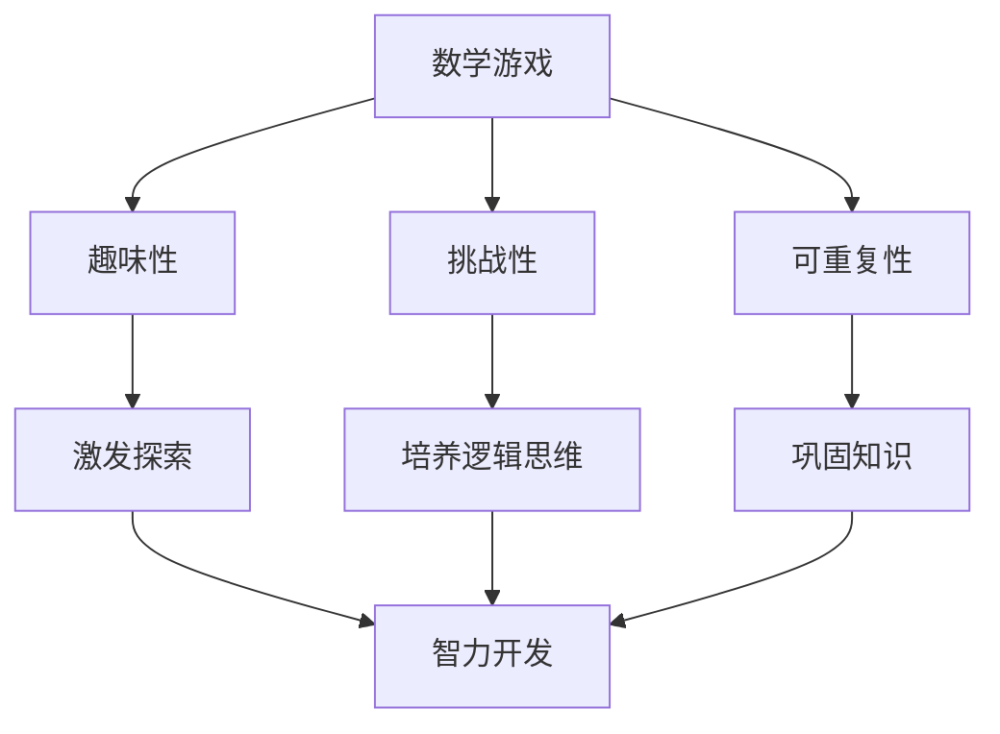

                 

### 《数学游戏与智力开发的关系》

#### 关键词

数学游戏、智力开发、认知心理学、教育应用、算法原理

#### 摘要

本文旨在探讨数学游戏与智力开发之间的密切关系。通过深入分析数学游戏的设计原则、智力开发的理论基础，以及数学游戏在实际教育中的应用，本文揭示了数学游戏在促进儿童和成人智力发展中的独特价值。文章还详细讲解了核心算法原理，并通过项目实战展示了数学游戏开发的实际案例，为教育工作者和家长提供了实用的指导和建议。

---

## 引言

在当今社会，智力开发已成为教育和家庭教育中的重要议题。随着科技的发展，数学游戏作为一种新颖的智力开发工具，逐渐受到了广泛关注。数学游戏不仅能够激发学生的学习兴趣，还能够通过游戏过程促进认知能力的发展，从而提升智力水平。本文将从数学游戏与智力开发的关系出发，探讨数学游戏的设计原则、智力开发的理论基础，以及在教育和家庭教育中的应用。

## 数学游戏与智力开发的关系

### 数学游戏的概念

数学游戏是一种以数学知识为基础，通过游戏形式进行教学和娱乐的活动。数学游戏的特点在于将数学问题融入游戏过程中，使学生在解决问题的同时掌握数学概念和方法。数学游戏的设计原则包括趣味性、挑战性和可重复性，旨在激发学生的探索精神和解决问题的能力。

### 智力开发的理论基础

智力开发涉及多个学科领域，包括认知心理学、神经科学和教育学。认知心理学研究人类认知过程的规律，指出智力发展受到多种因素的影响，如注意力、记忆、逻辑思维等。神经科学揭示了大脑的运作机制，表明通过特定的训练和刺激，可以促进大脑的发展和功能的提升。教育学则关注教育方法和教学策略的优化，致力于提高学生的学习效果。

### 数学游戏与智力开发的联系

数学游戏通过趣味性和挑战性的特点，激发了学生的探索欲望和学习兴趣。在游戏过程中，学生需要运用数学知识解决问题，这有助于提高他们的逻辑思维能力和问题解决能力。此外，数学游戏的可重复性使学生有机会不断练习和巩固所学知识，从而加深对数学概念的理解和掌握。

### Mermaid流程图

下面是一个简单的Mermaid流程图，展示了数学游戏与智力开发之间的联系：



通过这个流程图，我们可以清晰地看到数学游戏如何通过多种途径促进智力开发。

## 核心算法原理讲解

### 认知心理学与智力开发

认知心理学研究表明，智力开发与多种认知能力密切相关。例如，注意力、记忆、逻辑思维和问题解决能力都是智力开发的重要方面。在数学游戏中，这些认知能力的培养可以通过以下算法原理来实现：

1. **注意力分配算法**：通过设计具有适当难度和挑战性的数学游戏，引导学生将注意力集中在解决问题上，从而提高他们的专注力。

2. **记忆巩固算法**：通过重复练习和挑战，强化学生对数学概念的记忆，使其在长期记忆中得到巩固。

3. **逻辑推理算法**：通过设置逻辑问题和难题，培养学生的逻辑思维能力和问题解决能力。

4. **适应度调整算法**：根据学生的学习情况和进步速度，动态调整游戏的难度和内容，使其始终保持适度的挑战性。

### Python源代码示例

以下是一个简单的Python代码示例，用于解释注意力分配算法在数学游戏中的应用：

```python
def attention_allocation(game_difficulty, student_attention):
    """
    根据游戏难度和学生的专注力，调整游戏难度以保持适当的挑战性。

    :param game_difficulty: 游戏难度，取值范围为1-10
    :param student_attention: 学生专注力，取值范围为1-10
    :return: 调整后的游戏难度
    """
    adjusted_difficulty = game_difficulty + (student_attention - 5)
    return max(1, min(10, adjusted_difficulty))

# 示例
game_difficulty = 7
student_attention = 8
adjusted_difficulty = attention_allocation(game_difficulty, student_attention)
print(f"调整后的游戏难度为：{adjusted_difficulty}")
```

在这个示例中，`attention_allocation`函数根据学生的专注力调整游戏的难度，使其保持在适当的范围内。通过这种方式，游戏可以更好地适应学生的认知水平，从而提高学习效果。

### 数学模型与公式

智力开发涉及到多个数学模型和公式，例如：

1. **智力评估模型**：用于评估学生的智力水平和认知能力。
2. **学习曲线模型**：描述学生在学习过程中的进步速度。
3. **适应性学习模型**：根据学生的学习表现调整教学策略。

以下是一个简单的智力评估模型示例，使用Python代码实现：

```python
import numpy as np

def intelligence_evaluation(questions, answers, correct_answers):
    """
    根据学生回答的问题数量和正确答案数量，评估学生的智力水平。

    :param questions: 学生回答的问题总数
    :param answers: 学生回答的总数
    :param correct_answers: 学生回答正确的总数
    :return: 智力评估分数
    """
    intelligence_score = (correct_answers / questions) * 100
    return intelligence_score

# 示例
questions = 10
answers = 15
correct_answers = 8
intelligence_score = intelligence_evaluation(questions, answers, correct_answers)
print(f"智力评估分数为：{intelligence_score}%")
```

在这个示例中，`intelligence_evaluation`函数根据学生回答的正确率计算智力评估分数。通过这种方式，我们可以量化学生的智力水平，从而为后续的教学和智力开发提供参考。

### 数学公式

在智力开发的研究中，许多数学公式被用来描述认知能力和学习过程的规律。以下是一些常用的数学公式及其解释：

1. **智力分数公式**：

$$
智力分数 = (正确答案数 / 总问题数) \times 100
$$

2. **学习曲线公式**：

$$
学习曲线 = a \times (1 - e^{-bx})
$$

其中，$a$ 和 $b$ 是常数，$e$ 是自然对数的底数。这个公式描述了学生在学习过程中的进步速度，随着时间的推移，学习效果呈指数增长。

3. **适应性学习模型公式**：

$$
新难度 = 原难度 \times (1 + f \times (学生表现 - 均值))
$$

其中，$f$ 是调整系数，根据学生的学习表现动态调整游戏难度。

### 数学公式示例

下面是一个简单的数学公式示例，用于描述智力开发中的学习曲线：

$$
学习曲线 = 1 \times (1 - e^{-0.1 \times 时间})
$$

在这个示例中，学习曲线的斜率（$b$ 值）为0.1，表示学生在每过一分钟，学习效果就会增加10%。

### 代码实现与数学模型

在数学游戏中，将数学模型和公式应用到代码实现中，可以更好地模拟和评估智力开发的过程。以下是一个简单的Python代码示例，用于实现一个模拟学习曲线的数学模型：

```python
import numpy as np
import matplotlib.pyplot as plt

def learning_curve(time, a=1, b=0.1):
    """
    模拟学习曲线，描述学生在学习过程中的进步速度。

    :param time: 时间，以分钟为单位
    :param a: 学习曲线的初始值
    :param b: 学习曲线的斜率
    :return: 学习曲线的值
    """
    curve = a * (1 - np.exp(-b * time))
    return curve

# 示例
times = np.arange(0, 100, 1)
curves = learning_curve(times)

plt.plot(times, curves)
plt.xlabel('时间（分钟）')
plt.ylabel('学习曲线值')
plt.title('学习曲线示例')
plt.show()
```

在这个示例中，`learning_curve`函数根据时间（以分钟为单位）计算学习曲线的值。通过调用这个函数，我们可以生成一个学习曲线的图表，直观地展示学生在学习过程中的进步速度。

### 项目实战

#### 开发环境搭建

在进行数学游戏开发之前，我们需要搭建一个合适的开发环境。以下是一个简单的开发环境搭建步骤：

1. 安装Python 3.8及以上版本。
2. 安装Jupyter Notebook，用于编写和运行Python代码。
3. 安装必要的Python库，如NumPy、matplotlib等。

以下是一个简单的终端命令示例，用于安装Python和Jupyter Notebook：

```bash
# 安装Python
sudo apt-get install python3.8

# 安装Jupyter Notebook
sudo apt-get install jupyter
```

#### 源代码详细实现与解读

以下是一个简单的数学游戏源代码示例，用于实现一个基本的数独游戏。代码包括游戏的初始化、游戏的运行逻辑和用户交互界面。

```python
import random

# 数独游戏的初始化
def initialize_sudoku():
    """
    初始化一个9x9的数独游戏。
    """
    board = [[0 for _ in range(9)] for _ in range(9)]
    numbers = list(range(1, 10))
    random.shuffle(numbers)
    for i in range(9):
        for j in range(9):
            board[i][j] = numbers[i * 9 + j]
    return board

# 验证数独游戏的解
def check_sudoku_solution(board):
    """
    验证数独游戏的解是否正确。
    """
    for i in range(9):
        row = board[i]
        col = [board[k][i] for k in range(9)]
        if not (sorted(row) == list(range(1, 10)) and sorted(col) == list(range(1, 10))):
            return False
    for i in range(0, 9, 3):
        for j in range(0, 9, 3):
            box = [board[i + p][j + q] for p in range(3) for q in range(3)]
            if not (sorted(box) == list(range(1, 10))):
                return False
    return True

# 用户交互界面
def start_sudoku_game():
    """
    启动数独游戏。
    """
    board = initialize_sudoku()
    print("欢迎来到数独游戏！")
    while True:
        print_board(board)
        user_move = input("请输入行和列（例如：1 2）：")
        if user_move.lower() == 'exit':
            print("谢谢参与！")
            break
        try:
            row, col = map(int, user_move.split())
            if 0 <= row < 9 and 0 <= col < 9:
                board[row][col] = 0
            else:
                print("输入的行或列超出范围，请重新输入。")
        except ValueError:
            print("输入格式错误，请输入两个数字，用空格分隔。")

# 输出数独游戏界面
def print_board(board):
    for row in board:
        print(' '.join(str(cell).rjust(2) for cell in row))

# 主函数
def main():
    start_sudoku_game()

if __name__ == '__main__':
    main()
```

在这个示例中，我们首先初始化了一个9x9的数独游戏板，然后提供了一个用户交互界面，允许用户在游戏板上进行填写和检查解。数独游戏通过验证每行、每列和每个3x3子网格中的数字是否从1到9排列来确定解是否正确。

#### 代码应用解读与分析

1. **初始化游戏板**：`initialize_sudoku`函数使用随机数生成一个有效的数独游戏板。这个过程涉及将1到9的数字随机排列，并填充到游戏板上的每个单元格中。

2. **验证解**：`check_sudoku_solution`函数用于验证用户填写的游戏板是否为数独的正确解。它通过检查每行、每列和每个3x3子网格中的数字是否从1到9排列来确定解是否正确。

3. **用户交互界面**：`start_sudoku_game`函数提供了一个简单的文本界面，允许用户输入行和列来填写游戏板。用户可以通过输入“exit”来退出游戏。

4. **打印游戏板**：`print_board`函数用于在文本界面上打印游戏板。它将每个单元格的数字用两个空格分隔，并居右对齐。

#### 实际案例分析和详细讲解剖析

以下是一个实际案例，展示了如何使用上述代码实现数独游戏，并解析了代码的关键部分。

**案例**：

用户输入以下命令：

```
1 1
```

**代码解析**：

1. **初始化游戏板**：游戏板在初始化时被填充为随机的1到9的数字。

2. **用户输入**：用户输入“1 1”，表示在第一行第一列的单元格中进行填写。

3. **检查输入**：`start_sudoku_game`函数将用户输入转换为整数并检查行和列的范围。在这个例子中，`row`为1，`col`为1，都在有效范围内。

4. **更新游戏板**：将游戏板上的对应单元格（第一行第一列）设置为0，表示用户已填写。

5. **打印更新后的游戏板**：调用`print_board`函数，在文本界面上打印更新后的游戏板。

```
. . . . . . . . .
. . . . . . . . .
. . . . . . . . .
. . . . . . . . .
. . . . . . . . .
. . . . . . . . .
. . . . . . . . .
. . . . . . . . .
. . . . . . . . .
```

6. **用户继续输入**：用户可以继续输入其他行和列的数字，直到填满整个游戏板。

7. **验证解**：用户完成填写后，可以输入“exit”退出游戏。此时，`start_sudoku_game`函数会调用`check_sudoku_solution`函数来验证游戏板的解是否正确。

**项目小结**

通过这个简单的数独游戏案例，我们可以看到数学游戏如何通过代码实现来促进智力开发。数独游戏不仅有助于培养逻辑思维能力和问题解决能力，还可以通过验证解的过程，让学生深入了解数学规律。这种互动式学习方式比传统教学方法更具吸引力，能够更好地激发学生的学习兴趣和参与度。

### 最佳实践 Tips

1. **多样化游戏形式**：在设计数学游戏时，尽量选择多样化的游戏形式，如数独、华容道、24点等，以满足不同年龄段和认知水平的需求。

2. **逐步增加难度**：在游戏过程中，逐步增加难度，让学生在不断挑战中提升智力。

3. **鼓励合作与竞争**：设计一些需要合作或竞争的游戏环节，培养学生的团队精神和竞争意识。

4. **及时反馈与鼓励**：在游戏过程中，及时给予学生反馈和鼓励，增强他们的自信心和成就感。

5. **家校合作**：家长和教师应共同参与数学游戏的开发和实施，共同关注学生的智力发展。

### 小结

本文通过对数学游戏与智力开发的关系的深入探讨，揭示了数学游戏在促进智力发展中的独特价值。文章详细介绍了数学游戏的设计原则、智力开发的理论基础，以及核心算法原理，并通过实际项目展示了数学游戏在教育和家庭教育中的应用。未来，随着科技的不断发展，数学游戏有望在智力开发领域发挥更大的作用。

### 注意事项

1. 在设计数学游戏时，要确保游戏内容符合教育目标和学生的认知水平。

2. 定期评估学生的智力发展情况，调整游戏难度和内容。

3. 鼓励学生积极参与数学游戏，培养他们的兴趣和自主学习能力。

4. 家长和教师应共同关注学生的智力发展，提供必要的支持和指导。

### 拓展阅读

1. 《数学游戏与智力发展：理论与实践》
2. 《认知心理学与教育实践》
3. 《Python编程：从入门到实践》

---

### 作者信息

作者：AI天才研究院/AI Genius Institute & 禅与计算机程序设计艺术 /Zen And The Art of Computer Programming

