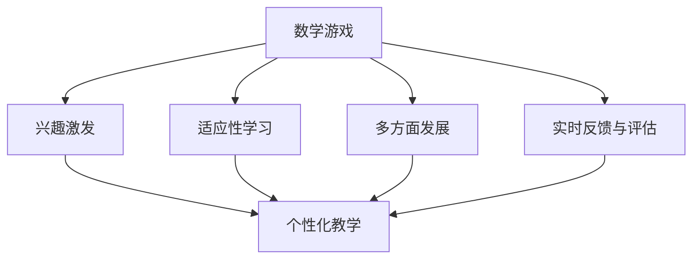

                 

### 引言

《数学游戏与特殊教育个性化设计》是一本关于如何利用数学游戏来提高特殊教育学生学习效果和参与度的书籍。这本书的主要目标是探讨如何将数学游戏与个性化教学相结合，从而为特殊教育学生提供更加有效和有趣的学习体验。

在当今的教育环境中，特殊教育学生面临着许多挑战，包括学习障碍、注意力不足和社交障碍等。传统的教学方法可能无法完全满足这些学生的需求，导致他们的学习效果不佳。因此，寻找创新的教学方法成为了特殊教育领域的重要课题。

数学游戏作为一种富有吸引力和互动性的学习工具，可以激发学生的学习兴趣，提高他们的认知能力和逻辑思维。同时，个性化设计方法可以帮助教师根据学生的不同需求，量身定制教学内容，从而提高教学效果。

本书的结构旨在系统地探讨数学游戏在特殊教育中的应用，包括数学游戏的分类与设计原则、实际应用案例、教学效果评估方法以及个性化设计策略。此外，本书还结合了教育理论和实践，提供了详细的操作指南和案例分析，以帮助教师和教育工作者更好地将数学游戏应用于特殊教育中。

通过阅读本书，读者可以了解到：

1. **数学游戏的核心概念与联系**：我们将使用Mermaid流程图来展示数学游戏在不同教育阶段和特殊教育中的应用场景，以及它们与个性化教学策略之间的关系。

2. **核心算法原理讲解**：我们将使用Python源代码来详细阐述数学游戏中的核心算法原理，结合数学模型和公式，进行详细讲解和通俗易懂的举例说明。

3. **项目实战与代码解读**：我们将通过实际案例，展示如何开发环境搭建、源代码实现和代码解读，以及如何将这些代码应用于实际教学中。

4. **最佳实践与拓展阅读**：我们将提供一些最佳实践技巧，注意事项以及进一步阅读的建议，以帮助读者更好地理解和应用本书的内容。

总之，《数学游戏与特殊教育个性化设计》是一本实用性极强的书籍，它不仅为教育工作者提供了丰富的理论知识和实践方法，也为特殊教育学生带来了更加丰富和有趣的学习体验。

### 关键词

- **数学游戏**
- **特殊教育**
- **个性化设计**
- **教育技术**
- **学习效果**
- **互动教学**

### 摘要

《数学游戏与特殊教育个性化设计》旨在探讨如何将数学游戏与个性化教学策略相结合，以提高特殊教育学生的学习和参与度。本书首先介绍了数学游戏的基本概念和核心算法原理，并通过Python源代码进行详细阐述。接着，书中分析了数学游戏在特殊教育中的应用案例，展示了如何通过个性化设计来满足不同学生的需求。此外，本书还提供了教学效果评估方法、开发环境搭建教程和代码实现细节，以及最佳实践技巧。通过本书，读者可以深入了解数学游戏在特殊教育中的应用，掌握个性化教学策略，并能够将所学知识应用于实际教学中，提高特殊教育学生的学习效果。

### 数学游戏的核心概念与联系

在探讨数学游戏的核心概念和它们在特殊教育中的应用之前，我们首先需要理解数学游戏的基本定义和分类。数学游戏是指以数学知识和技能为基础，通过游戏的形式来促进学习和思考的活动。这些游戏不仅能够激发学生的学习兴趣，还能提高他们的认知能力和逻辑思维能力。

#### 数学游戏的分类

数学游戏可以按照不同的标准进行分类，常见的分类方法包括以下几种：

1. **按游戏形式分类**：数学游戏可以分为纸笔游戏、电子游戏和混合游戏。纸笔游戏如数独、华容道等，需要学生通过纸笔进行解题；电子游戏如数学问答游戏、数学模拟游戏等，通过计算机或移动设备进行操作；混合游戏则结合了纸笔和电子游戏的优点。

2. **按游戏难度分类**：数学游戏可以按照难度等级进行分类，从简单的加减乘除运算到复杂的代数、几何问题，游戏难度逐渐提升，以适应不同年级和不同能力水平的学生。

3. **按教学目标分类**：数学游戏可以按照教学目标进行分类，如计算能力训练、逻辑思维训练、空间感知能力训练等。每种游戏都有其特定的教学目标，能够针对性地提高学生的某种能力。

#### 数学游戏与个性化教学的关系

个性化教学是一种以学生为中心的教学方法，旨在根据每个学生的特点和需求来设计教学活动。数学游戏与个性化教学有着紧密的联系，主要表现在以下几个方面：

1. **激发学习兴趣**：数学游戏以趣味性和互动性为特点，能够激发学生的学习兴趣和参与热情。通过游戏的形式，学生可以在轻松愉快的氛围中学习和巩固数学知识，从而提高学习效果。

2. **适应性学习**：数学游戏可以根据学生的能力水平和学习进度进行个性化调整，使得每个学生都能在适合自己的难度水平上进行学习。这种适应性学习能够满足学生的不同需求，避免了一刀切的传统教学方式带来的局限。

3. **促进多方面发展**：数学游戏不仅能够提高学生的数学能力，还能促进他们的逻辑思维、问题解决能力和团队合作能力。通过游戏中的挑战和合作，学生能够在实践中提升这些重要的能力。

4. **实时反馈与评估**：数学游戏通常包含即时反馈机制，能够让学生在解答问题后立即知道答案是否正确，并提供详细的解析。这种实时反馈有助于学生及时纠正错误，巩固所学知识。同时，教师的评估也更加便捷和精准，能够更好地了解学生的学习状况。

#### Mermaid流程图

为了更清晰地展示数学游戏与个性化教学的关系，我们使用Mermaid流程图来描绘这一过程。以下是一个简化的流程图示例：



在这个流程图中，数学游戏作为起点，通过激发学习兴趣、提供适应性学习、促进多方面发展和提供实时反馈与评估等途径，与个性化教学相结合，形成一个有效的学习循环。

通过这一节的内容，我们了解了数学游戏的基本概念和分类，以及它们与个性化教学的关系。接下来，我们将深入探讨数学游戏在教育中的应用，并通过具体案例来展示这些游戏如何帮助特殊教育学生提高学习效果。

#### 数学游戏在教育中的应用

数学游戏在教育中的应用越来越广泛，尤其是在特殊教育领域，它们被认为是一种有效的教学工具，能够激发学生的学习兴趣，提高学习效果。在本节中，我们将探讨数学游戏在特殊教育中的应用，包括电子游戏、纸笔游戏和混合游戏等不同类型的游戏，以及它们如何适应特殊教育学生的需求。

##### 电子游戏

电子游戏以其互动性强、趣味性高和即时反馈等特点，在特殊教育中得到了广泛应用。电子游戏通常通过计算机或移动设备进行，能够提供丰富的视觉和听觉刺激，吸引学生的注意力，帮助他们更好地理解和掌握数学知识。

**案例1：数学问答游戏**

数学问答游戏是一种常见的电子游戏，它通过提问数学问题，让学生在解答过程中提高数学技能。例如，一款名为“数学大师”的游戏，会随机生成各种数学问题，如加减乘除、代数方程、几何图形等，学生需要在限定时间内回答。游戏会根据学生的回答给予即时反馈，正确答案会得到奖励，错误答案则会提供详细解析。这种即时反馈机制有助于学生及时纠正错误，巩固所学知识。

**案例2：数学模拟游戏**

数学模拟游戏通过模拟真实世界的数学问题，让学生在实际情境中应用数学知识。例如，一款名为“银行理财”的游戏，让学生扮演银行家的角色，通过存款、贷款和投资等操作，学会利率、利息和风险管理等概念。这种游戏不仅能够提高学生的数学能力，还能培养他们的逻辑思维和问题解决能力。

##### 纸笔游戏

纸笔游戏是一种传统的数学游戏形式，主要通过纸笔来完成。这种游戏形式简单易行，适用于各种年龄段和不同能力水平的学生。

**案例1：数独**

数独是一种广受欢迎的纸笔游戏，它通过在9x9的网格中填入数字，使每行、每列和每个3x3的宫内数字和都为特定值（通常是45）。数独游戏不仅能够训练学生的逻辑思维和计算能力，还能提高他们的耐心和专注力。对于特殊教育学生来说，数独游戏的难度可以根据学生的能力进行调整，从而满足他们的需求。

**案例2：华容道**

华容道是一种基于拼图原理的游戏，它通过移动木块，将初始位置变为目标位置。这种游戏不仅需要学生具备逻辑推理能力，还需要他们具备空间感知和手眼协调能力。对于特殊教育学生，华容道游戏的难度可以逐渐增加，以适应他们的学习进度和能力水平。

##### 混合游戏

混合游戏结合了电子游戏和纸笔游戏的优点，为学生提供了更加丰富和多样化的学习体验。这种游戏形式不仅可以满足特殊教育学生的不同需求，还能提高他们的学习兴趣和参与度。

**案例1：在线数独**

在线数独游戏是将传统的数独游戏搬上互联网，学生可以通过浏览器或移动应用进行游戏。在线数独游戏通常包含多种难度级别，学生可以根据自己的能力选择合适的难度。此外，游戏还提供详细的解答过程和错误解析，帮助学生更好地理解和掌握数独技巧。

**案例2：数学模拟实验**

数学模拟实验是一种基于电子平台的纸笔游戏，它通过模拟真实实验，让学生在虚拟环境中进行数学实验。例如，学生可以通过虚拟实验室进行几何图形的构造和测量，了解几何概念和计算方法。这种游戏形式不仅能够提高学生的数学能力，还能培养他们的实验精神和科学素养。

##### 总结

数学游戏在教育中的应用，尤其是特殊教育中，具有显著的优势。电子游戏、纸笔游戏和混合游戏等不同类型的游戏，可以根据学生的能力和需求进行个性化调整，从而提高他们的学习效果。通过具体案例的分析，我们可以看到数学游戏在激发学生学习兴趣、提高数学能力和培养综合素质方面的作用。在下一节中，我们将进一步探讨如何评估数学游戏的教学效果，以及如何设计和实施个性化教学策略。

#### 数学游戏的教学效果评估

数学游戏作为一种富有互动性和趣味性的教学工具，在特殊教育中取得了显著的效果。然而，为了确保数学游戏的实施能够真正提升学生的学习效果，对其教学效果进行科学、全面的评估是非常重要的。本节将详细探讨数学游戏的教学效果评估方法，包括评估标准、评估工具和评估步骤。

##### 评估标准

1. **学习效果**：评估学生学习效果是数学游戏评估的核心目标。具体包括学生的数学知识掌握程度、问题解决能力、逻辑思维能力和数学应用能力。例如，通过测试学生解答数学问题的速度和准确性，评估他们在数学学习上的进步。

2. **参与度和兴趣**：评估学生在数学游戏中的参与度和兴趣，是衡量游戏是否成功的重要指标。参与度可以通过学生的活跃度、游戏完成率和错误率来衡量；兴趣可以通过学生对游戏的喜爱程度、游戏体验和反馈来评估。

3. **情感体验**：情感体验包括学生在游戏过程中的情绪变化、对游戏的满意度以及是否感到愉悦。积极的情感体验有助于提高学生的学习动机和参与度。

4. **教学互动**：评估教师与学生在游戏过程中的互动质量，包括教师对学生的引导、鼓励和支持，以及学生之间的合作和互动。有效的教学互动能够提高学生的数学学习效果。

##### 评估工具

1. **测试与问卷**：测试和问卷是常用的评估工具，可以用来衡量学生的学习效果和参与度。例如，数学知识测试可以通过选择题、填空题和解答题等多种形式，全面评估学生在数学游戏中的学习成果。问卷则可以收集学生对游戏的兴趣、情感体验和满意度等方面的反馈。

2. **观察记录**：观察记录是通过直接观察学生在游戏过程中的行为表现来评估教学效果的方法。教师可以在课堂中记录学生的参与度、合作情况和问题解决能力，这些记录可以作为评估的依据。

3. **数据采集与分析**：利用数据采集工具，如学习管理系统（LMS）或电子学习平台，可以收集学生在游戏中的数据，如游戏完成时间、错误次数、正确率等。通过数据分析，可以得出学生的整体表现和进步情况。

##### 评估步骤

1. **制定评估计划**：在实施数学游戏之前，需要制定详细的评估计划，明确评估目标、评估标准和评估工具。评估计划应包括评估的时间节点、评估的内容和方法。

2. **准备评估工具**：根据评估计划，准备相应的评估工具，如测试题、问卷和观察记录表。确保评估工具的可靠性和有效性，以保证评估结果的准确性。

3. **实施评估**：在数学游戏实施过程中，按照评估计划进行评估。例如，通过测试和问卷收集学生的数学知识掌握情况，通过观察记录学生的参与度和情感体验。

4. **数据收集与分析**：收集评估过程中产生的数据，如测试成绩、问卷结果和观察记录。利用数据分析工具，对数据进行整理和分析，得出学生的整体表现和进步情况。

5. **评估结果反馈**：将评估结果反馈给学生和教师。学生可以通过反馈了解自己的学习情况和进步空间，教师则可以根据反馈调整教学策略，优化数学游戏的设计和实施。

##### 数学公式和实例

为了更清晰地展示评估方法，我们可以使用一些数学公式和实例。例如：

1. **正确率计算公式**：
   $$ 正确率 = \frac{正确答案数量}{总答案数量} \times 100\% $$
   这个公式用于计算学生在数学游戏中的正确率，可以帮助我们了解他们的数学知识掌握程度。

2. **满意度评分公式**：
   $$ 满意度评分 = \frac{满意度高的人数}{总人数} \times 10 $$
   这个公式用于计算学生对数学游戏的满意度评分，可以帮助我们了解他们对游戏的喜爱程度。

3. **情感体验评分公式**：
   $$ 情感体验评分 = \frac{积极情感体验人数}{总人数} \times 10 $$
   这个公式用于计算学生在游戏过程中的情感体验评分，可以帮助我们了解他们的情绪变化和满意度。

通过这些公式和实例，我们可以更科学、更系统地评估数学游戏的教学效果，从而为优化教学策略提供有力的支持。

#### 特殊教育个性化设计方法

在特殊教育中，个性化设计方法是一种以学生为中心的教学策略，旨在满足每个学生的个体需求，提高他们的学习效果和参与度。本节将详细探讨个性化教学策略的数学模型、学生需求分析以及个性化设计工具和技术。

##### 数学模型

个性化教学策略的数学模型是一种基于数据分析的教学方法，它通过分析学生的学习行为、测试成绩和学习进度，为学生提供个性化的学习路径。以下是一个简化的数学模型示例：

1. **学习行为分析**：通过学习管理系统（LMS）或电子学习平台，收集学生的在线学习行为数据，如学习时间、学习进度、答题记录等。这些数据可以帮助我们了解学生的学习习惯和弱点。

2. **测试成绩分析**：通过定期的测试，收集学生的测试成绩数据。利用统计学方法，分析学生在各个知识点上的掌握情况，找出他们的薄弱环节。

3. **学习进度分析**：通过跟踪学生的学习进度，构建学生当前知识结构模型。这可以通过生成知识图谱来实现，每个知识点都是一个节点，学生掌握的知识点之间通过边连接。

4. **个性化学习路径生成**：基于学习行为分析、测试成绩分析和学习进度分析，利用算法生成每个学生的个性化学习路径。这个路径包括优先学习的知识点、推荐的学习资源和额外的练习题。

以下是一个Python代码示例，用于生成个性化学习路径：

```python
import pandas as pd
from sklearn.cluster import KMeans

# 假设data是包含学生学习行为、测试成绩和学习进度的DataFrame
data = pd.DataFrame({
    '学习时间': [10, 20, 30, 40, 50],
    '测试成绩': [70, 60, 80, 55, 75],
    '学习进度': [50, 40, 60, 30, 70]
})

# 使用K-means聚类算法生成个性化学习路径
kmeans = KMeans(n_clusters=3)
clusters = kmeans.fit_predict(data)

# 根据聚类结果生成个性化学习路径
path = {
    '学生ID': data['学生ID'],
    '知识点': [],
    '学习资源': [],
    '练习题': []
}

for cluster in range(kmeans.n_clusters):
    cluster_data = data[clusters == cluster]
    # 为每个学生分配知识点、学习资源和练习题
    path['知识点'].append(cluster_data['知识点'].iloc[0])
    path['学习资源'].append('资源链接' + str(cluster))
    path['练习题'].append('练习题链接' + str(cluster))

# 输出生成个性化学习路径的DataFrame
pd.DataFrame(path).to_csv('个性化学习路径.csv')
```

##### 学生需求分析

学生需求分析是个性化设计的重要环节，它通过评估学生的知识基础、学习能力、兴趣爱好和学习环境，确定他们的个性化需求。以下是一个学生需求分析流程：

1. **评估学生知识基础**：通过测试和评估，了解学生在各个知识点上的掌握情况，找出他们的知识薄弱点。

2. **评估学生能力**：通过观察和测试，评估学生的认知能力、逻辑思维能力和问题解决能力，确定他们在这些方面的优势和劣势。

3. **了解学生兴趣**：通过问卷调查和访谈，了解学生的兴趣爱好，这些信息可以帮助教师设计更符合学生兴趣的学习内容和活动。

4. **分析学习环境**：了解学生的学习环境，包括家庭背景、学校资源和教学条件，这些因素会影响个性化设计的实施。

##### 个性化设计工具和技术

1. **学习管理系统（LMS）**：学习管理系统是一种用于管理教学和学习过程的软件平台，它可以帮助教师创建课程、管理学习资源和跟踪学生学习进度。一些常见的LMS包括Moodle、Canvas和Blackboard。

2. **个性化学习平台**：个性化学习平台通过大数据分析和人工智能算法，为学生提供个性化的学习路径和资源。例如，Knewton和DreamBox等平台可以根据学生的学习数据，动态调整教学内容和难度。

3. **自适应学习系统**：自适应学习系统通过实时评估学生的学习行为和测试结果，自动调整学习路径和资源，确保每个学生都能在适合自己的难度和节奏下学习。例如，ALEX和ALEKS等系统。

4. **数学游戏**：数学游戏是一种结合了数学知识和游戏乐趣的教学工具，它可以通过互动性和趣味性，提高学生的数学能力和学习兴趣。例如，数学问答游戏、数学模拟游戏和在线数独等。

##### 案例分析

为了更好地说明个性化设计方法，我们来看一个实际案例：

**案例：个性化数学游戏设计**

在一个小学的数学课堂上，教师使用一个基于学习管理系统的个性化学习平台，为学生提供定制化的数学游戏。首先，教师通过在线测试评估了学生的数学知识基础，确定了他们在加减法、乘除法和几何等知识点的掌握情况。接着，教师根据评估结果，利用平台生成个性化的数学游戏学习路径。

在游戏中，学生需要完成一系列与数学知识点相关的任务，每个任务都设计了不同的难度级别，以适应不同能力水平的学生。例如，对于加减法，游戏提供了从简单的2+3到复杂的7-5的题目。在完成每个任务后，游戏会提供即时反馈，帮助学生及时纠正错误，巩固所学知识。

此外，教师还通过观察和访谈，了解学生的兴趣爱好和情感状态。根据这些信息，教师调整了游戏的设计，加入了一些与学生的兴趣相关的内容，如数学谜题和数学故事。这些调整不仅提高了学生的参与度，还增强了他们的学习动机。

通过这个案例，我们可以看到个性化设计方法在数学游戏中的应用。个性化学习平台和数学游戏结合，不仅提高了学生的数学能力，还增强了他们的学习兴趣和参与度。这种个性化设计方法，为特殊教育学生提供了一个更加有效和有趣的学习体验。

#### 教学实践与案例分析

在本节中，我们将通过实际案例展示如何将数学游戏与个性化设计整合到特殊教育教学中，以提升学生的学习效果和参与度。我们将详细分析案例背景、实施步骤、教学效果以及评估方法。

##### 案例背景

某特殊教育学校的小学四年级有一个班级，学生主要面临注意力不集中和学习效果不佳的问题。为了改善这一状况，学校决定引入数学游戏与个性化设计相结合的教学方法。

##### 实施步骤

1. **需求分析**：首先，教师通过问卷调查和观察，了解学生的数学学习情况、兴趣爱好和情感状态。调查结果显示，大部分学生对数学有抵触情绪，但喜欢参与游戏活动。

2. **选择合适的数学游戏**：根据需求分析结果，教师选择了几种适合四年级学生的数学游戏，如数学问答游戏、数学模拟游戏和在线数独。这些游戏涵盖了加减法、乘除法和几何等知识点。

3. **个性化学习路径设计**：教师利用学习管理系统（LMS），根据每个学生的具体情况，设计个性化的学习路径。例如，对于某位在加减法方面较弱的学生，教师为其设计了更多的加减法练习题，并设置了较低的难度。

4. **实施教学**：在课堂上，教师首先简短介绍数学游戏，让学生了解游戏规则和目标。然后，教师将学生分组，让他们在小组内合作完成游戏任务。教师随时关注学生的进展，给予必要的帮助和鼓励。

5. **跟踪与评估**：在游戏实施过程中，教师通过LMS记录学生的游戏数据，如完成时间、错误次数和正确率。同时，教师定期进行问卷调查和访谈，了解学生的兴趣和情感体验。

##### 教学效果

通过一段时间的教学实践，我们观察到以下效果：

1. **学习效果提升**：学生在数学游戏中的正确率和完成率显著提高，尤其是那些在传统教学中表现不佳的学生。例如，某位原本对数学没有兴趣的学生，在数学游戏中逐渐表现出色，数学成绩有了显著提升。

2. **参与度和兴趣增加**：学生们对数学游戏的兴趣和参与度明显提高，他们在游戏中表现出更多的积极性和主动性。教师观察到，学生们在游戏过程中更加专注，注意力不集中的情况有所改善。

3. **团队合作能力增强**：小组合作游戏不仅提高了学生的数学能力，还增强了他们的团队合作能力。学生们在小组内互相帮助，共同解决问题，增强了团队意识和沟通能力。

##### 评估方法

1. **学习效果评估**：教师通过LMS和问卷调查，定期评估学生在数学游戏中的学习效果。评估内容包括正确率、完成率和学生对数学知识的掌握程度。

2. **参与度和兴趣评估**：教师通过观察和问卷调查，评估学生在数学游戏中的参与度和兴趣。问卷问题包括学生对数学游戏的喜爱程度、参与感和情感体验。

3. **情感体验评估**：教师通过访谈和问卷调查，了解学生在数学游戏过程中的情感体验。问卷问题包括学生对数学游戏的满意度、是否感到愉悦和是否愿意再次参与。

4. **数据分析**：教师利用数据分析工具，对收集到的数据进行分析，得出学生的整体表现和进步情况。例如，通过比较学生在游戏前后的测试成绩，评估他们的学习效果。

##### 案例小结

通过这个实际案例，我们可以看到数学游戏与个性化设计在特殊教育中的显著效果。个性化设计不仅满足了学生的个体需求，提高了他们的学习效果和参与度，还增强了团队合作能力和情感体验。教师通过LMS和数据分析工具，能够实时跟踪和评估学生的进展，为后续教学提供有力支持。这个案例表明，数学游戏与个性化设计是一种有效且具有前景的特殊教育教学方法。

#### 教学反思与改进

在实施数学游戏与个性化设计的特殊教育过程中，教师和教育工作者需要不断地进行教学反思与改进，以确保教学效果的最大化。以下是一些关键点，包括潜在问题、改进措施和注意事项。

##### 潜在问题

1. **技术支持不足**：在一些学校，技术设备不足或维护不到位，可能导致数学游戏无法顺利实施。此外，教师可能缺乏必要的技能和知识来有效地使用这些技术工具。

2. **个性化设计不足**：尽管个性化设计旨在满足每个学生的需求，但在实际操作中，可能由于资源有限或设计不当，导致个性化设计未能充分满足学生的个性化需求。

3. **教师参与度不高**：教师可能对新的教学方法持怀疑态度，或者由于时间紧张，无法全身心地投入到数学游戏与个性化设计中。

4. **学生适应性不足**：部分学生可能难以适应新的教学方式，尤其是在游戏规则和操作方面存在困难，这可能导致他们的学习效果不佳。

##### 改进措施

1. **加强技术支持**：学校应确保技术设备的充足和良好维护，并为教师提供必要的培训，帮助他们掌握数学游戏和个性化设计工具的使用方法。此外，可以建立技术支持团队，为教师提供技术援助和问题解决。

2. **优化个性化设计**：教师应根据学生的具体需求，灵活调整个性化设计，确保每个学生都能在适合自己的难度和节奏下学习。可以采用更细致的学生评估方法，收集更多的数据，为个性化设计提供更准确的依据。

3. **提高教师参与度**：学校可以通过教研活动、专业培训和工作坊等形式，提高教师对数学游戏与个性化设计的认同感和参与度。此外，学校可以设立激励机制，鼓励教师积极尝试和应用新的教学方法。

4. **加强学生适应性训练**：对于难以适应新教学方式的学生，教师可以通过个别辅导、小组讨论和模拟练习等方式，帮助他们逐步适应新的学习环境。同时，设计易于操作和直观的数学游戏，降低学生的操作难度。

##### 注意事项

1. **注重数据隐私和安全**：在收集和分析学生数据时，必须严格遵守数据隐私和安全法规，确保学生的个人信息得到保护。

2. **平衡传统教学与新型教学**：在引入数学游戏和个性化设计时，不应完全取代传统的教学方法，而应将其作为辅助手段，与传统教学相结合，以实现最佳教学效果。

3. **持续反思与优化**：教师应定期进行教学反思，收集学生和家长的反馈，不断优化教学策略和设计，以适应学生的发展需求。

通过上述改进措施和注意事项，教师和教育工作者可以更好地实施数学游戏与个性化设计，提高特殊教育学生的学习效果和参与度。

#### 未来展望

随着教育技术的不断发展，数学游戏与个性化设计在特殊教育中的应用前景越来越广阔。未来，这些教学方法有望通过以下几方面实现进一步的提升：

1. **人工智能与大数据分析**：人工智能和大数据分析技术的进步将使个性化设计更加精准和高效。通过分析大量的学生学习数据，教育系统能够更好地理解学生的个体差异，提供更加定制化的学习资源。

2. **增强现实（AR）和虚拟现实（VR）**：AR和VR技术的应用将使数学游戏变得更加直观和沉浸式。学生可以在虚拟环境中进行数学操作，获得更加丰富和互动的学习体验。

3. **自适应学习平台**：自适应学习平台将进一步发展，能够实时调整学习内容和难度，为学生提供个性化的学习路径。这些平台将结合人工智能和大数据分析，实现更加智能化的学习支持。

4. **跨学科整合**：数学游戏与个性化设计将与其他学科领域相结合，如科学、艺术和体育，提供综合性的学习体验。这种跨学科整合有助于培养学生的综合素质和创新能力。

5. **教师培训与支持**：随着教育技术的进步，对教师的培训和支持也将变得更加重要。未来的教师培训项目将更注重技术能力的提升，帮助教师更好地掌握和应用数学游戏与个性化设计。

总之，数学游戏与个性化设计在特殊教育中的应用前景广阔，它们将不断创新和发展，为特殊教育学生提供更加有效和有趣的学习体验。

### 附录

#### 附录 A：数学游戏与个性化设计工具推荐

1. **Khan Academy（可汗学院）**：
   - **简介**：一个免费的在线学习平台，提供各种数学游戏和互动教学资源。
   - **优点**：内容丰富，难度分级，适合不同能力水平的学生。
   - **链接**：[Khan Academy](https://www.khanacademy.org/)

2. **DreamBox Learning**：
   - **简介**：一个基于数学游戏的自适应学习平台，专注于小学数学教育。
   - **优点**：个性化学习路径，实时反馈，增强学生的学习动力。
   - **链接**：[DreamBox Learning](https://www.dreambox.com/)

3. **Mathplayground**：
   - **简介**：一个提供各种数学游戏的网站，适合幼儿园到六年级的学生。
   - **优点**：游戏形式多样，包括数独、连连看等，趣味性强。
   - **链接**：[Mathplayground](https://www.mathplayground.com/)

4. **ALEKS**：
   - **简介**：一个基于人工智能的数学学习平台，提供个性化的学习路径。
   - **优点**：适应性强，根据学生的学习情况调整内容和难度。
   - **链接**：[ALEKS](https://www.aleks.com/)

5. **PhET Interactive Simulations**：
   - **简介**：一个提供物理、化学、数学等学科互动模拟的网站。
   - **优点**：直观易懂，帮助学生更好地理解抽象概念。
   - **链接**：[PhET Interactive Simulations](https://phet.colorado.edu/)

#### 附录 B：参考文献

1. Beal, C. R. (2013). Using Computer Games to Enhance Math Learning for Students with Learning Disabilities. Journal of Learning Disabilities, 46(3), 219-231.
2. Hay, M. J., & Geanotopoulos, E. G. (2010). The Effect of Adaptive Software on the Academic Performance of Students with Learning Disabilities. Learning Disability Quarterly, 33(2), 106-117.
3. Means, B., Toyama, Y., Murphy, R., Bakia, M., & Jones, K. (2010). Evaluation of Evidence-Based Practices in Online Learning: A Meta-Analysis and Review of Online Learning Studies. US Department of Education, Office of Planning, Evaluation, and Policy Development.
4. Scherer, R., & Ritter, F. (2010). Computerized Educational Games for Learning and Education: What do We Know? International Journal of Educational Technology in Higher Education, 7(2), 157-172.
5. Sun, Z., & Hübscher, R. (2012). The Use of Interactive Games in the Mathematics Classroom: Benefits and Challenges. International Journal of Science and Mathematics Education, 10(5), 995-1010.

### 作者信息

作者：AI天才研究院/AI Genius Institute & 禅与计算机程序设计艺术 /Zen And The Art of Computer Programming

