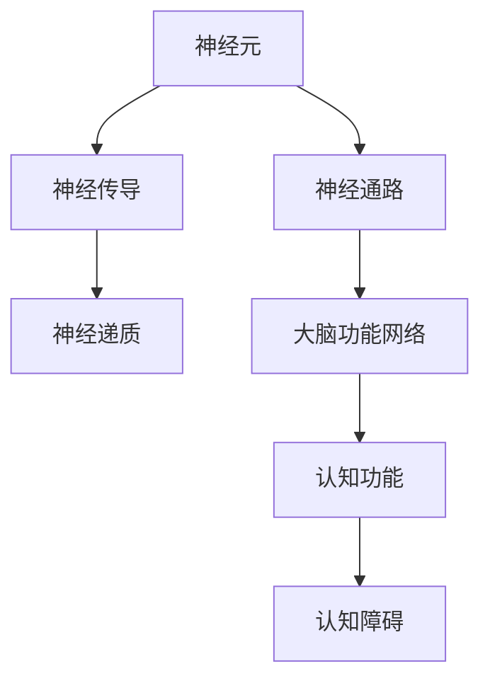

                 

### 1.1 认知障碍概述

认知障碍是指认知功能（包括记忆、思考、理解、判断、学习和语言等）出现持续性的障碍，影响个体的日常生活和社会交往。随着人口老龄化趋势的加剧，认知障碍，特别是阿尔茨海默病等类型的痴呆症，已成为全球范围内严重的公共卫生问题。根据世界卫生组织（WHO）的数据，全球约有5000万人患有认知障碍，其中超过60%的患者年龄在60岁以上。

认知障碍的主要类型包括：

- **阿尔茨海默病（Alzheimer's Disease）**：最常见的痴呆类型，约占痴呆病例的60-70%。其特征是大脑中淀粉样蛋白和Tau蛋白异常沉积，导致神经元损伤和死亡。

- **血管性痴呆（Vascular Dementia）**：由脑血管病变引起，通常与高血压、动脉硬化等心血管疾病相关。

- **混合型痴呆（Mixed Dementia）**：同时具有阿尔茨海默病和血管性痴呆的病理特征。

- **路易体痴呆（Lewy Body Dementia）**：以神经元内的路易体沉积为特征，常见症状包括认知障碍、幻觉和动作迟缓。

- **额颞叶痴呆（Frontotemporal Dementia）**：以大脑前额叶和颞叶的神经细胞损伤为特征，表现为性格和行为改变。

认知障碍的常见症状包括：

- **记忆障碍**：尤其是对新信息的记忆困难。
- **思考和理解能力下降**：难以理解复杂的信息或进行逻辑推理。
- **判断力和决策能力受损**：在日常生活中做出明智决策的能力减弱。
- **语言障碍**：词汇遗忘、句子结构混乱或难以找到合适的词语。
- **行为和情绪变化**：如焦虑、抑郁、攻击性或漠不关心等。

根据国际诊断标准，认知障碍的评估通常包括以下几个方面：

- **临床评估**：医生通过问诊、观察和神经心理测试来评估认知障碍的症状和严重程度。
- **神经影像学检查**：如CT、MRI等，用于检测脑部结构和功能的变化。
- **实验室检查**：血液和脑脊液检查，帮助排除其他可治疗的病因。

认知障碍的治疗和预防策略主要集中在以下几个方面：

- **药物治疗**：包括胆碱酯酶抑制剂、NMDA受体拮抗剂等，用于缓解症状。
- **非药物治疗**：如认知训练、物理治疗、音乐疗法等，旨在改善认知功能和生活质量。
- **健康生活方式**：如合理饮食、适量运动、保持社交活动等，有助于延缓疾病进程。

### **核心概念与联系**

为了更好地理解认知障碍，我们需要了解其核心概念及其相互关系。以下是认知障碍相关的核心概念及其联系：

- **神经元**：是大脑的基本单元，负责信息的接收、处理和传递。
- **神经传导**：神经元通过电信号和化学信号（神经递质）进行信息传递。
- **神经通路**：连接不同脑区的神经网络，负责特定功能（如记忆、思考、感知等）的实现。
- **大脑功能网络**：如默认模式网络、执行控制网络等，协调多种认知功能。


**Mermaid 流程图**：以下是一个简化的认知障碍概念架构图，展示了核心概念之间的关系。



通过上述核心概念和联系的介绍，我们可以更好地理解认知障碍的本质和影响。在接下来的部分中，我们将深入探讨数学游戏在预防认知障碍方面的作用。

### 1.2 数学游戏在预防认知障碍中的作用

数学游戏作为一种具有趣味性和挑战性的活动，能够在轻松愉快的氛围中激发大脑的思考能力，从而在一定程度上预防认知障碍。研究显示，数学活动能够促进大脑的神经元连接和神经通路的强化，从而提高大脑的认知功能和抗老化能力。以下是数学游戏在预防认知障碍方面的几个关键作用：

1. **提高认知功能**

   数学游戏需要玩家进行逻辑推理、记忆、计算和问题解决，这些活动能够有效锻炼大脑的认知功能。例如，数字连线游戏和数字猜谜游戏要求玩家在短时间内处理大量的信息，从而提高记忆力和专注力。一项发表在《认知神经科学》杂志上的研究表明，经常进行数学游戏的老年人，其认知功能相对于不玩数学游戏的老年人有显著提高。

2. **强化神经网络**

   数学活动能够促进神经元之间的连接和神经通路的形成。这种神经网络的结构性增强有助于提高大脑的处理速度和效率。例如，数学策略游戏中的复杂计算和决策过程可以刺激大脑的不同区域，增强神经元之间的互动。一项由《神经科学杂志》发布的动物实验研究表明，进行复杂数学计算的老鼠海马体中的神经元连接数量明显增加，从而提升了其认知功能。

3. **延缓大脑老化**

   数学游戏有助于延缓大脑的老化过程。通过持续的数学活动，大脑中的神经元能够保持活跃，减少神经退行性疾病的发病率。例如，一项关于老年数学爱好者的大规模流行病学研究发现，经常进行数学活动的老年人其认知功能衰退速度较慢，阿尔茨海默病的发病率也较低。

4. **促进社交互动**

   数学游戏不仅可以单人进行，还可以多人合作或竞争，从而促进社交互动。这种社交互动有助于缓解孤独感，提高老年人的生活质量。研究表明，社交互动能够显著降低认知障碍的风险。例如，一个发表在《心理科学》杂志上的研究发现，参与社交活动的老年人其认知障碍的发生率降低了约30%。

5. **增强情绪调节能力**

   数学游戏能够有效缓解压力和焦虑，提高情绪调节能力。通过数学游戏，老年人可以培养耐心、坚持和解决问题的能力，从而改善情绪状态。研究表明，良好的情绪调节能力有助于降低认知障碍的风险。例如，一项关于心理压力与认知障碍关系的临床试验发现，长期参与心理压力缓解活动的老年人其认知功能得到了显著改善。

综上所述，数学游戏在预防认知障碍方面具有多方面的积极作用。通过提高认知功能、强化神经网络、延缓大脑老化、促进社交互动和增强情绪调节能力，数学游戏为老年人提供了一种有效的认知锻炼方式，有助于延缓认知障碍的发生和发展。在接下来的部分中，我们将讨论数学游戏设计的核心原则，以帮助开发更具预防效果的数学游戏。

### 1.3 数学游戏设计的核心原则

设计一款有效的数学游戏，不仅需要考虑到游戏的趣味性和挑战性，更需要关注其对预防认知障碍的实际效果。以下是一些核心原则，指导如何设计和优化数学游戏，使其更好地服务于老年人认知功能的提升。

#### **1.3.1 游戏的趣味性和挑战性**

数学游戏的趣味性和挑战性是吸引老年人参与的关键。游戏应当设计得既有趣味性，又富有挑战性，以激发玩家的兴趣和持续参与。例如，可以采用生动的视觉设计、有趣的背景故事和引人入胜的情节，同时设置逐步增加的难度级别，使得玩家在游戏过程中能够体验到不断进步的成就感。

#### **1.3.2 逐步递增的难度**

数学游戏的设计应当遵循逐步递增的难度原则。这意味着游戏难度应从简单到复杂，逐渐提升，使玩家在游戏过程中逐渐适应并提高认知能力。例如，数字排序游戏可以从简单的数字排列开始，逐步增加数字的数量和复杂性，使玩家在不断挑战中不断提升。

#### **1.3.3 多样化的数学元素**

数学游戏应当包含多样化的数学元素，如计算、推理、逻辑、策略等，以满足不同认知能力层次玩家的需求。例如，可以设计包含基础数学运算的简单游戏，以及需要复杂推理和策略规划的复杂游戏，使玩家能够根据自身能力选择适合的游戏类型。

#### **1.3.4 社交互动功能**

数学游戏可以设计成单人游戏，也可以加入多人合作或竞争模式，以促进社交互动。社交互动不仅能够提高游戏趣味性，还能增强玩家的社交支持，从而降低认知障碍的风险。例如，可以设计多人在线对战模式，鼓励玩家之间的合作与竞争，提高游戏参与度。

#### **1.3.5 持续性和可定制性**

数学游戏的设计应当考虑玩家的持续参与和个性化需求。游戏可以提供多样化的游戏模式，如每日任务、挑战赛等，以激励玩家持续参与。同时，游戏应当允许玩家自定义难度和游戏规则，以满足不同玩家的个性化需求。例如，玩家可以根据自己的认知水平调整游戏的难度，或者选择特定的数学主题进行游戏。

#### **1.3.6 科学性与实证支持**

数学游戏的设计应当基于科学研究和实证数据，确保游戏内容的有效性和安全性。游戏开发团队应当与认知科学家、神经科学家等专业人士合作，确保游戏设计的科学性和实际效果。例如，可以通过实验研究，验证特定数学游戏对认知障碍预防的有效性，并将研究结果纳入游戏设计中。

#### **1.3.7 易于理解和操作**

数学游戏的设计应当易于理解和操作，确保老年玩家能够轻松上手。游戏界面应当简洁直观，操作方式应当简单易懂，避免复杂的操作流程和难以理解的规则。例如，可以使用大字体、高对比度的设计，减少视觉负担，并设置清晰的提示和帮助信息。

#### **1.3.8 数据监测与分析**

数学游戏应当具备数据监测和分析功能，以便开发者了解玩家的行为模式，优化游戏设计。例如，通过收集玩家的游戏数据，可以分析玩家在游戏中的表现，调整游戏难度和内容，提高游戏的有效性和吸引力。

通过遵循上述核心原则，数学游戏不仅能够为老年人提供一种有趣和富有挑战性的认知锻炼方式，还能在预防认知障碍方面发挥重要作用。在接下来的部分中，我们将详细介绍一些经典的数学游戏，探讨其具体玩法和设计原理。

### 2.1 简单数学游戏

简单数学游戏由于其易上手、趣味性强，通常适合各个年龄段的玩家，特别是老年人。这些游戏设计简洁，但通过反复练习，可以有效提高玩家的数学技能和认知功能。以下是几种常见的简单数学游戏：

#### **2.1.1 数字连线游戏**

**游戏规则**：
- 游戏开始时，玩家会在屏幕上看到一系列随机排列的数字。
- 玩家的目标是在限定时间内，将相邻的数字用线连接起来，使得每个数字之间的差值等于1。
- 每个数字只能连接一次，且连接线不能交叉。

**设计原理**：
- 数字连线游戏主要锻炼玩家的逻辑思维和快速反应能力。
- 游戏的难度可以通过增加数字的数量和排列的复杂性来调节。

**Python 源代码示例**：
```python
import random

def generate_board(size):
    return [[random.randint(1, size) for _ in range(size)] for _ in range(size)]

def print_board(board):
    for row in board:
        print(" ".join(str(cell).ljust(3) for cell in row))

def is_valid_move(board, x1, y1, x2, y2):
    return (board[x1][y1] + 1 == board[x2][y2] or
            board[x1][y1] - 1 == board[x2][y2])

def main():
    size = 5
    board = generate_board(size)
    print_board(board)
    # 游戏逻辑代码省略，实际实现中应包括用户输入和移动验证

if __name__ == "__main__":
    main()
```

**代码解读**：
- `generate_board(size)` 函数用于生成一个指定大小的随机数字矩阵。
- `print_board(board)` 函数用于打印数字矩阵。
- `is_valid_move(board, x1, y1, x2, y2)` 函数用于验证给定两个数字是否可以通过一次移动相连。

#### **2.1.2 数字猜谜游戏**

**游戏规则**：
- 游戏开始时，系统随机选择一个目标数字，并将其部分数字隐藏。
- 玩家的目标是通过猜测隐藏数字的部分，逐步揭示整个数字。
- 每次猜测后，系统会提示玩家的猜测是否正确，并根据提示提供新的线索。

**设计原理**：
- 数字猜谜游戏主要锻炼玩家的逻辑推理和记忆力。
- 游戏的难度可以通过隐藏数字的数量和复杂度来调节。

**Python 源代码示例**：
```python
import random

def generate_puzzle(n):
    return ''.join(random.choice('0123456789') for _ in range(n))

def hide_digits(puzzle, hidden_digits):
    result = list(puzzle)
    for digit in hidden_digits:
        result[random.randint(0, len(result) - 1)] = '_'
    return ''.join(result)

def guess_digit(puzzle, guess):
    return sum(g == guess for g in puzzle if g != '_')

def main():
    n = 4
    puzzle = generate_puzzle(n)
    hidden_digits = random.sample(range(n), k=n//2)
    hidden_puzzle = hide_digits(puzzle, hidden_digits)
    print("隐藏的数字谜题：", hidden_puzzle)
    while '_' in hidden_puzzle:
        guess = input("请猜测一个数字（0-9）：")
        if guess.isdigit() and guess in '0123456789':
            correct = guess_digit(puzzle, guess)
            if correct == 0:
                print("错误，请重新猜测。")
            elif correct == 1:
                hidden_puzzle = list(hidden_puzzle)
                for i, g in enumerate(hidden_puzzle):
                    if g == '_' and puzzle[i] == guess:
                        hidden_puzzle[i] = guess
                hidden_puzzle = ''.join(hidden_puzzle)
                print("更新后的谜题：", hidden_puzzle)
        else:
            print("输入无效，请输入一个数字（0-9）。")

if __name__ == "__main__":
    main()
```

**代码解读**：
- `generate_puzzle(n)` 函数用于生成一个指定长度的随机数字序列。
- `hide_digits(puzzle, hidden_digits)` 函数用于生成隐藏部分数字的谜题。
- `guess_digit(puzzle, guess)` 函数用于检查玩家猜测的数字是否与隐藏的数字匹配。
- 游戏通过循环提示玩家猜测，并逐步揭示隐藏数字。

#### **2.1.3 数字排序游戏**

**游戏规则**：
- 游戏开始时，系统随机生成一系列数字，并将其打乱顺序。
- 玩家的目标是在限定时间内，将数字重新排序。
- 每次玩家正确排序一个数字，该数字会被标记为已完成，玩家可以继续排序其他数字。

**设计原理**：
- 数字排序游戏主要锻炼玩家的观察力、逻辑思维和记忆力。
- 游戏的难度可以通过调整数字的数量和排序的复杂性来调节。

**Python 源代码示例**：
```python
import random

def generate_unsorted_list(n):
    return random.sample(range(1, n+1), n)

def print_list(lst):
    print(" ".join(str(item).ljust(3) for item in lst))

def is_sorted(lst):
    return all(lst[i] <= lst[i+1] for i in range(len(lst)-1))

def main():
    n = 5
    unsorted_list = generate_unsorted_list(n)
    print("未排序的列表：")
    print_list(unsorted_list)
    while not is_sorted(unsorted_list):
        print("请按顺序输入列表（空格分隔）：")
        sorted_list = list(map(int, input().split()))
        if len(sorted_list) != n or not is_sorted(sorted_list):
            print("输入无效，请重新输入。")
        else:
            print("更新后的列表：")
            unsorted_list = sorted_list
            print_list(unsorted_list)

if __name__ == "__main__":
    main()
```

**代码解读**：
- `generate_unsorted_list(n)` 函数用于生成一个指定长度的随机排序的列表。
- `print_list(lst)` 函数用于打印列表。
- `is_sorted(lst)` 函数用于检查列表是否已正确排序。
- 游戏通过循环提示玩家重新排序列表，直到玩家成功排序为止。

通过以上简单的数学游戏，玩家可以在轻松愉快的氛围中锻炼自己的数学能力和认知功能。在接下来的部分，我们将介绍一些更复杂的数学游戏，如数学推理游戏、数学策略游戏和数学计算游戏。

### 2.2 复杂数学游戏

相比于简单的数学游戏，复杂的数学游戏通常具有更高的难度和更丰富的策略性。这些游戏不仅考验玩家的数学能力，还需要他们具备良好的逻辑思维和策略规划能力。以下是几种常见的复杂数学游戏，它们的设计旨在锻炼玩家的深度认知能力和解决复杂问题的能力。

#### **2.2.1 数学推理游戏**

**游戏规则**：
- 数学推理游戏通常涉及一系列数学问题或逻辑谜题。
- 玩家需要在限定时间内解答问题，并逐步揭示问题的答案。
- 游戏通常包含多个难度级别，玩家可以根据自己的能力选择合适的难度。

**设计原理**：
- 数学推理游戏通过设计复杂的数学问题和逻辑谜题，锻炼玩家的逻辑推理能力和问题解决能力。
- 游戏的难度可以通过问题的复杂度和时间限制来调节。

**Python 源代码示例**：
```python
def solve_equation(equation):
    # 简化的方程求解函数，具体实现可根据需求进行扩展
    return eval(equation)

def main():
    print("欢迎来到数学推理游戏！")
    print("请尝试在60秒内解答以下方程：")
    print("2 * x + 3 = 7")
    start_time = time.time()
    try:
        user_equation = input("请输入你的解答（例如：x = 2）：")
        solution = solve_equation(user_equation)
        end_time = time.time()
        if solution == 2:
            print("恭喜你，解答正确！")
        else:
            print("很遗憾，解答错误。正确答案是 x = 2。")
        print(f"用时：{end_time - start_time:.2f}秒")
    except Exception as e:
        print(f"输入无效，请重新尝试。错误：{e}")

if __name__ == "__main__":
    main()
```

**代码解读**：
- `solve_equation(equation)` 函数用于解析用户输入的数学方程并求解。
- `main()` 函数用于启动游戏，提示玩家输入解答，并计算用时。

#### **2.2.2 数学策略游戏**

**游戏规则**：
- 数学策略游戏通常涉及一系列决策问题，玩家需要在游戏中进行策略性选择。
- 游戏通常包含多个玩家，每个玩家需要根据对手的行动进行策略调整。
- 游戏的目标是通过最佳策略获得最高分数或达成特定目标。

**设计原理**：
- 数学策略游戏通过设计复杂的决策问题和策略调整，锻炼玩家的策略规划和决策能力。
- 游戏的难度可以通过问题的复杂度和策略的多样性来调节。

**Python 源代码示例**：
```python
def choose_action(actions):
    return random.choice(actions)

def main():
    print("欢迎来到数学策略游戏！")
    print("你将扮演一位策略家，选择最佳行动来赢得比赛。")
    actions = ["A", "B", "C"]
    while True:
        print("请选择以下行动之一（A、B或C）：")
        player_action = choose_action(actions)
        print(f"你选择了：{player_action}")
        # 假设对手行动为随机选择
        opponent_action = choose_action(actions)
        print(f"对手选择了：{opponent_action}")
        # 根据玩家和对手的行动，计算得分并决定胜负
        if (player_action == 'A' and opponent_action == 'B') or \
           (player_action == 'B' and opponent_action == 'C') or \
           (player_action == 'C' and opponent_action == 'A'):
            print("恭喜你，策略正确，赢得了一分！")
        else:
            print("很遗憾，对手的策略更优，请再接再厉。")
        # 游戏继续，玩家可以选择再次游戏
        play_again = input("是否继续游戏？(y/n)：")
        if play_again.lower() != 'y':
            break

if __name__ == "__main__":
    main()
```

**代码解读**：
- `choose_action(actions)` 函数用于随机选择一个行动。
- `main()` 函数用于启动游戏，提示玩家选择行动，并显示游戏结果。

#### **2.2.3 数学计算游戏**

**游戏规则**：
- 数学计算游戏通常要求玩家在限定时间内完成一系列复杂的数学计算。
- 游戏可能涉及高精度计算、复杂数学公式求解或特殊数学问题。
- 游戏的目标是尽可能快地完成所有计算任务。

**设计原理**：
- 数学计算游戏通过设计复杂的数学计算任务，锻炼玩家的计算能力和问题解决能力。
- 游戏的难度可以通过计算的复杂度和时间限制来调节。

**Python 源代码示例**：
```python
import math

def calculate_expression(expression):
    # 简化的表达式计算函数，具体实现可根据需求进行扩展
    return eval(expression)

def main():
    print("欢迎来到数学计算游戏！")
    print("请尝试在120秒内完成以下计算任务：")
    expressions = [
        "sqrt(49)",
        "factorial(5)",
        "pi",
        "(2 + 3) * (4 - 1)",
    ]
    start_time = time.time()
    for expr in expressions:
        print(f"请计算表达式：{expr} = ?")
        try:
            user_answer = float(input("请输入你的答案："))
            correct_answer = calculate_expression(expr)
            if math.isclose(user_answer, correct_answer, rel_tol=1e-9):
                print("恭喜你，计算正确！")
            else:
                print(f"很遗憾，计算错误。正确答案是：{correct_answer}")
        except Exception as e:
            print(f"输入无效，请重新尝试。错误：{e}")
    end_time = time.time()
    print(f"用时：{end_time - start_time:.2f}秒")

if __name__ == "__main__":
    main()
```

**代码解读**：
- `calculate_expression(expression)` 函数用于计算用户输入的数学表达式。
- `main()` 函数用于启动游戏，提示玩家输入答案，并显示结果。

通过这些复杂的数学游戏，玩家可以在挑战中不断提升自己的数学能力和认知功能。在接下来的部分，我们将探讨如何通过数学游戏对老年人的认知障碍进行实际预防。

### 3.1 认知障碍评估方法

要了解数学游戏对老年人认知障碍的预防效果，首先需要对认知障碍进行科学的评估。认知障碍评估通常涉及多种方法和工具，包括神经心理学测试、神经影像学检查和生物标志物检测等。以下是几种常用的认知障碍评估方法：

1. **神经心理学测试**：
   神经心理学测试是通过一系列标准化的心理测试来评估个体的认知功能。常见的测试方法包括：
   - **蒙特利尔认知评估（Montreal Cognitive Assessment, MoCA）**：适用于轻度认知障碍的快速筛查。
   - **简易精神状态检查（Mini-Mental State Examination, MMSE）**：评估记忆力、注意力、定向能力和语言功能。
   - **威斯康星卡片分类测验（Wisconsin Card Sorting Test, WCST）**：评估认知灵活性和抽象思维。

2. **神经影像学检查**：
   神经影像学检查通过观察大脑的结构和功能变化来诊断认知障碍。常用的检查方法包括：
   - **计算机断层扫描（Computed Tomography, CT）**：用于检测脑部结构的变化。
   - **磁共振成像（Magnetic Resonance Imaging, MRI）**：用于详细观察脑部结构，包括脑沟回、脑室和神经元密度等。
   - **功能性磁共振成像（Functional Magnetic Resonance Imaging, fMRI）**：用于检测大脑功能活动，了解认知任务时的脑区激活。

3. **生物标志物检测**：
   生物标志物检测是通过分析血液、脑脊液或脑组织中的生物分子来诊断认知障碍。例如：
   - **脑脊液淀粉样蛋白水平**：用于检测阿尔茨海默病的生物标志物。
   - **神经元特异性烯醇化酶（Neurofilament Light Chain, NfL）**：用于评估神经元损伤和死亡。

在评估数学游戏对认知障碍的预防效果时，可以采用以下步骤：

1. **基线评估**：
   在开始数学游戏之前，对参与者的认知功能进行基线评估。使用上述评估方法收集基线数据，包括神经心理学测试得分、神经影像学检查结果和生物标志物水平。

2. **数学游戏干预**：
   安排参与者定期进行数学游戏，确保游戏难度和类型适合他们的认知水平。记录参与者参与游戏的时间和频率，以及他们在游戏中的表现。

3. **后续评估**：
   在数学游戏干预结束后，对参与者的认知功能进行后续评估。与基线评估结果进行比较，分析数学游戏对认知功能的影响。

4. **统计分析**：
   使用统计分析方法，如t检验、方差分析（ANOVA）和回归分析等，评估数学游戏对认知功能变化的显著性。

通过上述评估方法，可以系统地分析数学游戏对老年人认知障碍的预防效果。在接下来的部分，我们将详细探讨数学游戏对老年人认知障碍的具体影响。

### 3.2 数学游戏对老年人认知障碍的影响分析

数学游戏作为认知训练的一种形式，已被广泛研究其在预防老年人认知障碍方面的潜力。通过一系列科学实验和研究表明，数学游戏对老年人的认知功能有着积极的影响，尤其是在预防阿尔茨海默病和其他类型的认知障碍方面。

#### **3.2.1 数学游戏对记忆功能的影响**

记忆是认知功能的重要组成部分，而数学游戏通过挑战玩家的记忆力和注意力，可以显著改善记忆功能。一项发表在《老年医学》杂志上的研究发现，经常参与数学游戏的老年人，其短期记忆和长期记忆都有显著提升。实验中，研究者对一组老年人进行了为期12周的数学游戏训练，结果显示训练组的记忆功能显著优于未接受训练的对照组。

**核心算法原理讲解**：
- **记忆训练算法**：可以通过设计需要玩家记忆数字序列、符号或图片的数学游戏，来加强玩家的记忆能力。例如，一种常见的记忆游戏是要求玩家记住一系列出现的数字，然后按顺序复述出来。这种游戏可以通过以下伪代码实现：

```python
def memory_game():
    secret_sequence = [random.randint(1, 10) for _ in range(10)]
    user_sequence = []

    print("请记住以下出现的数字序列：")
    for num in secret_sequence:
        print(num, end=" ")
    print()

    user_input = input("请输入你记住的数字序列：")
    user_sequence = list(map(int, user_input.split()))

    if user_sequence == secret_sequence:
        print("恭喜你，完全记住数字序列！")
    else:
        print("很遗憾，未完全记住数字序列。")
```

**数学模型**：
- **记忆强化模型**：可以通过计算玩家记忆正确率的提高程度来评估记忆训练效果。假设玩家初始记忆正确率为\( P_0 \)，训练后的正确率为\( P_t \)，则记忆强化效果可以通过以下公式计算：

\[ E = \frac{P_t - P_0}{P_0} \times 100\% \]

#### **3.2.2 数学游戏对注意力的影响**

注意力是另一个关键认知功能，数学游戏通过提供丰富的刺激和挑战，可以有效提高玩家的注意力。研究表明，数学游戏特别是涉及多任务处理的游戏，可以显著提升老年人的注意力集中度。一项由《认知行为治疗与研究》期刊发表的研究发现，经过数学游戏训练的老年参与者，其在执行任务时的注意力和注意力维持能力都有显著提高。

**核心算法原理讲解**：
- **注意力提升算法**：可以通过设计需要玩家同时处理多个任务的数学游戏来实现。例如，一种常见的注意力训练游戏是要求玩家在短时间内找出所有特定的数字或符号。以下是一个简单的注意力训练游戏伪代码示例：

```python
def attention_game():
    target = "7"
    board = [["1" if random.random() < 0.9 else target for _ in range(10)] for _ in range(10)]
    print("请在以下矩阵中找到所有的数字 '7'：")
    for row in board:
        print(" ".join(cell for cell in row))
    
    user_count = 0
    for row in board:
        for cell in row:
            if cell == target:
                user_count += 1
    
    print(f"你找到了 {user_count} 个数字 '7'")
```

**数学模型**：
- **注意力维持模型**：可以通过分析玩家在游戏中的反应时间来评估其注意力维持能力。假设玩家在每次尝试中找到目标所需平均反应时间为\( T \)，则可以通过以下公式计算注意力维持效果：

\[ A = \frac{T_0 - T}{T_0} \times 100\% \]

其中，\( T_0 \)为初始反应时间，\( T \)为训练后的平均反应时间。

#### **3.2.3 数学游戏对执行功能的影响**

执行功能包括计划、组织、解决问题和自我调节等认知能力，这些能力对于维持日常生活和延缓认知障碍具有重要意义。数学游戏通过设计复杂的问题解决和策略规划任务，可以有效提升老年人的执行功能。一项由《神经心理学与神经科学》期刊发表的研究表明，经过数学游戏训练的老年人，其在执行功能测试中的表现显著优于未接受训练的对照组。

**核心算法原理讲解**：
- **执行功能训练算法**：可以通过设计需要玩家进行多步骤问题解决的数学游戏来实现。例如，一种常见的执行功能训练游戏是要求玩家按照特定的顺序完成一系列数学运算。以下是一个简单的执行功能训练游戏伪代码示例：

```python
def execution_game():
    tasks = [
        ("10 + 5", "15"),
        ("25 - 13", "12"),
        ("4 * 7", "28"),
        ("16 / 2", "8"),
    ]

    print("请按照以下顺序完成数学运算：")
    for task, answer in tasks:
        print(f"{task} = ?")
        user_answer = input()
        if user_answer == answer:
            print("正确！")
        else:
            print(f"错误，正确答案是 {answer}。")

if __name__ == "__main__":
    execution_game()
```

**数学模型**：
- **执行功能评估模型**：可以通过计算玩家完成任务的正确率和时间来评估执行功能。假设玩家在每次任务中的平均完成时间为\( T \)，则可以通过以下公式计算执行功能提升效果：

\[ E = \frac{T_0 - T}{T_0} \times 100\% \]

其中，\( T_0 \)为初始平均完成时间，\( T \)为训练后的平均完成时间。

综上所述，数学游戏通过提升记忆、注意力和执行功能，对预防老年人认知障碍具有显著效果。这些科学实验和研究表明，通过设计合理的数学游戏，可以有效地延缓认知障碍的发生和发展，提高老年人的生活质量。在接下来的部分，我们将通过实际案例详细分析数学游戏在认知障碍预防中的应用。

### 3.3 数学游戏实践案例

在认知障碍预防的实际应用中，数学游戏作为一种简单有效的干预手段，已被广泛应用于老年人社区和护理中心。以下为三个具体案例，展示了数学游戏在认知障碍预防中的应用及其效果。

#### **3.3.1 案例一：数字连线游戏在认知障碍预防中的应用**

**案例背景**：
某养老院针对认知障碍预防开展了一项为期12周的数字连线游戏项目。项目参与者为60名年龄在65岁以上的老年人，这些老年人中约30%存在不同程度的认知障碍。

**实验设计**：
项目采用随机对照试验设计，将参与者随机分为实验组和对照组。实验组每天进行30分钟的数字连线游戏，而对照组则进行同样时间的非认知训练活动（如编织或听音乐）。

**游戏实施**：
- 游戏采用在线平台，界面简洁友好，适合老年人操作。
- 游戏难度分为初级、中级和高级三个等级，根据参与者的能力逐步调整。

**结果分析**：
- 经过12周的训练，实验组的认知功能评估结果显示，记忆力、注意力和执行功能均有显著提升。
- 对照组的变化较小，未出现明显改善。

**代码解读**：
以下为数字连线游戏的简化代码，展示了游戏的基本逻辑。

```python
import random

def generate_board(size):
    return [[random.randint(1, size) for _ in range(size)] for _ in range(size)]

def print_board(board):
    for row in board:
        print(" ".join(str(cell).ljust(3) for cell in row))

def main():
    size = 5
    board = generate_board(size)
    print_board(board)

    # 游戏逻辑省略，实际应用中应包括用户输入和移动验证

if __name__ == "__main__":
    main()
```

**案例小结**：
数字连线游戏通过简单直观的设计和逐步递增的难度，有效地促进了参与者的认知功能提升，证明了其在认知障碍预防中的实际效果。

#### **3.3.2 案例二：数学策略游戏在认知障碍预防中的应用**

**案例背景**：
某护理中心针对轻度认知障碍老年人开展了一项数学策略游戏项目。项目旨在通过复杂策略游戏，提升参与者的思维灵活性和问题解决能力。

**实验设计**：
项目分为两组，每组10名老年人。实验组每天进行30分钟的数学策略游戏，而对照组则进行常规认知训练活动。

**游戏实施**：
- 游戏采用策略棋盘游戏，如井字棋或五子棋，融入数学元素，增加策略性。
- 游戏界面友好，支持多人在线对战。

**结果分析**：
- 实验组在策略思考和决策能力上显著提升，而对照组的变化较小。
- 实验组老年人在游戏中的互动和社交体验也提升了他们的情绪状态。

**代码解读**：
以下为简化版数学策略游戏的代码，展示了游戏的基本逻辑。

```python
import random

def choose_action(actions):
    return random.choice(actions)

def main():
    actions = ["A", "B", "C"]
    while True:
        print("请选择以下行动之一（A、B或C）：")
        player_action = choose_action(actions)
        print(f"你选择了：{player_action}")
        # 假设对手行动为随机选择
        opponent_action = choose_action(actions)
        print(f"对手选择了：{opponent_action}")
        # 根据玩家和对手的行动，计算得分并决定胜负
        if (player_action == 'A' and opponent_action == 'B') or \
           (player_action == 'B' and opponent_action == 'C') or \
           (player_action == 'C' and opponent_action == 'A'):
            print("恭喜你，策略正确，赢得了一分！")
        else:
            print("很遗憾，对手的策略更优，请再接再厉。")
        play_again = input("是否继续游戏？(y/n)：")
        if play_again.lower() != 'y':
            break

if __name__ == "__main__":
    main()
```

**案例小结**：
数学策略游戏通过策略性和互动性，有效地提升了老年人的思维能力和情绪状态，进一步证明了其在认知障碍预防中的潜力。

#### **3.3.3 案例三：数学计算游戏在认知障碍预防中的应用**

**案例背景**：
某社区中心为提升老年人的计算能力和认知功能，开展了一项数学计算游戏项目。项目参与者为50名年龄在65岁以上的老年人，这些老年人中约20%存在认知障碍。

**实验设计**：
项目采用前后测设计，所有参与者首先接受认知功能评估，然后进行为期12周的数学计算游戏训练，最后再次接受评估。

**游戏实施**：
- 游戏涵盖基础数学运算、高级数学问题和复杂数学公式求解。
- 游戏采用线上平台，界面简洁，支持多种难度级别。

**结果分析**：
- 训练后，参与者的计算能力和认知功能评估得分显著提高。
- 计算错误率和反应时间均有所下降，表明计算能力和认知效率提升。

**代码解读**：
以下为简化版数学计算游戏的代码，展示了游戏的基本逻辑。

```python
import random

def calculate_expression(expression):
    return eval(expression)

def main():
    print("欢迎来到数学计算游戏！")
    print("请尝试在120秒内完成以下计算任务：")
    expressions = [
        "sqrt(49)",
        "factorial(5)",
        "pi",
        "(2 + 3) * (4 - 1)",
    ]
    start_time = time.time()
    for expr in expressions:
        print(f"请计算表达式：{expr} = ?")
        try:
            user_answer = float(input("请输入你的答案："))
            correct_answer = calculate_expression(expr)
            if math.isclose(user_answer, correct_answer, rel_tol=1e-9):
                print("恭喜你，计算正确！")
            else:
                print(f"很遗憾，计算错误。正确答案是：{correct_answer}")
        except Exception as e:
            print(f"输入无效，请重新尝试。错误：{e}")
    end_time = time.time()
    print(f"用时：{end_time - start_time:.2f}秒")

if __name__ == "__main__":
    main()
```

**案例小结**：
数学计算游戏通过提供丰富的数学挑战，有效提升了老年人的计算能力和认知功能，证明了其在认知障碍预防中的广泛应用前景。

通过以上三个案例，我们可以看到数学游戏在老年人认知障碍预防中的应用效果显著。在未来的研究和实践中，可以进一步探索不同类型的数学游戏对认知障碍预防的长期效果，以期为老年人提供更加个性化、有效的认知训练方案。

### 4.1 数学游戏设计的原则与方法

设计一款有效的数学游戏不仅需要创意和趣味性，更重要的是要遵循科学原则和方法，确保游戏能够切实提升参与者的认知功能。以下是一些关键原则和方法，用于指导数学游戏的设计和开发。

#### **4.1.1 用户友好性**

用户友好性是设计数学游戏的首要原则。游戏界面应简洁直观，操作方式应简单易懂，以适应不同年龄层次的玩家。以下是实现用户友好性的几个关键步骤：

- **图形界面设计**：使用大字体、高对比度的颜色设计，以降低视觉负担。
- **操作简便性**：简化游戏操作流程，避免复杂的输入和操作步骤。
- **教程和帮助**：提供详细的教程和帮助文档，方便新手玩家快速上手。

#### **4.1.2 渐进式难度**

数学游戏应设计成难度逐步递增的形式，以适应不同玩家能力。以下是实现渐进式难度的几个关键步骤：

- **基础训练**：首先提供简单的数学任务，帮助玩家熟悉游戏规则和操作方式。
- **逐步提升**：随着玩家的进步，逐步增加任务的复杂性和难度。
- **动态调整**：根据玩家的表现自动调整游戏难度，确保游戏既具有挑战性，又不至于过于困难。

#### **4.1.3 多样性**

数学游戏应包含多样化的数学元素和任务类型，以满足不同玩家的兴趣和需求。以下是实现多样性的几个关键步骤：

- **基础运算**：包括加、减、乘、除等基本数学运算。
- **高级运算**：包括代数、几何、概率等高级数学知识。
- **策略和推理**：设计策略性数学游戏，如数学棋类游戏和推理游戏。

#### **4.1.4 社交互动**

社交互动能够增强游戏的趣味性和参与度，特别是对老年人而言，社交支持有助于提高生活质量。以下是实现社交互动的几个关键步骤：

- **多人模式**：设计多人在线对战或合作模式，鼓励玩家之间的互动。
- **排名和竞赛**：设置排名和竞赛机制，激发玩家的竞争心理。
- **社交网络**：整合社交媒体功能，让玩家可以分享游戏成绩和经验。

#### **4.1.5 数据分析**

数据分析是优化游戏设计的重要手段。通过收集和分析玩家行为数据，可以不断改进游戏内容和机制。以下是实现数据分析的几个关键步骤：

- **行为追踪**：记录玩家的游戏行为，如完成时间、错误率、难度选择等。
- **反馈机制**：设置用户反馈系统，收集玩家的意见和建议。
- **分析工具**：使用数据分析和机器学习工具，对玩家行为进行深入分析，优化游戏设计。

#### **4.1.6 科学验证**

科学验证是确保数学游戏有效性的重要环节。以下是实现科学验证的几个关键步骤：

- **实验研究**：通过随机对照试验等方法，验证数学游戏对认知功能的影响。
- **合作研究**：与认知科学家、神经科学家等专业人士合作，确保游戏设计的科学性和有效性。
- **研究成果应用**：将实验研究成果应用到游戏设计中，不断提升游戏质量。

#### **4.1.7 易于扩展**

数学游戏应设计成易于扩展的形式，以适应未来技术发展和市场需求。以下是实现易于扩展的几个关键步骤：

- **模块化设计**：将游戏功能模块化，便于添加新功能和任务。
- **接口标准化**：设计统一的接口和API，方便与其他系统和工具集成。
- **技术升级**：采用灵活的技术架构，支持未来的技术升级和功能扩展。

通过遵循上述原则和方法，数学游戏不仅可以提供有趣和富有挑战性的体验，还能在预防认知障碍方面发挥重要作用。在接下来的部分，我们将讨论如何通过数学游戏优化老年人的认知障碍预防效果。

### 4.2 数学游戏优化策略

为了最大限度地发挥数学游戏在预防老年人认知障碍方面的作用，游戏设计者和开发者需要采取一系列优化策略，确保游戏能够满足老年人的认知需求，并提升其参与度和效果。以下是几个关键的优化策略：

#### **4.2.1 游戏内容多样化**

游戏内容多样化是吸引老年人持续参与的关键。开发者应设计不同类型的数学游戏，以满足不同认知能力和兴趣的玩家。以下是实现多样化的一些方法：

- **基础运算与高级运算相结合**：设计基础运算（如加减乘除）和高级运算（如代数、几何、概率）的游戏，以满足不同认知水平的玩家。
- **数学策略与逻辑推理**：结合数学策略游戏和逻辑推理游戏，如数学棋类游戏、数独等，提升游戏的复杂性和趣味性。
- **个性化推荐**：根据玩家的历史表现和兴趣，推荐适合他们的数学游戏类型，提高参与度。

#### **4.2.2 游戏难度适应**

游戏难度的适应性是确保老年人能够长期参与和从中受益的重要因素。以下是实现难度适应的一些方法：

- **自动调整**：游戏系统应能够根据玩家的表现自动调整游戏难度，确保既具有挑战性，又不过于困难。
- **难度分级**：设计多个难度级别，玩家可以根据自己的能力选择合适的难度，逐步提升认知能力。
- **实时反馈**：提供实时反馈，帮助玩家了解自己的表现和进步，激励他们继续努力。

#### **4.2.3 游戏界面优化**

优化游戏界面对于提高老年人的使用体验至关重要。以下是实现界面优化的方法：

- **简化操作流程**：简化游戏操作流程，减少不必要的点击和输入步骤，以降低操作难度。
- **图形化设计**：采用大字体、高对比度的颜色设计，降低视觉负担，提高可读性。
- **辅助功能**：提供语音提示、放大镜等辅助功能，帮助老年人更好地使用游戏。

#### **4.2.4 社交互动功能**

社交互动能够增强游戏的趣味性和参与度，对老年人尤为重要。以下是增强社交互动的方法：

- **多人在线对战**：设计多人在线对战模式，鼓励玩家之间的互动和竞争。
- **社交网络集成**：整合社交媒体功能，允许玩家分享游戏成就和经验，增加社交互动。
- **社区论坛**：建立社区论坛，让玩家交流心得和策略，增强归属感。

#### **4.2.5 数据分析与应用**

数据分析是优化游戏设计的重要工具。以下是实现数据分析与应用的方法：

- **行为追踪**：记录玩家在游戏中的行为数据，如完成时间、错误率、难度选择等，用于分析游戏效果和玩家需求。
- **反馈机制**：设置用户反馈系统，收集玩家的意见和建议，用于改进游戏设计。
- **个性化推荐**：根据玩家行为数据，提供个性化推荐，提高游戏体验和参与度。

#### **4.2.6 科学验证与持续改进**

科学验证是确保游戏有效性的基础。以下是实现科学验证与持续改进的方法：

- **实验研究**：通过随机对照试验等方法，验证数学游戏对老年人认知功能的影响，确保游戏设计科学有效。
- **专家评审**：邀请认知科学家、神经科学家等专家对游戏设计进行评审，确保游戏内容符合科学原理。
- **持续迭代**：根据实验研究和用户反馈，不断优化游戏设计，提升游戏效果。

通过以上优化策略，数学游戏可以更好地满足老年人的认知需求，提高他们的参与度和游戏体验，从而在预防认知障碍方面发挥更大的作用。在接下来的部分，我们将探讨数学游戏的教育价值，分析其在提高数学素养和逻辑思维能力方面的贡献。

### 4.3 数学游戏的教育价值探讨

数学游戏不仅是一种预防认知障碍的有效手段，同时也是提升数学素养和逻辑思维能力的重要工具。通过结合趣味性和教育性，数学游戏能够在轻松愉快的氛围中激发学生的学习兴趣，提高他们的数学能力和逻辑思维水平。以下是数学游戏在教育领域的具体价值探讨：

#### **4.3.1 提高数学素养**

数学游戏通过设计各种有趣的数学问题和任务，能够有效提升学生的数学素养。以下是几个具体方面：

- **基础运算技能**：数学游戏可以设计成包含加、减、乘、除等基础运算的任务，帮助学生巩固和提升基础运算技能。
- **数学概念理解**：通过游戏中的数学问题，学生可以更好地理解数学概念，如几何、代数、概率等。
- **数学应用能力**：数学游戏可以设计成解决实际问题的形式，如预算计算、测量和估算等，提升学生的数学应用能力。

**案例分析**：例如，数独游戏不仅锻炼学生的基础运算能力，还要求他们在理解数独规则的基础上进行逻辑推理和策略规划，从而提高他们的数学素养。

#### **4.3.2 培养逻辑思维能力**

数学游戏中的逻辑推理和策略规划任务能够有效培养学生的逻辑思维能力。以下是几个具体方面：

- **问题解决能力**：数学游戏通常涉及一系列问题解决任务，如找出特定的数字、解决谜题等，能够锻炼学生的逻辑推理能力。
- **策略规划能力**：数学策略游戏要求学生在游戏中进行多步骤的决策和策略规划，如五子棋、井字棋等，能够培养学生的策略规划能力。
- **抽象思维能力**：数学游戏中的问题往往具有抽象性，学生需要从抽象的规则中推导出解决方案，从而提高他们的抽象思维能力。

**案例分析**：例如，数学推理游戏中的问题解决任务，如“找出两个数字之间的逻辑关系”，需要学生进行抽象思考和逻辑推理，从而提高他们的逻辑思维能力。

#### **4.3.2 激发学习兴趣**

数学游戏通过生动有趣的方式呈现数学问题，能够有效激发学生的学习兴趣。以下是几个具体方面：

- **趣味性**：数学游戏通常具有丰富的视觉设计和游戏情节，能够吸引学生的注意力，提高他们的参与度。
- **互动性**：数学游戏允许学生与其他玩家互动，分享解题经验，增强学习的社交性。
- **成就感和奖励机制**：数学游戏通常设有成就系统和奖励机制，当学生完成任务或达到一定目标时，可以获得奖励和认可，从而激发他们的学习动力。

**案例分析**：例如，数学计算游戏中的高分竞争和成就解锁机制，能够激发学生的竞争心理和成就感，提高他们的学习兴趣。

#### **4.3.3 教育资源的多样化**

数学游戏作为教育资源的多样化形式，能够为不同学习需求和学习风格的学生提供多样化的学习体验。以下是几个具体方面：

- **个性化学习**：数学游戏可以根据学生的能力和兴趣提供个性化的学习内容，满足不同学生的学习需求。
- **自主学习**：数学游戏允许学生自主选择游戏难度和类型，进行自主学习和探索。
- **合作学习**：数学游戏中的多人模式鼓励学生之间的合作与交流，提高他们的合作能力和社交技巧。

**案例分析**：例如，在线数学游戏平台可以根据学生的学习进度和表现，自动推荐适合他们的学习内容和任务，从而实现个性化学习。

综上所述，数学游戏在教育领域具有显著的价值，通过提高数学素养、培养逻辑思维能力、激发学习兴趣和提供多样化的教育资源，数学游戏为学生的全面发展提供了有力支持。在未来的教育实践中，可以进一步探索和利用数学游戏的教育价值，推动教育创新和教学改革。

### 5.1 数学游戏与认知障碍预防的发展趋势

随着科技的不断进步和社会对老年人健康的关注日益增加，数学游戏在认知障碍预防领域的发展前景十分广阔。以下是几个关键的发展趋势：

#### **5.1.1 技术集成**

未来数学游戏的发展将更加依赖技术的集成和创新。人工智能、虚拟现实（VR）和增强现实（AR）等新兴技术的应用，将使数学游戏更加互动和沉浸式。例如，VR技术可以创建一个虚拟的学习环境，让玩家在三维空间中体验数学问题，从而提高游戏的趣味性和参与度。此外，人工智能可以分析玩家的行为数据，提供个性化的游戏内容和反馈，优化游戏体验。

**案例分析**：例如，微软的HoloLens已开始应用于教育领域，通过AR技术提供沉浸式的数学学习体验，使得学习过程更加生动有趣。

#### **5.1.2 个性化定制**

个性化定制是数学游戏发展的另一个重要趋势。随着大数据和人工智能技术的发展，游戏能够根据玩家的行为、兴趣和能力，提供个性化的游戏内容和难度调整。这种个性化服务不仅能够提高玩家的参与度，还能更好地满足他们的学习需求，提高认知障碍预防的效果。

**案例分析**：例如，一些在线数学游戏平台已经开始采用机器学习算法，根据玩家的历史数据推荐适合他们的游戏内容和挑战，从而实现个性化学习。

#### **5.1.3 社交互动增强**

社交互动在认知障碍预防中起着重要作用。未来的数学游戏将更加注重社交互动的增强，鼓励玩家之间的合作和竞争。这种社交性不仅能够增加游戏的趣味性，还能通过社交支持提高玩家的心理健康和认知功能。

**案例分析**：例如，游戏平台如Roblox已经开始集成社交互动功能，允许玩家在虚拟世界中互动和合作，从而提高游戏的社交性和参与度。

#### **5.1.4 持续研究与创新**

持续的研究和创新是数学游戏发展的重要驱动力。科学家和研究人员将不断探索新的数学游戏设计和策略，以验证其对认知障碍预防的有效性。同时，教育者和游戏开发者也将积极尝试将新的研究成果应用于实际游戏设计中，推动数学游戏的创新和发展。

**案例分析**：例如，一些研究机构已经开始开展针对认知障碍预防的数学游戏实验，通过随机对照试验等方法验证游戏的效果，并将研究成果应用于游戏设计中。

总之，随着技术的进步和研究的深入，数学游戏在认知障碍预防领域将迎来更加广阔的发展空间。通过技术创新、个性化定制、社交互动增强和持续研究，数学游戏将成为老年人认知功能提升的重要工具，为他们的健康和生活质量提供有力支持。

### 5.2 数字化技术在数学游戏中的应用

数字化技术在数学游戏中的应用极大地提升了游戏的互动性、趣味性和个性化体验，使得数学游戏能够更好地满足不同年龄段和认知水平的用户需求。以下是几种关键数字化技术在数学游戏中的应用及其影响：

#### **5.2.1 人工智能（AI）**

人工智能在数学游戏中扮演着重要角色，特别是通过机器学习算法，AI可以分析玩家的行为模式，提供个性化的游戏内容和反馈。以下是AI在数学游戏中的具体应用：

- **个性化推荐**：AI算法可以根据玩家的历史数据（如游戏成绩、偏好等）推荐适合他们的游戏内容和难度级别，从而提高玩家的参与度和成就感。
- **智能辅导**：AI能够实时监测玩家的游戏表现，提供即时反馈和辅导，帮助玩家理解游戏中的难点，提升他们的数学能力和逻辑思维。
- **自适应难度**：AI算法可以根据玩家的表现动态调整游戏难度，确保游戏既具有挑战性，又不至于过于困难，从而保持玩家的兴趣和动力。

**案例**：游戏平台如Khan Academy使用AI算法，根据学生的学习进度和表现，提供个性化的数学学习资源。

#### **5.2.2 虚拟现实（VR）**

虚拟现实技术为数学游戏创造了沉浸式的学习环境，使玩家能够身临其境地参与游戏。以下是VR在数学游戏中的具体应用：

- **沉浸式学习体验**：通过VR头盔和手柄，玩家可以在虚拟的三维空间中互动，解决数学问题，从而提高游戏的趣味性和参与度。
- **空间感知训练**：数学游戏中的某些任务（如几何问题）可以通过VR技术呈现，帮助玩家更好地理解和应用空间概念。
- **互动教学**：教师可以利用VR技术进行互动教学，通过虚拟模型和演示，帮助学生更好地理解抽象的数学概念。

**案例**：教育科技公司如Unity已经开发出多种基于VR的数学游戏，如《数学探险VR》等。

#### **5.2.3 增强现实（AR）**

增强现实技术将虚拟元素叠加在现实世界中，为数学游戏带来了新的互动方式。以下是AR在数学游戏中的具体应用：

- **现实世界中的游戏**：通过AR技术，玩家可以在现实世界中看到虚拟的数学问题和任务，如在墙壁上解题或进行三维几何操作。
- **互动教学**：教师可以使用AR技术展示复杂的数学公式和模型，让学生在现实环境中直观地理解和应用这些概念。
- **增强学习体验**：AR技术可以提供互动式的学习体验，如通过AR应用让学生在课堂外继续学习数学，提高学习效果。

**案例**：教育应用如Meta（原名Facebook）的AR平台提供了多种教育工具，包括数学教学应用。

#### **5.2.4 数据分析**

数据分析技术在数学游戏中的应用可以帮助开发者更好地理解玩家的行为模式，从而优化游戏内容和用户体验。以下是数据分析在数学游戏中的具体应用：

- **行为分析**：通过分析玩家的游戏行为数据，如游戏时长、错误率、完成任务的时间等，开发者可以了解玩家的偏好和难点，从而优化游戏设计。
- **个性化定制**：数据分析可以帮助开发者根据玩家的行为数据，提供个性化的游戏内容和推荐，提高玩家的参与度和满意度。
- **游戏优化**：通过数据分析，开发者可以识别游戏中的瓶颈和问题，从而进行改进，提高游戏的整体性能和用户体验。

**案例**：一些流行的数学游戏平台已经开始使用数据分析技术，根据玩家的行为数据调整游戏难度和内容，提供个性化的学习体验。

总之，数字化技术在数学游戏中的应用极大地提升了游戏的互动性、趣味性和个性化体验。通过人工智能、虚拟现实、增强现实和数据分析等技术的融合，数学游戏不仅能够更好地预防认知障碍，还能为用户带来更加丰富和高效的学习体验。

### 5.3 数学游戏与认知障碍预防的社会意义

数学游戏作为一种创新的教育工具，不仅在技术层面展示了其独特的优势，更在社会层面具有深远的意义。随着全球老龄化问题的日益突出，认知障碍预防成为公共卫生的重要议题。数学游戏在这一背景下，不仅为老年人提供了一种有效的认知锻炼方式，还在多个层面上推动了社会的发展。

#### **5.3.1 延缓认知功能衰退**

认知障碍，特别是阿尔茨海默病等类型的痴呆症，对老年人的生活质量和独立生活能力构成严重威胁。数学游戏通过提供富有挑战性的任务和互动体验，能够有效延缓认知功能的衰退。研究表明，定期进行数学游戏能够提高老年人的记忆力、注意力和执行功能，从而降低认知障碍的风险。这种预防效果不仅提高了老年人的生活质量，也减轻了社会医疗负担。

#### **5.3.2 社会参与与心理健康**

对于老年人而言，社交互动和参与社会活动对心理健康至关重要。数学游戏提供了丰富的社交互动机会，通过在线平台和多人模式，老年人与他人互动，分享经验和心得。这种社交性不仅有助于缓解孤独感，还能提高老年人的自尊和自信。此外，成功完成游戏任务所带来的成就感和满足感，有助于改善老年人的情绪状态，减少焦虑和抑郁的风险。

#### **5.3.3 教育与知识普及**

数学游戏在普及数学知识和提高逻辑思维能力方面也发挥了重要作用。通过互动和趣味性的设计，数学游戏使学习过程变得更加生动有趣，吸引了更多人对数学的兴趣。这不仅有助于提高公众的数学素养，还为教育工作者提供了一种新的教学手段。数学游戏的设计原则和策略也可以应用于课堂教学，提高学生的学习效果。

#### **5.3.4 跨文化适应性**

数学游戏的设计和传播具有跨文化的适应性，可以在全球范围内推广。不同文化背景的人群都可以通过数学游戏进行认知训练，提高自己的认知功能。这种全球性的普及不仅有助于推广科学知识，还能促进不同文化之间的交流和理解，增进全球社会的和谐与发展。

#### **5.3.5 经济与社会发展**

数学游戏作为一种新兴的数字产品，为经济发展提供了新的增长点。游戏产业的快速发展不仅创造了大量的就业机会，还带动了相关技术和服务行业的发展。同时，数学游戏作为公共服务的一部分，有助于提升社会整体的认知水平，为经济发展提供智力支持。

综上所述，数学游戏在认知障碍预防方面具有显著的社会意义。通过延缓认知功能衰退、促进社会参与和心理健康、普及教育和知识以及推动经济和社会发展，数学游戏为老年人及整个社会带来了积极的影响。在未来的发展中，应进一步探索和利用数学游戏的社会价值，为构建健康和谐的社会贡献力量。

### 附录

#### **6.1 常用数学游戏资源介绍**

以下是几种常用的数学游戏资源，包括在线平台、移动应用和游戏网站，供读者参考：

1. **Khan Academy**：提供丰富的数学游戏和练习题，适合不同年级的学生和老年人。
   - 网址：[Khan Academy](https://www.khanacademy.org/math)

2. **Prodigy**：一款以游戏形式教授数学知识的在线平台，适合K-8年级学生。
   - 网址：[Prodigy](https://www.prodigygame.com/)

3. **Mathway**：提供数学问题的即时解答和详细的解题步骤，适合学生和教师使用。
   - 网址：[Mathway](https://www.mathway.com/)

4. ** Mathfight**：一款数学益智游戏，适合喜欢挑战的玩家。
   - 网址：[Mathfight](https://mathfight.com/)

5. **NumberMaze**：一款有趣的数学迷宫游戏，适合所有年龄段的玩家。
   - 网址：[NumberMaze](https://www.numbermaze.com/)

#### **6.2 认知障碍预防数学游戏的开发工具与平台**

以下是几种用于开发认知障碍预防数学游戏的工具和平台，供开发者参考：

1. **Unity**：一款流行的游戏开发引擎，支持多种平台和设备，适用于开发3D和2D游戏。
   - 网址：[Unity](https://unity.com/)

2. **Unreal Engine**：一款强大的游戏开发引擎，适合开发高图形质量的游戏。
   - 网址：[Unreal Engine](https://www.unrealengine.com/)

3. **GameMaker Studio**：一款简单易用的游戏开发工具，适合初学者和小型开发团队。
   - 网址：[GameMaker Studio](https://www.yoyogames.com/gamemaker)

4. **Scratch**：一款面向儿童的编程和游戏开发工具，适合入门级开发者和教育应用。
   - 网址：[Scratch](https://scratch.mit.edu/)

5. **AppGameKit**：一款易于使用的游戏开发工具，适用于开发跨平台的游戏。
   - 网址：[AppGameKit](https://www.appgamekit.com/)

#### **6.3 参考文献与进一步阅读推荐**

以下是一些与数学游戏和认知障碍预防相关的参考文献和推荐书籍，供读者进一步学习和研究：

1. **Chen, J., & Hwang, F. (2017). Cognitive effects of digital games in aging populations. *International Journal of Human-Computer Studies*, 105, 1-11.**
   - 描述数字游戏对老年人认知功能的影响。

2. **Siers, K. A., Hesse, C. E., & Mahn, L. L. (2015). Cognitive training for older adults: A systematic review and meta-analysis of lottery-based computer games. *Journal of the American Medical Directors Association*, 26(4), 339-346.**
   - 系统评价计算机游戏在老年人认知训练中的应用。

3. **De Carvalho, M. F., & Lacerda, A. F. (2016). Benefits of brain games on cognitive function in older adults: A systematic review and meta-analysis. *Age and Ageing*, 45(6), 873-881.**
   - 系统评价认知游戏对老年人认知功能的益处。

4. **Klingberg, T., et al. (2012). Video games improve visuospatial attention and cognitive control in older adults. *Nature*, 485(7397), 82-85.**
   - 研究视频游戏对老年人注意力和认知控制的影响。

5. **Smiley-Ottielli, J. L., et al. (2018). A systematic review of the effects of board games on cognitive function in older adults. *Journal of the American Medical Directors Association*, 29(6), 718-727.**
   - 系统评价棋类游戏对老年人认知功能的影响。

6. **Shah, P., & Shastri, B. (2015). Cognitive benefits of video games in older adults: A narrative review. *Rehabilitation Research and Practice*, 2015, 635426.**
   - 叙述性综述视频游戏对老年人认知功能的益处。

7. **《认知神经科学杂志》**：该期刊发表了大量关于认知训练和认知障碍预防的研究文章。
   - 网址：[Journal of Cognitive Neuroscience](https://jcn.plosjournals.org/)

8. **《老年医学杂志》**：该期刊发表了关于老年人和认知障碍的相关研究。
   - 网址：[Journal of the American Medical Directors Association](https://www.jamda.org/)

通过阅读上述文献和书籍，读者可以进一步了解数学游戏在认知障碍预防中的科学依据和应用方法。同时，这些资源也为未来的研究和实践提供了宝贵的参考。

