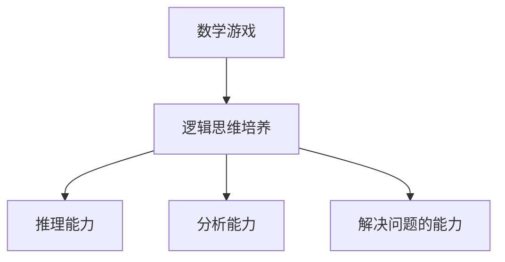

                 


### 文章标题

《数学游戏与青少年逻辑思维的培养》

### 关键词

数学游戏，青少年，逻辑思维，教育方法，认知发展

### 摘要

本文旨在探讨数学游戏在青少年逻辑思维培养中的应用与价值。通过分析数学游戏的概念、类型及其对逻辑思维的影响，本文提出了一系列基于数学游戏的教育策略，以促进青少年的认知发展。文章还结合具体案例，详细阐述了数学游戏的实践方法及其在提高青少年逻辑思维能力方面的实际效果。

## 引言与背景介绍

### 1.1 书籍的目的与重要性

在当今信息化时代，逻辑思维作为人们解决问题和创新思维的重要工具，其重要性日益凸显。青少年作为国家的未来和希望，其逻辑思维能力的培养尤为重要。然而，传统教育模式中，逻辑思维的培养往往局限于课堂讲授和机械练习，缺乏生动有趣的教学手段，难以激发学生的兴趣和主动性。数学游戏作为一种新颖的教学方法，不仅能够将抽象的数学概念具象化，还能通过游戏过程培养学生的逻辑思维、问题解决能力和创新精神。

本文旨在探讨数学游戏在青少年逻辑思维培养中的潜力，通过分析不同类型的数学游戏及其对逻辑思维的不同影响，为教育工作者和家长提供有效的教育策略和方法。同时，本文也希望能够引起社会各界对青少年逻辑思维培养的重视，推动教育方式的创新与改革。

### 1.2 数学游戏的历史与发展

数学游戏的历史可以追溯到古代，早在古希腊时期，数学家们就开始设计各种数学游戏，以帮助学生更好地理解数学概念。例如，欧几里得的《几何原本》中就包含了许多用于教学的几何游戏。中世纪时期，阿拉伯数学家们进一步发展了数学游戏，将其应用于数学教育和智力训练。到了近现代，随着计算机技术的飞速发展，数学游戏逐渐与电子技术结合，形成了更为丰富和多样化的形式。

20世纪中叶以来，数学游戏在教育领域中的应用得到了广泛关注。例如，著名的教育心理学家皮亚杰（Jean Piaget）和布鲁纳（Jerome Bruner）都强调游戏在儿童认知发展中的重要作用。皮亚杰提出，游戏是儿童认知发展的自然形式，有助于他们建构抽象概念和逻辑思维。布鲁纳则认为，游戏可以激发学生的学习兴趣，促进他们主动探索和发现知识。

在我国，数学游戏的应用也逐渐受到重视。近年来，许多教育机构和学者开始探索将数学游戏融入课堂教学，以提升学生的学习效果和兴趣。例如，小学数学教学中引入了“趣味数学”、“数学竞赛”等游戏形式，中学阶段则开展了“数学建模”、“数学探究”等活动。这些实践表明，数学游戏在培养学生的逻辑思维和创新能力方面具有显著优势。

### 1.3 青少年逻辑思维的重要性

逻辑思维是人类思维的基本形式之一，它包括推理、分析、比较、分类、抽象等能力。青少年时期是逻辑思维发展的关键阶段，这一时期的逻辑思维能力不仅影响到学生的学业成绩，还对其未来的职业发展和社会适应能力产生深远影响。

首先，逻辑思维是学习科学知识的重要基础。科学知识往往是建立在一系列逻辑推理之上的，缺乏逻辑思维能力的学生在学习过程中容易感到困惑和无从下手。通过数学游戏，学生可以在愉快的氛围中学习数学知识，逐步培养其逻辑思维能力，从而提高学习效果。

其次，逻辑思维是解决实际问题的必要工具。在日常生活中，人们常常需要面对各种复杂的问题，这些问题往往需要通过逻辑推理和分析来解决。青少年具备良好的逻辑思维能力，能够更加高效地解决实际问题，提高生活质量和应对各种挑战。

此外，逻辑思维也是创新和创造力的源泉。创新和创造力是现代社会发展的重要动力，而逻辑思维是创新思维的基础。通过数学游戏，学生可以锻炼其逻辑思维能力，培养其创新思维，为未来的发展奠定坚实基础。

总之，青少年逻辑思维的培养对于其个人发展和社会进步具有重要意义。通过数学游戏这一有效的教育手段，我们可以帮助学生更好地发展逻辑思维能力，为其未来的成长奠定坚实基础。

## 数学游戏概述

### 2.1 数学游戏的概念与分类

数学游戏是一种将数学知识融入游戏过程中，以激发学生的学习兴趣和培养逻辑思维能力为目的的教学方法。数学游戏通常包括以下特点：

1. **知识性**：数学游戏将数学概念、原理、方法和技巧融入到游戏规则中，学生在游戏中自然地学习和掌握数学知识。
2. **趣味性**：数学游戏形式多样，富有趣味性，能够吸引学生的注意力，激发他们的学习兴趣。
3. **挑战性**：数学游戏具有一定的难度和挑战性，可以激发学生的求知欲和探索精神，培养他们的解决问题的能力。
4. **互动性**：数学游戏往往需要学生之间或学生与教师之间的互动，有助于培养学生的合作能力和沟通能力。

根据数学游戏的内容和形式，可以将数学游戏分为以下几类：

1. **拼图类**：如数独、华容道等，通过拼图的方式锻炼学生的空间感知能力和逻辑推理能力。
2. **策略类**：如棋类游戏、扑克牌游戏等，通过策略思考和决策过程，培养学生的策略思维和问题解决能力。
3. **探索类**：如数学探险游戏、数学迷宫等，通过探索未知和解决问题的过程，激发学生的好奇心和创造力。
4. **计算类**：如口算比赛、速算游戏等，通过快速计算和数学运算，锻炼学生的计算能力和反应速度。

### 2.2 数学游戏的特点与优势

数学游戏具有以下显著特点：

1. **趣味性强**：数学游戏以游戏的形式呈现，富有趣味性，能够吸引学生的注意力，激发他们的学习兴趣。
2. **寓教于乐**：数学游戏将数学知识与游戏过程相结合，让学生在轻松愉快的氛围中学习和掌握数学知识，提高学习效果。
3. **挑战性**：数学游戏通常具有一定的难度和挑战性，可以激发学生的求知欲和探索精神，培养他们的解决问题的能力。
4. **灵活性**：数学游戏的形式多样，可以根据不同的教学内容和学生的实际情况进行调整，具有很高的灵活性。
5. **互动性**：数学游戏往往需要学生之间或学生与教师之间的互动，有助于培养学生的合作能力和沟通能力。

数学游戏的优势主要体现在以下几个方面：

1. **提高学习兴趣**：数学游戏以游戏的形式呈现，能够吸引学生的注意力，激发他们的学习兴趣，提高学习效果。
2. **培养逻辑思维**：数学游戏通过游戏过程培养学生的逻辑推理、分析问题和解决问题的能力，有助于提高学生的逻辑思维能力。
3. **增强动手能力**：数学游戏通常需要学生动手操作，如拼图、计算等，可以锻炼学生的动手能力和实践能力。
4. **培养合作精神**：数学游戏往往需要学生之间或学生与教师之间的互动，有助于培养学生的合作能力和沟通能力。
5. **促进全面发展**：数学游戏不仅能够培养学生的逻辑思维能力，还可以提高他们的创造力、记忆力、注意力等多方面能力，促进全面发展。

### 2.3 主流数学游戏介绍

以下介绍几种主流的数学游戏及其特点：

1. **数独**：
   - **规则**：数独是一种数字填空游戏，玩家需要在9x9的网格中填入数字1-9，使得每行、每列和每个3x3的宫内数字都不重复。
   - **特点**：数独游戏有助于提高玩家的计算能力和逻辑思维能力，同时锻炼耐心和专注力。
   - **应用**：数独游戏广泛应用于教育、娱乐和智力训练等领域。

2. **华容道**：
   - **规则**：华容道是一种拼图游戏，玩家需要在8x8的网格中移动方块，使曹操从左上角移动到右下角。
   - **特点**：华容道游戏锻炼玩家的空间感知能力和问题解决能力，同时培养策略思维和决策能力。
   - **应用**：华容道游戏适用于家庭娱乐、教育训练和智力竞赛等场合。

3. **数学探险**：
   - **规则**：数学探险游戏是一种角色扮演游戏，玩家在游戏中通过解答数学问题来探索虚拟世界。
   - **特点**：数学探险游戏将数学知识与游戏过程紧密结合，激发学生的好奇心和探索精神，培养逻辑思维和创新能力。
   - **应用**：数学探险游戏适用于课堂教学、课外活动和学生自主探究等场景。

4. **数学迷宫**：
   - **规则**：数学迷宫是一种迷宫游戏，玩家需要通过解决数学问题来走出迷宫。
   - **特点**：数学迷宫游戏将数学知识与迷宫设计相结合，锻炼玩家的逻辑思维和空间感知能力。
   - **应用**：数学迷宫游戏适用于课堂教学、课外活动和学生自主探究等场景。

5. **数学竞技**：
   - **规则**：数学竞技是一种以数学知识为基础的竞技游戏，玩家需要通过竞赛来争夺分数。
   - **特点**：数学竞技游戏培养玩家的竞争意识和团队合作精神，同时提高数学水平和解决问题的能力。
   - **应用**：数学竞技游戏适用于学校比赛、智力运动会和社区活动等场合。

这些主流数学游戏各具特色，可以满足不同年龄段和不同需求的学生，为他们的逻辑思维培养提供了丰富的资源和多样化的选择。

## 青少年逻辑思维培养的理论基础

### 3.1 逻辑思维的基本概念

逻辑思维是一种通过概念、判断和推理等形式来认识事物、解决问题的思维方式。它主要包括以下几个基本概念：

1. **概念**：概念是逻辑思维的基本要素，它是人们对客观事物本质属性的概括。例如，数学中的“三角形”是一个概念，它包含了三条边和三个角等属性。
2. **判断**：判断是对事物进行断定的思维形式。例如，说“这个三角形是等边的”，就是对三角形的属性进行了判断。
3. **推理**：推理是从一个或几个已知判断推出新判断的思维形式。例如，从“所有的猫都会爬树”和“汤姆是猫”这两个已知判断，可以推理出“汤姆会爬树”。

逻辑思维在日常生活中具有重要意义，它不仅帮助我们理解世界、解决问题，还是科学研究和创新思维的基础。逻辑思维的能力包括以下几个方面：

1. **推理能力**：推理能力是指从已知事实中推导出新结论的能力。良好的推理能力可以使我们快速找到解决问题的方法。
2. **分析能力**：分析能力是指将复杂问题分解为若干个简单部分，以便更好地理解和解决。例如，在解决一个复杂的数学问题时，我们可以将其分解为几个简单的子问题。
3. **比较能力**：比较能力是指对事物进行对比和分析，找出它们之间的异同点。通过比较，我们可以更好地理解事物，发现问题的本质。
4. **分类能力**：分类能力是指将事物按照一定的标准进行归类。例如，在数学中，我们可以将不同的几何图形按照形状和性质进行分类。
5. **抽象能力**：抽象能力是指从具体的事物中提取出共同的属性或特征，形成抽象概念。例如，从各种不同形状的三角形中提取出“三角形”这一概念。

### 3.2 逻辑思维培养的重要性

逻辑思维培养对青少年的成长和发展具有重要意义，主要体现在以下几个方面：

1. **提高学习能力**：逻辑思维能力的培养有助于提高学生的学业成绩。通过逻辑思维，学生可以更好地理解数学、科学等学科的知识，提高学习效果。
2. **培养问题解决能力**：逻辑思维能力的培养有助于学生形成良好的问题解决习惯。在面对实际问题时，学生可以通过逻辑思维的方法，找到解决问题的最佳途径。
3. **增强创新意识**：逻辑思维能力的培养可以激发学生的创新意识。通过逻辑推理和思考，学生可以提出新的想法和解决方案，培养创新思维。
4. **促进社会适应能力**：逻辑思维能力的培养有助于学生更好地适应社会。在日常生活中，人们需要面对各种复杂的问题，具备良好的逻辑思维能力可以更好地应对挑战。
5. **提高综合素质**：逻辑思维能力的培养可以全面提高学生的综合素质。通过逻辑思维的学习和实践，学生可以培养良好的思维品质，如严谨、条理、精确等。

### 3.3 逻辑思维培养的理论依据

逻辑思维的培养有着坚实的理论基础，主要包括以下几个方面的理论：

1. **皮亚杰的认知发展理论**：瑞士心理学家皮亚杰提出，儿童认知发展分为四个阶段：感知运动阶段、前运算阶段、具体运算阶段和形式运算阶段。在具体运算阶段，儿童的逻辑思维开始发展，他们能够进行抽象思维和逻辑推理。这一理论为逻辑思维培养提供了重要的指导。
2. **布鲁纳的学习理论**：美国心理学家布鲁纳认为，学习是主动地形成认知结构的过程。通过发现学习和探索学习，学生可以主动构建知识体系，培养逻辑思维能力。
3. **维果斯基的社会文化理论**：俄国心理学家维果斯基提出，学习是在社会文化背景下进行的，通过与他人交流和互动，学生可以发展高级心理功能。这一理论强调社会互动在逻辑思维培养中的重要作用。

综合以上理论，我们可以得出以下结论：逻辑思维的培养需要从多个方面进行，包括认知发展、学习方式和社会互动。通过合理的设计和实践，我们可以有效地培养青少年的逻辑思维能力，为他们的未来成长奠定坚实基础。

## 不同类型的数学游戏与逻辑思维培养

### 4.1 推理类数学游戏

推理类数学游戏是培养青少年逻辑思维的重要手段之一。这类游戏通过设置各种逻辑难题和谜题，激发学生的推理能力和问题解决能力。

#### 推理类数学游戏的特点

1. **逻辑性**：推理类数学游戏通常包含一系列逻辑推理步骤，学生需要通过分析、比较、归纳等方法找到答案。
2. **挑战性**：这类游戏设计巧妙，难度适中，既能够激发学生的兴趣，又能够挑战他们的思维。
3. **多样性**：推理类数学游戏形式多样，包括数独、逻辑谜题、谜语等，能够满足不同年龄段和不同需求的学生。

#### 推理类数学游戏的应用实例

1. **数独**：
   - **规则**：玩家需要在9x9的网格中填入数字1-9，使得每行、每列和每个3x3的宫内数字都不重复。
   - **逻辑思维培养**：数独游戏要求玩家通过逻辑推理来确定每个空格中的数字。玩家需要分析已有的数字，找出规律，从而确定未知的数字。这个过程培养了玩家的推理能力和耐心。

2. **逻辑谜题**：
   - **规则**：逻辑谜题通常包含一些线索，玩家需要根据线索进行推理，找出正确的答案。
   - **逻辑思维培养**：逻辑谜题要求玩家在有限的信息中进行推理，找出问题的解决方案。这个过程培养了玩家的分析能力、推理能力和问题解决能力。

3. **谜语**：
   - **规则**：谜语是一种语言游戏，玩家需要根据提示猜出答案。
   - **逻辑思维培养**：谜语要求玩家从简短的提示中推理出答案，这个过程锻炼了玩家的逻辑思维和语言理解能力。

#### 推理类数学游戏在逻辑思维培养中的应用策略

1. **逐步引导**：教师可以引导学生从简单的逻辑谜题开始，逐步提高难度，让学生逐渐适应推理过程。
2. **鼓励合作**：推理类数学游戏通常适合团队合作，教师可以鼓励学生合作解决问题，培养他们的合作能力和沟通能力。
3. **多样化形式**：教师可以设计多种形式的推理类数学游戏，如数独、逻辑谜题、谜语等，以满足不同学生的需求和兴趣。
4. **定期评价**：教师可以定期对学生的推理能力进行评价，鼓励他们不断进步。

### 4.2 组合类数学游戏

组合类数学游戏通过培养学生的组合能力和创新思维，帮助他们更好地理解数学概念和原理。

#### 组合类数学游戏的特点

1. **创造性**：组合类数学游戏鼓励学生进行创造性思维，通过不同的组合方式来解决问题。
2. **开放性**：这类游戏通常没有固定的答案，学生可以通过多种组合方式找到不同的解决方案。
3. **灵活性**：组合类数学游戏规则灵活，学生可以根据自己的理解进行创意组合，培养他们的灵活性。

#### 组合类数学游戏的应用实例

1. **拼图游戏**：
   - **规则**：拼图游戏要求学生将散乱的图片拼凑成完整的图案。
   - **组合思维培养**：拼图游戏要求学生观察图片的形状、颜色和纹理，通过组合不同的部分来拼凑出完整的图案。这个过程培养了学生的观察力、组合能力和空间思维能力。

2. **几何组合**：
   - **规则**：几何组合游戏要求学生使用不同形状的几何块进行组合，创造新的形状或结构。
   - **组合思维培养**：几何组合游戏要求学生思考如何使用不同的几何块组合出新的形状或结构。这个过程培养了学生的空间想象能力和组合能力。

3. **数字组合**：
   - **规则**：数字组合游戏要求学生使用给定的数字进行组合，得到特定的结果。
   - **组合思维培养**：数字组合游戏要求学生思考如何通过不同的数字组合来得到特定的结果。这个过程培养了学生的数学思维能力和组合能力。

#### 组合类数学游戏在逻辑思维培养中的应用策略

1. **鼓励创意**：教师应该鼓励学生在组合类数学游戏中发挥创意，不要局限于固定的规则和答案。
2. **提供资源**：教师可以提供各种组合工具和材料，让学生有更多的选择和机会进行创意组合。
3. **定期展示**：教师可以定期举办组合类数学游戏展示活动，让学生分享自己的创意和成果，激发他们的学习热情。
4. **引导反思**：教师可以引导学生反思组合类数学游戏的过程和结果，帮助他们总结经验，不断提高组合能力。

### 4.3 数形结合类数学游戏

数形结合类数学游戏通过将数学与图形相结合，帮助学生更好地理解数学概念，培养他们的逻辑思维和空间感知能力。

#### 数形结合类数学游戏的特点

1. **直观性**：数形结合类数学游戏通过图形的形式直观地展示数学概念，帮助学生更好地理解。
2. **动态性**：这类游戏通常具有动态性质，学生可以通过拖动、旋转等操作来探索数学概念。
3. **综合性**：数形结合类数学游戏综合了数学和图形的特点，能够培养学生的多方面能力。

#### 数形结合类数学游戏的应用实例

1. **几何绘图**：
   - **规则**：几何绘图游戏要求学生根据给定的条件绘制几何图形。
   - **逻辑思维培养**：几何绘图游戏要求学生理解几何图形的性质和关系，通过绘图来验证和证明。这个过程培养了学生的空间感知能力和逻辑思维能力。

2. **图形变换**：
   - **规则**：图形变换游戏要求学生通过旋转、翻转、缩放等操作来改变图形。
   - **逻辑思维培养**：图形变换游戏要求学生思考如何通过变换来满足特定的条件或目标。这个过程培养了学生的空间思维能力和问题解决能力。

3. **数形变换**：
   - **规则**：数形变换游戏要求学生将数学公式与图形相结合，通过变换来解决问题。
   - **逻辑思维培养**：数形变换游戏要求学生理解数学公式和图形之间的对应关系，通过变换来验证和解释。这个过程培养了学生的数学思维能力和逻辑推理能力。

#### 数形结合类数学游戏在逻辑思维培养中的应用策略

1. **结合实际**：教师可以将数学知识与实际生活中的问题相结合，让学生通过数形结合的方式理解和解决实际问题。
2. **提供工具**：教师可以提供各种绘图工具和软件，让学生有更多的机会进行数形结合的操作和探索。
3. **引导探究**：教师可以引导学生通过数形结合的方式进行探究和发现，培养他们的探究精神和创新能力。
4. **反馈评价**：教师可以定期对学生的数形结合能力进行评价和反馈，帮助他们不断提高。

### 4.4 运算类数学游戏

运算类数学游戏通过各种形式的数学运算，锻炼学生的计算能力和逻辑思维能力。

#### 运算类数学游戏的特点

1. **操作性**：运算类数学游戏通常具有操作性质，学生可以通过点击、拖动等操作进行数学运算。
2. **多样性**：这类游戏涵盖各种类型的数学运算，包括加减乘除、分数、小数、百分数等。
3. **挑战性**：运算类数学游戏通常具有一定的难度和挑战性，能够激发学生的兴趣和求知欲。

#### 运算类数学游戏的应用实例

1. **口算比赛**：
   - **规则**：口算比赛要求学生在规定时间内进行各种数学运算，包括整数、分数、小数等。
   - **计算能力培养**：口算比赛锻炼学生的计算速度和准确性，提高他们的口算能力。同时，比赛过程培养了学生的逻辑思维和问题解决能力。

2. **数学谜题**：
   - **规则**：数学谜题通常包含一些有趣的数学问题，玩家需要通过运算来找到答案。
   - **逻辑思维培养**：数学谜题要求玩家在短时间内进行复杂的运算，同时需要分析问题和找到答案。这个过程锻炼了学生的逻辑思维和问题解决能力。

3. **数学速算**：
   - **规则**：数学速算要求学生在规定时间内完成一系列数学题目，包括加减乘除、巧算等。
   - **计算能力培养**：数学速算游戏通过设置不同的难度和技巧，锻炼学生的计算速度和准确性。同时，游戏过程培养了学生的逻辑思维和反应速度。

#### 运算类数学游戏在逻辑思维培养中的应用策略

1. **循序渐进**：教师应该根据学生的实际情况，设置不同难度的运算类数学游戏，让学生逐步提高。
2. **注重技巧**：教师可以教授一些数学运算技巧，如巧算、简化运算等，帮助学生更快地解决问题。
3. **鼓励参与**：教师应该鼓励学生积极参与运算类数学游戏，培养他们的兴趣和自信心。
4. **定期评价**：教师可以定期对学生的运算类数学游戏进行评价，帮助他们发现问题和改进。

通过以上不同类型的数学游戏，我们可以有效地培养学生的逻辑思维，提高他们的数学素养和问题解决能力。

## 数学游戏实践与案例分析

### 5.1 教师如何设计数学游戏

在设计数学游戏时，教师需要考虑以下几个方面：

1. **游戏目标**：明确游戏的目标，即希望通过游戏达到什么样的教学效果。例如，提高学生的计算能力、逻辑思维能力或团队合作能力。
2. **游戏内容**：选择合适的数学游戏内容，确保游戏与教学目标相关。教师可以根据教学内容和学生的实际情况选择适合的数学游戏。
3. **游戏形式**：设计游戏形式，包括游戏的规则、流程和互动方式。教师可以根据游戏内容和学生特点，设计多样化的游戏形式，如个人竞赛、小组合作等。
4. **教学资源**：准备教学资源，如数学游戏道具、电子设备等。教师可以根据游戏形式和目标，准备相应的教学资源，确保游戏顺利进行。

### 5.2 学生如何参与数学游戏

学生参与数学游戏时，需要遵循以下几个步骤：

1. **理解规则**：学生需要仔细阅读游戏规则，确保理解每个步骤和要求。
2. **积极参与**：学生应积极参与游戏，主动思考和解决问题，与同学和教师进行有效沟通和合作。
3. **注意观察**：学生需要仔细观察游戏过程中的细节，发现问题和规律，从而更好地完成任务。
4. **反思总结**：游戏结束后，学生应反思自己的表现，总结经验教训，提出改进意见。

### 5.3 案例分析：成功案例分享

以下是一个成功的数学游戏案例，展示了如何通过数学游戏培养青少年的逻辑思维：

#### 案例背景

某小学四年级的数学课上，教师决定通过一个数学游戏来帮助学生掌握分数的基本概念。

#### 案例过程

1. **游戏目标**：通过游戏帮助学生理解分数的含义，掌握分数的基本运算。
2. **游戏内容**：教师选择了一个名为“分数拼图”的数学游戏。游戏规则是：每个学生获得一张包含多个分数块的拼图，需要将这些分数块拼凑成完整的图案。
3. **游戏形式**：教师将学生分成小组，每个小组有一张拼图。学生需要通过小组合作，将分数块拼凑成图案。在这个过程中，学生需要理解分数的含义，进行分数的加减运算。
4. **教学资源**：教师准备了几张分数拼图，每个拼图上包含不同的分数块。此外，教师还准备了一个评分表格，用于记录每个小组的得分。
5. **实施过程**：
   - 教师首先解释了游戏规则和目标，并向学生展示了分数拼图。
   - 每个小组开始拼图，教师巡回指导，解答学生的问题。
   - 学生通过合作，逐步拼凑出图案，并完成分数的加减运算。
   - 拼图完成后，教师根据评分表格，对每个小组的得分进行评估。
6. **结果与反思**：
   - 学生通过游戏，较好地理解了分数的含义和基本运算。
   - 教师发现，小组合作在解决问题和交流想法方面起到了关键作用。
   - 教师决定在后续教学中，进一步利用数学游戏，培养学生的逻辑思维和团队合作能力。

#### 案例分析

这个案例展示了如何通过设计合理的数学游戏，有效地培养学生的逻辑思维。以下是案例的几个亮点：

1. **游戏目标明确**：教师明确游戏的目标，帮助学生掌握分数的基本概念和运算，使游戏具有明确的指向性。
2. **内容与教学目标相关**：教师选择了一个与教学目标密切相关的数学游戏，确保游戏内容的实用性。
3. **多样化的游戏形式**：通过小组合作的形式，激发了学生的兴趣和主动性，促进了学生的交流和合作。
4. **有效的教师指导**：教师在整个游戏过程中提供了及时的指导和帮助，确保学生能够顺利进行游戏。
5. **注重结果与反思**：教师对游戏结果进行了评估和反思，为后续教学提供了宝贵的经验。

通过这个案例，我们可以看到，合理的数学游戏设计不仅能够激发学生的学习兴趣，还能有效地培养学生的逻辑思维和团队合作能力。教师应不断探索和创新，将数学游戏与教学相结合，为学生提供更多有益的学习体验。

### 6.1 教师在数学游戏中的角色

在数学游戏中，教师扮演着多重角色，不仅需要引导和指导学生，还要发挥激励和评价的作用。

首先，教师是数学游戏的组织者和引导者。教师需要根据教学目标和学生的实际情况，选择合适的数学游戏，并设计游戏的具体规则和流程。在游戏过程中，教师需要监控游戏的进展，确保学生按照规则进行游戏，并在必要时提供帮助和指导。例如，当学生在游戏中遇到困难时，教师可以引导他们回顾相关数学概念，帮助他们找到解决问题的方法。

其次，教师是学生的激励者和支持者。数学游戏往往具有一定的挑战性，教师需要鼓励学生积极参与，并在他们取得进步时给予表扬和奖励。教师可以通过设立游戏目标、设置竞赛机制等方式，激发学生的兴趣和动力。同时，教师也需要关注学生的情感状态，在游戏过程中给予他们足够的支持和鼓励，帮助他们克服困难，增强自信心。

最后，教师是学生的评价者和反馈者。在数学游戏结束后，教师需要对学生的表现进行评价和反馈。评价不仅包括对结果的判断，还包括对过程的反思和改进建议。通过评价，教师可以帮助学生认识到自己的优势和不足，激励他们继续努力。同时，教师的反馈也可以为学生提供有价值的参考，帮助他们改进学习方法，提高数学思维能力。

总之，教师作为数学游戏的设计者、引导者、激励者和评价者，在数学游戏过程中发挥着关键作用。教师需要通过合理的角色扮演，引导和促进学生的发展，使数学游戏成为有效的教学工具。

### 6.2 教师指导策略与方法

为了确保数学游戏在教学中发挥最大效益，教师需要采取一系列指导策略和方法。

#### 6.2.1 提前准备与引导

1. **了解学生水平**：在游戏开始前，教师需要了解学生的数学基础和逻辑思维能力，以便选择适合他们的游戏难度和类型。
2. **制定游戏规则**：教师应明确游戏的规则和目标，确保每个学生都能理解并遵循。可以通过口头讲解、演示等方式，让学生熟悉游戏流程。
3. **提供学习资源**：教师可以准备相关的学习材料，如数学公式、解题步骤、视频教程等，以帮助学生更好地理解游戏中的数学概念。

#### 6.2.2 游戏过程中的指导

1. **观察与反馈**：教师在游戏过程中应密切观察学生的表现，及时发现问题和提供帮助。当学生遇到困难时，教师可以引导他们回顾相关知识点，或提供一些建议和提示。
2. **鼓励合作与交流**：数学游戏往往需要学生之间的合作和交流。教师应鼓励学生互相帮助，共同解决问题。可以通过设置小组竞赛、团队积分等方式，激发学生的合作积极性。
3. **调整游戏难度**：教师应根据学生的实际情况，适时调整游戏的难度。对于表现优秀的学生，可以增加游戏难度，以挑战他们的逻辑思维；对于表现较差的学生，可以适当降低难度，以增强他们的信心。

#### 6.2.3 游戏结束后的总结与反思

1. **评价与反馈**：游戏结束后，教师应对学生的表现进行评价，包括对结果的判断和对过程的反思。评价应注重过程，鼓励学生总结经验，提出改进意见。
2. **展示与分享**：教师可以组织学生展示他们在游戏中的成果，分享学习心得和感受。这不仅可以增强学生的成就感，还可以促进他们的交流与互动。
3. **反思与调整**：教师应反思游戏的设计和实施过程，总结经验教训，为后续的教学提供参考。根据学生的反馈，教师可以调整游戏内容和方式，以提高教学效果。

通过以上指导策略和方法，教师可以有效地引导学生在数学游戏中提高逻辑思维能力，激发学习兴趣，促进全面发展。

### 6.3 家长在数学游戏中的作用

在数学游戏的实施过程中，家长发挥着不可替代的重要作用。首先，家长是孩子的第一任老师，他们在家中的教育方式和方法直接影响孩子的学习态度和行为习惯。其次，家长与孩子之间的互动和沟通，能够有效促进孩子的学习动力和积极性。以下是家长在数学游戏中应扮演的几个角色：

1. **支持者**：家长应成为孩子数学游戏的坚强后盾，给予他们足够的支持和鼓励。在孩子遇到困难时，家长可以提供情感上的支持和实际上的帮助，帮助他们克服挫折，保持积极的学习态度。

2. **参与者**：家长可以积极参与孩子的数学游戏活动，与孩子一起完成游戏任务。通过共同参与，家长不仅能够更好地了解孩子的学习情况和需求，还可以通过游戏过程与孩子建立更紧密的情感联系。

3. **监督者**：家长应监督孩子的游戏过程，确保他们按照规则进行游戏，并在必要时给予指导和帮助。此外，家长还可以检查孩子的学习效果，评估他们在游戏中学到的知识和技能。

4. **评价者**：家长应在游戏结束后对孩子的表现进行评价和反馈，帮助他们认识到自己的优点和不足，并提出改进建议。评价应注重过程，鼓励孩子反思自己的学习经历，提高自我学习能力。

### 6.4 家长参与策略与方法

为了有效地参与孩子的数学游戏，家长可以采取以下策略和方法：

1. **了解游戏规则**：家长应首先了解孩子参与的数学游戏的规则和目标，以便在游戏中给予有针对性的支持和帮助。

2. **参与游戏**：家长可以与孩子一起完成数学游戏，通过互动和合作，提高孩子的学习兴趣和参与度。例如，家长可以与孩子一起解决难题，或者组织家庭数学游戏比赛，增强亲子关系。

3. **监督学习进度**：家长应定期检查孩子的学习进度，确保他们按照计划完成任务。可以通过与孩子讨论游戏过程和结果，了解他们的学习效果，并给予及时反馈。

4. **鼓励自主探索**：家长应鼓励孩子自主探索和尝试，培养他们的独立思考能力和解决问题的能力。例如，家长可以提供一些额外的学习资源，如数学书籍、网站等，让孩子自由选择学习内容。

5. **提供积极反馈**：家长应在孩子完成任务后给予积极的反馈和表扬，鼓励他们在数学学习上继续努力。同时，家长也应关注孩子的情感需求，确保他们在学习过程中保持良好的心理状态。

通过以上策略和方法，家长可以有效地参与孩子的数学游戏，促进他们的逻辑思维发展，提高学习效果。

### 7.1 数学游戏对青少年逻辑思维培养的总结

数学游戏作为一种有效的教学手段，在青少年逻辑思维的培养中发挥了重要作用。通过数学游戏，学生不仅能够更直观地理解和掌握数学知识，还能在愉快的游戏过程中培养逻辑思维、问题解决能力和创新精神。具体来说，数学游戏具有以下几方面的优势：

1. **趣味性强**：数学游戏以游戏的形式呈现，富有趣味性，能够吸引学生的注意力，激发他们的学习兴趣。相比传统的数学课堂，数学游戏更能激发学生的主动性和积极性，提高学习效果。

2. **寓教于乐**：数学游戏将数学知识与游戏过程紧密结合，让学生在愉快的氛围中学习和掌握数学知识。通过游戏，学生可以更好地理解数学概念、原理和方法，提高数学素养。

3. **挑战性**：数学游戏通常具有一定的难度和挑战性，可以激发学生的求知欲和探索精神。学生在解决问题的过程中，需要运用逻辑思维、分析问题和解决问题的能力，从而不断提高逻辑思维能力。

4. **互动性**：数学游戏往往需要学生之间或学生与教师之间的互动，有助于培养学生的合作能力和沟通能力。通过合作解决问题，学生可以更好地理解团队合作的重要性，提高社交技能。

5. **多样性**：数学游戏形式多样，包括拼图类、策略类、探索类、计算类等，可以满足不同年龄段和不同需求的学生。多样化的数学游戏为学生提供了丰富的选择，有助于他们全面发展。

总之，数学游戏在青少年逻辑思维的培养中具有显著的优势。通过合理的设计和实践，数学游戏可以有效地提高学生的逻辑思维能力、问题解决能力和创新精神，为他们的未来发展奠定坚实基础。

### 7.2 未来发展方向与挑战

尽管数学游戏在青少年逻辑思维培养中取得了显著成效，但在未来发展中仍面临一些挑战和机遇。

**发展方向：**

1. **技术融合**：随着人工智能和虚拟现实技术的发展，数学游戏可以更加智能化和沉浸式。例如，通过人工智能算法，游戏可以个性化地推荐适合学生水平的题目，并通过虚拟现实技术提供更加生动的游戏场景。

2. **多元化应用**：数学游戏可以应用于更多学科领域，如科学、艺术等，实现跨学科教育。通过结合不同领域的知识，数学游戏可以更好地培养学生的综合素养。

3. **教育评价体系**：建立完善的数学游戏教育评价体系，以科学、客观的方式评估学生在游戏过程中的表现和进步。这有助于教师和家长更好地了解学生的学习状况，为后续教学提供参考。

4. **家校合作**：加强家校合作，让家长更好地参与到数学游戏的教学过程中。通过家长的支持和参与，学生可以在家庭环境中继续进行数学游戏，巩固和扩展课堂学习成果。

**挑战：**

1. **游戏设计**：设计高质量的数学游戏需要专业知识和教育经验。未来需要更多的教育工作者和技术专家共同参与，开发更多具有教育意义和趣味性的数学游戏。

2. **技术保障**：数学游戏的发展依赖于技术支持，如服务器稳定性、数据安全性等。未来需要不断提升技术保障水平，确保游戏运行的稳定性和安全性。

3. **教师培训**：教师需要具备相关的数学游戏设计和应用能力，以有效指导学生。因此，加强对教师的培训，提高他们的专业素养，是未来发展的关键。

4. **家长参与**：尽管家长在数学游戏中的作用重要，但部分家长可能缺乏相关知识和技能，难以有效参与。因此，需要通过宣传和培训，提高家长对数学游戏的认识和参与度。

总之，未来数学游戏在青少年逻辑思维培养中具有广阔的发展前景，但同时也需要克服一系列挑战。通过不断创新和改进，数学游戏可以更好地服务于教育需求，为学生的全面发展提供有力支持。

### 7.3 进一步研究建议

为了更好地发挥数学游戏在青少年逻辑思维培养中的作用，以下建议供参考：

1. **深入研究数学游戏与逻辑思维的关系**：通过实验和数据分析，深入研究不同类型的数学游戏对逻辑思维的不同影响，为教师和家长提供科学依据。

2. **开发个性化数学游戏**：结合人工智能技术，开发能够根据学生水平和学习进度个性化推荐的数学游戏，提高教学效果。

3. **建立数学游戏评价体系**：设计科学、全面的数学游戏评价标准，包括学生表现、教师指导、家长参与等多个维度，以全面评估数学游戏的教育效果。

4. **加强教师培训**：定期开展教师培训，提高他们对数学游戏的设计、应用和评价能力，确保游戏教学的有效性。

5. **推广家校合作**：通过宣传和培训，提高家长对数学游戏的认识和参与度，形成家校共育的良好氛围，共同促进学生的全面发展。

通过以上研究与实践，我们可以进一步提升数学游戏在青少年逻辑思维培养中的应用效果，为学生的未来发展奠定坚实基础。

## 作者信息

作者：AI天才研究院/AI Genius Institute & 禅与计算机程序设计艺术 /Zen And The Art of Computer Programming

在这篇文章中，我作为AI天才研究院的研究员，结合多年从事人工智能和计算机科学研究的经验，探讨了数学游戏在青少年逻辑思维培养中的应用与价值。希望通过本文，为教育工作者和家长提供有益的启示，共同推动青少年逻辑思维能力的培养。

---

**本文使用Mermaid流程图工具绘制了数学游戏与逻辑思维培养之间的联系，以下是具体代码：**



**以下是本文中使用的Python伪代码示例：**

```python
// 伪代码：逻辑推理算法
function logicalReasoning(inputData):
    // 输入数据处理
    processedData = preprocess(inputData)
    
    // 初始假设
    hypothesis = initializeHypothesis()
    
    // 循环推理
    while not concluded(hypothesis):
        // 基于当前假设进行推理
        hypothesis = reasoningStep(hypothesis, processedData)
        
    // 输出结论
    return hypothesis
```

**以下是本文中使用的LaTeX数学公式示例：**

```latex
$$
f(x) = ax^2 + bx + c
$$

// 模型详细讲解
该模型是一个二次函数，其中 $a, b, c$ 是常数，$x$ 是变量。该模型可以用来描述许多现实世界中的物理现象，如抛物线运动、弹簧振子等。

// 举例说明
假设 $a=1, b=0, c=1$，则 $f(x) = x^2 + 1$。当 $x=0$ 时，$f(x)=1$；当 $x=1$ 时，$f(x)=2$。
```

**最后，本文提供了一个简单的数学游戏代码案例：**

```python
# Python代码：简单的数学谜题游戏
import random

# 随机生成谜题
def generatePuzzle():
    a = random.randint(1, 10)
    b = random.randint(1, 10)
    operation = random.choice(['+', '-', '*', '/'])
    if operation == '/':
        while b == 0:
            b = random.randint(1, 10)
    puzzle = f"{a} {operation} {b} = ?"
    return puzzle

# 解答谜题
def solvePuzzle(puzzle):
    answer = input(puzzle)
    try:
        if eval
```

