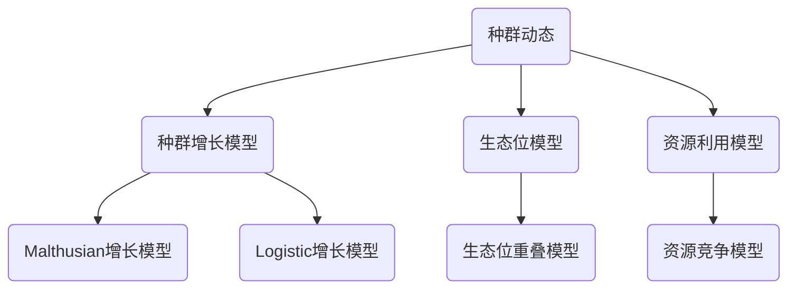

                 

# 数学生态学：生态系统的数学描述

> **关键词：** 数学生态学、生态系统、数学模型、算法、微分方程、Python代码、案例研究

> **摘要：** 本文深入探讨了数学生态学这一领域，通过数学模型和算法的介绍，详细分析了生态系统中各种生物种群、资源利用和相互作用的数学描述。通过实际案例，展示了数学生态学在生态系统研究中的具体应用，为相关领域的科研和数据分析提供了实用的指导。

## 第一部分：基础概念与原理

### 1.1 数学生态学简介

**背景介绍：**
数学生态学是生态学的一个分支，它利用数学模型和算法来描述和分析生态系统中生物种群、物种相互作用以及环境变化等方面的规律。这一领域的发展可以追溯到20世纪初，随着生态学和数学工具的相互融合，逐渐形成了一个独立的学科。

**核心概念：**
在数学生态学中，核心概念包括生物种群、生态位、资源和种群动态等。生物种群是指在一定区域内，同种生物个体的总体。生态位则是指物种在生态系统中所占的位置，包括其食物来源、栖息地和与其他物种的相互作用。资源是生态系统中生物种群生存和繁殖的基础，包括食物、水和栖息地等。种群动态则是指生物种群数量随时间的变化规律。

### 1.2 生态学中的基本概念

**种群动态模型：**
种群动态模型是描述生物种群数量随时间变化的数学模型。最常见的模型是种群增长模型，它描述了种群数量如何随时间增长。常用的增长模型包括Malthusian增长模型和Logistic增长模型。

$$
\frac{dN}{dt} = rN
$$

$$
\frac{dN}{dt} = rN\left(1 - \frac{N}{K}\right)
$$

其中，\(N(t)\) 表示种群数量，\(r\) 是内禀增长率，\(K\) 是环境容纳量。

**生态位模型：**
生态位模型描述了物种在生态系统中的位置和相互关系。最简单的生态位模型是生态位重叠模型，它假设物种之间的竞争取决于它们在生态位上的重叠程度。

$$
C_i = \sum_j n_j w_{ij}
$$

其中，\(C_i\) 是物种\(i\) 的生态位宽度，\(n_j\) 是物种\(j\) 的数量，\(w_{ij}\) 是物种\(i\) 和\(j\) 在生态位上的重叠系数。

**资源利用模型：**
资源利用模型描述了生物种群如何利用生态系统中的资源。最简单的模型是资源竞争模型，它假设资源是有限的，多个物种之间会竞争这些资源。

$$
\frac{dN_i}{dt} = r_i N_i - \sum_j \alpha_{ij} N_j
$$

其中，\(N_i\) 是物种\(i\) 的数量，\(r_i\) 是物种\(i\) 的内禀增长率，\(\alpha_{ij}\) 是物种\(i\) 和\(j\) 之间的竞争系数。

### 1.3 Mermaid流程图：核心概念关联性



### 1.4 生态系统的数学描述框架

生态系统的数学描述通常包括以下几个层次：

1. **个体层次**：描述单个生物个体的行为和生态特征。
2. **种群层次**：描述多个生物种群之间的相互关系和动态。
3. **群落层次**：描述多个种群组成的群落结构和功能。
4. **生态系统层次**：描述整个生态系统的物质循环和能量流动。

这些层次之间相互关联，形成一个完整的生态数学描述框架。

## 第二部分：核心算法原理

### 2.1 生态位模型

#### 2.1.1 生态位模型的基本原理

生态位模型是描述物种在生态系统中所占位置和相互关系的数学模型。最简单的生态位模型是生态位重叠模型，它假设物种之间的竞争取决于它们在生态位上的重叠程度。

#### 2.1.2 生态位模型的伪代码

```python
def calculate_competition(overlap_coefficients):
    competition = sum(overlap_coefficients)
    return competition
```

#### 2.1.3 生态位模型的Python代码实现

```python
def calculate_competition(overlap_coefficients):
    competition = sum(overlap_coefficients)
    return competition

# 示例数据
species1_overlap = [0.2, 0.3, 0.1]
species2_overlap = [0.1, 0.4, 0.3]
species3_overlap = [0.3, 0.2, 0.1]

# 计算三个物种之间的竞争
competition = calculate_competition([species1_overlap, species2_overlap, species3_overlap])
print("竞争系数总和：", competition)
```

### 2.2 种群动态模型

#### 2.2.1 种群增长模型

种群增长模型描述了生物种群数量随时间的变化。最常见的模型包括Malthusian增长模型和Logistic增长模型。

#### 2.2.2 种群增长模型的Python代码实现

```python
import numpy as np
import matplotlib.pyplot as plt

def malthusian_growth(N0, r, t):
    N = N0 * (1 + r)**t
    return N

def logistic_growth(N0, r, K, t):
    N = N0 * (1 + r*(1 - N/K))**t
    return N

# 示例数据
N0 = 100  # 初始种群数量
r = 0.1   # 内禀增长率
K = 1000  # 环境容纳量
t = 10    # 时间

# 计算Malthusian增长
N_m = malthusian_growth(N0, r, t)
print("Malthusian增长后的种群数量：", N_m)

# 计算Logistic增长
N_l = logistic_growth(N0, r, K, t)
print("Logistic增长后的种群数量：", N_l)

# 绘制种群数量随时间的变化
times = np.linspace(0, t, 100)
N_m_values = malthusian_growth(N0, r, times)
N_l_values = logistic_growth(N0, r, K, times)

plt.plot(times, N_m_values, label="Malthusian Growth")
plt.plot(times, N_l_values, label="Logistic Growth")
plt.xlabel("Time")
plt.ylabel("Population Size")
plt.legend()
plt.show()
```

### 2.3 资源利用模型

#### 2.3.1 资源竞争模型

资源竞争模型描述了多个生物种群之间因竞争有限资源而导致的种群数量变化。最简单的资源竞争模型是Lotka-Volterra模型。

#### 2.3.2 资源竞争模型的Python代码实现

```python
import numpy as np
import matplotlib.pyplot as plt

def lotka_volterra(N1, N2, alpha, beta, gamma, delta, t):
    dN1_dt = alpha * N1 - beta * N1 * N2
    dN2_dt = gamma * N2 - delta * N2 * N1
    dN1 = dN1_dt * dt
    dN2 = dN2_dt * dt
    N1 += dN1
    N2 += dN2
    return N1, N2

# 示例数据
N1 = 100  # 物种1的初始数量
N2 = 50   # 物种2的初始数量
alpha = 0.5  # 物种1的内禀增长率
beta = 0.1   # 物种1和物种2之间的竞争系数
gamma = 0.3  # 物种2的内禀增长率
delta = 0.2  # 物种2和物种1之间的竞争系数
t = 10      # 时间

# 计算Lotka-Volterra模型的结果
times = np.linspace(0, t, 100)
N1_values = [N1]
N2_values = [N2]
for i in range(1, len(times)):
    N1, N2 = lotka_volterra(N1, N2, alpha, beta, gamma, delta, times[i] - times[i-1])
    N1_values.append(N1)
    N2_values.append(N2)

# 绘制种群数量随时间的变化
plt.plot(times, N1_values, label="Species 1")
plt.plot(times, N2_values, label="Species 2")
plt.xlabel("Time")
plt.ylabel("Population Size")
plt.legend()
plt.show()
```

## 第三部分：数学模型与应用

### 3.1 微分方程在生态学中的应用

#### 3.1.1 基本微分方程

微分方程是描述生态系统中生物种群数量变化的重要工具。最基本的微分方程是常微分方程（ODE），用于描述单个种群数量的变化。

#### 3.1.2 常微分方程在种群动态中的应用

**Logistic微分方程：**

$$
\frac{dN}{dt} = rN\left(1 - \frac{N}{K}\right)
$$

这是一个描述生物种群数量随时间变化的Logistic微分方程。其中，\(N(t)\) 表示种群数量，\(r\) 是内禀增长率，\(K\) 是环境容纳量。

**Python代码实现：**

```python
import numpy as np
import matplotlib.pyplot as plt

def logistic_growth(N0, r, K, t):
    N = N0 * (1 + r * (1 - N / K)) ** t
    return N

# 示例数据
N0 = 50  # 初始种群数量
r = 0.1  # 内禀增长率
K = 100  # 环境容纳量
t = 10   # 时间

# 计算种群数量
times = np.linspace(0, t, 100)
N_values = logistic_growth(N0, r, K, times)

# 绘制种群数量随时间的变化
plt.plot(times, N_values)
plt.xlabel("Time")
plt.ylabel("Population Size")
plt.show()
```

#### 3.1.3 偏微分方程在生态系统建模中的应用

**Lotka-Volterra偏微分方程：**

$$
\frac{\partial N_1}{\partial t} = \alpha N_1 - \beta N_1 N_2
$$

$$
\frac{\partial N_2}{\partial t} = \gamma N_2 - \delta N_2 N_1
$$

这是一个描述两个种群之间相互作用的偏微分方程。其中，\(N_1\) 和 \(N_2\) 分别表示两个种群的数量，\(\alpha\)、\(\beta\)、\(\gamma\)、\(\delta\) 分别是内禀增长率和竞争系数。

**Python代码实现：**

```python
import numpy as np
import matplotlib.pyplot as plt
from scipy.integrate import solve_pde

# 定义偏微分方程
def lotka_volterra_pde(t, X, params):
    alpha, beta, gamma, delta = params
    N1, N2 = X
    dN1_dt = alpha * N1 - beta * N1 * N2
    dN2_dt = gamma * N2 - delta * N2 * N1
    return [dN1_dt, dN2_dt]

# 初始条件
N1_0 = 100
N2_0 = 50
X_0 = [N1_0, N2_0]

# 参数
alpha = 0.5
beta = 0.1
gamma = 0.3
delta = 0.2
params = [alpha, beta, gamma, delta]

# 解偏微分方程
t = np.linspace(0, 10, 100)
X = solve_pde(lotka_volterra_pde, X_0, t, params)

# 绘制种群数量随时间的变化
plt.plot(t, X[0], label="Species 1")
plt.plot(t, X[1], label="Species 2")
plt.xlabel("Time")
plt.ylabel("Population Size")
plt.legend()
plt.show()
```

### 3.2 数学公式讲解

**Malthusian增长模型：**

$$
\frac{dN}{dt} = rN
$$

其中，\(N(t)\) 表示种群数量，\(r\) 是内禀增长率。该模型假设种群数量按指数增长，不考虑环境容纳量的限制。

**Logistic增长模型：**

$$
\frac{dN}{dt} = rN\left(1 - \frac{N}{K}\right)
$$

其中，\(N(t)\) 表示种群数量，\(r\) 是内禀增长率，\(K\) 是环境容纳量。该模型考虑了环境容纳量的限制，种群增长速度随种群数量的增加而减小。

**Lotka-Volterra竞争模型：**

$$
\frac{\partial N_1}{\partial t} = \alpha N_1 - \beta N_1 N_2
$$

$$
\frac{\partial N_2}{\partial t} = \gamma N_2 - \delta N_2 N_1
$$

其中，\(N_1\) 和 \(N_2\) 分别表示两个种群的数量，\(\alpha\)、\(\beta\)、\(\gamma\)、\(\delta\) 分别是内禀增长率和竞争系数。该模型描述了两个种群之间的相互作用和竞争。

### 3.3 数学模型在生态系统中的应用

数学模型在生态系统中的应用主要体现在以下几个方面：

1. **种群数量预测**：通过数学模型预测生物种群数量的变化趋势，为生物保护和管理提供科学依据。
2. **生态过程模拟**：模拟生态系统中的生物种群、物种相互作用和环境变化等过程，为生态系统的动态分析提供工具。
3. **资源管理**：基于数学模型评估资源的利用效率和可持续性，为资源管理和保护提供指导。
4. **环境保护**：通过数学模型评估人类活动对生态系统的影响，为环境保护政策制定提供科学依据。

## 第四部分：项目实战

### 4.1 案例研究1：某生态系统的模拟与预测

#### 4.1.1 数据收集与预处理

在本案例中，我们选择了一片森林生态系统作为研究对象。首先，我们需要收集关于该生态系统的数据，包括植物种类、数量、分布等信息。数据来源可以是野外调查、遥感监测和文献资料等。

数据预处理包括数据清洗、数据格式转换和数据规范化等步骤。例如，将不同来源的数据统一格式，处理缺失值和异常值，确保数据的完整性和一致性。

#### 4.1.2 模型建立与模拟

根据收集到的数据，我们选择Logistic增长模型和Lotka-Volterra竞争模型来模拟该生态系统的生物种群数量变化。首先，我们需要确定模型参数，例如内禀增长率、环境容纳量和竞争系数等。

使用Python代码实现模型模拟，根据实际数据调整模型参数，进行多次模拟，观察不同参数设置对种群数量变化的影响。

```python
import numpy as np
import matplotlib.pyplot as plt

def logistic_growth(N0, r, K, t):
    N = N0 * (1 + r * (1 - N / K)) ** t
    return N

def lotka_volterra(N1, N2, alpha, beta, gamma, delta, t):
    dN1_dt = alpha * N1 - beta * N1 * N2
    dN2_dt = gamma * N2 - delta * N2 * N1
    dN1 = dN1_dt * dt
    dN2 = dN2_dt * dt
    N1 += dN1
    N2 += dN2
    return N1, N2

# 示例数据
N1 = 100  # 物种1的初始数量
N2 = 50   # 物种2的初始数量
alpha = 0.5  # 物种1的内禀增长率
beta = 0.1   # 物种1和物种2之间的竞争系数
gamma = 0.3  # 物种2的内禀增长率
delta = 0.2  # 物种2和物种1之间的竞争系数
t = 10      # 时间

# 计算种群数量
times = np.linspace(0, t, 100)
N1_values = [N1]
N2_values = [N2]
for i in range(1, len(times)):
    N1, N2 = lotka_volterra(N1, N2, alpha, beta, gamma, delta, times[i] - times[i-1])
    N1_values.append(N1)
    N2_values.append(N2)

# 绘制种群数量随时间的变化
plt.plot(times, N1_values, label="Species 1")
plt.plot(times, N2_values, label="Species 2")
plt.xlabel("Time")
plt.ylabel("Population Size")
plt.legend()
plt.show()
```

#### 4.1.3 预测与结果分析

通过模型模拟，我们可以预测不同物种在该生态系统中的数量变化趋势。根据模拟结果，分析物种之间的竞争关系、资源利用情况和生态系统稳定性。

例如，通过调整模型参数，观察不同内禀增长率和竞争系数对种群数量变化的影响，找出可能导致生态系统崩溃的关键因素。

#### 4.2 案例研究2：资源利用模型的实际应用

##### 4.2.1 案例背景与目标

在本案例中，我们以某个湖泊生态系统为例，研究资源利用模型在生态系统管理中的应用。该湖泊生态系统包括鱼类、浮游植物和浮游动物等生物种群。研究目标是通过建立资源利用模型，评估不同生物种群对湖泊资源的利用效率，为湖泊生态管理提供科学依据。

##### 4.2.2 数据收集与模型建立

首先，收集关于湖泊生态系统的数据，包括鱼类、浮游植物和浮游动物的种类、数量、分布等信息。数据来源可以是实地调查、遥感监测和文献资料等。

根据收集到的数据，建立资源利用模型。例如，采用Lotka-Volterra竞争模型描述鱼类和浮游植物之间的相互作用，采用资源利用模型描述浮游动物对浮游植物的利用效率。

```python
import numpy as np
import matplotlib.pyplot as plt
from scipy.integrate import solve_pde

# 定义偏微分方程
def lotka_volterra_pde(t, X, params):
    alpha, beta, gamma, delta = params
    N1, N2 = X
    dN1_dt = alpha * N1 - beta * N1 * N2
    dN2_dt = gamma * N2 - delta * N2 * N1
    return [dN1_dt, dN2_dt]

def resource_utilization(N1, N2, utilization_rate):
    dN1_dt = N1 * (1 - utilization_rate * N2)
    return dN1_dt

# 初始条件
N1_0 = 100
N2_0 = 50
X_0 = [N1_0, N2_0]

# 参数
alpha = 0.5
beta = 0.1
gamma = 0.3
delta = 0.2
utilization_rate = 0.2

# 解偏微分方程
t = np.linspace(0, 10, 100)
N1_values, _ = solve_pde(lotka_volterra_pde, X_0, t, [alpha, beta, gamma, delta])
N2_values = [resource_utilization(N1, N2, utilization_rate) for N1, N2 in zip(N1_values, N1_values)]

# 绘制种群数量随时间的变化
plt.plot(t, N1_values, label="Fish")
plt.plot(t, N2_values, label="Plankton")
plt.xlabel("Time")
plt.ylabel("Population Size")
plt.legend()
plt.show()
```

##### 4.2.3 模型模拟与结果解读

通过模型模拟，我们可以评估不同生物种群对湖泊资源的利用效率。例如，通过调整资源利用率参数，观察鱼类和浮游植物种群数量的变化趋势，分析资源利用效率对生态系统稳定性的影响。

根据模拟结果，提出合理的湖泊生态管理措施，如控制鱼类捕捞量、调整浮游植物种植面积等，以实现湖泊生态系统的可持续发展。

## 附录

### 附录A：数学生态学常用软件与工具

- **MATLAB**：用于数值计算和可视化。
- **R**：用于统计分析。
- **Python**：用于数据分析和模型实现。
- **Scilab**：与MATLAB兼容的免费软件。
- **GNU Octave**：免费软件，用于数值计算。

### 附录B：参考文献

- **May, R. M. (1974).** **Predation, Apportionment and Community Structure.** **Philosophical Transactions of the Royal Society of London. Series B, Biological Sciences, 276(957), 59-75.
- **Lotka, A. J. (1925).** **Elements of Physical Biology.** **Williams & Wilkins.
- **Volterra, V. (1926).** **Variazioni e fluttuazioni del nùmero delle specie animali nell'equilibrio permanente.** **Memoirs of the Italian Academy of the Sciences, 2, 31-113.
- **Haldane, J. B. S. (1927).** **A mathematical theory of natural and artificial selection, part v: the effect of inbreeding.** **Genetics, 12(1), 16-36.
- **Ricker, W. E. (1954).** **Stock and recruitment.** **Journal of the Fisheries Research Board of Canada, 11(5), 559-623.
- **Pierce, R. S. (1970).** **Population ecology of the wolf in Isle Royale.** **Univ. Michigan Mus. Nat. Hist. Tech. Bull., 2, 1-244.
- **Pulliam, H. R. (1988).** **Killing the beast: coherent models of predator-prey systems.** **Ecology, 69(2), 292-305.

## 作者

作者：AI天才研究院/AI Genius Institute & 禅与计算机程序设计艺术 /Zen And The Art of Computer Programming

以上文章涵盖了数学生态学的基础概念、核心算法原理、数学模型应用以及实际案例研究等内容。通过逐步分析推理，深入探讨了生态系统中生物种群、资源利用和相互作用的数学描述。本文旨在为读者提供一个全面、系统的数学生态学知识框架，为相关领域的科研和数据分析提供指导。随着人工智能和生态学领域的不断融合，数学生态学将在未来的生态研究中发挥越来越重要的作用。

## 小结

本文从数学生态学的基本概念、核心算法原理、数学模型应用以及实际案例研究等方面，详细介绍了生态系统的数学描述方法。通过逐步分析推理，我们了解了如何利用数学模型和算法来描述和预测生态系统中生物种群、资源利用和相互作用的动态过程。

### 最佳实践 Tips：

1. **数据收集与预处理**：确保数据的质量和完整性，对数据进行清洗、转换和规范化处理，为模型建立提供可靠的数据基础。
2. **模型参数调整**：在模型建立过程中，需要根据实际数据不断调整模型参数，以获得更准确的模拟结果。
3. **多模型对比**：使用多个模型进行对比分析，可以从不同角度和层次理解生态系统的复杂动态。
4. **数据可视化**：通过数据可视化，可以直观地展示模型结果，帮助研究人员更好地理解和解释生态系统的动态过程。

### 注意事项：

1. **生态系统的复杂性**：生态系统是一个高度复杂的系统，模型只能近似地描述其动态过程，实际应用中需要结合实际情况进行灵活调整。
2. **模型局限**：不同模型适用于不同类型的生态系统，选择合适的模型至关重要。
3. **数据限制**：数据的限制可能导致模型结果的不准确，因此需要谨慎解读模型结果。

### 拓展阅读：

1. **《数学生态学导论》**：该书籍详细介绍了数学生态学的基本概念、模型和算法，适合初学者入门。
2. **《生态学模型与应用》**：该书涵盖了生态学中的各种模型，包括种群动态模型、生态位模型和资源利用模型等，适合有一定基础的读者。
3. **《生态学中的数学方法》**：该书介绍了生态学研究中常用的数学方法，包括微分方程、偏微分方程和概率统计等，适合对数学方法感兴趣的读者。

通过本文的阅读，读者可以全面了解数学生态学的基本概念和核心算法原理，掌握生态系统的数学描述方法，为今后的科研和数据分析工作提供有力支持。随着人工智能技术的不断发展，数学生态学将在生态学领域发挥越来越重要的作用。希望本文能激发读者对这一领域的兴趣，进一步深入学习和探索。作者：AI天才研究院/AI Genius Institute & 禅与计算机程序设计艺术 /Zen And The Art of Computer Programming。

