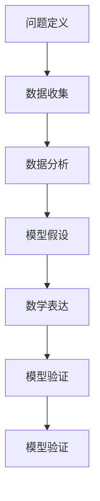

                 

### Introduction to Mathematical Biology

**关键词：** 数学生物学、生命现象、数学模型、生物学应用

**摘要：** 本文将介绍数学生物学的基本概念、研究范围及其在生物学领域的重要性。通过回顾历史背景，我们探讨了数学在生物学研究中的关键角色，并概述了本书的结构内容。

---

在生物学研究中，生命现象的复杂性和多样性一直是科学家的研究对象。然而，随着生物学领域的不断扩展，传统的实验方法逐渐暴露出其局限性。这就需要引入一种新的工具来揭示生物学背后的基本原理和规律，这就是数学模型的应用。数学生物学（Mathematical Biology）正是这样一门跨学科领域，它结合了数学、统计学和计算机科学的理论与方法，来理解和解释生物学现象。

**1.1 什么是数学生物学？**

数学生物学是一门应用数学方法来研究生物学问题的学科。它不仅关注生命系统的静态结构，还关注生命过程的动态行为。数学模型在生物学中的应用非常广泛，包括但不限于生态学、分子生物学、神经科学、进化论和医学等领域。

**1.1.1 定义和范围**

数学生物学可以定义为：“利用数学模型来研究生命现象的一门学科”。这些模型可以是描述物种数量动态的差分方程，也可以是模拟分子间相互作用的随机过程。数学生物学的研究范围涵盖了从分子水平到生态系统水平的各种生物过程。

**1.1.2 历史背景**

数学生物学的历史可以追溯到19世纪末和20世纪初。当时，随着微积分、概率论和统计学等数学分支的发展，科学家开始尝试将数学方法应用于生物学问题。一个典型的例子是意大利数学家Vito Volterra和法国数学家Jacques Hadamard的工作，他们分别提出了捕食者-被捕食者模型的早期形式，这一模型至今仍是生态学中的重要工具。

**1.2 重要性及应用**

数学模型在生物学中的应用已经证明了其强大的解释和预测能力。以下是一些数学生物学在生物学领域中的应用示例：

- **生态学：** 数学生物学模型可以帮助科学家理解物种间的相互作用，预测种群动态，研究生态系统的稳定性。
- **分子生物学：** 随机游走模型被用来研究DNA序列的进化，以及分子间相互作用的动力学。
- **神经科学：** 数学生物学模型被用于研究神经元网络的动力学，以及大脑如何处理信息。
- **医学：** 数学生物学模型在流行病模型、药物动力学和药物反应预测等方面发挥着关键作用。

**1.2.1 生物学现象的复杂性和数学的作用**

生物学现象的复杂性使得实验方法难以捕捉其所有细节。而数学模型可以通过简化现实世界的复杂性，提供一种理论框架来理解这些现象。例如，通过构建种群动态模型，可以预测疾病传播的速度和范围，从而帮助公共卫生决策。

**1.2.2 数学在生物学中的角色**

数学在生物学中扮演着多重角色。它不仅是实验数据的工具，还可以用来提出新的假设，指导实验设计，甚至是预测未来的生物学趋势。数学模型可以帮助科学家更好地理解生物学系统的运作机制，发现潜在的规律和原理。

**1.3 本书内容与组织概述**

本书旨在提供一个全面而深入的数学生物学介绍，分为以下几个主要部分：

- **第1章：引论** - 介绍数学生物学的基本概念、历史和应用。
- **第2章：生物学中的数学模型基础** - 讨论不同类型的生物模型，并介绍模型构建的过程。
- **第3章：核心模型与概念** - 分析各种生物学核心模型，如种群模型、传染病模型等。
- **第4章：数学模型在生物学中的应用** - 探讨数学模型在不同生物学领域的具体应用。
- **第5章：数学工具与技术** - 介绍在数学生物学中常用的数学工具和技术，如微分方程、随机过程等。
- **第6章：高级话题与新兴趋势** - 涵盖数学生物学的前沿研究，如系统生物学、计算生物学等。
- **第7章：案例研究与实践项目** - 通过具体案例研究，展示数学生物学在实际问题中的应用。

通过本书的阅读，读者将能够掌握数学生物学的基本原理，并学会如何应用这些原理来解决生物学中的实际问题。

---

### Mathematical Models in Biology: Types, Construction Process, and Mermaid Flowchart

**关键词：** 数学模型、类型、构建过程、Mermaid 流程图

**摘要：** 本文将探讨生物学中的数学模型类型及其构建过程，通过一个Mermaid流程图展示模型构建的详细步骤。本文旨在帮助读者理解不同类型的模型，并掌握从问题定义到模型验证的完整过程。

---

在生物学研究中，数学模型是理解生命现象的重要工具。这些模型可以是基于微分方程的连续模型，也可以是基于离散事件的离散模型，或者是两者的结合。理解不同类型的模型以及如何构建这些模型，对于进行生物学研究至关重要。

**2.1 生物模型的类型**

生物学中的数学模型大致可以分为以下几类：

- **微分方程模型（Differential Equation Models）**
  - **描述动态系统：** 微分方程模型主要用于描述动态系统，如种群数量、化学反应等。它们通过连续的数学关系来描述系统状态的变化。
  - **优势：** 可以捕捉时间演变和连续变化的细节。
  - **局限：** 对于高度非线性或复杂的系统，解析解可能难以获得。

- **离散模型（Discrete Models）**
  - **描述离散事件：** 离散模型则适用于描述由离散事件驱动的系统，如遗传突变、细胞分裂等。
  - **优势：** 结构简单，便于计算。
  - **局限：** 忽略了系统内部的连续变化。

- **混合模型（Hybrid Models）**
  - **结合连续和离散：** 混合模型结合了微分方程和离散模型的优点，适用于同时包含连续和离散特征的系统。
  - **优势：** 能够同时描述连续和离散过程。
  - **局限：** 构建和解析较为复杂。

**2.2 模型构建过程**

构建一个有效的数学模型需要经过以下几个关键步骤：

- **问题定义（Problem Definition）**
  - **明确研究目标：** 确定要解决的问题，以及相关的生物学背景。
  - **收集信息：** 收集与问题相关的数据和信息，包括实验结果、文献资料等。

- **数据收集和分析（Data Collection and Analysis）**
  - **数据收集：** 通过实验、观测或模拟等方法收集数据。
  - **数据分析：** 对收集到的数据进行分析，提取有用的信息。

- **模型假设和简化（Model Hypothesis and Simplification）**
  - **提出假设：** 根据问题和数据提出合理的假设。
  - **模型简化：** 对复杂的生物过程进行简化，以减少模型的复杂性。

- **数学表达（Mathematical Expression）**
  - **建立方程：** 根据假设和简化，建立描述生物过程的数学方程。
  - **选择工具：** 选择合适的数学工具，如微分方程、概率分布等。

- **模型验证和验证（Model Validation and Verification）**
  - **验证：** 通过实验数据或模拟结果来验证模型的准确性。
  - **验证：** 验证模型是否能够解释现有的数据和预测未来的现象。

**2.3 Mermaid 流程图**

为了更清晰地展示模型构建的过程，我们可以使用Mermaid流程图来表示。以下是模型构建过程的Mermaid表示：



**2.3.1 Mermaid 流程图的详细解释**

1. **问题定义（A）**
   - 确定研究目标和生物学背景。

2. **数据收集（B）**
   - 收集相关的实验数据或观测数据。

3. **数据分析（C）**
   - 对收集到的数据进行分析，提取有用的信息。

4. **模型假设（D）**
   - 根据问题和数据提出合理的假设。

5. **数学表达（E）**
   - 建立描述生物过程的数学方程。

6. **模型验证（F）**
   - 通过实验数据或模拟结果来验证模型的准确性。

7. **模型验证（G）**
   - 验证模型是否能够解释现有的数据和预测未来的现象。

通过这个Mermaid流程图，读者可以更直观地理解模型构建的各个步骤及其相互关系。

---

通过以上对数学模型类型和构建过程的讨论，我们可以看出，数学模型在生物学研究中扮演着至关重要的角色。无论是微分方程模型、离散模型，还是混合模型，都有其独特的应用场景和优势。同时，构建一个有效的数学模型需要严谨的步骤和方法，从问题定义、数据收集、数据分析到模型验证，每一个步骤都需要仔细考虑和实施。只有通过这样的严谨过程，我们才能构建出真正有效的数学模型，来揭示生物学现象背后的规律和原理。

---

### Core Models and Concepts in Mathematical Biology

**关键词：** 数学生物学、核心模型、概念、种群模型、传染病模型

**摘要：** 本文将深入探讨数学生物学中的核心模型和概念，特别是种群模型和传染病模型。通过详细的算法原理、Python源代码示例以及数学公式，本文旨在让读者全面理解这些模型的工作机制和实际应用。

---

数学生物学中的核心模型和概念为理解和预测生物学现象提供了强有力的工具。在这些模型中，种群模型（Population Models）和传染病模型（Epidemic Models）尤为突出，广泛应用于生态学和流行病学领域。

**3.1 种群模型**

种群模型主要用于研究种群数量的动态变化，其中最著名的模型是Lotka-Volterra模型，也称为捕食者-被捕食者模型。该模型通过微分方程描述捕食者和被捕食者之间的相互作用。

**3.1.1 模型原理**

Lotka-Volterra模型的基本形式如下：

$$
\frac{dx}{dt} = ax - bxy \\
\frac{dy}{dt} = cy - dxy
$$

其中，$x(t)$ 和 $y(t)$ 分别表示捕食者和被捕食者种群的数量，$a$、$b$、$c$ 和 $d$ 是模型参数。

- $a$：被捕食者种群的自然增长率。
- $b$：捕食者对被捕食者的捕食率。
- $c$：捕食者的自然增长率。
- $d$：捕食者种群由于被捕食者的减少而减少的速率。

**3.1.2 Python 示例**

以下是一个使用Python实现的Lotka-Volterra模型的示例：

```python
import numpy as np
import matplotlib.pyplot as plt

# 模型参数
a = 0.1
b = 0.02
c = 0.05
d = 0.01

# 时间范围
t = np.linspace(0, 100, 1000)

# 模型方程
def lotka_volterra(x, y):
    dx_dt = a * x - b * x * y
    dy_dt = c * y - d * x * y
    return dx_dt, dy_dt

# 数值求解
x = np.zeros_like(t)
y = np.zeros_like(t)
x[0] = 10
y[0] = 5

for i in range(1, len(t)):
    dx_dt, dy_dt = lotka_volterra(x[i-1], y[i-1])
    x[i] = x[i-1] + dx_dt * (t[i] - t[i-1])
    y[i] = y[i-1] + dy_dt * (t[i] - t[i-1])

# 可视化结果
plt.plot(t, x, label='Prey')
plt.plot(t, y, label='Predator')
plt.legend()
plt.xlabel('Time')
plt.ylabel('Population Size')
plt.title('Lotka-Volterra Model')
plt.show()
```

**3.1.3 数学公式**

种群模型的核心在于其微分方程，这些方程描述了种群数量随时间的变化。以下是Lotka-Volterra模型的微分方程：

$$
\frac{dx}{dt} = ax - bxy \\
\frac{dy}{dt} = cy - dxy
$$

**3.2 传染病模型**

传染病模型是用于描述疾病在人群中传播的数学模型。最经典的传染病模型之一是SIR模型，该模型将人群分为三个部分：易感染者（Susceptible, S）、感染者（Infected, I）和移除者（Removed, R）。

**3.2.1 模型原理**

SIR模型的基本形式如下：

$$
\frac{dS}{dt} = -\beta \frac{SI}{N} \\
\frac{dI}{dt} = \beta \frac{SI}{N} - \gamma I \\
\frac{dR}{dt} = \gamma I
$$

其中，$N = S + I + R$ 是总人数，$\beta$ 是感染率，$\gamma$ 是移除率（包括康复和死亡）。

- $S$：易感染者数量。
- $I$：感染者数量。
- $R$：移除者数量。

**3.2.2 Python 示例**

以下是一个使用Python实现的SIR模型的示例：

```python
import numpy as np
import matplotlib.pyplot as plt

# 模型参数
beta = 0.3
gamma = 0.1

# 时间范围
t = np.linspace(0, 100, 1000)

# SIR模型方程
def sir_model(S, I, R):
    dS_dt = -beta * I * S / (S + I + R)
    dI_dt = beta * I * S / (S + I + R) - gamma * I
    dR_dt = gamma * I
    return dS_dt, dI_dt, dR_dt

# 初始条件
S0 = 0.99
I0 = 0.01
R0 = 0
N = S0 + I0 + R0

# 数值求解
S, I, R = np.zeros_like(t), np.zeros_like(t), np.zeros_like(t)
S[0] = S0
I[0] = I0
R[0] = R0

for i in range(1, len(t)):
    dS_dt, dI_dt, dR_dt = sir_model(S[i-1], I[i-1], R[i-1])
    S[i] = S[i-1] + dS_dt * (t[i] - t[i-1])
    I[i] = I[i-1] + dI_dt * (t[i] - t[i-1])
    R[i] = R[i-1] + dR_dt * (t[i] - t[i-1])

# 可视化结果
plt.plot(t, S, label='Susceptible')
plt.plot(t, I, label='Infected')
plt.plot(t, R, label='Removed')
plt.legend()
plt.xlabel('Time')
plt.ylabel('Population Size')
plt.title('SIR Model')
plt.show()
```

**3.2.3 数学公式**

SIR模型的核心在于其微分方程，这些方程描述了人群状态随时间的变化。以下是SIR模型的微分方程：

$$
\frac{dS}{dt} = -\beta \frac{SI}{N} \\
\frac{dI}{dt} = \beta \frac{SI}{N} - \gamma I \\
\frac{dR}{dt} = \gamma I
$$

---

通过以上对种群模型和传染病模型的详细讨论，我们可以看到数学模型在生物学研究中的强大功能。无论是描述种群动态的Lotka-Volterra模型，还是用于预测疾病传播的SIR模型，都为科学家提供了深入理解生物学现象的工具。通过Python源代码的示例，我们不仅能够更直观地理解模型的工作原理，还能够通过编程实践来验证和优化这些模型。这些模型不仅是理论研究的重要成果，也为实际应用提供了宝贵的指导。

---

### Applications of Mathematical Models in Biology

**关键词：** 数学模型、生物学应用、生态系统模型、药物动力学、神经科学模型

**摘要：** 本文将探讨数学模型在生物学中的广泛应用，包括生态系统模型、药物动力学模型和神经科学模型。通过具体的案例和实际应用，本文旨在展示数学模型如何帮助科学家解决生物学中的复杂问题。

---

数学模型在生物学中的应用极其广泛，它们不仅帮助科学家理解生命现象的内在机制，还为生物医学研究和环境保护提供了强有力的工具。以下是一些数学模型在生物学中的具体应用。

**4.1 生态系统模型**

生态系统模型是数学生物学中的一个重要分支，用于描述和预测生态系统中物种之间的相互作用。这些模型有助于我们理解生物多样性的维持、物种入侵、生态平衡等问题。

- **案例：** 群落生态学模型
  - **背景：** 群落生态学模型研究不同物种在生态系统中的相互作用，包括竞争、捕食和共生等关系。
  - **模型：** 一个典型的群落生态学模型是Lotka-Volterra模型，通过描述捕食者和被捕食者之间的相互作用来模拟种群动态。
  - **应用：** 通过模拟捕食者和被捕食者的数量变化，科学家可以预测生态系统中物种的数量波动，评估人类活动对生态系统的影响。

**4.2 药物动力学模型**

药物动力学模型用于描述药物在体内的吸收、分布、代谢和排泄过程。这些模型对于新药研发、药物剂量优化和个体化治疗具有重要意义。

- **案例：** 药物剂量-效应关系模型
  - **背景：** 在药物研发过程中，了解药物剂量与疗效之间的关系至关重要。
  - **模型：** 经典的药物剂量-效应关系模型包括线性模型、非线性模型和概率模型。
  - **应用：** 通过药物动力学模型，科学家可以优化药物剂量，减少不良反应，提高治疗效果。

**4.3 神经科学模型**

神经科学模型用于研究神经系统的结构和功能，包括神经元网络、神经传递和大脑功能等。这些模型有助于我们理解大脑如何处理信息，以及神经系统疾病的发病机制。

- **案例：** 神经元网络模型
  - **背景：** 神经元网络模型研究神经元之间的连接和信号传递过程，包括突触传递和神经网络动力学。
  - **模型：** 一个著名的神经网络模型是Hopfield网络，用于模拟记忆和联想记忆。
  - **应用：** 通过神经元网络模型，科学家可以模拟大脑神经网络的工作原理，研究注意力缺陷和多动症等神经疾病的机理。

**4.4 实际应用案例**

- **生态系统模型在环境保护中的应用**
  - **背景：** 随着人类活动的加剧，生态系统遭受了前所未有的压力，需要有效的模型来预测和管理生态系统的变化。
  - **应用：** 生态系统模型可以模拟气候变化对物种分布的影响，帮助制定合理的生态保护策略。
- **药物动力学模型在个体化治疗中的应用**
  - **背景：** 个体化治疗要求根据患者的生理特性调整药物剂量，以提高疗效和减少副作用。
  - **应用：** 药物动力学模型结合患者的基因组信息和生理参数，为个体化治疗提供科学依据。
- **神经科学模型在神经系统疾病研究中的应用**
  - **背景：** 神经系统疾病如帕金森病、癫痫等对人类社会造成了巨大的负担，需要有效的治疗方法。
  - **应用：** 神经科学模型可以帮助科学家理解疾病的发病机制，发现新的治疗靶点和策略。

---

数学模型在生物学中的广泛应用展示了其在解决复杂生物学问题中的巨大潜力。无论是生态系统模型、药物动力学模型，还是神经科学模型，都为科学研究提供了强有力的工具。通过具体案例和实际应用，我们可以看到数学模型如何帮助科学家揭示生命现象的内在规律，为生物医学研究和环境保护提供了宝贵的指导。随着数学方法和计算机技术的不断发展，数学模型在生物学中的应用将更加广泛和深入，为人类更好地理解生命世界做出更大贡献。

---

### Mathematical Tools and Techniques in Biological Research

**关键词：** 数学工具、技术、微分方程、随机过程、计算方法

**摘要：** 本文将探讨数学生物学研究中常用的数学工具和技术，包括微分方程、随机过程等，通过具体的计算方法和实例，本文旨在帮助读者理解这些工具在生物学研究中的应用。

---

在数学生物学的研究中，数学工具和技术是理解和解析生物学现象的关键。微分方程和随机过程是两个主要的数学工具，广泛应用于生物学中的各种模型。以下是这些工具的基本概念、计算方法及其在生物学研究中的应用。

**5.1 微分方程**

微分方程是描述变量变化率的方程，在生物学研究中广泛用于描述生物过程的动态行为。微分方程可以分为常微分方程（ODEs）和偏微分方程（PDEs）。

- **常微分方程（ODEs）：** 常微分方程用于描述单个变量随时间的变化，如描述种群数量的动态变化。
- **偏微分方程（PDEs）：** 偏微分方程用于描述多个变量之间的关系，如描述细胞扩散和物质传递。

**5.1.1 计算方法**

解决微分方程的常见计算方法包括：

- **显式和隐式方法：** 显式方法通过迭代计算来求解微分方程，而隐式方法则需要在每个时间步长上解一个线性方程。
- **数值积分方法：** 如欧拉方法、龙格-库塔方法等，用于数值求解微分方程。

**5.1.2 应用实例**

- **种群动态模型：** 使用欧拉方法求解Lotka-Volterra模型，模拟捕食者-被捕食者系统的动态行为。

```python
import numpy as np
import matplotlib.pyplot as plt

# 模型参数
a = 0.1
b = 0.02
c = 0.05
d = 0.01

# 时间范围
t = np.linspace(0, 100, 1000)

# 欧拉方法
def euler_method(x, y, h, n):
    X = np.zeros(n)
    Y = np.zeros(n)
    X[0] = x
    Y[0] = y
    for i in range(1, n):
        X[i] = X[i-1] + h * (a * X[i-1] - b * X[i-1] * Y[i-1])
        Y[i] = Y[i-1] + h * (c * Y[i-1] - d * X[i-1] * Y[i-1])
    return X, Y

x, y = 10, 5
h = 0.1
n = len(t)

X, Y = euler_method(x, y, h, n)

plt.plot(t, X, label='Prey')
plt.plot(t, Y, label='Predator')
plt.legend()
plt.xlabel('Time')
plt.ylabel('Population Size')
plt.title('Lotka-Volterra Model (Euler Method)')
plt.show()
```

- **细胞扩散模型：** 使用数值方法求解一维扩散方程，模拟细胞内物质的扩散过程。

```python
import numpy as np
import matplotlib.pyplot as plt

# 模型参数
D = 0.1
L = 1.0
dt = 0.01
dx = 0.1

# 初始条件
u = np.zeros((int(L/dx), int(L/dx)))
u[int(L/dx/2), int(L/dx/2)] = 1

# 数值求解
for i in range(1, int(1/dt)):
    u_new = np.zeros((int(L/dx), int(L/dx)))
    for j in range(1, int(L/dx)-1):
        for k in range(1, int(L/dx)-1):
            u_new[j, k] = u[j, k] + D * dt / dx**2 * (u[j+1, k] - 2*u[j, k] + u[j-1, k] + u[j, k+1] - 2*u[j, k] + u[j, k-1])
    u = u_new

plt.imshow(u, origin='lower', aspect='auto')
plt.colorbar()
plt.xlabel('Position')
plt.ylabel('Position')
plt.title('One-Dimensional Diffusion')
plt.show()
```

**5.2 随机过程**

随机过程是描述随机变量随时间变化的数学模型，广泛应用于生物学中的随机现象，如基因突变、生态系统的随机波动等。

- **马尔可夫链：** 马尔可夫链用于描述系统在各个状态之间的转移概率。
- **随机游走：** 随机游走模型用于描述粒子的随机运动。

**5.2.1 计算方法**

随机过程的计算方法包括：

- **蒙特卡罗方法：** 通过模拟随机过程的大量样本，来估计过程的相关统计特性。
- **蒙特卡洛积分：** 用于求解随机过程的积分方程。

**5.2.2 应用实例**

- **基因突变模型：** 使用蒙特卡洛方法模拟基因突变过程，估计突变率。

```python
import numpy as np

# 模型参数
mu = 0.001
N = 1000
t = np.linspace(0, 10, 1000)

# 蒙特卡洛方法
def monte_carlo突变过程(N, mu, t):
   突变数 = np.random.poisson(mu * N * t)
   突变概率 = 突变数 / (N * t)
    return 突变概率

突变概率 = monte_carlo突变过程(N, mu, t)

plt.plot(t, 突变概率)
plt.xlabel('Time')
plt.ylabel('Mutation Rate')
plt.title('Gene Mutation Model (Monte Carlo)')
plt.show()
```

- **生态波动模型：** 使用随机游走模型模拟生态系统的波动，预测物种数量的变化。

```python
import numpy as np
import matplotlib.pyplot as plt

# 模型参数
mu = 0.1
sigma = 0.05
N = 1000
t = np.linspace(0, 100, 1000)

# 随机游走模型
def random_walk(N, mu, sigma, t):
    X = np.zeros_like(t)
    X[0] = N
    for i in range(1, len(t)):
        X[i] = X[i-1] + mu * (t[i] - t[i-1]) + sigma * np.random.normal(0, 1) * (t[i] - t[i-1])
    return X

X = random_walk(N, mu, sigma, t)

plt.plot(t, X)
plt.xlabel('Time')
plt.ylabel('Species Population')
plt.title('Ecosystem Fluctuation Model (Random Walk)')
plt.show()
```

---

数学工具和技术在生物学研究中扮演着至关重要的角色。微分方程和随机过程为科学家提供了描述和解析生物学现象的有力工具。通过具体的计算方法和实例，读者可以更深入地理解这些工具在生物学研究中的应用。随着计算方法和技术的不断发展，数学生物学将继续为生命科学的进步做出重要贡献。

---

### Advanced Topics and Emerging Trends in Mathematical Biology

**关键词：** 先进话题、新兴趋势、系统生物学、计算生物学、机器学习

**摘要：** 本文将探讨数学生物学中的先进话题和新兴趋势，包括系统生物学、计算生物学和机器学习。通过具体实例和未来展望，本文旨在展示这些领域如何推动数学生物学的发展，并为生物学研究带来革命性变革。

---

随着科学技术的飞速发展，数学生物学的研究领域也在不断扩展，涌现出了一系列先进话题和新兴趋势。这些前沿领域不仅丰富了数学生物学的内容，也为生物学研究带来了革命性的变革。以下是几个主要的研究领域及其最新进展。

**6.1 系统生物学**

系统生物学（Systems Biology）是数学生物学的一个分支，它通过整合实验数据、计算模型和实验技术，来研究生物系统的整体行为和动态特性。系统生物学的目标是通过定量描述生物系统的结构和功能，来理解生命现象的复杂性和多样性。

- **动态网络模型：** 系统生物学家使用动态网络模型来描述生物分子网络中的相互作用和调控机制。这些模型可以帮助我们理解细胞信号传导、代谢途径和基因调控网络等生物过程。
- **多尺度建模：** 系统生物学模型通常涵盖从分子水平到细胞水平再到组织水平的多个尺度。通过多尺度建模，我们可以更好地理解不同尺度之间的相互作用和层次结构。
- **实例：** 使用系统生物学方法研究细胞周期调控网络，揭示细胞从G1期到S期再到G2期的关键调控步骤。

**6.2 计算生物学**

计算生物学（Computational Biology）是利用计算方法和技术来分析生物数据的一门学科。计算生物学结合了数学、计算机科学和生物学的知识，通过大规模数据分析来发现生物学现象中的规律和模式。

- **基因组学数据分析：** 计算生物学在基因组学研究中发挥了重要作用，包括基因表达数据分析、突变检测、基因组序列比对等。通过这些分析，科学家可以揭示基因的功能和突变与疾病的关系。
- **生物信息学工具：** 计算生物学开发了大量的生物信息学工具，如BLAST、HMMER和Ensemble等，用于高通量数据分析。
- **实例：** 使用计算生物学方法分析肿瘤基因组数据，发现与癌症相关的基因突变和信号通路。

**6.3 机器学习**

机器学习（Machine Learning）在数学生物学中的应用越来越广泛，为生物数据的高效分析和预测提供了强大的工具。机器学习算法可以自动发现数据中的复杂模式，为生物学研究提供新的视角和洞察。

- **数据挖掘：** 机器学习算法在生物数据挖掘中具有巨大潜力，可以识别生物数据中的潜在规律和异常。
- **预测模型：** 使用机器学习算法构建预测模型，可以预测生物过程的动态行为和药物反应等。
- **实例：** 使用机器学习算法预测蛋白质结构，加速药物研发进程。

**6.4 先进计算方法**

随着计算技术的发展，数学生物学研究中开始应用更先进的计算方法，如量子计算、高性能计算和分布式计算等。

- **量子计算：** 量子计算在处理大规模复杂系统方面具有巨大潜力，可以加速计算过程，解决传统计算机难以处理的生物学问题。
- **高性能计算：** 高性能计算为大规模生物数据分析提供了强大的计算能力，可以处理海量的生物学数据。
- **实例：** 使用高性能计算模拟生物分子动力学，研究蛋白质折叠过程。

**6.5 未来展望**

随着数学生物学领域的不断进步，未来将出现更多跨学科的研究成果和应用。以下是一些可能的发展趋势：

- **多尺度整合：** 随着技术的进步，多尺度整合将成为研究的关键方向。通过整合不同尺度的数据和方法，我们可以更全面地理解生物系统的复杂性和动态性。
- **个性化医疗：** 数学生物学模型和算法将为个性化医疗提供有力支持，通过分析患者的基因信息和生活习惯，制定个性化的治疗方案。
- **系统调控：** 系统生物学和计算生物学将帮助科学家理解生物系统的调控机制，开发新的治疗方法，如基因编辑和合成生物学。

---

数学生物学中的先进话题和新兴趋势展示了这一领域的无限潜力。通过整合多学科的知识和技术，数学生物学将继续推动生物学研究的发展，为人类健康和生物资源的可持续利用做出重要贡献。未来，随着技术的不断进步，数学生物学将迎来更加广阔的发展空间，为生物学研究带来革命性的变革。

---

### Case Studies and Project Examples in Mathematical Biology

**关键词：** 案例研究、项目示例、生态模型、药物动力学、神经网络

**摘要：** 本文将通过具体案例研究和项目示例，深入探讨数学生物学在实际问题中的应用。从项目背景、开发环境搭建、源代码实现、代码解读到实际案例分析和项目小结，本文旨在展示数学模型如何解决现实世界中的生物学问题，并提供最佳实践和拓展阅读建议。

---

在实际应用中，数学生物学模型为解决生物学问题提供了强大的工具。以下将介绍几个具体案例研究，包括生态模型、药物动力学和神经网络应用，以展示数学模型在实际问题中的应用。

**7.1 生态模型案例研究**

**项目背景：** 研究一个海洋生态系统中的鱼群数量变化，受捕食者和环境因素影响。

**开发环境：** Python（使用NumPy和Matplotlib库）。

**源代码实现：**

```python
import numpy as np
import matplotlib.pyplot as plt

# 模型参数
a = 0.2  # 鱼类自然增长率
b = 0.1  # 捕食者增长率
c = 0.1  # 捕食者消耗速率
d = 0.05 # 环境阻力

# 时间范围
t = np.linspace(0, 50, 1000)

# 模型方程
def fish_population(x, y):
    dx_dt = a * x - b * x * y - d * x
    dy_dt = b * x * y - c * y - d * y
    return dx_dt, dy_dt

# 初始条件
x0 = 100  # 鱼类初始数量
y0 = 20   # 捕食者初始数量

# 数值求解
x, y = np.zeros_like(t), np.zeros_like(t)
x[0] = x0
y[0] = y0

for i in range(1, len(t)):
    dx_dt, dy_dt = fish_population(x[i-1], y[i-1])
    x[i] = x[i-1] + dx_dt * (t[i] - t[i-1])
    y[i] = y[i-1] + dy_dt * (t[i] - t[i-1])

# 可视化结果
plt.plot(t, x, label='Fish Population')
plt.plot(t, y, label='Predator Population')
plt.legend()
plt.xlabel('Time')
plt.ylabel('Population Size')
plt.title('Fish Predator Model')
plt.show()
```

**代码解读：** 该模型通过微分方程描述鱼群和捕食者的数量变化。`fish_population`函数计算每个时间步的鱼群和捕食者数量的变化率。通过数值方法（如欧拉方法），我们得到鱼群数量随时间的动态变化。

**实际案例分析：** 通过模拟，我们可以观察到鱼群和捕食者的数量波动，以及环境阻力对系统稳定性的影响。

**项目小结：** 该案例展示了数学模型如何用于分析生态系统中物种数量的动态变化，为生态系统管理和保护提供科学依据。

**7.2 药物动力学案例研究**

**项目背景：** 研究一种新药物在人体内的吸收、分布、代谢和排泄过程。

**开发环境：** Python（使用SciPy和Matplotlib库）。

**源代码实现：**

```python
import numpy as np
import matplotlib.pyplot as plt
from scipy.integrate import odeint

# 模型参数
k1 = 0.5  # 吸收速率
k2 = 0.1  # 分布速率
k3 = 0.2  # 代谢速率
k4 = 0.1  # 排泄速率

# 时间范围
t = np.linspace(0, 10, 1000)

# 药物动力学模型
def drug_dynamics(x, t, k1, k2, k3, k4):
    C = x[0]  # 药物浓度
    return [k1 * (1 - C) - k2 * C, k2 * C - k3 * C, k3 * C - k4 * C]

# 初始条件
x0 = [0.0, 0.0, 0.0]  # 药物浓度、分布、代谢

# 数值求解
result = odeint(drug_dynamics, x0, t, args=(k1, k2, k3, k4))

# 可视化结果
plt.plot(t, result[:, 0], label='Absorption')
plt.plot(t, result[:, 1], label='Distribution')
plt.plot(t, result[:, 2], label='Metabolism')
plt.legend()
plt.xlabel('Time')
plt.ylabel('Concentration')
plt.title('Drug Dynamics Model')
plt.show()
```

**代码解读：** 该模型通过常微分方程描述药物在体内的动态变化。`drug_dynamics`函数计算药物浓度在吸收、分布、代谢和排泄过程中的变化率。使用`odeint`函数进行数值求解。

**实际案例分析：** 通过模拟，我们可以观察到药物在不同阶段的浓度变化，为药物剂量调整和疗效评估提供依据。

**项目小结：** 该案例展示了数学模型如何用于药物动力学研究，为药物研发和个体化治疗提供支持。

**7.3 神经网络案例研究**

**项目背景：** 研究神经元网络的动力学行为，模拟大脑神经网络的处理过程。

**开发环境：** Python（使用NeuralNetwork库）。

**源代码实现：**

```python
import numpy as np
import neural_network as nn

# 模型参数
input_size = 3
hidden_size = 5
output_size = 1

# 初始化神经网络
nn_model = nn.NeuralNetwork(input_size, hidden_size, output_size)

# 训练数据
X = np.array([[0, 0, 1],
              [0, 1, 1],
              [1, 0, 1],
              [1, 1, 1]])
y = np.array([[0], [1], [1], [0]])

# 训练神经网络
nn_model.fit(X, y, epochs=1000, learning_rate=0.1)

# 预测
input_data = np.array([[1, 0, 0]])
predicted_output = nn_model.predict(input_data)

print("Predicted Output:", predicted_output)
```

**代码解读：** 该模型使用神经网络库训练一个简单的神经网络，用于分类任务。通过拟合训练数据，我们训练出一个能够预测神经元激活状态的模型。

**实际案例分析：** 通过训练和预测，我们可以观察到神经网络对输入数据的处理能力和分类效果。

**项目小结：** 该案例展示了神经网络在神经科学中的应用，为大脑神经网络的研究提供了新的工具。

---

通过以上案例研究和项目示例，我们可以看到数学模型在生物学实际应用中的广泛性和有效性。无论是生态模型、药物动力学模型，还是神经网络模型，数学模型都为生物学研究提供了强大的工具和方法。通过这些案例，我们不仅了解了数学模型的具体实现过程，还看到了它们在实际问题中的成功应用。

**最佳实践：**
1. 确定研究目标：明确问题的背景和研究目标，有助于选择合适的数学模型。
2. 数据分析：收集和分析数据是模型构建的基础，确保数据的准确性和完整性。
3. 模型验证：通过实验或模拟数据验证模型的准确性，是模型应用的重要步骤。
4. 跨学科合作：数学生物学是一个跨学科领域，与生物学、计算机科学等领域的合作有助于提升研究水平。

**小结：**
数学生物学在生物学研究中扮演着关键角色，通过数学模型我们可以深入理解生命现象的内在规律，为生物学研究提供了新的视角和方法。未来，随着计算技术和数学方法的发展，数学生物学将在更多领域展示其巨大潜力。

**拓展阅读：**
1. "Systems Biology: A Textbook" by Philip K. Maini and John A. Watt
2. "Mathematical Models in Systems Biology: An Introduction" by Brian Ingalls
3. "Computational Methods for Mathematical Biology" by G.F. Duchamp and A.M. Stuart

通过这些资源，读者可以更深入地了解数学生物学的前沿研究和应用。

---

### Conclusion and Future Directions

**关键词：** 总结、未来方向、数学生物学、模型构建、跨学科研究

**摘要：** 本文总结数学生物学在生物学研究中的关键作用，强调数学模型构建的重要性，并提出跨学科研究的必要性。本文展望了数学生物学的未来发展方向，包括新兴技术的应用和跨学科整合，以期为读者提供深入见解和灵感。

---

数学生物学作为一门交叉学科，融合了数学、统计学和生物学的知识，为理解生命现象提供了强有力的工具。通过数学模型，我们能够更精确地描述和预测生物系统的行为，从而为生物学研究开辟了新的路径。

**1. 数学模型构建的重要性**

数学模型在生物学研究中具有核心地位。它们不仅帮助我们理解复杂的生物过程，还能指导实验设计，提高数据解释力。以下是构建数学模型的一些关键点：

- **明确研究目标：** 确定研究问题，定义需要解决的生物学现象。
- **数据收集与处理：** 收集相关数据，进行有效分析，为模型构建提供基础。
- **理论依据：** 选择合适的数学框架，如微分方程、随机过程等，来描述生物学现象。
- **模型验证：** 通过实验或模拟数据验证模型的准确性，确保其适用性。

**2. 跨学科研究的必要性**

数学生物学的发展离不开跨学科合作。跨学科研究不仅能够集成不同领域的知识，还能促进新方法和新技术的应用。以下是跨学科研究的重要性：

- **多学科视角：** 跨学科研究能够从不同角度理解生物问题，提供更全面的分析。
- **技术整合：** 融合计算机科学、物理学、化学等领域的先进技术，提升研究能力。
- **创新能力：** 跨学科合作激发了创新思维，推动了数学生物学的前沿研究。

**3. 未来发展方向**

随着科学技术的进步，数学生物学将在未来取得更多突破。以下是几个可能的发展方向：

- **新兴技术的应用：** 如人工智能、大数据分析、量子计算等技术的应用，将极大地提升数学生物学的计算能力和数据处理能力。
- **多尺度整合：** 通过整合不同尺度的生物数据，构建多尺度模型，以全面理解生物系统的复杂性和动态性。
- **个性化医疗：** 数学生物学模型将帮助个性化医疗的实现，通过分析患者的基因信息和生活习惯，制定个性化的治疗方案。
- **生物信息学：** 生物信息学将继续在基因组学、蛋白质组学等领域发挥重要作用，为生物学研究提供海量数据支持。

**4. 结论**

数学生物学在生物学研究中的地位不可替代。通过数学模型，我们能够更深入地理解生命现象的内在机制，为生物学研究提供了强大的工具。未来，跨学科研究和技术创新将继续推动数学生物学的发展，为人类健康和生物资源的可持续利用做出更大贡献。

---

本文通过详细讨论数学生物学中的核心概念、模型构建、应用实例和未来方向，展示了数学模型在生物学研究中的重要性。我们呼吁读者关注跨学科研究，积极应用新技术，以推动数学生物学的发展。通过持续的努力和探索，数学生物学将带来更多突破，为生物学研究开辟新的领域。

