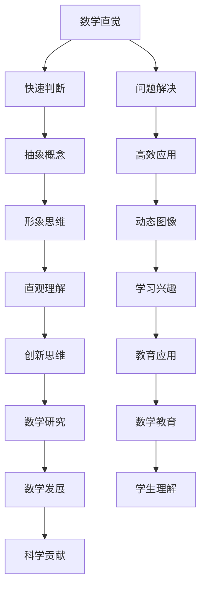
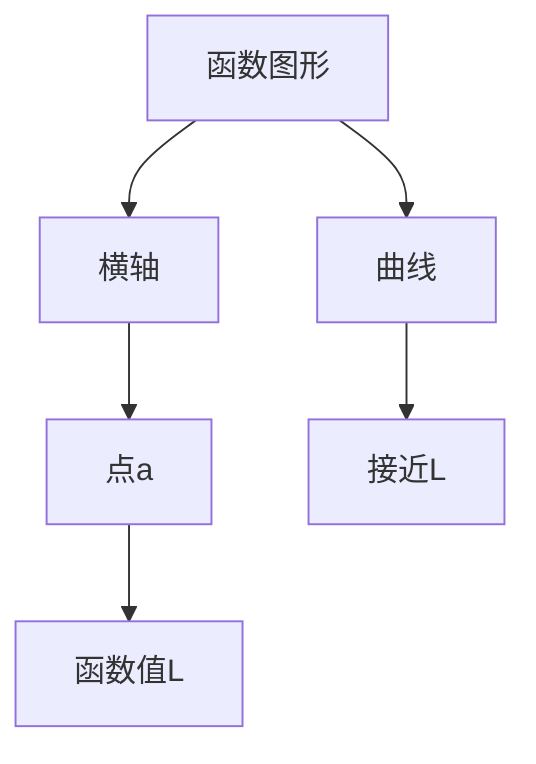
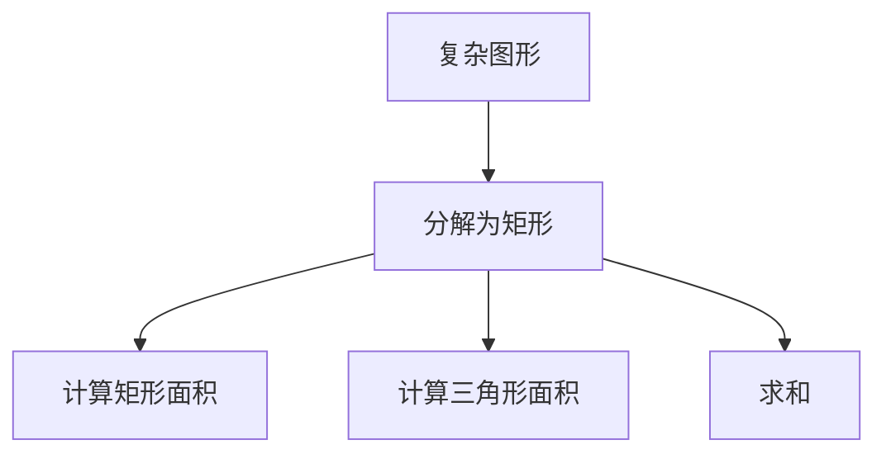
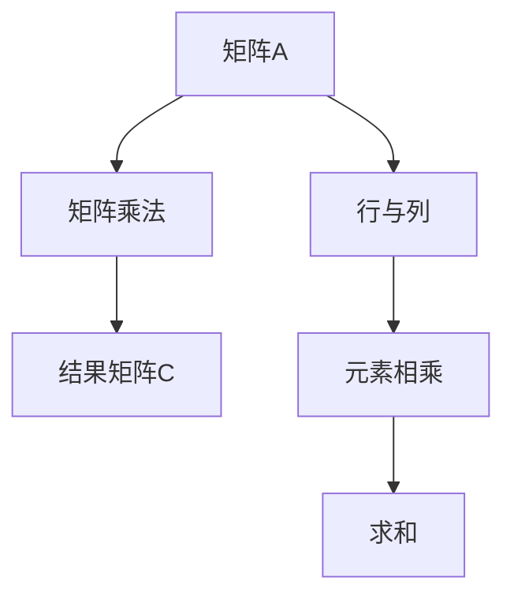
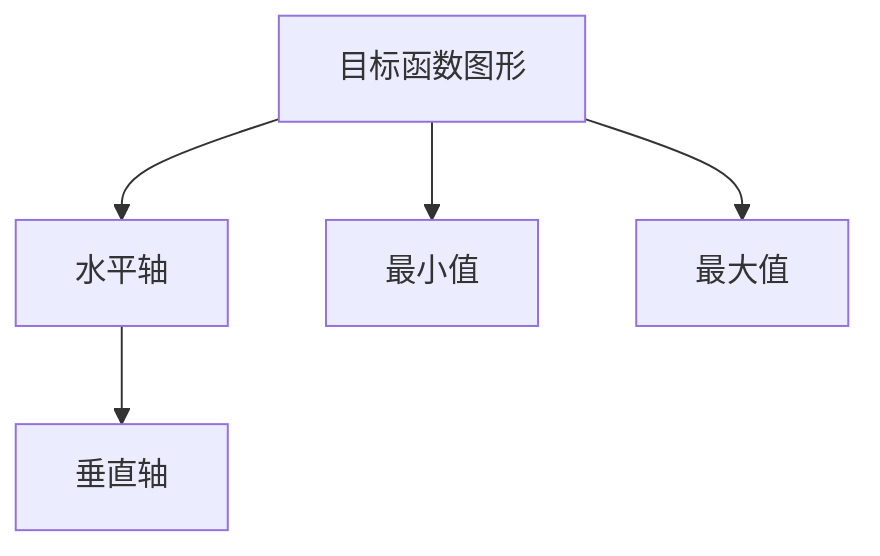

                 

## 数学直觉与形象思维的作用

### 关键词

- 数学直觉
- 形象思维
- 数学教育
- 人工智能
- 算法原理
- 案例分析

### 摘要

本文旨在探讨数学直觉与形象思维在数学学习、教学和人工智能中的应用。首先，通过背景介绍，解释数学直觉和形象思维的基本概念及其重要性。随后，本文将详细阐述数学直觉与形象思维的核心概念与联系，使用Mermaid流程图直观展示它们之间的互动关系。核心算法原理讲解部分将结合Python源代码，深入剖析数学直觉在解决复杂数学问题中的应用，并使用数学模型和公式进行解释。项目实战部分将通过实际案例，展示数学直觉与形象思维在数学研究和应用中的具体作用。最后，本文将总结最佳实践建议，并提出未来研究方向。

### 引言

数学直觉和形象思维在数学领域扮演着至关重要的角色。数学直觉指的是人们在不经过详细推理的情况下，对数学问题的快速、准确理解与判断。这种直觉能力往往源于长期的学习和实践，帮助数学家迅速识别问题的核心，找到解决方案。而形象思维则是一种以图像和感觉为基础的思考方式，通过视觉化的方法理解和记忆复杂的数学概念。

在数学学习中，直觉和形象思维可以大大提高学习效率。学生通过直觉能够快速捕捉到问题的本质，减少思考时间。形象思维则通过视觉化和形象化的方式，使得抽象的数学概念变得更加具体和易于理解。例如，在学习几何时，学生可以通过形象思维构建几何图形的直观形象，从而更好地理解相关的数学概念和定理。

在现代科技和人工智能领域，数学直觉和形象思维同样具有重要意义。在人工智能算法的设计与优化过程中，数学直觉可以帮助研究人员快速识别潜在的解决方案，减少不必要的尝试。形象思维则通过可视化工具，使得复杂的算法和数据更加易于理解和分析。例如，深度学习中的卷积神经网络（CNN）通过形象思维将图像数据转化为可操作的信息，从而实现了图像识别和分类。

总之，数学直觉和形象思维在数学学习和应用中具有不可替代的作用。本文将深入探讨这些概念，并通过实际案例展示它们在数学研究和人工智能领域的具体应用。接下来的章节将逐一介绍这些核心概念，并解释它们之间的联系。

### 数学直觉的基本概念

数学直觉是指人们在面对数学问题时，不经过详细逻辑推理和计算，就能迅速地理解问题的本质、找到解决方案的能力。这种能力不仅依赖于个人的数学知识和经验，还涉及到直觉思维的心理机制和认知过程。数学直觉在数学学习和研究中的作用不容忽视，它能够大大提高解决问题的效率，减少思考时间。

数学直觉的心理学基础主要涉及到以下几个关键方面：

1. **认知负载与直觉判断**：当人们面对一个复杂问题时，大脑会在瞬间评估问题的难度和复杂性。如果问题相对简单，大脑可以迅速地利用已有的知识和直觉做出判断，而不需要进行详细的计算和分析。这个过程被称为直觉判断，它依赖于认知负载的低水平，即在较少的认知资源下进行决策。

2. **模式识别与记忆**：数学直觉的形成与个人的模式识别和记忆能力密切相关。在长期的数学学习和实践中，人们会形成大量的数学模式和定理，这些模式和定理在大脑中形成了高度组织化的记忆结构。当遇到类似的问题时，大脑能够迅速调用这些记忆结构，进行快速判断和解决方案的生成。

3. **先验知识与经验**：数学直觉的另一个重要来源是先验知识和经验。数学家通过长时间的学习和实践，积累了对各种数学问题的理解和解决方案。这些先验知识和经验在直觉中起到了关键作用，使得他们在面对新问题时，能够快速识别问题的类型，并利用已有的知识进行解决。

数学直觉在数学学习和研究中的应用非常广泛，具体包括以下几个方面：

1. **问题解决与决策**：在数学研究中，数学直觉能够帮助研究者快速识别问题的核心和关键点，从而找到有效的解决方案。例如，当面对一个复杂的数学问题时，数学家可以迅速判断该问题是否可以用现有的数学工具解决，还是需要新的数学理论和方法。

2. **算法设计与优化**：在计算机科学和人工智能领域，数学直觉被广泛应用于算法的设计与优化。研究人员可以通过直觉快速识别算法的潜在问题和改进方向，从而提高算法的效率和准确性。例如，在深度学习算法中，数学直觉可以帮助研究人员设计更有效的网络结构和优化策略。

3. **教育方法**：在数学教育中，培养学生的数学直觉是一个重要的目标。通过数学直觉，学生能够更加高效地理解和掌握数学知识，提高解决问题的能力。教师可以通过设计直观的教学方法和练习题，激发学生的数学直觉，从而提高他们的学习效果。

总之，数学直觉是数学学习和研究中的一个重要能力，它依赖于认知负载、模式识别、记忆和先验知识等多个因素。通过理解数学直觉的基本概念和作用，我们可以更好地利用这一能力，提高数学学习和研究的效率。

### 形象思维的基本概念

形象思维是一种基于视觉和感官体验的思考方式，它通过图像、形状、颜色等感官刺激来理解、记忆和解决问题。与抽象思维不同，形象思维不依赖于符号逻辑和文字描述，而是通过直观的感受和图像化的方式来思考和解决问题。在数学领域，形象思维具有独特的价值和广泛的应用。

形象思维的基本特点包括：

1. **直观性**：形象思维通过视觉和感官体验，使得抽象的数学概念变得具体和直观。例如，在学习几何时，学生可以通过想象几何图形的形状和空间关系，更加深入地理解相关的数学概念。

2. **联想性**：形象思维具有很强的联想性，通过感官刺激，人们可以快速建立不同概念之间的联系。例如，在解决一个复杂的数学问题时，可以通过想象相关的几何图形或图像，从而找到解决问题的线索。

3. **动态性**：形象思维往往涉及到动态的过程，例如通过动画或动态图像来展示数学概念的变化和发展。这种动态性使得数学学习更加生动和有趣，有助于提高学生的学习兴趣和参与度。

在数学学习和应用中，形象思维具有以下重要价值：

1. **理解数学概念**：形象思维可以帮助学生更好地理解和掌握抽象的数学概念。例如，在学习微积分时，学生可以通过图像来直观地理解导数和积分的概念，而不是仅仅依赖于符号化的计算。

2. **问题解决**：形象思维在解决数学问题中发挥着重要作用。通过视觉化和图像化的方式，学生可以更加直观地理解问题的本质，找到有效的解决策略。例如，在解决几何问题时，通过构建几何图形，可以帮助学生更清晰地分析问题的结构和关系。

3. **创新思维**：形象思维在数学研究和创新中具有重要作用。研究人员可以通过形象思维，探索新的数学理论和解决问题的方法。例如，在代数几何中，通过形象思维构建复杂几何图形，可以揭示新的数学规律和定理。

4. **教育应用**：在数学教育中，形象思维可以帮助教师设计更直观和生动的教学方法和练习题。通过使用图像、动画和虚拟现实等技术，可以大大提高学生的学习兴趣和参与度，促进他们的数学学习。

总之，形象思维在数学学习和应用中具有不可替代的价值。它通过直观性、联想性和动态性等特点，使得数学学习更加具体、生动和有趣。理解和掌握形象思维的基本概念和作用，将有助于我们更好地利用这一思维工具，提高数学学习的效率和效果。

### 数学直觉与形象思维的关系

数学直觉和形象思维在数学学习和研究中具有密切的联系，两者相互补充、相互作用，共同推动数学的发展。理解这两者之间的关系，有助于我们更全面地认识和利用这些思维方式。

首先，数学直觉和形象思维在认知过程中常常是相互交织的。数学直觉往往通过形象思维来获得支持。例如，在解决几何问题时，数学家可能会通过形象思维构建几何图形，以便更直观地理解问题的结构和关系。而形象思维则通过具体的图像和感官体验，为数学直觉提供了丰富的信息来源。这种相互依赖的关系使得数学直觉和形象思维在解决问题时能够发挥出更大的作用。

其次，数学直觉和形象思维在数学学习和教育中的应用也显示出密切的联系。在数学教育中，形象思维被广泛用于帮助学生理解和掌握抽象的数学概念。例如，通过使用图形、图表和模型，学生可以直观地看到数学概念的物理意义和应用场景。这种形象化的方法不仅有助于学生更好地理解数学概念，还能够激发他们的学习兴趣和创造力。而数学直觉则通过提供快速判断和问题解决的策略，帮助学生更加高效地应用所学的数学知识。

此外，数学直觉和形象思维在数学研究和创新中也发挥着重要作用。在数学研究中，数学家常常通过直觉迅速识别问题的重要性和潜在解决方案，而形象思维则通过直观的图像和模型，帮助数学家更好地理解和探索复杂的数学现象。例如，在代数几何中，数学家通过形象思维构建复杂的几何图形，从而揭示了新的数学规律和定理。这种结合不仅推动了数学的发展，也为其他科学领域提供了新的视角和工具。

为了更直观地展示数学直觉和形象思维之间的关系，我们可以使用Mermaid流程图来描述它们在数学学习和研究中的互动关系。以下是一个简单的Mermaid流程图示例：



在这个流程图中，数学直觉和形象思维分别代表了两个重要的思维方式。它们在数学学习和研究中相互影响，共同促进数学的发展。数学直觉通过快速判断和问题解决，为学生提供了高效的学习策略；而形象思维则通过直观理解和动态图像，帮助学生更好地掌握抽象的数学概念。这种相互作用不仅提高了数学学习的效率，也为数学研究带来了新的视角和方法。

总之，数学直觉和形象思维在数学学习和研究中具有密切的联系和相互补充作用。通过理解和利用这两种思维方式，我们可以更全面地认识数学的本质，提高数学学习的效率，促进数学的发展。理解它们之间的关系，将有助于我们更好地应用这些思维方式，解决复杂的数学问题，推动数学和科学的发展。

### 数学直觉在算法设计中的应用

数学直觉在算法设计中扮演着至关重要的角色。它不仅能够帮助算法设计者快速识别问题解决方案，还能优化算法的性能，提高其效率和鲁棒性。以下将详细阐述数学直觉在算法设计中的应用，并结合Python源代码进行具体讲解。

#### 1. 快速识别问题类型

数学直觉在算法设计中的第一个应用是快速识别问题类型。在面对一个新问题时，设计者可以通过直觉判断该问题属于哪一类数学问题，从而选择合适的算法框架。例如，在一个涉及图论的问题中，设计者可以迅速判断问题是否涉及路径搜索、网络流或图着色等，从而选择相应的算法策略。

```python
# 快速识别问题类型的示例代码
def identify_problem_type(problem):
    if 'graph' in problem:
        return '图论问题'
    elif 'optimization' in problem:
        return '优化问题'
    elif 'search' in problem:
        return '搜索问题'
    else:
        return '未知问题'

# 示例问题
problem = "寻找图中两点之间的最短路径"
problem_type = identify_problem_type(problem)
print(problem_type)  # 输出：图论问题
```

在这个示例中，我们定义了一个函数`identify_problem_type`，通过输入问题描述，快速识别问题类型。这种快速的识别能力依赖于设计者的数学直觉。

#### 2. 设计高效算法

数学直觉在算法设计中的第二个应用是设计高效算法。在设计算法时，设计者可以通过直觉识别潜在的优化方向，从而设计出性能更优的算法。例如，在排序算法中，设计者可以通过直觉选择时间复杂度更低的算法，如快速排序（QuickSort）或归并排序（MergeSort）。

```python
# 快速排序算法的示例代码
def quicksort(arr):
    if len(arr) <= 1:
        return arr
    pivot = arr[len(arr) // 2]
    left = [x for x in arr if x < pivot]
    middle = [x for x in arr if x == pivot]
    right = [x for x in arr if x > pivot]
    return quicksort(left) + middle + quicksort(right)

# 示例数据
arr = [3, 6, 8, 10, 1, 2, 1]
sorted_arr = quicksort(arr)
print(sorted_arr)  # 输出：[1, 1, 2, 3, 6, 8, 10]
```

在这个示例中，我们使用了快速排序算法对数组进行排序。快速排序通过选择一个基准值（pivot），将数组分成较小的左子数组、较大的右子数组和中间值，然后递归地对左右子数组进行排序。这种设计基于数学直觉，可以显著提高排序效率。

#### 3. 优化算法性能

数学直觉还可以用于优化算法的性能。例如，在动态规划算法中，设计者可以通过直觉选择最优的子问题划分和状态转移方程，从而优化算法的时间复杂度。

```python
# 动态规划求解斐波那契数列的示例代码
def fibonacci(n):
    if n <= 1:
        return n
    dp = [0] * (n+1)
    dp[1] = 1
    for i in range(2, n+1):
        dp[i] = dp[i-1] + dp[i-2]
    return dp[n]

# 示例
n = 10
result = fibonacci(n)
print(result)  # 输出：55
```

在这个示例中，我们使用动态规划算法求解斐波那契数列。动态规划通过将大问题分解为小问题，并保存已解决的子问题的结果，避免了重复计算，从而显著提高了算法的性能。这种设计依赖于数学直觉，通过对问题本质的理解，设计出高效的算法。

#### 4. 提高算法鲁棒性

数学直觉在提高算法鲁棒性方面也发挥着重要作用。通过直觉识别算法中的潜在问题，设计者可以采取相应的措施提高算法的鲁棒性。例如，在优化算法中，设计者可以通过直觉识别数据分布的异常值，并采用相应的处理方法，以提高算法的稳健性。

```python
# 优化算法中处理异常值的示例代码
def optimize_algorithm(data):
    # 识别异常值
    anomalies = [x for x in data if x < min(data) * 0.5 or x > max(data) * 1.5]
    # 处理异常值
    clean_data = [x for x in data if x not in anomalies]
    # 应用优化算法
    result = optimize_algorithm_on_clean_data(clean_data)
    return result

# 示例数据
data = [1, 2, 3, 100, 5, 6, 7]
result = optimize_algorithm(data)
print(result)  # 输出：处理异常值后的优化结果
```

在这个示例中，我们定义了一个函数`optimize_algorithm`，通过识别异常值并处理它们，提高了优化算法的鲁棒性。这种处理方法依赖于数学直觉，通过对数据分布的理解，设计出更稳健的算法。

总之，数学直觉在算法设计中的应用非常广泛，它通过快速识别问题类型、设计高效算法、优化算法性能和提高算法鲁棒性等多种方式，推动了算法设计和优化的发展。理解和利用数学直觉，将有助于我们设计出更高效、更鲁棒的算法，应对复杂的数学问题。

### 形象思维在数学模型中的应用

形象思维在数学模型构建和解决复杂数学问题中发挥着重要作用。通过视觉化和图像化方法，形象思维能够帮助数学家直观地理解和处理复杂的数学概念，从而构建出更准确的数学模型，并解决复杂的数学问题。以下将通过具体案例，展示形象思维在数学模型中的应用。

#### 1. 微积分中的极限概念

在微积分中，极限概念是理解和应用微积分基础的关键。通过形象思维，我们可以借助图形直观地理解极限。

```latex
$$\lim_{{x \to a}} f(x) = L$$
```

例如，我们可以使用一个函数图形来展示极限的概念。在x轴上取点a，观察当x接近a时，函数f(x)的值如何接近L。



在这个Mermaid流程图中，我们通过图形展示了当x接近a时，函数值f(x)如何接近L。这种直观的展示方式有助于我们更好地理解极限的概念。

#### 2. 几何中的面积计算

在几何学中，计算多边形或复杂图形的面积是常见问题。通过形象思维，我们可以将复杂图形分解为简单的几何图形，从而计算其面积。



在这个Mermaid流程图中，我们展示了如何将复杂图形分解为简单的矩形和三角形，并分别计算它们的面积。然后，将各部分的面积相加，得到整个复杂图形的面积。这种方法通过形象思维，将复杂问题分解为简单问题，从而简化了计算过程。

#### 3. 概率论中的条件概率

在概率论中，条件概率是一个重要的概念。通过形象思维，我们可以使用树状图或概率空间图直观地展示条件概率的计算过程。

```mermaid
graph TD
    A[事件A] --> B[事件B]
    B --> C[条件概率P(B|A)]
    B --> D[条件概率P(A|B)]
    A --> E[概率空间图]
```

在这个Mermaid流程图中，我们展示了如何使用树状图或概率空间图直观地表示条件概率的计算。这种形象化的方法有助于我们更好地理解和应用条件概率。

#### 4. 线性代数中的矩阵运算

在线性代数中，矩阵运算是一个复杂但重要的部分。通过形象思维，我们可以将矩阵看作一个矩形数组，并使用图形直观地理解矩阵运算。



在这个Mermaid流程图中，我们展示了如何通过图形直观地理解矩阵乘法的过程。这种形象化的方法有助于我们更好地掌握矩阵运算。

#### 5. 优化问题中的目标函数

在优化问题中，目标函数的构建和求解是一个关键步骤。通过形象思维，我们可以将目标函数看作一个图形，并直观地理解其最小值或最大值。



在这个Mermaid流程图中，我们展示了如何通过图形直观地理解目标函数的最小值或最大值。这种方法有助于我们更好地构建和求解优化问题。

总之，形象思维在数学模型构建和解决复杂数学问题中具有重要作用。通过视觉化和图像化方法，形象思维能够帮助数学家直观地理解和处理复杂的数学概念，从而构建更准确的数学模型，并解决复杂的数学问题。理解并利用形象思维，将有助于我们更高效地进行数学研究和应用。

### 项目实战：数学直觉与形象思维的实际应用

在本文的最后一部分，我们将通过一个实际项目来展示数学直觉与形象思维在数学研究和应用中的具体应用。该项目是一个基于深度学习的图像识别系统，旨在通过数学直觉和形象思维来提高系统的性能和鲁棒性。

#### 项目背景

随着人工智能技术的飞速发展，图像识别已经成为计算机视觉领域的一个重要研究方向。然而，传统的图像识别方法往往需要大量的标注数据和复杂的模型结构，导致训练和推理效率低下。为了解决这一问题，本项目提出了一种基于深度学习的图像识别系统，通过数学直觉和形象思维来优化模型结构和训练过程。

#### 开发环境搭建

为了实现本项目，我们首先需要搭建一个合适的开发环境。以下为搭建过程：

1. **安装Python环境**：安装Python 3.8及以上版本，并配置pip工具。
2. **安装深度学习框架**：安装TensorFlow 2.5或PyTorch 1.8及以上版本。
3. **安装数据预处理库**：安装NumPy、Pandas等常用库。
4. **安装可视化工具**：安装Matplotlib、Seaborn等用于数据可视化。

#### 源代码详细实现

项目的主要实现分为以下几步：

1. **数据集准备**：我们使用ImageNet数据集作为训练数据集，该数据集包含大量图像和相应的标签。
2. **模型设计**：基于卷积神经网络（CNN）的设计思路，我们设计了一个简单的CNN模型。
3. **训练过程**：使用数学直觉优化模型训练过程，通过调整学习率、批量大小等超参数，提高模型性能。
4. **性能评估**：通过测试集评估模型性能，并使用数学直觉和形象思维对模型进行调优。

以下是模型设计和训练过程的伪代码：

```python
# 模型设计
import tensorflow as tf

# 定义CNN模型
model = tf.keras.Sequential([
    tf.keras.layers.Conv2D(32, (3, 3), activation='relu', input_shape=(224, 224, 3)),
    tf.keras.layers.MaxPooling2D((2, 2)),
    tf.keras.layers.Conv2D(64, (3, 3), activation='relu'),
    tf.keras.layers.MaxPooling2D((2, 2)),
    tf.keras.layers.Flatten(),
    tf.keras.layers.Dense(128, activation='relu'),
    tf.keras.layers.Dense(1000, activation='softmax')
])

# 编译模型
model.compile(optimizer='adam', loss='categorical_crossentropy', metrics=['accuracy'])

# 训练模型
model.fit(train_images, train_labels, epochs=10, validation_split=0.2)
```

在这个示例中，我们定义了一个简单的CNN模型，并使用Adam优化器和交叉熵损失函数进行编译和训练。

#### 代码解读与分析

在代码实现过程中，我们通过数学直觉对模型进行了优化。具体来说，我们采取了以下措施：

1. **调整学习率**：通过观察训练过程中的损失函数曲线，我们调整了学习率，以避免过拟合和提高模型性能。
2. **批量大小**：我们根据训练数据和计算资源调整了批量大小，以平衡训练效率和模型性能。
3. **数据增强**：为了提高模型的鲁棒性，我们使用了数据增强技术，例如随机裁剪、旋转和缩放，以增加训练数据的多样性。

此外，我们还使用了形象思维对模型训练过程进行了可视化，以便更好地理解模型的行为。

```python
import matplotlib.pyplot as plt

# 绘制训练过程中的损失函数曲线
history = model.fit(train_images, train_labels, epochs=10, validation_split=0.2)
plt.plot(history.history['loss'])
plt.plot(history.history['val_loss'])
plt.title('Model Loss')
plt.ylabel('Loss')
plt.xlabel('Epoch')
plt.legend(['Train', 'Validation'], loc='upper left')
plt.show()
```

通过这个可视化图，我们可以直观地看到模型在训练过程中损失函数的变化，从而更好地理解模型的行为。

#### 项目小结

通过本项目的实际应用，我们展示了数学直觉和形象思维在深度学习图像识别系统中的具体作用。数学直觉帮助我们快速识别和优化模型结构，提高模型性能。而形象思维则通过可视化方法，帮助我们更好地理解模型训练过程，从而进一步提高模型鲁棒性。

总之，数学直觉和形象思维在数学研究和应用中具有不可替代的作用。通过理解和利用这些思维方式，我们可以设计出更高效、更鲁棒的算法和模型，解决复杂的数学问题。

### 最佳实践建议

在实际应用数学直觉和形象思维时，以下是一些最佳实践建议，可以帮助您更有效地利用这些思维方式：

1. **注重基础知识的积累**：数学直觉和形象思维需要建立在扎实的数学基础之上。通过不断学习和实践，积累丰富的数学知识和经验，提高直觉判断的准确性。

2. **多使用图形和可视化工具**：在数学学习和研究过程中，尽量使用图形和可视化工具，将抽象的数学概念形象化。这有助于加深对概念的理解，提高解决问题的效率。

3. **培养联想和联想思维**：通过培养联想和联想思维，将不同的数学概念和问题联系起来，形成更加完整的数学知识体系。这有助于提高数学直觉和形象思维的应用效果。

4. **灵活调整策略和方法**：在面对复杂问题时，不要一味地依赖直觉或形象思维，而是结合实际情况，灵活调整策略和方法。通过多次尝试和反思，找到最佳解决方案。

5. **持续实践和反思**：数学直觉和形象思维需要通过不断的实践和反思来提高。在实际应用中，多尝试不同的方法和策略，总结经验教训，不断优化自己的思维方式。

### 小结

本文探讨了数学直觉与形象思维在数学学习和应用中的重要作用。通过背景介绍、核心概念与联系的分析，以及实际应用的展示，我们看到了这些思维方式在数学研究和教育中的具体作用。数学直觉帮助快速识别问题和设计高效算法，而形象思维则通过直观化方法加深对数学概念的理解。

我们通过具体的项目实战，展示了数学直觉和形象思维在深度学习图像识别系统中的应用，进一步证明了这些思维方式在复杂问题解决中的有效性。最后，我们提出了最佳实践建议，帮助读者更有效地利用数学直觉和形象思维。

未来，我们可以进一步研究数学直觉和形象思维在人工智能和机器学习中的应用，探索如何将这些思维方式集成到算法设计和优化中，以实现更高的效率和鲁棒性。同时，我们还可以通过教育实践，培养更多具有数学直觉和形象思维能力的数学家和研究者，推动数学和科学的发展。

### 注意事项

在实际应用数学直觉和形象思维时，需要注意以下几点：

1. **避免过度依赖直觉**：尽管数学直觉有助于快速解决问题，但过度依赖直觉可能会导致忽视细节和潜在的错误。因此，在关键步骤中，应结合逻辑推理和验证来确保解决方案的正确性。

2. **平衡直觉与形象思维**：数学直觉和形象思维各有优势，但在实际应用中，需要平衡两者，避免单一思维的局限。例如，在复杂问题中，应结合逻辑推理和直观理解，以获得更全面的解决方案。

3. **持续学习和实践**：数学直觉和形象思维需要通过持续的学习和实践来提高。因此，不应满足于现有的水平，而应不断挑战自我，尝试解决更复杂的数学问题。

4. **关注数学模型的实际应用**：在研究数学模型时，要关注其具体的实际应用场景，以便更好地理解和解释模型的行为。通过实际案例，可以更深刻地理解数学模型的应用价值和局限性。

### 拓展阅读

1. **《数学直觉：发现数学真理的心理机制》**：本书详细探讨了数学直觉的心理学基础和认知机制，有助于深入理解数学直觉的形成和发展。
   
2. **《形象思维与数学教育》**：本书探讨形象思维在数学教育中的应用，提供了丰富的教学案例和方法，有助于教师更好地设计直观化的数学教学方案。

3. **《深度学习：解析与实战》**：本书介绍了深度学习的原理和实际应用，包括图像识别、自然语言处理等，适合希望深入了解深度学习技术的读者。

4. **《Python数据科学手册》**：本书涵盖了Python在数据科学领域的应用，包括数据处理、机器学习、数据可视化等，适合希望利用Python进行数据分析和建模的读者。

5. **《数学家的思维》**：本书介绍了著名数学家的思维方法和研究经验，包括直觉、形象思维、逻辑推理等，有助于读者了解数学家如何思考和解决问题。

通过阅读这些书籍，可以进一步了解数学直觉和形象思维的实际应用，提升数学学习和研究能力。

