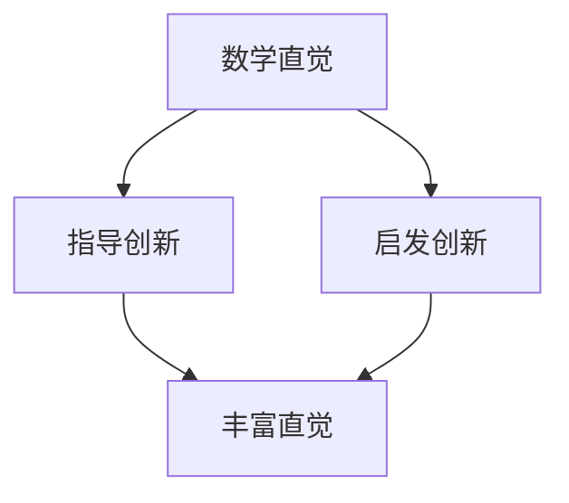

                 

### 引言

数学直觉与数学创新，作为数学发展进程中的重要概念，长期以来受到数学家和研究者的广泛关注。数学直觉，指的是人们在不经过严格逻辑推理的情况下，对数学问题的直接理解和洞察；而数学创新，则是指在现有理论基础上，通过新的思维和方法，发现或提出新的数学理论、方法和结果。这两者之间的关系，既相互独立又相互依存，构成了数学发展的核心动力。

本文将围绕数学直觉与数学创新的关系展开讨论，首先介绍两者的基本概念，然后分析它们的发展历程，接着深入探讨它们之间的关系，并通过具体案例展示其应用与实践，最后进行总结与展望。本文的关键词包括：数学直觉、数学创新、关系分析、发展历程、应用与实践。

关键词：数学直觉、数学创新、关系分析、发展历程、应用与实践

摘要：本文旨在探讨数学直觉与数学创新之间的关系，通过对其基本概念、发展历程和相互关系的深入分析，揭示数学直觉在数学创新中的重要作用，并探讨数学创新对数学直觉发展的推动作用。通过具体案例的应用与实践，本文进一步展示了数学直觉与数学创新在实际数学问题解决中的价值。文章最后对未来的发展趋势进行了展望，提出了进一步研究的方向。

### 数学直觉

数学直觉是一种高度抽象和综合性的认知能力，它不仅涉及对数学概念和公式的直接理解，还包括对数学问题的快速识别和解决能力。数学直觉并非凭空产生，而是在长期的数学学习和实践中逐渐培养和发展起来的。例如，一个数学家在解决一个复杂问题时，可能不需要经过详细的推理过程，就能迅速找到问题的关键，并提出有效的解决方案。

数学直觉的特征主要体现在以下几个方面：

1. **快速性**：数学直觉能够迅速地对数学问题进行判断和解决，大大节省了思考时间。
2. **准确性**：数学直觉能够准确地把握数学问题的本质，避免走弯路。
3. **抽象性**：数学直觉能够抽象出数学问题的核心，从而简化问题的复杂性。
4. **综合性**：数学直觉能够将各种数学知识进行整合，形成新的理解和发现。

数学直觉的发展历程可以追溯到古代数学家的实践和思考。例如，欧几里得的《几何原本》中就充满了数学直觉的应用，他通过简单的公理和定义，建立了完整的几何体系。在现代数学中，数学直觉仍然发挥着重要作用。例如，在数论、代数、拓扑等众多领域，数学家们通过直觉，发现了许多重要的数学问题和理论。

数学直觉在数学问题解决中的重要作用不可忽视。它不仅能够帮助数学家快速找到问题的解决方案，还能够启发新的数学思想和理论。例如，在解决“四色定理”的过程中，数学家们通过直觉，提出了新的证明思路，最终成功解决了这个难题。

### 数学创新

数学创新是指通过新的思维和方法，对现有数学理论和方法进行改进和发展，从而提出新的数学理论、方法和结果。数学创新是数学发展的核心动力，它推动了数学的进步，为科学和技术的发展提供了坚实的数学基础。

数学创新的特征主要包括：

1. **突破性**：数学创新往往能够突破现有的理论框架，提出全新的数学理论和方法。
2. **挑战性**：数学创新需要克服巨大的困难和挑战，往往需要长期的积累和思考。
3. **创造性**：数学创新需要丰富的想象力、创新思维和卓越的数学能力。
4. **应用性**：数学创新的理论和方法往往具有广泛的应用价值，能够推动科学和技术的进步。

数学创新的发展历程可以追溯到古代数学家的探索和发现。例如，阿基米德通过数学创新，发现了浮力原理和杠杆原理，为物理学的发展奠定了基础。在现代数学中，数学创新更是层出不穷。例如，哥德尔的不完备性定理、费马的最后定理、陈景润的素数定理等，都是数学创新的杰出代表。

数学创新的重要性体现在以下几个方面：

1. **推动数学发展**：数学创新不断拓展数学的边界，推动数学理论和方法的发展。
2. **促进科技进步**：数学创新为科学和技术的进步提供了坚实的数学基础，推动了各种科技应用的实现。
3. **培养创新能力**：数学创新需要创造性思维和解决问题的能力，这对培养创新人才具有重要意义。

### 数学直觉与数学创新的关系

数学直觉与数学创新之间的关系复杂而紧密，它们相互促进、相互依存，共同推动了数学的发展。

首先，数学直觉是数学创新的重要基础。数学直觉能够帮助数学家快速识别和理解数学问题，从而为数学创新提供方向和灵感。例如，在解决“四色定理”的过程中，数学家们通过直觉，提出了多种证明思路，最终成功解决了这个难题。此外，数学直觉还能够帮助数学家在复杂的情况下，迅速找到问题的核心，从而提高数学创新的效率。

其次，数学创新对数学直觉的发展具有重要推动作用。数学创新不断拓展数学的边界，提出新的数学理论和方法，这为数学直觉的发展提供了丰富的素材和背景。通过数学创新，数学家们能够不断深化对数学问题的理解，提高数学直觉的准确性。例如，在数论领域，数学创新提出的新理论和方法，使得数学家们能够更深入地理解素数的分布规律，从而提高了他们的数学直觉。

此外，数学直觉与数学创新之间还存在互动机制。数学直觉能够引导数学创新，而数学创新又能够丰富和提升数学直觉。例如，在解决一个复杂问题时，数学家可能需要通过数学直觉来识别问题的核心，然后通过数学创新提出新的解决方案。而在这一过程中，数学直觉和数学创新相互促进，共同推动了数学的发展。

为了更好地理解数学直觉与数学创新之间的关系，我们可以用Mermaid流程图来表示它们之间的互动机制：

在这个流程图中，数学直觉通过指导创新和启发创新，推动了数学创新的发展。同时，数学创新通过丰富和提升数学直觉，促进了数学直觉的进步。

### 数学直觉与数学创新的应用与实践

数学直觉与数学创新不仅在理论上具有重要意义，它们在实际应用中也展现了强大的力量。以下是一些具体的应用案例。

#### 1. 数学直觉在数学问题解决中的应用

数学直觉在数学问题的解决中起到了至关重要的作用。例如，在解决“费马大定理”的过程中，安德鲁·怀尔斯通过直觉，提出了新的证明思路，最终成功解决了这个困扰数学界超过350年的难题。他的直觉帮助他在复杂的证明过程中找到了关键，避免了不必要的弯路。

#### 2. 数学创新在数学理论发展中的应用

数学创新推动了数学理论的发展，例如，在代数几何领域，数学家们通过创新，提出了新的理论和方法，极大地丰富了代数几何的内容。这些创新不仅推动了数学理论的发展，也为其他领域提供了重要的数学工具。

#### 3. 数学直觉与数学创新在实际项目中的应用

在工程和科学领域，数学直觉与数学创新的应用更加广泛。例如，在计算机科学领域，数学直觉帮助计算机科学家设计出更高效的数据结构和算法。而数学创新则推动了计算机科学的理论和方法的发展，为人工智能、大数据等领域的应用提供了坚实的数学基础。

#### 案例分析

以下是一个具体的案例分析，展示数学直觉与数学创新在实际项目中的应用。

**案例：人工智能中的神经网络设计**

在人工智能领域，神经网络的设计是一个复杂的任务，需要数学直觉和数学创新的支持。

1. **数学直觉的应用**：计算机科学家通过直觉，能够快速识别神经网络中的问题，并提出改进方案。例如，在优化神经网络参数时，科学家们通过直觉，提出了多种优化策略，如梯度下降法、动量法等，提高了神经网络的学习效率。

2. **数学创新的应用**：数学创新推动了神经网络的理论和方法的发展。例如，深度学习的兴起，是数学创新的重要成果。深度学习通过多层神经网络，实现了对复杂数据的高效处理，推动了人工智能的发展。

### 总结与展望

数学直觉与数学创新是数学发展的两个重要方面，它们相互促进、相互依存，共同推动了数学的进步。通过本文的讨论，我们可以看到，数学直觉在数学创新中起到了基础性的作用，而数学创新又为数学直觉提供了丰富的素材和背景。

未来，随着数学理论的不断发展和应用需求的不断增长，数学直觉与数学创新之间的关系将会更加紧密。我们期待更多的数学家能够通过数学直觉，发现新的数学问题，并通过数学创新，提出新的数学理论和方法，推动数学的发展。

对于未来的研究方向，我们建议：

1. **深入探索数学直觉的机制**：研究数学直觉的形成机制，揭示其背后的认知原理。
2. **加强数学直觉与数学创新的交叉研究**：将数学直觉与数学创新结合起来，推动数学理论和方法的发展。
3. **应用数学直觉与数学创新解决实际问题**：将数学直觉与数学创新应用于实际问题，如人工智能、大数据等领域，推动科学和技术的进步。

作者：AI天才研究院/AI Genius Institute & 禅与计算机程序设计艺术 /Zen And The Art of Computer Programming

